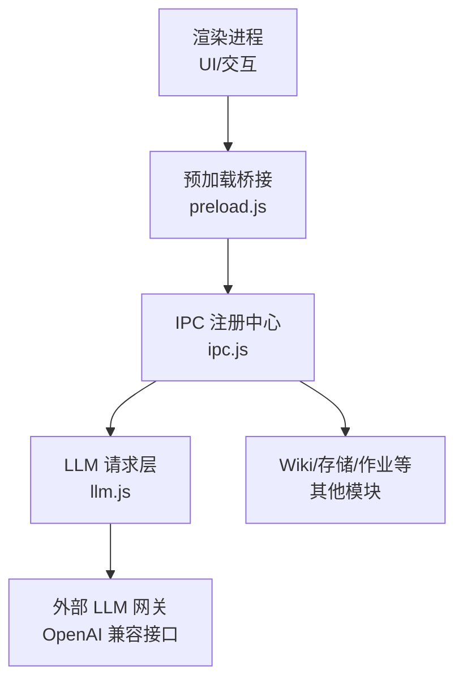
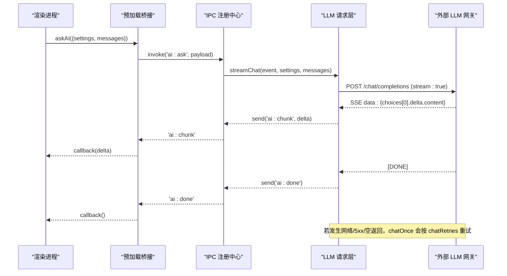
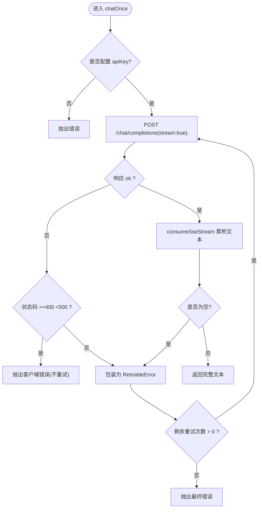
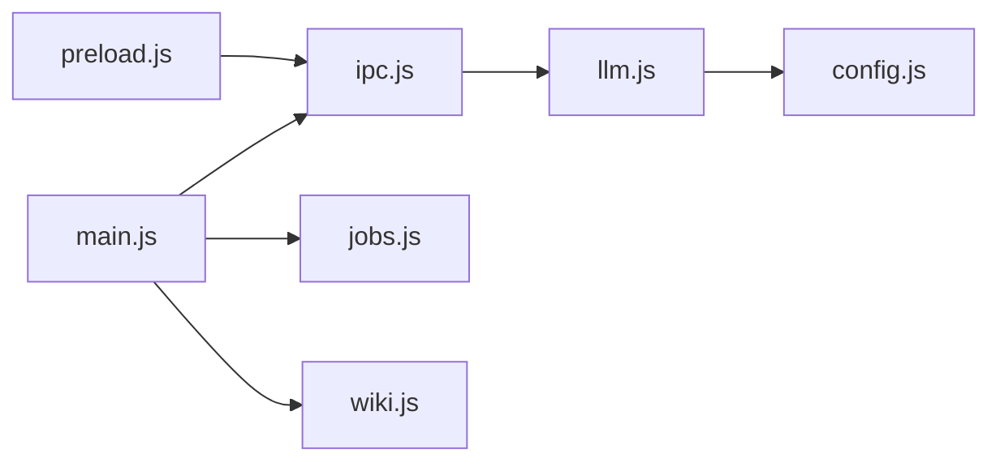

# AI 服务接口

<cite>
**本文引用的文件**
- [llm.js](file://src/main/llm.js)
- [ipc.js](file://src/main/ipc.js)
- [preload.js](file://preload.js)
- [config.js](file://src/main/config.js)
- [main.js](file://main.js)
- [index.html](file://src/index.html)
- [app.js](file://src/app.js)
- [package.json](file://package.json)
</cite>

## 目录
1. [简介](#简介)
2. [项目结构](#项目结构)
3. [核心组件](#核心组件)
4. [架构总览](#架构总览)
5. [详细组件分析](#详细组件分析)
6. [依赖关系分析](#依赖关系分析)
7. [性能与限流建议](#性能与限流建议)
8. [故障排查指南](#故障排查指南)
9. [结论](#结论)
10. [附录：请求响应示例与错误处理](#附录请求响应示例与错误处理)

## 简介
本文件面向“AI 服务接口”的集成与使用，覆盖大语言模型（LLM）在应用中的调用方式、流式聊天完成、上下文构建、错误重试机制、API 密钥管理、请求限流策略、不同模型的参数配置与能力差异说明，以及性能优化与最佳实践。该实现基于 OpenAI 兼容接口，支持通过 Base URL 切换至其他兼容提供商（如 DeepSeek、通义千问、Ollama 等）。

## 项目结构
- 主进程入口负责窗口创建、模块装配与 IPC 注册。
- LLM 请求层封装了 OpenAI 兼容接口的流式 SSE 解析与重试逻辑。
- IPC 注册中心将渲染进程的调用映射到主进程业务模块。
- 预加载脚本向渲染进程暴露安全的 API 桥接方法。
- 设置界面提供 Base URL、API Key、模型名称、重试次数等配置项。

图表来源
- [main.js:1-56](file://main.js#L1-L56)
- [ipc.js:1-109](file://src/main/ipc.js#L1-L109)
- [llm.js:1-123](file://src/main/llm.js#L1-L123)
- [preload.js:1-56](file://preload.js#L1-L56)

章节来源
- [main.js:1-56](file://main.js#L1-L56)
- [package.json:1-45](file://package.json#L1-L45)

## 核心组件
- LLM 请求层（llm.js）
  - 流式对话：streamChat(event, settings, messages)，以 SSE 增量推送 ai:chunk，完成后发送 ai:done，异常发送 ai:error。
  - 非流式对话：chatOnce(settings, messages, retries)，内部以 stream:true 接收并累积全文，支持可重试错误自动重试。
  - SSE 解析：consumeSseStream(resp, onDelta) 逐行解析 data: 增量。
  - JSON 提取：extractJson(text) 容忍代码块包裹与前后杂质。
- IPC 注册中心（ipc.js）
  - 暴露 ai:ask 用于流式问答；转发事件 ai:chunk / ai:done / ai:error。
- 预加载桥接（preload.js）
  - 暴露 askAI、onAiChunk、onAiDone、onAiError 给渲染进程。
- 配置工具（config.js）
  - num/pick 辅助读取数值/枚举配置，带默认值与范围钳制。
- 设置界面（index.html）
  - 提供 Base URL、API Key、模型名称、失败重试次数等配置输入。

章节来源
- [llm.js:1-123](file://src/main/llm.js#L1-L123)
- [ipc.js:1-109](file://src/main/ipc.js#L1-L109)
- [preload.js:1-56](file://preload.js#L1-L56)
- [config.js:1-18](file://src/main/config.js#L1-L18)
- [index.html:100-154](file://src/index.html#L100-L154)

## 架构总览
渲染进程通过 preload 暴露的 kb.askAI 发起流式问答，IPC 路由到主进程的 llm.streamChat，后者以 fetch 调用 OpenAI 兼容接口，并通过 SSE 流逐步返回增量内容。错误与完成信号通过 ipcMain.send 回传到渲染进程。

图表来源
- [ipc.js:45-46](file://src/main/ipc.js#L45-L46)
- [llm.js:39-77](file://src/main/llm.js#L39-L77)
- [llm.js:79-110](file://src/main/llm.js#L79-L110)
- [preload.js:9-25](file://preload.js#L9-L25)

## 详细组件分析

### LLM 请求层（llm.js）
- 流式对话 streamChat
  - 从 settings 中读取 apiBaseUrl、apiKey、model。
  - 未配置 apiKey 时直接上报 ai:error。
  - 使用 fetch 以 stream:true 发起请求，解析 SSE 增量并回调 ai:chunk。
  - 流结束后发送 ai:done；读取异常发送 ai:error。
- 非流式对话 chatOnce
  - 统一以 stream:true 发起，避免网关超时问题。
  - 对 4xx 客户端错误直接抛出（不重试），5xx/网络/空返回视为 RetriableError 并递归重试。
  - 重试次数由 settings.chatRetries 控制，默认 1，范围 0-5。
- SSE 解析 consumeSseStream
  - 使用 ReadableStream + TextDecoder 逐行解析 data: 行。
  - 忽略无法解析的行与 [DONE] 标记。
- JSON 提取 extractJson
  - 去除代码块包裹与前后空白，定位首尾 {} 后解析。

图表来源
- [llm.js:79-110](file://src/main/llm.js#L79-L110)

章节来源
- [llm.js:1-123](file://src/main/llm.js#L1-L123)

### IPC 与预加载桥接
- IPC 注册中心
  - ai:ask 将渲染进程的请求委托给 llm.streamChat。
  - 其他 Wiki/作业相关接口在此集中注册。
- 预加载桥接
  - 暴露 askAI、onAiChunk、onAiDone、onAiError，供渲染进程订阅流式事件。

章节来源
- [ipc.js:45-46](file://src/main/ipc.js#L45-L46)
- [preload.js:9-25](file://preload.js#L9-L25)

### 配置与设置
- 设置项（来自 index.html 与 app.js 状态）
  - apiBaseUrl：接口地址，默认 https://api.openai.com/v1。
  - apiKey：鉴权令牌。
  - model：模型名称，默认 gpt-4o-mini。
  - chatRetries：失败重试次数，默认 1，范围 0-5。
  - urlFetchTimeout：网页拉取超时（秒）。
  - sourceMaxChars：来源内容截断阈值（字符）。
  - wikiAskMaxPages：Wiki 问答最大引用页数。
  - logTailLines：日志展示行数。
  - defaultEditorMode：编辑器默认模式。
- 配置工具
  - config.num 对数值进行四舍五入与范围钳制。
  - config.pick 对枚举进行合法取值校验。

章节来源
- [index.html:112-154](file://src/index.html#L112-L154)
- [config.js:1-18](file://src/main/config.js#L1-L18)
- [app.js:1-22](file://src/app.js#L1-L22)

## 依赖关系分析
- main.js 初始化应用、数据库、作业与 IPC。
- ipc.js 作为中央路由，分发到各业务模块（llm、wiki、jobs 等）。
- llm.js 依赖 config.js 的配置解析工具。
- 预加载脚本仅暴露最小必要 API，保证安全隔离。

图表来源
- [main.js:1-56](file://main.js#L1-L56)
- [ipc.js:1-109](file://src/main/ipc.js#L1-L109)
- [llm.js:1-123](file://src/main/llm.js#L1-L123)
- [config.js:1-18](file://src/main/config.js#L1-L18)

章节来源
- [main.js:1-56](file://main.js#L1-L56)
- [ipc.js:1-109](file://src/main/ipc.js#L1-L109)

## 性能与限流建议
- 流式优先
  - 所有请求均以 stream:true 发起，避免网关超时，提升首字延迟体验。
- 重试策略
  - 仅对网络异常、5xx、空返回进行有限次重试（默认 1 次，上限 5 次），避免雪崩。
- 上下文长度控制
  - 通过 sourceMaxChars 限制来源内容长度，减少提示词过长导致的成本与延迟。
- 并发与限流
  - 当前实现未内置全局速率限制。建议在调用侧（渲染进程或上层编排）增加队列与节流，避免短时间内大量并发请求触发提供商限流。
- 连接复用
  - 使用 Node.js 原生 fetch（undici）默认具备连接复用，无需额外配置。
- 错误快速失败
  - 4xx 客户端错误（鉴权/参数）直接失败，避免无意义重试。

[本节为通用指导，不直接分析具体文件]

## 故障排查指南
- 未配置 API Key
  - 现象：立即收到 ai:error，提示尚未配置 API Key。
  - 处理：在设置页填写 apiBaseUrl 与 apiKey。
- 接口返回错误
  - 现象：ai:error 包含状态码与错误详情（前 300 字符）。
  - 处理：检查鉴权、模型名、消息格式是否符合提供商要求。
- 读取响应流失败
  - 现象：ai:error 报告读取流异常。
  - 处理：检查网络稳定性与代理设置；必要时增大重试次数。
- 模型返回为空
  - 现象：chatOnce 抛出可重试错误。
  - 处理：适当增加 chatRetries；检查模型输出是否被过滤。
- JSON 提取失败
  - 现象：extractJson 抛出“模型未返回 JSON”。
  - 处理：调整提示词，确保模型输出包含标准 JSON 片段。

章节来源
- [llm.js:45-77](file://src/main/llm.js#L45-L77)
- [llm.js:91-110](file://src/main/llm.js#L91-L110)
- [llm.js:112-120](file://src/main/llm.js#L112-L120)

## 结论
该 AI 服务接口以 OpenAI 兼容接口为基础，采用流式 SSE 传输与可重试的错误处理，配合设置面板灵活配置 Base URL、API Key、模型与重试策略。通过 IPC 与预加载桥接，渲染进程可以安全地获得流式增量与完成/错误信号。建议在调用侧增加并发控制与限流，结合上下文长度限制与重试策略，以获得稳定且高效的 AI 问答体验。

[本节为总结性内容，不直接分析具体文件]

## 附录：请求响应示例与错误处理

### 支持的 AI 服务提供商与配置
- 兼容性
  - 任何遵循 OpenAI 接口格式的提供商均可通过设置 apiBaseUrl 接入（例如 OpenAI、DeepSeek、通义千问、Ollama 等）。
- 必填配置
  - apiBaseUrl：接口根路径（默认 https://api.openai.com/v1）。
  - apiKey：鉴权令牌。
  - model：模型名称（默认 gpt-4o-mini）。
- 可选配置（影响行为）
  - chatRetries：失败重试次数（默认 1，范围 0-5）。
  - urlFetchTimeout：网页拉取超时（秒）。
  - sourceMaxChars：来源内容截断阈值（字符）。
  - wikiAskMaxPages：Wiki 问答最大引用页数。
  - logTailLines：日志展示行数。
  - defaultEditorMode：编辑器默认模式。

章节来源
- [index.html:112-154](file://src/index.html#L112-L154)
- [llm.js:40-44](file://src/main/llm.js#L40-L44)
- [llm.js:81-82](file://src/main/llm.js#L81-L82)

### 流式聊天完成（ai:ask）
- 调用方式
  - 渲染进程调用 kb.askAI({ settings, messages })。
  - 主进程通过 ipc.js 路由到 llm.streamChat。
- 事件流
  - ai:chunk：增量文本片段（choices[0].delta.content）。
  - ai:done：流结束。
  - ai:error：错误信息。
- 请求体关键字段
  - model：字符串，默认 gpt-4o-mini。
  - messages：数组，角色与内容。
  - stream：固定为 true。
- 响应流
  - 服务端返回 SSE data: 行，包含增量内容。
  - 到达 [DONE] 表示结束。

章节来源
- [ipc.js:45-46](file://src/main/ipc.js#L45-L46)
- [llm.js:39-77](file://src/main/llm.js#L39-L77)
- [preload.js:9-25](file://preload.js#L9-L25)

### 上下文构建与 JSON 提取
- 上下文构建
  - 由上层模块（如 Wiki 问答）组装 messages，传入 llm.chatOnce 或 streamChat。
- JSON 提取
  - extractJson 容忍代码块包裹与前后杂质，定位首尾 {} 后解析。
  - 若未找到有效 JSON，抛出错误。

章节来源
- [llm.js:112-120](file://src/main/llm.js#L112-L120)

### 错误重试机制
- 可重试错误
  - 网络异常、5xx、空返回。
- 不可重试错误
  - 4xx 客户端错误（鉴权/参数）直接抛出。
- 重试次数
  - 由 settings.chatRetries 控制，默认 1，范围 0-5。

章节来源
- [llm.js:6-7](file://src/main/llm.js#L6-L7)
- [llm.js:91-110](file://src/main/llm.js#L91-L110)

### 请求限流策略
- 当前实现未内置全局限流。
- 建议
  - 在渲染进程或上层编排中引入队列与节流，控制并发请求数。
  - 结合提供商配额与速率限制，动态调整重试与退避策略。

[本节为通用指导，不直接分析具体文件]

### 不同模型的参数配置与能力差异
- 当前实现仅传递 model 字段，未暴露 temperature、top_p、max_tokens 等高级参数。
- 如需细粒度控制，可在上游构造 messages 时通过系统提示词约束输出，或在后续版本扩展 settings 以透传这些参数。
- 能力差异取决于所选模型本身（上下文长度、多模态、函数调用等），请在对应提供商文档中确认。

章节来源
- [llm.js:40-44](file://src/main/llm.js#L40-L44)
- [llm.js:86-90](file://src/main/llm.js#L86-L90)