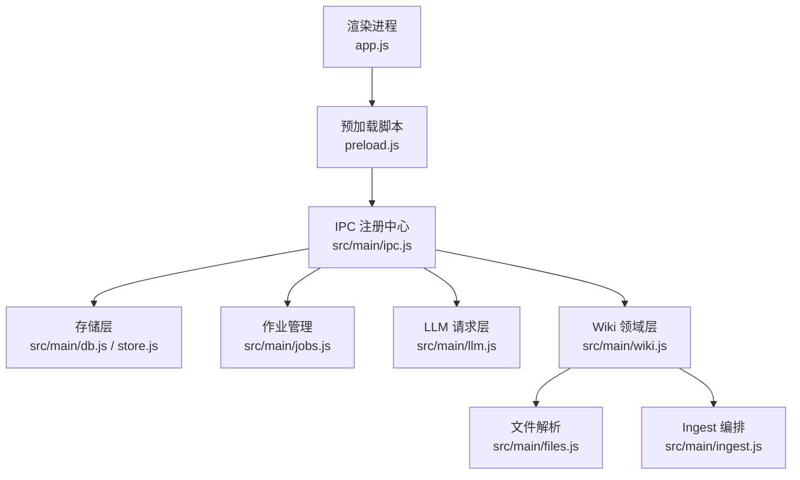
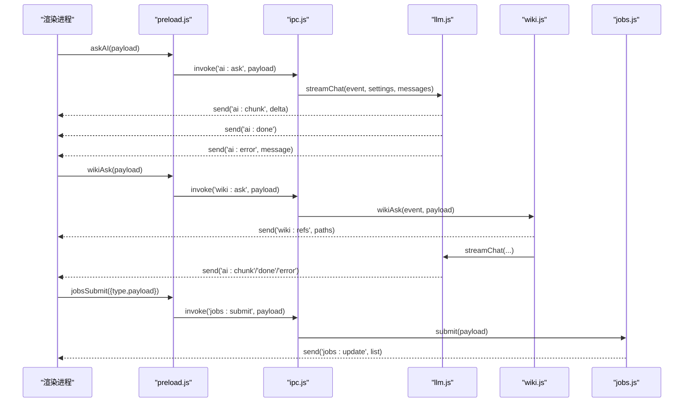
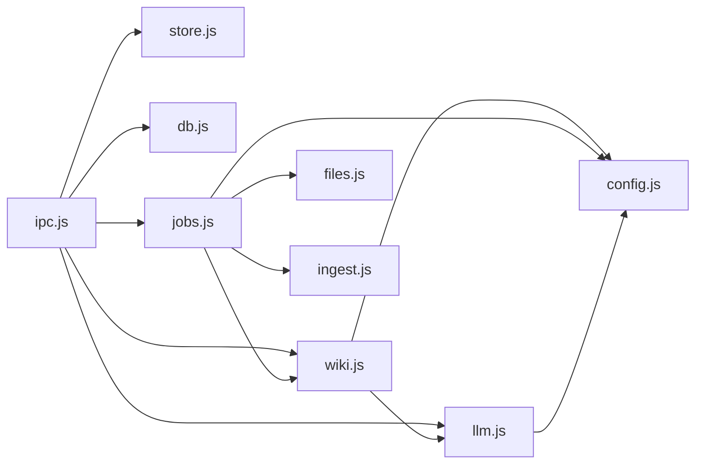

# API 参考

<cite>
**本文引用的文件**
- [main.js](file://main.js)
- [preload.js](file://preload.js)
- [src/main/ipc.js](file://src/main/ipc.js)
- [src/main/store.js](file://src/main/store.js)
- [src/main/db.js](file://src/main/db.js)
- [src/main/jobs.js](file://src/main/jobs.js)
- [src/main/llm.js](file://src/main/llm.js)
- [src/main/wiki.js](file://src/main/wiki.js)
- [src/main/files.js](file://src/main/files.js)
- [src/main/ingest.js](file://src/main/ingest.js)
- [src/main/config.js](file://src/main/config.js)
- [package.json](file://package.json)
</cite>

## 目录
1. [简介](#简介)
2. [项目结构](#项目结构)
3. [核心组件](#核心组件)
4. [架构总览](#架构总览)
5. [详细组件分析](#详细组件分析)
6. [依赖关系分析](#依赖关系分析)
7. [性能考虑](#性能考虑)
8. [故障排查指南](#故障排查指南)
9. [结论](#结论)
10. [附录：版本与迁移](#附录版本与迁移)

## 简介
本参考文档面向 Synapse（本地个人知识库助手）的 IPC 接口与模块公开 API，覆盖数据存取、AI 问答流式接口、LLM Wiki 操作、作业管理等。文档包含每个端点的请求参数、返回值格式、错误码定义、异步事件机制、客户端集成示例与最佳实践，并提供版本兼容性与迁移建议。

## 项目结构
应用采用 Electron 主进程 + 渲染进程架构：
- 主进程入口 main.js 负责窗口创建、初始化数据库、加载作业队列、注册 IPC。
- preload.js 通过 contextBridge 暴露安全的 window.kb 给渲染进程调用。
- src/main/* 按职责拆分：ipc.js 为 IPC 注册中心；store/db 负责持久化；jobs 管理作业队列；llm 封装 LLM 流式请求；wiki 处理 Wiki 领域逻辑；files/ingest 负责文件解析与吸收编排；config 提供配置读取工具。

图表来源
- [main.js:1-56](file://main.js#L1-L56)
- [preload.js:1-56](file://preload.js#L1-L56)
- [src/main/ipc.js:1-109](file://src/main/ipc.js#L1-L109)

章节来源
- [main.js:1-56](file://main.js#L1-L56)
- [preload.js:1-56](file://preload.js#L1-L56)
- [src/main/ipc.js:1-109](file://src/main/ipc.js#L1-L109)

## 核心组件
- 数据存储：SQLite（sql.js），支持笔记、目录、设置与作业历史持久化，支持切换数据库路径并原子落盘。
- 作业系统：串行队列、阶段状态机、历史持久化、中断恢复与重试。
- LLM 请求层：OpenAI 兼容接口，SSE 流式响应，统一以流模式发送并累积全文，内置可重试错误分类与重试策略。
- Wiki 领域：根目录定位、页面读取与描述、上下文打包、问答检索与流式合成、体检报告生成、问答回填。
- 文件解析：PDF/DOCX/XLSX/PPTX/文本等转 Markdown，保存至 raw/ 目录。
- Ingest 编排：读来源 → AI 编译页面计划 → 落盘，分阶段上报状态。

章节来源
- [src/main/db.js:1-358](file://src/main/db.js#L1-L358)
- [src/main/jobs.js:1-260](file://src/main/jobs.js#L1-L260)
- [src/main/llm.js:1-123](file://src/main/llm.js#L1-L123)
- [src/main/wiki.js:1-313](file://src/main/wiki.js#L1-L313)
- [src/main/files.js:1-102](file://src/main/files.js#L1-L102)
- [src/main/ingest.js:1-85](file://src/main/ingest.js#L1-L85)

## 架构总览
IPC 通道由 preload.js 暴露到渲染进程，调用 ipcMain.handle 在 src/main/ipc.js 中统一注册，业务委托至各模块。异步事件通过 event.sender.send 从主进程推送到渲染进程，如 ai:chunk、ai:done、ai:error、wiki:refs、jobs:update。

图表来源
- [preload.js:1-56](file://preload.js#L1-L56)
- [src/main/ipc.js:1-109](file://src/main/ipc.js#L1-L109)
- [src/main/llm.js:1-123](file://src/main/llm.js#L1-L123)
- [src/main/wiki.js:1-313](file://src/main/wiki.js#L1-L313)
- [src/main/jobs.js:1-260](file://src/main/jobs.js#L1-L260)

## 详细组件分析

### 数据存取 API
- data:load
  - 请求：无参数
  - 返回：{ folders, notes, settings }
  - 错误：无直接错误返回（异常由上层捕获）
- data:save
  - 请求：{ folders, notes, settings }
  - 返回：{ ok: true } 或 { ok: false, error: string }
  - 说明：事务内清空重插，原子落盘
- data:setDbPath
  - 请求：string | null（绝对路径或空表示恢复默认）
  - 返回：{ ok: true, path: string, changed: boolean } 或 { ok: false, error: string }
  - 错误码：非法路径、目标已存在、切换失败
- app:getDataPath
  - 请求：无
  - 返回：当前 SQLite 文件路径

章节来源
- [src/main/ipc.js:13-28](file://src/main/ipc.js#L13-L28)
- [src/main/store.js:1-17](file://src/main/store.js#L1-L17)
- [src/main/db.js:30-81](file://src/main/db.js#L30-L81)

### AI 问答（流式）API
- ai:ask
  - 请求：{ settings, messages }
    - settings.apiBaseUrl: string（默认 OpenAI v1）
    - settings.apiKey: string（必填）
    - settings.model: string（默认 gpt-4o-mini）
    - messages: Array<{role, content}>
  - 返回：Promise<void>（实际结果通过事件推送）
  - 事件：
    - ai:chunk: string（增量内容）
    - ai:done: void（完成）
    - ai:error: string（错误信息）
  - 错误处理：未配置 API Key、网络失败、接口非 2xx、流读取失败

章节来源
- [preload.js:9-25](file://preload.js#L9-L25)
- [src/main/ipc.js:45-46](file://src/main/ipc.js#L45-L46)
- [src/main/llm.js:39-77](file://src/main/llm.js#L39-L77)

### LLM Wiki API
- wiki:defaultRoot
  - 请求：无
  - 返回：string（默认 Wiki 根目录）
- wiki:describe
  - 请求：settings
  - 返回：{ exists: boolean, root: string, schema?: string, indexContent?: string, logTail?: string, pages: Array<{path,type,title,description,status}> }
- wiki:read
  - 请求：{ settings, relPath }
  - 返回：{ ok: boolean, content: string } 或 { ok: false, error: string }
- wiki:pickFiles
  - 请求：无
  - 返回：{ ok: boolean, paths: string[] }
- wiki:ask
  - 请求：{ settings, question }
  - 返回：Promise<void>（结果通过事件推送）
  - 事件：
    - wiki:refs: string[]（选中的页面路径）
    - ai:chunk/ai:done/ai:error（同 AI 问答事件）
- wiki:fileAnswer
  - 请求：{ settings, question, answer }
  - 返回：{ ok: boolean, path: string } 或 { ok: false, error: string }
  - 说明：归档问答为 type: Answer 页面，更新 index.md 与日志

章节来源
- [src/main/ipc.js:48-82](file://src/main/ipc.js#L48-L82)
- [src/main/wiki.js:9-114](file://src/main/wiki.js#L9-L114)
- [src/main/wiki.js:193-270](file://src/main/wiki.js#L193-L270)

### 作业管理 API
- jobs:list
  - 请求：无
  - 返回：Array<Job>
- jobs:submit
  - 请求：{ type: 'ingest'|'lint', payload }
    - ingest.payload: { settings, files?, url?, text?, title? }
    - lint.payload: { settings }
  - 返回：{ ok: boolean, id?: string } 或 { ok: false, error: string }
- jobs:remove
  - 请求：id
  - 返回：{ ok: boolean } 或 { ok: false, error: string }
- jobs:clear
  - 请求：无
  - 返回：{ ok: boolean }
- jobs:retry
  - 请求：{ id, settings }
  - 返回：{ ok: boolean, id?: string } 或 { ok: false, error: string }
- 事件：jobs:update
  - 推送：Array<Job>（作业列表）

章节来源
- [src/main/ipc.js:84-105](file://src/main/ipc.js#L84-L105)
- [src/main/jobs.js:100-121](file://src/main/jobs.js#L100-L121)
- [src/main/jobs.js:190-257](file://src/main/jobs.js#L190-L257)

### 导出与路径
- dialog:export
  - 请求：{ defaultName?: string, content: string }
  - 返回：{ ok: boolean, path?: string }

章节来源
- [src/main/ipc.js:30-43](file://src/main/ipc.js#L30-L43)

### 数据结构与类型
- Job
  - 字段：id, type, title, status, createdAt, startedAt, finishedAt, stages[], rawPaths?, result?, error, payload（仅运行期内存持有）
  - 阶段 stages：key, name, status, detail
- Note/Folder/Settings
  - 由 db.getStore 返回，见数据存取 API 返回

章节来源
- [src/main/db.js:111-148](file://src/main/db.js#L111-L148)
- [src/main/db.js:227-249](file://src/main/db.js#L227-L249)
- [src/main/jobs.js:100-121](file://src/main/jobs.js#L100-L121)

### 异步事件与回调
- 订阅方式：window.kb.onAiChunk/onAiDone/onAiError/onWikiRefs/onJobsUpdate
- 取消订阅：返回函数，调用后移除监听器
- 事件语义：
  - ai:chunk：增量文本片段
  - ai:done：流结束
  - ai:error：错误消息
  - wiki:refs：选中参考页面路径
  - jobs:update：作业列表变更

章节来源
- [preload.js:9-50](file://preload.js#L9-L50)

### 错误码与异常
- 通用返回格式：{ ok: boolean, error?: string }
- 常见错误：
  - 未配置 API Key（AI 问答）
  - 网络请求失败（超时、DNS、连接错误）
  - 接口非 2xx（携带 HTTP 状态与详情前 300 字符）
  - 流读取失败
  - 非法路径（Wiki 安全校验）
  - 目标文件已存在（切换数据库）
  - 未知作业类型
  - 只能重试失败的作业
  - 进行中的作业不能删除

章节来源
- [src/main/llm.js:45-77](file://src/main/llm.js#L45-L77)
- [src/main/wiki.js:26-33](file://src/main/wiki.js#L26-L33)
- [src/main/db.js:36-81](file://src/main/db.js#L36-L81)
- [src/main/jobs.js:215-257](file://src/main/jobs.js#L215-L257)

### 客户端集成示例与最佳实践
- 流式问答
  - 步骤：
    1) 调用 window.kb.askAI({ settings, messages })
    2) 使用 onAiChunk 累积回答并实时渲染
    3) 使用 onAiDone 标记完成
    4) 使用 onAiError 处理错误并清理 UI
  - 最佳实践：
    - 确保 settings.apiKey 已配置
    - 合理限制 messages 长度，避免提示词爆炸
    - 对错误进行用户友好提示
- Wiki 问答
  - 步骤：
    1) 调用 window.kb.wikiAsk({ settings, question })
    2) 监听 onWikiRefs 展示引用页面
    3) 使用 ai:chunk/ai:done/ai:error 处理流式输出
- 作业提交与监控
  - 步骤：
    1) 调用 window.kb.jobsSubmit({ type, payload })
    2) 使用 onJobsUpdate 刷新作业列表
    3) 失败时调用 jobs:retry 重试（ingest 会复用 raw/ 来源跳过解析）
  - 最佳实践：
    - 控制 sourceMaxChars 避免超长输入
    - 合理设置 maxJobsHistory 保留历史
    - 对进行中作业禁止删除

章节来源
- [src/app.js:478-549](file://src/app.js#L478-L549)
- [src/main/jobs.js:136-188](file://src/main/jobs.js#L136-L188)

## 依赖关系分析
- 主进程模块耦合：
  - ipc.js 依赖 store/db/jobs/llm/wiki/files/config
  - jobs.js 依赖 files/wiki/ingest/db/config
  - wiki.js 依赖 llm/config/files（间接 via ingest）
  - llm.js 独立，仅依赖 config
- 外部依赖：
  - sql.js（SQLite WASM）
  - pdf-parse/mammoth/xlsx/jszip/turndown（文件解析）
  - electron（进程通信与对话框）

图表来源
- [src/main/ipc.js:1-109](file://src/main/ipc.js#L1-L109)
- [src/main/jobs.js:1-260](file://src/main/jobs.js#L1-L260)
- [src/main/wiki.js:1-313](file://src/main/wiki.js#L1-L313)
- [src/main/llm.js:1-123](file://src/main/llm.js#L1-L123)
- [src/main/files.js:1-102](file://src/main/files.js#L1-L102)
- [src/main/ingest.js:1-85](file://src/main/ingest.js#L1-L85)
- [src/main/config.js:1-18](file://src/main/config.js#L1-L18)

章节来源
- [src/main/ipc.js:1-109](file://src/main/ipc.js#L1-L109)
- [src/main/jobs.js:1-260](file://src/main/jobs.js#L1-L260)
- [src/main/wiki.js:1-313](file://src/main/wiki.js#L1-L313)
- [src/main/llm.js:1-123](file://src/main/llm.js#L1-L123)
- [src/main/files.js:1-102](file://src/main/files.js#L1-L102)
- [src/main/ingest.js:1-85](file://src/main/ingest.js#L1-L85)
- [src/main/config.js:1-18](file://src/main/config.js#L1-L18)

## 性能考虑
- 流式响应：LLM 统一以流模式发送，避免网关超时问题，降低首字节延迟。
- 作业串行：避免并发写 Wiki 文件冲突，保证一致性。
- 原子落盘：SQLite 整体导出后临时文件 rename，防止写入中断损坏。
- 截断与限制：sourceMaxChars 控制来源长度，maxJobsHistory 控制历史大小，logTailLines 控制日志尾部行数。
- 内存占用：payload 仅在运行期持有，持久化时剥离敏感与冗余数据。

[本节为通用指导，不直接分析具体文件]

## 故障排查指南
- AI 问答无响应
  - 检查 settings.apiKey 是否配置
  - 检查网络连通性与代理设置
  - 查看 ai:error 事件消息
- Wiki 问答未返回引用
  - 确认 Wiki 根目录存在 AGENTS.md 与 wiki/ 目录
  - 检查 wiki:describe 返回 exists 是否为 true
- 作业失败
  - 查看 jobs:update 列表中对应作业的 stages 与 error
  - 对于 ingest 失败且 rawPaths 为空的情况，需重新发起吸收
  - 对于 lint 失败可直接重试
- 数据库切换失败
  - 确保传入绝对路径
  - 目标文件不存在或已被备份（.bak）
  - 切换失败时回滚指针文件

章节来源
- [src/main/llm.js:45-77](file://src/main/llm.js#L45-L77)
- [src/main/wiki.js:93-114](file://src/main/wiki.js#L93-L114)
- [src/main/jobs.js:215-257](file://src/main/jobs.js#L215-L257)
- [src/main/db.js:36-81](file://src/main/db.js#L36-L81)

## 结论
Synapse 通过清晰的 IPC 分层与模块化设计，提供了稳定的数据存取、AI 问答、Wiki 管理与作业调度能力。流式响应与串行作业保证了交互体验与数据一致性。建议在客户端集成时严格遵循事件订阅与错误处理模式，并结合配置项优化性能与资源使用。

[本节为总结性内容，不直接分析具体文件]

## 附录：版本与迁移
- 版本信息
  - 产品名称：Synapse
  - 版本号：1.0.0
  - 主要依赖：electron ^31.0.0，sql.js ^1.14.1，pdf-parse ^2.4.5，mammoth ^1.12.0，xlsx ^0.18.5，turndown ^7.2.4
- 数据迁移
  - 启动时自动将 legacy JSON（knowledge-data.json、wiki-jobs.json）迁移至 SQLite，成功后原文件改名 .bak
  - 支持运行时切换数据库文件位置，指针文件 db-path.json 记录当前路径
- 向后兼容
  - 旧版 userData 路径保持不变，避免已有 knowledge.db 失联
  - 所有数值配置通过 config.num 钳制范围，缺失时回退默认值

章节来源
- [package.json:1-45](file://package.json#L1-L45)
- [src/main/db.js:91-177](file://src/main/db.js#L91-L177)
- [src/main/db.js:16-28](file://src/main/db.js#L16-L28)
- [src/main/config.js:4-15](file://src/main/config.js#L4-L15)