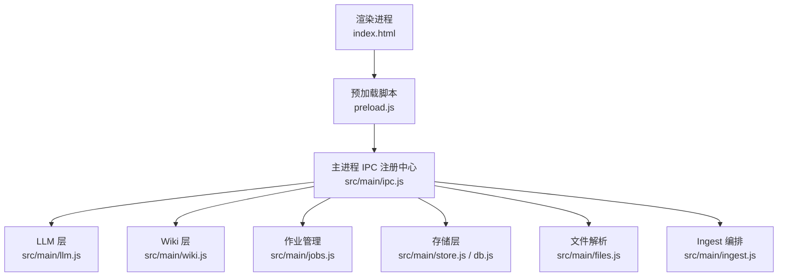
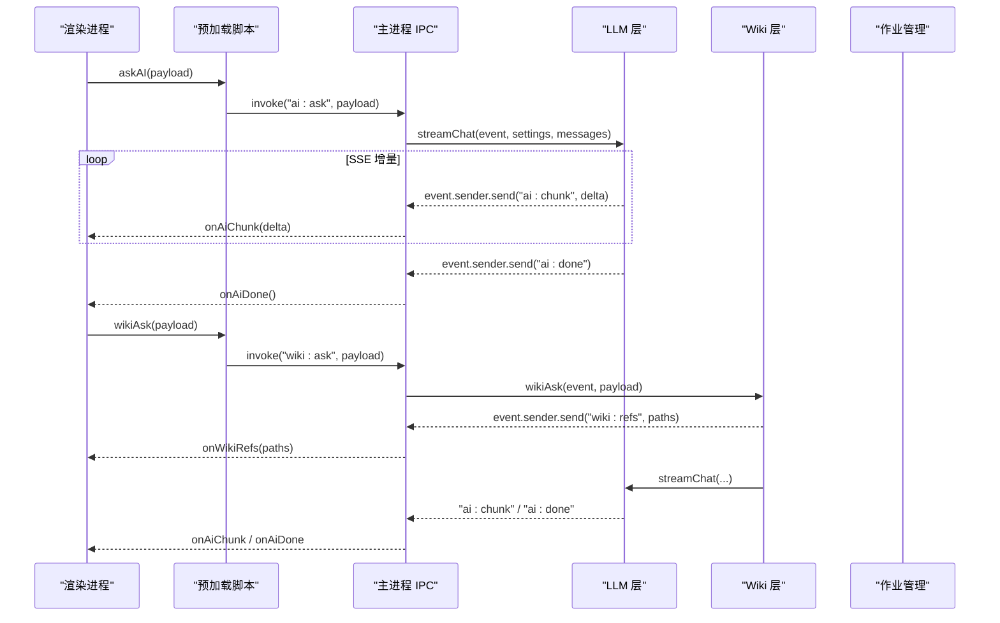
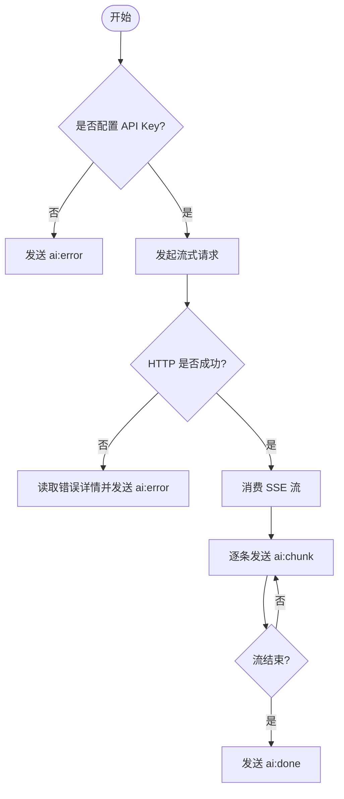
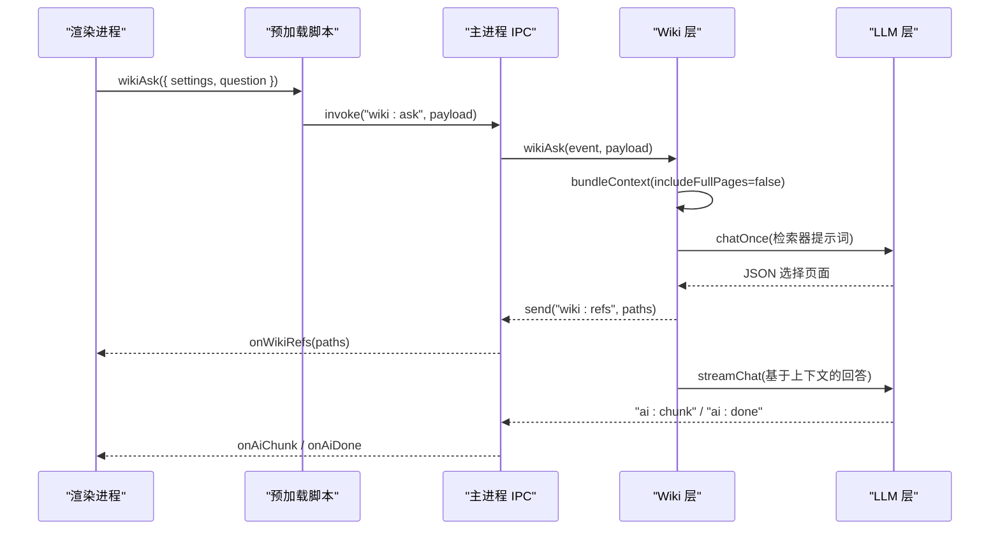
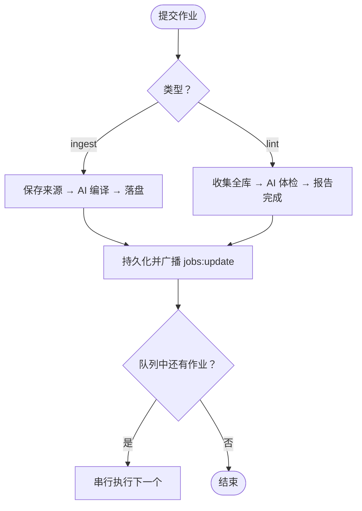
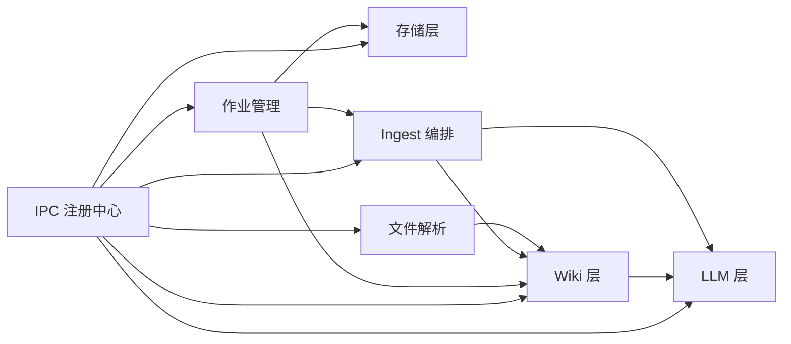

# IPC 通信接口

<cite>
**本文引用的文件**
- [main.js](file://main.js)
- [preload.js](file://preload.js)
- [src/main/ipc.js](file://src/main/ipc.js)
- [src/main/llm.js](file://src/main/llm.js)
- [src/main/wiki.js](file://src/main/wiki.js)
- [src/main/jobs.js](file://src/main/jobs.js)
- [src/main/store.js](file://src/main/store.js)
- [src/main/db.js](file://src/main/db.js)
- [src/main/files.js](file://src/main/files.js)
- [src/main/ingest.js](file://src/main/ingest.js)
- [src/main/config.js](file://src/main/config.js)
- [package.json](file://package.json)
</cite>

## 目录
1. [简介](#简介)
2. [项目结构](#项目结构)
3. [核心组件](#核心组件)
4. [架构总览](#架构总览)
5. [详细组件分析](#详细组件分析)
6. [依赖关系分析](#依赖关系分析)
7. [性能考量](#性能考量)
8. [故障排查指南](#故障排查指南)
9. [结论](#结论)
10. [附录：IPC 事件清单与调用示例](#附录ipc-事件清单与调用示例)

## 简介
本仓库为本地个人知识库助手（Synapse）的 Electron 应用。主进程负责窗口生命周期、持久化存储、AI 问答流式响应、Wiki 管理与作业编排；渲染进程通过预加载脚本暴露安全桥接 API，仅能调用主进程注册的 IPC 通道。本文档聚焦于“主进程—渲染进程”间的 IPC 通信：事件名称、参数格式、返回值结构、错误处理机制、异步消息传递模式、安全与权限控制，以及完整调用示例与最佳实践。

## 项目结构
- 入口 main.js：初始化应用、创建窗口、装配模块并注册 IPC。
- 预加载 preload.js：通过 contextBridge 暴露 kb.* 方法，封装所有 IPC 调用与事件订阅。
- src/main/ipc.js：IPC 注册中心，统一注册 ipcMain.handle，并将请求委派给领域模块。
- 领域模块：
  - llm.js：LLM 流式对话、重试策略、SSE 解析。
  - wiki.js：Wiki 根目录定位、页面读取/描述、来源保存、上下文打包、问答与回填。
  - jobs.js：作业队列、阶段状态机、历史持久化与重试。
  - files.js：多格式文件解析与保存到 raw/。
  - ingest.js：Ingest 三步编排（保存来源 → AI 编译 → 落盘）。
  - store.js / db.js：设置、笔记、目录与作业历史的 SQLite 持久化。
  - config.js：配置项数值/枚举校验与默认值回退。

图表来源
- [main.js:19-47](file://main.js#L19-L47)
- [preload.js:3-55](file://preload.js#L3-L55)
- [src/main/ipc.js:12-106](file://src/main/ipc.js#L12-L106)

章节来源
- [main.js:1-56](file://main.js#L1-L56)
- [preload.js:1-56](file://preload.js#L1-L56)
- [src/main/ipc.js:1-109](file://src/main/ipc.js#L1-L109)

## 核心组件
- 数据存取：data:load、data:save、data:setDbPath、app:getDataPath
- AI 问答（流式）：ai:ask（请求）、ai:chunk（增量推送）、ai:done（完成）、ai:error（错误）
- LLM Wiki：wiki:defaultRoot、wiki:describe、wiki:read、wiki:pickFiles、wiki:ask、wiki:fileAnswer、wiki:refs（引用列表推送）
- 作业管理：jobs:list、jobs:submit、jobs:remove、jobs:clear、jobs:retry、jobs:update（进度推送）
- 其他：dialog:export（导出对话框）

章节来源
- [preload.js:3-55](file://preload.js#L3-L55)
- [src/main/ipc.js:12-106](file://src/main/ipc.js#L12-L106)

## 架构总览
IPC 采用“请求-响应 + 事件推送”的混合模式：
- 请求-响应：使用 ipcRenderer.invoke 与 ipcMain.handle，返回 Promise 结果或对象。
- 事件推送：使用 ipcRenderer.on 与 event.sender.send，用于长耗时任务的增量输出与状态更新。

图表来源
- [preload.js:9-38](file://preload.js#L9-L38)
- [src/main/ipc.js:45-82](file://src/main/ipc.js#L45-L82)
- [src/main/llm.js:40-77](file://src/main/llm.js#L40-L77)
- [src/main/wiki.js:194-233](file://src/main/wiki.js#L194-L233)

## 详细组件分析

### 数据操作接口
- data:load
  - 参数：无
  - 返回：{ folders, notes, settings }
  - 错误：无显式异常，底层失败由 db 层抛出并由 handle 捕获
- data:save
  - 参数：store 对象（folders, notes, settings）
  - 返回：{ ok: true } 或 { ok: false, error: string }
  - 错误：保存失败时返回错误信息
- data:setDbPath
  - 参数：绝对路径字符串或空字符串（恢复默认）
  - 返回：{ ok: boolean, path?: string, changed?: boolean, error?: string }
  - 行为：整库迁移，目标存在则拒绝覆盖；恢复默认时旧文件改名留底
- app:getDataPath
  - 参数：无
  - 返回：当前数据库文件路径字符串

章节来源
- [src/main/ipc.js:14-28](file://src/main/ipc.js#L14-L28)
- [src/main/store.js:4-14](file://src/main/store.js#L4-L14)
- [src/main/db.js:34-81](file://src/main/db.js#L34-L81)

### AI 问答（流式）接口
- ai:ask
  - 参数：{ settings, messages }
    - settings.apiBaseUrl：可选，默认 https://api.openai.com/v1
    - settings.apiKey：必填，未配置将触发 ai:error
    - settings.model：可选，默认 gpt-4o-mini
    - messages：标准聊天消息数组
  - 返回：Promise<void>（实际通过事件推送）
  - 事件：
    - ai:chunk：增量文本片段
    - ai:done：流结束
    - ai:error：错误消息
  - 错误处理：网络失败、非 2xx、空响应等通过 ai:error 上报
- 订阅方式：onAiChunk、onAiDone、onAiError（预加载已封装）

图表来源
- [src/main/llm.js:40-77](file://src/main/llm.js#L40-L77)

章节来源
- [preload.js:9-25](file://preload.js#L9-L25)
- [src/main/ipc.js:45-46](file://src/main/ipc.js#L45-L46)
- [src/main/llm.js:40-77](file://src/main/llm.js#L40-L77)

### Wiki 管理接口
- wiki:defaultRoot
  - 参数：无
  - 返回：默认 Wiki 根目录路径
- wiki:describe
  - 参数：settings（可含 wikiRoot、logTailLines 等）
  - 返回：{ exists, root, schema?, indexContent?, logTail?, pages[] }
- wiki:read
  - 参数：{ settings, relPath }
  - 返回：{ ok: true, content: string } 或 { ok: false, error: string }
- wiki:pickFiles
  - 参数：无
  - 返回：{ ok: true, paths: string[] }
- wiki:ask
  - 参数：{ settings, question }
  - 返回：Promise<void>（通过事件推送）
  - 事件：
    - wiki:refs：选中的参考页面路径列表
    - ai:chunk / ai:done / ai:error：同 AI 问答
- wiki:fileAnswer
  - 参数：{ settings, question, answer }
  - 返回：{ ok: true, path: string } 或 { ok: false, error: string }
  - 行为：归档问答为 type: Answer 页面，更新 index.md 与日志

图表来源
- [src/main/ipc.js:48-82](file://src/main/ipc.js#L48-L82)
- [src/main/wiki.js:194-233](file://src/main/wiki.js#L194-L233)
- [src/main/llm.js:40-77](file://src/main/llm.js#L40-L77)

章节来源
- [preload.js:27-38](file://preload.js#L27-L38)
- [src/main/ipc.js:48-82](file://src/main/ipc.js#L48-L82)
- [src/main/wiki.js:10-33](file://src/main/wiki.js#L10-L33)
- [src/main/wiki.js:84-114](file://src/main/wiki.js#L84-L114)
- [src/main/wiki.js:194-270](file://src/main/wiki.js#L194-L270)

### 作业管理接口
- jobs:list
  - 参数：无
  - 返回：作业列表数组
- jobs:submit
  - 参数：{ type, payload }
    - type: 'ingest' | 'lint'
    - payload: 根据类型不同包含 files/url/text/settings 等
  - 返回：{ ok: true, id: string } 或 { ok: false, error: string }
- jobs:remove
  - 参数：作业 id
  - 返回：{ ok: true } 或 { ok: false, error: string }
- jobs:clear
  - 参数：无
  - 返回：{ ok: true }
- jobs:retry
  - 参数：{ id, settings }
  - 返回：{ ok: true, id: string } 或 { ok: false, error: string }
- 事件：jobs:update
  - 推送：最新作业列表（含 stages 状态）

图表来源
- [src/main/jobs.js:72-98](file://src/main/jobs.js#L72-L98)
- [src/main/jobs.js:136-188](file://src/main/jobs.js#L136-L188)
- [src/main/jobs.js:196-257](file://src/main/jobs.js#L196-L257)

章节来源
- [preload.js:40-50](file://preload.js#L40-L50)
- [src/main/ipc.js:84-105](file://src/main/ipc.js#L84-L105)
- [src/main/jobs.js:1-260](file://src/main/jobs.js#L1-L260)

### 其他接口
- dialog:export
  - 参数：{ defaultName, content }
  - 返回：{ ok: true, path: string } 或 { ok: false }
  - 行为：打开保存对话框，写入 Markdown 或文本文件
- 事件：无（纯请求-响应）

章节来源
- [src/main/ipc.js:30-43](file://src/main/ipc.js#L30-L43)

## 依赖关系分析
- 主进程 IPC 注册中心集中路由到各模块，降低耦合度。
- LLM 层被 AI 问答与 Wiki 问答复用，提供统一的流式与重试能力。
- Wiki 层依赖 LLM 层进行检索与合成，同时依赖文件解析与 Ingest 编排。
- 作业系统串联文件解析、Wiki 上下文打包、LLM 调用与落盘，并通过 SQLite 持久化历史。
- 存储层通过 sql.js 实现内存数据库，原子写盘保证一致性。

图表来源
- [src/main/ipc.js:1-109](file://src/main/ipc.js#L1-L109)
- [src/main/jobs.js:1-260](file://src/main/jobs.js#L1-L260)
- [src/main/wiki.js:1-313](file://src/main/wiki.js#L1-L313)
- [src/main/llm.js:1-123](file://src/main/llm.js#L1-L123)
- [src/main/db.js:1-358](file://src/main/db.js#L1-L358)

章节来源
- [src/main/ipc.js:1-109](file://src/main/ipc.js#L1-L109)
- [src/main/jobs.js:1-260](file://src/main/jobs.js#L1-L260)
- [src/main/wiki.js:1-313](file://src/main/wiki.js#L1-L313)
- [src/main/llm.js:1-123](file://src/main/llm.js#L1-L123)
- [src/main/db.js:1-358](file://src/main/db.js#L1-L358)

## 性能考量
- 流式响应：AI 问答与 Wiki 问答均采用 SSE 流式传输，避免大响应阻塞 UI。
- 重试策略：LLM 层对可重试错误（网络、5xx、空返回）自动重试，减少瞬时失败影响。
- 作业串行：作业队列串行执行，避免并发写 Wiki 文件导致冲突。
- 持久化优化：SQLite 整体导出后原子替换临时文件，降低损坏风险。
- 上下文裁剪：Wiki 问答默认不加载全文，仅索引与清单；Ingest 对超长来源截断，防止提示词爆炸。

[本节为通用性能建议，无需特定文件来源]

## 故障排查指南
- AI 问答错误
  - 现象：收到 ai:error
  - 可能原因：未配置 API Key、网络失败、接口返回非 2xx、流读取异常
  - 处理：检查 settings.apiKey、网络连通性、模型端点与配额
- Wiki 问答错误
  - 现象：ai:error 或 wiki:refs 为空
  - 可能原因：AGENTS.md 或 wiki/index.md 缺失、页面选择失败
  - 处理：确认 Wiki 根目录存在必要文件，必要时重新 describe
- 作业失败
  - 现象：jobs:update 显示 failed，error 字段有信息
  - 可能原因：来源不存在、模型返回无法解析、落盘失败
  - 处理：查看 stages.detail，必要时重试（ingest 会复用 raw/ 来源）
- 数据库切换失败
  - 现象：data:setDbPath 返回 ok:false
  - 可能原因：非绝对路径、目标文件已存在、磁盘不可写
  - 处理：确保绝对路径且目标不存在，或更换路径

章节来源
- [src/main/llm.js:40-77](file://src/main/llm.js#L40-L77)
- [src/main/wiki.js:194-233](file://src/main/wiki.js#L194-L233)
- [src/main/jobs.js:72-98](file://src/main/jobs.js#L72-L98)
- [src/main/db.js:34-81](file://src/main/db.js#L34-L81)

## 结论
本项目的 IPC 设计以“请求-响应 + 事件推送”为核心，清晰分离了数据、AI、Wiki 与作业职责。通过预加载脚本的安全桥接，渲染进程仅能访问受控 API；主进程集中注册 IPC 并委派至领域模块，便于扩展与维护。流式响应与作业串行化保障了交互体验与数据一致性。建议在集成时严格遵循参数与返回约定，妥善处理错误事件，并利用作业系统进行长耗时任务。

[本节为总结，无需特定文件来源]

## 附录：IPC 事件清单与调用示例

### 事件清单
- 数据
  - data:load → 返回 store
  - data:save(store) → { ok, error? }
  - data:setDbPath(path) → { ok, path?, changed?, error? }
  - app:getDataPath → 字符串
- AI 问答
  - ai:ask({ settings, messages }) → 事件驱动
  - 事件：ai:chunk、ai:done、ai:error
- Wiki
  - wiki:defaultRoot → 字符串
  - wiki:describe(settings) → { exists, root, schema?, indexContent?, logTail?, pages[] }
  - wiki:read({ settings, relPath }) → { ok, content? | error? }
  - wiki:pickFiles → { ok, paths[] }
  - wiki:ask({ settings, question }) → 事件驱动
  - 事件：wiki:refs、ai:chunk、ai:done、ai:error
  - wiki:fileAnswer({ settings, question, answer }) → { ok, path? | error? }
- 作业
  - jobs:list → 数组
  - jobs:submit({ type, payload }) → { ok, id? | error? }
  - jobs:remove(id) → { ok | error? }
  - jobs:clear → { ok }
  - jobs:retry({ id, settings }) → { ok, id? | error? }
  - 事件：jobs:update（作业列表）
- 其他
  - dialog:export({ defaultName, content }) → { ok, path? }

### 调用示例（概念性步骤）
- 启动 AI 问答
  - 在渲染进程调用 kb.askAI({ settings, messages })
  - 订阅 kb.onAiChunk(cb)、kb.onAiDone(cb)、kb.onAiError(cb)
  - 逐步接收增量内容，完成后清理监听器
- 执行 Wiki 问答
  - 调用 kb.wikiAsk({ settings, question })
  - 先接收 kb.onWikiRefs(refs) 获取参考页面
  - 再按 AI 问答流程接收增量与完成信号
- 提交吸收作业
  - 调用 kb.jobsSubmit({ type: 'ingest', payload: { settings, files, url, text } })
  - 订阅 kb.onJobsUpdate(list) 观察 stages 状态变化
  - 失败后可调用 kb.jobsRetry({ id, settings }) 重试
- 切换数据库位置
  - 调用 kb.setDbPath('/绝对/路径/knowledge.db')
  - 若需恢复默认，传入空字符串

### 最佳实践
- 始终检查 settings.apiKey 后再发起 AI 请求，避免无效调用。
- 对长耗时任务（Wiki 问答、Ingest、Lint）使用作业系统，避免阻塞 UI。
- 合理设置 sourceMaxChars、wikiAskMaxPages、logTailLines 等配置，平衡效果与成本。
- 使用 jobs:update 实时刷新界面，提升用户体验。
- 错误处理优先消费 ai:error 与作业 error 字段，便于快速定位问题。

[本节为概念性指导，无需特定文件来源]