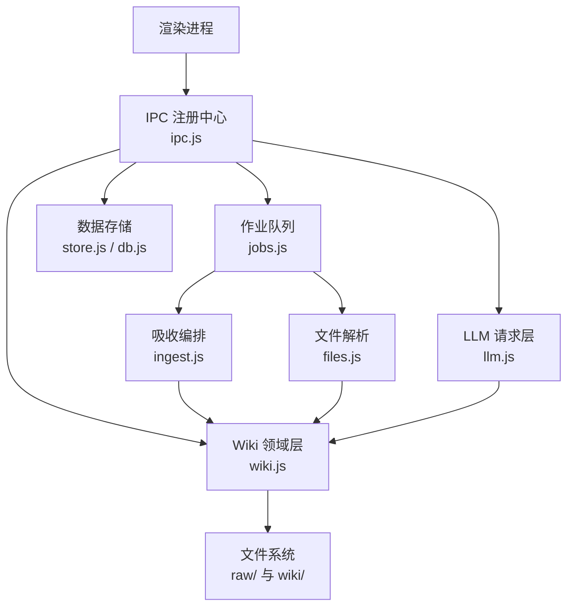
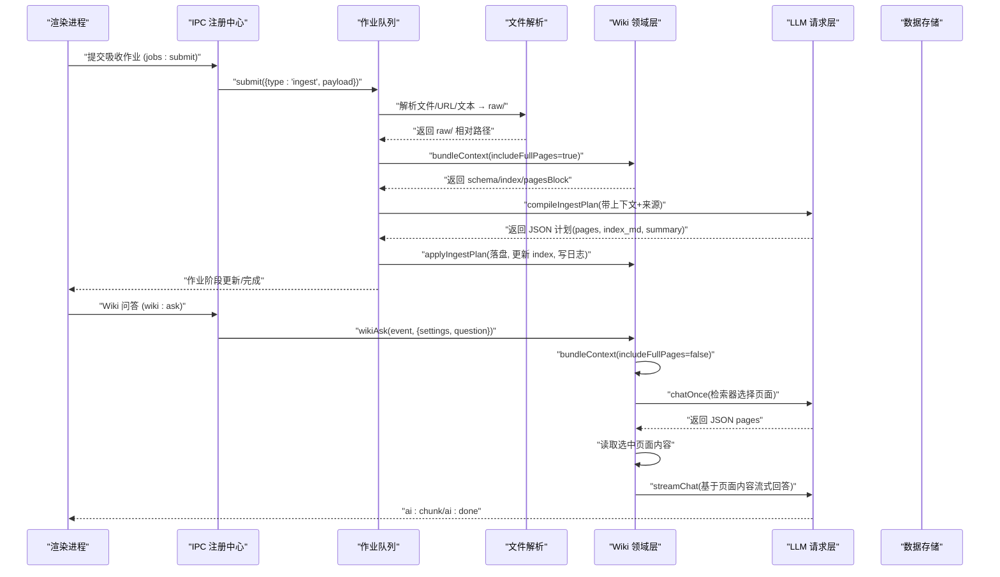
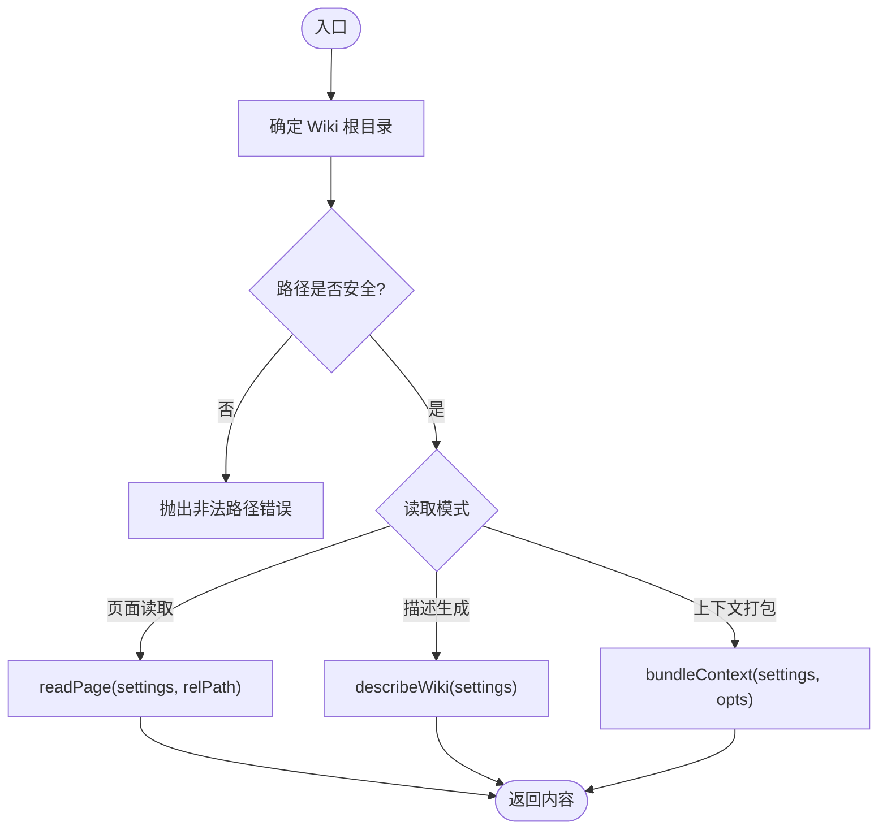
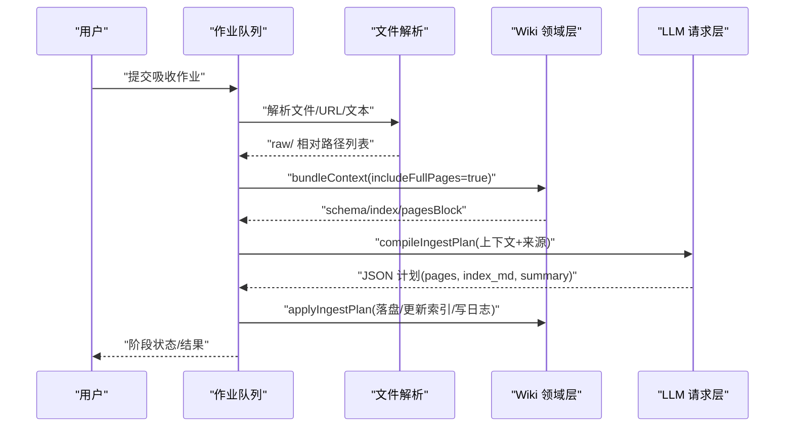
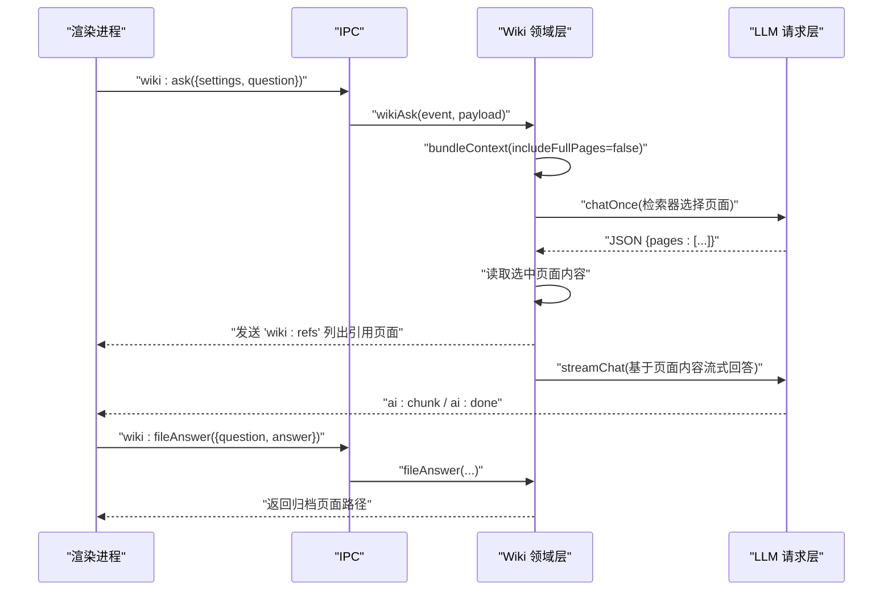
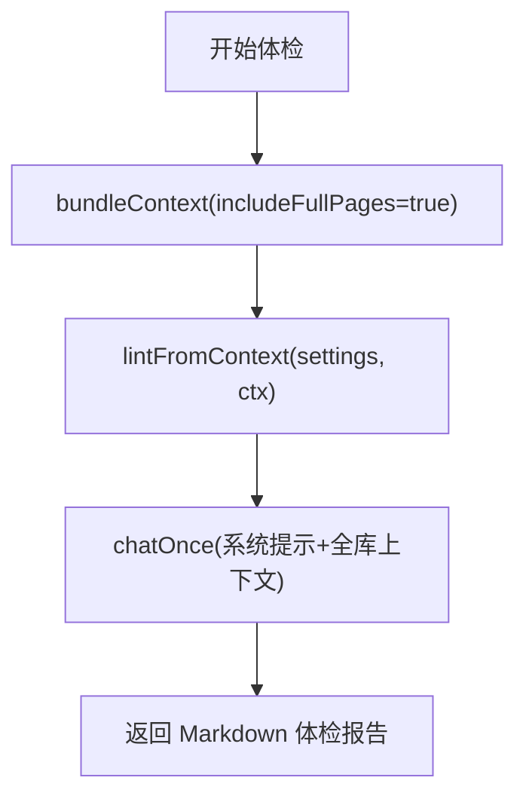
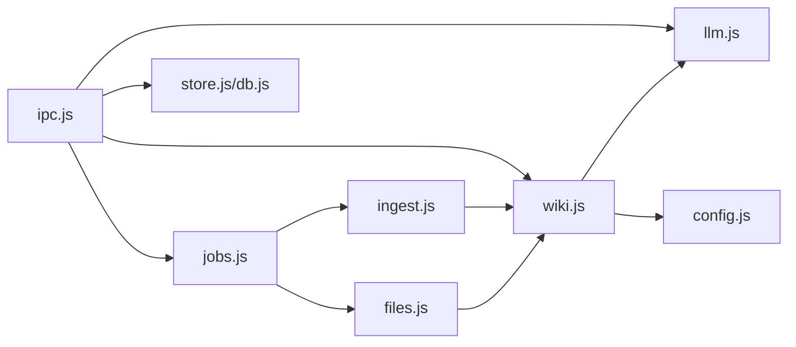

# Wiki 管理接口

<cite>
**本文引用的文件**
- [src/main/wiki.js](file://src/main/wiki.js)
- [src/main/ingest.js](file://src/main/ingest.js)
- [src/main/files.js](file://src/main/files.js)
- [src/main/llm.js](file://src/main/llm.js)
- [src/main/jobs.js](file://src/main/jobs.js)
- [src/main/ipc.js](file://src/main/ipc.js)
- [src/main/db.js](file://src/main/db.js)
- [src/main/store.js](file://src/main/store.js)
- [src/main/config.js](file://src/main/config.js)
- [llmwiki/wiki/index.md](file://llmwiki/wiki/index.md)
- [llmwiki/raw/2026-08-08-llm-wiki-karpathy.md](file://llmwiki/raw/2026-08-08-llm-wiki-karpathy.md)
</cite>

## 目录
1. [简介](#简介)
2. [项目结构](#项目结构)
3. [核心组件](#核心组件)
4. [架构总览](#架构总览)
5. [详细组件分析](#详细组件分析)
6. [依赖关系分析](#依赖关系分析)
7. [性能与可靠性](#性能与可靠性)
8. [故障排查指南](#故障排查指南)
9. [结论](#结论)
10. [附录：API 调用示例](#附录api-调用示例)

## 简介
本文档面向“Wiki 管理接口”，覆盖知识库的页面读取、描述生成、问答检索、文件吸收、健康检查（体检）与回答回填等能力。系统采用本地 Markdown 仓库作为持久化存储，通过 LLM 进行智能检索与内容生成，并以作业队列串联吸收与体检流程，提供 IPC 暴露给渲染进程使用。

## 项目结构
- 主进程模块
  - wiki.js：Wiki 根目录定位、页面读取/描述、上下文打包、来源保存、问答、回填、体检
  - ingest.js：知识吸收编排（读来源 → AI 编译计划 → 落盘）
  - files.js：本地文件解析为 Markdown 并保存到 raw/
  - llm.js：LLM 请求层（流式 SSE、重试、JSON 提取）
  - jobs.js：作业队列与阶段状态机（串行执行、历史持久化、重试）
  - ipc.js：IPC 注册中心，统一对外暴露 API
  - db.js / store.js：SQLite 数据持久化（笔记、设置、作业历史）
  - config.js：配置项解析工具
- 知识库目录
  - llmwiki/raw：原始来源（不可变）
  - llmwiki/wiki：由 LLM 维护的结构化页面（concepts/topics/entities/sources 等）
  - llmwiki/wiki/index.md：目录索引
  - llmwiki/wiki/log.md：更新日志

图表来源
- [src/main/ipc.js:12-109](file://src/main/ipc.js#L12-L109)
- [src/main/wiki.js:1-313](file://src/main/wiki.js#L1-L313)
- [src/main/jobs.js:1-260](file://src/main/jobs.js#L1-L260)
- [src/main/ingest.js:1-85](file://src/main/ingest.js#L1-L85)
- [src/main/files.js:1-102](file://src/main/files.js#L1-L102)
- [src/main/llm.js:1-123](file://src/main/llm.js#L1-L123)
- [src/main/db.js:1-358](file://src/main/db.js#L1-L358)

章节来源
- [src/main/ipc.js:12-109](file://src/main/ipc.js#L12-L109)
- [src/main/wiki.js:1-313](file://src/main/wiki.js#L1-L313)
- [src/main/jobs.js:1-260](file://src/main/jobs.js#L1-L260)
- [src/main/ingest.js:1-85](file://src/main/ingest.js#L1-L85)
- [src/main/files.js:1-102](file://src/main/files.js#L1-L102)
- [src/main/llm.js:1-123](file://src/main/llm.js#L1-L123)
- [src/main/db.js:1-358](file://src/main/db.js#L1-L358)

## 核心组件
- Wiki 领域层（wiki.js）
  - 根目录定位与安全路径校验
  - 页面读取（raw/ 与 wiki/ bundle）
  - 描述生成（describeWiki：schema、index、log、pages）
  - 上下文打包（bundleContext：用于检索/体检/吸收）
  - 来源保存（saveRawSource：文本或 URL 拉取）
  - 问答（wikiAsk：两步检索 + 流式合成）
  - 回答回填（fileAnswer：归档为 Answer 页面并更新 index）
  - 体检（lintWiki/lintFromContext：全库健康检查）
- 吸收编排（ingest.js）
  - 加载来源（loadIngestRaws）
  - 编译计划（compileIngestPlan：AI 输出 pages 与 index_md）
  - 应用计划（applyIngestPlan：落盘、更新 index、写日志）
- 文件解析（files.js）
  - 支持 PDF/DOCX/XLSX/PPTX/Markdown/文本等格式转 Markdown
  - 保存到 raw/ 并返回相对路径
- LLM 请求层（llm.js）
  - 流式 SSE 消费（streamChat）
  - 非流式对话（chatOnce，内部以流式累积全文）
  - JSON 提取（extractJson）
- 作业队列（jobs.js）
  - 串行执行、阶段状态机、历史持久化、重试
  - 吸收作业（ingest）与体检作业（lint）
- IPC 注册中心（ipc.js）
  - 统一暴露 wiki:*、ai:*、jobs:* 等接口
- 数据存储（db.js / store.js）
  - SQLite 持久化（settings、notes、folders、jobs）
  - 数据库文件切换与迁移

章节来源
- [src/main/wiki.js:1-313](file://src/main/wiki.js#L1-L313)
- [src/main/ingest.js:1-85](file://src/main/ingest.js#L1-L85)
- [src/main/files.js:1-102](file://src/main/files.js#L1-L102)
- [src/main/llm.js:1-123](file://src/main/llm.js#L1-L123)
- [src/main/jobs.js:1-260](file://src/main/jobs.js#L1-L260)
- [src/main/ipc.js:12-109](file://src/main/ipc.js#L12-L109)
- [src/main/db.js:1-358](file://src/main/db.js#L1-L358)
- [src/main/store.js:1-17](file://src/main/store.js#L1-L17)

## 架构总览
下图展示从渲染进程到各主进程模块的调用关系与数据流向。

图表来源
- [src/main/ipc.js:45-82](file://src/main/ipc.js#L45-L82)
- [src/main/jobs.js:136-187](file://src/main/jobs.js#L136-L187)
- [src/main/ingest.js:22-82](file://src/main/ingest.js#L22-L82)
- [src/main/wiki.js:117-233](file://src/main/wiki.js#L117-L233)
- [src/main/llm.js:40-120](file://src/main/llm.js#L40-L120)

## 详细组件分析

### Wiki 根目录管理与页面组织
- 根目录定位
  - 默认候选：应用目录下的 llmwiki，或用户文档目录下的 llmwiki；若存在 AGENTS.md 则视为有效根
  - 可通过 settings.wikiRoot 覆盖
- 安全路径
  - safeJoin 确保不会逃逸出指定根目录
- 页面读取
  - raw/ 下按根目录解析
  - 其余路径在 wiki/ bundle 下解析
- 描述生成
  - describeWiki 返回 exists/root/schema/indexContent/logTail/pages
  - pages 包含 frontmatter 中的 type/title/description/status
- 上下文打包
  - bundleContext 返回 schema/index/listing/pagesBlock，供检索/体检/吸收复用
- 日志
  - appendLog 将条目追加到 log.md 当日分组下

图表来源
- [src/main/wiki.js:10-33](file://src/main/wiki.js#L10-L33)
- [src/main/wiki.js:84-134](file://src/main/wiki.js#L84-L134)

章节来源
- [src/main/wiki.js:10-33](file://src/main/wiki.js#L10-L33)
- [src/main/wiki.js:84-134](file://src/main/wiki.js#L84-L134)
- [llmwiki/wiki/index.md:1-28](file://llmwiki/wiki/index.md#L1-L28)

### 知识吸收流程（Ingest）
- 步骤
  1) 保存来源：files.saveFileSource 或 wiki.saveRawSource（文本/URL），写入 raw/
  2) 编译计划：ingest.compileIngestPlan 基于 schema/index/pagesBlock+来源，要求模型输出 JSON（pages/index_md/summary）
  3) 应用计划：ingest.applyIngestPlan 落盘页面、更新 index.md、记录日志
- 作业化
  - jobs.submit(type:'ingest') 创建三阶段作业（保存/编译/落盘）
  - 失败可重试，重试时跳过保存阶段，复用已保存的 rawPaths
- 截断保护
  - sourceMaxChars 限制来源长度，避免提示词爆炸

图表来源
- [src/main/jobs.js:136-187](file://src/main/jobs.js#L136-L187)
- [src/main/ingest.js:8-82](file://src/main/ingest.js#L8-L82)
- [src/main/files.js:77-99](file://src/main/files.js#L77-L99)
- [src/main/wiki.js:154-191](file://src/main/wiki.js#L154-L191)

章节来源
- [src/main/jobs.js:136-187](file://src/main/jobs.js#L136-L187)
- [src/main/ingest.js:8-82](file://src/main/ingest.js#L8-L82)
- [src/main/files.js:77-99](file://src/main/files.js#L77-L99)
- [src/main/wiki.js:154-191](file://src/main/wiki.js#L154-L191)

### 问答检索与回答回填
- 两步检索
  - 第一步：chatOnce 让模型选出最相关的页面（最多 maxPages）
  - 第二步：读取选中页面内容，构造上下文，streamChat 流式回答
- 参考引用
  - 通过 'wiki:refs' 事件推送选中的页面路径
- 回答回填
  - fileAnswer 将问答归档为 topics/answer-时间戳.md，frontmatter 标记 type: Answer
  - 自动更新 index.md 主题小节，并记录日志

图表来源
- [src/main/ipc.js:45-82](file://src/main/ipc.js#L45-L82)
- [src/main/wiki.js:194-270](file://src/main/wiki.js#L194-L270)
- [src/main/llm.js:40-120](file://src/main/llm.js#L40-L120)

章节来源
- [src/main/wiki.js:194-270](file://src/main/wiki.js#L194-L270)
- [src/main/ipc.js:45-82](file://src/main/ipc.js#L45-L82)
- [src/main/llm.js:40-120](file://src/main/llm.js#L40-L120)

### 健康检查与体检功能
- lintWiki：收集全库上下文（含全部页面），调用 LLM 生成体检报告
- lintFromContext：复用已收集的上下文，便于作业内复用
- 体检范围：页面矛盾、陈旧论断、孤儿页、缺失交叉引用、frontmatter 合规性、待补充来源/问题等

图表来源
- [src/main/wiki.js:272-296](file://src/main/wiki.js#L272-L296)
- [src/main/jobs.js:177-187](file://src/main/jobs.js#L177-L187)

章节来源
- [src/main/wiki.js:272-296](file://src/main/wiki.js#L272-L296)
- [src/main/jobs.js:177-187](file://src/main/jobs.js#L177-L187)

### 本地存储机制
- 知识库文件
  - raw/：原始来源（不可变）
  - wiki/：结构化页面（concepts/topics/entities/sources）
  - index.md：目录索引
  - log.md：更新日志
- 应用数据
  - SQLite 数据库文件（默认 userData/knowledge.db）
  - 支持切换数据库文件位置（整库导出迁移，指针文件管理）
  - 作业历史持久化（id/type/title/status/stages/result/error 等）

章节来源
- [src/main/db.js:12-81](file://src/main/db.js#L12-L81)
- [src/main/db.js:111-149](file://src/main/db.js#L111-L149)
- [src/main/db.js:179-187](file://src/main/db.js#L179-L187)
- [src/main/db.js:288-358](file://src/main/db.js#L288-L358)

## 依赖关系分析
- 模块耦合
  - ipc.js 作为统一入口，低耦合地委托到 wiki/jobs/files/llm/store
  - jobs.js 组合 wiki.js、ingest.js、files.js，形成吸收/体检工作流
  - wiki.js 依赖 llm.js 进行检索与生成，依赖 config.js 解析数值配置
  - ingest.js 依赖 wiki.js 的 bundleContext/safeJoin/appendLog
  - files.js 依赖 wiki.js 的路径工具
- 外部依赖
  - sql.js：SQLite 内存数据库与持久化
  - turndown/mammoth/pdf-parse/xlsx/jszip：多格式文件解析
  - Electron：IPC、对话框、应用路径

图表来源
- [src/main/ipc.js:12-109](file://src/main/ipc.js#L12-L109)
- [src/main/jobs.js:1-260](file://src/main/jobs.js#L1-L260)
- [src/main/wiki.js:1-313](file://src/main/wiki.js#L1-L313)
- [src/main/ingest.js:1-85](file://src/main/ingest.js#L1-L85)
- [src/main/files.js:1-102](file://src/main/files.js#L1-L102)
- [src/main/llm.js:1-123](file://src/main/llm.js#L1-L123)
- [src/main/db.js:1-358](file://src/main/db.js#L1-L358)
- [src/main/store.js:1-17](file://src/main/store.js#L1-L17)
- [src/main/config.js:1-18](file://src/main/config.js#L1-L18)

章节来源
- [src/main/ipc.js:12-109](file://src/main/ipc.js#L12-L109)
- [src/main/jobs.js:1-260](file://src/main/jobs.js#L1-L260)
- [src/main/wiki.js:1-313](file://src/main/wiki.js#L1-L313)
- [src/main/ingest.js:1-85](file://src/main/ingest.js#L1-L85)
- [src/main/files.js:1-102](file://src/main/files.js#L1-L102)
- [src/main/llm.js:1-123](file://src/main/llm.js#L1-L123)
- [src/main/db.js:1-358](file://src/main/db.js#L1-L358)
- [src/main/store.js:1-17](file://src/main/store.js#L1-L17)
- [src/main/config.js:1-18](file://src/main/config.js#L1-L18)

## 性能与可靠性
- 流式响应
  - streamChat 逐行解析 SSE，减少首字延迟，提升交互体验
- 重试策略
  - chatOnce 对网络异常、5xx、空返回进行有限次重试；客户端错误不重试
- 超时控制
  - URL 拉取支持 urlFetchTimeout，避免无响应站点阻塞
- 上下文裁剪
  - 问答使用 includeFullPages=false 仅打包清单与 index，降低 token 消耗
  - 吸收使用 includeFullPages=true 以便 LLM 全面理解现有 wiki
- 截断保护
  - sourceMaxChars 限制来源长度，防止提示词过大
- 原子写盘
  - flush 使用临时文件 + rename 保证数据库完整性

[本节为通用性能讨论，不直接分析具体文件]

## 故障排查指南
- 常见错误
  - 非法路径：safeJoin 检测到路径逃逸会抛出错误
  - 内容为空：保存文本或解析文件时若内容为空将报错
  - 不支持的文件格式：files.js 对扩展名进行白名单校验
  - 模型返回无法解析：ingest 编译阶段 extractJson 失败会抛出错误
  - 未配置 API Key：llm.js 会在流式或非流式调用前检查并上报错误
- 处理建议
  - 检查 settings.apiKey 与 apiBaseUrl
  - 确认 Wiki 根目录下存在 AGENTS.md 与 wiki/ 目录
  - 查看 log.md 最近条目，定位吸收/体检失败点
  - 对于失败作业，使用 jobs:retry 重试（吸收作业会复用已保存的 raw/ 来源）

章节来源
- [src/main/wiki.js:27-33](file://src/main/wiki.js#L27-L33)
- [src/main/wiki.js:154-191](file://src/main/wiki.js#L154-L191)
- [src/main/files.js:77-99](file://src/main/files.js#L77-L99)
- [src/main/ingest.js:22-62](file://src/main/ingest.js#L22-L62)
- [src/main/llm.js:40-120](file://src/main/llm.js#L40-L120)
- [src/main/jobs.js:236-257](file://src/main/jobs.js#L236-L257)

## 结论
本系统以本地 Markdown 仓库为核心，结合 LLM 的智能检索与生成能力，实现了知识吸收、问答检索、回答回填与健康体检的完整闭环。通过作业队列与 IPC 暴露，提供了稳定可扩展的 Wiki 管理接口。建议在生产使用中合理配置超时、重试与截断阈值，并结合 log.md 与作业历史进行持续运维。

[本节为总结性内容，不直接分析具体文件]

## 附录：API 调用示例
以下示例基于 IPC 暴露的接口，适用于渲染进程调用。

- 获取 Wiki 描述
  - 调用：ipcMain.handle('wiki:describe')
  - 参数：{ settings }
  - 返回：{ exists, root, schema, indexContent, logTail, pages }
  - 说明：用于初始化界面展示知识库结构与最近日志

- 读取页面
  - 调用：ipcMain.handle('wiki:read')
  - 参数：{ settings, relPath }
  - 返回：{ ok, content } 或 { ok, error }
  - 说明：relPath 可为 raw/xxx.md 或 wiki/xxx.md

- 文件选择（用于吸收）
  - 调用：ipcMain.handle('wiki:pickFiles')
  - 返回：{ ok, paths }

- 提交吸收作业
  - 调用：ipcMain.handle('jobs:submit')
  - 参数：{ type:'ingest', payload:{ settings, files[], url?, text?, title? } }
  - 返回：{ ok, id }
  - 说明：files 为本地文件路径数组；url/text 二选一；title 可选

- 查询作业列表
  - 调用：ipcMain.handle('jobs:list')
  - 返回：jobs[]

- 删除/清空作业历史
  - 调用：ipcMain.handle('jobs:remove') / 'jobs:clear'
  - 参数：id 或空
  - 返回：{ ok }

- 重试失败作业
  - 调用：ipcMain.handle('jobs:retry')
  - 参数：{ id, settings }
  - 返回：{ ok, id }

- Wiki 问答（流式）
  - 调用：ipcMain.handle('wiki:ask')
  - 参数：{ settings, question }
  - 事件：'wiki:refs'（引用页面路径）、'ai:chunk'（增量内容）、'ai:done'（完成）、'ai:error'（错误）

- 回答回填
  - 调用：ipcMain.handle('wiki:fileAnswer')
  - 参数：{ settings, question, answer }
  - 返回：{ ok, path }

- 体检作业
  - 调用：ipcMain.handle('jobs:submit')
  - 参数：{ type:'lint', payload:{ settings } }
  - 返回：{ ok, id }
  - 完成后从作业 result 中获取报告

章节来源
- [src/main/ipc.js:45-109](file://src/main/ipc.js#L45-L109)
- [src/main/jobs.js:190-257](file://src/main/jobs.js#L190-L257)
- [src/main/wiki.js:84-270](file://src/main/wiki.js#L84-L270)
- [src/main/llm.js:40-120](file://src/main/llm.js#L40-L120)