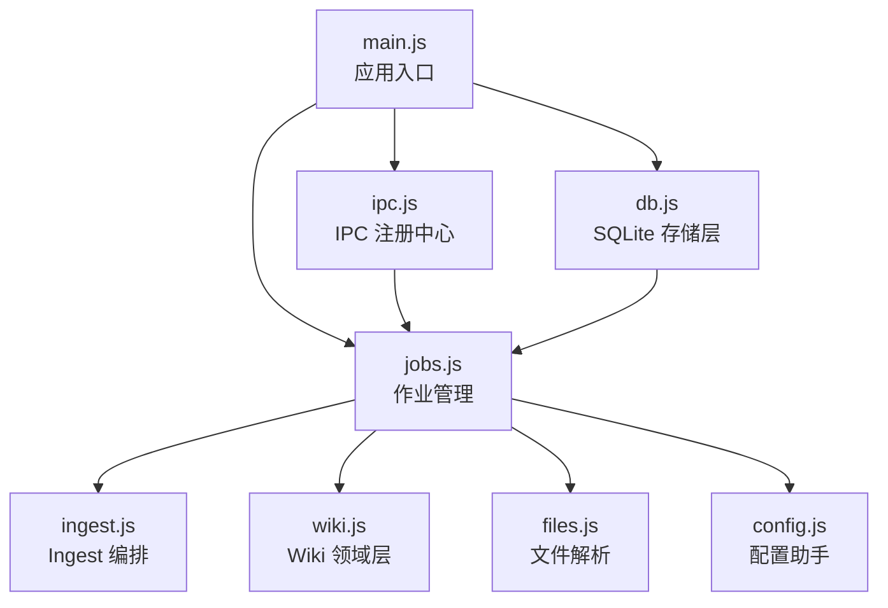
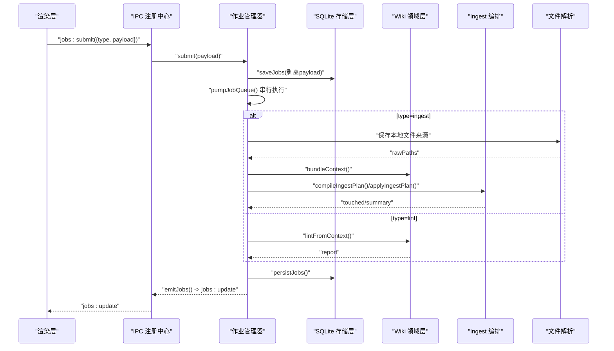
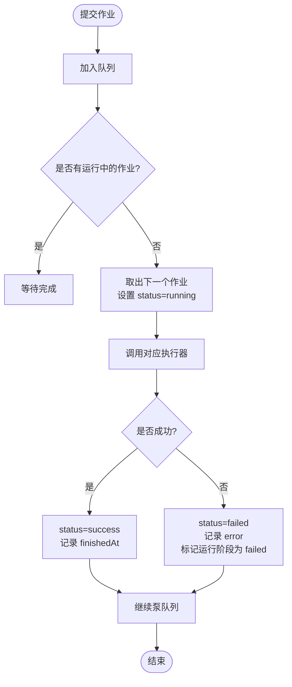
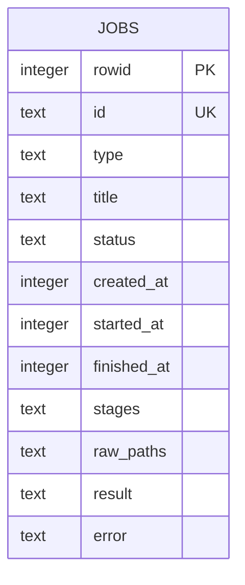
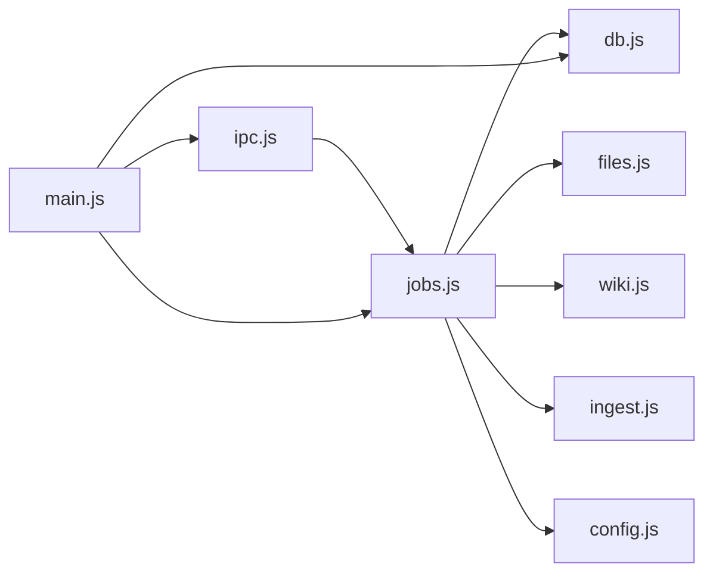

# 作业管理接口

<cite>
**本文引用的文件**
- [src/main/jobs.js](file://src/main/jobs.js)
- [src/main/ipc.js](file://src/main/ipc.js)
- [src/main/db.js](file://src/main/db.js)
- [src/main/ingest.js](file://src/main/ingest.js)
- [src/main/wiki.js](file://src/main/wiki.js)
- [src/main/files.js](file://src/main/files.js)
- [src/main/config.js](file://src/main/config.js)
- [main.js](file://main.js)
- [package.json](file://package.json)
</cite>

## 目录
1. [简介](#简介)
2. [项目结构](#项目结构)
3. [核心组件](#核心组件)
4. [架构总览](#架构总览)
5. [详细组件分析](#详细组件分析)
6. [依赖关系分析](#依赖关系分析)
7. [性能与容量](#性能与容量)
8. [故障排查指南](#故障排查指南)
9. [结论](#结论)
10. [附录：作业类型扩展指南](#附录作业类型扩展指南)

## 简介
本文件为“作业管理接口”的完整技术文档，覆盖任务队列的所有操作接口（提交、状态监控、历史查询、重试）、串行执行模式、阶段状态机、作业持久化策略、错误处理、超时控制、资源清理、性能监控与调试方法，并提供作业类型扩展的开发指南。系统基于 Electron 主进程实现，使用 SQLite（sql.js）进行数据持久化，通过 IPC 暴露给渲染层调用。

## 项目结构
- 入口与装配：应用启动时初始化数据库、加载作业历史、注册 IPC 通道、创建窗口。
- 存储层：SQLite 持久化笔记、设置与作业历史，支持原子落盘与路径切换。
- 领域层：Wiki 上下文打包、页面读写、日志追加、来源保存、问答与体检。
- 文件解析：多格式文件转 Markdown 并保存到 raw/。
- Ingest 编排：读取原始来源 → AI 编译页面计划 → 落盘写入。
- 作业管理：串行队列 + 阶段状态机 + 历史持久化 + 中断恢复/重试。
- IPC 注册中心：统一暴露 jobs:list / submit / remove / clear / retry 等接口。

图表来源
- [main.js:41-47](file://main.js#L41-L47)
- [src/main/jobs.js:1-12](file://src/main/jobs.js#L1-L12)
- [src/main/ipc.js:84-105](file://src/main/ipc.js#L84-L105)
- [src/main/db.js:92-109](file://src/main/db.js#L92-L109)

章节来源
- [main.js:1-56](file://main.js#L1-L56)
- [package.json:1-45](file://package.json#L1-L45)

## 核心组件
- 作业管理器（jobs.js）：定义作业生命周期、阶段状态机、串行队列调度、历史持久化、重试逻辑。
- IPC 注册中心（ipc.js）：对外暴露 jobs:list、jobs:submit、jobs:remove、jobs:clear、jobs:retry。
- 存储层（db.js）：SQLite 表结构、迁移、作业历史存取、原子落盘。
- Ingest 编排（ingest.js）：读取原始来源、AI 编译页面计划、落盘写入与日志记录。
- Wiki 领域（wiki.js）：上下文打包、页面读取、来源保存、日志追加、体检报告生成。
- 文件解析（files.js）：PDF/DOCX/XLSX/PPTX/文本等格式转 Markdown 并保存到 raw/。
- 配置助手（config.js）：数值/枚举配置校验与回退。

章节来源
- [src/main/jobs.js:1-260](file://src/main/jobs.js#L1-L260)
- [src/main/ipc.js:84-105](file://src/main/ipc.js#L84-L105)
- [src/main/db.js:111-149](file://src/main/db.js#L111-L149)
- [src/main/ingest.js:1-85](file://src/main/ingest.js#L1-L85)
- [src/main/wiki.js:116-151](file://src/main/wiki.js#L116-L151)
- [src/main/files.js:22-99](file://src/main/files.js#L22-L99)
- [src/main/config.js:1-18](file://src/main/config.js#L1-L18)

## 架构总览
作业管理采用“串行队列 + 阶段状态机”的设计：
- 所有作业按提交顺序进入队列，同一时间仅运行一个作业，避免并发写 wiki 文件冲突。
- 每个作业包含若干阶段（stages），阶段状态包括 pending、running、success、failed。
- 作业状态包括 queued、running、success、failed；运行期 payload 不持久化，仅保留必要元信息。
- 每次阶段或作业状态变更都会持久化到 SQLite 并通过 IPC 广播更新到渲染层。

图表来源
- [src/main/ipc.js:84-105](file://src/main/ipc.js#L84-L105)
- [src/main/jobs.js:72-121](file://src/main/jobs.js#L72-L121)
- [src/main/jobs.js:136-188](file://src/main/jobs.js#L136-L188)
- [src/main/db.js:343-355](file://src/main/db.js#L343-L355)

## 详细组件分析

### 作业队列与执行器
- 串行队列：维护 jobQueue 数组与 runningJobId，确保同时只有一个作业运行。
- 阶段状态机：每个作业包含 stages，阶段 key 唯一，状态在 setStage 中更新并持久化。
- 执行器映射：JOB_RUNNERS 根据作业类型分发到具体执行函数（ingest/lint）。
- 生命周期：queued → running → success/failed，记录 startedAt/finishedAt，失败时记录 error 并标记当前运行阶段为 failed。

图表来源
- [src/main/jobs.js:72-98](file://src/main/jobs.js#L72-L98)
- [src/main/jobs.js:100-121](file://src/main/jobs.js#L100-L121)

章节来源
- [src/main/jobs.js:72-121](file://src/main/jobs.js#L72-L121)

### 作业类型与阶段定义
- ingest 作业阶段：
  - save：解析保存来源（本地文件或 URL/文本）
  - compile：AI 编译页面计划
  - write：落盘写入页面、更新索引与日志
- lint 作业阶段：
  - collect：收集全库页面
  - analyze：AI 体检
  - done：报告完成

章节来源
- [src/main/jobs.js:124-188](file://src/main/jobs.js#L124-L188)

### 作业持久化策略
- 持久化时机：提交、阶段更新、作业完成/失败时均持久化。
- 内容裁剪：持久化时剥离 payload（含 API 配置与全文），仅保留必要元信息。
- 历史记录上限：从 settings.maxJobsHistory 动态读取，默认 50，范围 1–500。
- 数据库表结构：jobs 表包含 id、type、title、status、时间戳、stages、raw_paths、result、error。
- 原子落盘：整体导出到临时文件后 rename，避免写入中断损坏。

图表来源
- [src/main/db.js:134-147](file://src/main/db.js#L134-L147)
- [src/main/db.js:343-355](file://src/main/db.js#L343-L355)
- [src/main/jobs.js:21-53](file://src/main/jobs.js#L21-L53)

章节来源
- [src/main/db.js:111-149](file://src/main/db.js#L111-L149)
- [src/main/db.js:288-355](file://src/main/db.js#L288-L355)
- [src/main/jobs.js:21-53](file://src/main/jobs.js#L21-L53)

### 外部接口（IPC）
- jobs:list：返回作业列表（内存快照，不含 payload）。
- jobs:submit：提交作业，自动校验参数并生成标题。
- jobs:remove：删除单条终态作业（进行中/排队中不可删）。
- jobs:clear：清空全部终态作业历史（保留进行中/排队中）。
- jobs:retry：重试失败作业，ingest 复用已保存的 raw/ 来源跳过解析阶段。

章节来源
- [src/main/ipc.js:84-105](file://src/main/ipc.js#L84-L105)
- [src/main/jobs.js:191-257](file://src/main/jobs.js#L191-L257)

### 错误处理与异常传播
- 阶段错误：捕获执行器抛出的异常，将当前运行阶段标记为 failed 并记录错误消息。
- 应用重启恢复：加载历史时将仍在 running/queued 的作业标记为 failed，并记录“应用重启导致作业中断”。
- 输入校验：提交 ingest 时需至少有一个可吸收来源；否则返回错误提示。
- 文件与网络：不支持的文件格式、内容为空、网页拉取失败等会抛出明确错误。

章节来源
- [src/main/jobs.js:25-43](file://src/main/jobs.js#L25-L43)
- [src/main/jobs.js:83-98](file://src/main/jobs.js#L83-L98)
- [src/main/jobs.js:196-213](file://src/main/jobs.js#L196-L213)
- [src/main/files.js:77-99](file://src/main/files.js#L77-L99)
- [src/main/wiki.js:153-191](file://src/main/wiki.js#L153-L191)

### 超时控制与资源清理
- 网页拉取超时：settings.urlFetchTimeout（秒），默认 30，范围 1–600，使用 AbortController 中断请求。
- 来源长度限制：settings.sourceMaxChars（字符数），默认 60000，范围 1000–1000000，超长截断并提示。
- 资源释放：PDF 解析完成后销毁解析器；临时文件通过 .tmp + rename 方式避免半写。
- 内存清理：作业完成后清空 payload，减少内存占用。

章节来源
- [src/main/wiki.js:153-191](file://src/main/wiki.js#L153-L191)
- [src/main/ingest.js:8-20](file://src/main/ingest.js#L8-L20)
- [src/main/files.js:22-41](file://src/main/files.js#L22-L41)
- [src/main/jobs.js:92-98](file://src/main/jobs.js#L92-L98)

### 作业监控与调试
- 实时状态推送：阶段或作业状态变更后通过 IPC 发送 jobs:update，渲染层订阅更新 UI。
- 调试开关：启动参数 --kb-debug 打开开发者工具。
- 日志记录：Ingest 与问答回填会追加到 log.md，便于追踪变更。
- 历史查看：jobs:list 返回最近 N 条作业历史（受 maxJobsHistory 限制）。

章节来源
- [src/main/jobs.js:55-69](file://src/main/jobs.js#L55-L69)
- [src/main/jobs.js:191-193](file://src/main/jobs.js#L191-L193)
- [src/main/ingest.js:64-82](file://src/main/ingest.js#L64-L82)
- [src/main/wiki.js:136-151](file://src/main/wiki.js#L136-L151)
- [main.js:34-38](file://main.js#L34-L38)

## 依赖关系分析
- jobs.js 依赖：
  - files.js：保存本地文件来源
  - wiki.js：上下文打包、来源保存、体检报告
  - ingest.js：Ingest 三步流程
  - db.js：作业历史持久化
  - config.js：数值配置校验
- ipc.js 作为统一入口，将渲染层请求路由到 jobs.js。
- main.js 负责初始化顺序：db.init → jobs.init/loadJobs → registerIpc → createWindow。

图表来源
- [src/main/ipc.js:84-105](file://src/main/ipc.js#L84-L105)
- [src/main/jobs.js:1-8](file://src/main/jobs.js#L1-L8)
- [main.js:41-47](file://main.js#L41-L47)

章节来源
- [src/main/jobs.js:1-8](file://src/main/jobs.js#L1-L8)
- [src/main/ipc.js:84-105](file://src/main/ipc.js#L84-L105)
- [main.js:41-47](file://main.js#L41-L47)

## 性能与容量
- 串行执行：避免并发写 wiki 文件冲突，降低锁竞争与 IO 抖动。
- 批量持久化：作业历史以全量覆盖方式写入，配合事务与原子落盘，保证一致性。
- 上下文裁剪：Ingest 对超长来源进行截断，防止提示词爆炸与模型超时。
- 历史上限：maxJobsHistory 控制历史条目数量，避免数据库膨胀。
- 建议优化：
  - 对大文件解析增加进度回调与分段处理。
  - 对 LLM 调用增加重试与退避策略。
  - 对高频写入场景考虑增量持久化或 WAL 模式（若后续迁移至真实 SQLite）。

[本节为通用性能讨论，不直接分析具体文件]

## 故障排查指南
- 无法提交作业：检查 payload 是否包含至少一个可吸收来源（files/url/text）。
- 作业一直排队：确认是否有其他作业正在运行（runningJobId 非空）。
- 阶段卡在 running：查看阶段 detail 是否包含错误信息；检查网络与模型服务可用性。
- 重试失败：ingest 需存在 rawPaths；lint 可直接重试。
- 数据丢失风险：原子落盘机制下，断电或崩溃不会损坏数据库；可通过指针文件与备份 .bak 恢复。
- 调试技巧：
  - 使用 --kb-debug 打开 DevTools。
  - 观察 jobs:update 事件与阶段状态变化。
  - 查看 log.md 中的 Ingest/Query 记录。

章节来源
- [src/main/jobs.js:196-213](file://src/main/jobs.js#L196-L213)
- [src/main/jobs.js:72-98](file://src/main/jobs.js#L72-L98)
- [src/main/jobs.js:237-257](file://src/main/jobs.js#L237-L257)
- [src/main/db.js:36-81](file://src/main/db.js#L36-L81)
- [src/main/ingest.js:64-82](file://src/main/ingest.js#L64-L82)
- [main.js:34-38](file://main.js#L34-L38)

## 结论
作业管理系统通过串行队列与阶段状态机实现了稳定可靠的后台任务执行，结合 SQLite 持久化与 IPC 实时推送，提供了完整的作业提交、监控、历史查询与重试能力。通过合理的超时控制与资源清理机制，系统在长时间运行下具备较好的健壮性。未来可扩展更多作业类型以满足不同业务需求。

[本节为总结性内容，不直接分析具体文件]

## 附录：作业类型扩展指南
- 新增作业类型步骤：
  1. 在 JOB_RUNNERS 中添加新的异步执行函数，接收 job 对象。
  2. 定义该类型的阶段数组（stages），包含 key、name。
  3. 在 submit 中增加类型分支，调用 submitJob 并提交队列。
  4. 如需重试，完善 retry 分支逻辑（如复用 rawPaths 或重新收集上下文）。
  5. 在阶段执行中调用 setStage 更新状态与详情，必要时持久化。
  6. 遵循错误处理约定：捕获异常并设置 job.status=failed 与 stage.status=failed。
- 示例参考：
  - ingest 类型：三阶段（save/compile/write），复用 raw/ 来源。
  - lint 类型：三阶段（collect/analyze/done），基于全库上下文生成报告。
- 注意事项：
  - 避免在阶段中执行阻塞式长耗时操作，建议使用异步并适时上报进度。
  - 严格控制输入大小与输出格式，防止提示词爆炸或模型解析失败。
  - 保持 payload 精简，避免持久化敏感或超大字段。

章节来源
- [src/main/jobs.js:124-188](file://src/main/jobs.js#L124-L188)
- [src/main/jobs.js:196-213](file://src/main/jobs.js#L196-L213)
- [src/main/jobs.js:237-257](file://src/main/jobs.js#L237-L257)