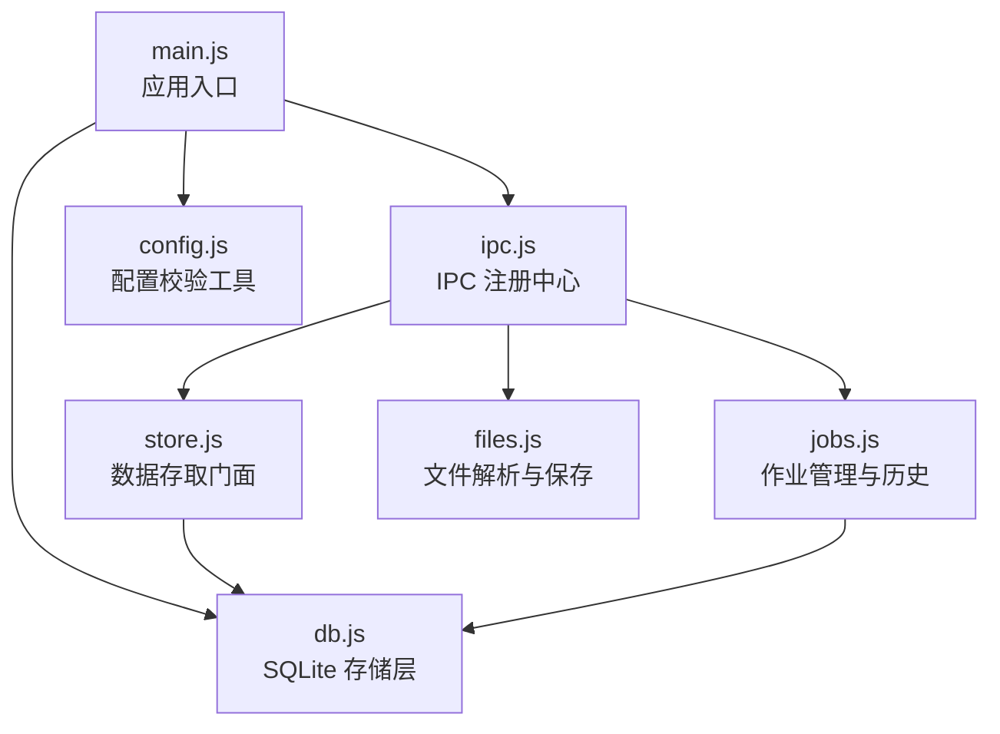
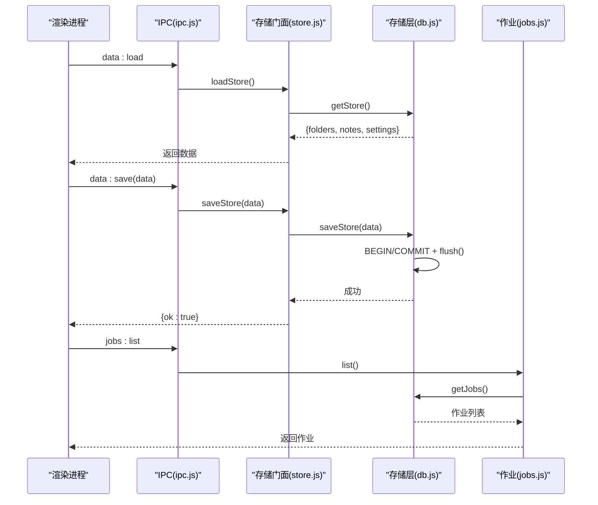
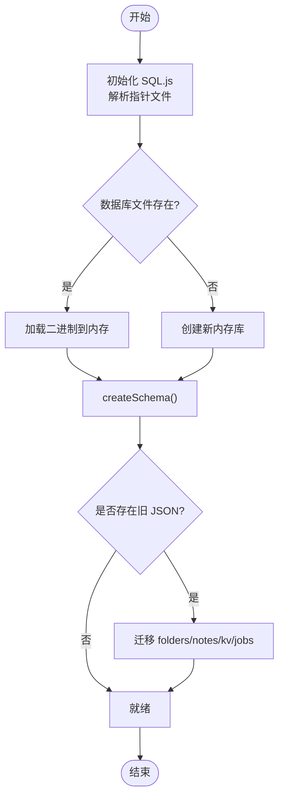
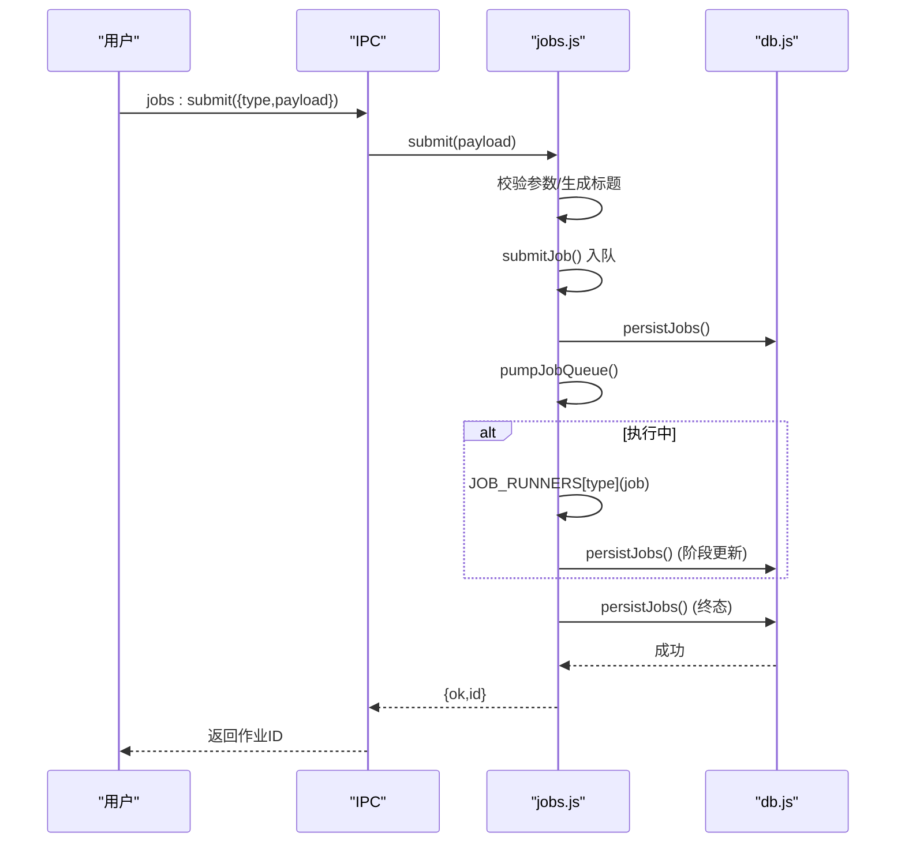
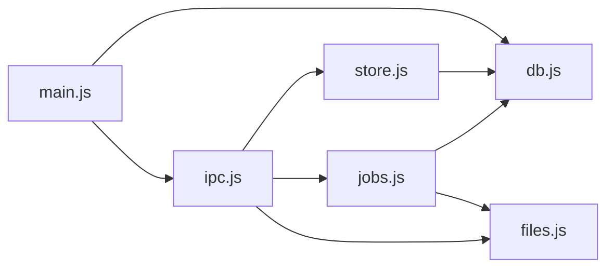

# 数据库操作接口

<cite>
**本文引用的文件**
- [db.js](file://src/main/db.js)
- [store.js](file://src/main/store.js)
- [ipc.js](file://src/main/ipc.js)
- [jobs.js](file://src/main/jobs.js)
- [files.js](file://src/main/files.js)
- [config.js](file://src/main/config.js)
- [main.js](file://main.js)
- [package.json](file://package.json)
</cite>

## 目录
1. [简介](#简介)
2. [项目结构](#项目结构)
3. [核心组件](#核心组件)
4. [架构总览](#架构总览)
5. [详细组件分析](#详细组件分析)
6. [依赖关系分析](#依赖关系分析)
7. [性能与查询优化](#性能与查询优化)
8. [故障排查指南](#故障排查指南)
9. [结论](#结论)
10. [附录：Schema、备份迁移与版本兼容](#附录schema备份迁移与版本兼容)

## 简介
本仓库使用 SQLite（通过 sql.js 的 WASM 内存实现）作为本地持久化存储，提供笔记管理、目录结构、标签系统、作业历史等核心数据模型的 CRUD 能力。所有写操作采用事务 + 原子落盘策略，保证数据一致性；读路径提供全量加载与键值配置读取。应用支持将数据库文件切换至任意绝对路径，并具备从旧 JSON 文件一次性迁移的能力。

## 项目结构
- 主进程入口负责初始化数据库、注册 IPC 通道、启动作业队列。
- 存储层封装 SQLite 建表、读写、事务、落盘与迁移。
- 业务层通过 store 模块暴露统一的加载/保存接口。
- IPC 层统一注册前端可调用接口，转发到具体模块。
- 作业模块维护任务状态机与历史持久化。
- 文件解析模块将多种文档转换为 Markdown 并保存到 raw 目录。

图表来源
- [main.js:41-47](file://main.js#L41-L47)
- [ipc.js:12-28](file://src/main/ipc.js#L12-L28)
- [store.js:1-16](file://src/main/store.js#L1-L16)
- [db.js:92-149](file://src/main/db.js#L92-L149)
- [jobs.js:1-23](file://src/main/jobs.js#L1-L23)
- [files.js:1-11](file://src/main/files.js#L1-L11)
- [config.js:1-17](file://src/main/config.js#L1-L17)

章节来源
- [main.js:1-56](file://main.js#L1-L56)
- [package.json:1-45](file://package.json#L1-L45)

## 核心组件
- 存储层（db.js）：负责 SQLite 初始化、Schema 创建、CRUD、事务、落盘、迁移、数据库文件切换。
- 数据门面（store.js）：对外暴露 loadStore/saveStore/getDataFile。
- IPC 通道（ipc.js）：注册 data:load、data:save、data:setDbPath、jobs:* 等接口。
- 作业管理（jobs.js）：串行执行作业、阶段状态机、历史持久化、重试与清理。
- 文件解析（files.js）：多格式转 Markdown，写入 raw 目录。
- 配置工具（config.js）：数值/枚举配置的默认回退与范围钳制。

章节来源
- [db.js:1-358](file://src/main/db.js#L1-L358)
- [store.js:1-17](file://src/main/store.js#L1-L17)
- [ipc.js:1-109](file://src/main/ipc.js#L1-L109)
- [jobs.js:1-260](file://src/main/jobs.js#L1-L260)
- [files.js:1-102](file://src/main/files.js#L1-L102)
- [config.js:1-18](file://src/main/config.js#L1-L18)

## 架构总览
数据流从渲染层经 IPC 进入主进程，再由 store/db 访问 SQLite 完成读写；作业模块在运行期维护任务状态，并将历史持久化到同一数据库。

图表来源
- [ipc.js:14-28](file://src/main/ipc.js#L14-L28)
- [store.js:8-14](file://src/main/store.js#L8-L14)
- [db.js:223-266](file://src/main/db.js#L223-L266)
- [jobs.js:25-53](file://src/main/jobs.js#L25-L53)

## 详细组件分析

### 存储层（db.js）
- 初始化与 Schema
  - 使用 sql.js 初始化内存数据库，按指针文件解析实际数据库路径。
  - 创建四张表：folders、notes、kv、jobs。
  - 若存在旧 JSON 文件则一次性迁移到 SQLite，成功后原文件改名 .bak。
- 事务与落盘
  - 批量写采用 BEGIN/COMMIT 包裹，异常时 ROLLBACK。
  - 每次写后整体导出为二进制并通过临时文件 rename 原子落盘，避免损坏。
- 数据模型
  - folders：id、name、parent_id，用于目录树。
  - notes：id、title、content、tags（JSON 数组）、folder_id、pinned、created_at、updated_at。
  - kv：key/value 键值对，用于设置。
  - jobs：作业历史，包含类型、标题、状态、时间戳、阶段、原始路径、结果、错误信息。
- 数据库文件切换
  - setDbPath 支持切换到任意绝对路径，目标存在时拒绝覆盖；恢复默认时旧文件改名留底。
  - 切换过程整库导出到新路径，更新指针文件并刷新。

图表来源
- [db.js:92-109](file://src/main/db.js#L92-L109)
- [db.js:111-149](file://src/main/db.js#L111-L149)
- [db.js:151-177](file://src/main/db.js#L151-L177)

章节来源
- [db.js:1-358](file://src/main/db.js#L1-L358)

### 数据门面（store.js）
- 提供 getDataFile/loadStore/saveStore 三个方法，屏蔽底层 db 细节。
- 适合渲染进程通过 IPC 调用，保持职责清晰。

章节来源
- [store.js:1-17](file://src/main/store.js#L1-L17)

### IPC 通道（ipc.js）
- 统一注册 data:load、data:save、data:setDbPath、dialog:export、ai:ask、wiki:*、jobs:* 等接口。
- 对数据保存进行 try/catch 包装，返回统一的成功/失败结构。
- 作业相关接口委托给 jobs 模块，内部再调用 db 持久化。

章节来源
- [ipc.js:1-109](file://src/main/ipc.js#L1-L109)

### 作业管理（jobs.js）
- 串行队列：runningJobId 保证同时仅一个作业执行，避免并发写冲突。
- 阶段状态机：每个作业包含 stages 数组，记录各阶段状态与详情。
- 历史持久化：持久化时剥离 payload（含 API 配置与全文），仅保留必要字段。
- 重启恢复：加载历史时将 running/queued 标记为 failed，并记录中断原因。
- 重试策略：ingest 类型支持复用已保存的 rawPaths 跳过解析阶段；lint 直接重新提交。

图表来源
- [ipc.js:84-97](file://src/main/ipc.js#L84-L97)
- [jobs.js:100-121](file://src/main/jobs.js#L100-L121)
- [jobs.js:72-98](file://src/main/jobs.js#L72-L98)
- [jobs.js:45-53](file://src/main/jobs.js#L45-L53)

章节来源
- [jobs.js:1-260](file://src/main/jobs.js#L1-L260)

### 文件解析（files.js）
- 支持 PDF、DOCX、Excel、PPTX、Markdown、文本、CSV 等格式转 Markdown。
- 保存至 wiki 根目录下的 raw/ 子目录，文件名带日期前缀与 slugify 标题。
- 空内容或不支持的扩展名会抛出错误，便于上层捕获并提示。

章节来源
- [files.js:1-102](file://src/main/files.js#L1-L102)

### 配置工具（config.js）
- num：数值配置取整并钳制到 [min, max]。
- pick：枚举配置不在允许列表时回退默认值。
- 由作业模块读取 settings.maxJobsHistory 控制历史条数上限。

章节来源
- [config.js:1-18](file://src/main/config.js#L1-L18)
- [jobs.js:20-23](file://src/main/jobs.js#L20-L23)

## 依赖关系分析
- main.js 在 app ready 后初始化 db、jobs、IPC，确保数据可用后再创建窗口。
- ipc.js 依赖 store、db、jobs、files、wiki、llm 等模块，承担路由职责。
- store.js 仅依赖 db.js，保持薄封装。
- jobs.js 依赖 db.js 持久化历史，依赖 files/wiki/ingest 完成业务逻辑。
- package.json 声明 sql.js 为运行时依赖，WASM 资源由 sql.js 管理。

图表来源
- [main.js:41-47](file://main.js#L41-L47)
- [ipc.js:1-10](file://src/main/ipc.js#L1-L10)
- [store.js:1-16](file://src/main/store.js#L1-L16)
- [jobs.js:1-7](file://src/main/jobs.js#L1-L7)
- [files.js:1-10](file://src/main/files.js#L1-L10)

章节来源
- [main.js:1-56](file://main.js#L1-L56)
- [package.json:36-43](file://package.json#L36-L43)

## 性能与查询优化
- 批量写入
  - 使用 BEGIN/COMMIT 包裹多条插入，减少磁盘同步次数。
  - 全量覆盖场景（如 saveStore/saveJobs）先 DELETE 再批量 INSERT，保持行序一致。
- 原子落盘
  - 每次写后整体导出二进制并通过 .tmp + rename 原子替换，降低崩溃风险。
- 索引建议
  - 当前未显式创建索引；如需高频按 folder_id、tags、status 过滤，可在后续版本按需添加索引以提升查询性能。
- 并发控制
  - 作业串行执行，避免并发写 Wiki 文件与数据库竞争。
  - 数据库为单进程内存实例，IPC 请求在主进程内顺序处理，天然避免并发写冲突。
- 读取优化
  - 全量加载适用于小规模知识库；未来可按需分页或增量同步以降低首屏开销。
- 配置影响
  - 通过 settings.maxJobsHistory 限制历史条目数量，控制数据库体积增长。

[本节为通用性能建议，不直接分析具体代码片段]

## 故障排查指南
- 数据库文件切换失败
  - 检查传入路径是否为绝对路径；目标文件是否已存在；权限是否足够。
  - 参考 setDbPath 的错误返回结构，定位失败原因。
- 迁移失败
  - 旧 JSON 文件解析失败时会保留原文件并记录错误日志；检查文件格式与内容完整性。
- 作业历史丢失或状态异常
  - 应用重启会将 running/queued 标记为 failed；检查 persistJobs 是否被调用以及是否有异常。
- 文件解析报错
  - 不支持的扩展名或内容为空会抛出错误；确认输入文件类型与内容有效性。
- 配置项非法
  - config.num/pick 会在非法或缺失时回退默认值；检查 settings 结构与取值范围。

章节来源
- [db.js:36-81](file://src/main/db.js#L36-L81)
- [db.js:151-177](file://src/main/db.js#L151-L177)
- [jobs.js:25-53](file://src/main/jobs.js#L25-L53)
- [files.js:77-99](file://src/main/files.js#L77-L99)
- [config.js:5-15](file://src/main/config.js#L5-L15)

## 结论
该数据库方案以 SQLite（sql.js）为核心，结合事务与原子落盘，提供了稳定可靠的本地持久化能力。通过清晰的模块划分（db/store/ipc/jobs/files），实现了笔记、目录、标签、作业历史的完整 CRUD。当前设计在小规模知识库场景下表现良好；随着数据量增长，可引入索引、分页与增量同步进一步优化性能。

[本节为总结性内容，不直接分析具体代码片段]

## 附录：Schema、备份迁移与版本兼容

### 数据模型（Schema）
- folders
  - id: TEXT UNIQUE NOT NULL
  - name: TEXT NOT NULL
  - parent_id: TEXT（可为空）
- notes
  - id: TEXT UNIQUE NOT NULL
  - title: TEXT NOT NULL DEFAULT ''
  - content: TEXT NOT NULL DEFAULT ''
  - tags: TEXT NOT NULL DEFAULT '[]'（JSON 数组）
  - folder_id: TEXT（可为空）
  - pinned: INTEGER NOT NULL DEFAULT 0
  - created_at: INTEGER NOT NULL DEFAULT 0
  - updated_at: INTEGER NOT NULL DEFAULT 0
- kv
  - key: TEXT PRIMARY KEY
  - value: TEXT NOT NULL
- jobs
  - id: TEXT UNIQUE NOT NULL
  - type: TEXT NOT NULL
  - title: TEXT NOT NULL
  - status: TEXT NOT NULL
  - created_at: INTEGER NOT NULL DEFAULT 0
  - started_at: INTEGER NOT NULL DEFAULT 0
  - finished_at: INTEGER NOT NULL DEFAULT 0
  - stages: TEXT NOT NULL DEFAULT '[]'（JSON 数组）
  - raw_paths: TEXT（JSON 数组，可为空）
  - result: TEXT（JSON，可为空）
  - error: TEXT NOT NULL DEFAULT ''

章节来源
- [db.js:111-149](file://src/main/db.js#L111-L149)

### 备份与恢复
- 原子落盘
  - flush 将内存数据库整体导出为二进制，写入 .tmp 后 rename 到目标文件，避免部分写入导致损坏。
- 数据库文件切换
  - setDbPath 支持切换到任意绝对路径；恢复默认时旧文件改名 .bak 留底，防止误用陈旧数据。
  - 指针文件 db-path.json 记录当前数据库位置；为空表示使用默认路径。
- 手动备份
  - 可直接复制 knowledge.db 或其自定义路径文件作为备份；建议在应用关闭或无写入时进行。

章节来源
- [db.js:179-187](file://src/main/db.js#L179-L187)
- [db.js:21-32](file://src/main/db.js#L21-L32)
- [db.js:36-81](file://src/main/db.js#L36-L81)

### 迁移策略
- 旧 JSON 迁移
  - 启动时检测 knowledge-data.json 与 wiki-jobs.json，若存在则迁移到 SQLite，成功后原文件改名 .bak。
  - 迁移失败保留原文件并记录错误日志，便于人工干预。
- 版本兼容
  - createSchema 使用 IF NOT EXISTS 建表，确保新增字段/表不会破坏旧库。
  - 建议在后续版本增加显式版本号字段（如 kv 中的 _version），并在 init 时执行渐进式迁移脚本。

章节来源
- [db.js:151-177](file://src/main/db.js#L151-L177)
- [db.js:111-149](file://src/main/db.js#L111-L149)

### 数据验证规则
- 数值配置
  - config.num 将非有限数值回退为默认值，并钳制到指定范围。
- 枚举配置
  - config.pick 仅在允许列表内取值有效，否则回退默认。
- 作业历史上限
  - 通过 settings.maxJobsHistory 限制持久化的作业条数，避免无限增长。
- 文件解析
  - 不支持的扩展名或空内容会抛出错误，上层应捕获并提示用户。

章节来源
- [config.js:5-15](file://src/main/config.js#L5-L15)
- [jobs.js:20-23](file://src/main/jobs.js#L20-L23)
- [files.js:82-89](file://src/main/files.js#L82-L89)