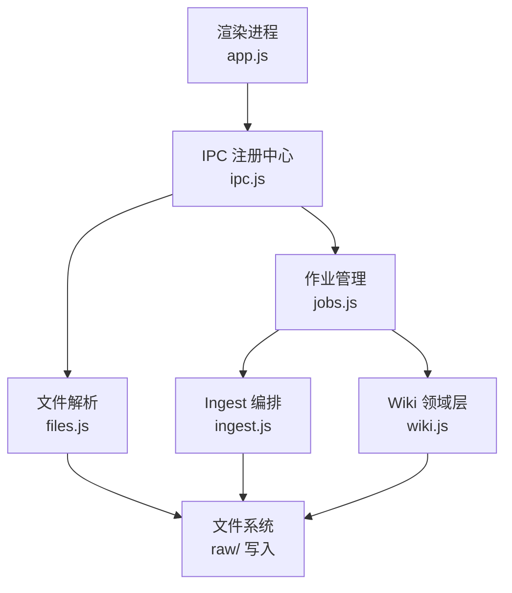
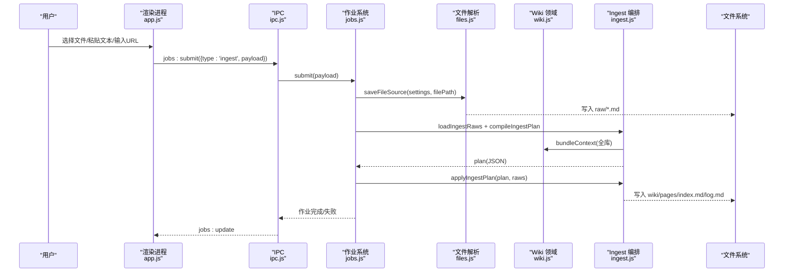
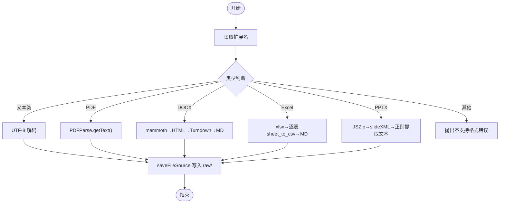
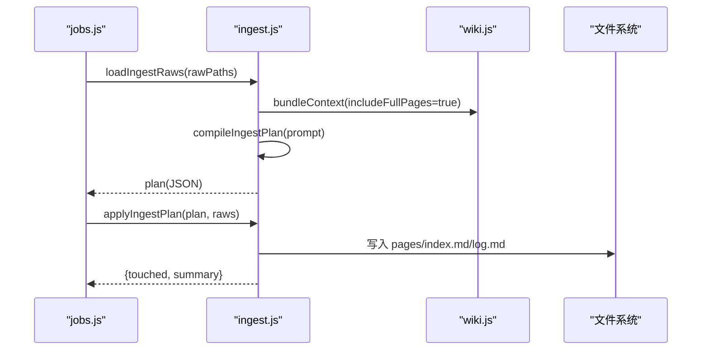
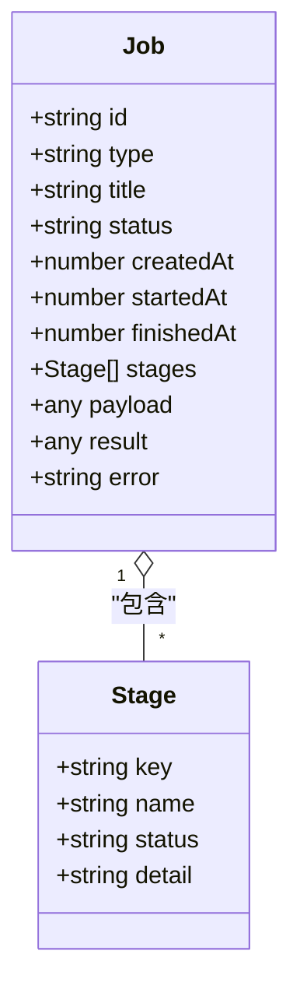
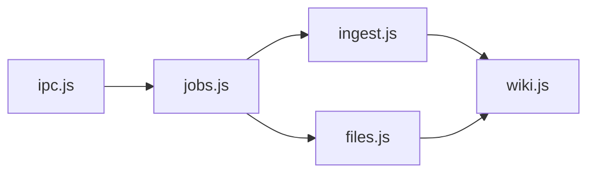

# 文件处理接口

<cite>
**本文引用的文件**
- [package.json](file://package.json)
- [main.js](file://main.js)
- [src/main/ipc.js](file://src/main/ipc.js)
- [src/main/files.js](file://src/main/files.js)
- [src/main/ingest.js](file://src/main/ingest.js)
- [src/main/jobs.js](file://src/main/jobs.js)
- [src/main/wiki.js](file://src/main/wiki.js)
- [src/main/config.js](file://src/main/config.js)
- [src/app.js](file://src/app.js)
</cite>

## 目录
1. [简介](#简介)
2. [项目结构](#项目结构)
3. [核心组件](#核心组件)
4. [架构总览](#架构总览)
5. [详细组件分析](#详细组件分析)
6. [依赖关系分析](#依赖关系分析)
7. [性能与限制](#性能与限制)
8. [故障排查指南](#故障排查指南)
9. [结论](#结论)
10. [附录：扩展新文件格式开发指南](#附录：扩展新文件格式开发指南)

## 简介
本文件处理接口用于将本地文档（PDF、Word、Excel、PowerPoint、纯文本等）解析为 Markdown，并保存到知识库 raw/ 目录，随后通过 Ingest 流程由 AI 生成或更新 Wiki 页面。本文档覆盖：
- 支持的文件格式与解析方法
- 内容提取算法与格式转换流程
- 错误处理机制
- 批量文件处理的 API 调用示例
- 文件大小限制、编码处理与性能优化建议
- 新文件格式扩展的开发指南

## 项目结构
本项目基于 Electron，主进程负责文件系统、作业调度与 IPC；渲染进程提供 UI 与交互。文件处理相关模块集中在 src/main/ 下：
- files.js：文件解析与保存 raw/
- ingest.js：Ingest 编排（读取 raw → AI 编译 → 落盘）
- jobs.js：作业队列与阶段状态机
- wiki.js：Wiki 领域能力（上下文打包、日志、问答等）
- ipc.js：IPC 注册中心，暴露前端可调用的接口
- config.js：配置解析工具
- app.js：渲染进程逻辑（含吸收入口与 UI 交互）

图表来源
- [src/main/ipc.js:1-109](file://src/main/ipc.js#L1-L109)
- [src/main/files.js:1-102](file://src/main/files.js#L1-L102)
- [src/main/jobs.js:1-260](file://src/main/jobs.js#L1-L260)
- [src/main/ingest.js:1-85](file://src/main/ingest.js#L1-L85)
- [src/main/wiki.js:1-313](file://src/main/wiki.js#L1-L313)

章节来源
- [main.js:1-56](file://main.js#L1-L56)
- [src/main/ipc.js:1-109](file://src/main/ipc.js#L1-L109)

## 核心组件
- 文件解析器（files.js）
  - 支持格式：pdf、docx、xlsx、xls、pptx、md、markdown、txt、csv
  - 统一入口：extractFileContent(absPath)
  - 保存入口：saveFileSource(settings, filePath)
- Ingest 编排（ingest.js）
  - loadIngestRaws：加载 raw/ 内容并按 sourceMaxChars 截断
  - compileIngestPlan：调用 LLM 生成页面计划 JSON
  - applyIngestPlan：落盘 pages、更新 index.md、追加日志
- 作业管理（jobs.js）
  - 串行队列、阶段状态机、历史持久化、重试
  - 作业类型：ingest（吸收）、lint（体检）
- Wiki 领域（wiki.js）
  - 上下文打包、日志、问答、回填、路径安全
- IPC（ipc.js）
  - 暴露 wiki:pickFiles、jobs:submit、jobs:list、jobs:retry 等
- 配置（config.js）
  - num/pick 工具函数，用于数值与枚举配置校验

章节来源
- [src/main/files.js:1-102](file://src/main/files.js#L1-L102)
- [src/main/ingest.js:1-85](file://src/main/ingest.js#L1-L85)
- [src/main/jobs.js:1-260](file://src/main/jobs.js#L1-L260)
- [src/main/wiki.js:1-313](file://src/main/wiki.js#L1-L313)
- [src/main/ipc.js:1-109](file://src/main/ipc.js#L1-L109)
- [src/main/config.js:1-18](file://src/main/config.js#L1-L18)

## 架构总览
文件处理采用“解析 → 保存 raw → AI 编译 → 落盘”的流水线，并通过作业系统串行执行，避免并发写冲突。

图表来源
- [src/main/jobs.js:123-188](file://src/main/jobs.js#L123-L188)
- [src/main/files.js:22-99](file://src/main/files.js#L22-L99)
- [src/main/ingest.js:8-82](file://src/main/ingest.js#L8-L82)
- [src/main/wiki.js:117-134](file://src/main/wiki.js#L117-L134)

## 详细组件分析

### 文件解析器（files.js）
- 支持的扩展名常量：FILE_EXTENSIONS = ['pdf','docx','xlsx','xls','pptx','md','markdown','txt','csv']
- extractFileContent(absPath)
  - 文本类（md/markdown/txt/csv/json/log）：直接以 UTF-8 解码返回
  - PDF：使用 pdf-parse 的 PDFParse 读取文本，完成后销毁实例
  - DOCX：mammoth 转 HTML，再用 TurndownService 转为 Markdown（ATX 标题、围栏代码块）
  - Excel（xlsx/xls）：用 xlsx 读取工作簿，逐表导出 CSV，包装为 Markdown 表格块
  - PPTX：JSZip 解压后按 slideN.xml 顺序提取 <a:t> 文本节点，组装为幻灯片段落
- saveFileSource(settings, filePath)
  - 校验存在性与扩展名
  - 调用 extractFileContent 获取文本，trim 后非空校验
  - 生成带 frontmatter 风格的 Markdown 标题与元信息，写入 wikiRoot/raw/
  - 返回相对路径与标题

图表来源
- [src/main/files.js:22-99](file://src/main/files.js#L22-L99)

章节来源
- [src/main/files.js:1-102](file://src/main/files.js#L1-L102)

### Ingest 编排（ingest.js）
- loadIngestRaws(settings, ctx, rawPaths)
  - 读取 raw/ 下的来源文件，按 sourceMaxChars 截断超长内容，避免提示词爆炸
- compileIngestPlan(settings, ctx, raws)
  - 构造 prompt，包含 schema、index、现有页面、raw 来源
  - 调用 chatOnce 获取 JSON 计划（pages、index_md、summary）
  - 解析失败抛出错误
- applyIngestPlan(ctx, plan, raws)
  - 遍历 plan.pages，过滤非法路径，写入 wiki 对应目录
  - 更新 index.md 与 log.md
  - 返回 touched 页面列表与摘要

图表来源
- [src/main/ingest.js:8-82](file://src/main/ingest.js#L8-L82)
- [src/main/wiki.js:117-134](file://src/main/wiki.js#L117-L134)

章节来源
- [src/main/ingest.js:1-85](file://src/main/ingest.js#L1-L85)

### 作业管理（jobs.js）
- 串行队列：pumpJobQueue 保证同一时间仅一个作业运行
- 阶段状态机：每个作业包含 stages，记录各阶段状态与详情
- 历史持久化：SQLite 存储，剥离 payload 减少体积
- 作业类型：
  - ingest：保存来源 → AI 编译 → 落盘；支持重试复用 rawPaths
  - lint：收集全库 → AI 体检 → 报告完成
- 对外操作：list、submit、remove、clear、retry

图表来源
- [src/main/jobs.js:100-121](file://src/main/jobs.js#L100-L121)

章节来源
- [src/main/jobs.js:1-260](file://src/main/jobs.js#L1-L260)

### Wiki 领域（wiki.js）
- 路径安全：safeJoin 防止路径逃逸
- 上下文打包：bundleContext 收集 schema、index、页面清单与全文
- 日志：appendLog 在 log.md 当日分组追加条目
- 问答与回填：wikiAsk、fileAnswer
- 描述与读取：describeWiki、readPage

章节来源
- [src/main/wiki.js:1-313](file://src/main/wiki.js#L1-L313)

### IPC 注册中心（ipc.js）
- 暴露接口：
  - wiki:pickFiles：打开文件选择对话框，过滤 FILE_EXTENSIONS
  - jobs:submit：提交作业（ingest/lint）
  - jobs:list：获取作业列表
  - jobs:retry：重试失败作业
  - wiki:ask：Wiki 问答
  - wiki:read：读取 Wiki 页面
- 错误处理：try/catch 包裹业务调用，返回 ok/error

章节来源
- [src/main/ipc.js:1-109](file://src/main/ipc.js#L1-L109)

### 渲染进程入口（app.js）
- 吸收入口：openIngestModal、runIngest
  - 支持 URL、文本、文件三种模式
  - 调用 window.kb.jobsSubmit 提交作业
- 作业视图：showJobsView、renderJobsView
- 设置项：sourceMaxChars、urlFetchTimeout、logTailLines、wikiAskMaxPages 等

章节来源
- [src/app.js:680-772](file://src/app.js#L680-L772)

## 依赖关系分析
- 外部依赖
  - pdf-parse：PDF 文本提取
  - mammoth：DOCX 转 HTML
  - turndown：HTML 转 Markdown
  - xlsx：Excel 读写
  - jszip：PPTX 解压
  - marked：Markdown 渲染（渲染进程）
- 内部依赖
  - files.js 依赖 wiki.js 的路径工具
  - ingest.js 依赖 wiki.js 的上下文与日志
  - jobs.js 聚合 files.js、ingest.js、wiki.js
  - ipc.js 作为统一入口暴露给渲染进程

图表来源
- [src/main/ipc.js:1-109](file://src/main/ipc.js#L1-L109)
- [src/main/jobs.js:1-260](file://src/main/jobs.js#L1-L260)
- [src/main/files.js:1-102](file://src/main/files.js#L1-L102)
- [src/main/ingest.js:1-85](file://src/main/ingest.js#L1-L85)
- [src/main/wiki.js:1-313](file://src/main/wiki.js#L1-L313)

章节来源
- [package.json:1-45](file://package.json#L1-L45)

## 性能与限制
- 文件大小限制
  - 无硬性大小限制，但受内存与磁盘空间影响
  - 建议在 settings.sourceMaxChars 中控制 raw/ 内容长度，避免提示词过大（默认值见 ingest.js）
- 编码处理
  - 文本类统一使用 UTF-8 解码
  - XML 实体解码（PPTX）：decodeXmlEntities 处理常见实体
- 性能优化建议
  - PDF：使用后及时 destroy 解析器，释放资源
  - Excel：大表可能产生大量 CSV 文本，建议分表处理或限制 sheet 数量
  - PPTX：仅提取 a:t 文本，忽略样式与图片，降低复杂度
  - Ingest：启用 includeFullPages=false 的上下文打包可减少 LLM 输入规模
  - 作业串行：避免并发写冲突，提升稳定性
- 超时与中断
  - URL 拉取支持 urlFetchTimeout（秒），避免长时间阻塞
  - 应用重启会将进行中的作业标记为 failed，需重试

章节来源
- [src/main/files.js:33-73](file://src/main/files.js#L33-L73)
- [src/main/ingest.js:8-19](file://src/main/ingest.js#L8-L19)
- [src/main/wiki.js:154-191](file://src/main/wiki.js#L154-L191)
- [src/main/jobs.js:32-43](file://src/main/jobs.js#L32-L43)

## 故障排查指南
- 常见错误
  - 不支持的文件格式：检查扩展名是否在 FILE_EXTENSIONS 中
  - 文件内容为空：确保 extractFileContent 成功返回非空文本
  - 模型返回无法解析：检查 LLM 输出是否为合法 JSON
  - 非法路径：safeJoin 校验失败，检查 relPath 是否越界
- 定位步骤
  - 查看作业 stages 的 detail 字段，定位失败阶段
  - 检查 raw/ 目录是否生成对应 .md 文件
  - 检查 wiki/log.md 当日分组条目
- 恢复措施
  - 使用 jobs:retry 重试失败作业（ingest 会复用 rawPaths 跳过解析）
  - 调整 sourceMaxChars、urlFetchTimeout 等配置

章节来源
- [src/main/files.js:71-89](file://src/main/files.js#L71-L89)
- [src/main/ingest.js:57-61](file://src/main/ingest.js#L57-L61)
- [src/main/jobs.js:236-257](file://src/main/jobs.js#L236-L257)

## 结论
该文件处理接口提供了从多格式文档到 Markdown 的统一解析能力，并通过 Ingest 与作业系统实现稳定的批量处理与 AI 增强。通过合理的配置与错误处理，可支撑日常知识入库与质量维护需求。

## 附录：扩展新文件格式开发指南
- 目标
  - 新增一种文件格式（如 .epub、.rtf）的解析与转换
- 步骤
  1. 安装依赖
     - 在 package.json 中添加相应解析库（如 epub、rtf）
     - 运行 npm install 安装依赖
  2. 扩展解析逻辑
     - 在 files.js 的 extractFileContent 中添加新的 case 分支
     - 将目标格式转换为字符串文本（优先 Markdown 或纯文本）
     - 若涉及 XML/HTML，可使用 TurndownService 进行转换
  3. 更新支持列表
     - 在 FILE_EXTENSIONS 中添加新扩展名
  4. 测试与验证
     - 使用典型样本文件测试解析结果
     - 检查 raw/ 生成的 Markdown 是否符合预期
     - 验证 Ingest 流程能否正常生成页面
  5. 错误处理
     - 对解析异常进行 try/catch，抛出明确错误信息
     - 在 jobs 阶段记录错误详情，便于排查
  6. 性能考虑
     - 大文件应流式或分块处理，避免内存溢出
     - 必要时引入压缩或分页策略
- 参考路径
  - 解析入口：[src/main/files.js:22-73](file://src/main/files.js#L22-L73)
  - 保存入口：[src/main/files.js:77-99](file://src/main/files.js#L77-L99)
  - 支持列表：[src/main/files.js:11](file://src/main/files.js#L11)
  - 作业重试：[src/main/jobs.js:236-257](file://src/main/jobs.js#L236-L257)

章节来源
- [src/main/files.js:1-102](file://src/main/files.js#L1-L102)
- [src/main/jobs.js:236-257](file://src/main/jobs.js#L236-L257)