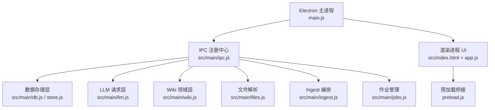
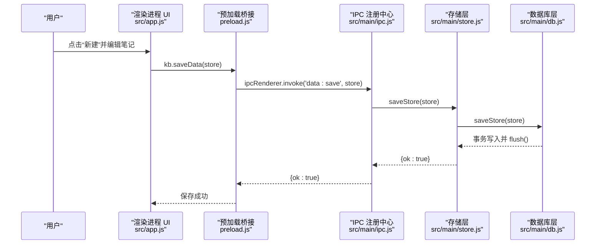
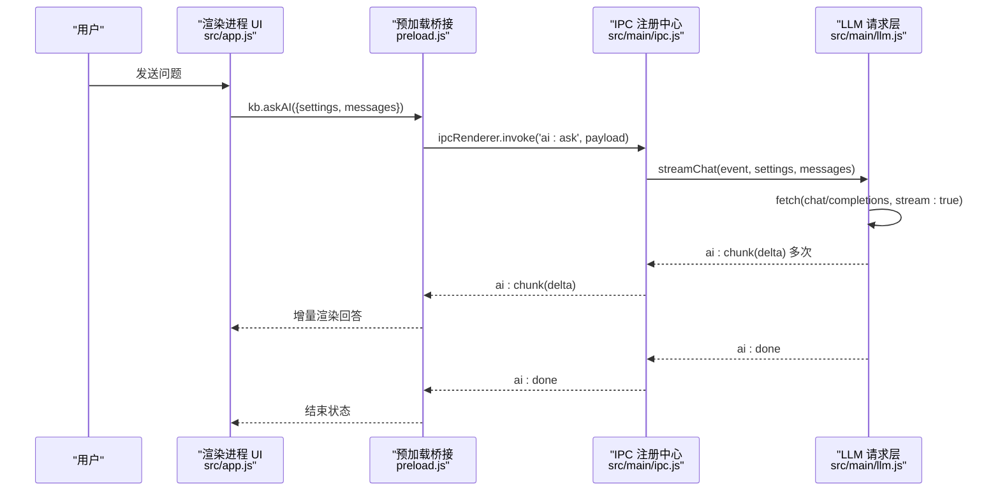
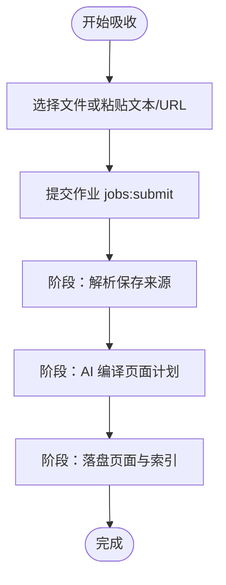
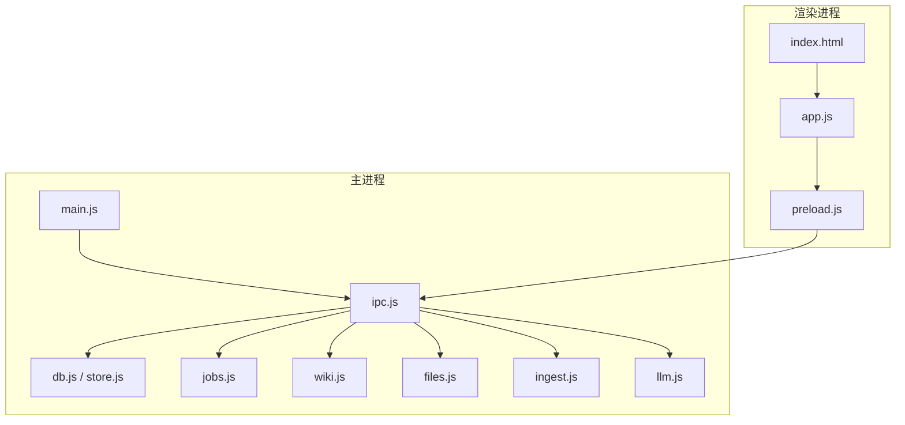
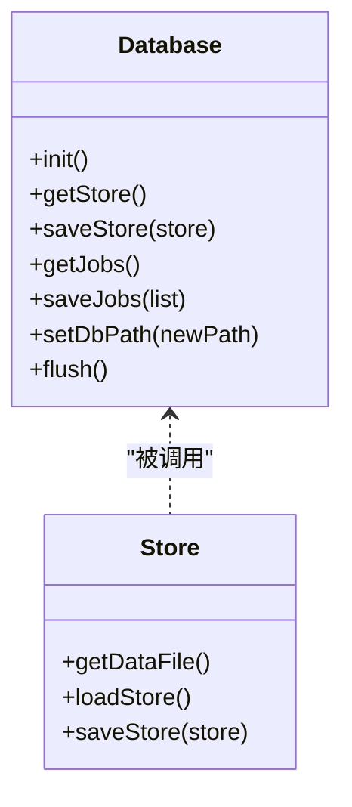
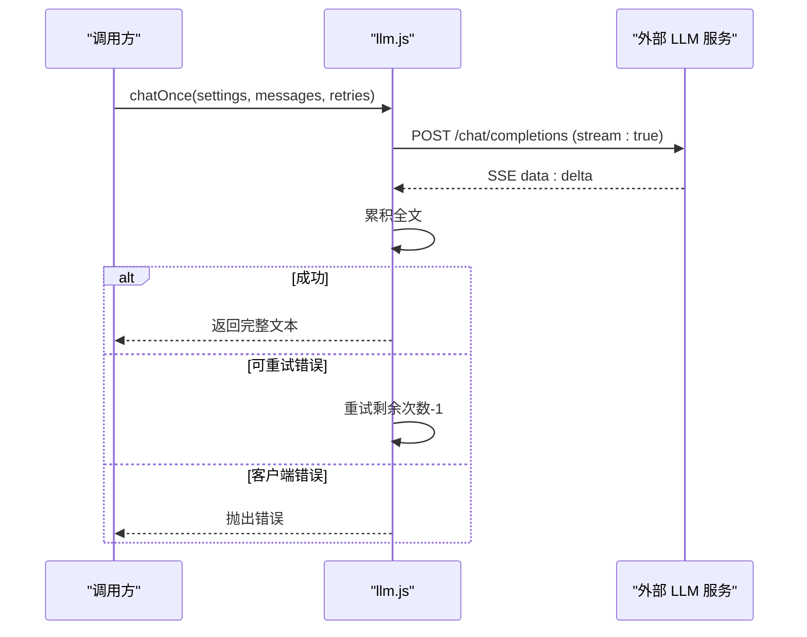
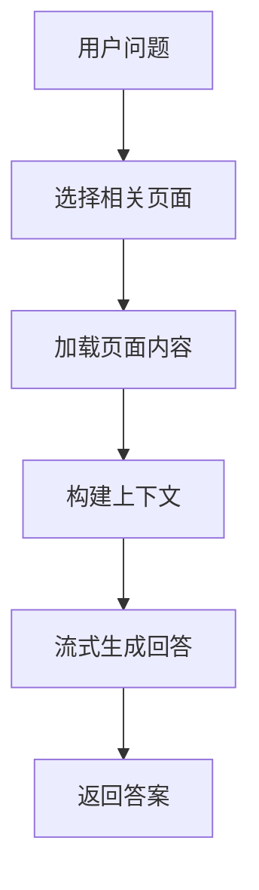
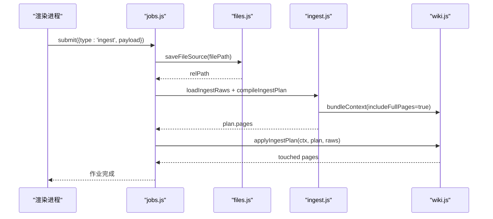
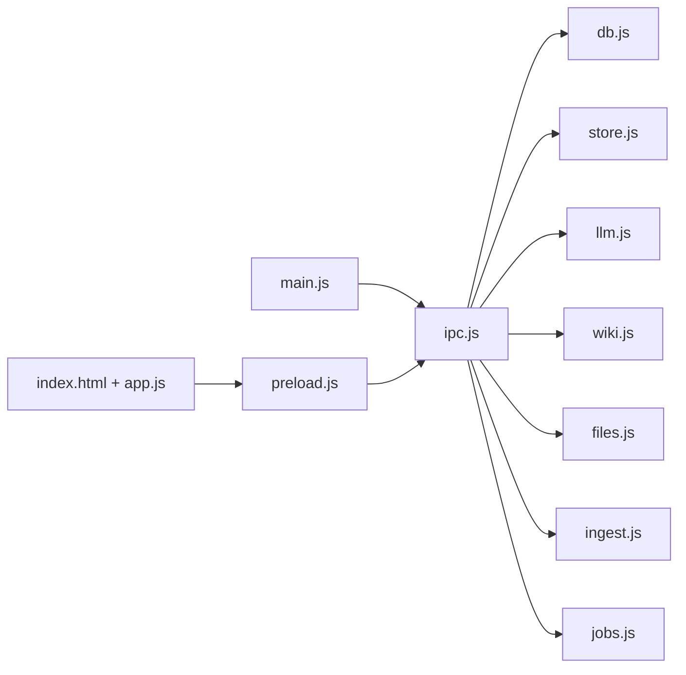

# 快速开始

<cite>
**本文引用的文件**
- [package.json](file://package.json)
- [main.js](file://main.js)
- [preload.js](file://preload.js)
- [src/index.html](file://src/index.html)
- [src/app.js](file://src/app.js)
- [src/main/ipc.js](file://src/main/ipc.js)
- [src/main/db.js](file://src/main/db.js)
- [src/main/store.js](file://src/main/store.js)
- [src/main/llm.js](file://src/main/llm.js)
- [src/main/wiki.js](file://src/main/wiki.js)
- [src/main/files.js](file://src/main/files.js)
- [src/main/ingest.js](file://src/main/ingest.js)
- [src/main/jobs.js](file://src/main/jobs.js)
</cite>

## 目录
1. [简介](#简介)
2. [项目结构](#项目结构)
3. [环境准备与安装](#环境准备与安装)
4. [启动应用](#启动应用)
5. [基础使用教程](#基础使用教程)
6. [架构总览](#架构总览)
7. [详细组件分析](#详细组件分析)
8. [依赖关系分析](#依赖关系分析)
9. [性能注意事项](#性能注意事项)
10. [故障排除指南](#故障排除指南)
11. [结论](#结论)

## 简介
Synapse 是一款本地优先的个人知识库助手，支持 Markdown 笔记、LLM Wiki（基于 OKF 模式文档）、知识图谱式索引、AI 智能问答与作业编排。它通过 Electron 构建桌面应用，数据持久化采用 SQLite（sql.js），并兼容 OpenAI 接口格式的 LLM 服务（如 OpenAI、DeepSeek、通义千问、Ollama 等）。

本快速开始指南将帮助你在最短时间内完成环境准备、安装依赖、启动应用，并完成创建第一个笔记、配置 AI 服务、导入第一个文件等核心操作。

## 项目结构
- 主进程入口：负责应用生命周期、窗口创建、模块装配与 IPC 注册
- 渲染进程：用户界面与交互逻辑，调用预加载桥接的 API
- 存储层：SQLite 数据库，持久化笔记、目录、设置与作业历史
- 领域层：Wiki 管理、文件解析、Ingest 编排、作业调度
- LLM 层：OpenAI 兼容流式对话与重试策略

**图表来源**
- [main.js:1-56](file://main.js#L1-L56)
- [src/main/ipc.js:1-109](file://src/main/ipc.js#L1-L109)
- [src/main/db.js:1-358](file://src/main/db.js#L1-L358)
- [src/main/store.js:1-17](file://src/main/store.js#L1-L17)
- [src/main/llm.js:1-123](file://src/main/llm.js#L1-L123)
- [src/main/wiki.js:1-313](file://src/main/wiki.js#L1-L313)
- [src/main/files.js:1-102](file://src/main/files.js#L1-L102)
- [src/main/ingest.js:1-85](file://src/main/ingest.js#L1-L85)
- [src/main/jobs.js:1-260](file://src/main/jobs.js#L1-L260)
- [src/index.html:1-291](file://src/index.html#L1-L291)
- [preload.js:1-56](file://preload.js#L1-L56)

**章节来源**
- [main.js:1-56](file://main.js#L1-L56)
- [src/index.html:1-291](file://src/index.html#L1-L291)
- [preload.js:1-56](file://preload.js#L1-L56)

## 环境准备与安装
- Node.js 版本要求
  - 本项目使用 Electron 31，建议安装与 Electron 官方支持的 LTS 或当前稳定版 Node.js（推荐 v18.x 或 v20.x）
- 系统要求
  - Windows 10/11（默认打包目标为 NSIS 安装包）
  - macOS/Linux 也可运行开发模式（start 脚本）
- 依赖安装
  - 在项目根目录执行：npm install
  - 依赖说明
    - 运行时依赖：jszip、mammoth、pdf-parse、sql.js、turndown、xlsx
    - 开发依赖：electron、electron-builder、marked、pdfkit

**章节来源**
- [package.json:1-45](file://package.json#L1-L45)

## 启动应用
- 开发模式启动
  - 执行：npm start
  - 说明：Electron 主进程会初始化数据库、加载作业历史、注册 IPC，并打开浏览器窗口加载 src/index.html
- 调试模式
  - 启动时附加参数 --kb-debug 可自动打开开发者工具
- 打包分发（Windows）
  - 执行：npm run dist
  - 产物：NSIS 安装包，包含 main.js、preload.js、src/**/* 与 node_modules

**章节来源**
- [main.js:1-56](file://main.js#L1-L56)
- [package.json:1-45](file://package.json#L1-L45)

## 基础使用教程
### 创建第一个笔记
- 在左侧导航点击“＋ 新建”
- 输入标题与内容（支持 Markdown）
- 可选：添加标签、选择目录、置顶
- 编辑区支持三种模式：编辑、分屏、预览
- 保存机制：自动防抖保存到 SQLite（通过 IPC 调用 data:save）

**图表来源**
- [src/app.js:107-118](file://src/app.js#L107-L118)
- [preload.js:3-7](file://preload.js#L3-L7)
- [src/main/ipc.js:14-23](file://src/main/ipc.js#L14-L23)
- [src/main/store.js:8-14](file://src/main/store.js#L8-L14)
- [src/main/db.js:252-266](file://src/main/db.js#L252-L266)

### 配置 AI 服务
- 打开“设置 > AI 服务”，填写以下三项：
  - 接口地址（Base URL）：例如 https://api.openai.com/v1
  - API Key：你的模型服务密钥
  - 模型名称：例如 gpt-4o-mini
- 保存后，可在“AI 问答”面板发送问题，系统将检索相关笔记并流式返回答案
- 兼容性：OpenAI、DeepSeek、通义千问、Ollama 等均可（需遵循 OpenAI 接口格式）

**图表来源**
- [src/app.js:478-549](file://src/app.js#L478-L549)
- [preload.js:9-25](file://preload.js#L9-L25)
- [src/main/ipc.js:45-46](file://src/main/ipc.js#L45-L46)
- [src/main/llm.js:40-77](file://src/main/llm.js#L40-L77)

### 导入第一个文件（吸收 Ingest）
- 支持的文件格式：PDF、DOCX、XLSX/XLS、PPTX、MD、TXT、CSV
- 操作步骤：
  - 点击侧边栏“LLM Wiki > ＋ 吸收新来源”
  - 选择“本地文件”并拖入或选择文件
  - 点击“开始吸收”，提交作业
  - 在“作业”页面查看进度与结果
- 吸收流程：
  - 解析保存来源到 raw/
  - 调用 AI 编译页面计划
  - 落盘生成 wiki 页面并更新索引与日志

**图表来源**
- [src/main/jobs.js:136-175](file://src/main/jobs.js#L136-L175)
- [src/main/files.js:22-99](file://src/main/files.js#L22-L99)
- [src/main/ingest.js:8-82](file://src/main/ingest.js#L8-L82)
- [src/main/wiki.js:153-191](file://src/main/wiki.js#L153-L191)

## 架构总览
- 主进程负责：应用生命周期、窗口创建、IPC 注册、作业队列与持久化
- 渲染进程负责：UI 渲染、用户交互、调用预加载桥接 API
- 存储层：SQLite 持久化笔记、目录、设置与作业历史
- 领域层：Wiki 管理、文件解析、Ingest 编排、作业调度
- LLM 层：OpenAI 兼容流式对话、重试策略、JSON 提取

**图表来源**
- [main.js:1-56](file://main.js#L1-L56)
- [src/main/ipc.js:1-109](file://src/main/ipc.js#L1-L109)
- [src/main/db.js:1-358](file://src/main/db.js#L1-L358)
- [src/main/store.js:1-17](file://src/main/store.js#L1-L17)
- [src/main/jobs.js:1-260](file://src/main/jobs.js#L1-L260)
- [src/main/wiki.js:1-313](file://src/main/wiki.js#L1-L313)
- [src/main/files.js:1-102](file://src/main/files.js#L1-L102)
- [src/main/ingest.js:1-85](file://src/main/ingest.js#L1-L85)
- [src/main/llm.js:1-123](file://src/main/llm.js#L1-L123)
- [src/index.html:1-291](file://src/index.html#L1-L291)
- [src/app.js:1-800](file://src/app.js#L1-L800)
- [preload.js:1-56](file://preload.js#L1-L56)

## 详细组件分析
### 数据存储层（SQLite）
- 职责：持久化笔记、目录、设置与作业历史；支持数据库路径切换与迁移
- 关键能力：
  - 初始化 schema（folders、notes、kv、jobs）
  - 迁移旧 JSON 数据至 SQLite
  - 原子写盘（导出到临时文件再 rename）
  - 指针文件管理（db-path.json）以支持自定义数据库路径

**图表来源**
- [src/main/db.js:92-149](file://src/main/db.js#L92-L149)
- [src/main/db.js:179-266](file://src/main/db.js#L179-L266)
- [src/main/db.js:288-355](file://src/main/db.js#L288-L355)
- [src/main/store.js:1-17](file://src/main/store.js#L1-L17)

**章节来源**
- [src/main/db.js:1-358](file://src/main/db.js#L1-L358)
- [src/main/store.js:1-17](file://src/main/store.js#L1-L17)

### LLM 请求层
- 职责：OpenAI 兼容流式对话、SSE 解析、重试策略、JSON 提取
- 关键能力：
  - 流式读取响应并推送增量
  - 非流式内部累积全文（用于编排步骤）
  - 可重试错误分类（网络/5xx/空返回）
  - 从模型输出中提取 JSON（容忍代码块包裹）

**图表来源**
- [src/main/llm.js:81-120](file://src/main/llm.js#L81-L120)

**章节来源**
- [src/main/llm.js:1-123](file://src/main/llm.js#L1-L123)

### Wiki 领域层
- 职责：Wiki 根目录定位、页面读取/描述、上下文打包、问答/体检/回填
- 关键能力：
  - 自动探测 AGENTS.md 所在目录
  - 安全路径拼接（防止目录逃逸）
  - 批量收集页面清单与全文
  - 问答两步检索（先选页，再流式合成）
  - 体检报告生成（全库质量检查）

**图表来源**
- [src/main/wiki.js:194-233](file://src/main/wiki.js#L194-L233)
- [src/main/wiki.js:117-134](file://src/main/wiki.js#L117-L134)

**章节来源**
- [src/main/wiki.js:1-313](file://src/main/wiki.js#L1-L313)

### 文件解析与 Ingest 编排
- 文件解析：支持 PDF、DOCX、Excel、PPTX、Markdown、TXT、CSV
- Ingest 编排：三步拆分（保存来源 → AI 编译 → 落盘），供作业系统分阶段上报
- 关键能力：
  - 超长来源截断（避免提示词爆炸）
  - 生成页面计划（严格遵循 OKF frontmatter）
  - 写入页面、更新索引与日志

**图表来源**
- [src/main/jobs.js:136-175](file://src/main/jobs.js#L136-L175)
- [src/main/files.js:22-99](file://src/main/files.js#L22-L99)
- [src/main/ingest.js:8-82](file://src/main/ingest.js#L8-L82)
- [src/main/wiki.js:117-134](file://src/main/wiki.js#L117-L134)

**章节来源**
- [src/main/files.js:1-102](file://src/main/files.js#L1-L102)
- [src/main/ingest.js:1-85](file://src/main/ingest.js#L1-L85)
- [src/main/jobs.js:1-260](file://src/main/jobs.js#L1-L260)

## 依赖关系分析
- 主进程依赖：
  - db.js：SQLite 存储
  - store.js：数据存取封装
  - llm.js：LLM 请求
  - wiki.js：Wiki 领域逻辑
  - files.js：文件解析
  - ingest.js：Ingest 编排
  - jobs.js：作业管理
  - ipc.js：IPC 注册中心
- 渲染进程依赖：
  - index.html：UI 结构
  - app.js：交互逻辑
  - preload.js：预加载桥接

**图表来源**
- [main.js:1-56](file://main.js#L1-L56)
- [src/main/ipc.js:1-109](file://src/main/ipc.js#L1-L109)
- [src/main/db.js:1-358](file://src/main/db.js#L1-L358)
- [src/main/store.js:1-17](file://src/main/store.js#L1-L17)
- [src/main/llm.js:1-123](file://src/main/llm.js#L1-L123)
- [src/main/wiki.js:1-313](file://src/main/wiki.js#L1-L313)
- [src/main/files.js:1-102](file://src/main/files.js#L1-L102)
- [src/main/ingest.js:1-85](file://src/main/ingest.js#L1-L85)
- [src/main/jobs.js:1-260](file://src/main/jobs.js#L1-L260)
- [src/index.html:1-291](file://src/index.html#L1-L291)
- [src/app.js:1-800](file://src/app.js#L1-L800)
- [preload.js:1-56](file://preload.js#L1-L56)

**章节来源**
- [src/main/ipc.js:1-109](file://src/main/ipc.js#L1-L109)
- [package.json:1-45](file://package.json#L1-L45)

## 性能注意事项
- 数据库写入采用原子操作（导出到临时文件再 rename），避免中断损坏
- 作业串行执行，避免并发写 wiki 文件产生冲突
- 超长来源截断（sourceMaxChars）防止提示词过长导致性能问题
- 流式对话减少首字延迟，提升用户体验
- 搜索与检索采用简单分词与打分，适合个人知识库规模

[本节为通用性能指导，不直接分析具体文件]

## 故障排除指南
- 未配置 API Key
  - 现象：AI 问答返回“尚未配置 API Key”
  - 解决：在“设置 > AI 服务”中填写 Base URL、API Key、模型名称
- 接口返回错误
  - 现象：显示“接口返回错误 (HTTP 状态码)”
  - 解决：检查 Base URL 与 API Key 是否正确；确认模型是否可用
- 网络请求失败
  - 现象：显示“网络请求失败”
  - 解决：检查网络连接；调整 urlFetchTimeout（网页拉取超时）
- 不支持的文件格式
  - 现象：提示“不支持的格式 .xxx”
  - 解决：仅支持 pdf、docx、xlsx、xls、pptx、md、markdown、txt、csv
- 数据库路径切换失败
  - 现象：提示“请输入绝对路径”或“目标文件已存在”
  - 解决：确保传入绝对路径；若目标存在，更换路径；恢复默认位置将自动备份旧文件
- 作业失败
  - 现象：作业状态为“失败”
  - 解决：查看错误信息；对于 ingest 作业，若来源尚未保存成功，需重新发起吸收；对于 lint 作业可直接重试

**章节来源**
- [src/main/llm.js:40-77](file://src/main/llm.js#L40-L77)
- [src/main/files.js:77-99](file://src/main/files.js#L77-L99)
- [src/main/db.js:34-81](file://src/main/db.js#L34-L81)
- [src/main/jobs.js:236-257](file://src/main/jobs.js#L236-L257)

## 结论
通过本快速开始指南，你已完成 Synapse 的环境准备、安装与启动，并掌握了创建笔记、配置 AI 服务、导入文件等核心功能。建议进一步探索 Wiki 问答、作业管理与体检报告，以获得更完整的个人知识库体验。如遇问题，请参考故障排除指南或查阅相关源码文件。

[本节为总结性内容，不直接分析具体文件]