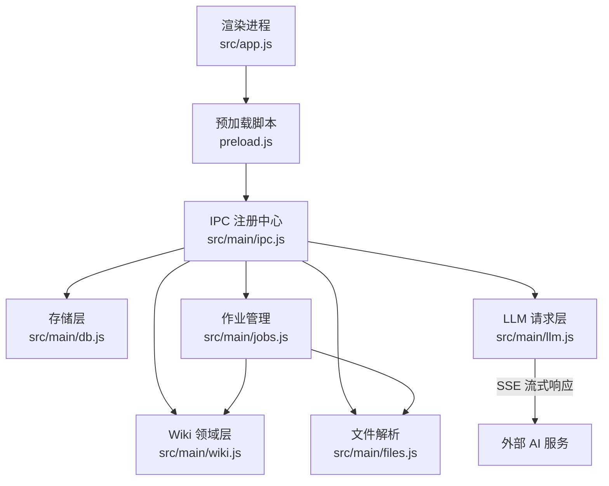
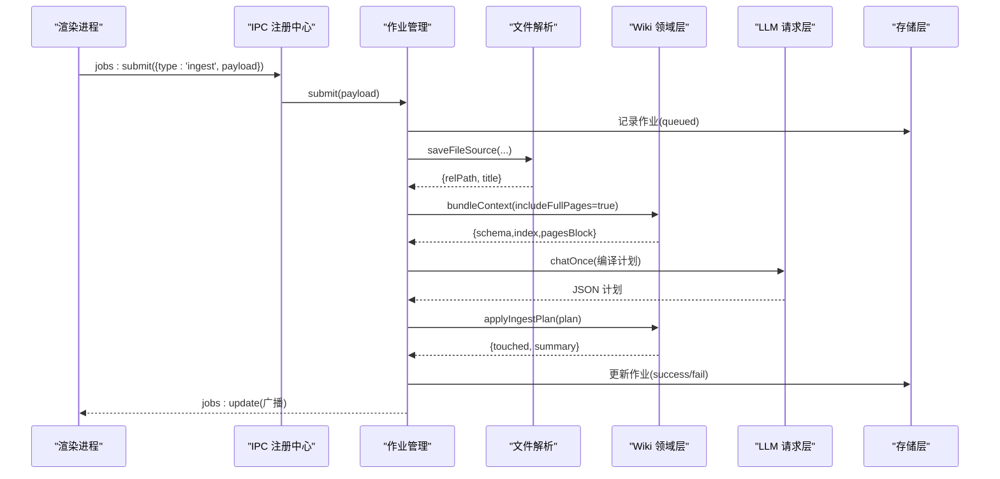
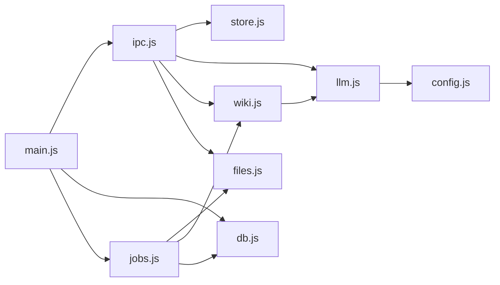
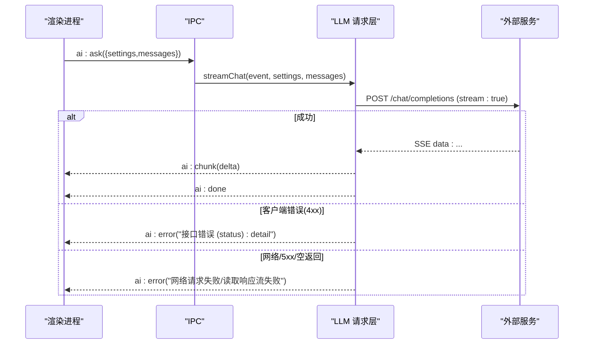
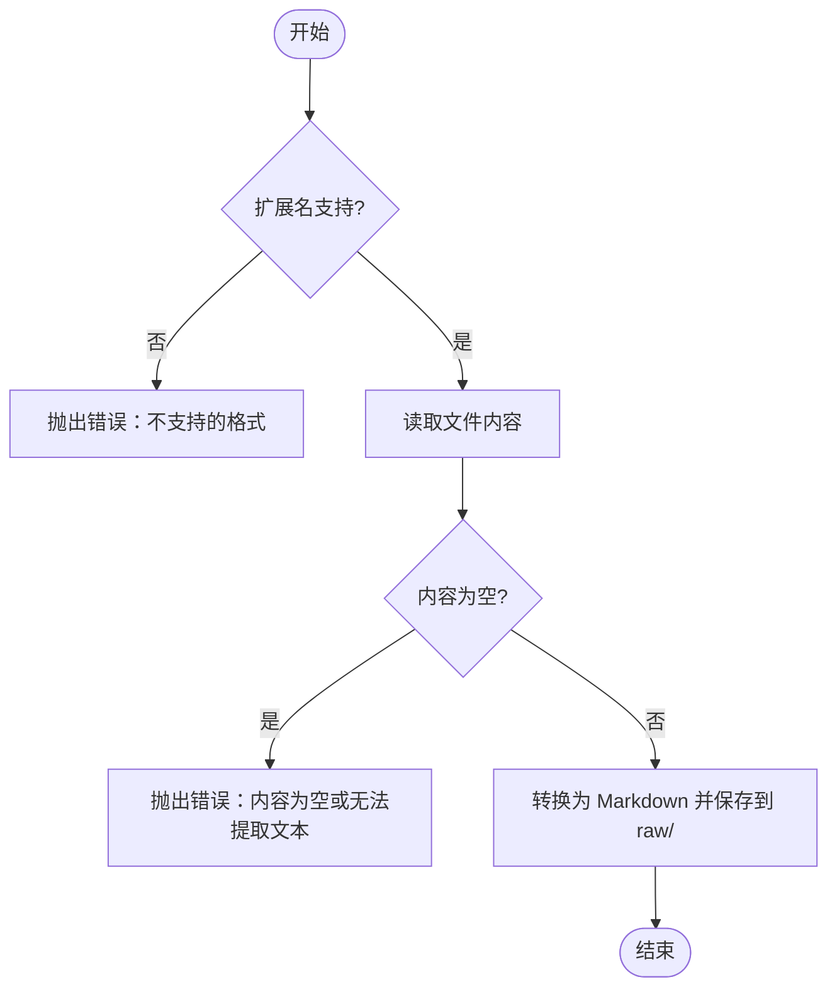
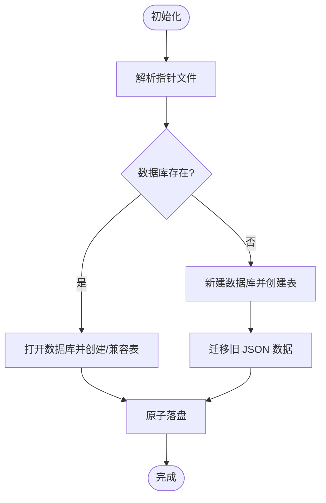
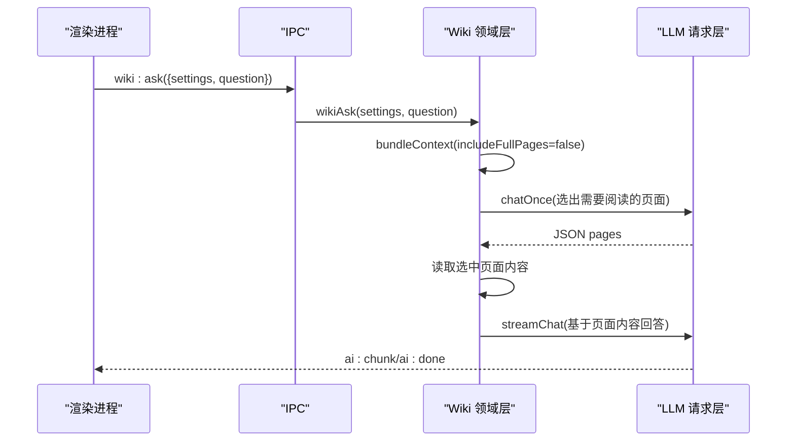
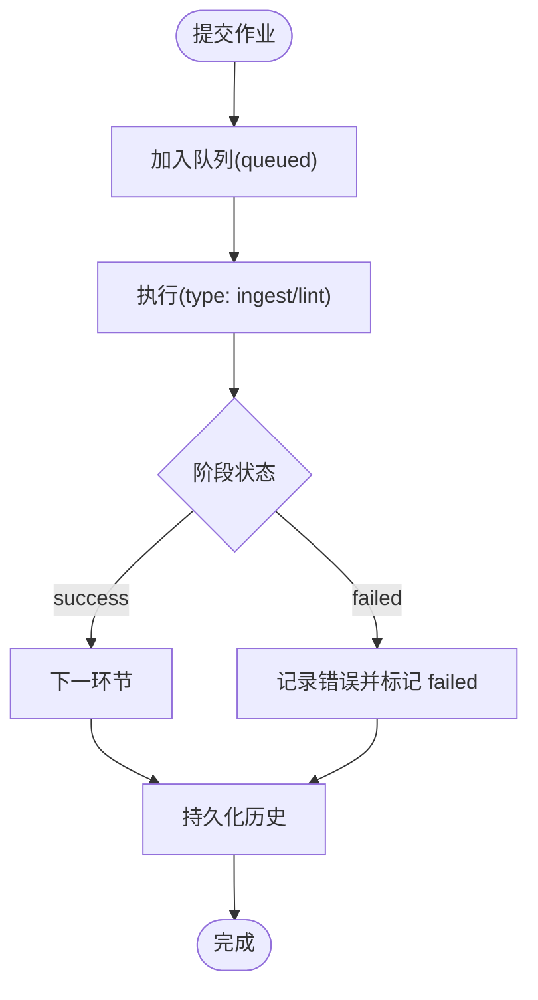

# 故障排除

<cite>
**本文引用的文件**
- [main.js](file://main.js)
- [preload.js](file://preload.js)
- [src/app.js](file://src/app.js)
- [src/main/config.js](file://src/main/config.js)
- [src/main/db.js](file://src/main/db.js)
- [src/main/llm.js](file://src/main/llm.js)
- [src/main/files.js](file://src/main/files.js)
- [src/main/ingest.js](file://src/main/ingest.js)
- [src/main/jobs.js](file://src/main/jobs.js)
- [src/main/ipc.js](file://src/main/ipc.js)
- [src/main/wiki.js](file://src/main/wiki.js)
- [src/main/store.js](file://src/main/store.js)
- [package.json](file://package.json)
</cite>

## 目录
1. [简介](#简介)
2. [项目结构](#项目结构)
3. [核心组件](#核心组件)
4. [架构总览](#架构总览)
5. [详细组件分析](#详细组件分析)
6. [依赖关系分析](#依赖关系分析)
7. [性能注意事项](#性能注意事项)
8. [故障排除指南](#故障排除指南)
9. [结论](#结论)
10. [附录](#附录)

## 简介
本指南面向 Synapse 本地个人知识库助手（Electron + SQLite + LLM）的常见问题与排障方法，覆盖网络连接、文件解析、数据库损坏、AI 服务调用失败等场景；提供调试模式启用、日志收集、错误分析与性能监控建议，并给出问题反馈流程。

## 项目结构
应用采用主进程与渲染进程分离：
- 主进程负责窗口生命周期、SQLite 存储、作业队列、IPC 注册、LLM 请求、Wiki 领域逻辑与文件解析。
- 渲染进程负责 UI、状态管理、用户交互与通过 preload 暴露的 API 与主进程通信。

图表来源
- [main.js:19-47](file://main.js#L19-L47)
- [preload.js:3-55](file://preload.js#L3-L55)
- [src/main/ipc.js:12-106](file://src/main/ipc.js#L12-L106)
- [src/main/db.js:92-149](file://src/main/db.js#L92-L149)
- [src/main/jobs.js:72-121](file://src/main/jobs.js#L72-L121)
- [src/main/llm.js:40-122](file://src/main/llm.js#L40-L122)
- [src/main/wiki.js:93-134](file://src/main/wiki.js#L93-L134)
- [src/main/files.js:22-99](file://src/main/files.js#L22-L99)

章节来源
- [main.js:1-56](file://main.js#L1-L56)
- [package.json:1-45](file://package.json#L1-L45)

## 核心组件
- 存储层（db.js）：基于 sql.js 的 SQLite 持久化，支持笔记/目录/设置/作业历史，原子写入与迁移。
- 作业管理（jobs.js）：串行队列、阶段状态机、历史持久化、中断恢复与重试。
- LLM 请求层（llm.js）：OpenAI 兼容接口，SSE 流式解析，可重试策略。
- Wiki 领域层（wiki.js）：根目录定位、页面读取/描述、上下文打包、问答/体检/回填。
- 文件解析（files.js）：PDF/DOCX/Excel/PPTX/文本转 Markdown，落盘 raw/。
- IPC 注册中心（ipc.js）：统一处理渲染进程请求，委派到各模块。
- 配置工具（config.js）：数值/枚举配置校验与回退。
- 数据存取（store.js）：对 db.js 的薄封装。

章节来源
- [src/main/db.js:1-358](file://src/main/db.js#L1-L358)
- [src/main/jobs.js:1-260](file://src/main/jobs.js#L1-L260)
- [src/main/llm.js:1-123](file://src/main/llm.js#L1-L123)
- [src/main/wiki.js:1-313](file://src/main/wiki.js#L1-L313)
- [src/main/files.js:1-102](file://src/main/files.js#L1-L102)
- [src/main/ipc.js:1-109](file://src/main/ipc.js#L1-L109)
- [src/main/config.js:1-18](file://src/main/config.js#L1-L18)
- [src/main/store.js:1-17](file://src/main/store.js#L1-L17)

## 架构总览
下图展示一次“吸收作业”的典型执行流程，包括保存来源、AI 编译、落盘三个阶段，以及作业状态与持久化。

图表来源
- [src/main/ipc.js:87-93](file://src/main/ipc.js#L87-L93)
- [src/main/jobs.js:100-188](file://src/main/jobs.js#L100-L188)
- [src/main/files.js:77-99](file://src/main/files.js#L77-L99)
- [src/main/wiki.js:117-134](file://src/main/wiki.js#L117-L134)
- [src/main/llm.js:81-110](file://src/main/llm.js#L81-L110)
- [src/main/db.js:343-355](file://src/main/db.js#L343-L355)

## 详细组件分析

### 存储层（db.js）
- 职责：初始化 SQL.js、创建表、迁移旧数据、原子落盘、切换数据库路径。
- 关键点：
  - 指针文件 db-path.json 用于定位数据库位置，不存在时回退默认。
  - 切换路径时整库导出到临时文件再 rename，避免写入中断损坏。
  - 迁移 legacy JSON 失败时保留原文件，便于人工修复。
- 常见故障：
  - 指针指向的数据库不存在：自动回退默认位置并警告。
  - 目标路径已存在：拒绝覆盖，需更换路径或清理旧文件。
  - 迁移失败：检查 JSON 格式与权限，查看控制台错误日志。

章节来源
- [src/main/db.js:12-81](file://src/main/db.js#L12-L81)
- [src/main/db.js:92-177](file://src/main/db.js#L92-L177)
- [src/main/db.js:180-187](file://src/main/db.js#L180-L187)

### 作业管理（jobs.js）
- 职责：串行队列、阶段状态机、历史持久化、中断恢复与重试。
- 关键点：
  - 启动时加载历史，将上次会话未完成的作业标记为 failed。
  - 每个阶段可上报 status/detail，便于定位失败点。
  - ingest 重试会复用 rawPaths，跳过保存阶段。
- 常见故障：
  - 无法删除进行中的作业：需等待完成或重启后重试。
  - 历史丢失：检查持久化异常日志与磁盘空间。

章节来源
- [src/main/jobs.js:25-53](file://src/main/jobs.js#L25-L53)
- [src/main/jobs.js:72-121](file://src/main/jobs.js#L72-L121)
- [src/main/jobs.js:136-188](file://src/main/jobs.js#L136-L188)
- [src/main/jobs.js:215-257](file://src/main/jobs.js#L215-L257)

### LLM 请求层（llm.js）
- 职责：OpenAI 兼容接口，SSE 流式解析与重试策略。
- 关键点：
  - 统一以 stream:true 发起请求，避免网关超时。
  - 仅对网络异常、5xx、空返回等瞬时错误重试；4xx 直接抛出。
  - extractJson 容忍代码块包裹与前后杂质。
- 常见故障：
  - 未配置 API Key：立即提示并在前端显示错误。
  - 接口错误：捕获 HTTP 状态码与响应体前 300 字符。
  - 流读取失败：上报 ai:error 并终止。

章节来源
- [src/main/llm.js:1-123](file://src/main/llm.js#L1-L123)

### Wiki 领域层（wiki.js）
- 职责：Wiki 根目录定位、页面读取/描述、上下文打包、问答/体检/回填。
- 关键点：
  - safeJoin 防止路径逃逸。
  - describeWiki 扫描 wiki 目录并生成页面清单与 log.md 尾部。
  - wikiAsk 两步检索：先选页，再流式回答。
  - fileAnswer 归档问答并更新 index.md。
- 常见故障：
  - 未找到 AGENTS.md 或 wiki 目录：describe 返回 exists:false。
  - 非法路径：抛出错误并阻止访问。

章节来源
- [src/main/wiki.js:9-33](file://src/main/wiki.js#L9-L33)
- [src/main/wiki.js:93-134](file://src/main/wiki.js#L93-L134)
- [src/main/wiki.js:193-233](file://src/main/wiki.js#L193-L233)
- [src/main/wiki.js:235-270](file://src/main/wiki.js#L235-L270)

### 文件解析（files.js）
- 职责：多种格式转 Markdown 并保存到 raw/。
- 关键点：
  - 支持 pdf/docx/xlsx/pptx/md/txt/csv/json/log。
  - PPTX 按幻灯片顺序提取文本。
  - 输出包含来源信息与时间戳。
- 常见故障：
  - 不支持的扩展名：抛出错误并列出支持的格式。
  - 内容为空：提示无法提取文本。

章节来源
- [src/main/files.js:1-102](file://src/main/files.js#L1-L102)

### IPC 注册中心（ipc.js）
- 职责：统一注册所有 ipcMain.handle，委派到具体模块。
- 关键点：
  - 数据读写、AI 问答、Wiki 操作、作业管理、对话框导出。
  - 对错误进行 try/catch 并返回 ok/error。
- 常见故障：
  - 未知作业类型：返回错误信息。
  - 文件选择取消：返回空路径列表。

章节来源
- [src/main/ipc.js:12-106](file://src/main/ipc.js#L12-L106)

### 配置工具（config.js）
- 职责：数值/枚举配置校验与回退。
- 关键点：
  - num：四舍五入并钳制到范围。
  - pick：不在允许列表则回退默认。
- 常见故障：
  - 非法配置值：自动回退，避免崩溃。

章节来源
- [src/main/config.js:1-18](file://src/main/config.js#L1-L18)

### 数据存取（store.js）
- 职责：对 db.js 的薄封装，提供 getDataFile/loadStore/saveStore。
- 常见故障：
  - 底层 db 异常透传，上层统一捕获并返回错误。

章节来源
- [src/main/store.js:1-17](file://src/main/store.js#L1-L17)

## 依赖关系分析
- 主进程入口 main.js 装配 db、jobs、ipc，并创建窗口。
- 渲染进程通过 preload 暴露 kb API，调用 ipc 与主进程交互。
- jobs 依赖 files、wiki、llm、db、config。
- wiki 依赖 llm、config、fs/path。
- llm 依赖 config。
- files 依赖 wiki（slugify/uniquePath）、第三方解析库。

图表来源
- [main.js:9-11](file://main.js#L9-L11)
- [src/main/ipc.js:4-9](file://src/main/ipc.js#L4-L9)
- [src/main/jobs.js:3-7](file://src/main/jobs.js#L3-L7)
- [src/main/wiki.js:6-7](file://src/main/wiki.js#L6-L7)
- [src/main/llm.js:4](file://src/main/llm.js#L4)

章节来源
- [main.js:1-56](file://main.js#L1-L56)
- [src/main/ipc.js:1-109](file://src/main/ipc.js#L1-L109)
- [src/main/jobs.js:1-260](file://src/main/jobs.js#L1-L260)

## 性能注意事项
- 作业串行执行，避免并发写 Wiki 文件冲突。
- 源内容截断阈值（sourceMaxChars）控制提示词长度，防止过大导致超时或失败。
- 网页拉取超时（urlFetchTimeout）避免长时间无响应挂起。
- 使用流式 SSE 减少网关超时风险。
- 数据库整体导出+临时文件 rename 保证原子性，适合小数据量场景。

[本节为通用指导，不直接分析具体文件]

## 故障排除指南

### 一、启用调试模式与收集诊断信息
- 启动参数：
  - 在命令行添加 --kb-debug 可在启动时打开开发者工具，便于前端调试。
- 渲染进程日志：
  - 主进程监听 console-message，将渲染进程日志输出到主进程控制台，便于集中查看。
- 关键日志位置：
  - 主进程控制台：IPC、数据库切换、迁移、作业持久化等日志。
  - 作业历史：通过“作业”页面查看阶段状态与错误详情。
  - Wiki 日志：log.md 尾部展示最近操作摘要。

章节来源
- [main.js:34-38](file://main.js#L34-L38)
- [src/main/db.js:76-79](file://src/main/db.js#L76-L79)
- [src/main/db.js:161-174](file://src/main/db.js#L161-L174)
- [src/main/jobs.js:25-53](file://src/main/jobs.js#L25-L53)
- [src/main/wiki.js:136-151](file://src/main/wiki.js#L136-L151)

### 二、网络连接问题（AI 服务调用失败）
- 症状：
  - 未配置 API Key：前端提示并中止。
  - 接口返回错误：携带 HTTP 状态码与响应体片段。
  - 网络异常或流读取失败：上报 ai:error。
- 排查步骤：
  - 检查设置中的 Base URL、API Key、Model 是否正确。
  - 确认网络可达与代理设置。
  - 观察作业历史中“AI 编译/体检”阶段的 detail。
  - 调整重试次数（chatRetries）与超时（urlFetchTimeout）。
- 相关流程：

图表来源
- [src/main/ipc.js:46-46](file://src/main/ipc.js#L46-L46)
- [src/main/llm.js:40-77](file://src/main/llm.js#L40-L77)
- [src/main/llm.js:81-110](file://src/main/llm.js#L81-L110)

章节来源
- [src/main/llm.js:40-123](file://src/main/llm.js#L40-L123)
- [src/main/ipc.js:45-47](file://src/main/ipc.js#L45-L47)

### 三、文件解析错误
- 症状：
  - 不支持的扩展名：抛出错误并列出支持格式。
  - 内容为空：无法提取文本。
  - PDF/DOCX/Excel/PPTX 解析失败：检查文件格式与完整性。
- 排查步骤：
  - 确认文件扩展名在支持列表中。
  - 检查文件是否损坏或被占用。
  - 查看作业“解析保存来源”阶段的 detail。
- 流程图：

图表来源
- [src/main/files.js:22-99](file://src/main/files.js#L22-L99)

章节来源
- [src/main/files.js:1-102](file://src/main/files.js#L1-L102)

### 四、数据库损坏与迁移问题
- 症状：
  - 指针文件指向的数据库不存在：自动回退默认位置。
  - 切换路径失败：目标文件已存在或权限不足。
  - 迁移失败：保留原 JSON 文件，便于人工修复。
- 排查步骤：
  - 检查 userData 目录下的 knowledge.db 与 db-path.json。
  - 若切换路径失败，更换目标路径或清理旧文件。
  - 查看迁移日志与控制台错误。
- 相关流程：

图表来源
- [src/main/db.js:21-28](file://src/main/db.js#L21-L28)
- [src/main/db.js:92-108](file://src/main/db.js#L92-L108)
- [src/main/db.js:151-177](file://src/main/db.js#L151-L177)
- [src/main/db.js:180-187](file://src/main/db.js#L180-L187)

章节来源
- [src/main/db.js:12-81](file://src/main/db.js#L12-L81)
- [src/main/db.js:92-187](file://src/main/db.js#L92-L187)

### 五、Wiki 相关问题
- 症状：
  - 未找到 AGENTS.md 或 wiki 目录：describe 返回 exists:false。
  - 非法路径访问：抛出错误。
  - 问答未选中页面：回退到 index.md。
- 排查步骤：
  - 确认 Wiki 根目录设置正确，AGENTS.md 存在。
  - 检查页面 frontmatter 是否符合 OKF v0.2。
  - 查看 log.md 尾部了解最近操作。
- 相关流程：

图表来源
- [src/main/ipc.js:74-74](file://src/main/ipc.js#L74-L74)
- [src/main/wiki.js:193-233](file://src/main/wiki.js#L193-L233)
- [src/main/llm.js:81-110](file://src/main/llm.js#L81-L110)

章节来源
- [src/main/wiki.js:9-33](file://src/main/wiki.js#L9-L33)
- [src/main/wiki.js:93-134](file://src/main/wiki.js#L93-L134)
- [src/main/wiki.js:193-233](file://src/main/wiki.js#L193-L233)

### 六、作业管理与重试
- 症状：
  - 进行中的作业无法删除。
  - 吸收作业失败但 raw/ 已保存：可直接重试跳过解析阶段。
  - 体检作业失败：重新提交即可。
- 排查步骤：
  - 在“作业”页面查看阶段状态与错误详情。
  - 对失败的吸收作业点击重试，利用 rawPaths 跳过解析。
  - 清理已完成的历史以减少干扰。
- 相关流程：

图表来源
- [src/main/jobs.js:72-121](file://src/main/jobs.js#L72-L121)
- [src/main/jobs.js:136-188](file://src/main/jobs.js#L136-L188)
- [src/main/jobs.js:215-257](file://src/main/jobs.js#L215-L257)

章节来源
- [src/main/jobs.js:72-121](file://src/main/jobs.js#L72-L121)
- [src/main/jobs.js:136-188](file://src/main/jobs.js#L136-L188)
- [src/main/jobs.js:215-257](file://src/main/jobs.js#L215-L257)

### 七、性能监控与优化建议
- 监控要点：
  - 作业阶段耗时与失败率。
  - LLM 请求成功率与重试次数。
  - 源内容大小与截断阈值。
  - 网页拉取超时与失败率。
- 优化建议：
  - 合理设置 sourceMaxChars 与 urlFetchTimeout。
  - 增加 chatRetries 以应对瞬时错误。
  - 定期清理作业历史，避免 UI 卡顿。
  - 使用流式 SSE 降低超时风险。

[本节为通用指导，不直接分析具体文件]

### 八、社区支持与问题反馈流程
- 反馈渠道：
  - 通过项目仓库 Issues 提交问题，附上：
    - 操作系统与版本。
    - 应用版本（package.json 中的 version）。
    - 复现步骤与预期行为。
    - 相关日志（主进程控制台、作业历史、log.md 尾部）。
- 问题分类：
  - 网络连接：Base URL、API Key、代理、防火墙。
  - 文件解析：格式、损坏、权限。
  - 数据库：指针文件、迁移失败、路径切换。
  - Wiki：AGENTS.md、frontmatter、页面引用。
  - 作业：阶段失败、重试策略。
- 期望信息：
  - 最小复现用例。
  - 截图或录屏（可选）。
  - 相关配置文件（脱敏后）。

[本节为通用指导，不直接分析具体文件]

## 结论
本指南围绕 Synapse 的核心模块提供了系统化的故障排除方法，涵盖网络、文件、数据库、Wiki 与作业管理等常见问题。通过启用调试模式、收集日志、分析错误与优化配置，可快速定位并解决大多数问题。建议在遇到问题时优先检查作业历史与 log.md，并结合本文提供的流程图与排查步骤进行处理。

## 附录
- 常用设置项参考：
  - AI 服务：Base URL、API Key、Model、重试次数。
  - Wiki：根目录、折叠状态、问答最大引用页数、日志行数。
  - 作业：历史条数、失败重试次数、网页拉取超时、来源截断阈值。
  - 编辑器：默认模式。
- 相关文件路径：
  - 数据文件：knowledge.db（默认位于 userData）。
  - 指针文件：db-path.json。
  - Wiki 根目录：用户指定或自动探测。
  - 日志：wiki/log.md 尾部。

章节来源
- [src/main/config.js:1-18](file://src/main/config.js#L1-L18)
- [src/main/db.js:12-28](file://src/main/db.js#L12-L28)
- [src/main/wiki.js:136-151](file://src/main/wiki.js#L136-L151)
- [package.json:1-45](file://package.json#L1-L45)