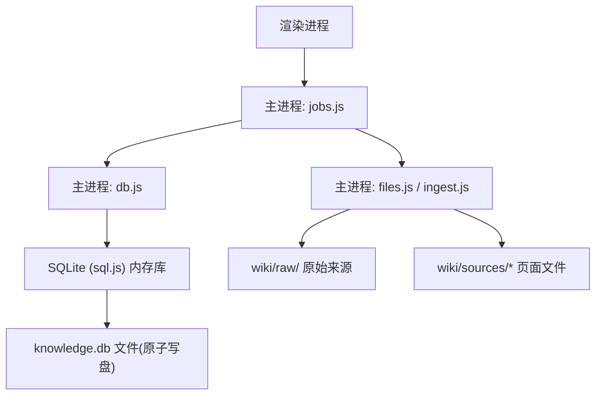
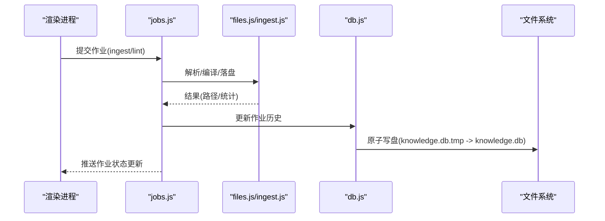
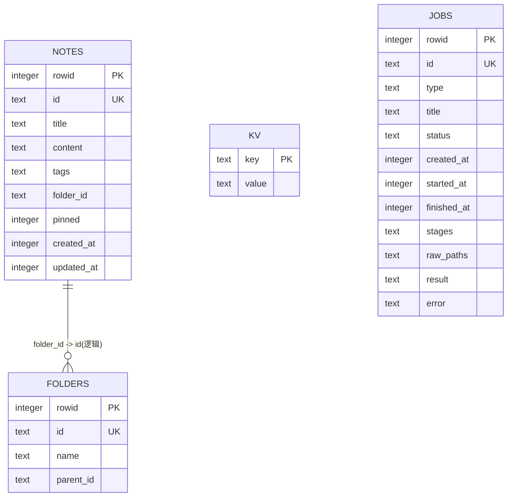
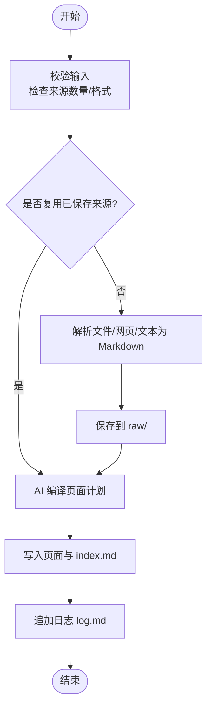
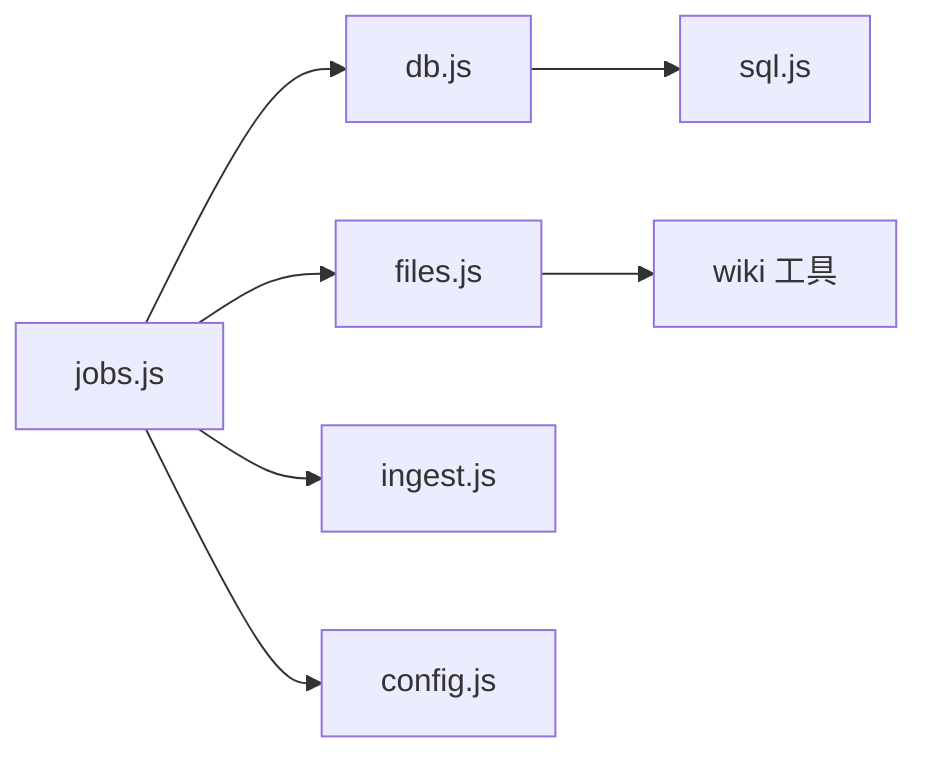

# 数据模型

<cite>
**本文引用的文件**
- [src/main/db.js](file://src/main/db.js)
- [src/main/jobs.js](file://src/main/jobs.js)
- [src/main/store.js](file://src/main/store.js)
- [src/main/config.js](file://src/main/config.js)
- [src/main/files.js](file://src/main/files.js)
- [src/main/ingest.js](file://src/main/ingest.js)
- [package.json](file://package.json)
</cite>

## 目录
1. [简介](#简介)
2. [项目结构](#项目结构)
3. [核心组件](#核心组件)
4. [架构总览](#架构总览)
5. [详细组件分析](#详细组件分析)
6. [依赖关系分析](#依赖关系分析)
7. [性能考虑](#性能考虑)
8. [故障排查指南](#故障排查指南)
9. [结论](#结论)
10. [附录](#附录)

## 简介
本文件为项目的数据模型文档，聚焦 SQLite 数据库的表结构设计、字段定义、数据类型与约束条件；解释实体关系、主外键策略与索引优化；文档化数据验证规则、业务规则与数据处理流程；并提供数据迁移策略、备份恢复机制、数据生命周期管理、SQL 示例与查询优化建议。

## 项目结构
本项目使用 Electron + Node.js，数据存储层基于 sql.js（SQLite 的 WASM 实现），通过内存数据库 + 原子落盘的方式持久化到本地文件。核心数据由以下模块组织：
- 存储层：db.js（建表、CRUD、迁移、落盘）
- 作业历史：jobs.js（作业队列、状态机、持久化）
- 设置与配置：config.js（数值/枚举校验）、db.js 中的 kv 表
- 文件解析与吸收：files.js、ingest.js（将外部文件转为 Markdown 并写入 wiki 目录）
- 应用入口与打包：package.json

图表来源
- [src/main/db.js:92-149](file://src/main/db.js#L92-L149)
- [src/main/jobs.js:72-120](file://src/main/jobs.js#L72-L120)
- [src/main/files.js:77-99](file://src/main/files.js#L77-L99)
- [src/main/ingest.js:22-82](file://src/main/ingest.js#L22-L82)

章节来源
- [src/main/db.js:92-149](file://src/main/db.js#L92-L149)
- [package.json:36-43](file://package.json#L36-L43)

## 核心组件
- 存储层（db.js）
  - 初始化：加载 sql.js、解析指针文件、创建或打开数据库、执行 schema 与迁移、落盘
  - Schema：folders、notes、kv、jobs 四张表
  - CRUD：批量插入、全量覆盖保存、KV 读写、作业历史读写
  - 落盘：整体导出到临时文件后原子替换，避免损坏
- 作业系统（jobs.js）
  - 串行队列、阶段状态机、历史持久化、中断恢复与重试
  - 两种作业类型：ingest（吸收来源）、lint（体检）
- 配置（config.js）
  - 数值钳制与枚举选择，用于 settings 中可配参数（如 maxJobsHistory、sourceMaxChars）
- 文件处理（files.js、ingest.js）
  - 多格式解析为 Markdown，保存到 raw/，并通过 AI 编译生成页面计划，最终写入 wiki 目录

章节来源
- [src/main/db.js:92-149](file://src/main/db.js#L92-L149)
- [src/main/jobs.js:72-120](file://src/main/jobs.js#L72-L120)
- [src/main/config.js:4-15](file://src/main/config.js#L4-L15)
- [src/main/files.js:22-99](file://src/main/files.js#L22-L99)
- [src/main/ingest.js:8-82](file://src/main/ingest.js#L8-L82)

## 架构总览
数据流从“用户操作/IPC”进入主进程，经 jobs.js 编排任务，调用 files.js/ingest.js 处理文件与内容，再通过 db.js 将结构化数据写入 SQLite，并以原子方式落盘。

图表来源
- [src/main/jobs.js:72-120](file://src/main/jobs.js#L72-L120)
- [src/main/db.js:181-187](file://src/main/db.js#L181-L187)
- [src/main/files.js:77-99](file://src/main/files.js#L77-L99)
- [src/main/ingest.js:22-82](file://src/main/ingest.js#L22-L82)

## 详细组件分析

### 数据库 Schema 与实体关系
- 表：folders（目录树）
  - rowid: INTEGER, 自增主键
  - id: TEXT, UNIQUE, NOT NULL（业务主键）
  - name: TEXT, NOT NULL
  - parent_id: TEXT（父目录，逻辑层级）
- 表：notes（笔记）
  - rowid: INTEGER, 自增主键
  - id: TEXT, UNIQUE, NOT NULL（业务主键）
  - title: TEXT, DEFAULT ''
  - content: TEXT, DEFAULT ''
  - tags: TEXT, DEFAULT '[]'（JSON 数组）
  - folder_id: TEXT（关联 folders.id，逻辑外键）
  - pinned: INTEGER, DEFAULT 0
  - created_at: INTEGER, DEFAULT 0
  - updated_at: INTEGER, DEFAULT 0
- 表：kv（键值对，用于 settings）
  - key: TEXT, PRIMARY KEY
  - value: TEXT, NOT NULL
- 表：jobs（作业历史）
  - rowid: INTEGER, 自增主键
  - id: TEXT, UNIQUE, NOT NULL（业务主键）
  - type: TEXT, NOT NULL
  - title: TEXT, NOT NULL
  - status: TEXT, NOT NULL
  - created_at: INTEGER, DEFAULT 0
  - started_at: INTEGER, DEFAULT 0
  - finished_at: INTEGER, DEFAULT 0
  - stages: TEXT, DEFAULT '[]'（JSON 数组）
  - raw_paths: TEXT（JSON 数组，来源相对路径）
  - result: TEXT（JSON，可选）
  - error: TEXT, DEFAULT ''

图表来源
- [src/main/db.js:111-149](file://src/main/db.js#L111-L149)

章节来源
- [src/main/db.js:111-149](file://src/main/db.js#L111-L149)

### 数据验证规则与业务规则
- 配置校验（config.js）
  - num(settings, key, def, min, max)：非有限数回退默认，否则四舍五入并钳制到[min,max]
  - pick(settings, key, def, allowed)：不在允许列表则回退默认
- 作业历史上限（settings.maxJobsHistory）
  - 读取时实时获取，限制 jobs 数组长度，防止无限增长
- 来源大小限制（settings.sourceMaxChars）
  - 在 ingest 阶段截断超长来源，避免提示词爆炸
- 文件格式白名单（files.js）
  - 仅支持 pdf/docx/xlsx/xls/pptx/md/markdown/txt/csv，其他格式抛出错误
- 内容非空校验
  - 解析后若内容为空，抛出错误，阻止无效数据入库
- 作业状态机
  - queued → running → success/failed；重启时将运行中/排队中作业标记为 failed 并记录原因

章节来源
- [src/main/config.js:4-15](file://src/main/config.js#L4-L15)
- [src/main/jobs.js:21-43](file://src/main/jobs.js#L21-L43)
- [src/main/ingest.js:8-19](file://src/main/ingest.js#L8-L19)
- [src/main/files.js:77-90](file://src/main/files.js#L77-L90)
- [src/main/jobs.js:32-43](file://src/main/jobs.js#L32-L43)

### 数据处理流程（Ingest 作业）

图表来源
- [src/main/jobs.js:125-188](file://src/main/jobs.js#L125-L188)
- [src/main/files.js:77-99](file://src/main/files.js#L77-L99)
- [src/main/ingest.js:22-82](file://src/main/ingest.js#L22-L82)

章节来源
- [src/main/jobs.js:125-188](file://src/main/jobs.js#L125-L188)
- [src/main/files.js:77-99](file://src/main/files.js#L77-L99)
- [src/main/ingest.js:22-82](file://src/main/ingest.js#L22-L82)

### 数据迁移策略
- 旧 JSON 数据迁移
  - 启动时检测 legacy data file（knowledge-data.json）与 jobs file（wiki-jobs.json）
  - 将 folders、notes、settings 迁移至 SQLite；将 jobs 列表迁移至 jobs 表
  - 成功后原文件重命名为 .bak 留底
- 数据库文件切换
  - 支持将当前内存库导出到新路径，成功后更新指针文件（db-path.json）
  - 恢复默认位置时，若默认文件存在则改名留底，避免新旧混淆
  - 切换失败返回错误信息

章节来源
- [src/main/db.js:151-177](file://src/main/db.js#L151-L177)
- [src/main/db.js:21-81](file://src/main/db.js#L21-L81)

### 备份与恢复机制
- 原子落盘
  - flush() 将内存库整体导出到 .tmp 文件，再 rename 覆盖目标文件，确保一致性
- 指针文件与备份
  - 指针文件 db-path.json 指向当前数据库文件
  - 切换/恢复默认位置时自动创建 .bak 备份，防止误覆盖
- 作业历史保留
  - 持久化时剥离 payload（含 API 配置与全文），仅保留必要字段，降低风险

章节来源
- [src/main/db.js:181-187](file://src/main/db.js#L181-L187)
- [src/main/db.js:21-81](file://src/main/db.js#L21-L81)
- [src/main/jobs.js:45-53](file://src/main/jobs.js#L45-L53)

### 数据生命周期管理
- 作业历史上限
  - 通过 settings.maxJobsHistory 控制历史条目数，超出时截断最早条目
- 来源大小限制
  - 通过 settings.sourceMaxChars 截断超长来源，避免内存与提示词膨胀
- 清理策略
  - 提供 clear() 清空终态作业历史；remove(id) 删除单条终态作业
  - 运行中/排队中作业不可删除

章节来源
- [src/main/jobs.js:21-23](file://src/main/jobs.js#L21-L23)
- [src/main/jobs.js:228-234](file://src/main/jobs.js#L228-L234)
- [src/main/ingest.js:8-19](file://src/main/ingest.js#L8-L19)

## 依赖关系分析
- 模块耦合
  - jobs.js 依赖 db.js（作业历史）、files.js/ingest.js（吸收流程）、config.js（配置）
  - db.js 依赖 fs、path、electron app 路径、sql.js
  - files.js 依赖 wiki 工具（slugify、uniquePath）、多种解析库
- 外部依赖
  - sql.js：SQLite 内存数据库与导出能力
  - 解析库：pdf-parse、mammoth、xlsx、jszip、turndown

图表来源
- [src/main/jobs.js:1-10](file://src/main/jobs.js#L1-L10)
- [src/main/db.js:1-10](file://src/main/db.js#L1-L10)
- [src/main/files.js:1-10](file://src/main/files.js#L1-L10)
- [package.json:36-43](file://package.json#L36-L43)

章节来源
- [package.json:36-43](file://package.json#L36-L43)

## 性能考虑
- 原子落盘减少损坏风险
  - 使用 .tmp + rename 保证写入一致性
- 批处理与事务
  - saveStore/saveJobs 使用 BEGIN/COMMIT 包裹批量写入，减少磁盘 IO 次数
- 内存数据库
  - sql.js 以内存库运行，适合小数据量场景；大数据量需评估导出频率
- 截断与限长
  - sourceMaxChars 限制来源大小，避免提示词与内存压力
  - maxJobsHistory 限制作业历史长度，控制存储与展示开销

[本节为通用性能讨论，不直接分析具体文件]

## 故障排查指南
- 常见错误与处理
  - 不支持的文件格式：files.js 抛出错误，需检查扩展名是否在白名单
  - 内容为空：解析后为空则拒绝入库，检查源文件或解析器
  - 模型返回无法解析：ingest 阶段 JSON 解析失败，检查 LLM 输出格式
  - 作业中断：应用重启后将运行中/排队中作业标记为 failed，并记录原因
- 定位方法
  - 查看 jobs 历史中的 stages 与 error 字段，定位失败阶段
  - 检查 pointer 文件与数据库文件是否存在、权限是否正确
  - 确认 settings 中相关阈值（maxJobsHistory、sourceMaxChars）是否合理

章节来源
- [src/main/files.js:77-90](file://src/main/files.js#L77-L90)
- [src/main/ingest.js:53-61](file://src/main/ingest.js#L53-L61)
- [src/main/jobs.js:32-43](file://src/main/jobs.js#L32-L43)

## 结论
本项目采用轻量级 SQLite（sql.js）作为本地知识库的结构化存储，结合原子落盘与事务保障数据一致性；通过作业系统与状态机管理复杂的数据处理流程；利用配置校验与业务规则确保数据质量；提供完善的迁移、备份与生命周期管理机制。建议在数据规模增长时评估导出频率与查询模式，必要时引入索引与分页优化。

[本节为总结性内容，不直接分析具体文件]

## 附录

### 表结构与字段说明
- folders
  - rowid: 自增主键
  - id: 业务唯一标识
  - name: 目录名称
  - parent_id: 父目录 ID（逻辑层级）
- notes
  - rowid: 自增主键
  - id: 业务唯一标识
  - title/content/tags: 标题、正文、标签（JSON 数组）
  - folder_id: 所属目录（逻辑外键）
  - pinned: 是否置顶
  - created_at/updated_at: 时间戳
- kv
  - key/value: 键值对，用于 settings
- jobs
  - rowid: 自增主键
  - id/type/title/status: 作业基本信息
  - created_at/started_at/finished_at: 时间戳
  - stages: 阶段状态（JSON 数组）
  - raw_paths/result/error: 来源、结果、错误信息

章节来源
- [src/main/db.js:111-149](file://src/main/db.js#L111-L149)

### SQL 示例（参考）
- 创建表（已在 createSchema 中定义）
  - 参考：[src/main/db.js:111-149](file://src/main/db.js#L111-L149)
- 插入文件夹与笔记（批量）
  - 参考：[src/main/db.js:190-221](file://src/main/db.js#L190-L221)
- 读取设置与完整 Store
  - 参考：[src/main/db.js:223-249](file://src/main/db.js#L223-L249)
- 作业历史读取与保存
  - 参考：[src/main/db.js:289-355](file://src/main/db.js#L289-L355)

### 查询优化建议
- 当前未显式创建索引，主要依赖 rowid 与 id 的唯一性
- 如需按 folder_id 快速检索笔记，可考虑添加索引：
  - CREATE INDEX idx_notes_folder_id ON notes(folder_id);
- 如需按 status 过滤作业，可考虑添加索引：
  - CREATE INDEX idx_jobs_status ON jobs(status);
- 注意：sql.js 为内存库，频繁 DDL 可能带来开销，建议在初始化或迁移脚本中统一执行

[本节为通用优化建议，不直接分析具体文件]