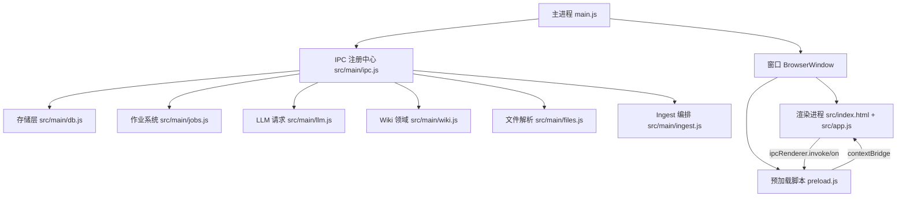
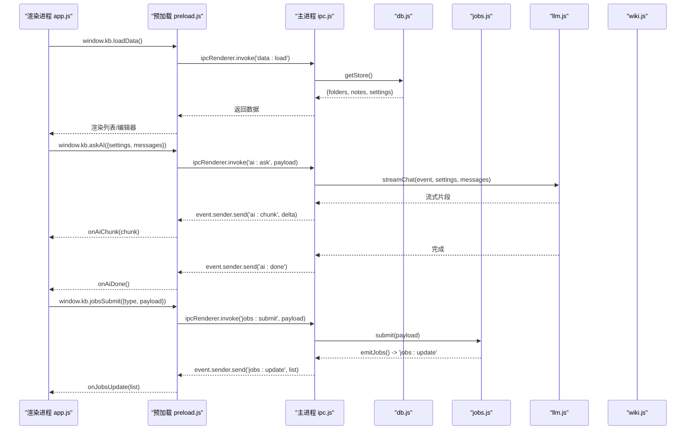
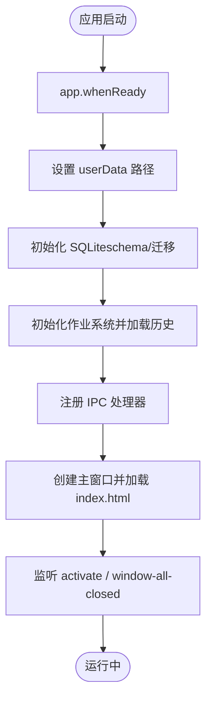
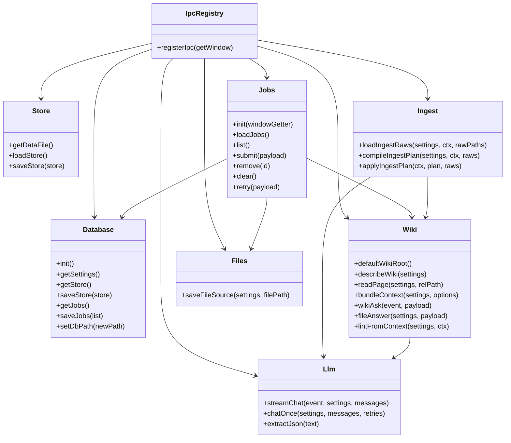
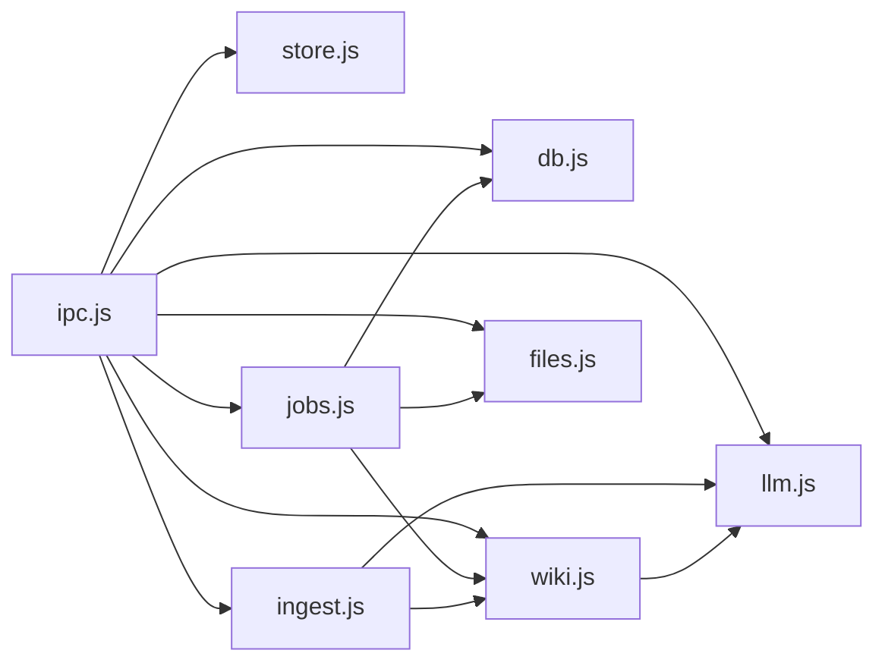

# Electron 架构

<cite>
**本文引用的文件**
- [main.js](file://main.js)
- [preload.js](file://preload.js)
- [package.json](file://package.json)
- [src/index.html](file://src/index.html)
- [src/app.js](file://src/app.js)
- [src/main/ipc.js](file://src/main/ipc.js)
- [src/main/db.js](file://src/main/db.js)
- [src/main/store.js](file://src/main/store.js)
- [src/main/jobs.js](file://src/main/jobs.js)
- [src/main/llm.js](file://src/main/llm.js)
- [src/main/wiki.js](file://src/main/wiki.js)
- [src/main/files.js](file://src/main/files.js)
- [src/main/ingest.js](file://src/main/ingest.js)
</cite>

## 目录
1. [简介](#简介)
2. [项目结构](#项目结构)
3. [核心组件](#核心组件)
4. [架构总览](#架构总览)
5. [详细组件分析](#详细组件分析)
6. [依赖关系分析](#依赖关系分析)
7. [性能考量](#性能考量)
8. [故障排查指南](#故障排查指南)
9. [结论](#结论)
10. [附录](#附录)

## 简介
本仓库是一个基于 Electron 的本地个人知识库助手应用，采用主进程与渲染进程职责分离的架构。主进程负责应用生命周期、窗口创建、安全配置、IPC 注册与系统能力调用；渲染进程负责 UI 状态管理、用户交互与通过预加载脚本暴露的安全桥接访问主进程能力。项目内置 SQLite（sql.js）持久化、LLM 流式问答、Wiki 知识组织、作业队列与文件吸收等能力，并提供跨平台兼容处理。

## 项目结构
- 入口与窗口：main.js 定义应用启动、窗口创建与安全策略，并装配各模块。
- 预加载桥接：preload.js 使用 contextBridge 暴露最小 API 给渲染进程。
- 渲染层：src/index.html 提供界面结构，src/app.js 维护 UI 状态与业务交互。
- 主进程模块：
  - IPC 注册中心：src/main/ipc.js 统一注册所有 ipcMain.handle，转发到领域模块。
  - 存储层：src/main/db.js 基于 sql.js 实现笔记、设置、作业历史持久化与迁移。
  - 存储封装：src/main/store.js 简化数据读写。
  - 作业系统：src/main/jobs.js 串行队列、阶段状态机、历史持久化与重试。
  - LLM 请求：src/main/llm.js 流式 SSE 解析、重试策略与 JSON 提取。
  - Wiki 领域：src/main/wiki.js 根目录定位、页面读取/描述、上下文打包、问答与体检。
  - 文件解析：src/main/files.js 多格式转 Markdown 并保存到 raw/。
  - Ingest 编排：src/main/ingest.js 读来源 → AI 编译计划 → 落盘三步流程。
- 构建与依赖：package.json 定义入口、脚本、打包配置与依赖。

图表来源
- [main.js:19-39](file://main.js#L19-L39)
- [src/main/ipc.js:12-106](file://src/main/ipc.js#L12-L106)
- [preload.js:1-56](file://preload.js#L1-L56)
- [src/index.html:1-291](file://src/index.html#L1-L291)
- [src/app.js:1-800](file://src/app.js#L1-L800)

章节来源
- [main.js:1-56](file://main.js#L1-L56)
- [package.json:1-45](file://package.json#L1-L45)

## 核心组件
- 主进程入口与窗口管理：负责 userData 路径设置、数据库初始化、作业加载、IPC 注册、窗口创建与生命周期事件。
- 预加载脚本与安全桥接：通过 contextBridge.exposeInMainWorld 暴露最小 API，限制渲染进程直接访问 Node/Electron 能力。
- IPC 注册中心：集中注册所有 ipcMain.handle，按功能域分发到 store/db、jobs、llm、wiki、files 等模块。
- 存储层：基于 sql.js 的内存数据库，支持原子写入、指针文件切换、旧数据迁移与作业历史持久化。
- 作业系统：串行队列执行 ingest/lint 作业，阶段状态机上报进度，失败可重试，历史可清理。
- LLM 请求层：OpenAI 兼容接口，SSE 流式响应，错误分类与重试，JSON 提取。
- Wiki 领域：根目录探测、页面遍历、上下文打包、问答检索、体检报告生成、日志追加。
- 文件解析：PDF/DOCX/XLSX/PPTX/文本等多格式转 Markdown，保存至 raw/ 目录。
- Ingest 编排：将原始来源交给模型生成页面计划，再写回 wiki 目录并更新索引与日志。

章节来源
- [src/main/ipc.js:12-106](file://src/main/ipc.js#L12-L106)
- [src/main/db.js:92-187](file://src/main/db.js#L92-L187)
- [src/main/jobs.js:72-121](file://src/main/jobs.js#L72-L121)
- [src/main/llm.js:40-123](file://src/main/llm.js#L40-L123)
- [src/main/wiki.js:10-134](file://src/main/wiki.js#L10-L134)
- [src/main/files.js:22-99](file://src/main/files.js#L22-L99)
- [src/main/ingest.js:8-82](file://src/main/ingest.js#L8-L82)

## 架构总览
下图展示主进程与渲染进程的通信边界与数据流向。渲染进程通过预加载脚本暴露的 window.kb 调用 IPC，主进程在 ipc.js 中路由到对应模块，必要时向渲染进程推送事件（如流式片段、作业更新）。

图表来源
- [preload.js:3-55](file://preload.js#L3-L55)
- [src/main/ipc.js:14-106](file://src/main/ipc.js#L14-L106)
- [src/main/llm.js:40-77](file://src/main/llm.js#L40-L77)
- [src/main/jobs.js:55-98](file://src/main/jobs.js#L55-L98)

## 详细组件分析

### 主进程与渲染进程的职责分离
- 主进程
  - 应用生命周期：app.whenReady、activate、window-all-closed。
  - 窗口创建：BrowserWindow 配置 webPreferences，启用 contextIsolation、禁用 nodeIntegration，指定 preload。
  - IPC 注册：集中注册所有 handle，转发到领域模块。
  - 资源与系统能力：对话框、文件系统、SQLite、网络请求、作业调度。
- 渲染进程
  - UI 状态与交互：侧边栏、笔记列表、编辑器、AI 面板、Wiki 阅读器、作业页、设置页。
  - 通过 window.kb 调用 IPC，订阅事件回调，进行 DOM 更新与状态同步。
  - 不直接访问 Node/Electron 能力，遵循最小权限原则。

章节来源
- [main.js:19-55](file://main.js#L19-L55)
- [src/app.js:1-800](file://src/app.js#L1-L800)

### 应用生命周期管理
- 启动顺序：
  - app.whenReady 后设置 userData 路径。
  - 初始化数据库（含 schema 与迁移）。
  - 初始化作业系统并加载历史。
  - 注册 IPC。
  - 创建主窗口并加载 index.html。
  - 监听 activate 与 window-all-closed 以管理窗口与退出。
- 跨平台兼容：
  - macOS 下保持应用存活直到关闭窗口。
  - 其他平台关闭所有窗口时退出应用。

章节来源
- [main.js:41-55](file://main.js#L41-L55)

### 窗口创建与管理机制
- 窗口配置：
  - 尺寸与最小尺寸、标题、背景色。
  - webPreferences：preload、contextIsolation=true、nodeIntegration=false。
  - 隐藏菜单栏，可选打开 DevTools（调试参数）。
- 窗口复用：
  - 通过全局 mainWindow 引用获取当前窗口。
  - 在 macOS 上无窗口时重新创建。

章节来源
- [main.js:16-39](file://main.js#L16-L39)

### 安全配置选项：contextIsolation 与 nodeIntegration
- contextIsolation=true：隔离渲染进程与主进程上下文，防止直接访问 Node 模块。
- nodeIntegration=false：禁止渲染进程直接使用 require、process 等 Node API。
- 安全桥接：通过 preload 的 contextBridge.exposeInMainWorld 暴露最小 API（window.kb），仅允许受控的 IPC 调用。
- 效果：降低 XSS 与任意代码执行风险，确保渲染进程只能经过白名单通道与主进程通信。

章节来源
- [main.js:27-31](file://main.js#L27-L31)
- [preload.js:1-56](file://preload.js#L1-L56)

### 预加载脚本与安全桥接层
- 作用：作为主进程与渲染进程之间的可信中介，仅暴露必要方法。
- 暴露能力：
  - 数据：loadData、saveData、setDbPath、getDataPath。
  - AI 问答：askAI、onAiChunk、onAiDone、onAiError。
  - Wiki：wikiDefaultRoot、wikiDescribe、wikiRead、wikiPickFiles、wikiAsk、wikiFileAnswer、onWikiRefs。
  - 作业：jobsList、jobsSubmit、jobsRemove、jobsClear、jobsRetry、onJobsUpdate。
  - 导出：exportNote。
- 事件订阅：提供 onXxx 方法返回取消监听函数，避免内存泄漏。

章节来源
- [preload.js:3-55](file://preload.js#L3-L55)

### 应用启动流程

图表来源
- [main.js:41-55](file://main.js#L41-L55)

### 资源管理与跨平台兼容性
- 资源路径：
  - 使用 app.getPath('userData') 存放 knowledge.db 与 db-path.json 指针。
  - Wiki 根目录默认从应用目录或文档目录探测 AGENTS.md。
- 文件操作：
  - 通过 dialog.showSaveDialog/showOpenDialog 选择文件。
  - 多格式文件解析并保存为 Markdown 到 raw/ 目录。
- 跨平台：
  - 路径分隔符由 path 模块处理。
  - 不同平台窗口行为差异（macOS 保持活跃）。

章节来源
- [src/main/db.js:12-28](file://src/main/db.js#L12-L28)
- [src/main/wiki.js:10-24](file://src/main/wiki.js#L10-L24)
- [src/main/ipc.js:30-72](file://src/main/ipc.js#L30-L72)

### 数据流与处理逻辑
- 数据持久化：
  - 渲染进程提交全量 store，主进程事务内清空重插，原子写入 .tmp 后 rename。
  - 支持切换数据库文件位置，指针文件记录当前路径，恢复默认时备份旧文件。
- 作业执行：
  - 提交作业进入队列，串行执行，阶段状态机更新进度与结果。
  - 失败作业可重试，ingest 模式复用已保存 raw/ 来源跳过解析阶段。
- LLM 流式：
  - 主进程发起 fetch 请求，SSE 流逐行解析 data: 增量，推送到渲染进程。
  - 错误分类：客户端错误不重试，网络/5xx/空返回可重试。

章节来源
- [src/main/db.js:252-266](file://src/main/db.js#L252-L266)
- [src/main/db.js:343-355](file://src/main/db.js#L343-L355)
- [src/main/jobs.js:72-121](file://src/main/jobs.js#L72-L121)
- [src/main/jobs.js:136-188](file://src/main/jobs.js#L136-L188)
- [src/main/llm.js:10-77](file://src/main/llm.js#L10-L77)
- [src/main/llm.js:81-123](file://src/main/llm.js#L81-L123)

### 类图（主进程模块关系）

图表来源
- [src/main/ipc.js:12-106](file://src/main/ipc.js#L12-L106)
- [src/main/store.js:1-17](file://src/main/store.js#L1-L17)
- [src/main/db.js:92-358](file://src/main/db.js#L92-L358)
- [src/main/jobs.js:1-260](file://src/main/jobs.js#L1-L260)
- [src/main/llm.js:1-123](file://src/main/llm.js#L1-L123)
- [src/main/wiki.js:1-313](file://src/main/wiki.js#L1-L313)
- [src/main/files.js:1-102](file://src/main/files.js#L1-L102)
- [src/main/ingest.js:1-85](file://src/main/ingest.js#L1-L85)

## 依赖关系分析
- 模块耦合：
  - ipc.js 作为中枢，低耦合地调用各领域模块。
  - jobs.js 依赖 files.js、wiki.js、db.js、config.js。
  - wiki.js 依赖 llm.js、config.js、fs/path。
  - ingest.js 依赖 llm.js、wiki.js、config.js。
- 外部依赖：
  - electron：主进程 API。
  - sql.js：SQLite WASM 实现。
  - mammoth、pdf-parse、xlsx、jszip、turndown：多格式解析与转换。
- 潜在循环依赖：未发现明显循环依赖，模块间通过明确接口协作。

图表来源
- [src/main/ipc.js:12-106](file://src/main/ipc.js#L12-L106)
- [src/main/jobs.js:1-260](file://src/main/jobs.js#L1-L260)
- [src/main/wiki.js:1-313](file://src/main/wiki.js#L1-L313)
- [src/main/ingest.js:1-85](file://src/main/ingest.js#L1-L85)

章节来源
- [src/main/ipc.js:12-106](file://src/main/ipc.js#L12-L106)
- [src/main/jobs.js:1-260](file://src/main/jobs.js#L1-L260)
- [src/main/wiki.js:1-313](file://src/main/wiki.js#L1-L313)
- [src/main/ingest.js:1-85](file://src/main/ingest.js#L1-L85)

## 性能考量
- 数据库写入：整体导出 + 临时文件 rename，保证原子性，适合小数据量场景。
- 作业串行：避免并发写 wiki 文件冲突，提高一致性。
- LLM 流式：SSE 增量推送，减少首屏延迟，提升用户体验。
- 内容截断：sourceMaxChars 控制来源长度，防止提示词爆炸。
- 重试策略：对瞬时错误自动重试，提高鲁棒性。

[本节为通用性能讨论，不直接分析具体文件]

## 故障排查指南
- 常见问题定位：
  - 未配置 API Key：AI 问答会返回错误消息，需在设置中填写。
  - 网络请求失败：检查 baseUrl、apiKey 与网络连通性。
  - 数据库切换失败：确认目标路径存在且非覆盖，指针文件是否正确。
  - 作业失败：查看作业阶段详情与错误信息，必要时重试。
- 日志与调试：
  - 渲染进程控制台消息在主进程捕获输出。
  - 可通过 --kb-debug 参数打开开发者工具。
  - Wiki log.md 记录 Ingest 与问答回填等操作。

章节来源
- [src/main/llm.js:40-77](file://src/main/llm.js#L40-L77)
- [src/main/db.js:36-81](file://src/main/db.js#L36-L81)
- [src/main/jobs.js:62-98](file://src/main/jobs.js#L62-L98)
- [main.js:34-38](file://main.js#L34-L38)

## 结论
该 Electron 应用通过清晰的主/渲染进程职责分离、严格的安全配置与最小权限桥接，实现了稳定的本地知识库管理。IPC 注册中心将复杂业务解耦为领域模块，作业系统与 LLM 流式能力提升了用户体验与可靠性。SQLite 持久化与多格式文件解析满足日常知识收集与整理需求。整体架构易于扩展与维护，适合持续迭代。

[本节为总结，不直接分析具体文件]

## 附录
- 关键 API 映射（渲染进程 → 主进程 IPC）：
  - 数据：data:load、data:save、data:setDbPath、app:getDataPath
  - AI：ai:ask、事件 ai:chunk、ai:done、ai:error
  - Wiki：wiki:defaultRoot、wiki:describe、wiki:read、wiki:pickFiles、wiki:ask、wiki:fileAnswer、事件 wiki:refs
  - 作业：jobs:list、jobs:submit、jobs:remove、jobs:clear、jobs:retry、事件 jobs:update
  - 导出：dialog:export

章节来源
- [preload.js:3-55](file://preload.js#L3-L55)
- [src/main/ipc.js:14-106](file://src/main/ipc.js#L14-L106)