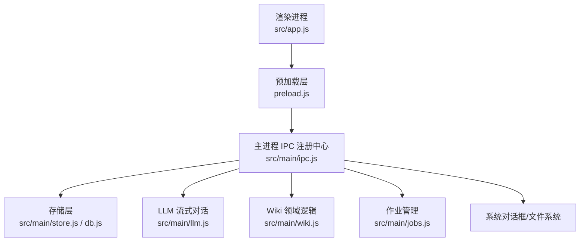
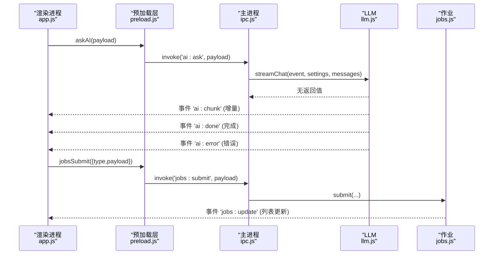
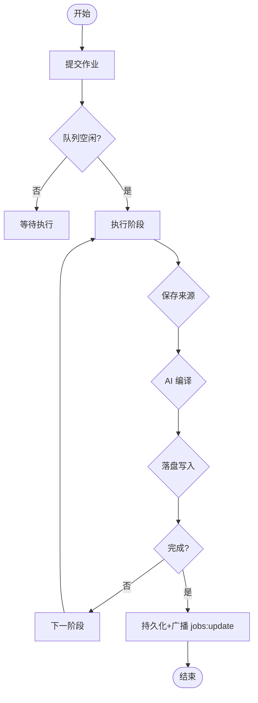
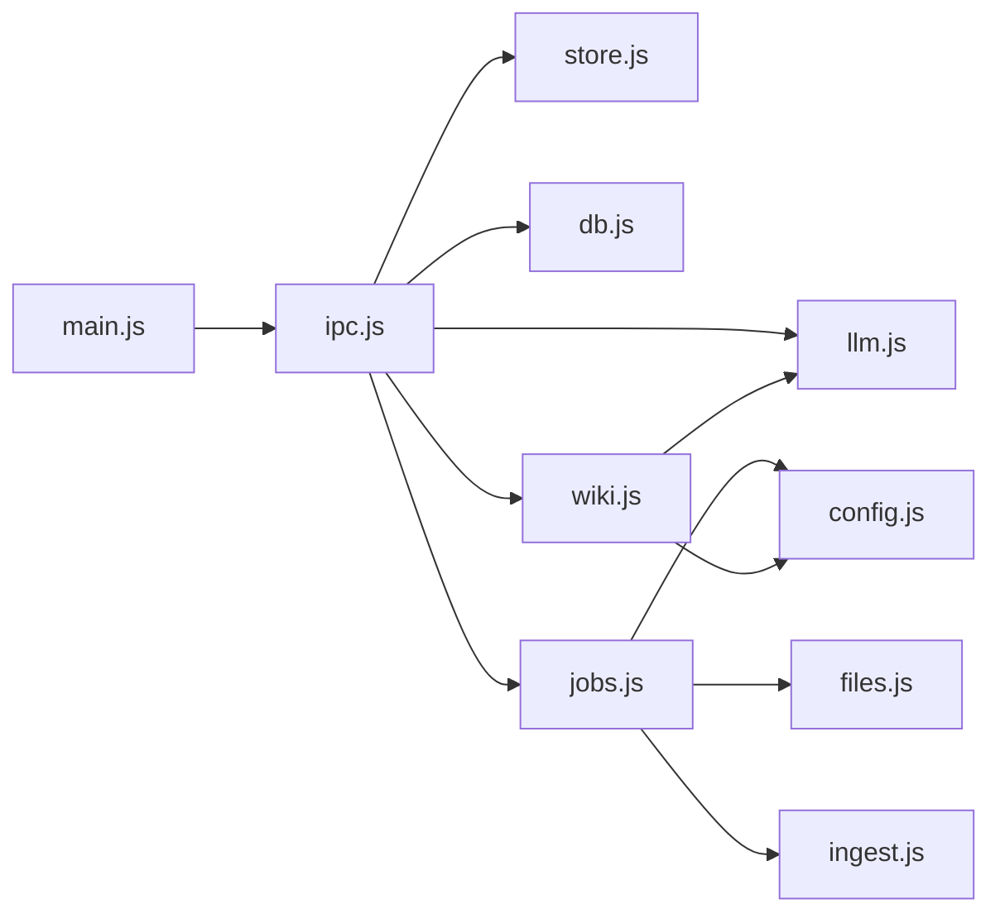
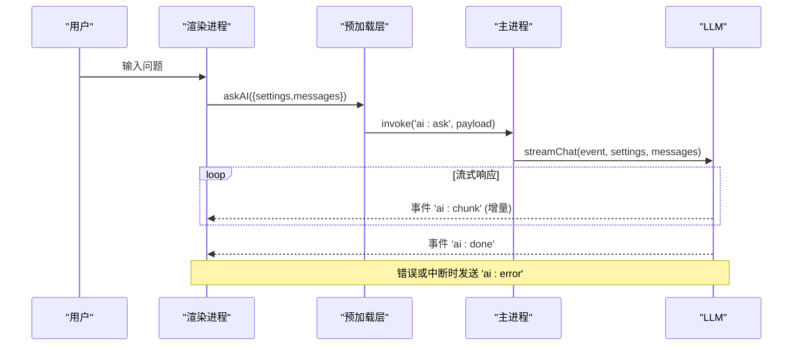

# IPC 通信机制

<cite>
**本文引用的文件**
- [main.js](file://main.js)
- [preload.js](file://preload.js)
- [src/main/ipc.js](file://src/main/ipc.js)
- [src/app.js](file://src/app.js)
- [src/main/jobs.js](file://src/main/jobs.js)
- [src/main/llm.js](file://src/main/llm.js)
- [src/main/wiki.js](file://src/main/wiki.js)
- [src/main/store.js](file://src/main/store.js)
- [src/index.html](file://src/index.html)
- [package.json](file://package.json)
</cite>

## 目录
1. [简介](#简介)
2. [项目结构](#项目结构)
3. [核心组件](#核心组件)
4. [架构总览](#架构总览)
5. [详细组件分析](#详细组件分析)
6. [依赖关系分析](#依赖关系分析)
7. [性能与并发特性](#性能与并发特性)
8. [故障排查指南](#故障排查指南)
9. [结论](#结论)
10. [附录：IPC 通道清单与调用示例](#附录ipc-通道清单与调用示例)

## 简介
本文件系统化梳理该 Electron 应用的进程间通信（IPC）机制，覆盖主进程与渲染进程之间的消息传递模式、事件注册与处理、通道建立、消息格式、错误与超时处理策略、安全验证（权限控制与数据校验）、以及事件驱动架构在 IPC 中的应用。文档同时提供同步与异步调用的具体示例路径，并解释并发请求与状态同步的处理方式。

## 项目结构
应用采用典型的 Electron 三层结构：
- 主进程入口 main.js：负责应用生命周期、窗口创建与安全上下文配置，并在就绪后初始化数据库、作业系统与 IPC 注册中心。
- 预加载脚本 preload.js：通过 contextBridge 暴露安全的 API 到渲染进程，屏蔽底层 ipcRenderer 细节。
- 业务模块 src/main/*：按职责拆分，包括 IPC 注册中心、存储、LLM 流式对话、Wiki 领域逻辑、作业队列等。
- 渲染进程 src/app.js + src/index.html：构建 UI 并通过 window.kb 调用 IPC 能力。

**图表来源**
- [main.js:19-47](file://main.js#L19-L47)
- [preload.js:3-55](file://preload.js#L3-L55)
- [src/main/ipc.js:12-106](file://src/main/ipc.js#L12-L106)

**章节来源**
- [main.js:1-56](file://main.js#L1-L56)
- [preload.js:1-56](file://preload.js#L1-L56)
- [src/main/ipc.js:1-109](file://src/main/ipc.js#L1-L109)

## 核心组件
- 预加载桥接层（preload.js）：将 ipcRenderer.invoke/on/off 封装为 window.kb.*，向渲染进程暴露最小必要接口，避免直接暴露 Node/Electron API。
- IPC 注册中心（src/main/ipc.js）：集中注册所有 ipcMain.handle 通道，统一转发到各业务模块，并对部分操作进行基础校验与异常包装。
- 作业系统（src/main/jobs.js）：串行队列 + 阶段状态机，持久化历史，支持重试与中断恢复；通过主窗口广播 jobs:update 事件实现状态同步。
- LLM 流式对话（src/main/llm.js）：基于 SSE 的流式响应解析，增量推送 ai:chunk，完成后发送 ai:done，错误时发送 ai:error。
- Wiki 领域（src/main/wiki.js）：页面读取、描述、问答、回填、体检等；包含路径安全校验 safeJoin，防止目录穿越。
- 存储层（src/main/store.js）：对 SQLite 的存取封装，供 IPC 层调用。

**章节来源**
- [preload.js:3-55](file://preload.js#L3-L55)
- [src/main/ipc.js:12-106](file://src/main/ipc.js#L12-L106)
- [src/main/jobs.js:1-260](file://src/main/jobs.js#L1-L260)
- [src/main/llm.js:1-123](file://src/main/llm.js#L1-L123)
- [src/main/wiki.js:1-313](file://src/main/wiki.js#L1-L313)
- [src/main/store.js:1-17](file://src/main/store.js#L1-L17)

## 架构总览
IPC 通信采用“请求-响应”与“事件推送”两种模式并存：
- 请求-响应：渲染进程通过 window.kb.* 调用 ipcRenderer.invoke，主进程通过 ipcMain.handle 处理并返回 Promise 结果。
- 事件推送：主进程通过 event.sender.send 或 BrowserWindow.webContents.send 主动推送事件（如 ai:chunk、ai:done、ai:error、jobs:update、wiki:refs），渲染进程通过 onXxx 回调订阅并清理。

**图表来源**
- [preload.js:9-15](file://preload.js#L9-L15)
- [src/main/ipc.js:45-47](file://src/main/ipc.js#L45-L47)
- [src/main/llm.js:40-77](file://src/main/llm.js#L40-L77)
- [src/main/jobs.js:55-60](file://src/main/jobs.js#L55-L60)

## 详细组件分析

### 通道建立与消息格式
- 通道命名规范：以功能域前缀区分，如 data:*、ai:*、wiki:*、jobs:*、dialog:*、app:*。
- 请求-响应消息体：
  - data:load / data:save：保存时返回 { ok, error? }，加载时返回存储对象。
  - wiki:read：返回 { ok, content } 或 { ok, error }。
  - jobs:submit / jobs:remove / jobs:clear / jobs:retry：返回 { ok, id? | error? }。
- 事件推送消息体：
  - ai:chunk：字符串增量片段。
  - ai:done：无参完成信号。
  - ai:error：错误消息字符串。
  - jobs:update：作业列表数组。
  - wiki:refs：引用页面路径数组。

**章节来源**
- [preload.js:3-55](file://preload.js#L3-L55)
- [src/main/ipc.js:14-106](file://src/main/ipc.js#L14-L106)
- [src/main/llm.js:40-77](file://src/main/llm.js#L40-L77)
- [src/main/jobs.js:55-60](file://src/main/jobs.js#L55-L60)

### 错误处理与超时策略
- 请求失败包装：IPC 层对可能抛错的调用使用 try/catch，返回 { ok:false, error }，便于渲染端统一提示。
- LLM 网络错误：
  - 未配置 API Key：直接发送 ai:error。
  - HTTP 非 2xx：解析错误详情并发送 ai:error。
  - 流读取异常：捕获后发送 ai:error。
- 作业错误：运行期捕获异常，标记 job.status=failed，记录 error，并广播 jobs:update。
- 网页拉取超时：使用 AbortController 与可配置的 urlFetchTimeout（默认秒级），避免长时间阻塞。
- 重试策略：LLM 内部 chatOnce 支持可配置的重试次数，仅对瞬时错误（网络/5xx/空返回）重试，客户端错误不重试。

**章节来源**
- [src/main/ipc.js:16-23](file://src/main/ipc.js#L16-L23)
- [src/main/ipc.js:76-82](file://src/main/ipc.js#L76-L82)
- [src/main/llm.js:40-77](file://src/main/llm.js#L40-L77)
- [src/main/llm.js:81-110](file://src/main/llm.js#L81-L110)
- [src/main/jobs.js:83-98](file://src/main/jobs.js#L83-L98)
- [src/main/wiki.js:154-191](file://src/main/wiki.js#L154-L191)

### 安全验证机制
- 上下文隔离：主进程启用 contextIsolation 与 nodeIntegration=false，限制渲染进程直接访问 Node API。
- 最小暴露面：仅通过 preload 暴露 window.kb 方法，屏蔽底层 ipcRenderer。
- 路径安全：Wiki 层使用 safeJoin 校验相对路径，禁止逃逸出指定根目录。
- 输入校验：
  - jobs:submit 对 ingest 类型校验是否存在有效来源，否则拒绝提交。
  - 导出文件时限定扩展名过滤器。
- CSP：HTML 中设置内容安全策略，限制资源加载范围。

**章节来源**
- [main.js:27-31](file://main.js#L27-L31)
- [preload.js:3-55](file://preload.js#L3-L55)
- [src/main/wiki.js:27-33](file://src/main/wiki.js#L27-L33)
- [src/main/ipc.js:30-43](file://src/main/ipc.js#L30-L43)
- [src/main/jobs.js:196-213](file://src/main/jobs.js#L196-L213)
- [src/index.html:5](file://src/index.html#L5)

### 事件驱动架构与状态同步
- 流式输出：LLM 通过 ai:chunk 增量推送，渲染端累积并实时渲染；完成后触发 ai:done，错误时触发 ai:error。
- 作业状态：jobs.js 维护串行队列与阶段状态，任何阶段变更都会持久化并广播 jobs:update，渲染端据此刷新 UI。
- Wiki 引用：wikiAsk 先选择相关页面，通过 wiki:refs 推送引用列表，再进行流式回答。

**图表来源**
- [src/main/jobs.js:72-98](file://src/main/jobs.js#L72-L98)
- [src/main/jobs.js:136-188](file://src/main/jobs.js#L136-L188)

**章节来源**
- [src/main/llm.js:40-77](file://src/main/llm.js#L40-L77)
- [src/main/jobs.js:55-60](file://src/main/jobs.js#L55-L60)
- [src/main/wiki.js:194-233](file://src/main/wiki.js#L194-L233)

### 并发请求与状态同步
- 作业串行执行：jobs.js 使用单队列 pumpJobQueue，确保同一时间只有一个作业运行，避免并发写冲突。
- 流式并发：AI 问答期间，渲染进程可同时监听多个事件（chunk/done/error），但主进程侧流式处理是顺序的。
- 状态一致性：作业阶段状态变更后立即持久化并广播，保证多窗口或多标签页的状态一致。

**章节来源**
- [src/main/jobs.js:72-98](file://src/main/jobs.js#L72-L98)
- [src/main/jobs.js:55-60](file://src/main/jobs.js#L55-L60)

## 依赖关系分析
- 主进程入口 main.js 依赖 db、jobs、ipc，并在 app.whenReady 后依次初始化。
- IPC 注册中心依赖 store、db、llm、wiki、files、jobs，作为统一入口分发请求。
- 作业系统依赖 files、wiki、ingest、db、config，负责编排与持久化。
- LLM 模块依赖 config，提供流式与重试能力。
- Wiki 模块依赖 llm、config、fs、path，提供页面读写、问答、体检等。

**图表来源**
- [main.js:9-11](file://main.js#L9-L11)
- [src/main/ipc.js:4-9](file://src/main/ipc.js#L4-L9)
- [src/main/jobs.js:3-7](file://src/main/jobs.js#L3-L7)
- [src/main/wiki.js:5-7](file://src/main/wiki.js#L5-L7)

**章节来源**
- [main.js:9-11](file://main.js#L9-L11)
- [src/main/ipc.js:4-9](file://src/main/ipc.js#L4-L9)
- [src/main/jobs.js:3-7](file://src/main/jobs.js#L3-L7)
- [src/main/wiki.js:5-7](file://src/main/wiki.js#L5-L7)

## 性能与并发特性
- 流式传输：LLM 使用 SSE 流式响应，减少首字节延迟，提升交互体验。
- 批量处理：作业系统批量收集页面与日志，减少频繁 IO。
- 超时控制：网页拉取具备可配置超时，避免长时间挂起。
- 重试机制：对瞬时错误自动重试，提高鲁棒性。
- 内存优化：作业持久化时剥离 payload，降低历史占用。

[本节为通用性能讨论，不直接分析具体代码行]

## 故障排查指南
- AI 无法回答：检查是否已配置 API Key；若未配置，会收到 ai:error 提示。
- 网络错误：查看 ai:error 中的错误详情；必要时调整重试次数或 Base URL。
- 作业失败：在作业页查看失败原因；对于 ingest 失败且 rawPaths 为空的情况，需重新发起吸收。
- 路径非法：Wiki 读取报错“非法路径”，说明相对路径尝试逃逸根目录，请修正路径。
- 保存失败：data:save 返回 { ok:false, error }，根据错误信息定位问题。

**章节来源**
- [src/main/llm.js:45-68](file://src/main/llm.js#L45-L68)
- [src/main/jobs.js:83-98](file://src/main/jobs.js#L83-L98)
- [src/main/wiki.js:27-33](file://src/main/wiki.js#L27-L33)
- [src/main/ipc.js:16-23](file://src/main/ipc.js#L16-L23)

## 结论
该应用通过清晰的 IPC 分层设计，实现了稳定、安全、可扩展的主渲染进程通信。预加载层最小化暴露面，IPC 注册中心统一路由与校验，业务模块专注领域逻辑。事件驱动与流式传输提升了用户体验，作业系统保障复杂任务的可观测性与可靠性。整体架构具备良好的可维护性与扩展性。

[本节为总结性内容，不直接分析具体代码行]

## 附录：IPC 通道清单与调用示例

### 通道清单
- 数据
  - data:load：加载存储数据
  - data:save：保存存储数据
  - data:setDbPath：切换 SQLite 数据文件位置
  - app:getDataPath：获取数据文件路径
- AI 问答
  - ai:ask：发起流式问答
  - ai:chunk：增量片段事件
  - ai:done：完成事件
  - ai:error：错误事件
- Wiki
  - wiki:defaultRoot：默认 Wiki 根目录
  - wiki:describe：描述 Wiki（页面列表、索引、日志尾部）
  - wiki:read：读取页面内容
  - wiki:pickFiles：选择本地文件
  - wiki:ask：Wiki 问答（先选引用，再流式回答）
  - wiki:fileAnswer：归档问答为 Answer 页面
  - wiki:refs：引用页面路径事件
- 作业
  - jobs:list：获取作业列表
  - jobs:submit：提交作业（ingest/lint）
  - jobs:remove：删除终态作业
  - jobs:clear：清空历史
  - jobs:retry：重试失败作业
  - jobs:update：作业列表更新事件
- 其他
  - dialog:export：导出笔记为文件

**章节来源**
- [preload.js:3-55](file://preload.js#L3-L55)
- [src/main/ipc.js:14-106](file://src/main/ipc.js#L14-L106)

### 调用示例（路径参考）
- 同步调用（Promise 响应）
  - 加载数据：window.kb.loadData() → ipcMain.handle('data:load')
    - 参考：[preload.js:5](file://preload.js#L5)、[src/main/ipc.js:14](file://src/main/ipc.js#L14)
  - 保存数据：window.kb.saveData(store) → ipcMain.handle('data:save')
    - 参考：[preload.js:6](file://preload.js#L6)、[src/main/ipc.js:16-23](file://src/main/ipc.js#L16-L23)
  - 切换数据库路径：window.kb.setDbPath(p) → ipcMain.handle('data:setDbPath')
    - 参考：[preload.js:7](file://preload.js#L7)、[src/main/ipc.js:28](file://src/main/ipc.js#L28)
  - 获取数据路径：window.kb.getDataPath() → ipcMain.handle('app:getDataPath')
    - 参考：[preload.js:54](file://preload.js#L54)、[src/main/ipc.js:25](file://src/main/ipc.js#L25)
  - 导出文件：window.kb.exportNote(options) → ipcMain.handle('dialog:export')
    - 参考：[preload.js:53](file://preload.js#L53)、[src/main/ipc.js:30-43](file://src/main/ipc.js#L30-L43)
  - 作业提交：window.kb.jobsSubmit({type,payload}) → ipcMain.handle('jobs:submit')
    - 参考：[preload.js:42](file://preload.js#L42)、[src/main/ipc.js:87-93](file://src/main/ipc.js#L87-L93)
- 异步事件（事件推送）
  - AI 流式：onAiChunk/onAiDone/onAiError → ai:chunk/ai:done/ai:error
    - 参考：[preload.js:11-25](file://preload.js#L11-L25)、[src/main/llm.js:40-77](file://src/main/llm.js#L40-L77)
  - 作业更新：onJobsUpdate → jobs:update
    - 参考：[preload.js:46-50](file://preload.js#L46-L50)、[src/main/jobs.js:55-60](file://src/main/jobs.js#L55-L60)
  - Wiki 引用：onWikiRefs → wiki:refs
    - 参考：[preload.js:34-38](file://preload.js#L34-L38)、[src/main/wiki.js:219](file://src/main/wiki.js#L219)

### 典型调用序列图（AI 问答）

**图表来源**
- [preload.js:9-15](file://preload.js#L9-L15)
- [src/main/ipc.js:45-47](file://src/main/ipc.js#L45-L47)
- [src/main/llm.js:40-77](file://src/main/llm.js#L40-L77)