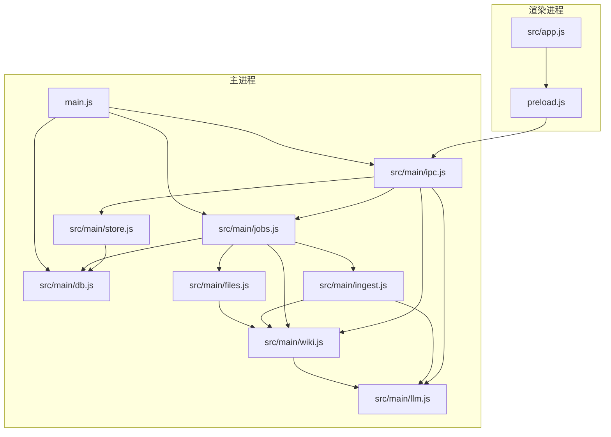
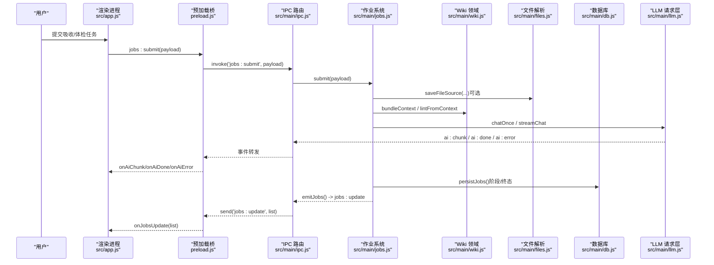
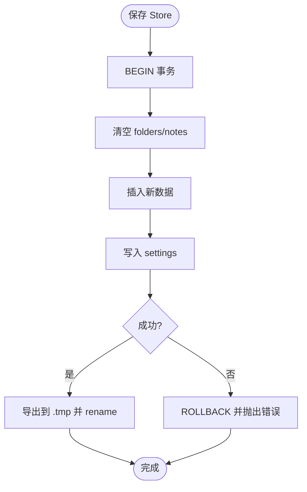
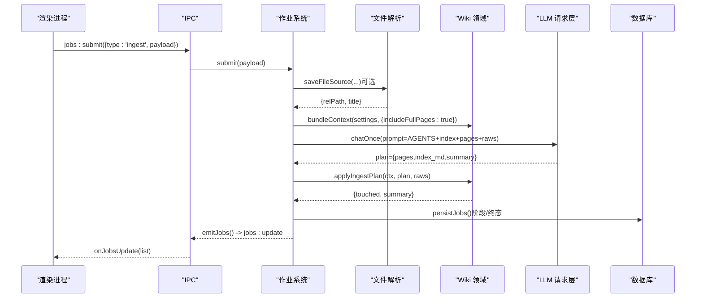
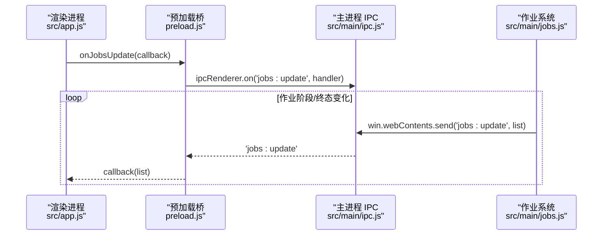
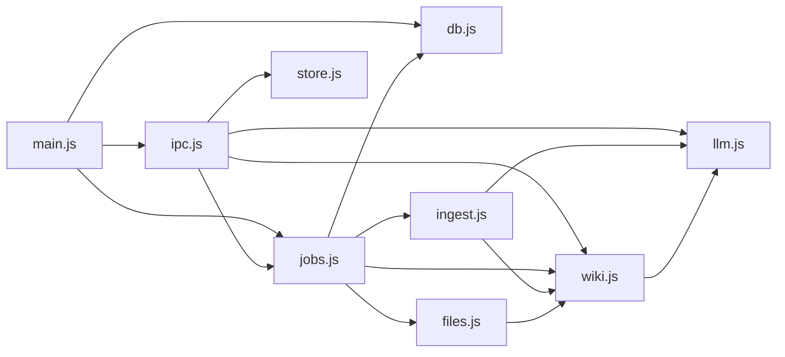
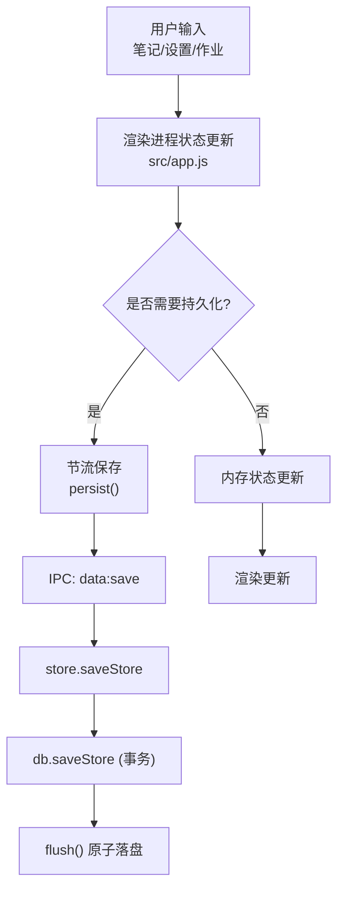
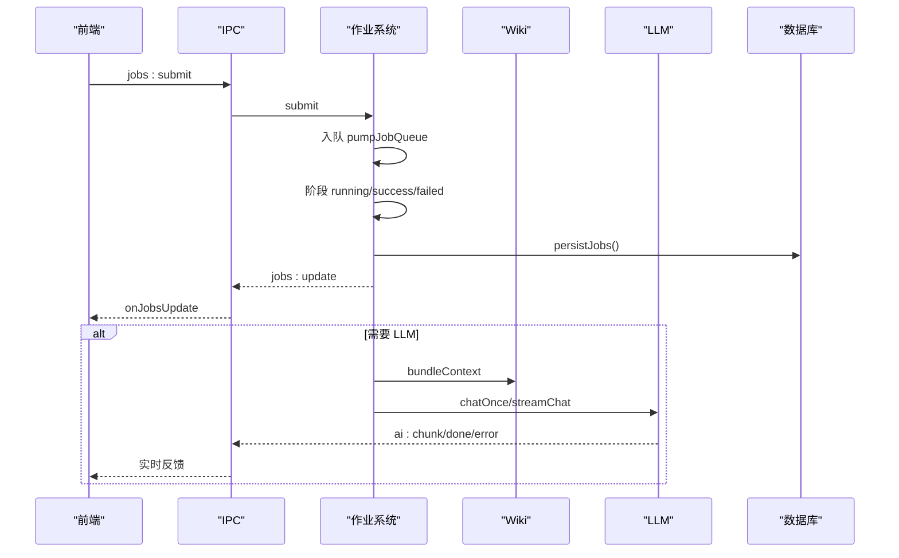

# 数据流设计

<cite>
**本文引用的文件**
- [main.js](file://main.js)
- [preload.js](file://preload.js)
- [src/app.js](file://src/app.js)
- [package.json](file://package.json)
- [src/main/config.js](file://src/main/config.js)
- [src/main/db.js](file://src/main/db.js)
- [src/main/store.js](file://src/main/store.js)
- [src/main/ipc.js](file://src/main/ipc.js)
- [src/main/jobs.js](file://src/main/jobs.js)
- [src/main/ingest.js](file://src/main/ingest.js)
- [src/main/wiki.js](file://src/main/wiki.js)
- [src/main/files.js](file://src/main/files.js)
- [src/main/llm.js](file://src/main/llm.js)
</cite>

## 目录
1. [简介](#简介)
2. [项目结构](#项目结构)
3. [核心组件](#核心组件)
4. [架构总览](#架构总览)
5. [详细组件分析](#详细组件分析)
6. [依赖关系分析](#依赖关系分析)
7. [性能考虑](#性能考虑)
8. [故障排查指南](#故障排查指南)
9. [结论](#结论)
10. [附录：关键数据流图](#附录关键数据流图)

## 简介
本设计文档聚焦于应用的数据流向、转换与存储过程，覆盖从用户输入到数据存储的完整数据管道，包括数据验证、转换、持久化与缓存策略；同时详细说明作业系统（Ingest/Lint）的任务提交、执行、状态更新与结果返回流程；并解释实时数据同步机制、状态管理策略、数据一致性保证与错误恢复机制。

## 项目结构
应用基于 Electron 构建，主进程负责生命周期、IPC 注册、数据库初始化与作业调度；渲染进程负责 UI 与交互；领域模块按职责拆分：db（SQLite 持久化）、store（设置与笔记存取）、ipc（IPC 路由）、jobs（作业队列与状态机）、ingest（吸收编排）、wiki（Wiki 领域逻辑）、files（多格式解析）、llm（LLM 请求层）。

**图表来源**
- [main.js:1-56](file://main.js#L1-L56)
- [preload.js:1-56](file://preload.js#L1-L56)
- [src/main/ipc.js:1-109](file://src/main/ipc.js#L1-L109)
- [src/main/db.js:1-358](file://src/main/db.js#L1-L358)
- [src/main/jobs.js:1-260](file://src/main/jobs.js#L1-L260)
- [src/main/ingest.js:1-85](file://src/main/ingest.js#L1-L85)
- [src/main/wiki.js:1-313](file://src/main/wiki.js#L1-L313)
- [src/main/files.js:1-102](file://src/main/files.js#L1-L102)
- [src/main/llm.js:1-123](file://src/main/llm.js#L1-L123)

**章节来源**
- [main.js:1-56](file://main.js#L1-L56)
- [package.json:1-45](file://package.json#L1-L45)

## 核心组件
- 数据持久化层（db.js）：基于 sql.js 的 SQLite 内存库，提供原子落盘（导出到临时文件后 rename），支持迁移旧 JSON 数据、切换数据库文件位置、事务写入与作业历史持久化。
- 存储适配层（store.js）：对 db 的封装，暴露加载/保存 store（folders/notes/settings）。
- IPC 路由（ipc.js）：统一注册所有 IPC 通道，将渲染进程请求分发至对应业务模块。
- 作业系统（jobs.js）：串行队列 + 阶段状态机 + 历史持久化 + 中断恢复/重试，支撑 Ingest/Lint 两类作业。
- 吸收编排（ingest.js）：读取 raw/ 来源 → AI 编译页面计划 → 落盘 wiki 页面与 index.md，并追加日志。
- Wiki 领域（wiki.js）：根目录定位、页面读取/描述、上下文打包、问答检索与流式回答、体检报告生成、来源保存与回填归档。
- 文件解析（files.js）：PDF/DOCX/XLSX/PPTX/文本等转 Markdown 并保存到 raw/。
- LLM 请求层（llm.js）：OpenAI 兼容接口，SSE 流式消费、重试策略、JSON 提取。
- 配置校验（config.js）：数值钳制与枚举选择，避免非法配置进入下游。

**章节来源**
- [src/main/db.js:1-358](file://src/main/db.js#L1-L358)
- [src/main/store.js:1-17](file://src/main/store.js#L1-L17)
- [src/main/ipc.js:1-109](file://src/main/ipc.js#L1-L109)
- [src/main/jobs.js:1-260](file://src/main/jobs.js#L1-L260)
- [src/main/ingest.js:1-85](file://src/main/ingest.js#L1-L85)
- [src/main/wiki.js:1-313](file://src/main/wiki.js#L1-L313)
- [src/main/files.js:1-102](file://src/main/files.js#L1-L102)
- [src/main/llm.js:1-123](file://src/main/llm.js#L1-L123)
- [src/main/config.js:1-18](file://src/main/config.js#L1-L18)

## 架构总览
应用采用“渲染进程—IPC—主进程领域模块—文件系统/外部服务”的分层架构。渲染进程通过 preload 暴露的 API 调用 IPC；IPC 路由到具体模块；模块间通过函数调用协作；最终数据落盘到 SQLite 或 Wiki 文件系统，并通过 SSE 流式回传前端。

**图表来源**
- [preload.js:1-56](file://preload.js#L1-L56)
- [src/main/ipc.js:1-109](file://src/main/ipc.js#L1-L109)
- [src/main/jobs.js:1-260](file://src/main/jobs.js#L1-L260)
- [src/main/files.js:1-102](file://src/main/files.js#L1-L102)
- [src/main/wiki.js:1-313](file://src/main/wiki.js#L1-L313)
- [src/main/db.js:1-358](file://src/main/db.js#L1-L358)
- [src/main/llm.js:1-123](file://src/main/llm.js#L1-L123)

## 详细组件分析

### 数据持久化与存储策略（db.js / store.js）
- 使用 sql.js 在内存中维护 SQLite 数据库，变更时整体导出到临时文件再原子替换，确保一致性。
- 提供迁移逻辑，将旧 knowledge-data.json 与 wiki-jobs.json 一次性迁入 SQLite，失败保留原文件备份。
- 支持切换数据库文件路径：整库导出到新目标，成功后更新指针文件；恢复默认时自动备份旧文件避免混淆。
- 存储结构包含 folders、notes、kv（settings）、jobs 四张表；作业历史持久化剥离 payload 以减小体积。
- 全量保存采用事务（BEGIN/COMMIT/ROLLBACK），异常回滚，保障数据完整性。

**图表来源**
- [src/main/db.js:251-266](file://src/main/db.js#L251-L266)
- [src/main/db.js:181-187](file://src/main/db.js#L181-L187)

**章节来源**
- [src/main/db.js:1-358](file://src/main/db.js#L1-L358)
- [src/main/store.js:1-17](file://src/main/store.js#L1-L17)

### 作业系统与数据流转（jobs.js / ingest.js / files.js / wiki.js）
- 作业类型：ingest（吸收）与 lint（体检）。
- 串行队列：pumpJobQueue 保证同一时间仅一个作业运行，避免并发写冲突。
- 阶段状态机：每个作业定义若干阶段（如 save/compile/write），每阶段可上报 running/success/failed 与详情。
- 持久化：每次阶段更新与终态都调用 persistJobs 写入 SQLite，并广播 jobs:update 给渲染进程。
- 重试机制：ingest 失败时可复用已保存的 rawPaths 跳过解析阶段；lint 直接重新提交。
- Ingest 三步：
  - 解析保存来源：files.saveFileSource 或 wiki.saveRawSource 写入 raw/。
  - AI 编译：bundleContext 收集索引与页面清单，调用 llm.chatOnce 生成页面计划（pages/index_md/summary）。
  - 落盘：applyIngestPlan 写入 wiki 页面与 index.md，并追加 log.md 条目。

**图表来源**
- [src/main/jobs.js:71-121](file://src/main/jobs.js#L71-L121)
- [src/main/jobs.js:136-188](file://src/main/jobs.js#L136-L188)
- [src/main/ingest.js:22-82](file://src/main/ingest.js#L22-L82)
- [src/main/files.js:76-99](file://src/main/files.js#L76-L99)
- [src/main/wiki.js:117-134](file://src/main/wiki.js#L117-L134)
- [src/main/llm.js:79-110](file://src/main/llm.js#L79-L110)

**章节来源**
- [src/main/jobs.js:1-260](file://src/main/jobs.js#L1-L260)
- [src/main/ingest.js:1-85](file://src/main/ingest.js#L1-L85)
- [src/main/files.js:1-102](file://src/main/files.js#L1-L102)
- [src/main/wiki.js:1-313](file://src/main/wiki.js#L1-L313)

### 实时数据同步与状态管理（IPC + 事件）
- 渲染进程通过 preload 暴露 kb.* API，内部基于 ipcRenderer.invoke/on 实现请求与事件订阅。
- 主进程通过 ipcMain.handle 处理请求，通过 event.sender.send 推送事件（ai:chunk、ai:done、ai:error、jobs:update、wiki:refs）。
- 渲染进程维护本地 state（folders/notes/settings/view/aiBusy/wiki/jobs 等），通过 persist 节流保存，避免频繁 IO。
- 作业列表通过 jobs:update 事件实时更新，前端无需轮询。

**图表来源**
- [preload.js:40-50](file://preload.js#L40-L50)
- [src/main/ipc.js:84-105](file://src/main/ipc.js#L84-L105)
- [src/main/jobs.js:55-60](file://src/main/jobs.js#L55-L60)

**章节来源**
- [preload.js:1-56](file://preload.js#L1-L56)
- [src/main/ipc.js:1-109](file://src/main/ipc.js#L1-L109)
- [src/app.js:1-800](file://src/app.js#L1-L800)

### 数据验证与转换
- 配置校验：config.num/pick 对数值进行范围钳制，对枚举进行白名单校验，缺失或非法时回退默认值。
- 输入校验：
  - 吸收任务：前端校验 URL/文本/文件选择；后端 jobs.submit 校验来源非空。
  - 文件解析：files.saveFileSource 校验扩展名与内容非空；不支持格式抛出错误。
  - Wiki 路径安全：safeJoin 防止路径逃逸出根目录。
- 数据转换：
  - 多格式文件 → Markdown（PDF/DOCX/XLSX/PPTX/文本）。
  - HTML → Markdown（网页拉取使用 TurndownService）。
  - LLM 输出 → JSON（extractJson 容忍代码块包裹）。
  - 作业阶段状态 → 持久化与事件广播。

**章节来源**
- [src/main/config.js:1-18](file://src/main/config.js#L1-L18)
- [src/main/files.js:1-102](file://src/main/files.js#L1-L102)
- [src/main/wiki.js:26-33](file://src/main/wiki.js#L26-L33)
- [src/main/llm.js:112-120](file://src/main/llm.js#L112-L120)

### 缓存策略
- 无显式缓存层；主要依赖内存中的 state（渲染进程）与 SQLite 内存库（主进程）。
- 作业执行期间，上下文（ctx）在内存中构建并传递，避免重复 IO。
- 日志与索引按需读取，未引入独立缓存服务。

[本节为通用说明，不直接分析具体文件]

### 数据一致性保证与错误恢复
- 一致性：
  - 数据库写入使用事务与原子 rename，避免部分写入导致损坏。
  - 作业阶段更新与终态均持久化，重启后未完成作业标记为 failed，保证状态可见性。
- 错误恢复：
  - LLM 请求具备重试策略（RetriableError 区分客户端与服务端错误）。
  - 作业重试：ingest 复用 rawPaths 跳过解析；lint 直接重新提交。
  - 文件/网络异常抛出明确错误信息，前端展示 toast 或错误消息。

**章节来源**
- [src/main/db.js:251-266](file://src/main/db.js#L251-L266)
- [src/main/jobs.js:25-43](file://src/main/jobs.js#L25-L43)
- [src/main/jobs.js:236-257](file://src/main/jobs.js#L236-L257)
- [src/main/llm.js:6-8](file://src/main/llm.js#L6-L8)
- [src/main/llm.js:81-110](file://src/main/llm.js#L81-L110)

## 依赖关系分析
- 主进程入口 main.js 初始化 db、jobs、ipc，并创建窗口。
- IPC 作为统一入口，依赖 store/db/jobs/wiki/llm/files。
- jobs 依赖 files/wiki/ingest/db/config，形成作业执行的核心链路。
- ingest 依赖 wiki/llm/config，完成吸收编排。
- wiki 依赖 llm/config/fs/path，提供领域能力。
- files 依赖 wiki 工具函数与第三方解析库。
- llm 依赖 config，提供统一的 LLM 访问方式。

**图表来源**
- [main.js:1-56](file://main.js#L1-L56)
- [src/main/ipc.js:1-109](file://src/main/ipc.js#L1-L109)
- [src/main/jobs.js:1-260](file://src/main/jobs.js#L1-L260)
- [src/main/ingest.js:1-85](file://src/main/ingest.js#L1-L85)
- [src/main/wiki.js:1-313](file://src/main/wiki.js#L1-L313)
- [src/main/files.js:1-102](file://src/main/files.js#L1-L102)
- [src/main/llm.js:1-123](file://src/main/llm.js#L1-L123)

**章节来源**
- [main.js:1-56](file://main.js#L1-L56)
- [src/main/ipc.js:1-109](file://src/main/ipc.js#L1-L109)

## 性能考虑
- 数据库：sql.js 内存库 + 原子落盘，适合小数据量场景；批量操作使用事务减少 IO 次数。
- 作业串行：避免并发写冲突，简化一致性保证；若未来需要吞吐提升，可考虑分片或队列并行化。
- LLM 请求：统一使用流式 SSE，避免长时间无响应头导致的超时问题；内置重试策略降低瞬时失败影响。
- 文件解析：对超大来源进行截断（sourceMaxChars），控制提示词长度，避免模型上下文溢出。
- 前端渲染：搜索与高亮在内存中进行，注意大数据集下的性能；必要时可分页或虚拟滚动。

[本节为通用指导，不直接分析具体文件]

## 故障排查指南
- 无法连接 LLM：检查 apiBaseUrl/apiKey/model 配置；查看 ai:error 消息；确认网络可达。
- 作业失败：查看 jobs 列表的阶段 detail 与 error；重试失败作业（ingest 需已有 rawPaths）；检查 raw/ 文件是否存在。
- 数据库切换失败：确认目标路径绝对且不存在；恢复默认时会备份旧文件；检查指针文件 db-path.json。
- 文件解析失败：确认扩展名在支持列表；检查文件内容是否为空；查看错误信息中的不支持格式提示。
- Wiki 路径非法：safeJoin 会拒绝逃逸路径；检查 relPath 是否以 raw/ 或 wiki/ 开头。

**章节来源**
- [src/main/llm.js:40-77](file://src/main/llm.js#L40-L77)
- [src/main/jobs.js:215-257](file://src/main/jobs.js#L215-L257)
- [src/main/db.js:34-81](file://src/main/db.js#L34-L81)
- [src/main/files.js:76-99](file://src/main/files.js#L76-L99)
- [src/main/wiki.js:26-33](file://src/main/wiki.js#L26-L33)

## 结论
本应用通过清晰的模块化设计与严格的持久化策略，实现了从用户输入到数据存储的完整数据管道。作业系统以串行队列与阶段状态机保障执行一致性与可观测性；IPC 与事件机制提供实时同步能力；LLM 请求层提供稳定的流式交互与重试机制。整体架构简洁可靠，适合个人知识库场景。

[本节为总结，不直接分析具体文件]

## 附录：关键数据流图

### 用户输入到数据存储的完整管道

**图表来源**
- [src/app.js:107-118](file://src/app.js#L107-L118)
- [src/main/ipc.js:16-23](file://src/main/ipc.js#L16-L23)
- [src/main/store.js:12-14](file://src/main/store.js#L12-L14)
- [src/main/db.js:251-266](file://src/main/db.js#L251-L266)
- [src/main/db.js:181-187](file://src/main/db.js#L181-L187)

### 作业执行与状态更新序列

**图表来源**
- [src/main/jobs.js:71-121](file://src/main/jobs.js#L71-L121)
- [src/main/jobs.js:55-60](file://src/main/jobs.js#L55-L60)
- [src/main/llm.js:40-77](file://src/main/llm.js#L40-L77)
- [src/main/db.js:45-53](file://src/main/db.js#L45-L53)