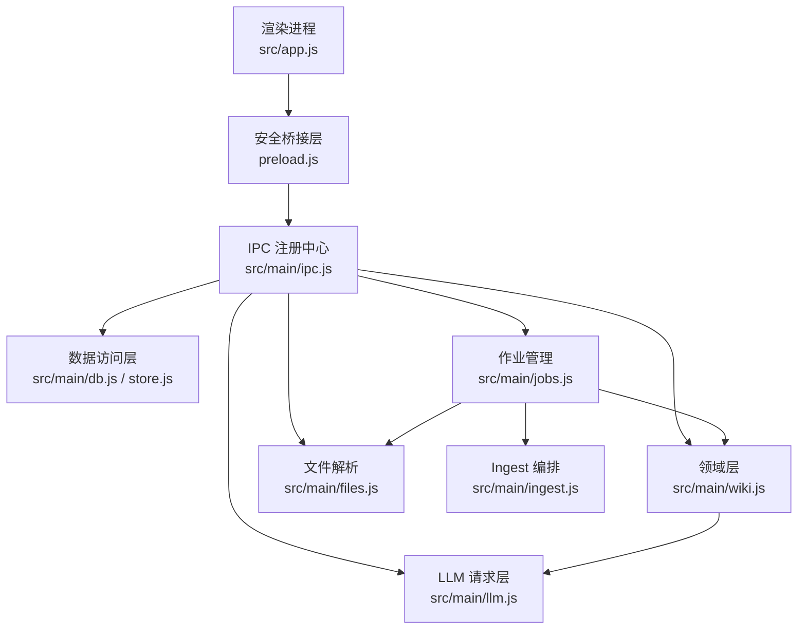
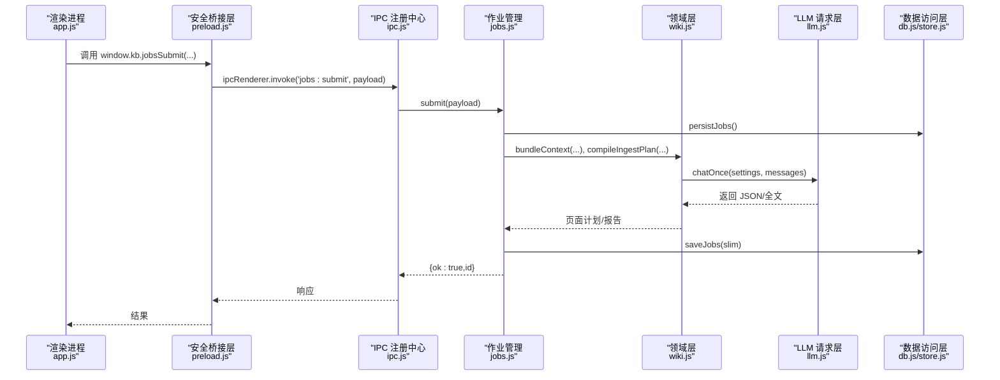
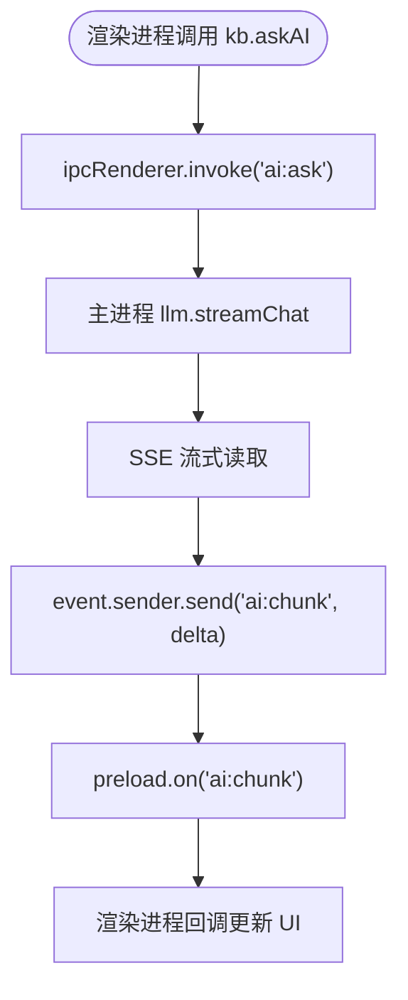
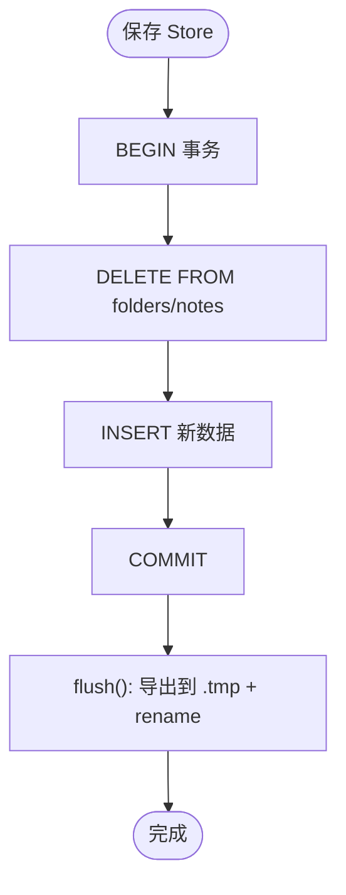
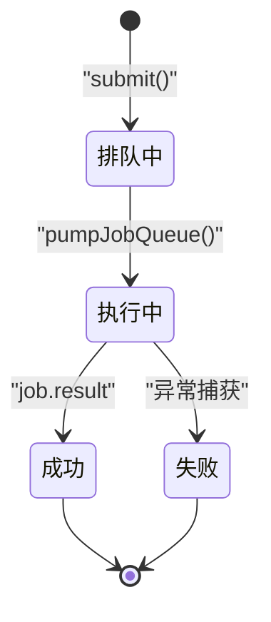
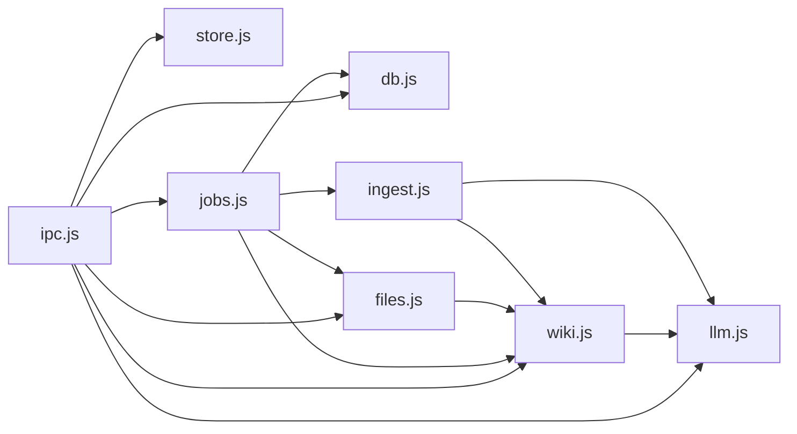

# 架构设计

<cite>
**本文引用的文件**
- [main.js](file://main.js)
- [preload.js](file://preload.js)
- [src/app.js](file://src/app.js)
- [src/index.html](file://src/index.html)
- [package.json](file://package.json)
- [src/main/ipc.js](file://src/main/ipc.js)
- [src/main/db.js](file://src/main/db.js)
- [src/main/store.js](file://src/main/store.js)
- [src/main/jobs.js](file://src/main/jobs.js)
- [src/main/llm.js](file://src/main/llm.js)
- [src/main/wiki.js](file://src/main/wiki.js)
- [src/main/files.js](file://src/main/files.js)
- [src/main/config.js](file://src/main/config.js)
- [src/main/ingest.js](file://src/main/ingest.js)
</cite>

## 目录
1. [简介](#简介)
2. [项目结构](#项目结构)
3. [核心组件](#核心组件)
4. [架构总览](#架构总览)
5. [详细组件分析](#详细组件分析)
6. [依赖关系分析](#依赖关系分析)
7. [性能与可靠性](#性能与可靠性)
8. [故障排查指南](#故障排查指南)
9. [结论](#结论)
10. [附录](#附录)

## 简介
Synapse 是一款基于 Electron 的本地个人知识库助手，提供 Markdown 笔记、LLM Wiki（知识图谱）、作业编排与 AI 智能问答能力。系统采用分层架构：表现层（渲染进程 UI）通过安全桥接层（preload）调用主进程 IPC；主进程按职责拆分为数据访问层、业务逻辑层、领域层与外部服务集成层，并通过事件驱动与作业队列实现异步长任务处理。

## 项目结构
- 应用入口 main.js 负责生命周期管理、窗口创建与安全上下文配置，并初始化数据库、作业系统与 IPC 注册中心。
- preload.js 暴露最小化的 API 到渲染进程，屏蔽底层 IPC 细节，形成安全桥接层。
- src/app.js 为渲染进程主逻辑，包含状态管理、UI 渲染、AI 问答交互、Wiki 阅读与吸收流程。
- src/main/* 为主进程模块：ipc.js 统一注册 IPC 通道；db.js/store.js 提供持久化；jobs.js 管理作业队列与阶段状态机；llm.js 封装 LLM 流式请求；wiki.js 负责 Wiki 领域逻辑；files.js 解析多格式文件；ingest.js 编排吸收流程；config.js 提供配置读取工具。

图表来源
- [main.js:19-47](file://main.js#L19-L47)
- [preload.js:3-55](file://preload.js#L3-L55)
- [src/main/ipc.js:12-106](file://src/main/ipc.js#L12-L106)
- [src/main/db.js:92-149](file://src/main/db.js#L92-L149)
- [src/main/jobs.js:72-120](file://src/main/jobs.js#L72-L120)
- [src/main/wiki.js:117-134](file://src/main/wiki.js#L117-L134)
- [src/main/files.js:77-99](file://src/main/files.js#L77-L99)
- [src/main/llm.js:40-77](file://src/main/llm.js#L40-L77)
- [src/main/ingest.js:22-82](file://src/main/ingest.js#L22-L82)

章节来源
- [main.js:1-56](file://main.js#L1-L56)
- [preload.js:1-56](file://preload.js#L1-L56)
- [src/app.js:1-800](file://src/app.js#L1-L800)
- [src/index.html:1-291](file://src/index.html#L1-L291)
- [package.json:1-45](file://package.json#L1-L45)

## 核心组件
- 主进程入口与窗口管理：创建 BrowserWindow，启用 contextIsolation 与 nodeIntegration=false，加载 preload 脚本，注册 IPC，初始化 DB 与作业系统。
- 安全桥接层：通过 contextBridge.exposeInMainWorld 暴露 kb API，封装 invoke 与 on 事件订阅，隔离渲染进程对主进程的直接访问。
- IPC 注册中心：集中注册所有 ipcMain.handle，将请求分派给对应模块（store、llm、wiki、jobs、files）。
- 数据访问层：SQLite 存储（sql.js），迁移旧 JSON 数据，原子写入 .tmp + rename，支持切换数据库路径。
- 作业管理：串行队列、阶段状态机、历史持久化、中断恢复与重试，支持 ingest 与 lint 两类作业。
- LLM 请求层：OpenAI 兼容接口，SSE 流式响应，错误分类与可重试策略，JSON 提取。
- Wiki 领域层：根目录定位、页面读取/描述、上下文打包、问答检索与流式合成、体检报告生成、回填归档。
- 文件解析：PDF/DOCX/XLSX/PPTX/文本等转 Markdown，保存到 raw/ 目录。
- Ingest 编排：读来源 → AI 编译页面计划 → 落盘，分阶段上报进度。
- 配置工具：从 settings 中读取数值/枚举配置，带默认值与范围钳制。

章节来源
- [src/main/ipc.js:12-106](file://src/main/ipc.js#L12-L106)
- [src/main/db.js:92-149](file://src/main/db.js#L92-L149)
- [src/main/jobs.js:72-120](file://src/main/jobs.js#L72-L120)
- [src/main/llm.js:40-123](file://src/main/llm.js#L40-L123)
- [src/main/wiki.js:93-134](file://src/main/wiki.js#L93-L134)
- [src/main/files.js:22-99](file://src/main/files.js#L22-L99)
- [src/main/ingest.js:8-82](file://src/main/ingest.js#L8-L82)
- [src/main/config.js:1-18](file://src/main/config.js#L1-L18)

## 架构总览
Synapse 采用“表现层—安全桥接层—IPC 注册中心—领域/服务/数据访问”的分层架构。渲染进程仅通过 preload 暴露的 kb API 与主进程通信；主进程通过 ipc.js 路由到具体模块，避免耦合。数据持久化由 db.js 统一管理，作业系统解耦长耗时任务，LLM 请求层抽象外部服务，Wiki 领域层封装业务规则。

图表来源
- [src/app.js:750-772](file://src/app.js#L750-L772)
- [preload.js:41-45](file://preload.js#L41-L45)
- [src/main/ipc.js:87-93](file://src/main/ipc.js#L87-L93)
- [src/main/jobs.js:100-120](file://src/main/jobs.js#L100-L120)
- [src/main/wiki.js:117-134](file://src/main/wiki.js#L117-L134)
- [src/main/llm.js:81-110](file://src/main/llm.js#L81-L110)
- [src/main/db.js:343-355](file://src/main/db.js#L343-L355)

## 详细组件分析

### 安全桥接层（preload）
- 职责：在渲染进程中暴露最小化 API（kb），封装 IPC 调用与事件监听，防止渲染进程直接访问 Node/Electron 能力。
- 关键模式：
  - 请求-响应：invoke 用于一次性调用（如 data:load、jobs:submit）。
  - 事件驱动：on 用于流式或推送事件（ai:chunk、ai:done、ai:error、wiki:refs、jobs:update）。
  - 资源清理：返回移除监听器的函数，避免内存泄漏。

图表来源
- [preload.js:9-25](file://preload.js#L9-L25)
- [src/main/llm.js:40-77](file://src/main/llm.js#L40-L77)

章节来源
- [preload.js:1-56](file://preload.js#L1-L56)

### IPC 注册中心（ipc.js）
- 职责：集中注册所有 IPC 通道，统一错误处理，委派到各模块。
- 关键通道：
  - 数据：data:load、data:save、data:setDbPath、dialog:export、app:getDataPath
  - AI：ai:ask（流式）
  - Wiki：wiki:defaultRoot、wiki:describe、wiki:read、wiki:pickFiles、wiki:ask、wiki:fileAnswer
  - 作业：jobs:list、jobs:submit、jobs:remove、jobs:clear、jobs:retry

章节来源
- [src/main/ipc.js:12-106](file://src/main/ipc.js#L12-L106)

### 数据访问层（db.js / store.js）
- 职责：SQLite 存储（sql.js），迁移旧 JSON 数据，原子写入，支持切换数据库路径。
- 关键特性：
  - 指针文件 db-path.json 记录当前数据库位置，支持回退默认。
  - 迁移 legacy 数据（knowledge-data.json、wiki-jobs.json）后改名备份。
  - flush 使用 .tmp + rename 保证原子性。
  - 事务提交/回滚保护一致性。

图表来源
- [src/main/db.js:252-266](file://src/main/db.js#L252-L266)
- [src/main/db.js:181-187](file://src/main/db.js#L181-L187)

章节来源
- [src/main/db.js:92-149](file://src/main/db.js#L92-L149)
- [src/main/db.js:152-177](file://src/main/db.js#L152-L177)
- [src/main/db.js:252-266](file://src/main/db.js#L252-L266)
- [src/main/store.js:1-17](file://src/main/store.js#L1-L17)

### 作业管理（jobs.js）
- 职责：串行队列、阶段状态机、历史持久化、中断恢复与重试。
- 关键流程：
  - 提交作业：创建 job，入队，持久化，触发 pumpJobQueue。
  - 执行器：JOB_RUNNERS 根据类型执行（ingest/lint），分阶段设置状态并持久化。
  - 重试：ingest 复用 rawPaths 跳过解析阶段；lint 重新提交。

图表来源
- [src/main/jobs.js:72-98](file://src/main/jobs.js#L72-L98)
- [src/main/jobs.js:100-120](file://src/main/jobs.js#L100-L120)
- [src/main/jobs.js:136-188](file://src/main/jobs.js#L136-L188)

章节来源
- [src/main/jobs.js:1-260](file://src/main/jobs.js#L1-L260)

### LLM 请求层（llm.js）
- 职责：OpenAI 兼容接口，SSE 流式解析，错误分类与重试，JSON 提取。
- 关键特性：
  - consumeSseStream：逐行解析 data: 增量，回调 delta。
  - streamChat：流式对话，发送 ai:chunk、ai:done、ai:error。
  - chatOnce：非流式内部调用，累积全文，支持 RetriableError 重试。
  - extractJson：容忍代码块包裹与前后杂质。

章节来源
- [src/main/llm.js:1-123](file://src/main/llm.js#L1-L123)

### Wiki 领域层（wiki.js）
- 职责：Wiki 根目录定位、页面读取/描述、上下文打包、问答检索与流式合成、体检报告生成、回填归档。
- 关键特性：
  - safeJoin：路径安全校验，禁止逃逸根目录。
  - bundleContext：打包 schema、index、页面清单与全文。
  - wikiAsk：两步检索（先选页再回答），发送 wiki:refs 引用。
  - fileAnswer：归档问答为 Answer 类型页面，更新 index.md 与 log.md。
  - lintFromContext：全库体检，输出 Markdown 报告。

章节来源
- [src/main/wiki.js:1-313](file://src/main/wiki.js#L1-L313)

### 文件解析（files.js）
- 职责：PDF/DOCX/XLSX/PPTX/文本等转 Markdown，保存到 raw/。
- 关键特性：
  - extractFileContent：按扩展名选择解析器。
  - saveFileSource：校验格式，生成标题与时间戳，唯一文件名。

章节来源
- [src/main/files.js:1-102](file://src/main/files.js#L1-L102)

### Ingest 编排（ingest.js）
- 职责：读来源 → AI 编译页面计划 → 落盘，分阶段上报进度。
- 关键流程：
  - loadIngestRaws：读取 raw/ 内容，截断超长来源。
  - compileIngestPlan：构造提示词，调用 LLM 生成 JSON 计划。
  - applyIngestPlan：写页面、更新 index.md、追加日志。

章节来源
- [src/main/ingest.js:1-85](file://src/main/ingest.js#L1-L85)

### 配置工具（config.js）
- 职责：从 settings 读取数值/枚举配置，带默认值与范围钳制。
- 关键函数：num、pick。

章节来源
- [src/main/config.js:1-18](file://src/main/config.js#L1-L18)

## 依赖关系分析
- 主进程模块依赖关系：
  - ipc.js 依赖 store、db、llm、wiki、files、jobs。
  - jobs.js 依赖 files、wiki、ingest、db、config。
  - wiki.js 依赖 llm、config、fs/path。
  - files.js 依赖 wiki、Turndown、JSZip、mammoth、xlsx、pdf-parse。
  - llm.js 依赖 config。
  - ingest.js 依赖 llm、wiki、config。
  - db.js 独立，被 store 包装。

图表来源
- [src/main/ipc.js:1-10](file://src/main/ipc.js#L1-L10)
- [src/main/jobs.js:1-8](file://src/main/jobs.js#L1-L8)
- [src/main/wiki.js:1-7](file://src/main/wiki.js#L1-L7)
- [src/main/files.js:1-9](file://src/main/files.js#L1-L9)
- [src/main/ingest.js:1-6](file://src/main/ingest.js#L1-L6)

章节来源
- [src/main/ipc.js:1-10](file://src/main/ipc.js#L1-L10)
- [src/main/jobs.js:1-8](file://src/main/jobs.js#L1-L8)
- [src/main/wiki.js:1-7](file://src/main/wiki.js#L1-L7)
- [src/main/files.js:1-9](file://src/main/files.js#L1-L9)
- [src/main/ingest.js:1-6](file://src/main/ingest.js#L1-L6)

## 性能与可靠性
- 流式响应：LLM 请求使用 SSE 流式传输，减少首屏延迟，提升用户体验。
- 原子写入：数据库与文件写入使用 .tmp + rename 保证一致性。
- 串行作业：避免并发写冲突，确保 Wiki 文件一致性。
- 重试机制：网络/5xx/空返回等瞬时错误自动重试，提高鲁棒性。
- 配置钳制：数值配置限制范围，防止异常值导致性能问题。
- 内存优化：作业历史剥离 payload 持久化，减少内存占用。

[本节为通用指导，不直接分析具体文件]

## 故障排查指南
- 未配置 API Key：llm.js 会发送 ai:error 提示用户填写设置。
- 网络请求失败：捕获异常并发送 ai:error，检查 Base URL 与密钥。
- 数据库切换失败：db.js 返回错误信息，检查路径权限与目标文件是否存在。
- 作业失败：jobs.js 记录 error 与阶段详情，可在作业页查看并重试。
- 文件解析失败：files.js 抛出不支持格式或内容为空错误，检查扩展名与内容。
- Wiki 路径非法：wiki.js 的 safeJoin 抛出非法路径错误，检查相对路径。

章节来源
- [src/main/llm.js:45-76](file://src/main/llm.js#L45-L76)
- [src/main/db.js:36-80](file://src/main/db.js#L36-L80)
- [src/main/jobs.js:83-98](file://src/main/jobs.js#L83-L98)
- [src/main/files.js:77-99](file://src/main/files.js#L77-L99)
- [src/main/wiki.js:27-33](file://src/main/wiki.js#L27-L33)

## 结论
Synapse 通过清晰的分层架构与模块化设计，实现了安全的 IPC 通信、可靠的持久化、可扩展的作业系统与强大的 AI 能力。事件驱动与流式响应提升了交互体验，而原子写入与重试机制保障了数据一致性与系统鲁棒性。开发者可基于现有模块快速扩展新功能，同时保持系统的可维护性与安全性。

[本节为总结性内容，不直接分析具体文件]

## 附录
- 安全最佳实践：
  - 始终启用 contextIsolation 与禁用 nodeIntegration。
  - 通过 preload 暴露最小化 API，避免直接暴露 Node/Electron 能力。
  - 使用 safeJoin 校验路径，防止目录穿越攻击。
- 扩展建议：
  - 新增 IPC 通道时，在 ipc.js 中统一注册并委派到对应模块。
  - 新增作业类型时，定义阶段与执行器，遵循串行队列与状态机模式。
  - 新增文件格式解析时，在 files.js 中添加分支并测试边界情况。

[本节为通用指导，不直接分析具体文件]