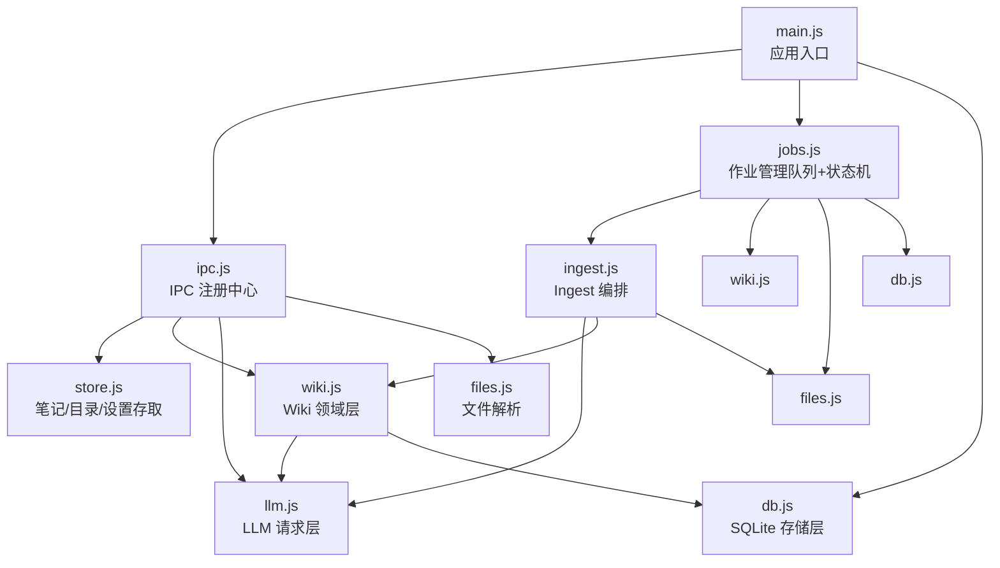
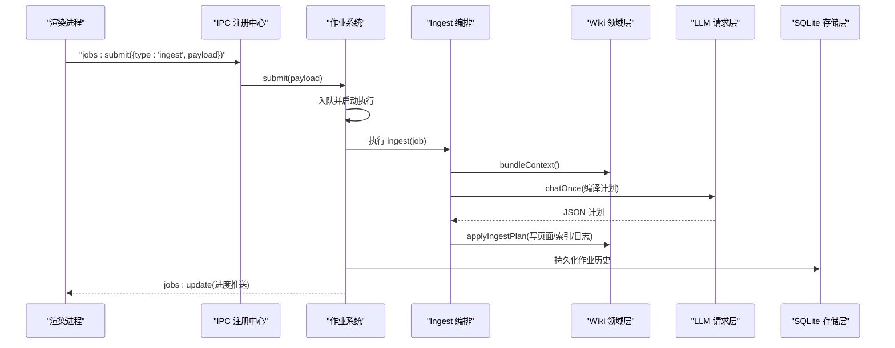
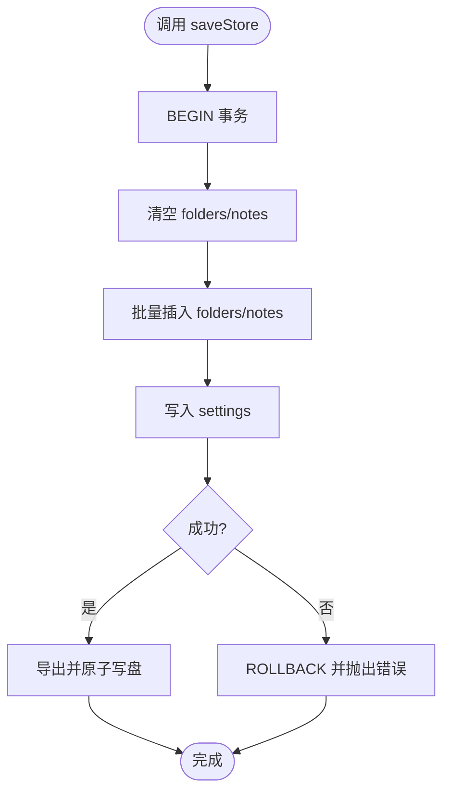
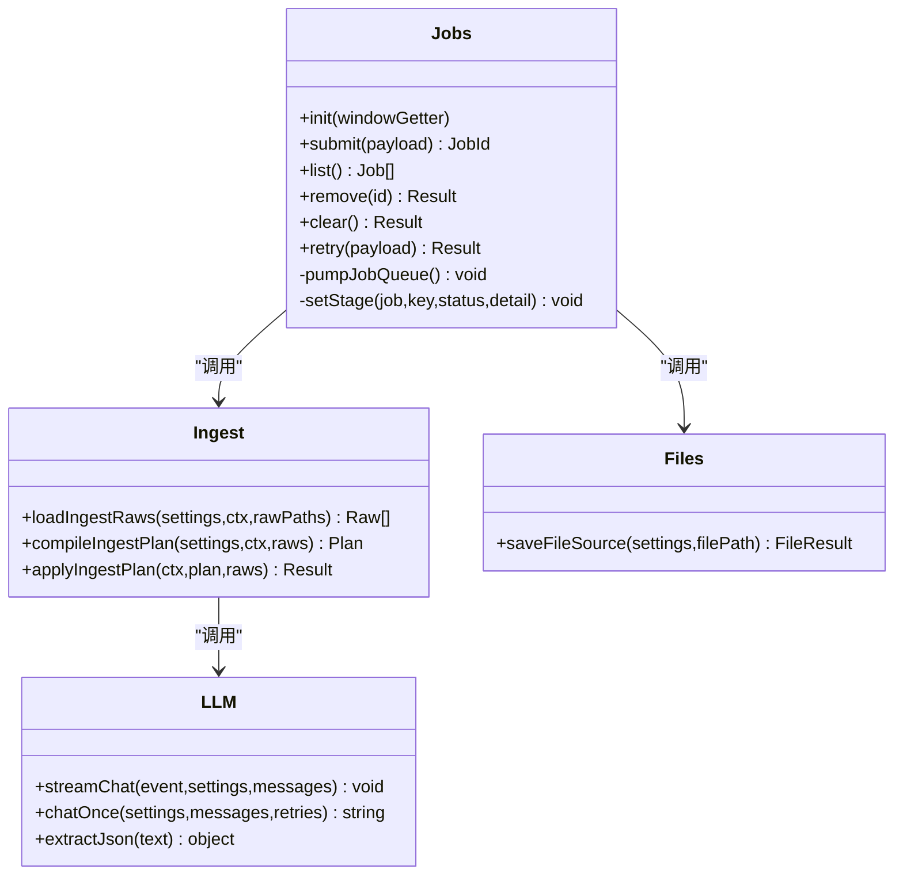
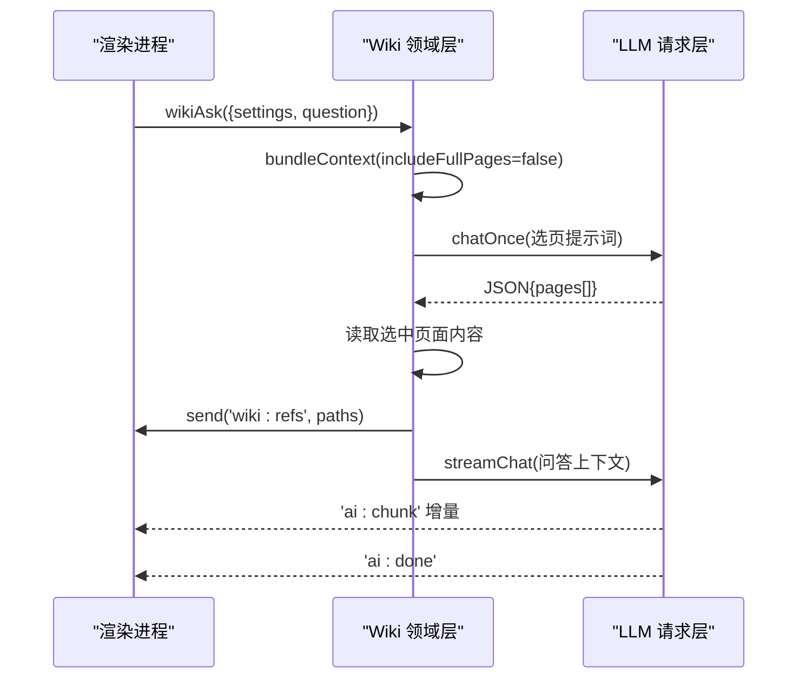
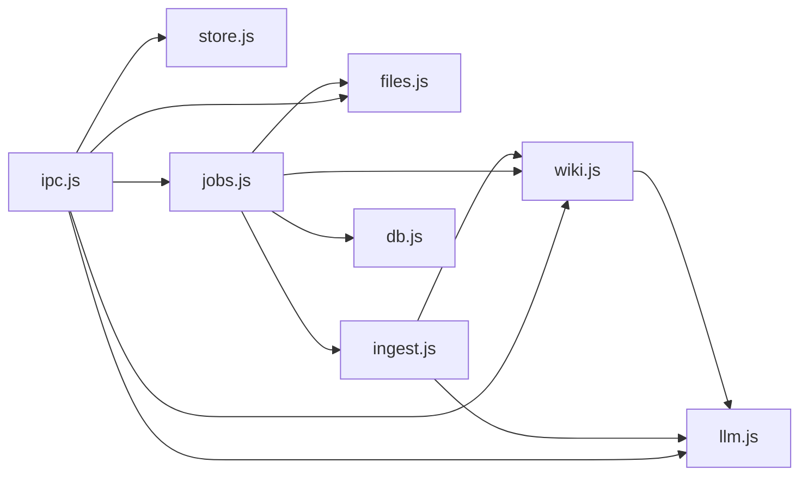

# 模块设计

<cite>
**本文引用的文件**
- [main.js](file://main.js)
- [package.json](file://package.json)
- [src/main/ipc.js](file://src/main/ipc.js)
- [src/main/db.js](file://src/main/db.js)
- [src/main/store.js](file://src/main/store.js)
- [src/main/files.js](file://src/main/files.js)
- [src/main/ingest.js](file://src/main/ingest.js)
- [src/main/jobs.js](file://src/main/jobs.js)
- [src/main/llm.js](file://src/main/llm.js)
- [src/main/wiki.js](file://src/main/wiki.js)
- [src/app.js](file://src/app.js)
</cite>

## 目录
1. [简介](#简介)
2. [项目结构](#项目结构)
3. [核心组件](#核心组件)
4. [架构总览](#架构总览)
5. [详细组件分析](#详细组件分析)
6. [依赖关系分析](#依赖关系分析)
7. [性能与可靠性](#性能与可靠性)
8. [故障排查指南](#故障排查指南)
9. [扩展与维护](#扩展与维护)
10. [结论](#结论)

## 简介
本模块设计文档面向“Synapse”本地个人知识库助手，围绕分层架构（数据访问层、业务逻辑层、领域层）与模块职责边界进行系统化说明。重点涵盖：
- 各模块的职责划分、接口设计与依赖关系
- 分层架构的实现方式与数据流转机制
- 模块间通信方式（IPC、事件流）
- 设计模式应用（工厂、策略、状态机等）
- 模块依赖图与接口契约定义
- 如何扩展新模块并保持可维护性

## 项目结构
应用基于 Electron，主进程负责生命周期、窗口创建与模块装配；渲染进程提供 UI 与交互；业务逻辑按职责拆分在 src/main/ 下，形成清晰的分层与模块化组织。

图表来源
- [main.js:1-56](file://main.js#L1-L56)
- [src/main/ipc.js:1-109](file://src/main/ipc.js#L1-L109)
- [src/main/jobs.js:1-260](file://src/main/jobs.js#L1-L260)
- [src/main/db.js:1-358](file://src/main/db.js#L1-L358)
- [src/main/store.js:1-17](file://src/main/store.js#L1-L17)
- [src/main/files.js:1-102](file://src/main/files.js#L1-L102)
- [src/main/ingest.js:1-85](file://src/main/ingest.js#L1-L85)
- [src/main/llm.js:1-123](file://src/main/llm.js#L1-L123)
- [src/main/wiki.js:1-313](file://src/main/wiki.js#L1-L313)

章节来源
- [main.js:1-56](file://main.js#L1-L56)
- [package.json:1-45](file://package.json#L1-L45)

## 核心组件
- 数据访问层（DAL）
  - db.js：SQLite 持久化（notes/folders/kv/jobs），原子落盘、迁移、路径切换
  - store.js：对上层暴露笔记/目录/设置的加载与保存接口
- 业务逻辑层（BLL）
  - jobs.js：作业串行队列、阶段状态机、历史持久化、重试与恢复
  - ingest.js：Ingest 编排（读取 raw → AI 编译计划 → 落盘）
  - files.js：多格式文件解析为 Markdown，保存到 raw/
  - llm.js：OpenAI 兼容流式请求、SSE 解析、重试策略、JSON 提取
- 领域层（Domain）
  - wiki.js：Wiki 根定位、页面读写、上下文打包、问答检索与回填、体检报告生成
- IPC 注册中心
  - ipc.js：统一注册所有 ipcMain.handle，转发到对应模块
- 应用入口
  - main.js：初始化顺序、窗口创建、模块装配
- 渲染层
  - app.js：UI 状态、交互、调用 window.kb 桥接 IPC

章节来源
- [src/main/db.js:1-358](file://src/main/db.js#L1-L358)
- [src/main/store.js:1-17](file://src/main/store.js#L1-L17)
- [src/main/jobs.js:1-260](file://src/main/jobs.js#L1-L260)
- [src/main/ingest.js:1-85](file://src/main/ingest.js#L1-L85)
- [src/main/files.js:1-102](file://src/main/files.js#L1-L102)
- [src/main/llm.js:1-123](file://src/main/llm.js#L1-L123)
- [src/main/wiki.js:1-313](file://src/main/wiki.js#L1-L313)
- [src/main/ipc.js:1-109](file://src/main/ipc.js#L1-L109)
- [main.js:1-56](file://main.js#L1-L56)
- [src/app.js:1-800](file://src/app.js#L1-L800)

## 架构总览
采用分层架构与消息驱动：
- 渲染层通过 IPC 调用主进程能力
- IPC 注册中心将请求路由到具体模块
- 领域层封装 Wiki 业务语义，协调 DAL 与外部服务（LLM）
- 作业系统以“类型 + 阶段”的编排模型驱动复杂流程，保证幂等与可观测性

图表来源
- [src/main/ipc.js:84-98](file://src/main/ipc.js#L84-L98)
- [src/main/jobs.js:100-121](file://src/main/jobs.js#L100-L121)
- [src/main/jobs.js:136-188](file://src/main/jobs.js#L136-L188)
- [src/main/ingest.js:22-82](file://src/main/ingest.js#L22-L82)
- [src/main/wiki.js:117-134](file://src/main/wiki.js#L117-L134)
- [src/main/llm.js:79-110](file://src/main/llm.js#L79-L110)
- [src/main/db.js:288-358](file://src/main/db.js#L288-L358)

## 详细组件分析

### 数据访问层（db.js / store.js）
- 职责
  - 使用 sql.js（WASM）实现 SQLite 内存库，整体导出原子落盘
  - 提供 notes/folders/kv/jobs 的 CRUD 接口
  - 支持数据库文件位置切换与指针文件管理
  - 旧 JSON 数据一次性迁移至 SQLite
- 关键接口
  - init(): 初始化 SQL 引擎与 schema，迁移旧数据
  - getStore()/saveStore(store): 全量读取/写入笔记与设置
  - getJobs()/saveJobs(list): 作业历史读取/覆盖
  - setDbPath(newPath): 整库迁移到新路径，更新指针文件
- 复杂度与性能
  - 小数据量场景下，整体导出 + rename 落盘开销可忽略
  - 批量插入使用 prepare + run，避免重复解析 SQL
- 错误处理
  - 迁移失败保留原文件并记录日志
  - saveStore/saveJobs 使用事务，异常时回滚

图表来源
- [src/main/db.js:251-266](file://src/main/db.js#L251-L266)
- [src/main/db.js:180-187](file://src/main/db.js#L180-L187)

章节来源
- [src/main/db.js:1-358](file://src/main/db.js#L1-L358)
- [src/main/store.js:1-17](file://src/main/store.js#L1-L17)

### 业务逻辑层（jobs.js / ingest.js / files.js / llm.js）
- 作业系统（jobs.js）
  - 串行队列：避免并发写冲突
  - 阶段状态机：每个作业包含 stages，支持 running/pending/success/failed
  - 历史持久化：仅持久化必要字段，剥离 payload
  - 重试与恢复：重启后未完成作业标记失败；支持按类型重试（ingest 复用 rawPaths）
- Ingest 编排（ingest.js）
  - 三步拆分：loadIngestRaws → compileIngestPlan → applyIngestPlan
  - 超长内容截断，避免提示词爆炸
  - 输出 JSON 计划，严格遵循 OKF frontmatter 约定
- 文件解析（files.js）
  - 支持 PDF/DOCX/XLSX/PPTX/文本/CSV 等，统一转为 Markdown
  - 保存到 raw/ 目录，命名含日期与 slugify 标题
- LLM 请求（llm.js）
  - OpenAI 兼容 SSE 流式响应，增量回调
  - chatOnce 内部累积全文，支持可重试错误分类与次数控制
  - extractJson 容忍代码块包裹与前后杂质

图表来源
- [src/main/jobs.js:1-260](file://src/main/jobs.js#L1-L260)
- [src/main/ingest.js:1-85](file://src/main/ingest.js#L1-L85)
- [src/main/files.js:1-102](file://src/main/files.js#L1-L102)
- [src/main/llm.js:1-123](file://src/main/llm.js#L1-L123)

章节来源
- [src/main/jobs.js:1-260](file://src/main/jobs.js#L1-L260)
- [src/main/ingest.js:1-85](file://src/main/ingest.js#L1-L85)
- [src/main/files.js:1-102](file://src/main/files.js#L1-L102)
- [src/main/llm.js:1-123](file://src/main/llm.js#L1-L123)

### 领域层（wiki.js）
- 职责
  - Wiki 根目录定位与路径安全校验
  - 页面读取、描述、上下文打包（index.md + 页面清单/全文）
  - 问答检索：两步检索（选页 + 流式合成），回填归档为 Answer 页面
  - 体检报告：收集全库页面，AI 审查并输出报告
- 关键接口
  - describeWiki(settings): 返回 exists/schema/indexContent/pages/logTail
  - bundleContext(settings, options): 构建 AI 所需上下文
  - wikiAsk(event, payload): 流式问答，发送 refs 与 ai:chunk/ai:error/ai:done
  - fileAnswer(settings, payload): 归档问答并更新 index.md 与日志
  - lintFromContext(settings, ctx): 体检报告生成
- 数据流
  - 问答：选择相关页面 → 组装上下文 → 流式回答
  - 回填：生成 Answer 页面 → 更新主题小节 → 追加日志

图表来源
- [src/main/wiki.js:193-233](file://src/main/wiki.js#L193-L233)
- [src/main/wiki.js:117-134](file://src/main/wiki.js#L117-L134)
- [src/main/llm.js:39-77](file://src/main/llm.js#L39-L77)

章节来源
- [src/main/wiki.js:1-313](file://src/main/wiki.js#L1-L313)

### IPC 注册中心（ipc.js）
- 职责
  - 集中注册所有 ipcMain.handle，屏蔽底层模块细节
  - 参数校验与错误包装，统一返回 {ok, ...}
  - 桥接对话框、AI 流式事件、Wiki 操作、作业管理
- 关键通道
  - data:* 数据存取
  - ai:ask 流式问答
  - wiki:* Wiki 描述/读取/问答/文件答案
  - jobs:* 作业列表/提交/删除/清理/重试

章节来源
- [src/main/ipc.js:1-109](file://src/main/ipc.js#L1-L109)

### 应用入口与装配（main.js）
- 职责
  - 设置 userData 路径，确保数据不丢失
  - 初始化 db、jobs、IPC，创建窗口
  - 注入 getWindow 给需要窗口能力的模块（如 jobs 广播）

章节来源
- [main.js:1-56](file://main.js#L1-L56)

## 依赖关系分析
- 耦合与内聚
  - 领域层（wiki.js）高内聚于 Wiki 业务，依赖 LLM 与 DAL
  - 作业系统（jobs.js）作为编排器，低耦合地组合 files/ingest/wiki/db
  - IPC 注册中心解耦渲染层与主进程模块
- 直接/间接依赖
  - jobs.js 依赖 files.js、ingest.js、wiki.js、db.js、config.js
  - ingest.js 依赖 wiki.js、llm.js、config.js
  - wiki.js 依赖 llm.js、config.js
  - llm.js 仅依赖 config.js
- 循环依赖
  - 未发现循环依赖；模块间呈单向依赖
- 外部依赖
  - sql.js（SQLite WASM）、turndown（HTML→Markdown）、mammoth/pdf-parse/xlsx/jszip（文件解析）

图表来源
- [src/main/ipc.js:1-109](file://src/main/ipc.js#L1-L109)
- [src/main/jobs.js:1-260](file://src/main/jobs.js#L1-L260)
- [src/main/ingest.js:1-85](file://src/main/ingest.js#L1-L85)
- [src/main/wiki.js:1-313](file://src/main/wiki.js#L1-L313)
- [src/main/llm.js:1-123](file://src/main/llm.js#L1-L123)
- [src/main/files.js:1-102](file://src/main/files.js#L1-L102)
- [src/main/db.js:1-358](file://src/main/db.js#L1-L358)

章节来源
- [src/main/ipc.js:1-109](file://src/main/ipc.js#L1-L109)
- [src/main/jobs.js:1-260](file://src/main/jobs.js#L1-L260)
- [src/main/ingest.js:1-85](file://src/main/ingest.js#L1-L85)
- [src/main/wiki.js:1-313](file://src/main/wiki.js#L1-L313)
- [src/main/llm.js:1-123](file://src/main/llm.js#L1-L123)
- [src/main/files.js:1-102](file://src/main/files.js#L1-L102)
- [src/main/db.js:1-358](file://src/main/db.js#L1-L358)

## 性能与可靠性
- 性能
  - SQLite 内存库 + 整体导出落盘，适合小规模数据
  - 批量插入使用 prepare，减少 SQL 解析开销
  - 超长来源截断，降低 LLM 输入成本
  - 流式响应提升交互体验
- 可靠性
  - 原子写盘（临时文件 + rename）避免损坏
  - 事务保护 saveStore/saveJobs，异常回滚
  - LLM 可重试错误分类与次数限制
  - 作业状态机与历史持久化，支持中断恢复与重试

[本节为通用指导，无需特定文件引用]

## 故障排查指南
- 常见问题
  - API Key 未配置：LLM 请求会返回错误提示
  - 网络或 5xx 错误：自动重试（可配置次数）
  - 源文件为空或无法解析：保存失败并提示原因
  - 作业中断：重启后未完成作业标记失败，可重试
- 定位方法
  - 查看作业历史中的 stages 与 error 字段
  - 检查 log.md 中最近条目
  - 确认数据库文件路径与指针文件一致性

章节来源
- [src/main/llm.js:40-77](file://src/main/llm.js#L40-L77)
- [src/main/jobs.js:25-53](file://src/main/jobs.js#L25-L53)
- [src/main/files.js:77-99](file://src/main/files.js#L77-L99)
- [src/main/db.js:151-177](file://src/main/db.js#L151-L177)

## 扩展与维护
- 新增作业类型
  - 在 jobs.js 的 JOB_RUNNERS 中添加新的 type 与执行器
  - 定义阶段数组（stageDefs），并在提交时传入
  - 如需持久化额外字段，扩展 db.js 的 jobs 表与映射
- 新增文件解析器
  - 在 files.js 的 extractFileContent 中增加分支
  - 更新 FILE_EXTENSIONS 白名单
- 新增 Wiki 能力
  - 在 wiki.js 中新增领域函数，并通过 ipc.js 暴露通道
  - 在渲染层 app.js 中调用 window.kb 桥接
- 保持可维护性
  - 严格遵循分层：IPC → 作业/编排 → 领域 → 数据访问
  - 使用配置工具（config.js）集中管理数值/枚举配置
  - 统一错误包装与返回格式（{ok, ...}）

章节来源
- [src/main/jobs.js:136-188](file://src/main/jobs.js#L136-L188)
- [src/main/files.js:22-74](file://src/main/files.js#L22-L74)
- [src/main/ipc.js:48-82](file://src/main/ipc.js#L48-L82)
- [src/main/config.js:1-18](file://src/main/config.js#L1-L18)

## 结论
本项目通过清晰的层次划分与模块职责边界，实现了可扩展、可维护的个人知识库助手。IPC 注册中心解耦了渲染与主进程；作业系统以状态机驱动复杂流程；领域层封装 Wiki 业务语义；数据访问层提供稳定可靠的持久化。结合流式 LLM 集成与健壮的错误处理，系统在用户体验与稳定性方面达到良好平衡。未来扩展可通过新增作业类型、解析器与 Wiki 能力平滑演进。