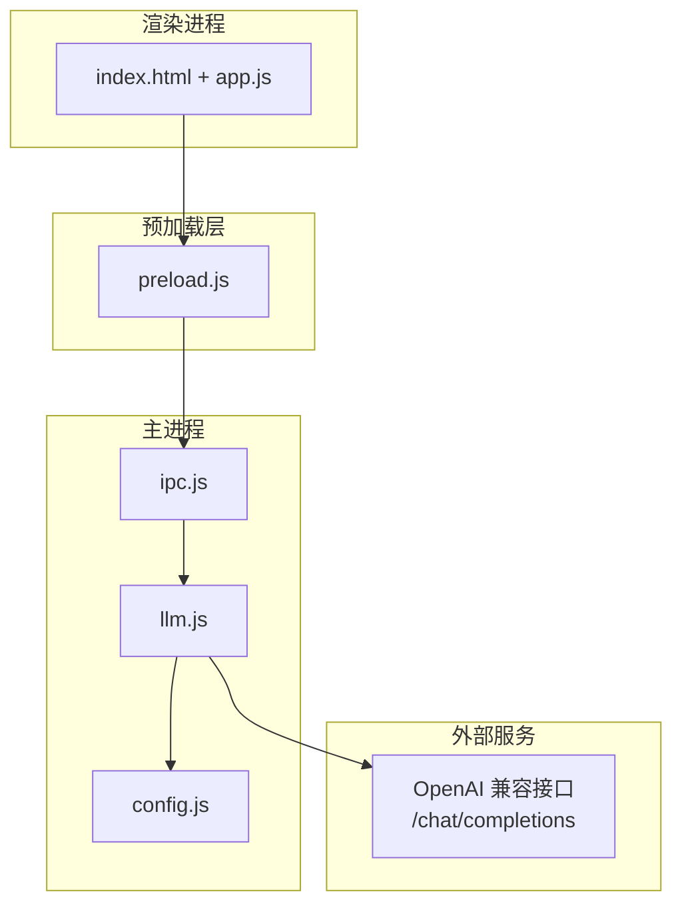
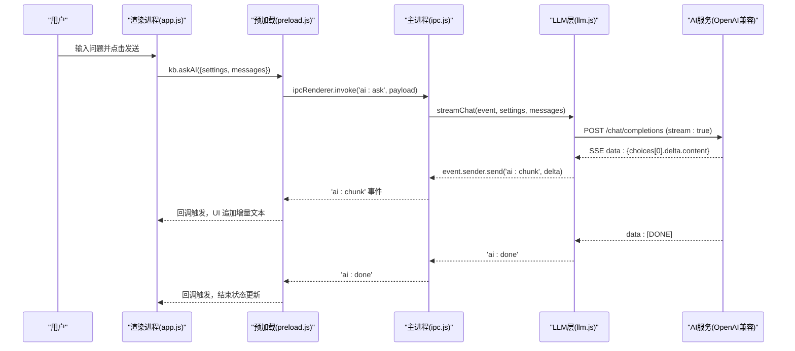
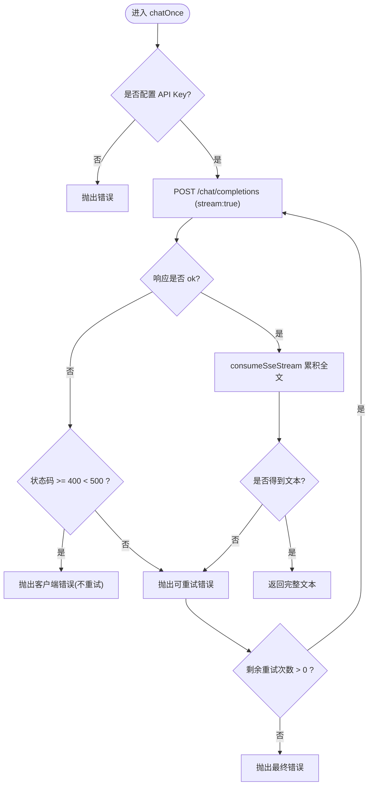
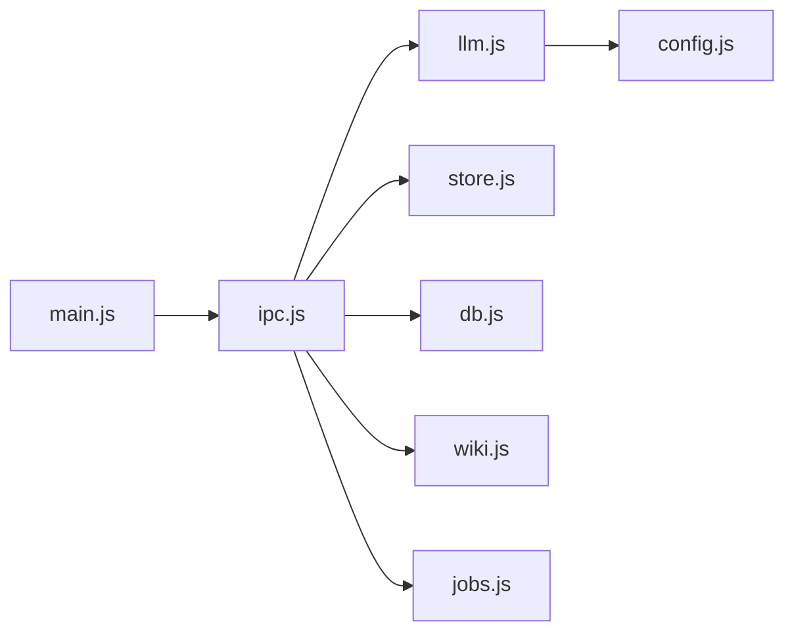

# AI 问答模块

<cite>
**本文引用的文件**
- [llm.js](file://src/main/llm.js)
- [ipc.js](file://src/main/ipc.js)
- [config.js](file://src/main/config.js)
- [preload.js](file://preload.js)
- [main.js](file://main.js)
- [index.html](file://src/index.html)
- [app.js](file://src/app.js)
- [package.json](file://package.json)
</cite>

## 目录
1. [简介](#简介)
2. [项目结构](#项目结构)
3. [核心组件](#核心组件)
4. [架构总览](#架构总览)
5. [详细组件分析](#详细组件分析)
6. [依赖关系分析](#依赖关系分析)
7. [性能与限流](#性能与限流)
8. [故障排查指南](#故障排查指南)
9. [结论](#结论)
10. [附录：API 与配置说明](#附录api-与配置说明)

## 简介
本模块为本地知识库应用提供“AI 智能问答”能力，采用 OpenAI 兼容的聊天完成接口，通过主进程发起网络请求、解析服务端事件流（SSE），并以增量消息实时推送给渲染进程进行前端展示。模块同时提供非流式调用封装，用于编排任务中累积完整文本并支持自动重试。错误处理覆盖网络异常、服务端 5xx、空返回等可重试场景；客户端 4xx 错误直接上报不重试。

## 项目结构
AI 问答相关代码分布在主进程与渲染进程的多个文件中：
- 主进程负责 IPC 注册、LLM 请求、SSE 流解析与重试策略
- 渲染进程通过 preload 暴露安全 API，订阅流式事件并更新 UI
- 设置界面提供 Base URL、API Key、模型名称、重试次数等配置项



图表来源
- [ipc.js:1-109](file://src/main/ipc.js#L1-L109)
- [llm.js:1-123](file://src/main/llm.js#L1-L123)
- [config.js:1-18](file://src/main/config.js#L1-L18)
- [preload.js:1-56](file://preload.js#L1-L56)
- [index.html:1-291](file://src/index.html#L1-L291)
- [app.js:1-200](file://src/app.js#L1-L200)

章节来源
- [main.js:1-56](file://main.js#L1-L56)
- [package.json:1-45](file://package.json#L1-L45)

## 核心组件
- LLM 请求层：实现 OpenAI 兼容接口的流式与非流式调用、SSE 解析、重试与 JSON 提取
- IPC 注册中心：统一注册 ai:ask 等 IPC 通道，将请求委派到 llm 模块
- 配置助手：数值与枚举配置的读取与校验，避免非法值影响运行
- 预加载桥接：向渲染进程暴露 askAI 及 onAiChunk/onAiDone/onAiError 等事件订阅方法
- 前端交互：设置页收集配置，问答面板发送问题并实时渲染增量内容

章节来源
- [llm.js:1-123](file://src/main/llm.js#L1-L123)
- [ipc.js:1-109](file://src/main/ipc.js#L1-L109)
- [config.js:1-18](file://src/main/config.js#L1-L18)
- [preload.js:1-56](file://preload.js#L1-L56)
- [index.html:95-157](file://src/index.html#L95-L157)
- [app.js:1-200](file://src/app.js#L1-L200)

## 架构总览
AI 问答从用户输入到最终展示的端到端流程如下：



图表来源
- [ipc.js:45-46](file://src/main/ipc.js#L45-L46)
- [llm.js:40-77](file://src/main/llm.js#L40-L77)
- [preload.js:9-25](file://preload.js#L9-L25)
- [index.html:203-222](file://src/index.html#L203-L222)

## 详细组件分析

### LLM 请求层（OpenAI 兼容接口）
- 流式对话 streamChat
  - 构造 baseUrl、apiKey、model，缺失 apiKey 时直接上报错误
  - 使用 fetch 以 stream:true 发起 /chat/completions 请求
  - 通过 consumeSseStream 逐行解析 data: 行，提取 choices[0].delta.content 增量
  - 通过 event.sender.send('ai:chunk', delta) 推送增量，完成后发送 'ai:done'
  - 网络异常或响应非 ok 时，发送 'ai:error' 并终止
- 非流式对话 chatOnce
  - 内部同样以流式方式接收并累积全文，便于在编排步骤中使用
  - 支持基于 RetriableError 的重试：网络异常、5xx、空返回可重试；4xx 客户端错误直接抛出
  - 重试次数默认来自配置 chatRetries，范围钳制在 0-5
- SSE 解析 consumeSseStream
  - 使用 ReadableStream + TextDecoder 解码 UTF-8 字节流
  - 按换行符切分，保留未完整的一行，逐行 emitDataLine
  - 忽略无法解析的行，保证鲁棒性
- JSON 提取 extractJson
  - 去除前后 ```json 包裹与空白，定位首个 { 与最后一个 } 截取后解析
  - 若未找到有效 JSON 则抛出错误



图表来源
- [llm.js:79-110](file://src/main/llm.js#L79-L110)
- [llm.js:9-37](file://src/main/llm.js#L9-L37)

章节来源
- [llm.js:1-123](file://src/main/llm.js#L1-L123)

### IPC 注册中心
- 统一注册 ai:ask，将渲染进程的请求转发至 llm.streamChat
- 其他功能如 Wiki、作业管理也在此集中注册，便于维护

章节来源
- [ipc.js:1-109](file://src/main/ipc.js#L1-L109)

### 配置助手
- num：读取数值配置，四舍五入并钳制到 [min, max]，非法值回退默认
- pick：枚举配置校验，不在允许列表内回退默认
- 所有业务参数由渲染层设置弹窗维护并通过 IPC 传入，主进程不硬编码

章节来源
- [config.js:1-18](file://src/main/config.js#L1-L18)

### 预加载桥接与前端交互
- 暴露 kb.askAI(payload) 用于发起 AI 问答
- 暴露 onAiChunk/onAiDone/onAiError 用于订阅流式事件
- 前端 index.html 提供设置页与问答面板，app.js 负责状态管理与 UI 更新

章节来源
- [preload.js:1-56](file://preload.js#L1-L56)
- [index.html:95-157](file://src/index.html#L95-L157)
- [index.html:203-222](file://src/index.html#L203-L222)
- [app.js:1-200](file://src/app.js#L1-L200)

## 依赖关系分析
- 主进程入口 main.js 初始化数据库、作业系统并注册 IPC
- ipc.js 依赖 store、db、llm、wiki、files、jobs 等模块
- llm.js 依赖 config.js 获取数值配置
- 渲染进程通过 preload.js 访问主进程能力，避免直接 Node 权限



图表来源
- [main.js:1-56](file://main.js#L1-L56)
- [ipc.js:1-109](file://src/main/ipc.js#L1-L109)
- [llm.js:1-123](file://src/main/llm.js#L1-L123)
- [config.js:1-18](file://src/main/config.js#L1-L18)

章节来源
- [main.js:1-56](file://main.js#L1-L56)
- [ipc.js:1-109](file://src/main/ipc.js#L1-L109)

## 性能与限流
- 流式传输：始终使用 stream:true 发起请求，避免网关对长连接无响应头的超时限制
- SSE 增量推送：逐段增量渲染，降低内存占用并提升首屏体验
- 重试策略：仅对瞬时错误重试，避免无效重试造成资源浪费
- 配置化重试次数：通过设置项控制最大重试次数，防止无限重试
- 建议实践：
  - 合理设置模型与上下文长度，避免过长提示词导致响应缓慢
  - 在网络不稳定环境下适当增加重试次数
  - 对高频调用场景考虑在服务端或网关层做限流与缓存

## 故障排查指南
- 未配置 API Key
  - 现象：立即收到 ai:error，提示尚未配置 API Key
  - 处理：在设置页填写 Base URL、API Key、模型名称
- 网络请求失败
  - 现象：ai:error 包含网络错误信息
  - 处理：检查网络连通性与代理设置
- 接口返回错误
  - 现象：ai:error 包含状态码与错误详情
  - 处理：根据状态码判断是否为客户端错误（鉴权/参数），修正后重试
- 读取响应流失败
  - 现象：ai:error 提示读取流失败
  - 处理：检查服务端是否持续推送数据，必要时增加重试次数
- 模型返回为空
  - 现象：非流式调用可能抛出可重试错误
  - 处理：调整提示词或重试次数

章节来源
- [llm.js:40-77](file://src/main/llm.js#L40-L77)
- [llm.js:79-110](file://src/main/llm.js#L79-L110)

## 结论
该 AI 问答模块以 OpenAI 兼容接口为基础，实现了稳定的流式响应与增量渲染，并通过可配置的重试机制提升健壮性。IPC 分层清晰，主进程专注网络与解析，渲染进程专注交互与展示。通过设置页统一管理配置，适配多种 AI 服务提供商。建议在部署环境中结合网关限流与服务端缓存进一步优化性能与稳定性。

## 附录：API 与配置说明

### 聊天完成调用
- 端点：/chat/completions
- 方法：POST
- 请求头：
  - Content-Type: application/json
  - Authorization: Bearer {apiKey}
- 请求体关键字段：
  - model：模型名称（例如 gpt-4o-mini）
  - messages：对话历史数组
  - stream：true（始终启用流式）
- 响应：SSE 事件流，data: 行包含 choices[0].delta.content 增量，结束时 data: [DONE]

章节来源
- [llm.js:50-59](file://src/main/llm.js#L50-L59)
- [llm.js:9-37](file://src/main/llm.js#L9-L37)

### 上下文构建与结果解析
- 上下文构建：由上层（如 Wiki 问答或笔记检索）组装 messages 数组，包含角色与内容
- 结果解析：extractJson 用于从模型输出中提取 JSON，容忍代码块包裹与前后杂质

章节来源
- [llm.js:112-120](file://src/main/llm.js#L112-L120)

### 不同提供商适配
- 通过设置 Base URL 切换后端（OpenAI / DeepSeek / 通义千问 / Ollama 等）
- 保持 OpenAI 兼容的请求格式即可接入

章节来源
- [index.html:112-119](file://src/index.html#L112-L119)
- [llm.js:41-43](file://src/main/llm.js#L41-L43)

### API 密钥管理
- 密钥由用户在设置页输入并保存，主进程仅在请求时注入 Authorization 头
- 未配置密钥时直接上报错误，避免泄露风险

章节来源
- [llm.js:45-48](file://src/main/llm.js#L45-L48)
- [index.html:114-118](file://src/index.html#L114-L118)

### 请求限流与重试
- 重试次数：通过设置项 chatRetries 控制，范围 0-5
- 重试条件：网络异常、5xx、空返回；4xx 客户端错误不重试
- 建议：在高并发场景下结合网关或服务端限流

章节来源
- [llm.js:79-110](file://src/main/llm.js#L79-L110)
- [index.html:129-137](file://src/index.html#L129-L137)

### 配置选项说明
- AI 服务
  - Base URL：接口地址（默认 https://api.openai.com/v1）
  - API Key：鉴权令牌
  - 模型名称：默认 gpt-4o-mini
- 作业与问答
  - 失败重试次数：默认 1，范围 0-5
  - 网页拉取超时：秒，默认 30
  - 来源内容截断阈值：字符，默认 60000
  - Wiki 问答最大引用页数：默认 5
  - 日志展示行数：默认 30

章节来源
- [index.html:112-157](file://src/index.html#L112-L157)
- [config.js:1-18](file://src/main/config.js#L1-L18)

### 最佳实践建议
- 始终启用流式模式，避免网关超时
- 合理设置重试次数，避免过度重试
- 使用合适的模型与上下文长度，平衡质量与性能
- 在前端及时清理事件监听，避免内存泄漏
- 对敏感配置（API Key）做好存储与访问控制