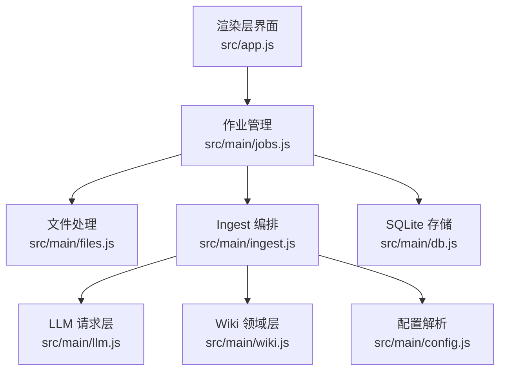
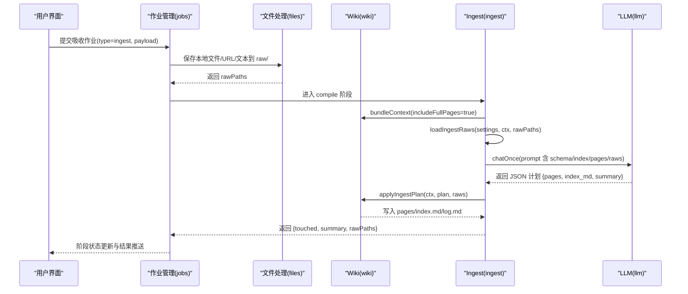
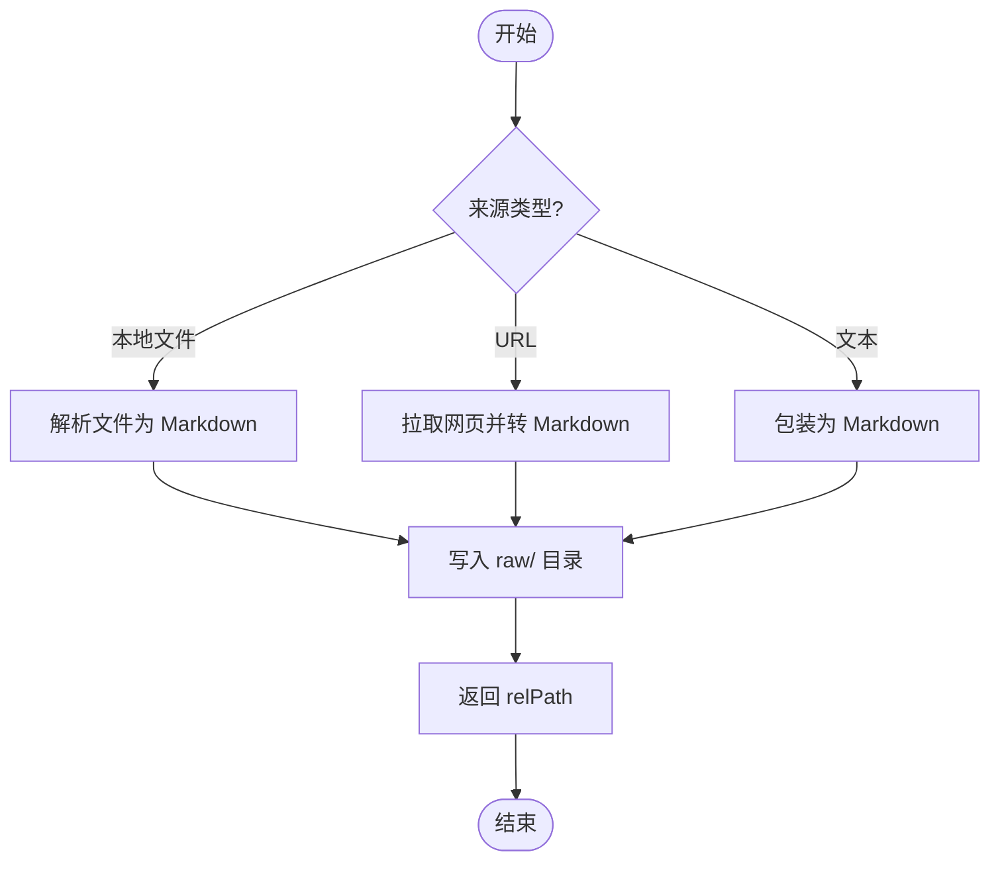
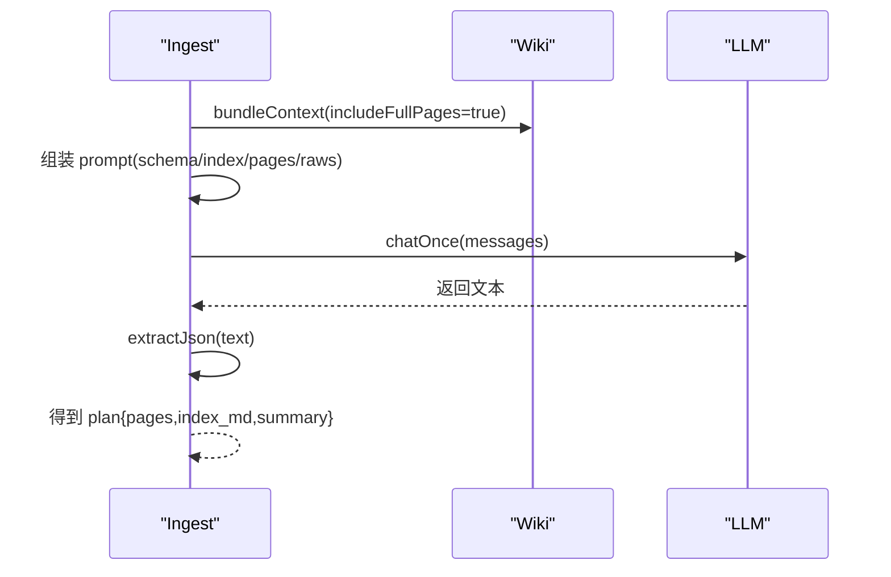
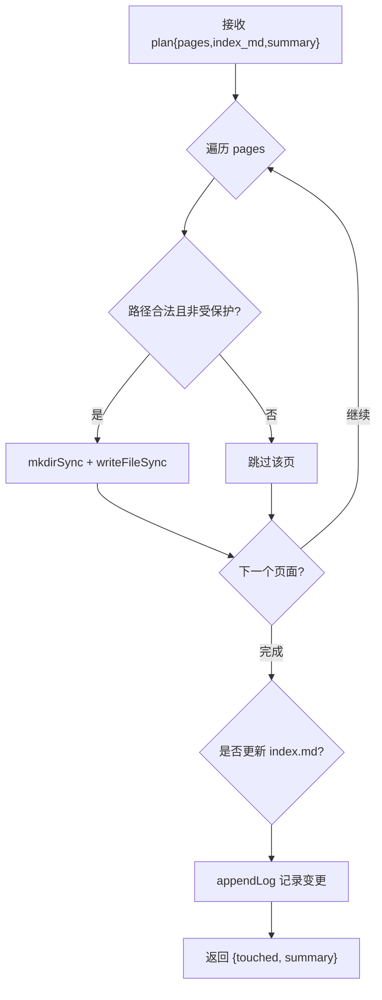
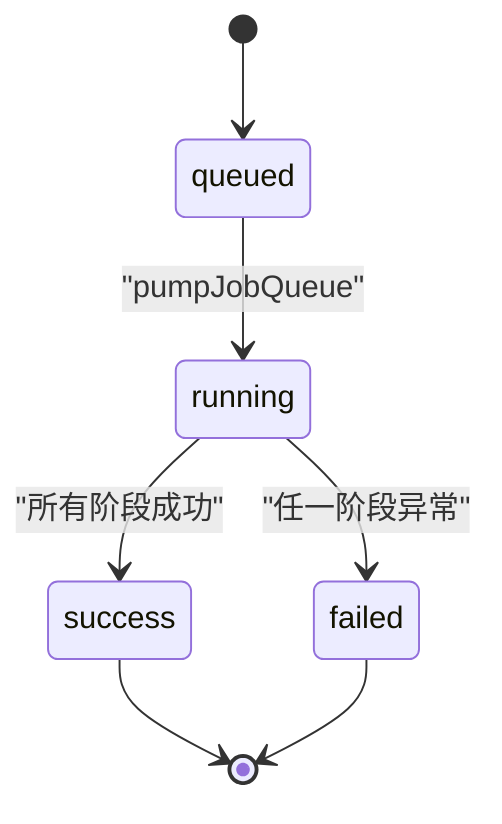
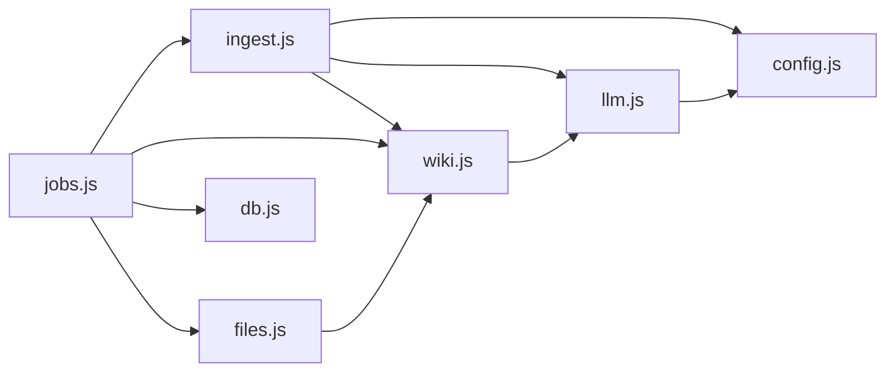

# Ingest 编排模块

<cite>
**本文引用的文件**
- [src/main/ingest.js](file://src/main/ingest.js)
- [src/main/jobs.js](file://src/main/jobs.js)
- [src/main/files.js](file://src/main/files.js)
- [src/main/wiki.js](file://src/main/wiki.js)
- [src/main/llm.js](file://src/main/llm.js)
- [src/main/config.js](file://src/main/config.js)
- [src/main/db.js](file://src/main/db.js)
- [src/app.js](file://src/app.js)
- [package.json](file://package.json)
</cite>

## 目录
1. [简介](#简介)
2. [项目结构](#项目结构)
3. [核心组件](#核心组件)
4. [架构总览](#架构总览)
5. [详细组件分析](#详细组件分析)
6. [依赖关系分析](#依赖关系分析)
7. [性能考量](#性能考量)
8. [故障排查指南](#故障排查指南)
9. [结论](#结论)
10. [附录：API 与扩展指南](#附录api-与扩展指南)

## 简介
本模块负责“知识吸收”的完整工作流：从来源识别、内容提取，到 AI 编译页面计划，再到落盘更新 Wiki。它通过作业系统串行执行，提供阶段状态上报、失败重试与历史持久化能力，并与文件处理模块、Wiki 模块、LLM 请求层紧密协作，形成稳定可靠的知识入库流水线。

## 项目结构
Ingest 编排位于主进程，围绕 jobs（作业调度）、ingest（编排逻辑）、files（来源解析与保存）、wiki（上下文打包与落盘工具）、llm（AI 调用）五个核心模块协同完成。渲染层 app.js 提供用户交互入口，将吸收任务以作业形式提交并展示进度。

图表来源
- [src/main/jobs.js:123-188](file://src/main/jobs.js#L123-L188)
- [src/main/ingest.js:1-84](file://src/main/ingest.js#L1-L84)
- [src/main/files.js:76-99](file://src/main/files.js#L76-L99)
- [src/main/wiki.js:116-134](file://src/main/wiki.js#L116-L134)
- [src/main/llm.js:81-110](file://src/main/llm.js#L81-L110)
- [src/main/db.js:288-355](file://src/main/db.js#L288-L355)

章节来源
- [src/main/jobs.js:1-260](file://src/main/jobs.js#L1-L260)
- [src/main/ingest.js:1-84](file://src/main/ingest.js#L1-L84)
- [src/main/files.js:1-102](file://src/main/files.js#L1-L102)
- [src/main/wiki.js:1-313](file://src/main/wiki.js#L1-L313)
- [src/main/llm.js:1-123](file://src/main/llm.js#L1-L123)
- [src/main/config.js:1-18](file://src/main/config.js#L1-L18)
- [src/main/db.js:1-358](file://src/main/db.js#L1-L358)
- [src/app.js:680-781](file://src/app.js#L680-L781)
- [package.json:36-43](file://package.json#L36-L43)

## 核心组件
- 作业管理（jobs.js）：定义作业类型、阶段、队列执行器、重试与持久化；对外暴露 submit/list/remove/clear/retry。
- Ingest 编排（ingest.js）：三步流程——加载原始来源、AI 编译页面计划、应用计划落盘；输出 touched 页面与摘要。
- 文件处理（files.js）：解析 PDF/DOCX/XLSX/PPTX/文本等格式为 Markdown，保存到 raw/ 目录。
- Wiki 领域（wiki.js）：构建上下文（schema/index/pagesBlock）、保存原始来源（URL/文本）、追加日志、体检报告生成。
- LLM 请求（llm.js）：统一以流式方式调用 OpenAI 兼容接口，内置可重试策略与 JSON 提取。
- 配置（config.js）：数值/枚举配置的安全读取与钳制。
- 数据库（db.js）：作业历史、设置、笔记等数据的 SQLite 持久化与迁移。

章节来源
- [src/main/jobs.js:100-188](file://src/main/jobs.js#L100-L188)
- [src/main/ingest.js:8-84](file://src/main/ingest.js#L8-L84)
- [src/main/files.js:22-99](file://src/main/files.js#L22-L99)
- [src/main/wiki.js:116-191](file://src/main/wiki.js#L116-L191)
- [src/main/llm.js:81-120](file://src/main/llm.js#L81-L120)
- [src/main/config.js:5-15](file://src/main/config.js#L5-L15)
- [src/main/db.js:288-355](file://src/main/db.js#L288-L355)

## 架构总览
Ingest 编排采用“作业 + 阶段”的状态机模型，确保多步骤长耗时任务的可视化与可恢复性。

图表来源
- [src/main/jobs.js:136-175](file://src/main/jobs.js#L136-L175)
- [src/main/ingest.js:22-82](file://src/main/ingest.js#L22-L82)
- [src/main/wiki.js:116-134](file://src/main/wiki.js#L116-L134)
- [src/main/llm.js:81-110](file://src/main/llm.js#L81-L110)

## 详细组件分析

### 来源处理流程（解析与保存）
- 支持的文件格式由 files.js 维护，使用 pdf-parse、mammoth、xlsx、jszip 等库解析二进制文档为 Markdown。
- saveFileSource 将解析后的内容包装为带元信息的 Markdown，按日期+slugify 命名存入 raw/，并返回相对路径。
- URL/文本来源由 wiki.saveRawSource 拉取网页或拼接文本，同样落盘到 raw/。

图表来源
- [src/main/files.js:22-99](file://src/main/files.js#L22-L99)
- [src/main/wiki.js:154-191](file://src/main/wiki.js#L154-L191)

章节来源
- [src/main/files.js:1-102](file://src/main/files.js#L1-L102)
- [src/main/wiki.js:154-191](file://src/main/wiki.js#L154-L191)

### AI 编译页面计划
- ingest.compileIngestPlan 构造提示词，包含 AGENTS.md 模式、当前 index.md、全量页面块与所有 raw 来源，要求模型输出 JSON 计划：新增/覆盖的 pages、更新后的 index.md、中文摘要。
- llm.chatOnce 以流式方式调用，内部累积全文后返回；extractJson 容忍代码块包裹，提取 JSON 对象。
- 若模型返回非法 JSON，抛出错误供上层捕获。

图表来源
- [src/main/ingest.js:22-62](file://src/main/ingest.js#L22-L62)
- [src/main/llm.js:81-120](file://src/main/llm.js#L81-L120)
- [src/main/wiki.js:116-134](file://src/main/wiki.js#L116-L134)

章节来源
- [src/main/ingest.js:22-62](file://src/main/ingest.js#L22-L62)
- [src/main/llm.js:81-120](file://src/main/llm.js#L81-L120)

### 落盘操作与结果验证
- ingest.applyIngestPlan 遍历 plan.pages，过滤非法路径与受保护文件（index.md、log.md），写入对应 .md 文件；同时更新 index.md 并追加日志条目。
- 返回 touched 列表与摘要，便于作业阶段状态与结果展示。
- 安全校验：safeJoin 防止路径逃逸出 wiki 根目录。

图表来源
- [src/main/ingest.js:64-82](file://src/main/ingest.js#L64-L82)
- [src/main/wiki.js:136-151](file://src/main/wiki.js#L136-L151)
- [src/main/wiki.js:27-33](file://src/main/wiki.js#L27-L33)

章节来源
- [src/main/ingest.js:64-82](file://src/main/ingest.js#L64-L82)
- [src/main/wiki.js:136-151](file://src/main/wiki.js#L136-L151)

### 作业管理与阶段状态机
- 作业类型：ingest（吸收）、lint（体检）。每个作业包含 stages（如 save/compile/write），状态在运行期推进并持久化。
- pumpJobQueue 串行执行，避免并发写冲突；异常时标记 failed，并记录错误信息。
- retry 对 ingest 复用已保存的 rawPaths 跳过解析阶段，仅重新编译与落盘。

图表来源
- [src/main/jobs.js:72-98](file://src/main/jobs.js#L72-L98)
- [src/main/jobs.js:100-121](file://src/main/jobs.js#L100-L121)
- [src/main/jobs.js:236-257](file://src/main/jobs.js#L236-L257)

章节来源
- [src/main/jobs.js:72-188](file://src/main/jobs.js#L72-L188)
- [src/main/jobs.js:236-257](file://src/main/jobs.js#L236-L257)

### 与文件处理、Wiki、作业系统的协作
- 文件处理：负责多格式解析与 raw/ 落盘，为 Ingest 提供标准化来源。
- Wiki：提供上下文打包、日志追加、URL/文本来源保存、体检报告生成。
- 作业系统：串联上述模块，管理生命周期、状态上报、重试与历史。

章节来源
- [src/main/files.js:76-99](file://src/main/files.js#L76-L99)
- [src/main/wiki.js:116-191](file://src/main/wiki.js#L116-L191)
- [src/main/jobs.js:136-188](file://src/main/jobs.js#L136-L188)

## 依赖关系分析
- ingest.js 依赖 llm.js（chatOnce/extractJson）、wiki.js（safeJoin/readIfExists/appendLog）、config.js（num）。
- jobs.js 依赖 files.js、wiki.js、ingest.js、db.js、config.js。
- files.js 依赖 wiki.js（wikiRoot/slugify/uniquePath）。
- wiki.js 依赖 llm.js（chatOnce/streamChat/extractJson）、config.js。
- llm.js 依赖 config.js。
- db.js 独立持久化层，被 jobs.js 调用。

图表来源
- [src/main/ingest.js:1-84](file://src/main/ingest.js#L1-L84)
- [src/main/jobs.js:1-260](file://src/main/jobs.js#L1-L260)
- [src/main/files.js:1-102](file://src/main/files.js#L1-L102)
- [src/main/wiki.js:1-313](file://src/main/wiki.js#L1-L313)
- [src/main/llm.js:1-123](file://src/main/llm.js#L1-L123)
- [src/main/config.js:1-18](file://src/main/config.js#L1-L18)
- [src/main/db.js:1-358](file://src/main/db.js#L1-L358)

章节来源
- [src/main/ingest.js:1-84](file://src/main/ingest.js#L1-L84)
- [src/main/jobs.js:1-260](file://src/main/jobs.js#L1-L260)
- [src/main/files.js:1-102](file://src/main/files.js#L1-L102)
- [src/main/wiki.js:1-313](file://src/main/wiki.js#L1-L313)
- [src/main/llm.js:1-123](file://src/main/llm.js#L1-L123)
- [src/main/config.js:1-18](file://src/main/config.js#L1-L18)
- [src/main/db.js:1-358](file://src/main/db.js#L1-L358)

## 性能考量
- 超长来源截断：loadIngestRaws 根据 sourceMaxChars 限制输入大小，避免提示词爆炸。
- 流式 LLM 调用：chatOnce/streamChat 使用 SSE 流，减少网关超时风险并提升响应体验。
- 串行作业：避免并发写 Wiki 文件导致竞争条件。
- 批量上下文：bundleContext 按需包含 full pages，控制上下文体积。
- 文件解析优化：PDF/DOCX/XLSX/PPTX 使用专用库高效转换。

[本节为通用性能建议，不直接分析具体文件]

## 故障排查指南
- 模型返回无法解析 JSON：检查模型输出是否符合预期，必要时调整提示词或重试次数（chatRetries）。
- 网络/接口错误：llm.js 对 5xx/空返回进行可重试处理；4xx 客户端错误直接抛出，需检查 API Key、模型名、baseUrl。
- 文件解析失败：确认文件格式在支持列表中；PDF/DOCX/XLSX/PPTX 需要相应依赖。
- 路径安全问题：safeJoin 会拒绝逃逸路径，检查传入的 relPath 是否合法。
- 作业中断恢复：应用重启会将 running/queued 的作业标记为 failed，可通过 retry 重新执行。

章节来源
- [src/main/llm.js:81-110](file://src/main/llm.js#L81-L110)
- [src/main/files.js:76-99](file://src/main/files.js#L76-L99)
- [src/main/wiki.js:27-33](file://src/main/wiki.js#L27-L33)
- [src/main/jobs.js:25-43](file://src/main/jobs.js#L25-L43)
- [src/main/jobs.js:236-257](file://src/main/jobs.js#L236-L257)

## 结论
Ingest 编排模块通过作业系统与阶段状态机，将来源处理、AI 编译与落盘操作解耦为可观测、可重试、可恢复的流程。结合文件处理与 Wiki 领域能力，实现了稳定的知识吸收流水线，并为后续扩展（如自定义来源处理器、更多页面类型）提供了清晰边界。

[本节为总结性内容，不直接分析具体文件]

## 附录：API 与扩展指南

### 作业 API（主进程导出）
- 提交作业
  - 方法：submit({ type, payload })
  - 类型：'ingest' | 'lint'
  - ingest payload：{ settings, files[], url?, text?, title? }
  - lint payload：{ settings }
  - 返回：{ ok, id? | error? }
- 查询作业：list() → 作业数组
- 删除作业：remove(id) → { ok, error? }
- 清空历史：clear() → { ok }
- 重试失败：retry({ id, settings }) → { ok, id? | error? }

章节来源
- [src/main/jobs.js:196-257](file://src/main/jobs.js#L196-L257)

### 渲染层集成（IPC）
- 提交吸收：window.kb.jobsSubmit({ type: 'ingest', payload })
- 监听作业更新：window.kb.onJobsUpdate(callback)
- 监听 AI 流：window.kb.onAiChunk/onAiDone/onAiError
- 打开 Wiki 页面：window.kb.wikiRead({ settings, relPath })
- 描述 Wiki：window.kb.wikiDescribe({ settings })

章节来源
- [src/app.js:680-781](file://src/app.js#L680-L781)

### 错误处理策略与重试机制
- LLM 层：对网络异常、5xx、空返回进行可重试（默认次数来自 settings.chatRetries），4xx 不重试。
- 作业层：运行中异常标记 failed，记录错误信息；应用重启将未完成作业置为 failed。
- 重试策略：ingest 重试复用 rawPaths，跳过解析阶段；lint 直接重新提交。

章节来源
- [src/main/llm.js:81-110](file://src/main/llm.js#L81-L110)
- [src/main/jobs.js:72-98](file://src/main/jobs.js#L72-L98)
- [src/main/jobs.js:236-257](file://src/main/jobs.js#L236-L257)

### 回滚方案
- 落盘前校验：applyIngestPlan 过滤非法路径与受保护文件，避免误写。
- 原子写入：db.js 使用临时文件 + rename 实现原子落盘，降低损坏风险。
- 日志追踪：每次吸收写入 log.md，便于回溯与审计。

章节来源
- [src/main/ingest.js:64-82](file://src/main/ingest.js#L64-L82)
- [src/main/db.js:180-187](file://src/main/db.js#L180-L187)
- [src/main/wiki.js:136-151](file://src/main/wiki.js#L136-L151)

### 自定义来源处理器扩展指南
- 扩展点：files.extractFileContent 与 wiki.saveRawSource
- 最佳实践：
  - 保持输入为 Markdown 字符串，便于统一处理。
  - 文件名遵循 date-slugify.md 规范，避免冲突。
  - 对超大内容做截断或分页，避免内存压力。
  - 错误信息明确，便于上层捕获与重试。
- 集成方式：在 jobs.ingest 的 save 阶段调用新的保存函数，并将 relPath 加入 rawPaths。

章节来源
- [src/main/files.js:22-99](file://src/main/files.js#L22-L99)
- [src/main/wiki.js:154-191](file://src/main/wiki.js#L154-L191)
- [src/main/jobs.js:136-175](file://src/main/jobs.js#L136-L175)

### 依赖与外部服务
- 依赖库：pdf-parse、mammoth、xlsx、jszip、turndown、sql.js
- LLM 服务：OpenAI 兼容接口（baseUrl/model/apiKey 由 settings 配置）

章节来源
- [package.json:36-43](file://package.json#L36-L43)
- [src/main/llm.js:40-77](file://src/main/llm.js#L40-L77)