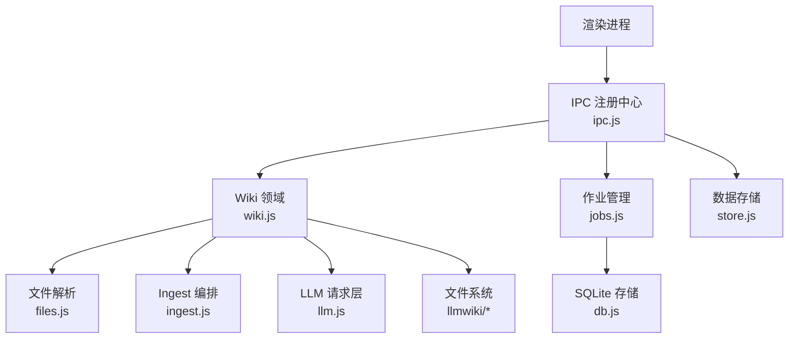
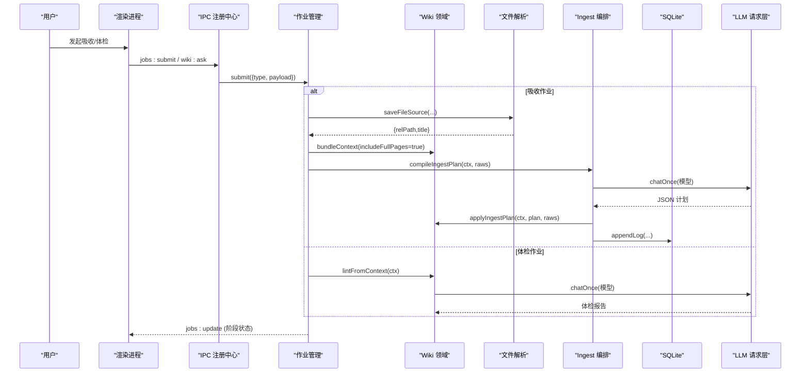
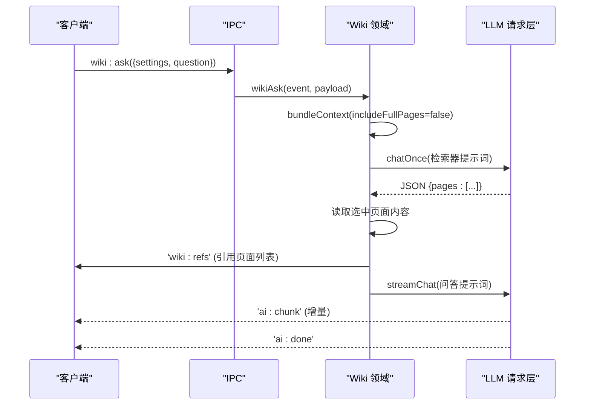
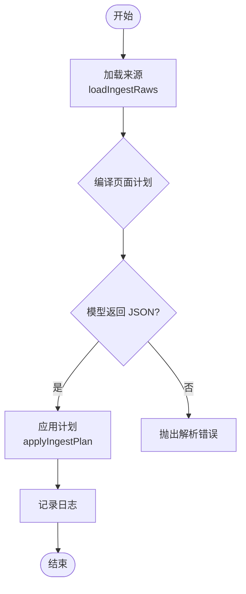
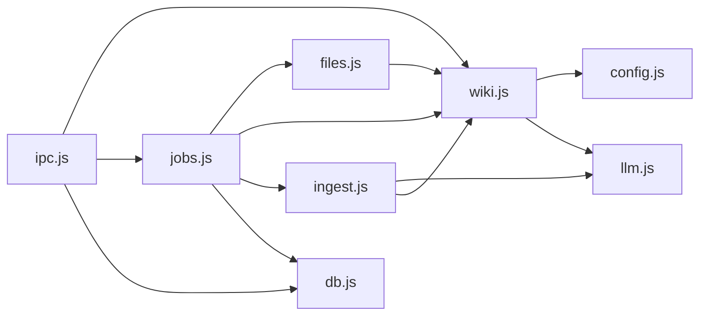

# Wiki 领域模块

<cite>
**本文引用的文件**
- [src/main/wiki.js](file://src/main/wiki.js)
- [src/main/files.js](file://src/main/files.js)
- [src/main/ingest.js](file://src/main/ingest.js)
- [src/main/jobs.js](file://src/main/jobs.js)
- [src/main/db.js](file://src/main/db.js)
- [src/main/config.js](file://src/main/config.js)
- [src/main/llm.js](file://src/main/llm.js)
- [src/main/ipc.js](file://src/main/ipc.js)
- [package.json](file://package.json)
- [llmwiki/wiki/index.md](file://llmwiki/wiki/index.md)
- [llmwiki/wiki/log.md](file://llmwiki/wiki/log.md)
- [llmwiki/raw/2026-08-08-llm-wiki-karpathy.md](file://llmwiki/raw/2026-08-08-llm-wiki-karpathy.md)
</cite>

## 目录
1. [简介](#简介)
2. [项目结构](#项目结构)
3. [核心组件](#核心组件)
4. [架构总览](#架构总览)
5. [详细组件分析](#详细组件分析)
6. [依赖关系分析](#依赖关系分析)
7. [性能考量](#性能考量)
8. [故障排查指南](#故障排查指南)
9. [结论](#结论)
10. [附录：API 参考与最佳实践](#附录api-参考与最佳实践)

## 简介
本模块围绕“Wiki 领域”展开，提供知识库根目录管理、页面读取与描述、上下文打包检索、问答回填、体检（Lint）与健康检查算法等能力。系统以文件系统为事实源（raw/ 原始来源 + wiki/ 结构化知识），通过 LLM 进行编排与生成，借助 SQLite 持久化作业历史与应用数据，并通过 IPC 暴露统一 API 给渲染层调用。

## 项目结构
- 文件系统
  - llmwiki/raw：原始来源（网页抓取或本地文件解析后的 Markdown）
  - llmwiki/wiki：结构化知识（concepts/sources/topics/entities 等目录 + index.md/log.md）
  - AGENTS.md：模式文档（约定 frontmatter、目录规范、工作流）
- 主进程模块
  - wiki.js：Wiki 领域核心（根目录、页面读写、上下文打包、问答、回填、体检）
  - files.js：本地文件解析与保存（PDF/DOCX/XLSX/PPTX/文本 → Markdown）
  - ingest.js：Ingest 编排（读来源 → AI 编译页面计划 → 落盘）
  - jobs.js：作业队列与状态机（串行执行、阶段上报、重试、历史持久化）
  - db.js：SQLite 存储（笔记/目录/设置/作业历史）
  - config.js：配置解析工具（数值钳制、枚举选择）
  - llm.js：LLM 请求层（SSE 流式、重试、JSON 提取）
  - ipc.js：IPC 注册中心（对外 API 路由）

图表来源
- [src/main/ipc.js:12-109](file://src/main/ipc.js#L12-L109)
- [src/main/wiki.js:1-313](file://src/main/wiki.js#L1-L313)
- [src/main/jobs.js:1-260](file://src/main/jobs.js#L1-L260)
- [src/main/db.js:1-358](file://src/main/db.js#L1-L358)

章节来源
- [src/main/ipc.js:12-109](file://src/main/ipc.js#L12-L109)
- [src/main/wiki.js:1-313](file://src/main/wiki.js#L1-L313)
- [src/main/jobs.js:1-260](file://src/main/jobs.js#L1-L260)
- [src/main/db.js:1-358](file://src/main/db.js#L1-L358)

## 核心组件
- Wiki 领域（wiki.js）
  - 根目录定位与安全路径拼接
  - 页面读取与描述（frontmatter 解析、目录遍历）
  - 上下文打包（index.md + 页面清单 + 可选全文）
  - 问答流程（两步检索 + 流式合成）
  - 问答回填（归档 Answer 页并更新索引）
  - 体检（lint）与健康检查（AI 审查报告）
- 文件解析（files.js）
  - 多格式解析（PDF/DOCX/XLSX/PPTX/文本）→ Markdown
  - 保存到 raw/ 并返回相对路径
- Ingest 编排（ingest.js）
  - 加载来源（截断超长内容）
  - 编译页面计划（AI 输出 JSON）
  - 应用计划（写页面、更新 index.md、记录日志）
- 作业管理（jobs.js）
  - 串行队列、阶段状态机、历史持久化
  - 吸收作业（ingest）与体检作业（lint）
  - 重试机制（复用已保存的 raw/ 来源）
- 存储（db.js）
  - SQLite 初始化、迁移、原子落盘
  - 笔记/目录/设置 KV、作业历史
- LLM 请求层（llm.js）
  - SSE 流式消费、错误分类与重试
  - chatOnce（内部累积全文）、streamChat（增量推送）
  - extractJson（容错提取 JSON）
- 配置（config.js）
  - num/pick 工具函数，统一参数校验与默认值

章节来源
- [src/main/wiki.js:1-313](file://src/main/wiki.js#L1-L313)
- [src/main/files.js:1-102](file://src/main/files.js#L1-L102)
- [src/main/ingest.js:1-85](file://src/main/ingest.js#L1-L85)
- [src/main/jobs.js:1-260](file://src/main/jobs.js#L1-L260)
- [src/main/db.js:1-358](file://src/main/db.js#L1-L358)
- [src/main/llm.js:1-123](file://src/main/llm.js#L1-L123)
- [src/main/config.js:1-18](file://src/main/config.js#L1-L18)

## 架构总览
系统采用“文件系统 + SQLite + LLM”的混合架构：
- 文件系统作为事实源与产物载体（raw/ 不可变来源，wiki/ 可维护知识）
- SQLite 用于应用数据与作业历史的持久化
- LLM 负责编排与生成（页面计划、问答、体检报告）
- IPC 作为统一入口，将业务逻辑委托到各模块

图表来源
- [src/main/jobs.js:136-188](file://src/main/jobs.js#L136-L188)
- [src/main/ingest.js:22-82](file://src/main/ingest.js#L22-L82)
- [src/main/wiki.js:117-134](file://src/main/wiki.js#L117-L134)
- [src/main/llm.js:81-120](file://src/main/llm.js#L81-L120)

## 详细组件分析

### Wiki 根目录管理与安全
- 根目录定位策略：优先使用应用目录下的 llmwiki，其次回退到用户文档目录；若存在 AGENTS.md 则视为有效根
- 安全路径拼接：禁止路径逃逸出指定根目录，避免任意文件读取风险
- 辅助工具：readIfExists、slugify、uniquePath 保证写入唯一性与命名规范

章节来源
- [src/main/wiki.js:10-33](file://src/main/wiki.js#L10-L33)
- [src/main/wiki.js:39-57](file://src/main/wiki.js#L39-L57)

### 页面读取与描述
- readPage：支持 raw/ 与 wiki/ 两种路径语义，统一安全拼接后读取
- describeWiki：扫描 wiki/ 下所有 .md，解析 frontmatter，构建页面清单；同时读取 index.md、log.md 与 schema（AGENTS.md）
- 轻量 frontmatter 解析：仅提取 type/title/description/status/tags 等常用字段，便于列表展示与筛选

章节来源
- [src/main/wiki.js:84-114](file://src/main/wiki.js#L84-L114)
- [src/main/wiki.js:60-72](file://src/main/wiki.js#L60-L72)

### 上下文打包与日志
- bundleContext：组装 schema、indexContent、页面清单 listing、可选 pagesBlock（全文）
- appendLog：按日期分组追加条目，精确匹配标题行避免误插

章节来源
- [src/main/wiki.js:117-151](file://src/main/wiki.js#L117-L151)

### 来源保存（网页/文本/本地文件）
- saveRawSource：支持 URL 拉取（带超时控制）与纯文本输入，转换为 Markdown 并保存到 raw/
- saveFileSource：解析 PDF/DOCX/XLSX/PPTX/文本等格式，转为 Markdown 并保存到 raw/
- 文件名生成：基于日期与 slugify 标题，确保唯一性

章节来源
- [src/main/wiki.js:154-191](file://src/main/wiki.js#L154-L191)
- [src/main/files.js:22-99](file://src/main/files.js#L22-L99)

### 问答流程（两步检索 + 流式合成）
- 第一步：基于 index.md 与页面清单，让模型选出最相关的若干页面（最多 N 个）
- 第二步：加载选中页面内容，构造上下文，流式合成回答，并通过事件推送引用页面
- 失败回退：若无选中页面，回退到 index.md

图表来源
- [src/main/wiki.js:194-233](file://src/main/wiki.js#L194-L233)
- [src/main/llm.js:40-77](file://src/main/llm.js#L40-L77)

章节来源
- [src/main/wiki.js:194-233](file://src/main/wiki.js#L194-L233)
- [src/main/llm.js:40-77](file://src/main/llm.js#L40-L77)

### 问答回填（归档 Answer 页）
- fileAnswer：生成 topics/answer-{timestamp}.md，包含 frontmatter（type: Answer）与问题/回答正文
- 更新 index.md：在主题小节插入新条目
- 记录日志：appendLog 记录回填操作

章节来源
- [src/main/wiki.js:236-270](file://src/main/wiki.js#L236-L270)

### 体检功能与健康检查算法
- lintWiki/lintFromContext：收集全库上下文（schema + index + 全部页面），调用模型执行健康检查
- 检查项：页面矛盾、陈旧论断、孤儿页、频繁提及但无独立页面的概念、缺失交叉引用、frontmatter 不合规、值得补充的来源或新问题
- 输出：Markdown 格式的体检报告

章节来源
- [src/main/wiki.js:272-296](file://src/main/wiki.js#L272-L296)

### Ingest 编排（吸收作业）
- loadIngestRaws：读取 raw/ 来源，超长内容截断以避免提示词爆炸
- compileIngestPlan：向模型提交 schema、index、现有页面与来源，要求输出 JSON 计划（新增/更新页面、更新 index.md、摘要）
- applyIngestPlan：根据计划写页面、更新 index.md、记录日志

图表来源
- [src/main/ingest.js:8-82](file://src/main/ingest.js#L8-L82)

章节来源
- [src/main/ingest.js:8-82](file://src/main/ingest.js#L8-L82)

### 作业系统与异步处理
- 串行队列：避免并发写冲突，保证 wiki 一致性
- 阶段状态机：每个作业定义多个阶段（如 save/compile/write），实时上报状态
- 历史持久化：作业历史存入 SQLite，支持查看、删除、清空、重试
- 重试机制：ingest 作业重试时复用已保存的 raw/ 来源，跳过解析阶段

章节来源
- [src/main/jobs.js:1-260](file://src/main/jobs.js#L1-L260)

### 数据存储与迁移
- SQLite 初始化：加载 WASM，创建表结构，迁移旧 JSON 数据
- 原子落盘：整体导出到临时文件再 rename，避免损坏
- 指针文件：支持切换数据库位置，恢复默认时自动备份旧文件

章节来源
- [src/main/db.js:12-81](file://src/main/db.js#L12-L81)
- [src/main/db.js:92-187](file://src/main/db.js#L92-L187)

## 依赖关系分析
- wiki.js 依赖：config.js（配置）、llm.js（LLM 调用）、fs/path（文件系统）
- files.js 依赖：wiki.js（路径工具）、turndown/mammoth/xlsx/pdf-parse/jszip（格式解析）
- ingest.js 依赖：llm.js、wiki.js、config.js
- jobs.js 依赖：files.js、wiki.js、ingest.js、db.js、config.js
- db.js 依赖：sql.js（WASM）、fs/path
- llm.js 依赖：config.js
- ipc.js 依赖：以上所有模块，作为统一入口

图表来源
- [src/main/wiki.js:1-313](file://src/main/wiki.js#L1-L313)
- [src/main/files.js:1-102](file://src/main/files.js#L1-L102)
- [src/main/ingest.js:1-85](file://src/main/ingest.js#L1-L85)
- [src/main/jobs.js:1-260](file://src/main/jobs.js#L1-L260)
- [src/main/db.js:1-358](file://src/main/db.js#L1-L358)
- [src/main/llm.js:1-123](file://src/main/llm.js#L1-L123)
- [src/main/ipc.js:12-109](file://src/main/ipc.js#L12-L109)

章节来源
- [src/main/wiki.js:1-313](file://src/main/wiki.js#L1-L313)
- [src/main/files.js:1-102](file://src/main/files.js#L1-L102)
- [src/main/ingest.js:1-85](file://src/main/ingest.js#L1-L85)
- [src/main/jobs.js:1-260](file://src/main/jobs.js#L1-L260)
- [src/main/db.js:1-358](file://src/main/db.js#L1-L358)
- [src/main/llm.js:1-123](file://src/main/llm.js#L1-L123)
- [src/main/ipc.js:12-109](file://src/main/ipc.js#L12-L109)

## 性能考量
- 流式响应：LLM 请求统一使用 stream:true，避免网关超时，提升交互体验
- 内容截断：sourceMaxChars 限制来源长度，防止提示词爆炸
- 原子落盘：SQLite 整体导出 + 临时文件 rename，降低损坏风险
- 串行作业：避免并发写冲突，保证 wiki 一致性
- 缓存优化：bundleContext 可控制 includeFullPages，减少不必要的全量传输

[本节为通用指导，无需特定文件引用]

## 故障排查指南
- 网络/接口错误：llm.js 对 4xx 直接报错，5xx/网络异常/空返回触发重试
- 文件不存在：files.js 与 wiki.js 在读取前检查存在性，抛出明确错误
- 路径安全：safeJoin 阻止路径逃逸，非法路径立即报错
- 作业失败：jobs.js 记录错误信息到阶段 detail，支持重试
- 数据库迁移：db.js 自动迁移旧 JSON 文件，失败保留原文件

章节来源
- [src/main/llm.js:81-120](file://src/main/llm.js#L81-L120)
- [src/main/files.js:77-99](file://src/main/files.js#L77-L99)
- [src/main/wiki.js:27-33](file://src/main/wiki.js#L27-L33)
- [src/main/jobs.js:83-98](file://src/main/jobs.js#L83-L98)
- [src/main/db.js:152-177](file://src/main/db.js#L152-L177)

## 结论
Wiki 领域模块以文件系统为核心，结合 LLM 编排与 SQLite 持久化，实现了从原始来源吸收到结构化知识维护的完整闭环。通过 IPC 暴露统一 API，支持问答、回填、体检等高频场景。系统设计注重安全性、一致性与可维护性，适合个人知识库的持续演进。

[本节为总结，无需特定文件引用]

## 附录：API 参考与最佳实践

### IPC 接口一览
- data:load / data:save / app:getDataPath：应用数据存储
- data:setDbPath：切换 SQLite 文件位置
- dialog:export：导出文件对话框
- ai:ask：流式 AI 对话
- wiki:defaultRoot：获取默认 Wiki 根目录
- wiki:describe：描述 Wiki（存在性、根目录、schema、index、日志、页面清单）
- wiki:read：读取页面内容（支持 raw/ 与 wiki/）
- wiki:pickFiles：选择本地文件（过滤扩展名）
- wiki:ask：Wiki 问答（两步检索 + 流式合成）
- wiki:fileAnswer：问答回填（归档 Answer 页）
- jobs:list / jobs:submit / jobs:remove / jobs:clear / jobs:retry：作业管理

章节来源
- [src/main/ipc.js:12-109](file://src/main/ipc.js#L12-L109)

### 文件系统约定
- llmwiki/raw：原始来源（不可变）
- llmwiki/wiki：结构化知识（可维护）
  - concepts/：概念页
  - sources/：来源摘要页
  - topics/：主题综合页与归档问答
  - entities/：实体页
  - index.md：目录索引
  - log.md：更新日志
- AGENTS.md：模式文档（frontmatter、目录规范、工作流）

章节来源
- [llmwiki/wiki/index.md:1-28](file://llmwiki/wiki/index.md#L1-L28)
- [llmwiki/wiki/log.md:1-11](file://llmwiki/wiki/log.md#L1-L11)
- [llmwiki/raw/2026-08-08-llm-wiki-karpathy.md:1-76](file://llmwiki/raw/2026-08-08-llm-wiki-karpathy.md#L1-L76)

### 最佳实践
- 保持 AGENTS.md 与 OKF v0.2 frontmatter 一致，确保 LLM 行为稳定
- 定期运行体检作业，发现矛盾、陈旧论断与孤儿页
- 控制 sourceMaxChars 与 urlFetchTimeout，避免资源浪费与挂起
- 使用 jobs 重试机制，快速恢复失败作业
- 利用 index.md 与 log.md 导航与审计知识库演化

[本节为通用指导，无需特定文件引用]