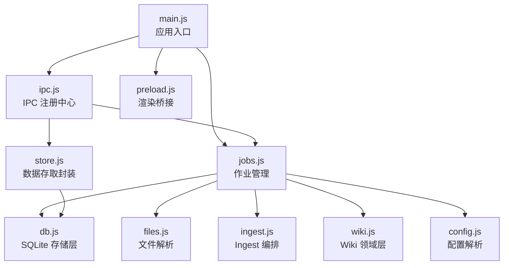
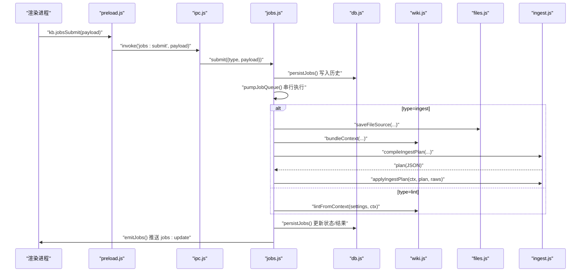
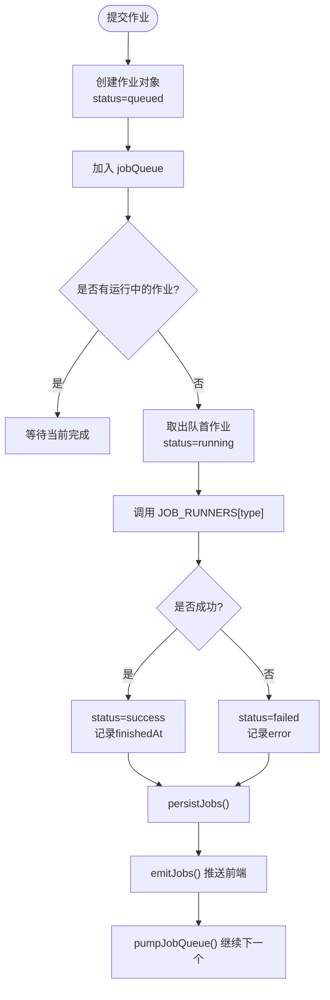
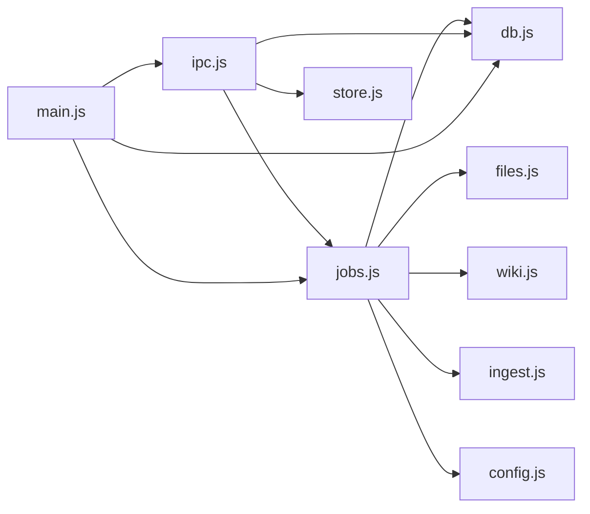

# 作业管理系统

<cite>
**本文引用的文件**
- [main.js](file://main.js)
- [preload.js](file://preload.js)
- [src/main/ipc.js](file://src/main/ipc.js)
- [src/main/jobs.js](file://src/main/jobs.js)
- [src/main/db.js](file://src/main/db.js)
- [src/main/store.js](file://src/main/store.js)
- [src/main/config.js](file://src/main/config.js)
- [src/main/files.js](file://src/main/files.js)
- [src/main/ingest.js](file://src/main/ingest.js)
- [src/main/wiki.js](file://src/main/wiki.js)
</cite>

## 目录
1. [简介](#简介)
2. [项目结构](#项目结构)
3. [核心组件](#核心组件)
4. [架构总览](#架构总览)
5. [详细组件分析](#详细组件分析)
6. [依赖关系分析](#依赖关系分析)
7. [性能考量](#性能考量)
8. [故障诊断与排错指南](#故障诊断与排错指南)
9. [结论](#结论)
10. [附录：API 参考](#附录api-参考)

## 简介
本技术文档围绕“作业管理系统”展开，重点解释以下能力：
- 串行队列执行：确保同一时间仅一个作业运行，避免并发写 Wiki 文件冲突。
- 阶段状态机管理：每个作业由多个阶段组成，阶段有明确的状态转换与进度上报。
- 作业历史持久化：通过 SQLite（sql.js）持久化作业历史，支持应用重启后恢复终态、清理与重试。
- 作业生命周期管理：从提交、排队、运行到成功/失败的全流程控制。
- 任务调度算法：基于 FIFO 队列的串行调度器，自动推进下一个作业。
- 并发控制策略：全局运行锁 runningJobId + 队列指针 jobQueue，保证严格串行。
- 状态转换、进度跟踪与错误恢复：阶段级状态更新、异常捕获、失败标记与重试机制。
- API 接口：作业提交、查询、删除、清空、重试等 IPC 接口说明。
- 扩展机制：作业类型注册、执行器模式、回调处理模式。
- 性能监控、资源管理与故障诊断：日志落盘、超时控制、内存剥离 payload 等。
- 调试工具与日志分析：开发工具打开方式、日志位置与关键线索。

## 项目结构
系统采用 Electron 主进程模块化设计，职责清晰：
- main.js：应用入口，负责窗口创建、模块装配与生命周期。
- src/main/ipc.js：IPC 注册中心，统一暴露前端可调用接口。
- src/main/jobs.js：作业管理核心，包含队列、状态机、执行器与持久化协调。
- src/main/db.js：SQLite 存储层，持久化笔记、设置与作业历史。
- src/main/store.js：数据存取封装（底层为 db.js）。
- src/main/config.js：配置解析辅助（数值钳制、枚举选择）。
- src/main/files.js：本地文件解析与保存至 raw/。
- src/main/ingest.js：Ingest 编排（读来源 → AI 编译 → 落盘）。
- src/main/wiki.js：Wiki 领域层（上下文打包、问答、体检、回填等）。
- preload.js：渲染进程桥接，暴露 kb.* API。

**图表来源**
- [main.js:1-56](file://main.js#L1-L56)
- [src/main/ipc.js:1-109](file://src/main/ipc.js#L1-L109)
- [src/main/jobs.js:1-260](file://src/main/jobs.js#L1-L260)
- [src/main/db.js:1-358](file://src/main/db.js#L1-L358)
- [src/main/store.js:1-17](file://src/main/store.js#L1-L17)
- [src/main/config.js:1-18](file://src/main/config.js#L1-L18)
- [src/main/files.js:1-102](file://src/main/files.js#L1-L102)
- [src/main/ingest.js:1-85](file://src/main/ingest.js#L1-L85)
- [src/main/wiki.js:1-313](file://src/main/wiki.js#L1-L313)
- [preload.js:1-56](file://preload.js#L1-L56)

**章节来源**
- [main.js:1-56](file://main.js#L1-L56)
- [src/main/ipc.js:1-109](file://src/main/ipc.js#L1-L109)
- [src/main/jobs.js:1-260](file://src/main/jobs.js#L1-L260)
- [src/main/db.js:1-358](file://src/main/db.js#L1-L358)
- [src/main/store.js:1-17](file://src/main/store.js#L1-L17)
- [src/main/config.js:1-18](file://src/main/config.js#L1-L18)
- [src/main/files.js:1-102](file://src/main/files.js#L1-L102)
- [src/main/ingest.js:1-85](file://src/main/ingest.js#L1-L85)
- [src/main/wiki.js:1-313](file://src/main/wiki.js#L1-L313)
- [preload.js:1-56](file://preload.js#L1-L56)

## 核心组件
- 作业管理器（jobs.js）：维护作业列表、队列、运行锁、阶段状态机、执行器映射、持久化与事件广播。
- 存储层（db.js）：SQLite 初始化、迁移、原子写入、作业历史读写。
- 数据存取（store.js）：对 db.js 的简化封装，提供 load/save store。
- 配置解析（config.js）：安全地读取数值/枚举配置并钳制范围。
- 文件解析（files.js）：多格式文件转 Markdown，保存到 raw/。
- Ingest 编排（ingest.js）：加载原始来源、AI 编译页面计划、落盘与日志记录。
- Wiki 领域（wiki.js）：上下文打包、问答、体检、回填、路径安全与日志追加。
- IPC 注册中心（ipc.js）：统一对外暴露 jobs:* 等接口。
- 渲染桥接（preload.js）：暴露 kb.jobs* 方法给渲染进程。

**章节来源**
- [src/main/jobs.js:1-260](file://src/main/jobs.js#L1-L260)
- [src/main/db.js:1-358](file://src/main/db.js#L1-L358)
- [src/main/store.js:1-17](file://src/main/store.js#L1-L17)
- [src/main/config.js:1-18](file://src/main/config.js#L1-L18)
- [src/main/files.js:1-102](file://src/main/files.js#L1-L102)
- [src/main/ingest.js:1-85](file://src/main/ingest.js#L1-L85)
- [src/main/wiki.js:1-313](file://src/main/wiki.js#L1-L313)
- [src/main/ipc.js:1-109](file://src/main/ipc.js#L1-L109)
- [preload.js:1-56](file://preload.js#L1-L56)

## 架构总览
系统以“作业”为中心，将“提交→排队→串行执行→阶段状态更新→结果持久化→前端推送”形成闭环。IPC 作为统一入口，jobs 作为调度与编排核心，db 负责持久化，wiki/ingest/files 提供领域能力。

**图表来源**
- [src/main/ipc.js:84-105](file://src/main/ipc.js#L84-L105)
- [src/main/jobs.js:100-121](file://src/main/jobs.js#L100-L121)
- [src/main/jobs.js:72-98](file://src/main/jobs.js#L72-L98)
- [src/main/jobs.js:136-188](file://src/main/jobs.js#L136-L188)
- [src/main/ingest.js:22-82](file://src/main/ingest.js#L22-L82)
- [src/main/wiki.js:117-134](file://src/main/wiki.js#L117-L134)
- [src/main/files.js:77-99](file://src/main/files.js#L77-L99)
- [src/main/db.js:288-355](file://src/main/db.js#L288-L355)

## 详细组件分析

### 作业管理器（jobs.js）
- 串行队列执行：
  - 使用 jobQueue 数组作为 FIFO 队列，runningJobId 作为全局运行锁。
  - pumpJobQueue 每次取出队首作业执行，完成后递归调用以推进下一个。
- 阶段状态机：
  - setStage 更新指定阶段的 status/detail，并触发持久化与前端推送。
  - 阶段定义 INGEST_STAGES/LINT_STAGES 在提交时注入。
- 作业生命周期：
  - submitJob 创建作业对象，设置初始状态 queued，加入队列并持久化。
  - 执行中状态 running，结束后 success/failed，记录时间戳与错误信息。
  - 应用启动时 loadJobs 将未完成的 running/queued 作业标记为 failed 并持久化。
- 历史持久化：
  - persistJobs 仅保留最近 N 条（maxHistory），剥离 payload 以减少体积。
  - db.saveJobs 事务内清空并重插，flush 原子写盘。
- 重试机制：
  - retry 根据作业类型构造新作业；ingest 复用 rawPaths 跳过 save 阶段。
- 扩展点：
  - JOB_RUNNERS 映射作业类型到执行函数，便于新增类型。

**图表来源**
- [src/main/jobs.js:72-98](file://src/main/jobs.js#L72-L98)
- [src/main/jobs.js:100-121](file://src/main/jobs.js#L100-L121)
- [src/main/jobs.js:215-257](file://src/main/jobs.js#L215-L257)

**章节来源**
- [src/main/jobs.js:1-260](file://src/main/jobs.js#L1-L260)

### 存储层（db.js）
- SQLite 初始化与迁移：
  - 首次启动创建 schema，迁移旧 JSON 数据到 SQLite。
  - 支持切换数据库文件位置，整库导出到新路径并更新指针文件。
- 原子写入：
  - flush 整体导出到 .tmp 再 rename 为目标文件，避免中断损坏。
- 作业历史表：
  - jobs 表包含 id/type/title/status/timestamps/stages/raw_paths/result/error。
  - getJobs 返回按 rowid 倒序的最新列表，payload 不入库。
  - saveJobs 事务内清空并重插，保持展示顺序。

**章节来源**
- [src/main/db.js:1-358](file://src/main/db.js#L1-L358)

### 数据存取（store.js）
- 提供 getDataFile/loadStore/saveStore 三个简单方法，委托 db.js。

**章节来源**
- [src/main/store.js:1-17](file://src/main/store.js#L1-L17)

### 配置解析（config.js）
- num：数值配置四舍五入并钳制到 [min, max]。
- pick：枚举配置校验，非法回退默认值。

**章节来源**
- [src/main/config.js:1-18](file://src/main/config.js#L1-L18)

### 文件解析（files.js）
- 支持 PDF/DOCX/XLSX/PPTX/文本等格式转 Markdown。
- saveFileSource 将内容保存到 wiki 根下的 raw/ 目录，生成唯一文件名并返回相对路径。

**章节来源**
- [src/main/files.js:1-102](file://src/main/files.js#L1-L102)

### Ingest 编排（ingest.js）
- loadIngestRaws：读取 raw/ 来源，超长截断以避免提示词爆炸。
- compileIngestPlan：构建 prompt 调用 LLM 生成页面计划（JSON），包含 pages/index_md/summary。
- applyIngestPlan：落盘页面、更新 index.md、追加日志，返回 touched 列表。

**章节来源**
- [src/main/ingest.js:1-85](file://src/main/ingest.js#L1-L85)

### Wiki 领域（wiki.js）
- bundleContext：打包 schema/index/pagesBlock/listing，供 Ingest/Lint 使用。
- saveRawSource：拉取网页或保存文本到 raw/，带超时控制。
- wikiAsk/fileAnswer/lintFromContext：问答检索、回填归档、全库体检。
- appendLog：按日期分组追加日志条目。

**章节来源**
- [src/main/wiki.js:1-313](file://src/main/wiki.js#L1-L313)

### IPC 注册中心（ipc.js）
- 统一注册 jobs:list/submit/remove/clear/retry 等接口。
- 将业务逻辑委托给 jobs.js，异常捕获并返回结构化响应。

**章节来源**
- [src/main/ipc.js:1-109](file://src/main/ipc.js#L1-L109)

### 渲染桥接（preload.js）
- 暴露 kb.jobsList/jobsSubmit/jobsRemove/jobsClear/jobsRetry/onJobsUpdate。
- 通过 ipcRenderer.invoke/on 与主进程通信。

**章节来源**
- [preload.js:1-56](file://preload.js#L1-L56)

## 依赖关系分析
- jobs.js 依赖：
  - files.js：保存来源文件。
  - wiki.js：上下文打包、体检报告。
  - ingest.js：Ingest 三步编排。
  - db.js：作业历史持久化。
  - config.js：读取 maxJobsHistory 等配置。
- ipc.js 依赖：
  - store.js/db.js：数据存取与数据库路径切换。
  - llm.js/wiki.js/files.js/jobs.js：各功能模块。
- main.js 依赖：
  - db.js/jobs.js/ipc.js：初始化与装配。

**图表来源**
- [src/main/jobs.js:1-260](file://src/main/jobs.js#L1-L260)
- [src/main/ipc.js:1-109](file://src/main/ipc.js#L1-L109)
- [main.js:1-56](file://main.js#L1-L56)

**章节来源**
- [src/main/jobs.js:1-260](file://src/main/jobs.js#L1-L260)
- [src/main/ipc.js:1-109](file://src/main/ipc.js#L1-L109)
- [main.js:1-56](file://main.js#L1-L56)

## 性能考量
- 串行执行：避免并发写 Wiki 文件冲突，降低竞争条件与锁复杂度。
- 历史裁剪：persistJobs 仅保留最近 N 条（maxJobsHistory），减少磁盘 IO 与序列化开销。
- Payload 剥离：持久化时移除 payload，降低存储体积。
- 原子写入：flush 使用临时文件 + rename，避免写入中断导致数据库损坏。
- 超时控制：网页拉取带超时（urlFetchTimeout），防止无响应站点阻塞流程。
- 上下文截断：sourceMaxChars 限制来源长度，避免提示词过大影响性能。
- 批量事务：saveJobs/saveStore 使用 BEGIN/COMMIT 包裹，提升写入效率。

[本节为通用性能建议，不直接分析具体代码行]

## 故障诊断与排错指南
- 应用重启后未完成作业恢复：
  - loadJobs 将 running/queued 标记为 failed，并记录错误“应用重启导致作业中断”。
- 作业失败定位：
  - 查看作业 error 字段与当前运行阶段 detail，定位失败步骤。
- 无法删除进行中的作业：
  - remove 对 running/queued 状态拒绝删除，需等待完成或失败。
- 重试限制：
  - ingest 重试需要存在 rawPaths，否则提示“来源尚未保存成功，请重新发起吸收”。
- 数据库切换失败：
  - setDbPath 返回错误信息，检查目标路径是否存在或权限问题。
- 日志分析：
  - 关注 wiki 根目录下 log.md 的当日分组条目，查看 Ingest/Query 等操作记录。
  - 主进程控制台输出包含迁移、切换数据库等关键日志。

**章节来源**
- [src/main/jobs.js:25-43](file://src/main/jobs.js#L25-L43)
- [src/main/jobs.js:215-257](file://src/main/jobs.js#L215-L257)
- [src/main/db.js:151-177](file://src/main/db.js#L151-L177)
- [src/main/db.js:36-81](file://src/main/db.js#L36-L81)
- [src/main/wiki.js:136-151](file://src/main/wiki.js#L136-L151)

## 结论
该作业管理系统以串行队列为核心，结合阶段状态机与 SQLite 持久化，实现了稳定可靠的作业执行与历史记录管理。通过 IPC 暴露统一 API，前端可便捷提交、查询与管理作业。系统具备良好的扩展性（JOB_RUNNERS）、容错能力（失败标记与重试）与性能优化（裁剪、原子写入、超时控制）。建议在后续迭代中增加：
- 更细粒度的并发控制（如按资源类型限流）。
- 作业优先级与抢占策略。
- 更丰富的指标采集（阶段耗时、错误率）。
- 可视化调试面板（阶段进度、错误堆栈）。

[本节为总结性内容，不直接分析具体代码行]

## 附录：API 参考

### IPC 接口（主进程）
- jobs:list
  - 描述：获取作业历史列表。
  - 参数：无。
  - 返回：作业数组。
- jobs:submit
  - 描述：提交作业。
  - 参数：{ type, payload }
    - type：'ingest' | 'lint'
    - payload：见下方类型说明
  - 返回：{ ok, id? | error }
- jobs:remove
  - 描述：删除单条终态作业。
  - 参数：id
  - 返回：{ ok | error }
- jobs:clear
  - 描述：清空全部终态作业历史。
  - 参数：无。
  - 返回：{ ok }
- jobs:retry
  - 描述：重试失败作业。
  - 参数：{ id, settings }
  - 返回：{ ok, id? | error }

**章节来源**
- [src/main/ipc.js:84-105](file://src/main/ipc.js#L84-L105)

### 渲染进程 API（preload.js）
- kb.jobsList()
- kb.jobsSubmit(payload)
- kb.jobsRemove(id)
- kb.jobsClear()
- kb.jobsRetry(payload)
- kb.onJobsUpdate(callback)：监听作业列表更新事件

**章节来源**
- [preload.js:40-50](file://preload.js#L40-L50)

### 作业类型与载荷
- ingest
  - payload：{ settings, files?, url?, text?, title?, rawPaths? }
  - 行为：保存来源 → AI 编译 → 落盘；重试时复用 rawPaths 跳过保存阶段。
- lint
  - payload：{ settings }
  - 行为：收集全库 → AI 体检 → 报告完成。

**章节来源**
- [src/main/jobs.js:195-213](file://src/main/jobs.js#L195-L213)
- [src/main/jobs.js:236-257](file://src/main/jobs.js#L236-L257)

### 阶段定义
- ingest 阶段：save、compile、write
- lint 阶段：collect、analyze、done

**章节来源**
- [src/main/jobs.js:125-134](file://src/main/jobs.js#L125-L134)

### 作业状态与阶段状态
- 作业状态：queued → running → success | failed
- 阶段状态：pending → running → success | failed
- 应用重启恢复：running/queued 标记为 failed 并持久化

**章节来源**
- [src/main/jobs.js:25-43](file://src/main/jobs.js#L25-L43)
- [src/main/jobs.js:72-98](file://src/main/jobs.js#L72-L98)

### 配置项（settings）
- maxJobsHistory：作业历史上限（默认 50，范围 1–500）
- sourceMaxChars：来源内容截断阈值（默认 60000，范围 1000–1000000）
- urlFetchTimeout：网页拉取超时秒数（默认 30，范围 1–600）
- logTailLines：日志尾部行数（默认 30，范围 1–500）
- wikiAskMaxPages：问答检索最大页面数（默认 5，范围 1–20）

**章节来源**
- [src/main/config.js:1-18](file://src/main/config.js#L1-L18)
- [src/main/jobs.js:21-23](file://src/main/jobs.js#L21-L23)
- [src/main/ingest.js:8-19](file://src/main/ingest.js#L8-L19)
- [src/main/wiki.js:105-106](file://src/main/wiki.js#L105-L106)
- [src/main/wiki.js:162-165](file://src/main/wiki.js#L162-L165)
- [src/main/wiki.js:197-198](file://src/main/wiki.js#L197-L198)