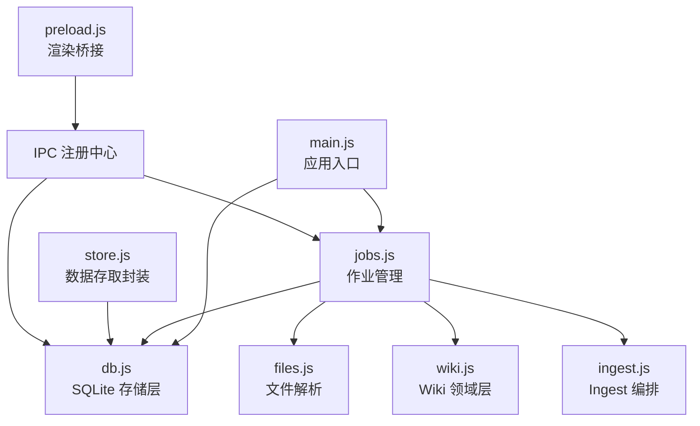
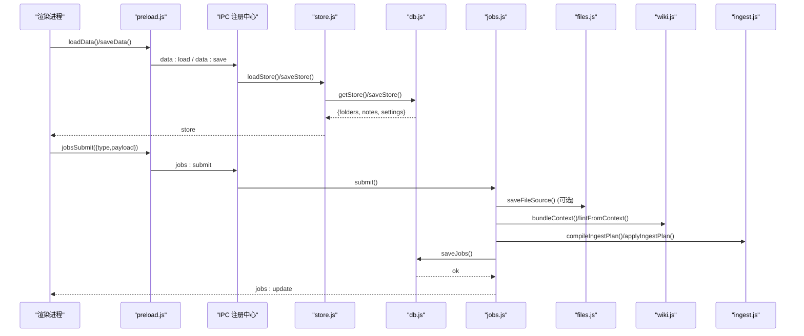
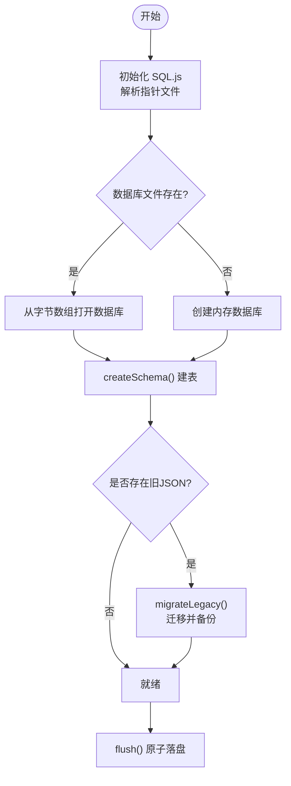
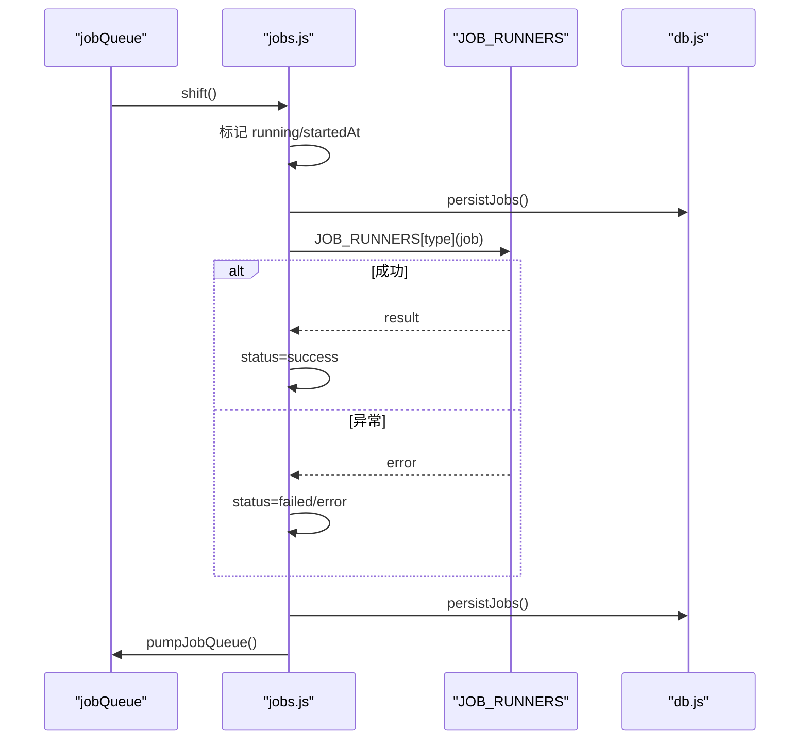
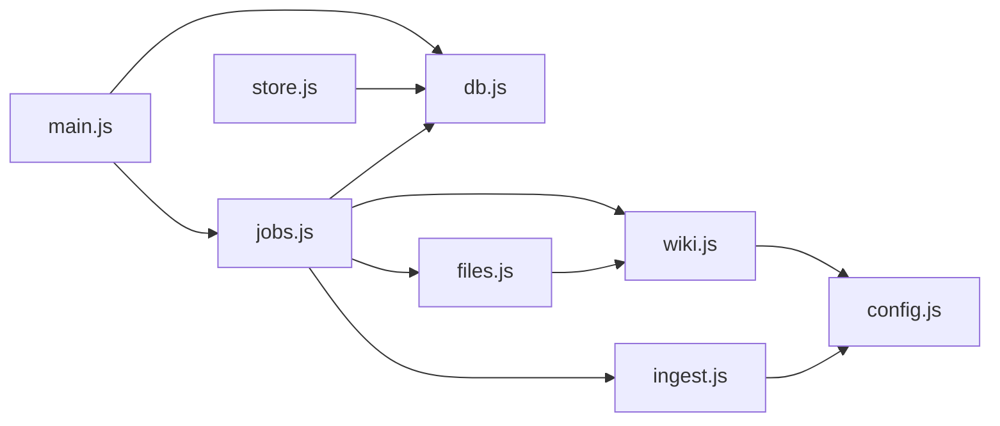

# 数据存储层

<cite>
**本文引用的文件**
- [db.js](file://src/main/db.js)
- [store.js](file://src/main/store.js)
- [jobs.js](file://src/main/jobs.js)
- [config.js](file://src/main/config.js)
- [files.js](file://src/main/files.js)
- [wiki.js](file://src/main/wiki.js)
- [ingest.js](file://src/main/ingest.js)
- [main.js](file://main.js)
- [preload.js](file://preload.js)
</cite>

## 目录
1. [简介](#简介)
2. [项目结构](#项目结构)
3. [核心组件](#核心组件)
4. [架构总览](#架构总览)
5. [详细组件分析](#详细组件分析)
6. [依赖关系分析](#依赖关系分析)
7. [性能考量](#性能考量)
8. [故障排查指南](#故障排查指南)
9. [结论](#结论)
10. [附录：API 参考](#附录api-参考)

## 简介
本存储层基于 SQLite（通过 sql.js 的 WASM 内存数据库实现），负责个人知识库中“文件夹、笔记、设置、作业历史”的持久化。其设计要点包括：
- 内存数据库 + 原子落盘：每次变更后整体导出到临时文件，再原子替换为最终文件，避免写入中断导致损坏。
- 表结构设计：folders、notes、kv、jobs 四张表，分别承载目录树、笔记内容、键值设置与作业历史。
- 数据迁移：首次启动时自动将旧 JSON 文件（knowledge-data.json、wiki-jobs.json）一次性迁入 SQLite，并保留 .bak 备份。
- 事务与一致性：全量保存采用 BEGIN/COMMIT/ROLLBACK 包裹，保证多表写入的一致性。
- 可切换数据库路径：支持运行时切换数据库文件位置，内部使用指针文件记录当前库路径，并提供回退与防覆盖保护。

## 项目结构
存储相关代码集中在 src/main 下，按职责拆分：
- db.js：SQLite 初始化、建表、CRUD、迁移、原子落盘、路径切换
- store.js：对外的笔记/目录/设置存取封装
- jobs.js：作业队列、阶段状态机、历史持久化、重试与清理
- files.js：本地文件解析与 raw/ 源文件保存
- wiki.js：Wiki 领域能力（上下文打包、问答、体检等）
- ingest.js：Ingest 编排（读来源 → AI 编译 → 落盘）
- main.js：应用入口，负责初始化 db、jobs、IPC
- preload.js：渲染进程桥接 API

图表来源
- [main.js:1-56](file://main.js#L1-L56)
- [db.js:1-358](file://src/main/db.js#L1-L358)
- [jobs.js:1-260](file://src/main/jobs.js#L1-L260)
- [store.js:1-17](file://src/main/store.js#L1-L17)
- [files.js:1-102](file://src/main/files.js#L1-L102)
- [wiki.js:1-313](file://src/main/wiki.js#L1-L313)
- [ingest.js:1-85](file://src/main/ingest.js#L1-L85)
- [preload.js:1-56](file://preload.js#L1-L56)

章节来源
- [main.js:1-56](file://main.js#L1-L56)
- [db.js:1-358](file://src/main/db.js#L1-L358)

## 核心组件
- SQLite 存储层（db.js）
  - 初始化与迁移：加载 sql.js，创建 schema，迁移旧 JSON 数据
  - 表结构：folders、notes、kv、jobs
  - CRUD：getSettings/getStore/saveStore、getKv/setKv、getJobs/saveJobs
  - 原子落盘：flush() 整体导出 + 临时文件 rename
  - 路径切换：setDbPath() 支持运行时切换数据库文件位置
- 数据存取封装（store.js）
  - loadStore/saveStore 暴露给上层模块
- 作业管理（jobs.js）
  - 串行队列、阶段状态机、历史持久化、失败重试、清理
- 文件解析（files.js）
  - 多种格式转 Markdown 并保存到 raw/
- Wiki 领域（wiki.js）
  - 上下文打包、问答、体检、日志追加
- Ingest 编排（ingest.js）
  - 读取来源、AI 编译页面计划、落盘

章节来源
- [db.js:91-187](file://src/main/db.js#L91-L187)
- [store.js:1-17](file://src/main/store.js#L1-L17)
- [jobs.js:1-260](file://src/main/jobs.js#L1-L260)
- [files.js:1-102](file://src/main/files.js#L1-L102)
- [wiki.js:1-313](file://src/main/wiki.js#L1-L313)
- [ingest.js:1-85](file://src/main/ingest.js#L1-L85)

## 架构总览
存储层以 SQLite 为核心，配合文件系统完成原始来源与 Wiki 页面的持久化；作业系统驱动 Ingest/Lint 流程，并将运行期状态与结果持久化到 jobs 表。

图表来源
- [preload.js:1-56](file://preload.js#L1-L56)
- [store.js:1-17](file://src/main/store.js#L1-L17)
- [db.js:190-358](file://src/main/db.js#L190-L358)
- [jobs.js:71-121](file://src/main/jobs.js#L71-L121)
- [files.js:76-99](file://src/main/files.js#L76-L99)
- [wiki.js:117-134](file://src/main/wiki.js#L117-L134)
- [ingest.js:22-82](file://src/main/ingest.js#L22-L82)

## 详细组件分析

### SQLite 存储层（db.js）
- 初始化与迁移
  - 加载 sql.js，根据指针文件或默认路径打开数据库
  - 若不存在则新建并执行 createSchema()
  - 迁移旧 JSON 数据（knowledge-data.json、wiki-jobs.json）后重命名为 .bak
- 表结构
  - folders：id、name、parent_id（目录树）
  - notes：id、title、content、tags、folder_id、pinned、created_at、updated_at
  - kv：key、value（设置项，settings 以 key=settings 存储 JSON）
  - jobs：id、type、title、status、时间戳、stages、raw_paths、result、error
- 原子落盘
  - flush() 调用 db.export() 写出到 .tmp，再 rename 到目标文件，确保原子性
- 路径切换
  - setDbPath(newPath) 支持切换到新路径或恢复默认，包含存在性检查、旧文件备份、指针文件更新
- 事务与一致性
  - saveStore/saveJobs 使用 BEGIN/COMMIT/ROLLBACK 包裹，异常时回滚
- 错误处理
  - 迁移失败保留原文件；路径切换失败返回错误对象；KV 查询空值安全处理

图表来源
- [db.js:91-187](file://src/main/db.js#L91-L187)

章节来源
- [db.js:91-187](file://src/main/db.js#L91-L187)
- [db.js:189-358](file://src/main/db.js#L189-L358)

### 数据存取封装（store.js）
- 提供 getDataFile/loadStore/saveStore 三个方法，屏蔽底层 db.js 细节
- 适合被 IPC 或其他模块直接调用

章节来源
- [store.js:1-17](file://src/main/store.js#L1-L17)

### 作业管理（jobs.js）
- 串行队列与状态机
  - 作业类型：ingest、lint
  - 阶段定义：ingest(save/compile/write)、lint(collect/analyze/done)
  - 运行期维护 jobs 列表与 jobQueue，runningJobId 控制并发
- 持久化策略
  - persistJobs() 剥离 payload（含敏感信息），仅持久化必要字段
  - 重启后加载历史，将 running/queued 标记为 failed 并写回
- 重试机制
  - lint 直接重新提交
  - ingest 复用已保存的 rawPaths 跳过 save 阶段
- 删除与清空
  - remove/clear 仅允许操作终态作业

图表来源
- [jobs.js:71-121](file://src/main/jobs.js#L71-L121)
- [jobs.js:136-188](file://src/main/jobs.js#L136-L188)
- [db.js:314-358](file://src/main/db.js#L314-L358)

章节来源
- [jobs.js:1-260](file://src/main/jobs.js#L1-L260)

### 文件解析与原始来源（files.js）
- 支持 PDF/DOCX/XLSX/PPTX/文本等格式转换为 Markdown
- 保存到 wikiRoot/raw/ 目录下，文件名带日期前缀与 slugify
- 返回相对路径 relPath，供 Ingest 流程复用

章节来源
- [files.js:1-102](file://src/main/files.js#L1-L102)

### Wiki 领域（wiki.js）
- 上下文打包：收集 index.md、schema、页面清单与全文
- 问答与回填：检索相关页面、流式回答、归档 Answer 页面
- 体检：生成 Lint 报告
- 日志：appendLog 在 log.md 当日分组追加条目

章节来源
- [wiki.js:1-313](file://src/main/wiki.js#L1-L313)

### Ingest 编排（ingest.js）
- 读取 raw 来源，截断超长内容
- 调用 LLM 生成页面计划（pages/index_md/summary）
- 落盘：写入 wiki 页面、更新 index.md、追加日志

章节来源
- [ingest.js:1-85](file://src/main/ingest.js#L1-L85)

## 依赖关系分析
- 主进程入口 main.js 负责初始化 db、jobs、IPC，并创建窗口
- store.js 依赖 db.js
- jobs.js 依赖 db.js、files.js、wiki.js、ingest.js、config.js
- files.js 依赖 wiki.js（路径工具）
- wiki.js 依赖 llm.js、config.js
- ingest.js 依赖 llm.js、wiki.js、config.js

图表来源
- [main.js:1-56](file://main.js#L1-L56)
- [store.js:1-17](file://src/main/store.js#L1-L17)
- [jobs.js:1-260](file://src/main/jobs.js#L1-L260)
- [files.js:1-102](file://src/main/files.js#L1-L102)
- [wiki.js:1-313](file://src/main/wiki.js#L1-L313)
- [ingest.js:1-85](file://src/main/ingest.js#L1-L85)
- [config.js:1-18](file://src/main/config.js#L1-L18)

章节来源
- [main.js:1-56](file://main.js#L1-L56)
- [db.js:1-358](file://src/main/db.js#L1-L358)
- [jobs.js:1-260](file://src/main/jobs.js#L1-L260)

## 性能考量
- 内存数据库：sql.js 使用内存数据库，读写速度快，适合小数据量场景
- 原子落盘：整体导出 + 临时文件 rename，避免部分写入导致的损坏
- 批量插入：迁移时使用 prepare 语句循环插入，减少重复开销
- 作业历史上限：通过 settings.maxJobsHistory 限制持久化长度，避免无限增长
- 来源截断：sourceMaxChars 限制原始来源大小，防止提示词爆炸
- 并发控制：作业串行执行，避免并发写冲突

[本节为通用性能讨论，不直接分析具体文件]

## 故障排查指南
- 迁移失败
  - 现象：旧 JSON 文件未被迁移
  - 处理：检查权限与路径；迁移失败会保留原文件，查看控制台错误
  - 参考：[db.js:151-177](file://src/main/db.js#L151-L177)
- 路径切换失败
  - 现象：setDbPath 返回错误
  - 处理：确认传入绝对路径；目标文件不存在；默认路径恢复时会备份旧文件
  - 参考：[db.js:34-81](file://src/main/db.js#L34-L81)
- 作业历史未更新
  - 现象：jobs 列表不刷新
  - 处理：检查 persistJobs 是否抛出异常；确认 emitJobs 是否正常发送事件
  - 参考：[jobs.js:45-60](file://src/main/jobs.js#L45-L60)
- 文件解析失败
  - 现象：不支持的格式或内容为空
  - 处理：检查扩展名与内容；确认文件存在且可读
  - 参考：[files.js:22-99](file://src/main/files.js#L22-L99)
- Wiki 上下文为空
  - 现象：bundleContext 返回空 listing/pagesBlock
  - 处理：确认 wikiRoot 存在 AGENTS.md 与 wiki 目录
  - 参考：[wiki.js:117-134](file://src/main/wiki.js#L117-L134)

章节来源
- [db.js:34-81](file://src/main/db.js#L34-L81)
- [db.js:151-177](file://src/main/db.js#L151-L177)
- [jobs.js:45-60](file://src/main/jobs.js#L45-L60)
- [files.js:22-99](file://src/main/files.js#L22-L99)
- [wiki.js:117-134](file://src/main/wiki.js#L117-L134)

## 结论
该存储层以 SQLite 为核心，结合原子落盘与事务机制，提供了稳定可靠的持久化能力。通过清晰的表结构与迁移策略，实现了从旧 JSON 到新库的平滑过渡。作业系统与存储层解耦，便于扩展与维护。对于小数据量场景，内存数据库具备良好性能；同时提供路径切换与备份机制，增强可运维性。

[本节为总结性内容，不直接分析具体文件]

## 附录：API 参考

### 数据存取（store.js）
- getDataFile()
  - 描述：获取当前数据库文件路径
  - 返回值：string（数据库文件路径）
  - 参考：[store.js:4-6](file://src/main/store.js#L4-L6)
- loadStore()
  - 描述：加载完整 store（folders、notes、settings）
  - 返回值：object { folders[], notes[], settings }
  - 参考：[store.js:8-10](file://src/main/store.js#L8-L10)
- saveStore(store)
  - 描述：全量保存 store（事务内清空并重插）
  - 参数：store { folders[], notes[], settings }
  - 返回值：void
  - 参考：[store.js:12-14](file://src/main/store.js#L12-L14)

### 设置管理（db.js）
- getSettings()
  - 描述：读取 settings 对象（从 kv 表 key=settings 解析）
  - 返回值：object
  - 参考：[db.js:223-225](file://src/main/db.js#L223-L225)
- setKv(key, value)
  - 描述：设置键值对（ON CONFLICT 更新）
  - 参数：key string, value string
  - 返回值：void
  - 参考：[db.js:279-286](file://src/main/db.js#L279-L286)

### 作业历史（db.js）
- getJobs()
  - 描述：读取作业历史（按 rowid 降序）
  - 返回值：array of job objects
  - 参考：[db.js:314-340](file://src/main/db.js#L314-L340)
- saveJobs(list)
  - 描述：全量覆盖作业历史（事务内清空并重插）
  - 参数：list array of job objects
  - 返回值：void
  - 参考：[db.js:342-355](file://src/main/db.js#L342-L355)

### 数据库路径切换（db.js）
- setDbPath(newPath)
  - 描述：切换数据库文件位置（支持恢复默认）
  - 参数：newPath string | null（绝对路径或空表示恢复默认）
  - 返回值：object { ok boolean, path? string, changed? boolean, error? string }
  - 参考：[db.js:34-81](file://src/main/db.js#L34-L81)

### 渲染进程桥接（preload.js）
- kb.loadData()
  - 描述：加载数据（对应 data:load）
  - 返回值：Promise<store>
  - 参考：[preload.js:3-7](file://preload.js#L3-L7)
- kb.saveData(store)
  - 描述：保存数据（对应 data:save）
  - 参数：store object
  - 返回值：Promise<void>
  - 参考：[preload.js:3-7](file://preload.js#L3-L7)
- kb.setDbPath(path)
  - 描述：切换数据库路径（对应 data:setDbPath）
  - 参数：path string | null
  - 返回值：Promise<object>
  - 参考：[preload.js:3-7](file://preload.js#L3-L7)
- kb.jobsList()/kb.jobsSubmit()/kb.jobsRemove()/kb.jobsClear()/kb.jobsRetry()
  - 描述：作业管理接口（对应 jobs:*）
  - 返回值：Promise 或 void
  - 参考：[preload.js:40-50](file://preload.js#L40-L50)

章节来源
- [store.js:1-17](file://src/main/store.js#L1-L17)
- [db.js:223-358](file://src/main/db.js#L223-L358)
- [preload.js:1-56](file://preload.js#L1-L56)