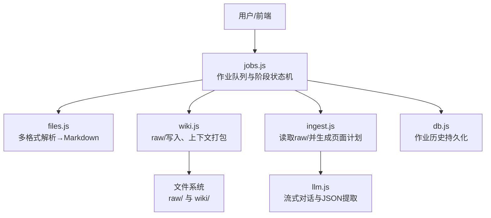
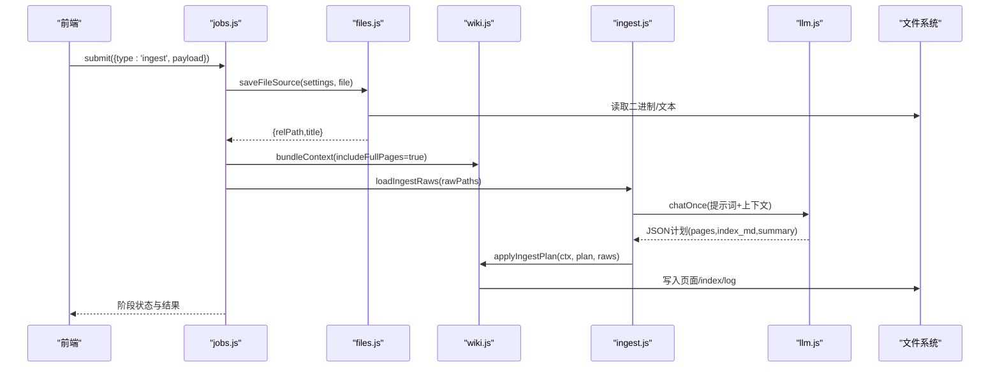
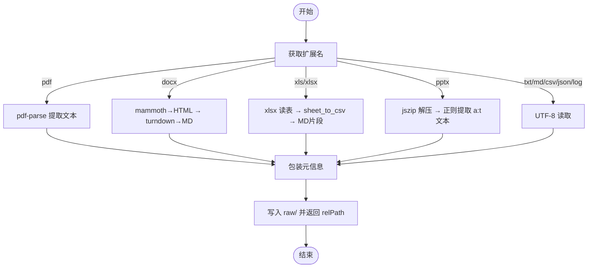
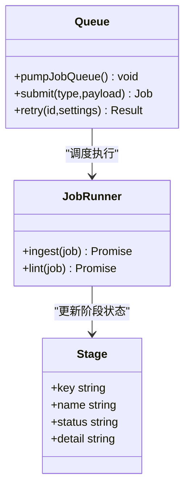
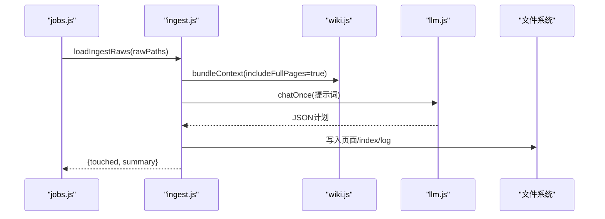
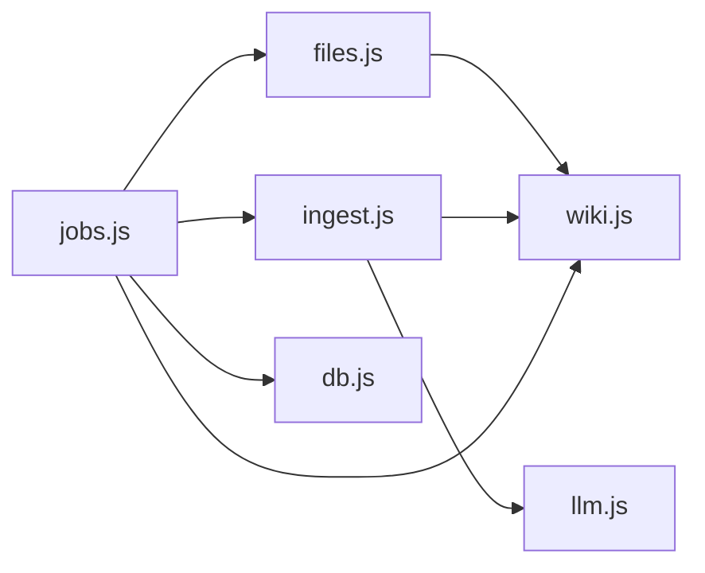

# 文件处理模块

<cite>
**本文引用的文件**
- [files.js](file://src/main/files.js)
- [ingest.js](file://src/main/ingest.js)
- [jobs.js](file://src/main/jobs.js)
- [wiki.js](file://src/main/wiki.js)
- [llm.js](file://src/main/llm.js)
- [db.js](file://src/main/db.js)
- [config.js](file://src/main/config.js)
- [package.json](file://package.json)
</cite>

## 目录
1. [简介](#简介)
2. [项目结构](#项目结构)
3. [核心组件](#核心组件)
4. [架构总览](#架构总览)
5. [详细组件分析](#详细组件分析)
6. [依赖关系分析](#依赖关系分析)
7. [性能与内存优化](#性能与内存优化)
8. [故障排查指南](#故障排查指南)
9. [结论](#结论)
10. [附录：扩展新格式最佳实践](#附录：扩展新格式最佳实践)

## 简介
本模块负责将多种办公与文档格式（PDF、Word、Excel、PowerPoint、纯文本等）解析为统一的 Markdown，并纳入知识库的“来源”体系，随后通过 AI 编排生成或更新 wiki 页面。其设计采用“策略模式 + 作业队列”的分层架构：文件格式解析按扩展名分派到不同解析器；上层作业系统以阶段化状态机驱动“保存来源 → AI 编译 → 落盘”流程，支持重试与历史持久化。

## 项目结构
- 主进程位于 src/main，包含配置、数据库、Wiki 领域逻辑、LLM 调用、作业调度与文件解析等模块。
- 文件解析入口在 files.js，统一对外暴露 saveFileSource 与 extractFileContent。
- ingest.js 负责读取 raw/ 下的原始来源，构造提示词并调用 LLM 生成页面计划。
- jobs.js 维护串行作业队列、阶段状态机、重试与持久化。
- wiki.js 提供 Wiki 根目录定位、页面遍历、上下文打包、日志追加、网页抓取与 Markdown 转换等能力。
- llm.js 封装 OpenAI 兼容接口的流式对话与 JSON 提取。
- db.js 基于 sql.js 实现设置、笔记、作业历史的持久化。
- config.js 提供数值与枚举配置的健壮读取。

图表来源
- [jobs.js:136-188](file://src/main/jobs.js#L136-L188)
- [files.js:22-74](file://src/main/files.js#L22-L74)
- [ingest.js:22-82](file://src/main/ingest.js#L22-L82)
- [wiki.js:117-134](file://src/main/wiki.js#L117-L134)
- [llm.js:81-120](file://src/main/llm.js#L81-L120)
- [db.js:288-355](file://src/main/db.js#L288-L355)

章节来源
- [jobs.js:1-260](file://src/main/jobs.js#L1-L260)
- [files.js:1-102](file://src/main/files.js#L1-L102)
- [ingest.js:1-85](file://src/main/ingest.js#L1-L85)
- [wiki.js:1-313](file://src/main/wiki.js#L1-L313)
- [llm.js:1-123](file://src/main/llm.js#L1-L123)
- [db.js:1-358](file://src/main/db.js#L1-L358)
- [config.js:1-18](file://src/main/config.js#L1-L18)
- [package.json:1-45](file://package.json#L1-L45)

## 核心组件
- 文件解析器（files.js）
  - 统一入口 extractFileContent(absPath)：按扩展名路由至 PDF/DOCX/XLSX/PPTX/文本等解析分支。
  - 统一入口 saveFileSource(settings, filePath)：校验格式、解析内容、包装为带元信息的 Markdown 并保存到 raw/。
- 作业系统（jobs.js）
  - 串行队列 pumpJobQueue()，阶段状态机 INGEST_STAGES/LINT_STAGES。
  - 作业类型 ingest/lint，支持重试与历史持久化。
- Ingest 编排（ingest.js）
  - loadIngestRaws：加载 raw/ 来源并截断超长内容。
  - compileIngestPlan：组装提示词，调用 LLM 生成 pages/index_md/summary。
  - applyIngestPlan：落盘页面、更新 index.md、记录日志。
- Wiki 领域（wiki.js）
  - 路径安全 safeJoin、slugify、uniquePath。
  - bundleContext：打包 schema、index、页面清单与全文块。
  - saveRawSource：网页抓取+Turndown转Markdown，或直接保存文本。
- LLM 调用（llm.js）
  - streamChat/chatOnce：OpenAI 兼容接口，SSE 流式累积全文。
  - extractJson：从模型输出中抽取 JSON。
- 配置与持久化（config.js、db.js）
  - num/pick：配置项取值与默认值钳制。
  - SQLite 存储设置、笔记、作业历史，原子写盘。

章节来源
- [files.js:22-99](file://src/main/files.js#L22-L99)
- [jobs.js:71-188](file://src/main/jobs.js#L71-L188)
- [ingest.js:8-82](file://src/main/ingest.js#L8-L82)
- [wiki.js:21-57, 117-191:21-57](file://src/main/wiki.js#L21-L57)
- [llm.js:40-120](file://src/main/llm.js#L40-L120)
- [config.js:5-15](file://src/main/config.js#L5-L15)
- [db.js:223-286](file://src/main/db.js#L223-L286)

## 架构总览
文件处理模块采用分层与策略模式：
- 表示层：前端触发“吸收/体检”作业。
- 控制层：jobs.js 管理作业生命周期与阶段状态。
- 业务层：ingest.js 编排 raw/ 来源与 LLM 生成计划；wiki.js 提供 Wiki 上下文与落盘。
- 解析层：files.js 按扩展名选择解析策略，输出 Markdown。
- 集成层：llm.js 与外部 LLM 服务交互；db.js 持久化作业历史。

图表来源
- [jobs.js:136-188](file://src/main/jobs.js#L136-L188)
- [files.js:22-99](file://src/main/files.js#L22-L99)
- [ingest.js:22-82](file://src/main/ingest.js#L22-L82)
- [wiki.js:117-191](file://src/main/wiki.js#L117-L191)
- [llm.js:81-120](file://src/main/llm.js#L81-L120)

## 详细组件分析

### 文件解析器（files.js）
- 策略分发：extractFileContent 根据扩展名选择 PDF/DOCX/XLSX/PPTX/文本解析器。
- PDF：使用 pdf-parse 提取文本，注意显式销毁解析器释放资源。
- DOCX：mammoth 转为 HTML，再用 turndown 转为 Markdown（ATX 标题、围栏代码块）。
- Excel：xlsx 读取工作簿，逐表导出 CSV 并以 fenced 代码块嵌入 Markdown。
- PowerPoint：jszip 解压 PPTX，正则匹配 slide XML 中的 a:t 文本节点，解码实体后拼接。
- 文本类：直接 UTF-8 读取。
- 保存：saveFileSource 校验扩展名、解析内容、包装标题与来源信息、写入 raw/ 并返回相对路径。

图表来源
- [files.js:22-99](file://src/main/files.js#L22-L99)

章节来源
- [files.js:1-102](file://src/main/files.js#L1-L102)

### 作业系统与阶段状态机（jobs.js）
- 队列与执行：pumpJobQueue 串行执行，runningJobId 防并发。
- 阶段定义：INGEST_STAGES（保存来源、AI 编译、落盘），LINT_STAGES（收集、AI 体检、完成）。
- 作业 runner：
  - ingest：批量保存来源（可复用 rawPaths 跳过解析）、构建上下文、调用 ingest 编排、落盘。
  - lint：收集全库、调用体检、生成报告。
- 重试：失败作业可重试，ingest 自动复用已保存的 rawPaths。
- 持久化：persistJobs 剥离 payload，仅保留展示所需字段，定期落库。

图表来源
- [jobs.js:71-188](file://src/main/jobs.js#L71-L188)

章节来源
- [jobs.js:1-260](file://src/main/jobs.js#L1-L260)

### Ingest 编排（ingest.js）
- 加载来源：loadIngestRaws 读取 raw/ 文件，按 sourceMaxChars 截断避免提示词爆炸。
- 编译计划：compileIngestPlan 组装 AGENTS 模式、index、页面清单与 raw 来源，调用 LLM 生成 JSON 计划。
- 应用计划：applyIngestPlan 过滤非法路径、写入页面、更新 index.md、追加日志。

图表来源
- [ingest.js:8-82](file://src/main/ingest.js#L8-L82)
- [wiki.js:117-191](file://src/main/wiki.js#L117-L191)
- [llm.js:81-120](file://src/main/llm.js#L81-L120)

章节来源
- [ingest.js:1-85](file://src/main/ingest.js#L1-L85)

### Wiki 领域与上下文（wiki.js）
- 路径安全：safeJoin 防止路径逃逸。
- 上下文打包：bundleContext 聚合 schema、index、页面清单与可选全文块，供 LLM 使用。
- 来源保存：saveRawSource 支持网页抓取（超时控制）与文本直存，均转换为 Markdown。
- 日志：appendLog 按日期分组追加条目。

章节来源
- [wiki.js:21-57, 117-191, 136-151:21-57](file://src/main/wiki.js#L21-L57)
- [wiki.js:117-191](file://src/main/wiki.js#L117-L191)
- [wiki.js:136-151](file://src/main/wiki.js#L136-L151)

### LLM 调用（llm.js）
- 流式对话：streamChat 推送增量 ai:chunk，错误 ai:error，完成 ai:done。
- 一次性对话：chatOnce 内部以流式接收并累积全文，支持可重试错误（网络/5xx/空返回）。
- JSON 提取：extractJson 容忍代码块包裹与前后杂质。

章节来源
- [llm.js:1-123](file://src/main/llm.js#L1-L123)

### 配置与持久化（config.js、db.js）
- 配置：num/pick 提供安全的数值与枚举读取，缺失或越界时回退默认。
- 持久化：db.js 基于 sql.js 实现设置、笔记、作业历史存储，原子写盘避免损坏。

章节来源
- [config.js:1-18](file://src/main/config.js#L1-L18)
- [db.js:180-187, 223-286, 288-355:180-187](file://src/main/db.js#L180-L187)
- [db.js:223-286](file://src/main/db.js#L223-L286)
- [db.js:288-355](file://src/main/db.js#L288-L355)

## 依赖关系分析
- 外部依赖（package.json）：
  - mammoth：Word 文档解析。
  - xlsx：Excel 工作簿读写。
  - jszip：PPTX 解压。
  - pdf-parse：PDF 文本提取。
  - turndown：HTML 转 Markdown。
- 内部依赖：
  - files.js 依赖 wiki.js 的路径工具与 uniquePath。
  - ingest.js 依赖 wiki.js 的上下文打包与日志，依赖 llm.js 的对话与 JSON 提取。
  - jobs.js 组合 files.js、ingest.js、wiki.js、db.js 形成完整流水线。

图表来源
- [files.js:1-10](file://src/main/files.js#L1-L10)
- [ingest.js:1-7](file://src/main/ingest.js#L1-L7)
- [jobs.js:1-7](file://src/main/jobs.js#L1-L7)
- [package.json:36-43](file://package.json#L36-L43)

章节来源
- [package.json:36-43](file://package.json#L36-L43)
- [files.js:1-10](file://src/main/files.js#L1-L10)
- [ingest.js:1-7](file://src/main/ingest.js#L1-L7)
- [jobs.js:1-7](file://src/main/jobs.js#L1-L7)

## 性能与内存优化
- 解析阶段
  - PDF：使用 pdf-parse 的 data 模式解析，完成后显式 destroy 释放资源，避免内存泄漏。
  - Excel：逐表导出 CSV 并拼接 Markdown，避免一次性加载全部表格对象。
  - PowerPoint：按需解压 slide XML，正则提取文本，减少中间对象数量。
  - Word：先转 HTML 再转 Markdown，适合中等大小文档；超大文档建议分批或限制输入长度。
- 提示词与上下文
  - ingest.js 对 raw/ 内容按 sourceMaxChars 截断，避免提示词过大导致请求失败或成本飙升。
  - bundleContext 支持 includeFullPages=false 的场景（如问答检索），减少上下文体积。
- 作业与持久化
  - 串行队列避免并发写冲突；persistJobs 剥离 payload，降低持久化体积。
  - db.js 使用原子写盘（临时文件 rename）确保数据一致性。
- 网络与重试
  - llm.js 对可重试错误进行有限次重试，客户端错误不重试，提升鲁棒性。
  - 网页抓取支持超时控制，避免长时间阻塞。

[本节为通用性能讨论，不直接分析具体文件]

## 故障排查指南
- 不支持的文件格式
  - 现象：保存时报错“不支持的格式”。
  - 原因：扩展名不在 FILE_EXTENSIONS 列表。
  - 处理：确认扩展名或使用支持的格式；如需新增，见附录。
  - 参考
    - [files.js:11](file://src/main/files.js#L11)
    - [files.js:84-85](file://src/main/files.js#L84-L85)
- 内容为空或无法提取文本
  - 现象：保存时报错“文件内容为空或无法提取文本”。
  - 原因：解析结果为空或源文件损坏。
  - 处理：检查源文件完整性；对 PDF/Word/Excel/PPTX 分别验证解析器行为。
  - 参考
    - [files.js:87-89](file://src/main/files.js#L87-L89)
- 网页拉取失败
  - 现象：保存网页来源时报错 HTTP 状态。
  - 原因：目标站点不可达或返回非 2xx。
  - 处理：检查 URL、网络与代理；必要时调整 urlFetchTimeout。
  - 参考
    - [wiki.js:162-172](file://src/main/wiki.js#L162-L172)
- LLM 返回异常
  - 现象：模型返回无法解析 JSON 或为空。
  - 原因：模型未按要求输出 JSON 或网络瞬时错误。
  - 处理：检查提示词与模型；利用 chatOnce 的重试机制；必要时增加重试次数。
  - 参考
    - [ingest.js:57-61](file://src/main/ingest.js#L57-L61)
    - [llm.js:81-109](file://src/main/llm.js#L81-L109)
- 作业中断与恢复
  - 现象：应用重启后作业状态异常。
  - 原因：运行期未完成作业需标记失败。
  - 处理：启动时 loadJobs 将 running/queued 重置为 failed；可通过 retry 重新执行。
  - 参考
    - [jobs.js:32-43](file://src/main/jobs.js#L32-L43)
    - [jobs.js:236-257](file://src/main/jobs.js#L236-L257)

章节来源
- [files.js:11-11](file://src/main/files.js#L11-L11)
- [files.js:84-89](file://src/main/files.js#L84-L89)
- [wiki.js:162-172](file://src/main/wiki.js#L162-L172)
- [ingest.js:57-61](file://src/main/ingest.js#L57-L61)
- [llm.js:81-109](file://src/main/llm.js#L81-L109)
- [jobs.js:32-43](file://src/main/jobs.js#L32-L43)
- [jobs.js:236-257](file://src/main/jobs.js#L236-L257)

## 结论
该文件处理模块以清晰的职责划分与可扩展的解析策略实现了多格式文档的统一入库与知识编排。通过作业队列与阶段状态机，保证了批处理能力与可观测性；结合 LLM 的上下文理解，实现了从原始来源到结构化页面的自动化流转。建议在大规模场景下进一步优化大文档解析与上下文裁剪策略，并持续完善错误诊断与监控。

[本节为总结性内容，不直接分析具体文件]

## 附录：扩展新格式最佳实践
- 新增解析分支
  - 在 extractFileContent 中添加新的扩展名分支，实现 buffer → Markdown 的转换逻辑。
  - 若需要解压或特殊编码处理，优先使用流式或分块方式以降低内存占用。
  - 参考
    - [files.js:22-74](file://src/main/files.js#L22-L74)
- 注册扩展名
  - 将新扩展名加入 FILE_EXTENSIONS，以便 saveFileSource 校验通过。
  - 参考
    - [files.js:11](file://src/main/files.js#L11)
    - [files.js:84-85](file://src/main/files.js#L84-L85)
- 测试与回归
  - 准备典型样本（含复杂排版、图片、表格、超链接等），验证 Markdown 输出质量。
  - 对超大文件进行压力测试，关注内存峰值与解析耗时。
- 与 Ingest 协作
  - 确保生成的 Markdown 符合 OKF frontmatter 约定，便于后续 AI 编排。
  - 若新格式包含大量元数据，可在包装阶段注入必要的前言与来源信息。
  - 参考
    - [ingest.js:40-51](file://src/main/ingest.js#L40-L51)
    - [files.js:91-98](file://src/main/files.js#L91-L98)

章节来源
- [files.js:11-11](file://src/main/files.js#L11-L11)
- [files.js:22-74](file://src/main/files.js#L22-L74)
- [files.js:84-98](file://src/main/files.js#L84-L98)
- [ingest.js:40-51](file://src/main/ingest.js#L40-L51)