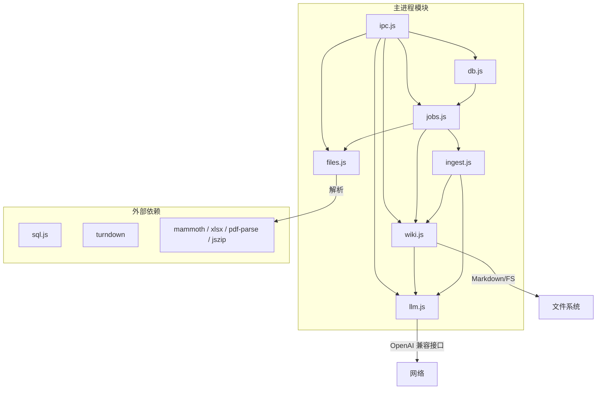
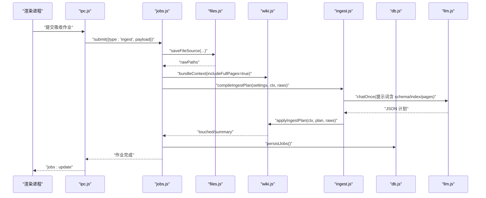
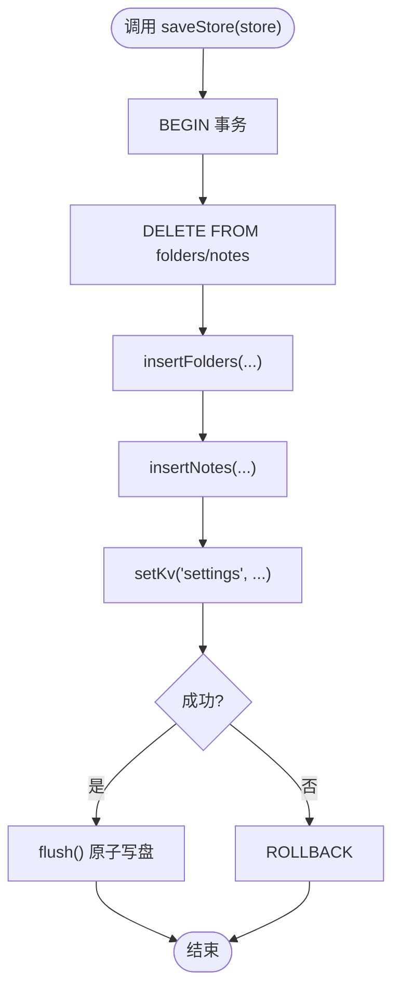
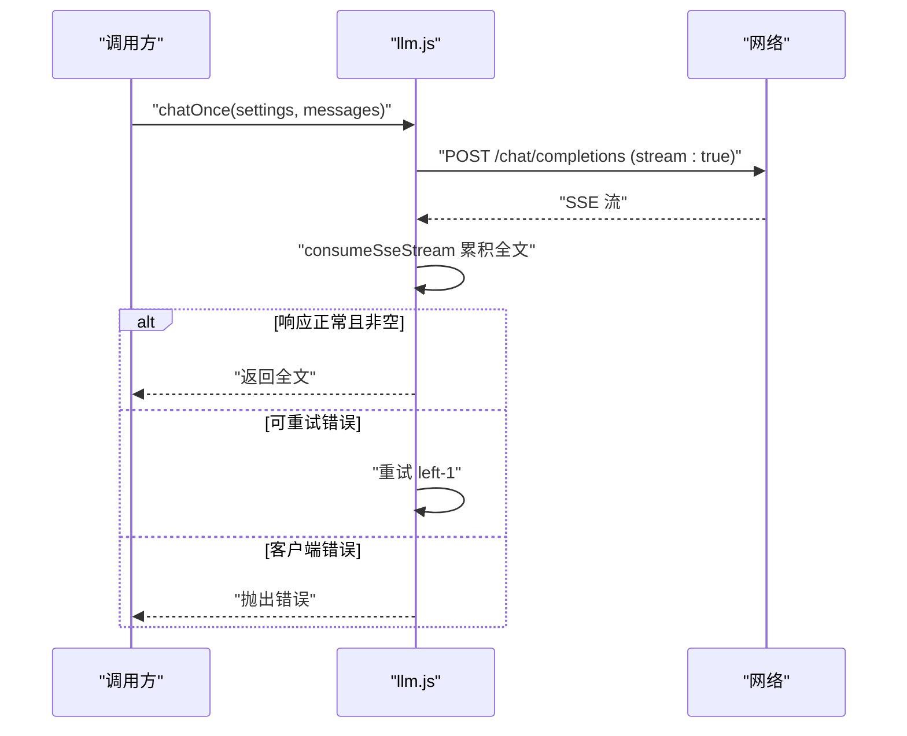
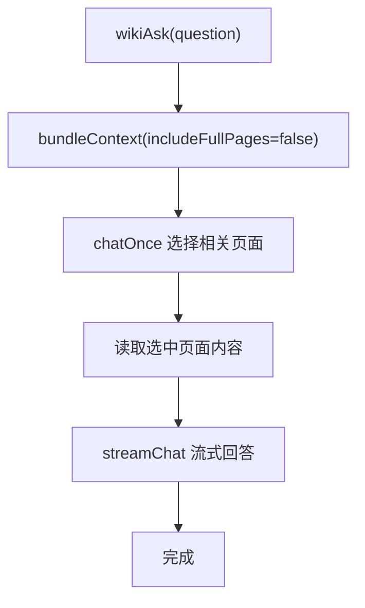
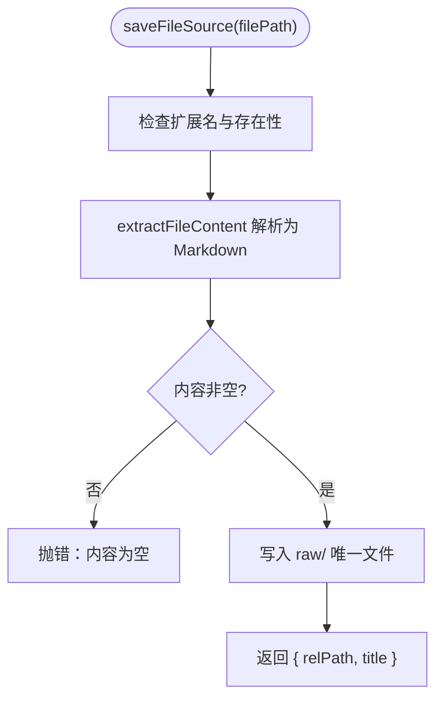
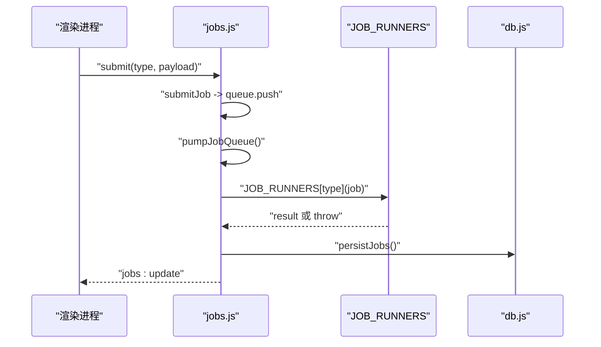
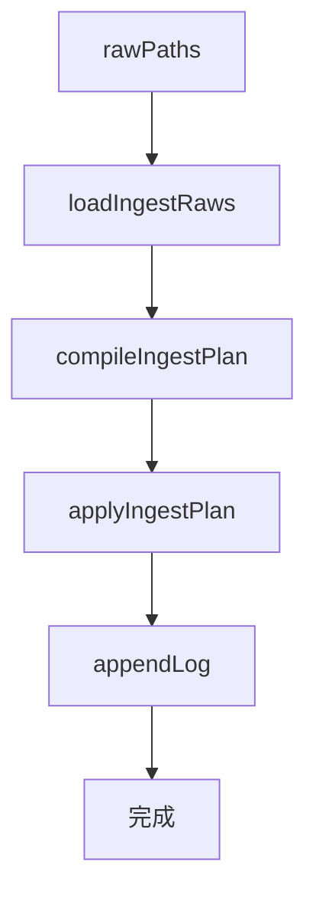
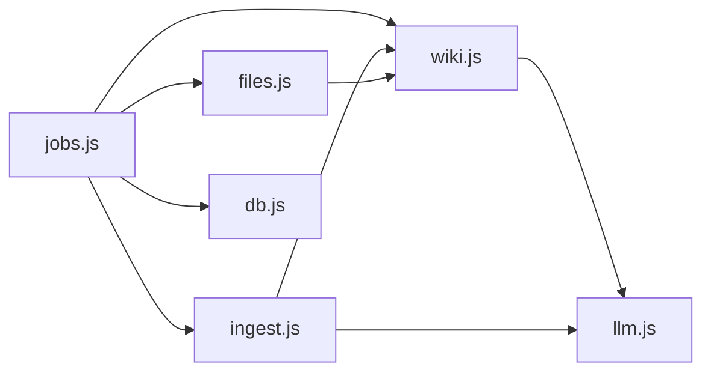

# 核心模块

<cite>
**本文引用的文件**
- [db.js](file://src/main/db.js)
- [llm.js](file://src/main/llm.js)
- [wiki.js](file://src/main/wiki.js)
- [files.js](file://src/main/files.js)
- [jobs.js](file://src/main/jobs.js)
- [ingest.js](file://src/main/ingest.js)
- [config.js](file://src/main/config.js)
- [ipc.js](file://src/main/ipc.js)
- [preload.js](file://preload.js)
- [package.json](file://package.json)
</cite>

## 目录
1. [简介](#简介)
2. [项目结构](#项目结构)
3. [核心组件](#核心组件)
4. [架构总览](#架构总览)
5. [详细组件分析](#详细组件分析)
6. [依赖关系分析](#依赖关系分析)
7. [性能考量](#性能考量)
8. [故障排查指南](#故障排查指南)
9. [结论](#结论)
10. [附录：API 参考与使用模式](#附录api-参考与使用模式)

## 简介
本仓库是一个基于 Electron 的本地个人知识库助手，围绕“笔记 + LLM Wiki”的双层知识体系构建。核心模块包括：
- 数据存储层（db.js）：基于 sql.js 的 SQLite 持久化，负责笔记、目录、设置与作业历史。
- AI 问答模块（llm.js）：OpenAI 兼容接口的流式 SSE 请求、重试策略与 JSON 提取。
- Wiki 领域模块（wiki.js）：Wiki 根目录定位、页面读取/描述、来源保存、上下文打包、问答与体检。
- 文件处理模块（files.js）：PDF/DOCX/Excel/PPTX/文本等格式解析为 Markdown，并保存到 raw/。
- 作业管理系统（jobs.js）：串行队列、阶段状态机、历史持久化与中断恢复/重试。
- Ingest 编排模块（ingest.js）：吸收流程三步拆分（读来源 → AI 编译计划 → 落盘），供作业系统分阶段上报。

这些模块通过 IPC 与渲染进程交互，形成从用户操作到数据落盘的完整闭环。

## 项目结构
- src/main 下为核心主进程模块，按职责划分清晰：
  - db.js：数据库初始化、迁移、读写与原子落盘。
  - llm.js：SSE 流式对话、重试、JSON 提取。
  - wiki.js：Wiki 文件系统访问、上下文打包、问答与体检。
  - files.js：多格式文件解析与 Markdown 转换。
  - jobs.js：作业队列、阶段推进、持久化与重试。
  - ingest.js：Ingest 编排（读来源、编译计划、应用计划）。
  - config.js：配置项数值/枚举校验与默认值回退。
  - ipc.js：IPC 注册中心，桥接渲染进程与各模块。
- preload.js：暴露安全的 API 给渲染进程。
- package.json：依赖声明与构建配置。

图表来源
- [ipc.js:1-38](file://src/main/ipc.js#L1-L38)
- [jobs.js:1-120](file://src/main/jobs.js#L1-L120)
- [ingest.js:1-85](file://src/main/ingest.js#L1-L85)
- [wiki.js:1-120](file://src/main/wiki.js#L1-L120)
- [files.js:1-102](file://src/main/files.js#L1-L102)
- [llm.js:1-123](file://src/main/llm.js#L1-L123)
- [db.js:1-120](file://src/main/db.js#L1-L120)

章节来源
- [package.json:1-45](file://package.json#L1-L45)
- [ipc.js:1-38](file://src/main/ipc.js#L1-L38)

## 核心组件
- 数据存储层（db.js）
  - 职责：SQLite 初始化、schema 创建、旧 JSON 数据迁移、原子落盘、笔记/目录/设置与作业历史的增删改查。
  - 关键能力：指针文件切换数据库路径、事务批量写入、失败回滚、导出临时文件重命名保证一致性。
- AI 问答模块（llm.js）
  - 职责：OpenAI 兼容接口的流式 SSE 消费、错误分类与重试、JSON 提取。
  - 关键能力：统一以 stream:true 发起请求避免网关超时；可重试错误（网络/5xx/空返回）递归重试；客户端错误直接抛出。
- Wiki 领域模块（wiki.js）
  - 职责：Wiki 根目录定位与安全路径、页面读取与描述、上下文打包、来源保存（URL/文本）、问答两步检索+流式合成、体检报告生成。
  - 关键能力：安全 join 防路径穿越；frontmatter 轻量解析；log.md 当日分组追加；问答回填归档。
- 文件处理模块（files.js）
  - 职责：PDF/DOCX/Excel/PPTX/文本等解析为 Markdown，保存到 raw/。
  - 关键能力：各格式专用解析器；内容清洗与标题提取；唯一文件名生成。
- 作业管理系统（jobs.js）
  - 职责：串行队列执行、阶段状态机、历史持久化、中断恢复与重试。
  - 关键能力：作业提交、阶段推进、结果持久化、清理进行中/终态作业、重试复用已保存来源。
- Ingest 编排模块（ingest.js）
  - 职责：读来源 → AI 编译页面计划 → 落盘（三步拆分），供作业系统分阶段上报。
  - 关键能力：超长来源截断、严格 JSON 输出约束、索引与日志更新。

章节来源
- [db.js:92-187](file://src/main/db.js#L92-L187)
- [llm.js:40-123](file://src/main/llm.js#L40-L123)
- [wiki.js:84-151](file://src/main/wiki.js#L84-L151)
- [files.js:22-99](file://src/main/files.js#L22-L99)
- [jobs.js:72-188](file://src/main/jobs.js#L72-L188)
- [ingest.js:8-82](file://src/main/ingest.js#L8-L82)

## 架构总览
整体采用“IPC 注册中心 + 领域模块 + 存储层”的分层架构。渲染进程通过 preload 暴露的 kb API 调用主进程 IPC，主进程在 ipc.js 中分发到对应模块。作业系统作为编排层，串联文件处理、Wiki 与 Ingest 编排，并通过 db.js 持久化历史。

图表来源
- [ipc.js:1-38](file://src/main/ipc.js#L1-L38)
- [jobs.js:100-188](file://src/main/jobs.js#L100-L188)
- [files.js:77-99](file://src/main/files.js#L77-L99)
- [wiki.js:117-134](file://src/main/wiki.js#L117-L134)
- [ingest.js:22-82](file://src/main/ingest.js#L22-L82)
- [llm.js:81-123](file://src/main/llm.js#L81-L123)
- [db.js:289-355](file://src/main/db.js#L289-L355)

## 详细组件分析

### 数据存储层（db.js）
- 设计要点
  - 使用 sql.js 内存数据库，变更时整体导出并原子写盘（临时文件 rename）。
  - 支持通过指针文件切换数据库位置，避免覆盖冲突，并在恢复默认时保留旧文件备份。
  - 提供 legacyDataFile 与 legacyJobsFile 的一次性迁移逻辑，确保平滑升级。
  - 使用事务进行全量 store 写入，失败回滚，保证一致性。
- 关键数据结构
  - folders：id、name、parent_id
  - notes：id、title、content、tags、folder_id、pinned、created_at、updated_at
  - kv：key、value（用于 settings）
  - jobs：id、type、title、status、时间戳、stages、raw_paths、result、error
- 复杂度与性能
  - 小数据量场景下，整体导出 + 原子写盘开销可忽略；适合个人知识库规模。
  - 批量插入使用 prepare + run 循环，注意 stmt.free() 释放资源。
- 错误处理
  - 迁移失败保留原文件；切换路径失败返回错误信息；事务异常回滚。

图表来源
- [db.js:252-266](file://src/main/db.js#L252-L266)
- [db.js:181-187](file://src/main/db.js#L181-L187)

章节来源
- [db.js:12-81](file://src/main/db.js#L12-L81)
- [db.js:92-187](file://src/main/db.js#L92-L187)
- [db.js:189-355](file://src/main/db.js#L189-L355)

### AI 问答模块（llm.js）
- 设计要点
  - 统一以 stream:true 发起请求，避免网关对非流式长请求的 headers timeout。
  - 流式 SSE 逐行解析 data: 增量，回调 delta，供实时展示与全文累积共用。
  - chatOnce 内部累积全文，具备可重试错误（RetriableError）的递归重试机制。
  - extractJson 容忍代码块包裹与前后杂质，提取合法 JSON。
- 参数与返回值
  - streamChat(event, settings, messages)：无返回值，通过 event.sender.send('ai:chunk'|'ai:done'|'ai:error') 推送。
  - chatOnce(settings, messages, retries?)：返回模型全文字符串或抛出错误。
  - extractJson(text)：返回解析后的对象或抛出错误。
- 错误处理
  - 网络异常、5xx、空返回视为可重试；4xx 客户端错误直接抛出。
  - 未配置 API Key 时直接返回错误消息。

图表来源
- [llm.js:40-123](file://src/main/llm.js#L40-L123)

章节来源
- [llm.js:1-123](file://src/main/llm.js#L1-L123)

### Wiki 领域模块（wiki.js）
- 设计要点
  - 根目录定位优先 appPath/llmwiki，其次 documents/llmwiki，依据 AGENTS.md 存在性判断。
  - safeJoin 防止路径逃逸；readIfExists 安全读取；slugify/uniquePath 生成唯一文件名。
  - bundleContext 收集 index.md、页面清单与全文，用于问答与体检。
  - saveRawSource 支持 URL 拉取（带超时控制）与纯文本保存，转换为 Markdown。
  - wikiAsk 两步检索：先选页再流式回答；fileAnswer 归档问答为 Answer 类型页面并更新 index.md。
  - lintWiki/lintFromContext 生成体检报告，检查矛盾、陈旧论断、孤儿页、缺失引用等。
- 参数与返回值
  - describeWiki(settings)：返回 { exists, root, schema, indexContent, logTail, pages }。
  - bundleContext(settings, opts)：返回 { root, bundle, schema, indexContent, listing, pagesBlock }。
  - saveRawSource(settings, { title, content, sourceUrl })：返回 { relPath, title }。
  - wikiAsk(event, { settings, question })：通过事件推送 refs/chunk/done/error。
  - fileAnswer(settings, { question, answer })：返回 { path }。
  - lintFromContext(settings, ctx)：返回 Markdown 报告字符串。
- 错误处理
  - 非法路径抛错；网页拉取失败抛错；内容为空抛错；无法解析 JSON 抛错。

图表来源
- [wiki.js:194-233](file://src/main/wiki.js#L194-L233)
- [wiki.js:117-134](file://src/main/wiki.js#L117-L134)
- [llm.js:40-77](file://src/main/llm.js#L40-L77)

章节来源
- [wiki.js:9-151](file://src/main/wiki.js#L9-L151)
- [wiki.js:153-270](file://src/main/wiki.js#L153-L270)
- [wiki.js:272-296](file://src/main/wiki.js#L272-L296)

### 文件处理模块（files.js）
- 设计要点
  - 支持 PDF/DOCX/Excel/PPTX/文本等格式，统一转为 Markdown 并保存到 raw/。
  - 使用 Turndown 将 HTML 转 Markdown；PPTX 通过 JSZip 解析 slide XML 提取文本。
  - 唯一文件名生成与日期前缀，避免覆盖。
- 参数与返回值
  - saveFileSource(settings, filePath)：返回 { relPath, title }。
  - extractFileContent(absPath)：返回 Markdown 字符串或抛错。
- 错误处理
  - 不支持格式抛错；文件不存在抛错；内容为空抛错。

图表来源
- [files.js:22-99](file://src/main/files.js#L22-L99)

章节来源
- [files.js:1-102](file://src/main/files.js#L1-L102)

### 作业管理系统（jobs.js）
- 设计要点
  - 串行队列：runningJobId 保证同一时间仅一个作业执行。
  - 阶段状态机：每个作业包含 stages，支持 pending/running/success/failed，并持久化与广播。
  - 历史持久化：剥离 payload（含敏感信息），限制最大历史记录数。
  - 中断恢复：重启后将 running/queued 标记为 failed，并记录原因。
  - 重试：lint 直接重新提交；ingest 复用 rawPaths 跳过保存阶段。
- 参数与返回值
  - submit({ type, payload })：返回 { ok, id } 或 { ok, error }。
  - list()：返回作业列表。
  - remove(id)/clear()：删除单条或清空终态作业。
  - retry({ id, settings })：返回 { ok, id } 或 { ok, error }。
- 错误处理
  - 未知作业类型、进行中作业不可删除、来源尚未保存无法重试等。

图表来源
- [jobs.js:72-121](file://src/main/jobs.js#L72-L121)
- [jobs.js:136-188](file://src/main/jobs.js#L136-L188)
- [db.js:289-355](file://src/main/db.js#L289-L355)

章节来源
- [jobs.js:1-121](file://src/main/jobs.js#L1-L121)
- [jobs.js:123-260](file://src/main/jobs.js#L123-L260)

### Ingest 编排模块（ingest.js）
- 设计要点
  - 三步拆分：loadIngestRaws（读来源并截断）、compileIngestPlan（AI 生成页面计划）、applyIngestPlan（落盘与日志）。
  - 超长来源截断阈值可配，避免提示词爆炸。
  - 严格 JSON 输出约束，要求包含 pages、index_md、summary。
- 参数与返回值
  - loadIngestRaws(settings, ctx, rawPaths)：返回 [{ rawPath, content }]。
  - compileIngestPlan(settings, ctx, raws)：返回 { pages, index_md, summary } 或抛错。
  - applyIngestPlan(ctx, plan, raws)：返回 { touched, summary }。
- 错误处理
  - 原始来源不存在抛错；模型返回无法解析抛错。

图表来源
- [ingest.js:8-82](file://src/main/ingest.js#L8-L82)

章节来源
- [ingest.js:1-85](file://src/main/ingest.js#L1-L85)

## 依赖关系分析
- 模块耦合
  - jobs.js 强依赖 files.js、wiki.js、ingest.js、db.js，作为编排中枢。
  - wiki.js 依赖 llm.js 进行问答与体检；ingest.js 也依赖 llm.js 生成计划。
  - files.js 依赖 wiki.js 的路径工具与唯一文件名生成。
  - db.js 被 jobs.js 用于历史持久化，被 ipc.js 用于数据迁移。
- 外部依赖
  - sql.js：SQLite 内存数据库。
  - turndown：HTML 转 Markdown。
  - mammoth/xlsx/pdf-parse/jszip：多格式解析。
- 潜在循环依赖
  - 当前依赖方向清晰，未见循环依赖。

图表来源
- [jobs.js:1-120](file://src/main/jobs.js#L1-L120)
- [wiki.js:1-120](file://src/main/wiki.js#L1-L120)
- [ingest.js:1-85](file://src/main/ingest.js#L1-L85)
- [files.js:1-102](file://src/main/files.js#L1-L102)
- [llm.js:1-123](file://src/main/llm.js#L1-L123)
- [db.js:1-120](file://src/main/db.js#L1-L120)

章节来源
- [package.json:36-43](file://package.json#L36-L43)
- [jobs.js:1-120](file://src/main/jobs.js#L1-L120)

## 性能考量
- 数据库落盘：整体导出 + 原子写盘，适合小数据量；大数据量需考虑分页与增量写入。
- LLM 请求：统一流式请求避免网关超时；重试次数可配，避免无限重试。
- 文件解析：PPTX/DOCX/Excel 解析可能耗时，建议在作业阶段显示进度。
- 上下文打包：includeFullPages=true 会携带全部页面全文，注意 token 上限与截断策略。
- 作业队列：串行执行避免并发写冲突，但吞吐受限；如需并行需引入锁或分区。

[本节为通用指导，不直接分析具体文件]

## 故障排查指南
- 数据库切换失败
  - 现象：setDbPath 返回错误。
  - 排查：确认目标路径绝对、不存在覆盖；检查指针文件权限；查看 .tmp 文件是否残留。
  - 参考：[db.js:36-81](file://src/main/db.js#L36-L81)
- LLM 请求错误
  - 现象：ai:error 或 chatOnce 抛错。
  - 排查：检查 API Key、baseUrl、模型名称；区分 4xx（客户端错误）与 5xx（服务端错误）；查看重试次数。
  - 参考：[llm.js:40-123](file://src/main/llm.js#L40-L123)
- Wiki 问答无答案
  - 现象：wikiAsk 返回空或 fallback。
  - 排查：检查 bundleContext 是否收集到页面；确认 AGENTS.md 与 index.md 存在；查看模型返回 JSON 是否有效。
  - 参考：[wiki.js:194-233](file://src/main/wiki.js#L194-L233)
- 文件解析失败
  - 现象：saveFileSource 抛错。
  - 排查：确认扩展名支持；检查文件是否存在；查看解析器日志（如 PDFParse/Mammoth/XLSX）。
  - 参考：[files.js:22-99](file://src/main/files.js#L22-L99)
- 作业失败与重试
  - 现象：作业 status=failed。
  - 排查：查看 stages 中 running 阶段的 detail；对于 ingest 重试需确保 rawPaths 存在；lint 可直接重试。
  - 参考：[jobs.js:215-260](file://src/main/jobs.js#L215-L260)

章节来源
- [db.js:36-81](file://src/main/db.js#L36-L81)
- [llm.js:40-123](file://src/main/llm.js#L40-L123)
- [wiki.js:194-233](file://src/main/wiki.js#L194-L233)
- [files.js:22-99](file://src/main/files.js#L22-L99)
- [jobs.js:215-260](file://src/main/jobs.js#L215-L260)

## 结论
本项目的核心模块职责清晰、分层合理：db.js 提供可靠持久化，llm.js 封装流式 AI 能力，wiki.js 实现领域逻辑，files.js 处理多格式输入，jobs.js 编排复杂流程，ingest.js 专注吸收工作流。通过 IPC 与 preload 的安全桥接，渲染进程可便捷调用。建议在生产环境中关注：
- 大文件与大量页面的性能优化（分页、缓存、异步批处理）。
- LLM 调用的成本与稳定性（重试策略、降级方案）。
- 数据迁移与备份策略（定期导出、版本兼容）。

[本节为总结，不直接分析具体文件]

## 附录：API 参考与使用模式

### 数据存储层（db.js）
- init()：初始化数据库与 schema，迁移旧数据。
- getDbFile()/setDbPath(newPath)：获取/切换数据库文件路径。
- getSettings()/getStore()/saveStore(store)：读取/保存设置与全量 store。
- getJobs()/saveJobs(list)：读取/保存作业历史。
- 使用模式：应用启动调用 init；设置变更调用 saveStore；作业完成后调用 saveJobs。

章节来源
- [db.js:92-187](file://src/main/db.js#L92-L187)
- [db.js:223-286](file://src/main/db.js#L223-L286)
- [db.js:289-355](file://src/main/db.js#L289-L355)

### AI 问答模块（llm.js）
- streamChat(event, settings, messages)：流式对话，推送 ai:chunk/ai:done/ai:error。
- chatOnce(settings, messages, retries?)：非流式对话，返回全文或抛错。
- extractJson(text)：从模型输出中提取 JSON。
- 使用模式：问答界面调用 streamChat；后台任务调用 chatOnce 并捕获错误。

章节来源
- [llm.js:40-123](file://src/main/llm.js#L40-L123)

### Wiki 领域模块（wiki.js）
- defaultWikiRoot()/wikiRoot(settings)：定位 Wiki 根目录。
- readPage(settings, relPath)：读取单个页面。
- describeWiki(settings)：描述 Wiki 结构。
- bundleContext(settings, opts)：打包上下文。
- saveRawSource(settings, { title, content, sourceUrl })：保存来源。
- wikiAsk(event, { settings, question })：问答。
- fileAnswer(settings, { question, answer })：归档问答。
- lintWiki()/lintFromContext(settings, ctx)：体检报告。
- 使用模式：前端调用 describeWiki 展示结构；问答调用 wikiAsk；体检调用 lintWiki。

章节来源
- [wiki.js:9-151](file://src/main/wiki.js#L9-L151)
- [wiki.js:153-270](file://src/main/wiki.js#L153-L270)
- [wiki.js:272-296](file://src/main/wiki.js#L272-L296)

### 文件处理模块（files.js）
- saveFileSource(settings, filePath)：解析并保存文件为 Markdown。
- extractFileContent(absPath)：解析文件内容为 Markdown。
- 使用模式：作业吸收阶段调用 saveFileSource；错误时提示用户更换文件或格式。

章节来源
- [files.js:22-99](file://src/main/files.js#L22-L99)

### 作业管理系统（jobs.js）
- init(windowGetter)/loadJobs()：初始化与加载历史。
- list()/submit({ type, payload })/remove(id)/clear()/retry({ id, settings })：作业管理。
- 使用模式：前端提交吸收/体检作业；监听 jobs:update 更新 UI；失败作业支持重试。

章节来源
- [jobs.js:1-121](file://src/main/jobs.js#L1-L121)
- [jobs.js:123-260](file://src/main/jobs.js#L123-L260)

### Ingest 编排模块（ingest.js）
- loadIngestRaws(settings, ctx, rawPaths)：读取来源并截断。
- compileIngestPlan(settings, ctx, raws)：AI 生成页面计划。
- applyIngestPlan(ctx, plan, raws)：落盘与日志更新。
- 使用模式：作业 ingest 类型串联三步；错误时记录 stages 详情。

章节来源
- [ingest.js:8-82](file://src/main/ingest.js#L8-L82)

### IPC 与渲染集成
- preload.js 暴露 kb API：data:load/save、wiki:*、ai:*、jobs:*。
- ipc.js 注册所有 ipcMain.handle，委托业务模块。
- 使用模式：渲染进程通过 kb.askAI/kb.wikiAsk/kb.submitJob 等调用主进程。

章节来源
- [preload.js:1-33](file://preload.js#L1-L33)
- [ipc.js:1-38](file://src/main/ipc.js#L1-L38)