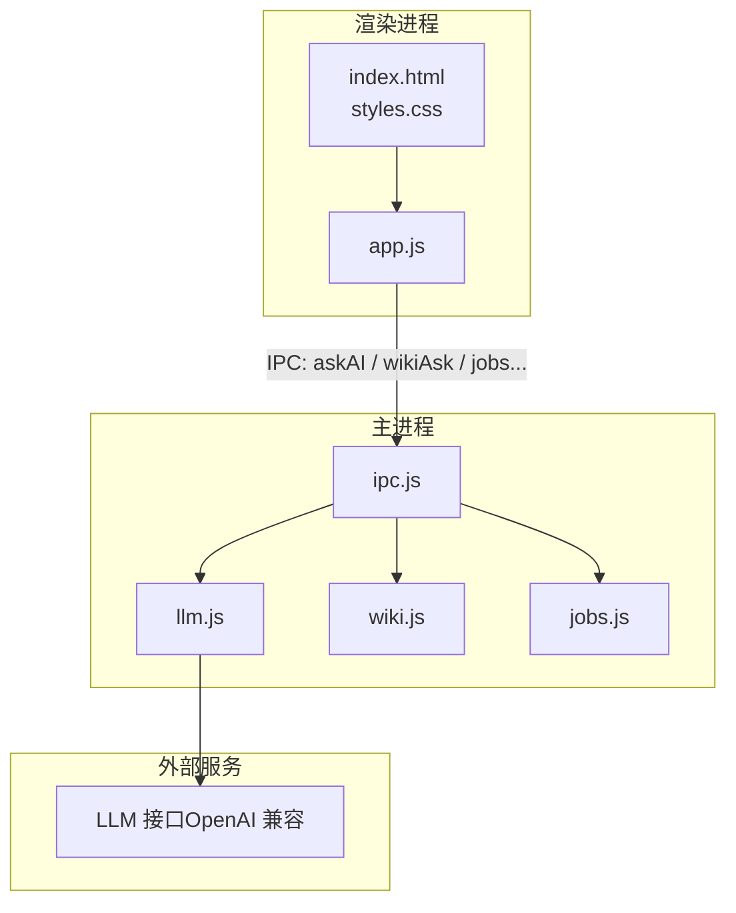
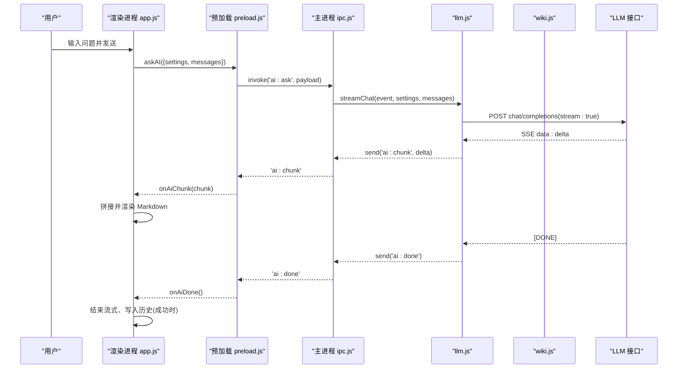
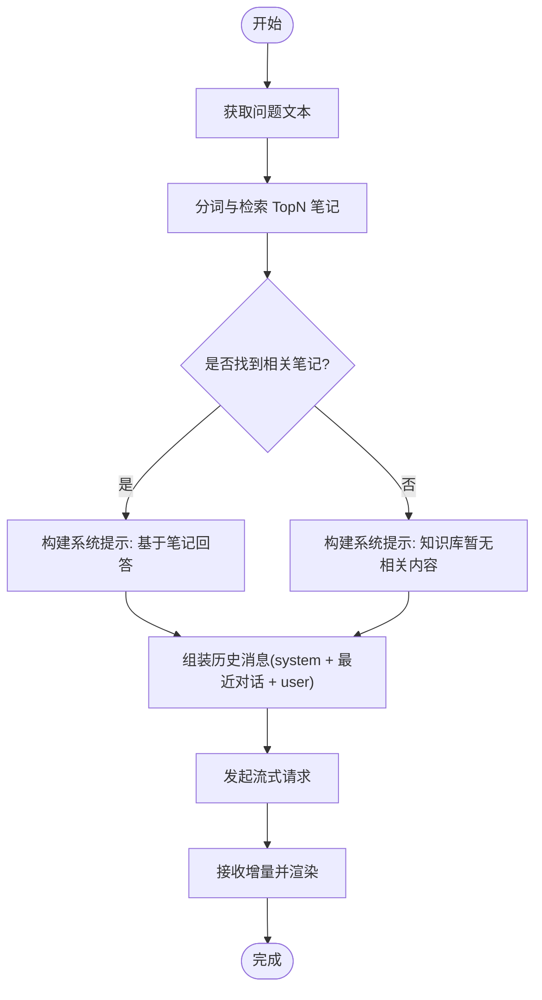
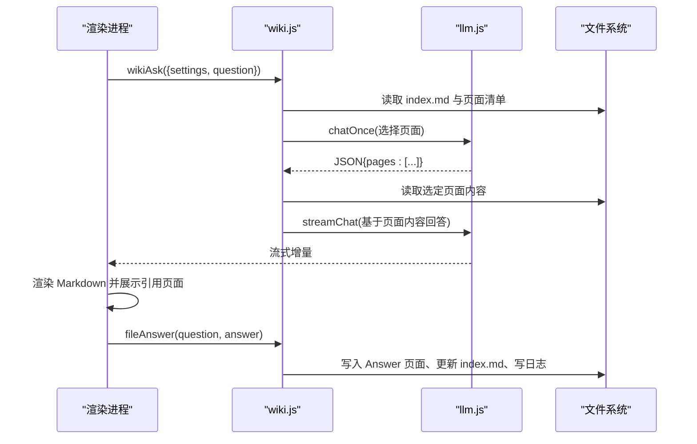
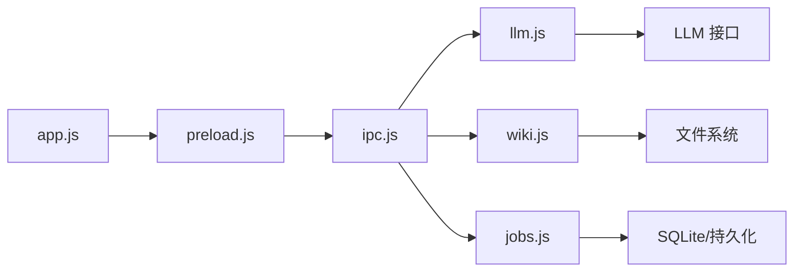

# AI 问答界面

<cite>
**本文引用的文件**
- [src/index.html](file://src/index.html)
- [src/styles.css](file://src/styles.css)
- [src/app.js](file://src/app.js)
- [preload.js](file://preload.js)
- [main.js](file://main.js)
- [src/main/ipc.js](file://src/main/ipc.js)
- [src/main/llm.js](file://src/main/llm.js)
- [src/main/wiki.js](file://src/main/wiki.js)
- [src/main/jobs.js](file://src/main/jobs.js)
- [src/main/config.js](file://src/main/config.js)
- [package.json](file://package.json)
</cite>

## 目录
1. [简介](#简介)
2. [项目结构](#项目结构)
3. [核心组件](#核心组件)
4. [架构总览](#架构总览)
5. [详细组件分析](#详细组件分析)
6. [依赖关系分析](#依赖关系分析)
7. [性能考虑](#性能考虑)
8. [故障排查指南](#故障排查指南)
9. [结论](#结论)
10. [附录：定制与个性化配置](#附录：定制与个性化配置)

## 简介
本文件面向“AI 智能问答”功能，系统性说明 AI 面板的布局设计、消息显示与输入交互、笔记问答与 Wiki 问答两种模式的切换逻辑、流式响应的展示效果、错误处理与重试机制、对话历史管理（清空对话）、关闭面板的实现方式，以及可定制的提示词模板、响应样式与交互行为。

## 项目结构
- 渲染层（前端）
  - HTML/CSS：定义应用骨架与 AI 面板 UI（侧边栏、分隔条、AI 面板、设置页等）。
  - JS：状态管理、事件绑定、Markdown 渲染、检索与流式响应组装、Wiki 阅读与回填、作业管理等。
- 主进程（Electron）
  - IPC 注册中心：统一暴露数据、AI、Wiki、作业等接口。
  - LLM 请求层：OpenAI 兼容接口的流式 SSE 解析与重试策略。
  - Wiki 领域层：根目录定位、页面读取/描述、来源保存、上下文打包、问答与体检、回填归档。
  - 作业管理：串行队列、阶段状态机、持久化与重试。
- 预加载脚本：通过 contextBridge 暴露 kb API 给渲染进程。

图表来源
- [src/index.html:10-223](file://src/index.html#L10-L223)
- [src/styles.css:400-479](file://src/styles.css#L400-L479)
- [src/app.js:408-549](file://src/app.js#L408-L549)
- [preload.js:1-56](file://preload.js#L1-L56)
- [src/main/ipc.js:45-82](file://src/main/ipc.js#L45-L82)
- [src/main/llm.js:40-77](file://src/main/llm.js#L40-L77)
- [src/main/wiki.js:193-233](file://src/main/wiki.js#L193-L233)
- [src/main/jobs.js:136-188](file://src/main/jobs.js#L136-L188)

章节来源
- [src/index.html:10-223](file://src/index.html#L10-L223)
- [src/styles.css:400-479](file://src/styles.css#L400-L479)
- [preload.js:1-56](file://preload.js#L1-L56)
- [src/main/ipc.js:45-82](file://src/main/ipc.js#L45-L82)

## 核心组件
- AI 面板 UI
  - 标题区：支持清空对话、关闭面板。
  - 模式切换：笔记问答 / Wiki 问答。
  - 提示文案：随模式变化。
  - 消息列表：用户消息、AI 助手消息、加载中三点动效、错误消息、参考来源。
  - 输入区：Enter 发送，Shift+Enter 换行。
- 流式响应
  - 后端以 SSE 流推送增量内容，前端实时拼接并渲染 Markdown。
  - 完成或错误时清理监听器并更新 UI。
- 模式切换
  - 笔记问答：本地分词检索 Top N 笔记作为上下文，调用通用流式对话。
  - Wiki 问答：先检索相关页面，再基于页面内容流式回答；支持引用页面跳转与回填归档。
- 对话历史
  - 仅成功完成的回答写入历史，避免污染后续上下文。
  - 清空对话会重置历史与消息列表。
- 面板显隐与宽度
  - 右侧 AI 面板可隐藏/显示，带拖拽分隔条调整宽度，宽度记忆在 localStorage。

章节来源
- [src/index.html:203-222](file://src/index.html#L203-L222)
- [src/styles.css:400-479](file://src/styles.css#L400-L479)
- [src/app.js:408-549](file://src/app.js#L408-L549)
- [src/app.js:974-1043](file://src/app.js#L974-L1043)
- [src/app.js:1256-1272](file://src/app.js#L1256-L1272)
- [src/app.js:1385-1433](file://src/app.js#L1385-L1433)

## 架构总览
AI 问答采用“渲染进程 + 主进程 IPC + 流式 SSE”的分层架构：
- 渲染进程负责 UI 与交互，维护对话历史与消息渲染。
- 主进程通过 IPC 路由到具体业务模块：
  - llm.js：OpenAI 兼容接口的流式请求、SSE 解析、重试策略。
  - wiki.js：Wiki 问答的两步检索（索引选页 → 综合回答），回填归档。
  - jobs.js：吸收与体检作业的串行执行与状态跟踪。
- 预加载脚本暴露统一的 kb API，屏蔽底层 IPC 细节。

图表来源
- [src/app.js:478-549](file://src/app.js#L478-L549)
- [preload.js:9-25](file://preload.js#L9-L25)
- [src/main/ipc.js:45-47](file://src/main/ipc.js#L45-L47)
- [src/main/llm.js:40-77](file://src/main/llm.js#L40-L77)

章节来源
- [src/app.js:478-549](file://src/app.js#L478-L549)
- [preload.js:9-25](file://preload.js#L9-L25)
- [src/main/ipc.js:45-47](file://src/main/ipc.js#L45-L47)
- [src/main/llm.js:40-77](file://src/main/llm.js#L40-L77)

## 详细组件分析

### AI 面板布局与交互
- 布局
  - 顶部标题区：包含“AI 智能问答”标题、清空对话按钮、关闭按钮。
  - 模式切换区：两个按钮分别对应“笔记问答”和“Wiki 问答”，当前激活态高亮。
  - 提示区：根据模式动态显示提示文案。
  - 消息区：滚动容器，承载用户与 AI 的消息气泡。
  - 输入区：多行文本框与发送按钮，支持 Enter 发送、Shift+Enter 换行。
- 交互
  - 打开/关闭面板：点击左下角“AI 问答”按钮打开，面板内关闭按钮隐藏面板。
  - 清空对话：清空历史消息与 aiHistory，便于重新开始。
  - 发送问题：校验非空后追加用户消息，进入发送流程。
  - 分隔条：AI 面板右侧有分隔条，可拖拽调整宽度，双击复位。

章节来源
- [src/index.html:203-222](file://src/index.html#L203-L222)
- [src/styles.css:400-479](file://src/styles.css#L400-L479)
- [src/app.js:1256-1272](file://src/app.js#L1256-L1272)
- [src/app.js:1385-1433](file://src/app.js#L1385-L1433)

### 笔记问答模式
- 检索策略
  - 对问题进行简单分词（英文单词 + 中文二元组），为每篇笔记打分（标题、标签、内容匹配权重不同），取 Top N 作为上下文。
- 提示词构造
  - 若检索到相关笔记：系统提示要求主要依据笔记内容回答，未命中则如实说明。
  - 若未检索到：使用通用提示，提示知识库暂无相关内容。
- 历史上下文
  - 将最近若干轮对话（含 system、user、assistant）一并发送给模型，限制长度以避免过长。
- 流式展示
  - 创建“思考中”占位消息，接收增量片段并即时渲染 Markdown，完成后移除加载态。
- 错误处理
  - 无内容时直接显示错误消息；已有内容时在末尾追加警告提示。

图表来源
- [src/app.js:408-549](file://src/app.js#L408-L549)

章节来源
- [src/app.js:408-549](file://src/app.js#L408-L549)

### Wiki 问答模式
- 两步检索
  - 第一步：基于 index.md 与页面清单，让模型选出最相关的若干页面（最多可配置）。
  - 第二步：加载所选页面内容，构建系统提示并要求基于页面内容回答，引用时使用链接格式。
- 引用页面展示
  - 当后端返回引用页面列表时，前端在消息下方展示可点击的“引用页面”芯片，点击可打开 Wiki 阅读器。
- 流式展示
  - 与笔记问答一致，接收增量并渲染 Markdown。
- 回填归档
  - 成功后提供“回填到 Wiki”按钮，将问答归档为 type: Answer 页面，并更新 index.md 与日志。
- 错误处理
  - 同笔记问答，无内容时显示错误，已有内容时追加警告。

图表来源
- [src/main/wiki.js:193-233](file://src/main/wiki.js#L193-L233)
- [src/app.js:974-1043](file://src/app.js#L974-L1043)

章节来源
- [src/main/wiki.js:193-233](file://src/main/wiki.js#L193-L233)
- [src/app.js:974-1043](file://src/app.js#L974-L1043)

### 流式响应与错误处理
- 流式实现
  - 后端使用 fetch 发起流式请求，逐行解析 SSE 的 data: 行，提取增量内容并通过 IPC 推送至渲染进程。
- 前端处理
  - 订阅 onAiChunk 事件，累积答案并渲染 Markdown；onAiDone 表示完成；onAiError 处理错误。
- 重试机制
  - 非流式编排步骤（如选择页面、体检报告生成）具备重试能力，针对网络异常、5xx、空返回等瞬时错误进行递归重试，客户端 4xx 错误不重试。
- 错误展示
  - 若无任何内容即失败，直接显示错误消息；若已有部分内容，则在末尾追加警告提示。

章节来源
- [src/main/llm.js:40-123](file://src/main/llm.js#L40-L123)
- [src/app.js:478-549](file://src/app.js#L478-L549)
- [src/app.js:974-1043](file://src/app.js#L974-L1043)

### 对话历史管理与清空
- 历史维护
  - 仅在成功完成时写入 aiHistory，避免残缺回答污染后续上下文。
  - 每次发送前将 system 提示与最近若干轮对话一起发送给模型。
- 清空对话
  - 清空 aiHistory 与消息列表，便于重新开启对话。

章节来源
- [src/app.js:478-549](file://src/app.js#L478-L549)
- [src/app.js:1262-1265](file://src/app.js#L1262-L1265)

### 关闭面板与宽度记忆
- 关闭面板
  - 点击关闭按钮隐藏 AI 面板与其分隔条。
- 宽度记忆
  - 分隔条拖拽调整宽度，宽度值保存在 localStorage，双击分隔条可复位默认宽度。

章节来源
- [src/app.js:1256-1261](file://src/app.js#L1256-L1261)
- [src/app.js:1385-1433](file://src/app.js#L1385-L1433)

## 依赖关系分析
- 渲染进程依赖
  - marked.min.js：Markdown 渲染。
  - styles.css：UI 样式。
  - app.js：业务逻辑与事件绑定。
- 主进程依赖
  - ipc.js：统一注册 IPC 处理器。
  - llm.js：流式请求与重试。
  - wiki.js：Wiki 问答、回填、体检。
  - jobs.js：作业队列与状态机。
  - config.js：数值与枚举配置解析。
- 外部依赖
  - OpenAI 兼容接口：chat/completions（stream:true）。
  - Electron：BrowserWindow、ipcMain/ipcRenderer、dialog。

图表来源
- [src/app.js:1435-1494](file://src/app.js#L1435-L1494)
- [preload.js:1-56](file://preload.js#L1-L56)
- [src/main/ipc.js:1-109](file://src/main/ipc.js#L1-L109)
- [src/main/llm.js:1-123](file://src/main/llm.js#L1-L123)
- [src/main/wiki.js:1-313](file://src/main/wiki.js#L1-L313)
- [src/main/jobs.js:1-260](file://src/main/jobs.js#L1-L260)

章节来源
- [src/main/ipc.js:1-109](file://src/main/ipc.js#L1-L109)
- [src/main/llm.js:1-123](file://src/main/llm.js#L1-L123)
- [src/main/wiki.js:1-313](file://src/main/wiki.js#L1-L313)
- [src/main/jobs.js:1-260](file://src/main/jobs.js#L1-L260)

## 性能考虑
- 流式渲染
  - 增量拼接与 Markdown 渲染在每次收到增量时执行，注意大量渲染可能带来 UI 卡顿；可在未来引入虚拟滚动或节流优化。
- 检索范围
  - 笔记问答检索 Top N 控制上下文大小，避免过长提示词导致响应变慢。
- 重试策略
  - 非流式步骤具备重试能力，但需合理设置重试次数与超时，避免长时间阻塞。
- 作业串行
  - Wiki 吸收与体检作业串行执行，避免并发写文件冲突，提升稳定性。

[本节为通用性能讨论，不直接分析具体文件]

## 故障排查指南
- 常见问题
  - 未配置 API Key：后端会返回错误消息，需在设置中填写 Base URL、API Key、模型名称。
  - 接口返回错误：后端会携带状态码与详情，前端显示错误消息。
  - 流式读取失败：捕获异常并上报错误。
  - Wiki 不存在：提示未找到 Wiki 目录，需在设置中指定根目录或创建工作目录。
- 排查步骤
  - 检查设置页中的接口地址、API Key、模型名称是否正确。
  - 查看作业管理页，确认吸收/体检作业是否成功。
  - 检查浏览器控制台与主进程日志，定位错误信息。

章节来源
- [src/main/llm.js:40-77](file://src/main/llm.js#L40-L77)
- [src/main/wiki.js:93-114](file://src/main/wiki.js#L93-L114)
- [src/app.js:1079-1163](file://src/app.js#L1079-L1163)

## 结论
AI 问答界面通过清晰的布局与交互设计，结合流式响应与稳健的错误处理，提供了良好的用户体验。笔记问答与 Wiki 问答两种模式满足不同场景需求，支持引用页面跳转与回填归档，增强了知识沉淀能力。通过设置页可灵活配置接口、重试次数、超时、引用页数等参数，满足个性化定制需求。

[本节为总结性内容，不直接分析具体文件]

## 附录：定制与个性化配置
- 提示词模板
  - 笔记问答系统提示：根据是否检索到相关笔记动态切换，强调基于笔记内容回答。
  - Wiki 问答系统提示：要求基于页面内容回答，并使用链接格式引用具体页面。
- 响应样式
  - 使用 Markdown 渲染，支持代码块、表格、引用块等；用户气泡与助手气泡样式区分明显。
- 交互行为
  - 模式切换：点击按钮切换笔记问答与 Wiki 问答，提示文案随之变化。
  - 快捷键：Enter 发送，Shift+Enter 换行；Ctrl+N 新建笔记，Ctrl+F 聚焦搜索。
  - 面板操作：打开/关闭面板、清空对话、拖拽调整宽度。
- 设置项
  - 接口地址、API Key、模型名称。
  - Wiki 根目录、默认折叠、数据文件位置。
  - 作业历史保留条数、失败重试次数、网页拉取超时、来源内容截断阈值。
  - Wiki 问答最大引用页数、日志展示行数。
  - 编辑器默认模式。

章节来源
- [src/app.js:498-506](file://src/app.js#L498-L506)
- [src/app.js:974-982](file://src/app.js#L974-L982)
- [src/app.js:1069-1163](file://src/app.js#L1069-L1163)
- [src/index.html:112-157](file://src/index.html#L112-L157)