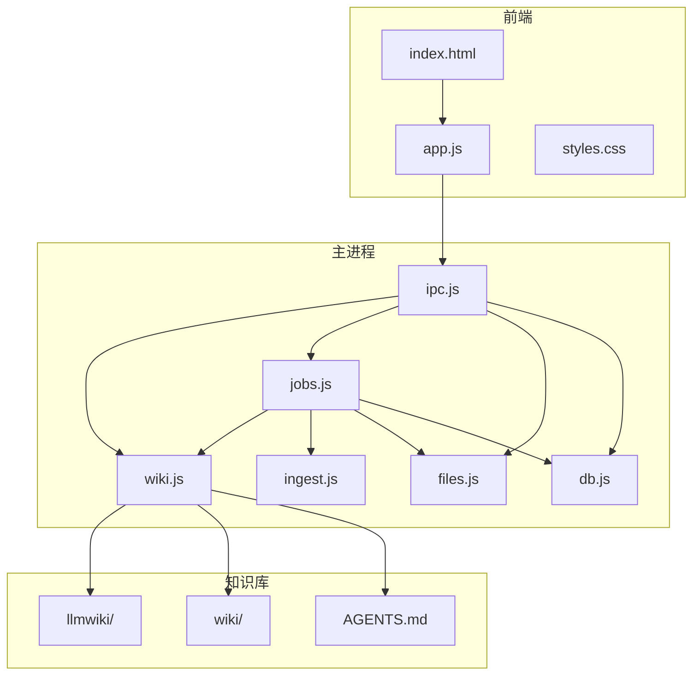
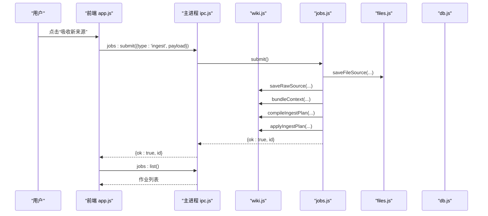
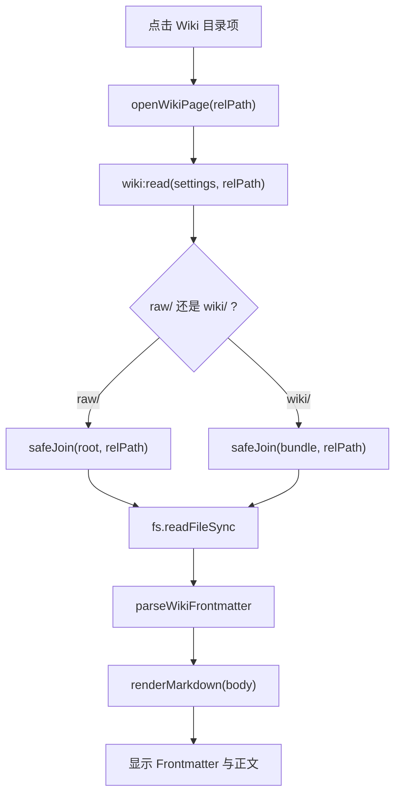
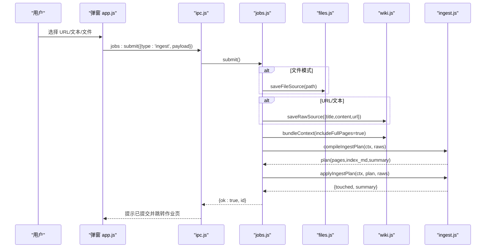
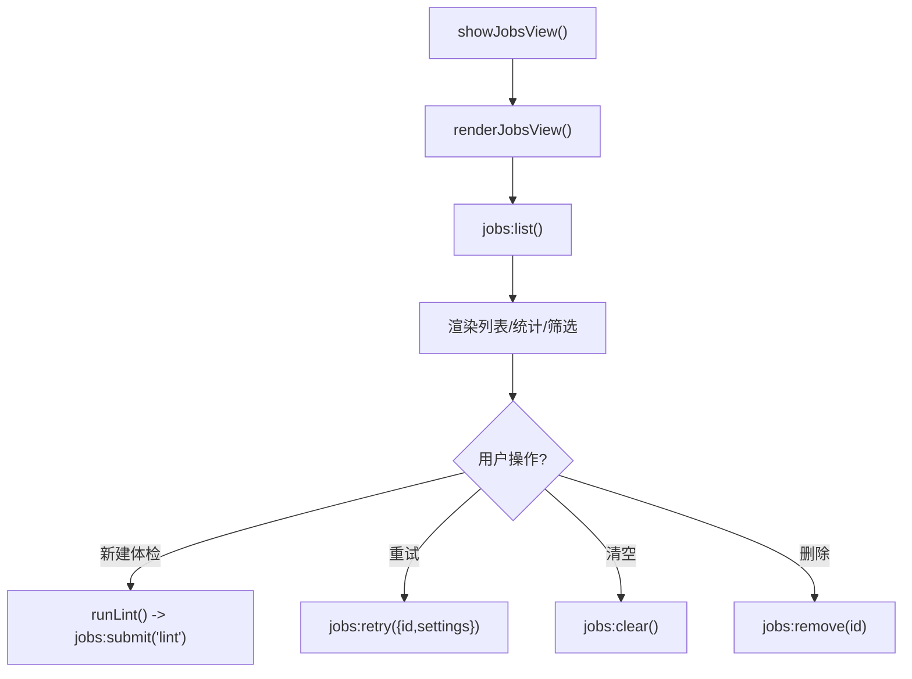
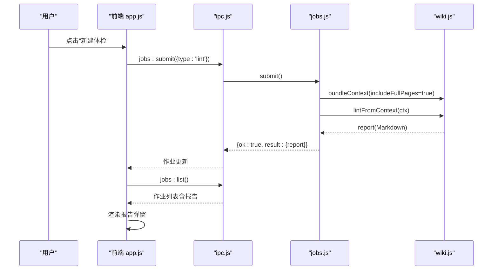
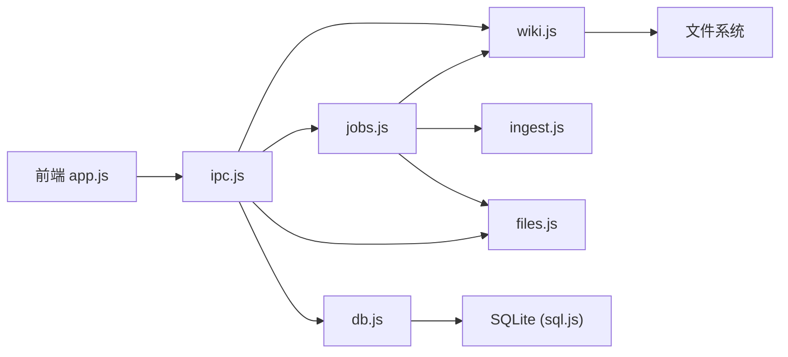

# Wiki 界面

<cite>
**本文引用的文件**
- [src/index.html](file://src/index.html)
- [src/app.js](file://src/app.js)
- [src/styles.css](file://src/styles.css)
- [src/main/wiki.js](file://src/main/wiki.js)
- [src/main/jobs.js](file://src/main/jobs.js)
- [src/main/ingest.js](file://src/main/ingest.js)
- [src/main/files.js](file://src/main/files.js)
- [src/main/ipc.js](file://src/main/ipc.js)
- [src/main/db.js](file://src/main/db.js)
- [llmwiki/AGENTS.md](file://llmwiki/AGENTS.md)
- [llmwiki/wiki/index.md](file://llmwiki/wiki/index.md)
</cite>

## 目录
1. [简介](#简介)
2. [项目结构](#项目结构)
3. [核心组件](#核心组件)
4. [架构总览](#架构总览)
5. [详细组件分析](#详细组件分析)
6. [依赖关系分析](#依赖关系分析)
7. [性能与可用性](#性能与可用性)
8. [故障排查指南](#故障排查指南)
9. [结论](#结论)
10. [附录：定制指南](#附录定制指南)

## 简介
本文档面向“Wiki 界面”的使用者与二次开发者，系统说明 Wiki 目录树、页面阅读器、作业管理界面的实现与交互；解释吸收来源弹窗（URL、文本粘贴、本地文件）的工作流程；说明 Wiki 体检报告的展示与交互方式；并提供 Wiki 目录结构、页面模板与报告格式的定制指导。

## 项目结构
- 前端 UI 由 index.html 提供布局，app.js 负责渲染、事件绑定与状态管理，styles.css 定义样式。
- 主进程能力通过 ipc.js 暴露 IPC 接口，调用 wiki.js、jobs.js、files.js、db.js 等模块完成文件系统操作、作业调度、数据持久化。
- llmwiki 为知识库根目录，包含模式层 AGENTS.md 与知识包 wiki/ 目录。

**图表来源**
- [src/index.html:1-291](file://src/index.html#L1-L291)
- [src/app.js:1-800](file://src/app.js#L1-L800)
- [src/main/ipc.js:1-109](file://src/main/ipc.js#L1-L109)
- [src/main/wiki.js:1-313](file://src/main/wiki.js#L1-L313)
- [src/main/jobs.js:1-260](file://src/main/jobs.js#L1-L260)
- [src/main/ingest.js:1-85](file://src/main/ingest.js#L1-L85)
- [src/main/files.js:1-102](file://src/main/files.js#L1-L102)
- [src/main/db.js:1-358](file://src/main/db.js#L1-L358)
- [llmwiki/AGENTS.md:1-127](file://llmwiki/AGENTS.md#L1-L127)

**章节来源**
- [src/index.html:1-291](file://src/index.html#L1-L291)
- [src/app.js:1-800](file://src/app.js#L1-L800)
- [src/styles.css:1-898](file://src/styles.css#L1-L898)
- [src/main/ipc.js:1-109](file://src/main/ipc.js#L1-L109)

## 核心组件
- Wiki 目录树与导航：侧边栏的 LLM Wiki 区块，支持折叠/展开、分组显示（导航、概念、来源、主题、实体），点击条目打开页面阅读器。
- Wiki 页面阅读器：顶部路径与工具栏，支持源码/渲染视图切换、Frontmatter 元信息展示、相对链接解析与跳转。
- 作业管理界面：独立页面，支持筛选（全部/进行中/成功/失败）、统计、新建体检、清空历史、重试失败作业、查看阶段时间线。
- 吸收来源弹窗：三种输入模式（网页 URL、粘贴文本、本地文件），统一提交到作业队列，分阶段反馈进度。
- 体检报告弹窗：Markdown 渲染的报告内容，支持滚动查看。

**章节来源**
- [src/index.html:35-45](file://src/index.html#L35-L45)
- [src/index.html:75-93](file://src/index.html#L75-L93)
- [src/index.html:161-173](file://src/index.html#L161-L173)
- [src/index.html:237-283](file://src/index.html#L237-L283)
- [src/app.js:551-678](file://src/app.js#L551-L678)
- [src/app.js:680-799](file://src/app.js#L680-L799)

## 架构总览
前端通过 app.js 调用 window.kb 暴露的 IPC 方法，主进程在 ipc.js 中注册处理器并委派给领域模块：
- Wiki 描述/读取：wiki.describe / wiki.read
- 问答流式：wiki.wikiAsk（两步检索 + 流式合成）
- 作业提交/列表/重试：jobs.submit / jobs.list / jobs.retry
- 文件选择/导出：dialog 与 fs 操作
- 设置与数据库迁移：db.setDbPath / store

**图表来源**
- [src/app.js:750-772](file://src/app.js#L750-L772)
- [src/main/ipc.js:84-105](file://src/main/ipc.js#L84-L105)
- [src/main/jobs.js:136-188](file://src/main/jobs.js#L136-L188)
- [src/main/files.js:77-99](file://src/main/files.js#L77-L99)
- [src/main/wiki.js:153-191](file://src/main/wiki.js#L153-L191)
- [src/main/ingest.js:22-82](file://src/main/ingest.js#L22-L82)

## 详细组件分析

### Wiki 目录树与页面阅读
- 目录树渲染：根据 describe 返回的 pages 分组显示，图标按 type 映射，当前选中高亮。
- 页面打开：读取 raw/ 或 wiki/ 下对应文件，解析 frontmatter 展示元信息，正文 Markdown 渲染。
- 相对链接：以当前页面为基准解析 href，避免跨目录越界。

**图表来源**
- [src/app.js:639-678](file://src/app.js#L639-L678)
- [src/main/wiki.js:84-114](file://src/main/wiki.js#L84-L114)

**章节来源**
- [src/app.js:578-678](file://src/app.js#L578-L678)
- [src/main/wiki.js:84-114](file://src/main/wiki.js#L84-L114)

### 搜索与导航
- 笔记搜索：标题、标签、内容加权评分排序，支持关键词高亮。
- 目录/标签过滤：按 folderId/tags 过滤列表。
- Wiki 导航：分组显示，支持折叠/展开，当前页高亮。

**章节来源**
- [src/app.js:120-163](file://src/app.js#L120-L163)
- [src/app.js:165-252](file://src/app.js#L165-L252)
- [src/app.js:561-604](file://src/app.js#L561-L604)

### 吸收来源弹窗（Ingest）工作流
- 输入模式：
  - 网页 URL：校验非空后提交作业。
  - 粘贴文本：校验非空后提交作业。
  - 本地文件：限制扩展名（PDF/DOCX/XLSX/PPTX/MD/TXT/CSV），支持拖拽与多选，去重与跳过不支持格式提示。
- 作业阶段：
  - 解析保存来源：文件转 Markdown 或网页抓取并清洗，写入 raw/。
  - AI 编译：将原始来源与现有 wiki 上下文打包，生成页面计划 JSON。
  - 落盘：创建/更新 wiki/ 页面，更新 index.md，追加 log.md。
- 状态反馈：弹窗内实时显示运行中/错误/成功，完成后跳转到作业页。

**图表来源**
- [src/app.js:680-772](file://src/app.js#L680-L772)
- [src/main/ipc.js:84-105](file://src/main/ipc.js#L84-L105)
- [src/main/jobs.js:136-188](file://src/main/jobs.js#L136-L188)
- [src/main/files.js:77-99](file://src/main/files.js#L77-L99)
- [src/main/wiki.js:153-191](file://src/main/wiki.js#L153-L191)
- [src/main/ingest.js:22-82](file://src/main/ingest.js#L22-L82)

**章节来源**
- [src/index.html:237-272](file://src/index.html#L237-L272)
- [src/app.js:680-772](file://src/app.js#L680-L772)
- [src/main/files.js:1-102](file://src/main/files.js#L1-L102)
- [src/main/ingest.js:1-85](file://src/main/ingest.js#L1-L85)

### 作业管理界面
- 视图切换：隐藏编辑器/设置/Wiki 阅读器，显示作业页。
- 列表渲染：按状态筛选，显示标题、进度、耗时、时间戳、阶段详情、错误信息。
- 操作：新建体检、清空历史、删除单条终态作业、重试失败作业（ingest 复用 rawPaths 跳过解析）。
- 实时更新：主进程通过 'jobs:update' 推送最新列表。

**图表来源**
- [src/app.js:783-799](file://src/app.js#L783-L799)
- [src/main/ipc.js:84-105](file://src/main/ipc.js#L84-L105)
- [src/main/jobs.js:190-259](file://src/main/jobs.js#L190-L259)

**章节来源**
- [src/index.html:75-93](file://src/index.html#L75-L93)
- [src/app.js:783-799](file://src/app.js#L783-L799)
- [src/main/jobs.js:1-260](file://src/main/jobs.js#L1-L260)

### Wiki 体检报告（Lint）
- 触发：作业页“新建体检”按钮。
- 执行：收集全库页面（含全文），AI 体检生成 Markdown 报告。
- 展示：弹窗内 Markdown 渲染，可滚动查看。
- 结果：作业阶段显示“报告完成”，字符数统计。

**图表来源**
- [src/app.js:774-781](file://src/app.js#L774-L781)
- [src/main/ipc.js:84-105](file://src/main/ipc.js#L84-L105)
- [src/main/jobs.js:176-188](file://src/main/jobs.js#L176-L188)
- [src/main/wiki.js:272-296](file://src/main/wiki.js#L272-L296)

**章节来源**
- [src/index.html:274-283](file://src/index.html#L274-L283)
- [src/app.js:774-781](file://src/app.js#L774-L781)
- [src/main/wiki.js:272-296](file://src/main/wiki.js#L272-L296)

## 依赖关系分析
- 前端依赖：marked.min.js（Markdown 渲染）、window.kb（IPC 封装）。
- 主进程依赖：
  - wiki.js：路径安全、页面读取/描述、上下文打包、问答/回填、体检。
  - jobs.js：串行队列、阶段状态机、历史持久化、重试。
  - ingest.js：来源加载、AI 编译、计划应用。
  - files.js：多格式文件解析与保存。
  - db.js：SQLite 存储、迁移、设置与作业历史。
  - ipc.js：统一注册 IPC 处理器。

**图表来源**
- [src/main/ipc.js:1-109](file://src/main/ipc.js#L1-L109)
- [src/main/jobs.js:1-260](file://src/main/jobs.js#L1-L260)
- [src/main/wiki.js:1-313](file://src/main/wiki.js#L1-L313)
- [src/main/ingest.js:1-85](file://src/main/ingest.js#L1-L85)
- [src/main/files.js:1-102](file://src/main/files.js#L1-L102)
- [src/main/db.js:1-358](file://src/main/db.js#L1-L358)

**章节来源**
- [src/main/ipc.js:1-109](file://src/main/ipc.js#L1-L109)
- [src/main/jobs.js:1-260](file://src/main/jobs.js#L1-L260)
- [src/main/wiki.js:1-313](file://src/main/wiki.js#L1-L313)

## 性能与可用性
- 作业串行执行：避免并发写 wiki 文件冲突，保证一致性。
- 超长来源截断：sourceMaxChars 控制提示词长度，防止模型处理过载。
- 网页拉取超时：urlFetchTimeout 秒，避免无响应站点阻塞流程。
- 数据库原子写入：整体导出 + 临时文件 rename，降低损坏风险。
- 前端渲染优化：Markdown 渲染使用 marked，搜索高亮仅对可见列表生效。

[本节为通用性能建议，不直接分析具体代码行]

## 故障排查指南
- 未找到 Wiki 目录：检查设置中的 Wiki 根目录是否正确，或在工作目录创建 llmwiki 并放置 AGENTS.md。
- 吸收失败：确认文件格式受支持；URL 是否可达；文本是否为空；作业页查看阶段错误详情。
- 体检报告为空：检查全库页面是否完整；日志尾部行数设置是否过小。
- 数据库切换失败：确保目标路径绝对且不存在同名文件；恢复默认时旧文件会改名留底。

**章节来源**
- [src/app.js:680-772](file://src/app.js#L680-L772)
- [src/main/jobs.js:215-259](file://src/main/jobs.js#L215-L259)
- [src/main/db.js:34-81](file://src/main/db.js#L34-L81)

## 结论
本 Wiki 界面通过清晰的前后端分层与作业队列机制，实现了从来源吸收到页面维护、再到健康检查的闭环。用户可通过直观的弹窗与作业页掌控全流程，同时具备高度可定制的目录结构与报告格式。

[本节为总结性内容，不直接分析具体代码行]

## 附录：定制指南

### 目录结构配置
- Wiki 根目录：可在设置中指定；默认自动探测应用目录或文档目录下的 llmwiki。
- 目录约定：raw/ 不可变，wiki/ 由 Agent 维护；遵循 AGENTS.md 的三层架构。
- 保留文件：index.md、log.md 不得用作概念文档。

**章节来源**
- [src/main/wiki.js:10-24](file://src/main/wiki.js#L10-L24)
- [llmwiki/AGENTS.md:5-23](file://llmwiki/AGENTS.md#L5-L23)
- [llmwiki/AGENTS.md:64-67](file://llmwiki/AGENTS.md#L64-L67)

### 页面模板与 Frontmatter
- OKF v0.2 约定：每个页面包含 YAML frontmatter（type/title/description/tags/status/generated/sources）。
- 类型词汇表：Source/Concept/Entity/Topic/Answer，分别对应不同目录与用途。
- 链接规范：优先使用 bundle 根相对路径；引用论断使用脚注归因。

**章节来源**
- [llmwiki/AGENTS.md:25-63](file://llmwiki/AGENTS.md#L25-L63)
- [llmwiki/AGENTS.md:68-77](file://llmwiki/AGENTS.md#L68-L77)

### 报告格式定制
- 体检报告：基于 AGENTS.md 约定的健康检查项（矛盾、陈旧、孤儿页、缺失引用、过期页面、下一步建议）。
- 日志格式：按日期分组，条目首词加粗标注动作类型（如 Ingest/Initialization）。

**章节来源**
- [llmwiki/AGENTS.md:98-118](file://llmwiki/AGENTS.md#L98-L118)
- [src/main/wiki.js:272-296](file://src/main/wiki.js#L272-L296)

### 作业参数与行为
- 最大历史记录：maxJobsHistory 控制作业历史条数。
- 失败重试：ingest 重试复用 rawPaths 跳过解析；lint 直接重新提交。
- 网页超时与截断：urlFetchTimeout/sourceMaxChars 影响吸收稳定性与性能。

**章节来源**
- [src/main/jobs.js:20-23](file://src/main/jobs.js#L20-L23)
- [src/main/jobs.js:236-259](file://src/main/jobs.js#L236-L259)
- [src/main/ingest.js:8-19](file://src/main/ingest.js#L8-L19)
- [src/main/wiki.js:162-165](file://src/main/wiki.js#L162-L165)