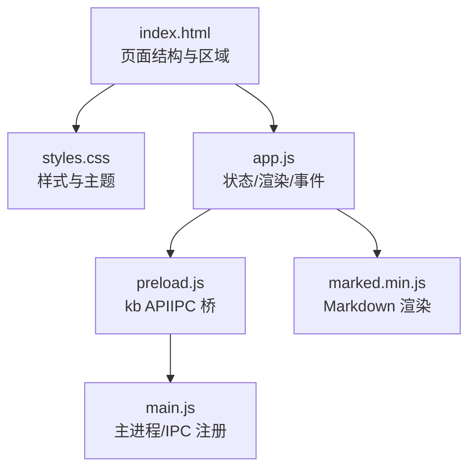
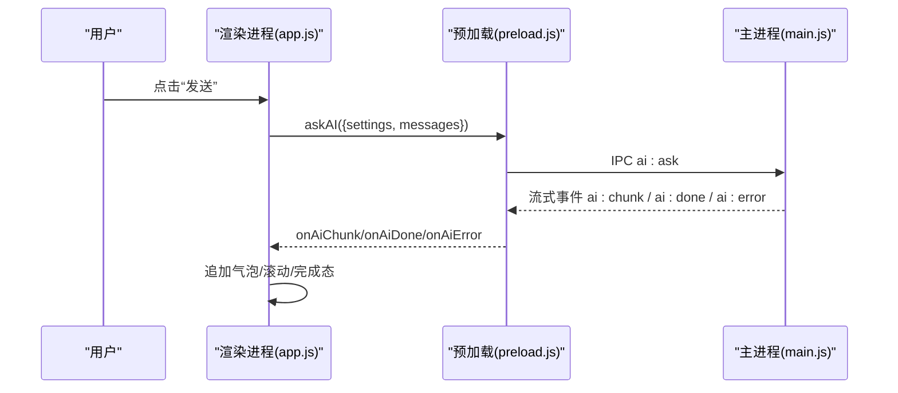
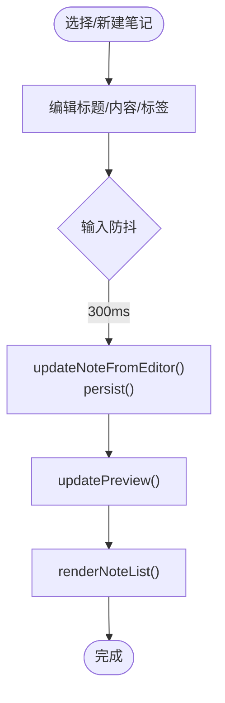
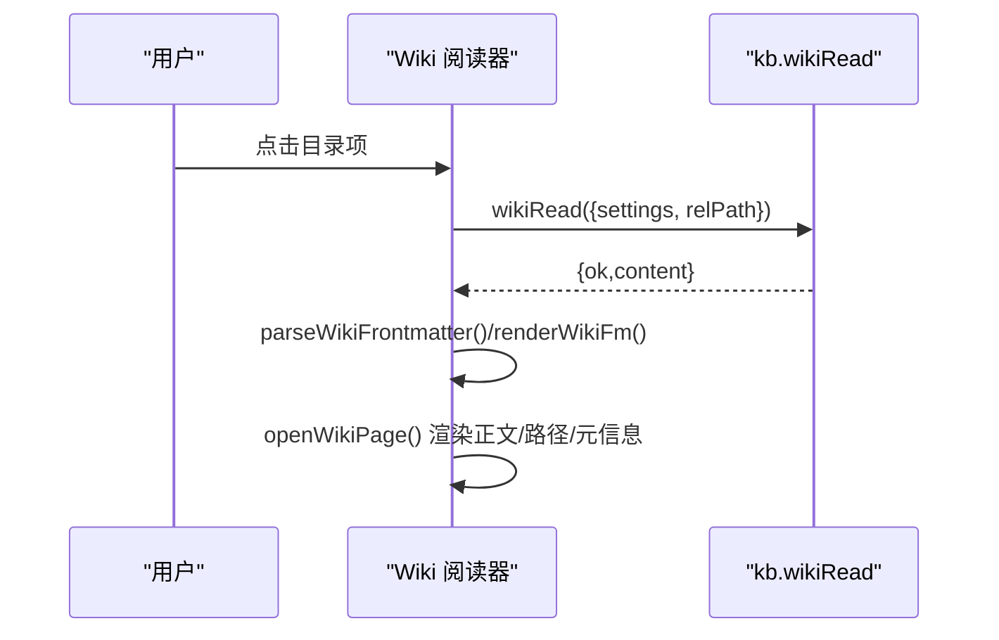
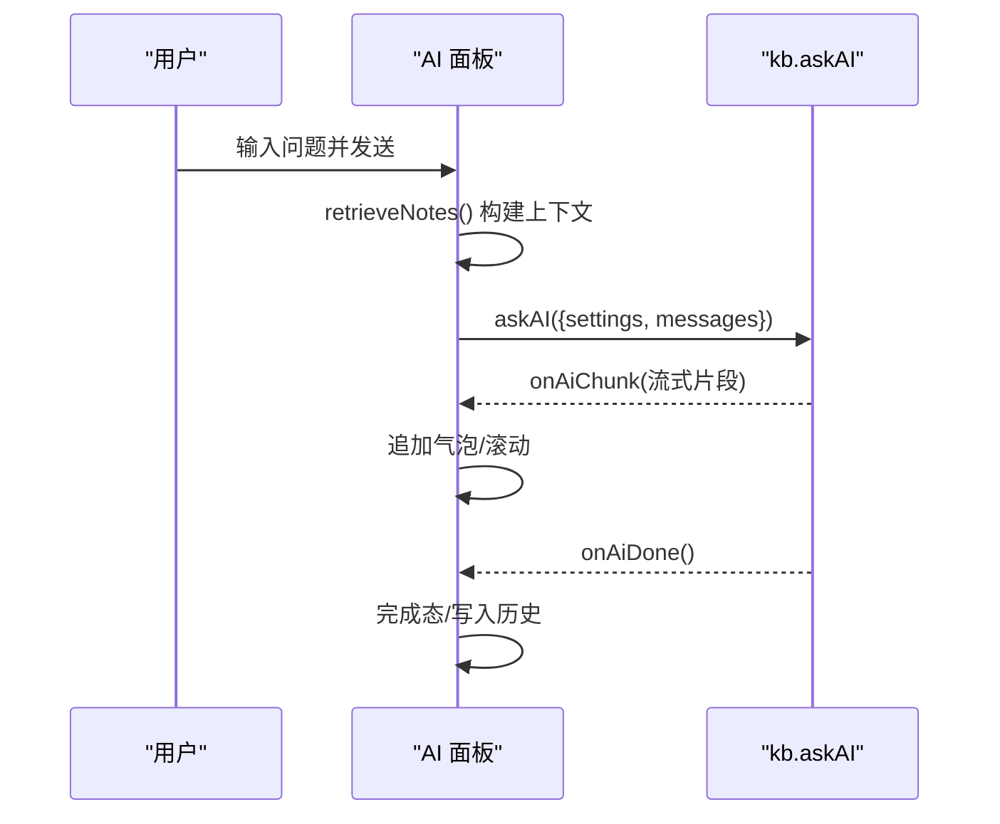
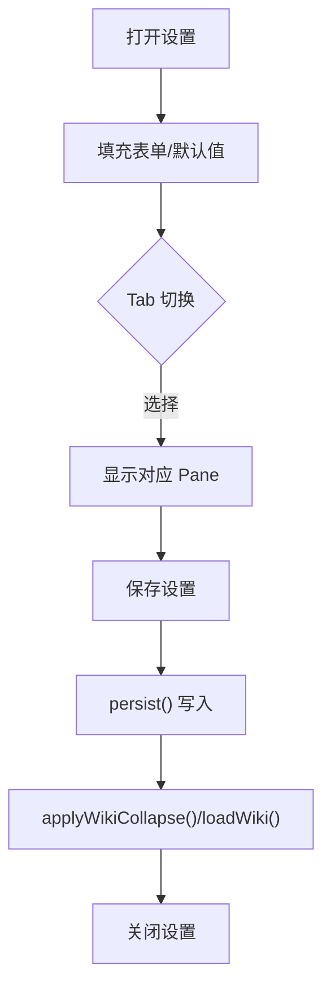
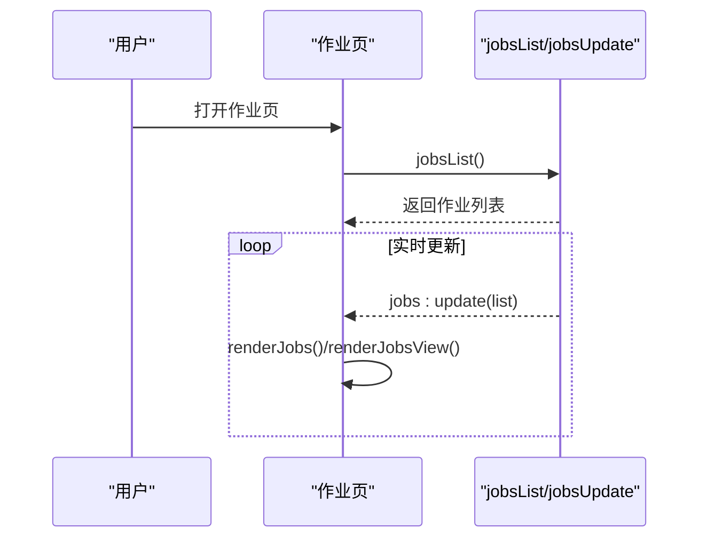

# 用户界面

<cite>
**本文引用的文件**
- [src/index.html](file://src/index.html)
- [src/styles.css](file://src/styles.css)
- [src/app.js](file://src/app.js)
- [preload.js](file://preload.js)
- [main.js](file://main.js)
- [package.json](file://package.json)
</cite>

## 目录
1. [简介](#简介)
2. [项目结构](#项目结构)
3. [核心组件](#核心组件)
4. [架构总览](#架构总览)
5. [详细组件分析](#详细组件分析)
6. [依赖关系分析](#依赖关系分析)
7. [性能与交互优化](#性能与交互优化)
8. [故障排查指南](#故障排查指南)
9. [结论](#结论)
10. [附录：定制与扩展指南](#附录定制与扩展指南)

## 简介
本文件面向“Synapse”个人知识库助手的用户界面，系统性说明前端界面的结构组织、样式系统与交互逻辑。重点覆盖四大界面：笔记管理界面、Wiki 浏览界面、AI 问答界面、设置管理界面；并解释 UI 状态管理、事件处理与用户交互流程，最后提供样式修改、组件复用与响应式设计的实践建议。

## 项目结构
- 入口与渲染
  - HTML 骨架与区域划分：侧边栏、分隔条、笔记列表、编辑器、Wiki 阅读器、作业页、设置页、AI 面板、弹窗等均在 index.html 中定义。
  - 样式系统：styles.css 使用 CSS 变量、Flexbox 布局、模块化类名，统一主题色、圆角、阴影与动画。
  - 交互逻辑：app.js 集中管理状态、渲染函数、事件绑定与业务流（笔记、Wiki、AI、作业、设置）。
- 进程间通信
  - preload.js 通过 contextBridge 暴露 kb API，封装 IPC 调用，供渲染进程安全访问主进程能力（数据存取、AI 流式问答、Wiki 操作、作业管理等）。
  - main.js 负责 Electron 窗口生命周期、初始化数据库、注册 IPC 处理器、启动应用。
- 依赖与构建
  - package.json 声明 Electron、打包工具与运行时依赖（如 marked、pdf-parse、xlsx 等），用于本地运行与打包。

图表来源
- [src/index.html:1-291](file://src/index.html#L1-L291)
- [src/styles.css:1-898](file://src/styles.css#L1-L898)
- [src/app.js:1-1494](file://src/app.js#L1-L1494)
- [preload.js:1-56](file://preload.js#L1-L56)
- [main.js:1-56](file://main.js#L1-L56)

章节来源
- [src/index.html:1-291](file://src/index.html#L1-L291)
- [src/styles.css:1-898](file://src/styles.css#L1-L898)
- [src/app.js:1-1494](file://src/app.js#L1-L1494)
- [preload.js:1-56](file://preload.js#L1-L56)
- [main.js:1-56](file://main.js#L1-L56)

## 核心组件
- 侧边栏导航
  - 功能：新建笔记、搜索、全部笔记、目录树、标签云、LLM Wiki 折叠区、设置与 AI 快捷入口。
  - 交互：点击导航项切换视图；目录支持重命名/删除；Wiki 区块可折叠；搜索实时过滤。
- 笔记列表
  - 功能：按文件夹/标签/搜索条件过滤；显示标题、摘要、更新时间、标签；支持置顶标记。
  - 交互：点击卡片选中并打开编辑器；搜索词高亮。
- 编辑器
  - 功能：标题、内容、标签、目录归属、时间戳；编辑/分屏/预览三种模式；导出为 Markdown。
  - 交互：输入防抖保存；模式切换即时更新预览；置顶/删除/导出按钮。
- Wiki 浏览
  - 功能：展示 Wiki 目录树；阅读页面（含 Frontmatter 元信息）；源码/渲染视图切换；相对链接跳转。
  - 交互：点击目录项打开页面；折叠/展开 Wiki 区块；吸收新来源；体检报告查看。
- 作业管理
  - 功能：统一跟踪吸收与体检任务进度；筛选（全部/进行中/成功/失败）；重试/删除/清空历史；阶段详情与耗时。
  - 交互：点击行展开详情；状态实时更新；统计信息刷新。
- 设置管理
  - 功能：AI 服务配置（Base URL、API Key、模型）、Wiki 存储路径、作业参数、问答参数、编辑器默认模式；数据文件迁移。
  - 交互：Tab 分类表单；数值范围钳制；保存后即时生效并刷新相关视图。
- AI 问答面板
  - 功能：基于笔记或 Wiki 的智能问答；流式输出；引用来源提示；回填到 Wiki。
  - 交互：发送问题、清空对话、切换模式（笔记/Wiki）；宽度可调。

章节来源
- [src/index.html:10-223](file://src/index.html#L10-L223)
- [src/app.js:165-1163](file://src/app.js#L165-L1163)
- [src/styles.css:96-898](file://src/styles.css#L96-L898)

## 架构总览
- 渲染层（HTML/CSS/JS）
  - 以 app.js 为中心的状态机驱动渲染：state 对象维护所有 UI 状态，renderAll() 协调各区域重绘。
  - 事件绑定集中在 bindEvents()，将 DOM 事件映射到业务方法。
- 通信层（preload.js）
  - 通过 contextBridge 暴露 kb API，封装 IPC 调用，实现数据持久化、AI 流式消息、Wiki 读取/问答、作业管理等。
- 主进程层（main.js + src/main/*）
  - 负责窗口创建、数据库初始化、IPC 注册、作业调度与文件系统操作。

图表来源
- [src/app.js:478-549](file://src/app.js#L478-L549)
- [preload.js:9-25](file://preload.js#L9-L25)
- [main.js:41-47](file://main.js#L41-L47)

章节来源
- [src/app.js:1-1494](file://src/app.js#L1-L1494)
- [preload.js:1-56](file://preload.js#L1-L56)
- [main.js:1-56](file://main.js#L1-L56)

## 详细组件分析

### 笔记管理界面
- 结构
  - 左侧导航：搜索框、全部笔记计数、目录树、标签云。
  - 中间列表：标题、摘要、更新时间、标签；空态提示。
  - 右侧编辑器：标题、模式切换、元信息（目录、标签、时间）、正文与预览。
- 状态与渲染
  - state.view 控制当前视图类型（all/folder/tag/search），getFilteredNotes() 计算列表并按置顶与更新时间排序。
  - renderNoteList() 生成卡片，highlight() 对搜索词进行高亮。
  - renderEditor() 根据 selectedNoteId 与当前页面（作业/设置/Wiki）决定显示区域。
- 交互流程
  - 新建：createNote() 插入新笔记并聚焦标题。
  - 编辑：输入防抖触发 updateNoteFromEditor()，自动保存并更新预览与列表。
  - 置顶/删除/导出：对应按钮事件直接修改 state 并持久化。
- 关键代码路径
  - [src/app.js:120-163](file://src/app.js#L120-L163)
  - [src/app.js:254-377](file://src/app.js#L254-L377)
  - [src/app.js:1173-1254](file://src/app.js#L1173-L1254)

图表来源
- [src/app.js:1220-1236](file://src/app.js#L1220-L1236)
- [src/app.js:349-368](file://src/app.js#L349-L368)
- [src/app.js:254-281](file://src/app.js#L254-L281)

章节来源
- [src/app.js:120-377](file://src/app.js#L120-L377)
- [src/index.html:56-197](file://src/index.html#L56-L197)
- [src/styles.css:189-350](file://src/styles.css#L189-L350)

### Wiki 浏览界面
- 结构
  - 侧边栏 Wiki 区块：目录树分组（导航/概念/来源/主题/实体），折叠/展开，吸收与问答入口。
  - 主区域 Wiki 阅读器：头部路径、Frontmatter 元信息、渲染正文、源码视图切换。
- 状态与渲染
  - loadWiki() 获取 Wiki 描述，renderWikiTree() 按分组渲染条目，openWikiPage() 读取并解析 Frontmatter。
  - parseWikiFrontmatter() 提取元信息，renderWikiFm() 渲染标签型元信息。
- 交互流程
  - 点击目录项打开页面；内部 Markdown 链接通过 resolveWikiPath() 解析相对路径并跳转。
  - 吸收弹窗支持 URL/文本/本地文件三种来源，提交作业后跳转到作业页跟踪。
- 关键代码路径
  - [src/app.js:551-678](file://src/app.js#L551-L678)
  - [src/app.js:680-781](file://src/app.js#L680-L781)
  - [src/app.js:1283-1310](file://src/app.js#L1283-L1310)

图表来源
- [src/app.js:639-657](file://src/app.js#L639-L657)
- [src/app.js:606-617](file://src/app.js#L606-L617)

章节来源
- [src/app.js:551-781](file://src/app.js#L551-L781)
- [src/index.html:35-45,161-173:35-45](file://src/index.html#L35-L45)
- [src/styles.css:615-708](file://src/styles.css#L615-L708)

### AI 问答界面
- 结构
  - 右侧可伸缩面板：模式切换（笔记/Wiki）、消息列表、输入区、清空/关闭按钮。
  - 消息气泡：用户/助手/错误三类；加载中三点动效；参考来源提示。
- 状态与渲染
  - sendAiQuestion() 检索相关笔记（retrieveNotes()），构造 systemPrompt 与 messages，调用 askAI()。
  - 流式接收 onAiChunk/onAiDone/onAiError，动态追加气泡并滚动到底部。
  - Wiki 问答模式：sendWikiQuestion() 订阅 onWikiRefs 显示引用页面，完成后提供“回填到 Wiki”按钮。
- 交互流程
  - Enter 发送，Shift+Enter 换行；清空对话重置历史；模式切换更新提示文案。
- 关键代码路径
  - [src/app.js:408-549](file://src/app.js#L408-L549)
  - [src/app.js:974-1064](file://src/app.js#L974-L1064)
  - [src/app.js:1256-1272](file://src/app.js#L1256-L1272)

图表来源
- [src/app.js:478-549](file://src/app.js#L478-L549)
- [src/app.js:984-1043](file://src/app.js#L984-L1043)

章节来源
- [src/app.js:408-549](file://src/app.js#L408-L549)
- [src/app.js:974-1064](file://src/app.js#L974-L1064)
- [src/index.html:200-223](file://src/index.html#L200-L223)
- [src/styles.css:400-479](file://src/styles.css#L400-L479)

### 设置管理界面
- 结构
  - Tab 分类：AI 服务、存储、作业、问答、编辑器；每个 Tab 对应一组表单字段。
  - 数据文件位置：支持迁移到新路径并立即生效。
- 状态与渲染
  - showSettingsView() 填充表单，readNumInput() 钳制数值范围，saveSettings() 合并 settings 并持久化。
  - applyWikiCollapse() 根据设置控制 Wiki 区块折叠状态。
- 交互流程
  - Tab 切换仅显示对应 pane；保存后刷新 Wiki 树与编辑器默认模式。
- 关键代码路径
  - [src/app.js:1066-1163](file://src/app.js#L1066-L1163)
  - [src/app.js:1274-1281](file://src/app.js#L1274-L1281)

图表来源
- [src/app.js:1079-1163](file://src/app.js#L1079-L1163)

章节来源
- [src/app.js:1066-1163](file://src/app.js#L1066-L1163)
- [src/index.html:95-159](file://src/index.html#L95-L159)
- [src/styles.css:510-588](file://src/styles.css#L510-L588)

### 作业管理界面
- 结构
  - 工具栏：筛选（全部/进行中/成功/失败）、统计、新建体检、清空历史、关闭。
  - 列表：每条作业卡片显示标题、状态、进度、时间、耗时；展开显示阶段详情、错误、摘要。
- 状态与渲染
  - renderJobsView() 计算统计并渲染卡片；buildJobCard()/buildJobDetail() 组装详情。
  - handleJobsUpdate() 监听主进程作业更新，成功后刷新 Wiki 树。
- 交互流程
  - 点击行展开/收起；失败作业支持重试；成功/失败作业支持删除；清空已完成历史。
- 关键代码路径
  - [src/app.js:783-972](file://src/app.js#L783-L972)
  - [src/app.js:1356-1366](file://src/app.js#L1356-L1366)

图表来源
- [src/app.js:810-839](file://src/app.js#L810-L839)
- [src/app.js:957-972](file://src/app.js#L957-L972)

章节来源
- [src/app.js:783-972](file://src/app.js#L783-L972)
- [src/index.html:75-93](file://src/index.html#L75-L93)
- [src/styles.css:748-808](file://src/styles.css#L748-L808)

## 依赖关系分析
- 模块耦合
  - app.js 高度内聚：状态、渲染、事件、业务逻辑集中在单一文件，便于维护但需注意职责拆分。
  - styles.css 通过 CSS 变量与类名解耦样式与结构，易于主题定制。
  - preload.js 作为 IPC 桥，屏蔽底层细节，降低渲染进程复杂度。
- 外部依赖
  - marked.min.js：Markdown 渲染，影响编辑器与 Wiki 阅读体验。
  - 主进程依赖：sql.js、pdf-parse、xlsx、mammoth、turndown、jszip 等用于文件解析与数据处理。
- 潜在风险
  - 单文件 app.js 较大，建议后续按功能拆分为模块（笔记、Wiki、AI、作业、设置）。
  - 大量 DOM 操作可能影响性能，需关注大数据量下的渲染优化（虚拟列表、增量更新）。

章节来源
- [src/app.js:1-1494](file://src/app.js#L1-L1494)
- [src/styles.css:1-898](file://src/styles.css#L1-L898)
- [preload.js:1-56](file://preload.js#L1-L56)
- [package.json:1-45](file://package.json#L1-L45)

## 性能与交互优化
- 输入防抖
  - 编辑器输入采用 300ms 防抖，减少频繁保存与渲染开销。
- 流式输出
  - AI 问答使用流式事件，提升响应速度与用户体验。
- 局部更新
  - 作业页与 Wiki 树在状态变化时仅更新受影响区域，避免全量重绘。
- 布局与拖拽
  - 分隔条支持拖拽调整宽度并记忆到 localStorage，双击复位默认宽度。
- 建议
  - 对长列表（笔记/作业）引入虚拟滚动或分页。
  - 对 Markdown 渲染结果缓存，避免重复解析。
  - 对大文件吸收/体检增加进度反馈与取消机制。

[本节为通用指导，不直接分析具体文件]

## 故障排查指南
- 常见问题
  - 无法打开 Wiki：检查设置中的 Wiki 根目录是否正确，或是否已创建 llmwiki 目录。
  - AI 无响应：确认 Base URL、API Key、模型名称配置正确；检查网络与接口可用性。
  - 作业失败：查看作业详情页的错误信息与阶段日志，必要时重试或清理历史。
- 定位方法
  - 使用浏览器控制台查看渲染进程日志（main.js 中已启用 console-message 转发）。
  - 通过作业页的“重试”与“报告”功能获取更多信息。
- 恢复步骤
  - 重置分隔条宽度：双击分隔条复位默认宽度。
  - 清空 AI 对话：点击清空按钮重置历史。
  - 迁移数据文件：在设置中修改数据文件路径并保存，确保迁移成功。

章节来源
- [src/app.js:1079-1163](file://src/app.js#L1079-L1163)
- [src/app.js:1256-1272](file://src/app.js#L1256-L1272)
- [src/app.js:1385-1433](file://src/app.js#L1385-L1433)
- [main.js:34-38](file://main.js#L34-L38)

## 结论
该用户界面以简洁清晰的三栏布局为核心，结合 Wiki 与 AI 能力，形成从知识录入、组织、检索到智能问答的完整闭环。通过集中状态管理与事件绑定，实现了高效的交互体验；借助样式系统与组件化结构，便于后续定制与扩展。建议在保持现有架构的基础上，逐步拆分模块、优化大数据渲染与错误反馈，以提升可维护性与性能。

[本节为总结性内容，不直接分析具体文件]

## 附录：定制与扩展指南
- 样式修改
  - 主题色与变量：通过 :root 中的 CSS 变量（--bg、--primary、--text 等）快速更换主题。
  - 组件样式：针对 .sidebar、.note-list-pane、.editor-pane、.ai-panel 等类名调整尺寸与间距。
  - 动画与反馈：利用 .toast、.ingest-status.running、.ai-loading.dots 等类增强反馈。
- 组件复用
  - 按钮与图标：复用 .btn、.btn-primary、.btn-ghost、.icon-btn 类，保持一致风格。
  - 弹窗与遮罩：复用 .modal-mask、.modal 结构，快速构建新的输入或确认弹窗。
  - 列表与卡片：复用 .note-card、.job-row-card 结构，适配不同数据源。
- 响应式设计考虑
  - 使用 Flexbox 与 min-width/max-width 限制，确保在不同屏幕尺寸下布局合理。
  - 对于小屏设备，可隐藏次要区域（如 Wiki 区块或 AI 面板），优先保留核心编辑与列表。
  - 拖拽分隔条已支持最小/最大宽度限制，可根据设备特性调整默认值。
- 扩展建议
  - 新增 Tab 或 Pane：在 index.html 中添加结构，在 app.js 中增加渲染与事件绑定。
  - 新增 IPC 能力：在 preload.js 中暴露新方法，并在主进程中注册对应处理器。
  - 自定义 Markdown 渲染：通过 marked.setOptions() 调整选项，或替换第三方库。

章节来源
- [src/styles.css:11-22](file://src/styles.css#L11-L22)
- [src/styles.css:64-95](file://src/styles.css#L64-L95)
- [src/styles.css:480-588](file://src/styles.css#L480-L588)
- [src/app.js:1435-1494](file://src/app.js#L1435-L1494)
- [preload.js:1-56](file://preload.js#L1-L56)