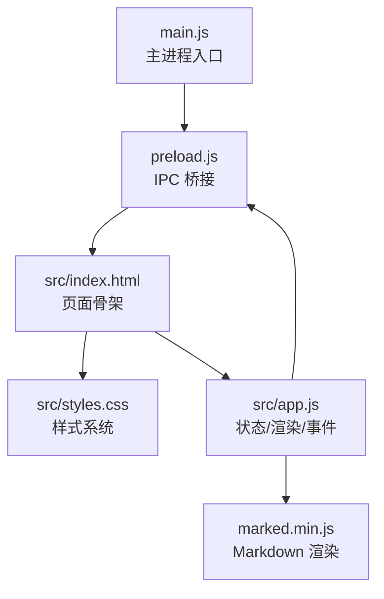
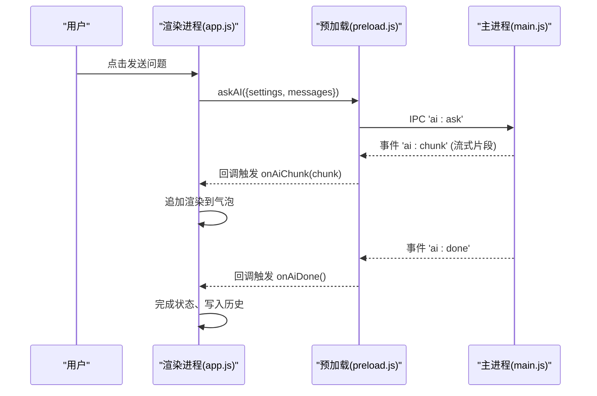
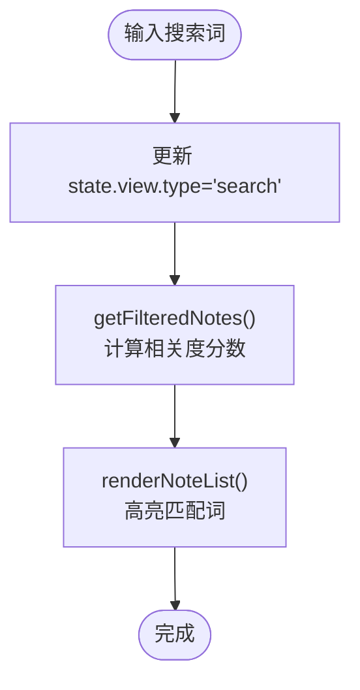
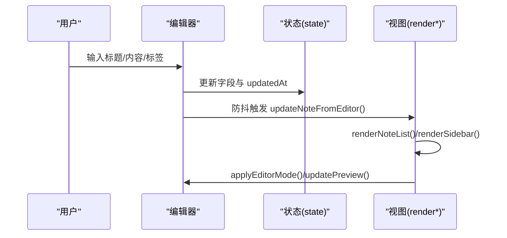
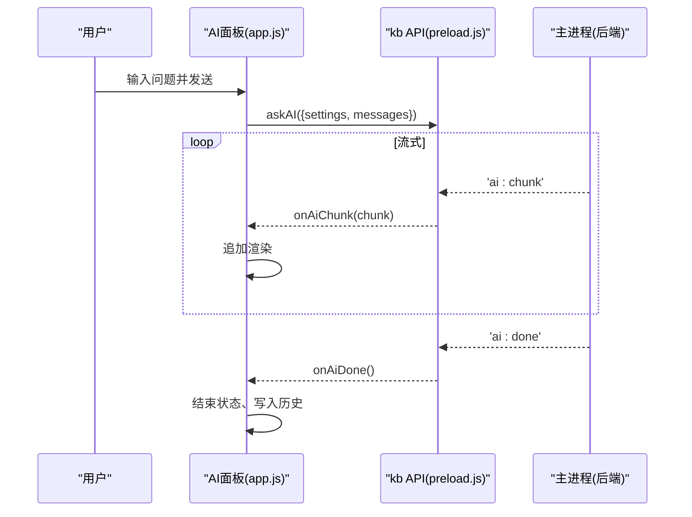
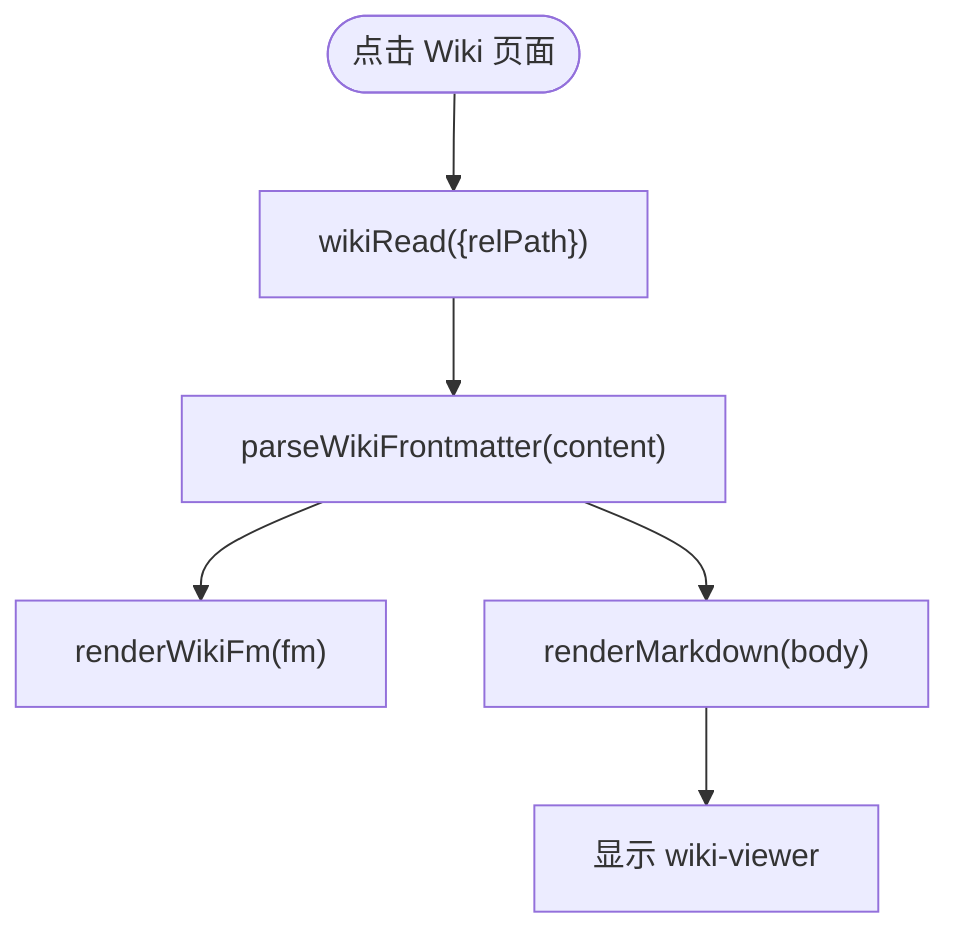
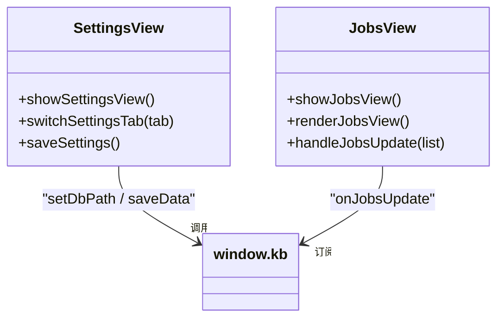
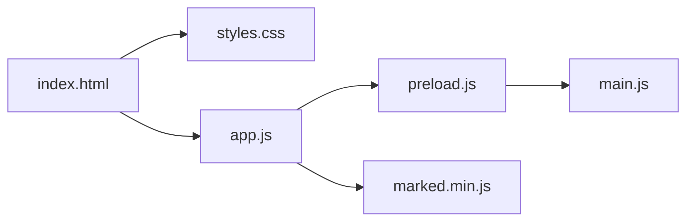

# 界面架构

<cite>
**本文引用的文件**
- [src/index.html](file://src/index.html)
- [src/styles.css](file://src/styles.css)
- [src/app.js](file://src/app.js)
- [preload.js](file://preload.js)
- [main.js](file://main.js)
- [package.json](file://package.json)
</cite>

## 目录
1. [简介](#简介)
2. [项目结构](#项目结构)
3. [核心组件](#核心组件)
4. [架构总览](#架构总览)
5. [详细组件分析](#详细组件分析)
6. [依赖关系分析](#依赖关系分析)
7. [性能与可访问性](#性能与可访问性)
8. [故障排查指南](#故障排查指南)
9. [结论](#结论)
10. [附录：扩展与定制实践](#附录：扩展与定制实践)

## 简介
本文件面向“Synapse”个人知识库助手的界面架构，系统性说明前端布局组织、样式系统、响应式策略、核心区域（侧边栏、笔记列表、编辑区、AI 面板、Wiki 阅读器、设置页、作业管理页）的布局与交互模式，并解释组件通信机制、状态管理与事件处理流程。文末提供界面扩展与定制的最佳实践，包括样式修改、组件复用与主题定制方法。

## 项目结构
- 入口与窗口
  - main.js：Electron 主进程入口，创建窗口、加载 src/index.html，初始化数据库与作业系统，注册 IPC 通道。
  - preload.js：通过 contextBridge 暴露 kb API，封装数据存取、AI 问答流式事件、Wiki 操作、作业管理等能力。
- 渲染层
  - src/index.html：应用骨架，包含侧边栏、分隔条、笔记列表、编辑区、AI 面板、设置页、作业管理页、Wiki 阅读器及若干弹窗。
  - src/styles.css：全局样式、主题变量、各区域样式、动画与滚动条等。
  - src/app.js：前端状态机、渲染函数、事件绑定、AI 检索与问答、Wiki 阅读与回填、作业管理 UI、拖拽调整面板宽度等。
- 构建与依赖
  - package.json：声明 Electron、打包工具、Markdown 解析库 marked 等依赖。

**图表来源**
- [main.js:19-47](file://main.js#L19-L47)
- [preload.js:1-55](file://preload.js#L1-L55)
- [src/index.html:1-291](file://src/index.html#L1-L291)
- [src/styles.css:11-39](file://src/styles.css#L11-L39)
- [src/app.js:1436-1494](file://src/app.js#L1436-L1494)

**章节来源**
- [main.js:1-56](file://main.js#L1-L56)
- [preload.js:1-56](file://preload.js#L1-L56)
- [src/index.html:1-291](file://src/index.html#L1-L291)
- [src/styles.css:1-898](file://src/styles.css#L1-L898)
- [src/app.js:1-1494](file://src/app.js#L1-L1494)
- [package.json:1-45](file://package.json#L1-L45)

## 核心组件
- 侧边栏（sidebar）
  - 功能：Logo、新建笔记、搜索框、全部笔记、多级目录树、标签云、LLM Wiki 折叠区块（含吸收/问答/作业入口）、设置与 AI 开关。
  - 布局：固定宽度，支持拖拽调整；内部使用 flex 纵向布局，导航区可滚动。
- 笔记列表（note-list-pane）
  - 功能：按当前视图（全部/目录/标签/搜索）展示卡片列表，显示标题、摘要、时间、标签。
  - 布局：固定宽度，支持拖拽调整；顶部标题与计数，内容区滚动。
- 编辑区（editor-pane）
  - 功能：标题输入、元信息（目录、标签、更新时间）、三种编辑器模式（编辑/分屏/预览）、导出/删除/置顶等操作。
  - 布局：flex 自适应剩余空间；工具栏、元信息栏、主体（textarea + preview）。
- AI 面板（ai-panel）
  - 功能：对话消息流、模式切换（笔记问答/Wiki 问答）、输入发送、清空、关闭；支持流式输出与引用来源提示。
  - 布局：右侧可显隐，宽度可调；头部、模式切换、提示、消息区、输入行。
- Wiki 阅读器（wiki-viewer）
  - 功能：读取 Markdown 页面，解析 frontmatter，渲染正文，支持源码/渲染视图切换，相对链接跳转。
  - 布局：头部路径与工具按钮，frontmatter 标签区，正文或源码区。
- 设置页（settings-view）
  - 功能：Tab 分类表单（AI 服务、存储、作业、问答、编辑器），保存时迁移数据库路径、数值范围钳制、默认编辑器模式等。
  - 布局：顶部 Tab 与标题，内容区多 pane 切换。
- 作业管理页（jobs-view）
  - 功能：作业列表、筛选（全部/进行中/成功/失败）、统计、重试/删除/清空历史、详情展开（阶段、耗时、错误、摘要）。
  - 布局：工具栏、过滤、统计、列表区。
- 通用弹窗
  - 输入弹窗、吸收来源弹窗、Lint 报告弹窗：遮罩+模态容器，统一样式与行为。

**章节来源**
- [src/index.html:10-223](file://src/index.html#L10-L223)
- [src/styles.css:96-898](file://src/styles.css#L96-L898)
- [src/app.js:165-1163](file://src/app.js#L165-L1163)

## 架构总览
- 分层与职责
  - 主进程（main.js）：生命周期、窗口、DB 初始化、作业系统、IPC 注册。
  - 预加载脚本（preload.js）：安全地暴露 kb API，封装 IPC 调用与事件订阅。
  - 渲染进程（index.html + styles.css + app.js）：UI 渲染、状态管理、事件处理、与主进程通信。
- 数据流
  - 用户操作 → app.js 状态变更 → 持久化（window.kb.saveData）→ 主进程写入 SQLite。
  - AI 问答：app.js 构造 messages → window.kb.askAI → 主进程流式返回 chunk/done/error → app.js 实时渲染。
  - Wiki 问答：app.js 调用 wikiAsk → onWikiRefs 动态显示引用 → onAiChunk/onAiDone/onAiError 渲染答案。
  - 作业：提交 jobsSubmit → onJobsUpdate 实时更新列表与 Wiki 树。
- 事件总线
  - 基于 ipcRenderer.on 的事件监听，app.js 在每次发送前清理旧监听，避免重复绑定。

**图表来源**
- [src/app.js:478-549](file://src/app.js#L478-L549)
- [preload.js:9-25](file://preload.js#L9-L25)
- [main.js:41-47](file://main.js#L41-L47)

**章节来源**
- [src/app.js:478-549](file://src/app.js#L478-L549)
- [preload.js:1-55](file://preload.js#L1-L55)
- [main.js:41-47](file://main.js#L41-L47)

## 详细组件分析

### 侧边栏与导航
- 布局策略
  - 使用 CSS 变量定义主题色与边框，侧边栏固定宽度，内部 flex 纵向布局，导航区可滚动。
  - 目录树递归渲染，支持重命名与删除；标签云按频次排序。
- 交互模式
  - 点击目录/标签切换视图；搜索框 input 事件即时更新视图与高亮。
  - Wiki 区块可折叠，状态持久化至 settings.wikiCollapsed。
- 关键实现要点
  - 视图状态 state.view 控制列表过滤与标题。
  - 搜索采用简单评分排序（标题权重最高，其次标签，最后内容）。

**图表来源**
- [src/app.js:120-163](file://src/app.js#L120-L163)
- [src/app.js:254-281](file://src/app.js#L254-L281)

**章节来源**
- [src/index.html:12-51](file://src/index.html#L12-L51)
- [src/styles.css:96-187](file://src/styles.css#L96-L187)
- [src/app.js:165-252](file://src/app.js#L165-L252)

### 笔记列表与编辑区
- 布局策略
  - 列表区固定宽度，卡片悬停高亮，选中项左侧强调线。
  - 编辑区占满剩余空间，工具栏与元信息栏固定高度，主体为 textarea 与 preview 并列（分屏模式）。
- 交互模式
  - 编辑输入防抖 300ms 后持久化并刷新列表与侧边栏。
  - 模式切换通过 editor-body 的 class 控制显示隐藏。
  - 置顶/导出/删除等按钮直接操作当前笔记并触发渲染。
- 状态管理
  - state.selectedNoteId 决定当前编辑对象。
  - 编辑器模式 state.editorMode 与 settings.defaultEditorMode 联动。

**图表来源**
- [src/app.js:349-368](file://src/app.js#L349-L368)
- [src/app.js:1220-1254](file://src/app.js#L1220-L1254)

**章节来源**
- [src/index.html:68-198](file://src/index.html#L68-L198)
- [src/styles.css:256-351](file://src/styles.css#L256-L351)
- [src/app.js:283-377](file://src/app.js#L283-L377)

### AI 面板与问答流程
- 布局策略
  - 右侧面板可显隐，宽度可调；消息区自动滚动到底部；用户消息右对齐，助手消息左对齐。
- 交互模式
  - 笔记问答：本地检索 TopN 笔记作为上下文，构造 systemPrompt 与 messages，流式渲染。
  - Wiki 问答：先获取引用页面（onWikiRefs），再流式渲染答案，完成后提供“回填到 Wiki”按钮。
- 事件处理
  - 发送前禁用按钮与锁定状态，防止重复提交。
  - 每次发送前清理旧监听器，避免内存泄漏与重复回调。

**图表来源**
- [src/app.js:478-549](file://src/app.js#L478-L549)
- [src/app.js:974-1043](file://src/app.js#L974-L1043)
- [preload.js:9-25](file://preload.js#L9-L25)

**章节来源**
- [src/index.html:200-223](file://src/index.html#L200-L223)
- [src/styles.css:400-479](file://src/styles.css#L400-L479)
- [src/app.js:408-549](file://src/app.js#L408-L549)
- [src/app.js:974-1064](file://src/app.js#L974-L1064)

### Wiki 阅读器与知识吸收
- 布局策略
  - 阅读器头部显示路径与工具按钮；frontmatter 以 chip 形式展示类型、状态、标签；正文支持源码/渲染切换。
- 交互模式
  - 点击 Wiki 树节点打开页面，解析 frontmatter 并渲染。
  - 支持相对链接跳转，基于当前页面路径解析。
  - 吸收来源弹窗支持 URL、文本、本地文件三种方式，提交后进入作业管理跟踪进度。
- 数据处理
  - parseWikiFrontmatter 提取 YAML 风格 frontmatter。
  - resolveWikiPath 解析相对路径，支持 .. 与根路径。

**图表来源**
- [src/app.js:606-657](file://src/app.js#L606-L657)
- [src/app.js:659-678](file://src/app.js#L659-L678)

**章节来源**
- [src/index.html:161-173](file://src/index.html#L161-L173)
- [src/styles.css:615-708](file://src/styles.css#L615-L708)
- [src/app.js:551-678](file://src/app.js#L551-L678)

### 设置页与作业管理页
- 设置页
  - Tab 分类切换不同表单区；数值输入进行范围钳制；保存时优先迁移数据库路径，随后保存其他设置。
  - 支持默认编辑器模式选择并立即生效。
- 作业管理页
  - 列表展示作业状态、进度、耗时；支持展开查看阶段详情、错误信息与摘要。
  - 筛选按钮切换 active 状态；实时更新来自 onJobsUpdate。

**图表来源**
- [src/app.js:1066-1163](file://src/app.js#L1066-L1163)
- [src/app.js:783-972](file://src/app.js#L783-L972)
- [preload.js:40-50](file://preload.js#L40-L50)

**章节来源**
- [src/index.html:95-159](file://src/index.html#L95-L159)
- [src/index.html:75-93](file://src/index.html#L75-L93)
- [src/styles.css:510-808](file://src/styles.css#L510-L808)
- [src/app.js:783-1163](file://src/app.js#L783-L1163)

## 依赖关系分析
- 模块耦合
  - app.js 强依赖 preload.js 暴露的 kb API；通过 IPC 与主进程解耦。
  - styles.css 通过 CSS 变量集中主题，降低样式耦合。
  - index.html 仅负责结构与 id 标识，逻辑集中在 app.js。
- 外部依赖
  - marked：Markdown 渲染，配置 breaks/gfm。
  - Electron：窗口、IPC、文件系统访问（通过主进程）。
- 潜在循环
  - 无直接循环依赖；事件监听在每次发送前清理，避免重复绑定导致的间接耦合。

**图表来源**
- [src/index.html:287-289](file://src/index.html#L287-L289)
- [preload.js:1-55](file://preload.js#L1-L55)
- [main.js:1-56](file://main.js#L1-L56)

**章节来源**
- [package.json:1-45](file://package.json#L1-L45)
- [src/app.js:1436-1494](file://src/app.js#L1436-L1494)

## 性能与可访问性
- 性能优化
  - 编辑器输入防抖 300ms，减少频繁持久化与渲染。
  - 搜索采用轻量评分算法，避免复杂 NLP。
  - 流式 AI 回答增量渲染，提升交互体验。
  - 面板宽度记忆 localStorage，避免重复计算初始布局。
- 可访问性建议
  - 为关键按钮添加 aria-label（如导出、删除、清空等）。
  - 确保键盘可达性（Enter 发送、Esc 关闭弹窗）。
  - 对比度与焦点可见性已在基础样式中考虑，可在主题定制时保持。

[本节为通用指导，不直接分析具体文件]

## 故障排查指南
- AI 问答无响应
  - 检查设置中的 Base URL、API Key、模型名称是否正确。
  - 确认主进程已正确注册 IPC，且未发生网络错误。
  - 查看控制台日志（main.js 已启用 console-message 转发）。
- 作业提交失败
  - 检查吸收来源弹窗是否填写了必要信息（URL/文本/文件）。
  - 查看作业详情页的错误信息与阶段状态，必要时重试。
- Wiki 无法打开
  - 确认设置了 Wiki 根目录或存在 llmwiki 目录。
  - 检查页面相对链接是否正确解析。

**章节来源**
- [src/app.js:1066-1163](file://src/app.js#L1066-L1163)
- [src/app.js:750-781](file://src/app.js#L750-L781)
- [main.js:34-38](file://main.js#L34-L38)

## 结论
该界面采用清晰的分层架构：主进程负责系统与数据，预加载脚本提供安全桥接，渲染进程专注 UI 与交互。通过 CSS 变量与模块化样式实现主题化，通过状态驱动渲染与事件总线实现松耦合通信。整体设计兼顾易用性与可扩展性，适合进一步定制与扩展。

[本节为总结，不直接分析具体文件]

## 附录：扩展与定制实践
- 样式修改
  - 主题定制：修改 :root 中的 CSS 变量（背景、面板、侧边栏、边框、文字、主色、危险色、圆角）。
  - 组件样式：针对 .sidebar、.note-list-pane、.editor-pane、.ai-panel 等类名微调尺寸与间距。
  - 动画与反馈：利用现有 @keyframes（loading dots、spin、toast-in）增强交互反馈。
- 组件复用
  - 按钮与图标：复用 .btn、.btn-primary、.btn-ghost、.icon-btn 类，保持一致的视觉语言。
  - 弹窗：复用 .modal-mask 与 .modal 结构，快速搭建新对话框。
  - 列表项：参考 .note-card、.job-row-card 的结构与状态类，扩展新的列表类型。
- 主题定制最佳实践
  - 新增主题：复制 :root 变量块，通过 data-theme 属性切换根元素，避免覆盖全局样式。
  - 保持对比度：确保主色与文字颜色满足可读性要求。
  - 渐进增强：在不破坏布局的前提下增加阴影、过渡等效果。
- 事件与状态扩展
  - 新增功能：在 app.js 中扩展 state，编写对应渲染函数，并在 bindEvents 中绑定事件。
  - 与主进程通信：通过 preload.js 暴露新的 kb 方法，遵循现有 IPC 命名规范。
  - 避免内存泄漏：每次发送前清理监听器（cleanupAiListeners），及时移除 DOM 事件。

[本节为通用指导，不直接分析具体文件]