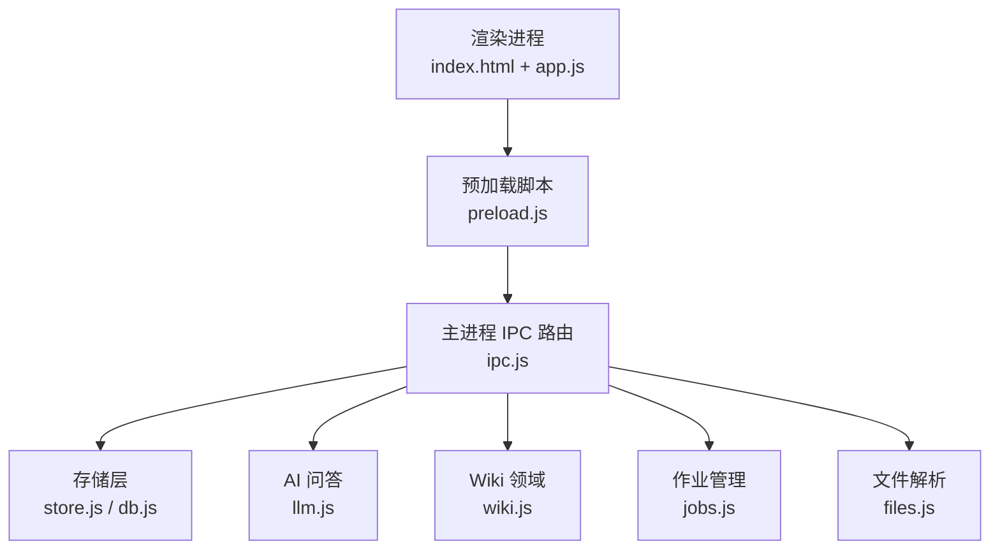
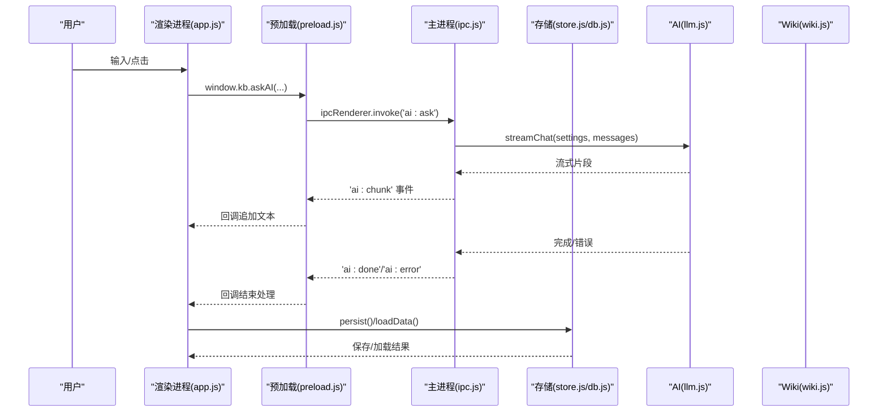
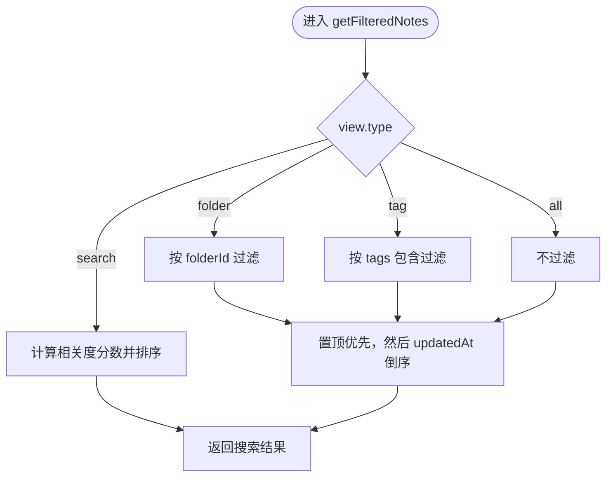
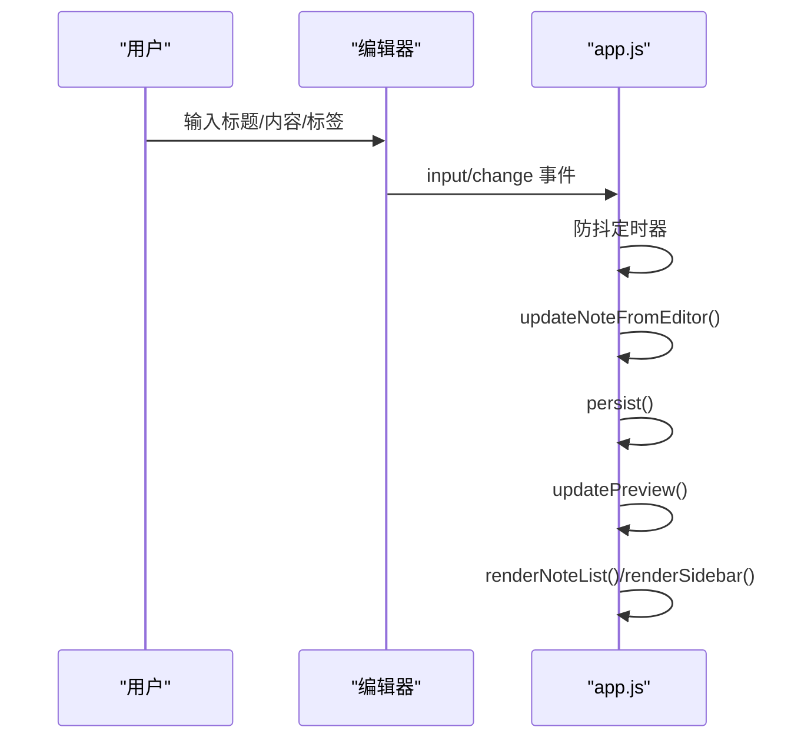

# 笔记界面

<cite>
**本文引用的文件**
- [src/index.html](file://src/index.html)
- [src/app.js](file://src/app.js)
- [src/styles.css](file://src/styles.css)
- [preload.js](file://preload.js)
- [main.js](file://main.js)
- [src/main/ipc.js](file://src/main/ipc.js)
- [src/main/store.js](file://src/main/store.js)
- [package.json](file://package.json)
</cite>

## 目录
1. [简介](#简介)
2. [项目结构](#项目结构)
3. [核心组件](#核心组件)
4. [架构总览](#架构总览)
5. [详细组件分析](#详细组件分析)
6. [依赖关系分析](#依赖关系分析)
7. [性能考虑](#性能考虑)
8. [故障排查指南](#故障排查指南)
9. [结论](#结论)
10. [附录：定制与扩展指南](#附录定制与扩展指南)

## 简介
本文件面向“笔记界面”的完整实现，覆盖以下能力：
- 笔记列表、编辑器、文件夹管理与标签系统
- 笔记创建、编辑、删除、搜索与筛选
- 分屏模式、预览模式、纯编辑模式的切换逻辑
- 置顶、导出、导入（吸收）等功能的实现路径
- 界面定制与扩展：自定义编辑器行为、快捷键配置、主题修改

该应用基于 Electron 构建，前端通过 preload 暴露安全 API，主进程负责数据持久化、AI 问答流式响应、Wiki 作业编排与文件操作。

## 项目结构
- 渲染层（UI）
  - HTML 布局：侧边栏、分隔条、笔记列表、编辑器、设置页、Wiki 阅读器、AI 面板、弹窗等
  - CSS 样式：主题变量、三栏布局、Markdown 渲染样式、作业管理页样式
  - JS 逻辑：状态管理、渲染、事件绑定、搜索/筛选、编辑器模式切换、AI 交互、Wiki 与作业管理
- 桥接层
  - preload：将主进程能力以 window.kb 暴露给渲染进程
- 主进程
  - main.js：窗口生命周期、初始化、IPC 注册
  - src/main/ipc.js：统一 IPC 路由，委托到 store/db、llm、wiki、jobs、files 等模块
  - src/main/store.js：对 SQLite 的封装读写
  - package.json：依赖与打包配置

图表来源
- [main.js:19-47](file://main.js#L19-L47)
- [src/main/ipc.js:12-106](file://src/main/ipc.js#L12-L106)
- [preload.js:3-55](file://preload.js#L3-L55)

章节来源
- [main.js:1-56](file://main.js#L1-L56)
- [src/main/ipc.js:1-109](file://src/main/ipc.js#L1-L109)
- [preload.js:1-56](file://preload.js#L1-L56)

## 核心组件
- 侧边栏导航
  - 全部笔记计数、搜索框、目录树、标签云、LLM Wiki 折叠区、设置/AI 入口
- 笔记列表
  - 按视图类型（全部/目录/标签/搜索）过滤与排序，支持高亮匹配
- 编辑器
  - 标题、内容、标签、目录选择、更新时间显示；三种模式（编辑/分屏/预览）
- 设置页
  - AI 服务、Wiki 存储、作业参数、编辑器默认模式、数据库路径迁移
- Wiki 阅读器
  - 页面元信息、源码/渲染视图切换、相对链接跳转
- AI 问答面板
  - 笔记问答与 Wiki 问答两种模式，流式输出、参考来源展示、回填归档
- 作业管理页
  - 吸收/体检作业提交、进度跟踪、阶段详情、重试/清理

章节来源
- [src/index.html:10-223](file://src/index.html#L10-L223)
- [src/app.js:166-377](file://src/app.js#L166-L377)
- [src/app.js:408-549](file://src/app.js#L408-L549)
- [src/app.js:551-790](file://src/app.js#L551-L790)
- [src/app.js:800-972](file://src/app.js#L800-L972)
- [src/app.js:1066-1163](file://src/app.js#L1066-L1163)

## 架构总览
- 数据流
  - 渲染进程维护 state（folders/notes/settings/view/editorMode 等），通过 persist() 防抖保存到主进程
  - 主进程通过 store.js 写入 SQLite，读取后返回渲染进程
- 交互流
  - 用户操作触发事件绑定函数，更新 state 并调用 renderAll() 重绘
  - AI 问答通过 ipcRenderer.invoke('ai:ask') 发起，主进程流式推送 ai:chunk/ai:done/ai:error
  - Wiki 相关操作通过 wiki:* IPC 路由到 wiki.js，支持描述、读取、问答、回填
  - 作业通过 jobs:* IPC 提交与查询，实时广播 jobs:update 刷新 UI

图表来源
- [src/app.js:478-549](file://src/app.js#L478-L549)
- [preload.js:9-25](file://preload.js#L9-L25)
- [src/main/ipc.js:45-47](file://src/main/ipc.js#L45-L47)

章节来源
- [src/app.js:107-118](file://src/app.js#L107-L118)
- [src/main/ipc.js:12-47](file://src/main/ipc.js#L12-L47)
- [src/main/store.js:8-14](file://src/main/store.js#L8-L14)

## 详细组件分析

### 笔记列表与搜索筛选
- 视图类型
  - all/folder/tag/search，通过 state.view 控制
- 过滤与排序
  - 搜索模式：标题权重最高，标签次之，内容最低；按相关度排序
  - 非搜索模式：置顶优先，再按更新时间倒序
- 渲染
  - 列表项包含标题、摘要、更新时间、标签；搜索时高亮匹配词

图表来源
- [src/app.js:120-152](file://src/app.js#L120-L152)

章节来源
- [src/app.js:120-152](file://src/app.js#L120-L152)
- [src/app.js:254-281](file://src/app.js#L254-L281)

### 编辑器与模式切换
- 模式
  - edit：仅编辑区
  - split：编辑+预览并排
  - preview：仅预览
- 切换逻辑
  - 通过 mode-switch 按钮切换 state.editorMode，applyEditorMode() 动态调整 class 与可见性
  - updatePreview() 在 split/preview 模式下渲染 Markdown
- 自动保存
  - 输入防抖 300ms 触发 updateNoteFromEditor()，持久化并刷新列表与侧边栏

图表来源
- [src/app.js:1220-1236](file://src/app.js#L1220-L1236)
- [src/app.js:349-368](file://src/app.js#L349-L368)
- [src/app.js:1247-1254](file://src/app.js#L1247-L1254)

章节来源
- [src/app.js:299-368](file://src/app.js#L299-L368)
- [src/app.js:1247-1254](file://src/app.js#L1247-L1254)

### 文件夹管理与标签系统
- 文件夹
  - 支持多级目录树，根节点无 parentId，子节点缩进显示
  - 重命名/删除：删除目录会将其下笔记移至未分类，并提升子目录父级
- 标签
  - 从所有笔记聚合生成标签云，点击可筛选对应标签的笔记
  - 标签计数实时更新

章节来源
- [src/app.js:166-252](file://src/app.js#L166-L252)
- [src/index.html:26-33](file://src/index.html#L26-L33)

### 置顶、导出、删除
- 置顶
  - 切换 note.pinned，影响排序与卡片前缀图标
- 导出
  - 调用 exportNote 打开系统保存对话框，导出为 .md/.txt
- 删除
  - 确认后从 notes 移除并刷新

章节来源
- [src/app.js:379-406](file://src/app.js#L379-L406)
- [src/app.js:1177-1192](file://src/app.js#L1177-L1192)
- [src/main/ipc.js:30-43](file://src/main/ipc.js#L30-L43)

### 搜索与高亮
- 搜索框输入触发 view 切换为 search，按标题/标签/内容加权评分
- 高亮使用 mark 包裹匹配片段，CSS 定义背景色

章节来源
- [src/app.js:1211-1218](file://src/app.js#L1211-L1218)
- [src/app.js:65-73](file://src/app.js#L65-L73)
- [src/styles.css:247](file://src/styles.css#L247)

### 分屏/预览/纯编辑模式
- 工具栏三个按钮分别设置 state.editorMode
- applyEditorMode() 切换 editor-body 的 mode-* 类名，控制编辑区与预览区显隐
- 默认模式来自设置 defaultEditorMode，首次启动或保存设置后生效

章节来源
- [src/app.js:341-354](file://src/app.js#L341-L354)
- [src/app.js:1067-1163](file://src/app.js#L1067-L1163)
- [src/styles.css:327-350](file://src/styles.css#L327-L350)

### 设置与主题
- 设置页 Tab 分类：AI 服务、存储、作业、问答、编辑器
- 数值字段带范围钳制，空值回退默认
- 主题通过 CSS 变量集中定义，便于全局换肤

章节来源
- [src/index.html:95-159](file://src/index.html#L95-L159)
- [src/app.js:1066-1163](file://src/app.js#L1066-L1163)
- [src/styles.css:11-22](file://src/styles.css#L11-L22)

### AI 问答（笔记与 Wiki）
- 笔记问答
  - 检索 TopN 相关笔记作为上下文，流式输出答案，失败时保留已接收内容并提示
- Wiki 问答
  - 先引用页面，再流式回答；支持一键回填到 Wiki
- 事件监听
  - onAiChunk/onAiDone/onAiError 由 preload 暴露，渲染进程订阅并清理

章节来源
- [src/app.js:408-549](file://src/app.js#L408-L549)
- [src/app.js:974-1064](file://src/app.js#L974-L1064)
- [preload.js:9-25](file://preload.js#L9-L25)
- [src/main/ipc.js:45-47](file://src/main/ipc.js#L45-L47)

### Wiki 阅读器与吸收/体检
- 阅读器
  - 解析 frontmatter，展示元信息；支持源码/渲染视图切换；相对链接解析跳转
- 吸收（Ingest）
  - 支持 URL/文本/本地文件三种来源；提交作业后在作业页查看阶段进度
- 体检（Lint）
  - 提交体检作业，成功后可查看报告

章节来源
- [src/app.js:551-790](file://src/app.js#L551-L790)
- [src/app.js:800-972](file://src/app.js#L800-L972)
- [src/main/ipc.js:48-82](file://src/main/ipc.js#L48-L82)

### 作业管理页
- 统计与筛选：全部/进行中/成功/失败
- 作业卡片：标题、进度、状态、耗时、时间线、阶段详情、错误信息
- 操作：重试、删除、清空历史

章节来源
- [src/app.js:800-972](file://src/app.js#L800-L972)
- [src/main/ipc.js:84-105](file://src/main/ipc.js#L84-L105)

## 依赖关系分析
- 渲染进程依赖
  - marked.min.js：Markdown 渲染
  - styles.css：主题与布局
  - preload.js 暴露的 window.kb：数据、AI、Wiki、作业、导出等能力
- 主进程依赖
  - sql.js：SQLite 存储
  - mammoth/pdf-parse/xlsx/jszip/turndown：文档解析与转换
  - electron：窗口、对话框、IPC

章节来源
- [package.json:36-43](file://package.json#L36-L43)
- [src/index.html:287-288](file://src/index.html#L287-L288)
- [preload.js:3-55](file://preload.js#L3-L55)

## 性能考虑
- 防抖保存：persist() 使用 400ms 延迟合并多次保存，降低 I/O 压力
- 编辑器输入防抖：300ms 合并更新，避免频繁重绘
- 搜索评分：限制内容匹配次数，避免过长字符串导致性能下降
- 流式 AI 响应：增量渲染，减少首屏等待
- 列表渲染：按需过滤与排序，避免全量 DOM 重建

[本节为通用指导，不直接分析具体文件]

## 故障排查指南
- 保存失败
  - 检查 persist() 中返回的 res.ok，若失败则 toast 提示错误信息
- AI 问答异常
  - 关注 onAiError 回调，若首次即失败会插入错误消息；否则在已有回答末尾追加警告
- Wiki 无法打开
  - 检查 settings.wikiRoot 是否正确，或工作目录是否存在 llmwiki
- 作业失败
  - 在作业详情页查看 error 与阶段详情，必要时重试

章节来源
- [src/app.js:107-118](file://src/app.js#L107-L118)
- [src/app.js:515-549](file://src/app.js#L515-L549)
- [src/app.js:639-657](file://src/app.js#L639-L657)
- [src/app.js:914-927](file://src/app.js#L914-L927)

## 结论
该笔记界面以清晰的三栏布局与模块化代码组织，实现了完整的笔记管理、Wiki 集成与 AI 问答能力。通过 IPC 解耦渲染与主进程，保证了安全性与可扩展性。结合设置页与主题变量，用户可以灵活定制编辑器行为与界面风格。

[本节为总结，不直接分析具体文件]

## 附录：定制与扩展指南

### 自定义编辑器行为
- 扩展输入事件
  - 在 bindEvents() 中为 note-title/note-content/note-tags 添加额外监听，例如自动补全、语法校验
- 自定义 Markdown 渲染
  - 修改 marked.setOptions 或替换 renderMarkdown 的实现，增加插件或自定义规则
- 模式切换增强
  - 在 applyEditorMode() 中根据模式注入额外元素或样式

章节来源
- [src/app.js:1220-1254](file://src/app.js#L1220-L1254)
- [src/app.js:57-63](file://src/app.js#L57-L63)

### 快捷键配置
- 内置快捷键
  - Ctrl+N：新建笔记
  - Ctrl+F：聚焦搜索框
- 扩展建议
  - 在 document.addEventListener('keydown') 中添加新组合键，注意与浏览器默认行为冲突

章节来源
- [src/app.js:1372-1382](file://src/app.js#L1372-L1382)

### 界面主题修改
- 使用 CSS 变量
  - :root 中的 --bg/--panel/--sidebar-bg/--border/--text/--primary 等变量集中控制配色
- 局部样式
  - 针对特定组件（如 AI 面板、作业页）可在 styles.css 中新增或覆盖样式

章节来源
- [src/styles.css:11-22](file://src/styles.css#L11-L22)
- [src/styles.css:400-800](file://src/styles.css#L400-L800)

### 数据与存储
- 数据迁移
  - 设置页支持切换 SQLite 文件位置，内部调用 setDbPath 进行整库迁移
- 导出格式
  - 支持 .md/.txt，可通过 dialog:export 扩展更多格式

章节来源
- [src/app.js:1128-1163](file://src/app.js#L1128-L1163)
- [src/main/ipc.js:27-43](file://src/main/ipc.js#L27-L43)

### 与后端/外部系统集成
- AI 服务
  - 在设置页配置 Base URL、API Key、模型名称，兼容 OpenAI 接口格式
- Wiki 集成
  - 指定 Wiki 根目录，支持吸收网页/文本/文件，并通过作业系统异步处理

章节来源
- [src/app.js:1066-1163](file://src/app.js#L1066-L1163)
- [src/main/ipc.js:48-82](file://src/main/ipc.js#L48-L82)