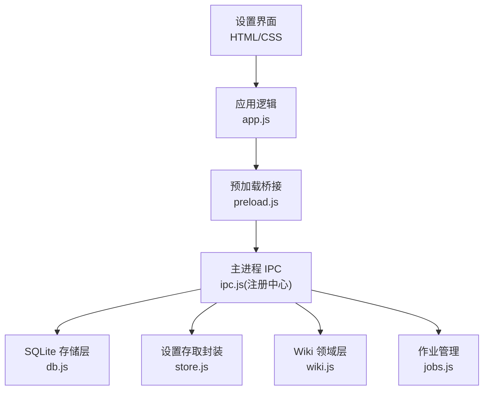
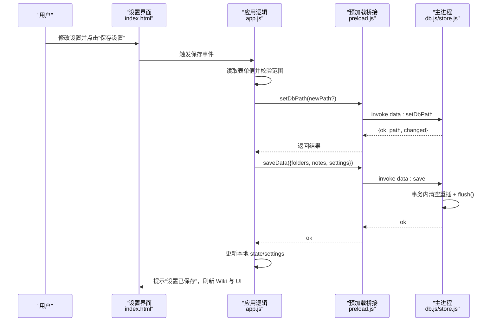
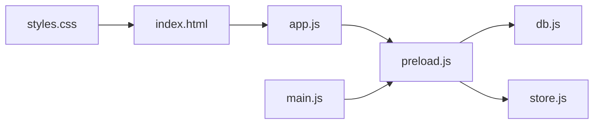

# 设置界面

<cite>
**本文引用的文件**
- [src/index.html](file://src/index.html)
- [src/app.js](file://src/app.js)
- [src/main/db.js](file://src/main/db.js)
- [src/main/store.js](file://src/main/store.js)
- [preload.js](file://preload.js)
- [main.js](file://main.js)
- [src/styles.css](file://src/styles.css)
</cite>

## 目录
1. [简介](#简介)
2. [项目结构](#项目结构)
3. [核心组件](#核心组件)
4. [架构总览](#架构总览)
5. [详细组件分析](#详细组件分析)
6. [依赖关系分析](#依赖关系分析)
7. [性能与可靠性](#性能与可靠性)
8. [故障排查](#故障排查)
9. [结论](#结论)
10. [附录：扩展指南](#附录：扩展指南)

## 简介
本文件面向“设置界面”的完整说明，覆盖 Tab 分类设计、表单布局、AI 服务配置、Wiki 存储设置、作业参数、问答选项、编辑器设置等。文档同时解释配置的验证规则、保存机制、生效方式，以及数据路径切换、数据库迁移与备份恢复能力，并提供扩展指导（新增配置项、验证规则、导入导出）。

## 项目结构
设置界面由渲染层 HTML/CSS/JS 与主进程持久化模块共同实现：
- 渲染层负责展示设置面板、Tab 切换、表单读取与提交、前端校验与提示。
- 主进程通过 IPC 暴露数据存取、数据库路径切换、Wiki 描述与读取、作业管理等能力。
- 数据存储基于 SQLite（sql.js），支持原子落盘与旧 JSON 数据迁移。

图表来源
- [src/index.html:95-159](file://src/index.html#L95-L159)
- [src/app.js:1066-1163](file://src/app.js#L1066-L1163)
- [preload.js:1-56](file://preload.js#L1-L56)
- [src/main/db.js:1-358](file://src/main/db.js#L1-L358)
- [src/main/store.js:1-17](file://src/main/store.js#L1-L17)

章节来源
- [src/index.html:95-159](file://src/index.html#L95-L159)
- [src/app.js:1066-1163](file://src/app.js#L1066-L1163)
- [preload.js:1-56](file://preload.js#L1-L56)
- [src/main/db.js:1-358](file://src/main/db.js#L1-L358)
- [src/main/store.js:1-17](file://src/main/store.js#L1-L17)

## 核心组件
- 设置视图与 Tab：在页面中以五个 Tab 组织不同类别的配置项，点击切换显示对应表单区。
- 表单字段与校验：数值型字段在前端进行范围钳制；缺失或非法值将被删除，交由主进程回退默认值。
- 保存流程：先处理数据文件路径切换（必要时迁移），再合并并持久化设置到 SQLite。
- 生效方式：保存后即时更新 UI（如编辑器模式）、刷新 Wiki 树、应用折叠状态等。

章节来源
- [src/index.html:95-159](file://src/index.html#L95-L159)
- [src/app.js:1066-1163](file://src/app.js#L1066-L1163)
- [src/main/db.js:223-266](file://src/main/db.js#L223-L266)

## 架构总览
设置界面的交互链路如下：用户编辑表单 → 点击保存 → 前端校验与取值 → 调用 IPC 切换数据库路径（可选）→ 保存设置到 store → 主进程写入 SQLite → 返回结果并刷新 UI。

图表来源
- [src/app.js:1128-1163](file://src/app.js#L1128-L1163)
- [preload.js:1-56](file://preload.js#L1-L56)
- [src/main/db.js:251-266](file://src/main/db.js#L251-L266)

## 详细组件分析

### 设置面板 Tab 分类与表单布局
- 五个 Tab：AI 服务、存储、作业、问答、编辑器。
- 每个 Tab 对应一个表单区域，仅当前 Tab 可见，其余隐藏。
- 底部显示当前数据文件路径与保存按钮。

章节来源
- [src/index.html:95-159](file://src/index.html#L95-L159)
- [src/styles.css:520-560](file://src/styles.css#L520-L560)

### AI 服务配置
- 字段：接口地址(Base URL)、API Key、模型名称。
- 用途：供 AI 问答与 Wiki 问答使用，兼容 OpenAI 格式。
- 验证：字符串类型，允许为空；空值时由后端回退默认行为。
- 生效：保存后立即用于后续 AI 请求。

章节来源
- [src/index.html:112-120](file://src/index.html#L112-L120)
- [src/app.js:1079-1095](file://src/app.js#L1079-L1095)
- [src/app.js:1140-1144](file://src/app.js#L1140-L1144)

### Wiki 存储设置
- 字段：
  - Wiki 根目录：留空则自动探测；可手动指定绝对路径。
  - 默认折叠 Wiki 目录树：布尔开关，影响侧边栏 Wiki 区块初始展开状态。
  - 数据文件位置（SQLite）：支持切换到新路径，保存时执行整库迁移。
- 验证：
  - 路径必须为绝对路径；目标存在且非当前路径时会拒绝覆盖。
  - 恢复默认位置时，若默认文件存在会改名留底，避免新旧混淆。
- 生效：
  - 切换成功后立即更新当前数据库指针，后续读写均在新路径生效。
  - 保存设置后刷新 Wiki 树，确保索引与页面列表同步。

章节来源
- [src/index.html:121-128](file://src/index.html#L121-L128)
- [src/app.js:1084-1094](file://src/app.js#L1084-L1094)
- [src/app.js:1128-1138](file://src/app.js#L1128-L1138)
- [src/main/db.js:21-81](file://src/main/db.js#L21-L81)
- [src/main/db.js:151-177](file://src/main/db.js#L151-L177)

### 作业参数
- 字段：
  - 作业历史保留条数：限制作业历史长度，防止无限增长。
  - 失败重试次数：网络/5xx 等瞬时错误自动重试次数。
  - 网页拉取超时（秒）：控制外部网页抓取超时。
  - 来源内容截断阈值（字符）：防止提示词过长。
- 验证：数值型，带最小/最大范围钳制；留空或非法则删除该键，由主进程回退默认值。
- 生效：保存后参与作业调度与 LLM 提示词构建。

章节来源
- [src/index.html:129-138](file://src/index.html#L129-L138)
- [src/app.js:1069-1077](file://src/app.js#L1069-L1077)
- [src/app.js:1146-1150](file://src/app.js#L1146-L1150)

### 问答选项
- 字段：
  - Wiki 问答最大引用页数：限制检索到的参考页数量。
  - 日志展示行数（log.md 尾部）：控制日志尾部显示行数。
- 验证：数值型，带范围钳制；留空或非法则删除该键，由主进程回退默认值。
- 生效：影响 Wiki 问答时的上下文构建与日志展示。

章节来源
- [src/index.html:139-144](file://src/index.html#L139-L144)
- [src/app.js:1069-1077](file://src/app.js#L1069-L1077)
- [src/app.js:1146-1150](file://src/app.js#L1146-L1150)

### 编辑器设置
- 字段：默认编辑器模式（分屏/编辑/预览）。
- 验证：枚举值限定；非法值将回退默认。
- 生效：保存后立即切换当前编辑器模式并更新预览。

章节来源
- [src/index.html:145-152](file://src/index.html#L145-L152)
- [src/app.js:1067-1068](file://src/app.js#L1067-L1068)
- [src/app.js:1151-1157](file://src/app.js#L1151-L1157)

### 配置验证规则与保存机制
- 前端校验：
  - 数值字段：解析为数字，四舍五入并钳制到 [min, max]；为空或非数字则删除该键。
  - 枚举字段：仅在允许集合中才保存，否则不更新。
- 保存顺序：
  1) 优先处理数据文件路径切换（必要时迁移）。
  2) 合并表单值到当前 settings，保留非表单字段。
  3) 调用持久化接口，事务内清空并重写 folders/notes/kv(settings)。
  4) 原子落盘（临时文件 rename），保证一致性。
- 生效时机：
  - 保存成功即更新本地 state，并触发 UI 刷新（Wiki 树、编辑器模式、折叠状态）。

章节来源
- [src/app.js:1120-1163](file://src/app.js#L1120-L1163)
- [src/main/db.js:251-266](file://src/main/db.js#L251-L266)

### 数据路径配置、数据库迁移与备份恢复
- 数据路径：
  - 默认位于应用 userData 下的 knowledge.db。
  - 可通过设置界面输入绝对路径切换至任意位置。
- 迁移策略：
  - 首次启动检测旧 JSON 文件（knowledge-data.json、wiki-jobs.json），一次性迁入 SQLite 并改名 .bak 留底。
  - 切换数据库路径时，整体导出到新文件，成功后更新指针文件；离开默认位置时旧文件改名留底。
- 备份恢复：
  - 指针文件 db-path.json 记录当前数据库路径；删除指针文件将回退默认位置。
  - 切换默认位置时，若默认文件存在，会生成 .bak 后缀副本，便于恢复。

章节来源
- [src/main/db.js:12-81](file://src/main/db.js#L12-L81)
- [src/main/db.js:151-177](file://src/main/db.js#L151-L177)
- [src/main/db.js:223-266](file://src/main/db.js#L223-L266)

## 依赖关系分析
- 渲染层依赖：
  - index.html 提供设置面板 DOM 结构与 Tab 按钮。
  - app.js 实现 Tab 切换、表单读取、校验、保存与 UI 刷新。
  - styles.css 定义设置面板样式与交互态。
- 主进程依赖：
  - preload.js 暴露 IPC 方法给渲染层。
  - db.js 提供 SQLite 初始化、迁移、设置存取、路径切换。
  - store.js 封装 getStore/saveStore，统一读写入口。
  - main.js 初始化应用、加载 jobs、注册 IPC。

图表来源
- [src/index.html:95-159](file://src/index.html#L95-L159)
- [src/app.js:1066-1163](file://src/app.js#L1066-L1163)
- [preload.js:1-56](file://preload.js#L1-L56)
- [src/main/db.js:1-358](file://src/main/db.js#L1-L358)
- [src/main/store.js:1-17](file://src/main/store.js#L1-L17)
- [main.js:1-56](file://main.js#L1-L56)

章节来源
- [src/index.html:95-159](file://src/index.html#L95-L159)
- [src/app.js:1066-1163](file://src/app.js#L1066-L1163)
- [preload.js:1-56](file://preload.js#L1-L56)
- [src/main/db.js:1-358](file://src/main/db.js#L1-L358)
- [src/main/store.js:1-17](file://src/main/store.js#L1-L17)
- [main.js:1-56](file://main.js#L1-L56)

## 性能与可靠性
- 原子落盘：每次保存通过导出内存数据库到临时文件再 rename，避免中断损坏。
- 事务写入：保存设置时使用 BEGIN/COMMIT/ROLLBACK，保证数据一致性。
- 迁移安全：旧 JSON 数据迁移失败不影响现有 SQLite；切换路径时对旧文件改名留底。
- 前端节流：笔记与设置保存采用防抖，减少频繁 IO。

章节来源
- [src/main/db.js:179-187](file://src/main/db.js#L179-L187)
- [src/main/db.js:251-266](file://src/main/db.js#L251-L266)
- [src/app.js:107-118](file://src/app.js#L107-L118)

## 故障排查
- 数据路径切换失败：
  - 检查是否为绝对路径；目标文件是否已存在且非当前路径。
  - 查看提示消息中的错误信息，必要时清理指针文件或回退默认位置。
- 设置未生效：
  - 确认保存成功提示；检查浏览器控制台是否有异常。
  - 重启应用以重新加载设置。
- Wiki 无法加载：
  - 检查 Wiki 根目录是否正确；确认 AGENTS.md 是否存在。
  - 保存设置后会自动刷新 Wiki 树，若仍无内容请检查权限与路径。

章节来源
- [src/main/db.js:36-81](file://src/main/db.js#L36-L81)
- [src/app.js:1128-1163](file://src/app.js#L1128-L1163)

## 结论
设置界面通过清晰的 Tab 分类与严格的数值校验，提供了易用的 AI 服务、Wiki 存储、作业参数、问答选项与编辑器配置。数据路径切换具备完善的迁移与备份机制，确保数据安全与可恢复性。保存流程原子化、事务化，保障一致性与可靠性。

## 附录：扩展指南

### 新增配置项
- 在 HTML 中添加对应表单控件（input/select/checkbox），并为数值型控件添加合适的 min/max 属性。
- 在 app.js 的 NUM_SETTING_FIELDS 中登记新字段（id、最小值、最大值）。
- 在 showSettingsView 中回填初始值；在 saveSettings 中读取并写入 state.settings。
- 如需枚举校验，可在保存前判断是否在允许集合中。

章节来源
- [src/index.html:112-152](file://src/index.html#L112-L152)
- [src/app.js:1069-1077](file://src/app.js#L1069-L1077)
- [src/app.js:1079-1095](file://src/app.js#L1079-L1095)
- [src/app.js:1140-1157](file://src/app.js#L1140-L1157)

### 新增验证规则
- 数值型：使用 readNumInput 进行解析与范围钳制；为空或非数字则删除该键，由主进程回退默认值。
- 枚举型：保存前检查是否在允许集合中，否则忽略更新。
- 路径型：确保为绝对路径；目标存在且非当前路径时拒绝覆盖。

章节来源
- [src/app.js:1120-1126](file://src/app.js#L1120-L1126)
- [src/app.js:1146-1157](file://src/app.js#L1146-L1157)
- [src/main/db.js:36-81](file://src/main/db.js#L36-L81)

### 配置导入导出
- 导出：可将当前 settings 序列化为 JSON 并通过对话框导出（可扩展 IPC 接口）。
- 导入：读取 JSON 后合并到 state.settings，再调用 persist 保存。
- 注意：导入时需校验字段类型与范围，非法值应丢弃或回退默认。

章节来源
- [src/app.js:107-118](file://src/app.js#L107-L118)
- [preload.js:1-56](file://preload.js#L1-L56)