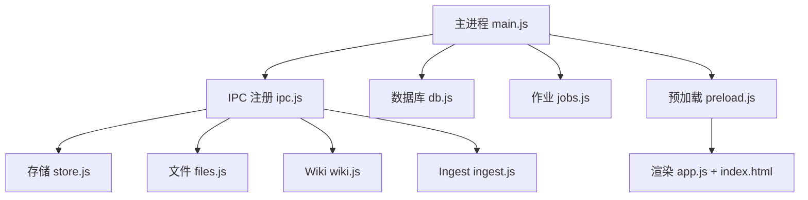
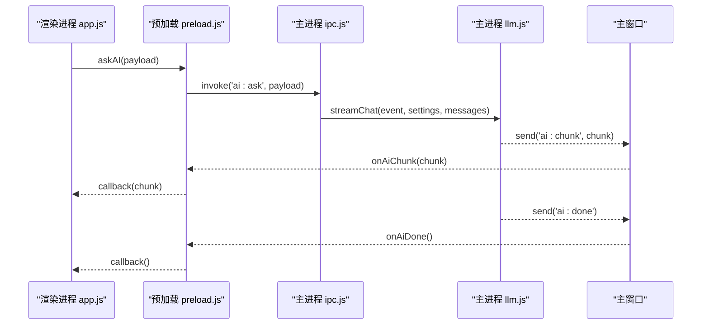
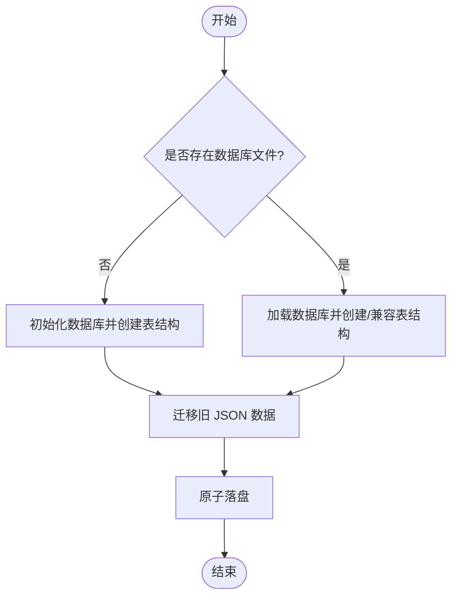
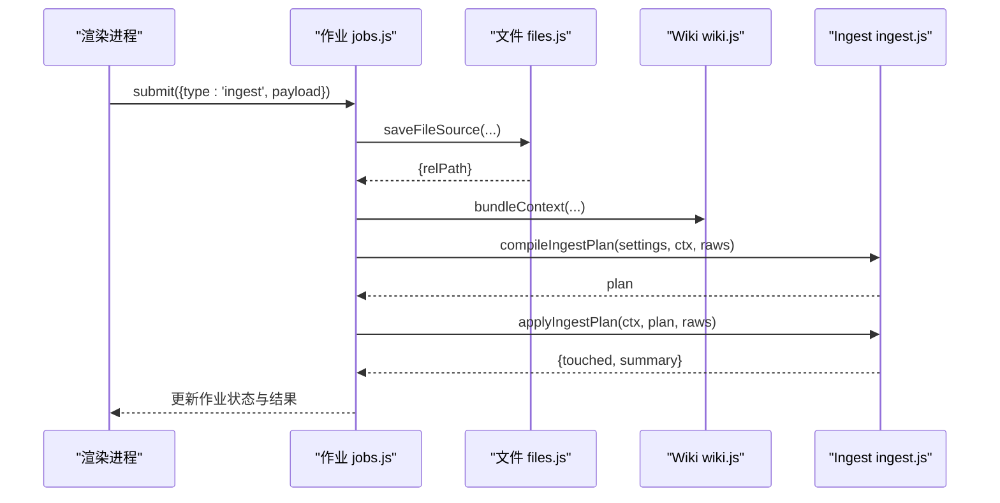

# 部署指南

<cite>
**本文引用的文件**
- [package.json](file://package.json)
- [main.js](file://main.js)
- [preload.js](file://preload.js)
- [src/index.html](file://src/index.html)
- [src/app.js](file://src/app.js)
- [src/main/ipc.js](file://src/main/ipc.js)
- [src/main/db.js](file://src/main/db.js)
- [src/main/store.js](file://src/main/store.js)
- [src/main/files.js](file://src/main/files.js)
- [src/main/ingest.js](file://src/main/ingest.js)
- [src/main/wiki.js](file://src/main/wiki.js)
- [src/main/jobs.js](file://src/main/jobs.js)
</cite>

## 目录
1. [简介](#简介)
2. [项目结构](#项目结构)
3. [核心组件](#核心组件)
4. [架构总览](#架构总览)
5. [详细组件分析](#详细组件分析)
6. [依赖与构建配置](#依赖与构建配置)
7. [跨平台打包与发布](#跨平台打包与发布)
8. [性能优化建议](#性能优化建议)
9. [监控与日志管理](#监控与日志管理)
10. [故障排除指南](#故障排除指南)
11. [结论](#结论)

## 简介
本指南面向 Synapse（本地个人知识库助手）的开发者与维护者，覆盖开发环境与生产环境的搭建、依赖安装、构建流程、打包发布、跨平台注意事项、Electron 打包配置、签名与分发策略、性能优化、监控与日志方案，以及常见问题的排查方法。文档基于仓库现有代码与配置进行说明，确保与实际实现一致。

## 项目结构
Synapse 是一个 Electron 应用，主进程负责窗口生命周期、数据持久化、作业调度与 IPC 路由；渲染进程提供 Markdown 笔记编辑、AI 问答、LLM Wiki 浏览与作业管理等界面能力。关键入口与职责如下：
- 主进程入口：初始化应用、设置用户数据路径、启动数据库、注册 IPC、创建窗口并加载前端页面
- 预加载脚本：通过 contextBridge 暴露安全的 API 给渲染进程
- 渲染进程：UI 状态管理、Markdown 渲染、AI 流式对话、Wiki 阅读与吸收、作业管理
- 主进程模块：IPC 注册中心、SQLite 存储层、文件解析、Ingest 编排、Wiki 领域逻辑、作业队列

图表来源
- [main.js:1-56](file://main.js#L1-L56)
- [preload.js:1-56](file://preload.js#L1-L56)
- [src/main/ipc.js:1-109](file://src/main/ipc.js#L1-L109)
- [src/main/db.js:1-358](file://src/main/db.js#L1-L358)
- [src/main/jobs.js:1-260](file://src/main/jobs.js#L1-L260)
- [src/main/files.js:1-102](file://src/main/files.js#L1-L102)
- [src/main/ingest.js:1-85](file://src/main/ingest.js#L1-L85)
- [src/main/wiki.js:1-313](file://src/main/wiki.js#L1-L313)
- [src/index.html:1-291](file://src/index.html#L1-L291)
- [src/app.js:1-800](file://src/app.js#L1-L800)

章节来源
- [main.js:1-56](file://main.js#L1-L56)
- [preload.js:1-56](file://preload.js#L1-L56)
- [src/index.html:1-291](file://src/index.html#L1-L291)
- [src/app.js:1-800](file://src/app.js#L1-L800)

## 核心组件
- 主进程与窗口：负责应用生命周期、用户数据目录、DevTools 开关、菜单隐藏、窗口尺寸与背景色等
- 预加载桥接：将主进程能力以安全方式暴露给渲染进程，包括数据存取、AI 流式消息、Wiki 操作、作业管理与导出
- 数据存储：基于 SQLite（sql.js），支持迁移旧 JSON 数据、原子落盘、可切换数据库文件位置
- 作业系统：串行队列、阶段状态机、历史持久化、失败重试、中断恢复
- 文件解析：PDF/DOCX/XLSX/PPTX/文本等转 Markdown，保存到 raw/ 目录
- Wiki 领域：根目录定位、页面读取与描述、上下文打包、问答检索与流式回答、体检报告生成
- IPC 注册中心：统一处理渲染进程请求，委派到对应业务模块

章节来源
- [src/main/ipc.js:1-109](file://src/main/ipc.js#L1-L109)
- [src/main/db.js:1-358](file://src/main/db.js#L1-L358)
- [src/main/jobs.js:1-260](file://src/main/jobs.js#L1-L260)
- [src/main/files.js:1-102](file://src/main/files.js#L1-L102)
- [src/main/wiki.js:1-313](file://src/main/wiki.js#L1-L313)

## 架构总览
下图展示了从渲染进程发起 AI 问答到主进程流式返回的关键调用链，体现 IPC 与流式事件机制。

图表来源
- [src/app.js:478-549](file://src/app.js#L478-L549)
- [preload.js:9-25](file://preload.js#L9-L25)
- [src/main/ipc.js:45-46](file://src/main/ipc.js#L45-L46)

章节来源
- [src/app.js:478-549](file://src/app.js#L478-L549)
- [preload.js:9-25](file://preload.js#L9-L25)
- [src/main/ipc.js:45-46](file://src/main/ipc.js#L45-L46)

## 详细组件分析

### 数据持久化与迁移（db.js）
- 使用 sql.js 内存数据库，变更时整体导出并原子写盘，避免损坏
- 支持从旧 JSON 文件一次性迁移到 SQLite，成功后保留 .bak 备份
- 提供数据库文件位置切换功能，含指针文件管理与回退默认位置逻辑
- 事务内清空重插保持行序一致，作业历史持久化并剥离敏感 payload

图表来源
- [src/main/db.js:92-109](file://src/main/db.js#L92-L109)
- [src/main/db.js:151-177](file://src/main/db.js#L151-L177)
- [src/main/db.js:179-187](file://src/main/db.js#L179-L187)

章节来源
- [src/main/db.js:1-358](file://src/main/db.js#L1-L358)

### 作业系统与 Ingest 流程（jobs.js / ingest.js）
- 作业串行执行，避免并发写冲突；阶段状态机上报进度与错误
- Ingest 三步：保存来源 → AI 编译页面计划 → 落盘；失败可复用已保存来源重试
- 体检作业：收集全库 → AI 体检 → 报告完成

图表来源
- [src/main/jobs.js:123-188](file://src/main/jobs.js#L123-L188)
- [src/main/ingest.js:22-82](file://src/main/ingest.js#L22-L82)
- [src/main/files.js:76-99](file://src/main/files.js#L76-L99)
- [src/main/wiki.js:117-134](file://src/main/wiki.js#L117-L134)

章节来源
- [src/main/jobs.js:1-260](file://src/main/jobs.js#L1-L260)
- [src/main/ingest.js:1-85](file://src/main/ingest.js#L1-L85)
- [src/main/files.js:1-102](file://src/main/files.js#L1-L102)
- [src/main/wiki.js:117-134](file://src/main/wiki.js#L117-L134)

### 前端交互与状态（app.js / index.html）
- 侧边栏导航、标签云、搜索过滤、编辑器模式切换、Wiki 阅读器、作业管理页
- AI 问答面板支持笔记问答与 Wiki 问答两种模式，流式输出与错误提示
- 设置页包含 AI 服务、存储、作业、问答、编辑器等多类配置项

章节来源
- [src/index.html:1-291](file://src/index.html#L1-L291)
- [src/app.js:1-800](file://src/app.js#L1-L800)

## 依赖与构建配置
- 运行时依赖：electron、electron-builder、marked、pdfkit 等用于开发与构建
- 运行时库：jszip、mammoth、pdf-parse、turndown、xlsx、sql.js 等用于文件解析与数据库
- 构建脚本：start 启动开发环境，dist 使用 electron-builder 打包 Windows NSIS 安装包
- 打包配置：appId、productName、files 白名单、win.target、nsis 安装选项

章节来源
- [package.json:1-45](file://package.json#L1-L45)

## 跨平台打包与发布

### 开发环境搭建
- 安装 Node.js 与 npm（或 yarn/pnpm）
- 在项目根目录执行依赖安装
- 使用开发命令启动应用

章节来源
- [package.json:7-10](file://package.json#L7-L10)

### Windows
- 使用内置脚本进行打包，目标为 NSIS 安装包
- 安装器支持自定义安装目录，非一键安装
- 如需多平台打包，可在同一机器上安装相应平台工具链后执行对应命令

章节来源
- [package.json:9-34](file://package.json#L9-L34)

### macOS
- 使用 electron-builder 的 macOS 目标进行打包（例如 dmg 或 zip）
- 若需签名与公证，请配置相应的证书与 entitlements
- 注意 macOS 沙箱与安全策略对文件系统访问的限制

[本节为通用指导，不直接分析具体文件]

### Linux
- 使用 electron-builder 的 Linux 目标进行打包（例如 AppImage、deb、rpm）
- 注意运行时的系统依赖（如 GTK、WebRTC 相关库）
- 若需要桌面集成图标与 MIME 类型，请在构建配置中补充

[本节为通用指导，不直接分析具体文件]

### 签名与分发策略
- 应用标识与产品名称在构建配置中定义
- Windows 可使用代码签名证书对安装包与可执行文件签名
- macOS 需配置签名与公证流程，确保 Gatekeeper 放行
- Linux 可通过发行版仓库或第三方渠道分发，建议提供校验和与签名

章节来源
- [package.json:19-34](file://package.json#L19-L34)

## 性能优化建议
- 数据库写入采用原子落盘，减少损坏风险；小数据量场景下开销可忽略
- 作业串行执行避免并发写冲突；历史条目数可配置，防止无限增长
- 网页拉取超时可配置，避免长时间阻塞；来源内容长度可截断，控制提示词大小
- 前端渲染使用防抖保存，降低频繁写入频率
- 合理设置 Wiki 问答最大引用页数与日志展示行数，平衡响应速度与上下文完整性

章节来源
- [src/main/db.js:179-187](file://src/main/db.js#L179-L187)
- [src/main/jobs.js:20-23](file://src/main/jobs.js#L20-L23)
- [src/main/wiki.js:153-191](file://src/main/wiki.js#L153-L191)
- [src/app.js:107-118](file://src/app.js#L107-L118)

## 监控与日志管理
- 主进程控制台输出渲染进程的 console 消息，便于调试
- Wiki 维护 log.md，按日期分组记录 Ingest、Query 等操作摘要
- 作业历史持久化，包含阶段状态与错误信息，支持查看与重试
- 设置页提供日志尾部行数配置，便于快速定位问题

章节来源
- [main.js:34-36](file://main.js#L34-L36)
- [src/main/wiki.js:136-151](file://src/main/wiki.js#L136-L151)
- [src/main/jobs.js:45-69](file://src/main/jobs.js#L45-L69)
- [src/index.html:139-144](file://src/index.html#L139-L144)

## 故障排除指南
- 无法打开 Wiki：检查 AGENTS.md 与 wiki 目录是否存在；确认 Wiki 根目录设置是否正确
- 数据库切换失败：确保传入绝对路径且目标文件不存在；恢复默认时会保留旧文件备份
- 作业失败：查看作业历史中的阶段详情与错误信息；失败作业可重试，Ingest 会复用已保存来源
- 网页拉取超时：调整 URL 拉取超时时间；检查网络与目标站点可达性
- 文件解析不支持：确认文件格式在支持列表中；部分格式可能需要额外依赖或权限
- 应用崩溃或无响应：启用调试参数打开 DevTools；检查主进程与控制台输出

章节来源
- [src/main/wiki.js:93-114](file://src/main/wiki.js#L93-L114)
- [src/main/db.js:34-81](file://src/main/db.js#L34-L81)
- [src/main/jobs.js:236-257](file://src/main/jobs.js#L236-L257)
- [src/main/wiki.js:153-191](file://src/main/wiki.js#L153-L191)
- [src/main/files.js:76-99](file://src/main/files.js#L76-L99)
- [main.js:37-38](file://main.js#L37-L38)

## 结论
Synapse 通过清晰的主进程与渲染进程分工、稳定的 SQLite 存储、健壮的作业系统与完善的 Wiki 能力，提供了本地个人知识库的高效解决方案。按照本指南完成环境搭建、构建与发布，并结合性能优化与监控日志策略，可以在不同操作系统上稳定运行与维护。遇到问题时，优先检查 Wiki 目录、数据库路径、作业历史与网络配置，利用内置调试能力快速定位与修复。