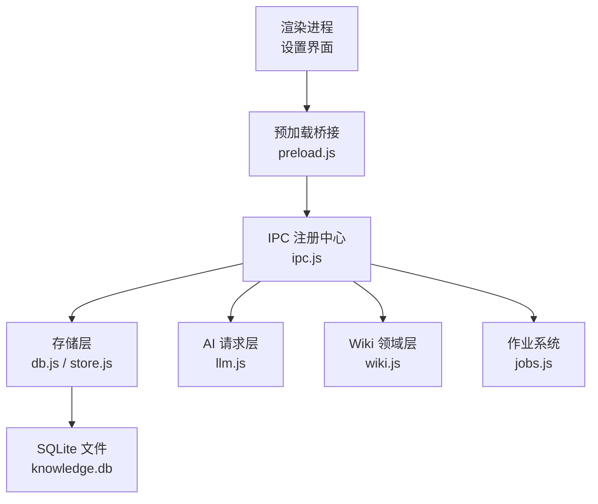
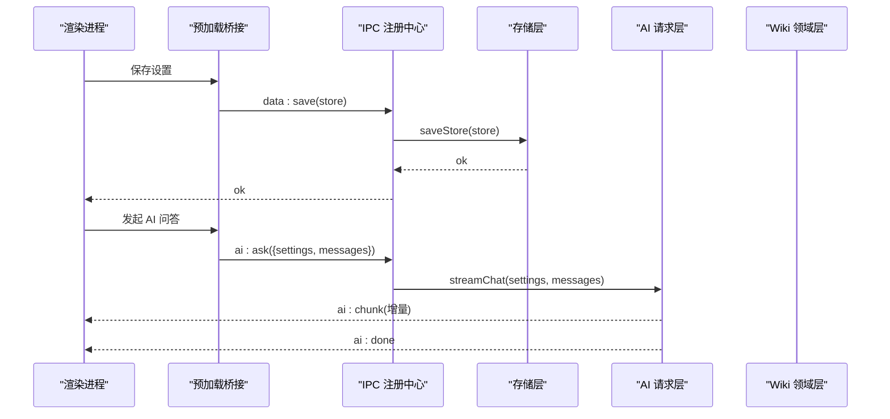
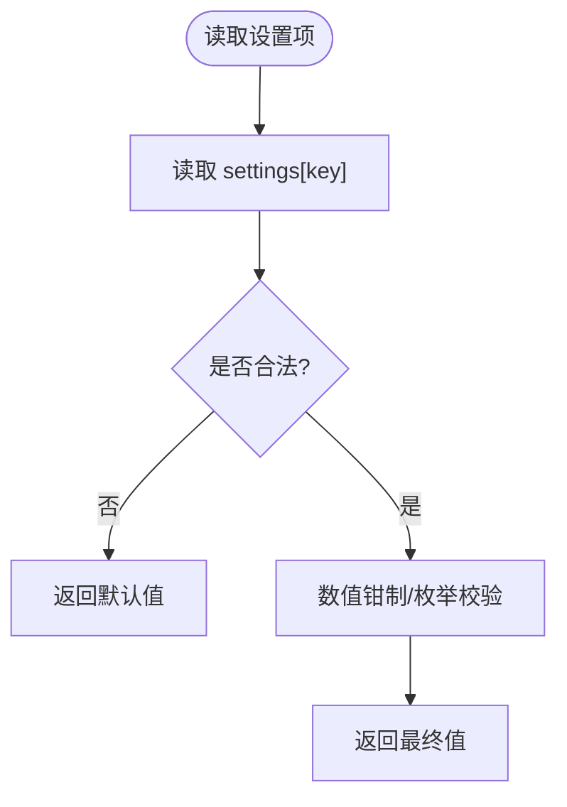
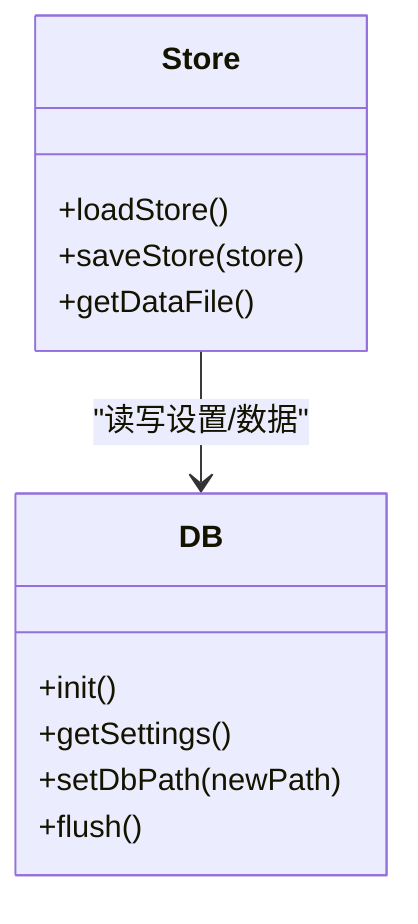
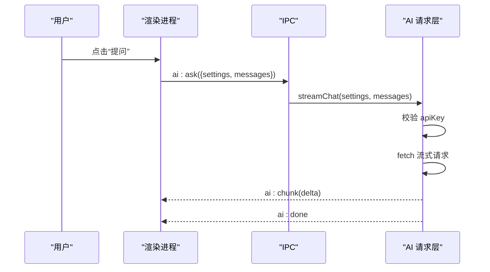
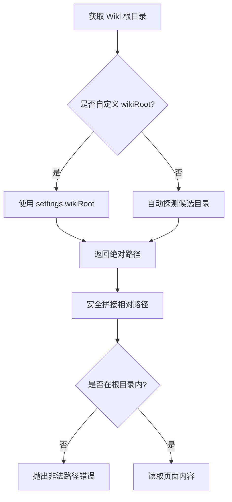
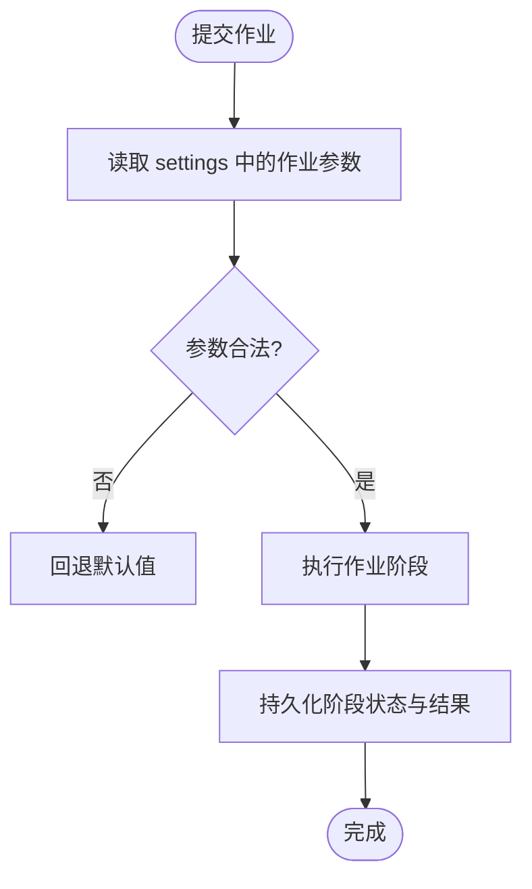
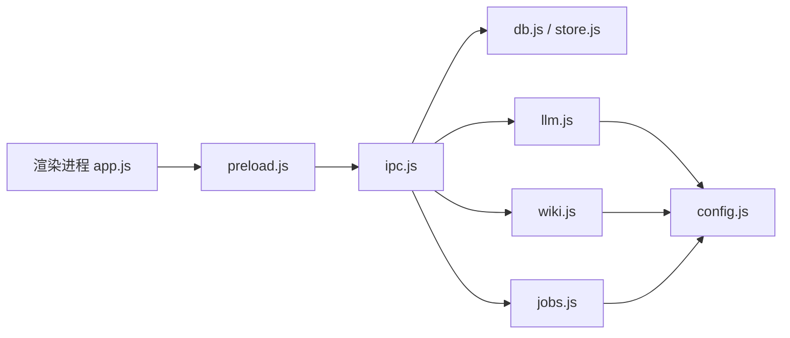

# 配置管理

<cite>
**本文引用的文件**
- [main.js](file://main.js)
- [preload.js](file://preload.js)
- [src/main/config.js](file://src/main/config.js)
- [src/main/db.js](file://src/main/db.js)
- [src/main/store.js](file://src/main/store.js)
- [src/main/ipc.js](file://src/main/ipc.js)
- [src/main/llm.js](file://src/main/llm.js)
- [src/main/wiki.js](file://src/main/wiki.js)
- [src/main/files.js](file://src/main/files.js)
- [src/main/jobs.js](file://src/main/jobs.js)
- [src/index.html](file://src/index.html)
- [src/app.js](file://src/app.js)
</cite>

## 目录
1. [简介](#简介)
2. [项目结构与配置入口](#项目结构与配置入口)
3. [核心组件与职责](#核心组件与职责)
4. [架构总览](#架构总览)
5. [详细组件分析](#详细组件分析)
6. [依赖关系分析](#依赖关系分析)
7. [性能考量](#性能考量)
8. [故障排查指南](#故障排查指南)
9. [结论](#结论)
10. [附录：配置项清单与默认值](#附录：配置项清单与默认值)

## 简介
本文件面向“Synapse 本地个人知识库助手”的配置管理，系统性说明 AI 服务、Wiki 存储、作业参数等配置项的结构、默认值、有效范围、加载优先级、环境变量支持与动态更新机制，并提供不同部署环境的配置示例与最佳实践。

## 项目结构与配置入口
- 应用主进程入口负责初始化数据库、作业系统与 IPC 注册中心，并创建渲染窗口。
- 设置由渲染层维护并通过 IPC 持久化到 SQLite；主进程在需要时从数据库读取最新设置。
- 关键入口文件：
  - 主进程入口：[main.js](file://main.js)
  - 预加载桥接（暴露给渲染层的 API）：[preload.js](file://preload.js)
  - 设置持久化与迁移：[db.js](file://src/main/db.js)、[store.js](file://src/main/store.js)
  - IPC 注册中心：[ipc.js](file://src/main/ipc.js)
  - 设置 UI 与保存逻辑：[index.html](file://src/index.html)、[app.js](file://src/app.js)

**图表来源**
- [main.js:41-47](file://main.js#L41-L47)
- [preload.js:3-55](file://preload.js#L3-L55)
- [src/main/ipc.js:12-106](file://src/main/ipc.js#L12-L106)
- [src/main/db.js:92-109](file://src/main/db.js#L92-L109)

**章节来源**
- [main.js:1-56](file://main.js#L1-L56)
- [preload.js:1-56](file://preload.js#L1-L56)
- [src/main/ipc.js:1-109](file://src/main/ipc.js#L1-L109)

## 核心组件与职责
- 配置解析器：提供数值钳制与枚举校验工具，确保非法输入回退到默认值。
- 存储层：以 SQLite 持久化笔记、目录、设置与作业历史；支持切换数据库文件路径。
- AI 请求层：OpenAI 兼容流式接口调用，内置重试策略与 SSE 流解析。
- Wiki 领域层：定位 Wiki 根目录、打包上下文、问答检索、体检报告、来源保存。
- 作业系统：串行队列执行吸收与体检任务，阶段状态机与历史持久化。
- IPC 注册中心：统一暴露数据、AI、Wiki、作业等能力给渲染进程。

**章节来源**
- [src/main/config.js:1-18](file://src/main/config.js#L1-L18)
- [src/main/db.js:1-358](file://src/main/db.js#L1-L358)
- [src/main/llm.js:1-123](file://src/main/llm.js#L1-L123)
- [src/main/wiki.js:1-313](file://src/main/wiki.js#L1-L313)
- [src/main/jobs.js:1-260](file://src/main/jobs.js#L1-L260)
- [src/main/ipc.js:1-109](file://src/main/ipc.js#L1-L109)

## 架构总览
配置在渲染层编辑后通过 IPC 保存到 SQLite；主进程各模块按需读取最新设置。AI 请求与 Wiki 操作均基于当前 settings 进行。

**图表来源**
- [preload.js:3-25](file://preload.js#L3-L25)
- [src/main/ipc.js:14-46](file://src/main/ipc.js#L14-L46)
- [src/main/db.js:252-266](file://src/main/db.js#L252-L266)
- [src/main/llm.js:40-77](file://src/main/llm.js#L40-L77)

## 详细组件分析

### 配置解析器（数值与枚举）
- 数值配置：四舍五入取整并钳制到指定区间，缺失或非法时返回默认值。
- 枚举配置：不在允许列表内时回退默认值。
- 使用位置：作业历史上限、聊天重试次数、日志尾部行数、网页拉取超时等。

**图表来源**
- [src/main/config.js:4-15](file://src/main/config.js#L4-L15)

**章节来源**
- [src/main/config.js:1-18](file://src/main/config.js#L1-L18)

### 存储层与设置持久化
- 设置存储在 SQLite 的 kv 表中，键为 settings，值为 JSON 字符串。
- 渲染层提交全量 store（包含 folders、notes、settings），主进程事务写入并原子落盘。
- 支持切换数据库文件路径：导出旧库到新路径，更新指针文件，立即生效。

**图表来源**
- [src/main/store.js:1-17](file://src/main/store.js#L1-L17)
- [src/main/db.js:92-109](file://src/main/db.js#L92-L109)
- [src/main/db.js:223-266](file://src/main/db.js#L223-L266)
- [src/main/db.js:36-81](file://src/main/db.js#L36-L81)

**章节来源**
- [src/main/db.js:1-358](file://src/main/db.js#L1-L358)
- [src/main/store.js:1-17](file://src/main/store.js#L1-L17)

### AI 服务配置（API Key、基础 URL、模型选择）
- 配置项：
  - apiBaseUrl：LLM 网关基础地址，默认 OpenAI 兼容地址。
  - apiKey：鉴权令牌，未配置将提示用户填写。
  - model：模型名称，默认 gpt-4o-mini。
- 行为：
  - 非空 baseUrl 去除末尾斜杠。
  - 所有对话均以流式方式发起，累积全文用于内部编排。
  - 客户端错误（4xx）不重试；网络异常、5xx、空返回视为可重试错误。

**图表来源**
- [src/main/llm.js:40-77](file://src/main/llm.js#L40-L77)
- [src/main/ipc.js:45-46](file://src/main/ipc.js#L45-L46)

**章节来源**
- [src/main/llm.js:1-123](file://src/main/llm.js#L1-L123)
- [src/index.html:115-119](file://src/index.html#L115-L119)
- [src/app.js:1081-1083](file://src/app.js#L1081-L1083)
- [src/app.js:1141-1143](file://src/app.js#L1141-L1143)

### Wiki 存储配置
- wikiRoot：Wiki 根目录，留空则自动探测（优先应用目录下的 llmwiki，其次文档目录）。
- 页面读取：raw/ 下按根目录解析，其余按 wiki/ bundle 解析。
- 安全：路径拼接强制限制在根目录下，防止越界访问。
- 日志尾部行数：logTailLines 控制 log.md 最近 N 行展示。

**图表来源**
- [src/main/wiki.js:10-24](file://src/main/wiki.js#L10-L24)
- [src/main/wiki.js:27-33](file://src/main/wiki.js#L27-L33)
- [src/main/wiki.js:86-91](file://src/main/wiki.js#L86-L91)

**章节来源**
- [src/main/wiki.js:1-313](file://src/main/wiki.js#L1-L313)
- [src/index.html:121-127](file://src/index.html#L121-L127)
- [src/app.js:1089-1094](file://src/app.js#L1089-L1094)

### 作业参数配置
- maxJobsHistory：作业历史保留条数，默认 50，范围 1–500。
- chatRetries：失败重试次数（网络/5xx/空返回），默认 1，范围 0–5。
- urlFetchTimeout：网页拉取超时秒数，默认 30，范围 1–600。
- sourceMaxChars：超长来源截断阈值，避免提示词爆炸（在 ingest 流程中使用）。
- wikiAskMaxPages：Wiki 问答最多选取页面数，默认 5，范围 1–20。
- logTailLines：日志尾部显示行数，默认 30，范围 1–500。

**图表来源**
- [src/main/jobs.js:20-23](file://src/main/jobs.js#L20-L23)
- [src/main/jobs.js:100-121](file://src/main/jobs.js#L100-L121)
- [src/main/wiki.js:162-165](file://src/main/wiki.js#L162-L165)
- [src/main/wiki.js:197-204](file://src/main/wiki.js#L197-L204)
- [src/main/wiki.js:105-106](file://src/main/wiki.js#L105-L106)

**章节来源**
- [src/main/jobs.js:1-260](file://src/main/jobs.js#L1-L260)
- [src/main/wiki.js:153-191](file://src/main/wiki.js#L153-L191)
- [src/main/wiki.js:193-233](file://src/main/wiki.js#L193-L233)
- [src/main/wiki.js:105-106](file://src/main/wiki.js#L105-L106)
- [src/index.html:129-133](file://src/index.html#L129-L133)
- [src/app.js:1071-1072](file://src/app.js#L1071-L1072)

### 配置加载优先级与动态更新
- 加载优先级：
  1) 渲染层表单输入（最高优先级，用户即时修改）。
  2) 持久化设置（SQLite 中 settings 字段）。
  3) 代码内默认值（当设置缺失或非法时回退）。
- 动态更新：
  - 保存设置后立即写库，后续 AI/Wiki/Jobs 调用实时读取最新 settings。
  - 切换数据库路径后，后续读取从新库生效。
- 环境变量支持：
  - 当前实现未直接读取环境变量；如需支持，可在主进程初始化处注入到 settings 或使用环境变量覆盖默认值。

**章节来源**
- [src/main/db.js:223-266](file://src/main/db.js#L223-L266)
- [src/main/ipc.js:14-28](file://src/main/ipc.js#L14-L28)
- [src/main/llm.js:40-48](file://src/main/llm.js#L40-L48)
- [src/main/wiki.js:21-24](file://src/main/wiki.js#L21-L24)
- [src/main/jobs.js:20-23](file://src/main/jobs.js#L20-L23)

### 不同部署环境的配置示例与最佳实践
- 本地开发：
  - 使用默认 Wiki 根目录（自动探测），无需手动设置 wikiRoot。
  - 设置 apiBaseUrl 指向本地代理或网关，apiKey 填入测试密钥。
  - 建议开启较大的日志尾部行数便于调试。
- 生产环境：
  - 固定 wikiRoot 到受控目录，避免误改。
  - 限制 chatRetries 与 urlFetchTimeout，避免长时间阻塞。
  - 定期清理作业历史，保持数据库体积可控。
- 多实例/多用户：
  - 通过切换数据库文件路径隔离数据，避免共享同一 knowledge.db。
  - 每个实例独立设置与 Wiki 根目录，减少冲突。

**章节来源**
- [src/main/db.js:36-81](file://src/main/db.js#L36-L81)
- [src/main/wiki.js:10-24](file://src/main/wiki.js#L10-L24)
- [src/main/jobs.js:20-23](file://src/main/jobs.js#L20-L23)

## 依赖关系分析
- 渲染层通过 preload 暴露 API，调用 ipc 注册中心。
- IPC 将请求分发到存储、AI、Wiki、作业等模块。
- 各模块依赖 config 解析器对数值/枚举进行校验与回退。
- 存储层依赖 Electron app 路径与文件系统，保证原子落盘。

**图表来源**
- [preload.js:3-55](file://preload.js#L3-L55)
- [src/main/ipc.js:12-106](file://src/main/ipc.js#L12-L106)
- [src/main/config.js:1-18](file://src/main/config.js#L1-L18)

**章节来源**
- [src/main/ipc.js:1-109](file://src/main/ipc.js#L1-L109)
- [src/main/config.js:1-18](file://src/main/config.js#L1-L18)

## 性能考量
- 流式响应：AI 请求采用流式传输，降低首字节延迟，提升交互体验。
- 原子落盘：数据库整体导出后临时文件 rename，避免写入中断损坏。
- 作业串行：避免并发写 Wiki 文件导致冲突。
- 超时控制：网页拉取具备超时保护，避免无响应站点挂起流程。

**章节来源**
- [src/main/llm.js:10-37](file://src/main/llm.js#L10-L37)
- [src/main/db.js:180-187](file://src/main/db.js#L180-L187)
- [src/main/jobs.js:72-98](file://src/main/jobs.js#L72-L98)
- [src/main/wiki.js:162-165](file://src/main/wiki.js#L162-L165)

## 故障排查指南
- 未配置 API Key：AI 请求会返回错误消息，需在设置中填写。
- 接口错误：根据 HTTP 状态码区分客户端错误（不重试）与服务端错误（可重试）。
- 路径非法：Wiki 路径拼接越界会抛出错误，检查 wikiRoot 与相对路径。
- 数据库切换失败：目标文件已存在或路径非绝对时会拒绝，需更换路径或恢复默认。
- 作业失败：查看阶段详情与错误信息，必要时重试或重新吸收来源。

**章节来源**
- [src/main/llm.js:45-48](file://src/main/llm.js#L45-L48)
- [src/main/llm.js:91-109](file://src/main/llm.js#L91-L109)
- [src/main/wiki.js:27-33](file://src/main/wiki.js#L27-L33)
- [src/main/db.js:36-81](file://src/main/db.js#L36-L81)
- [src/main/jobs.js:83-98](file://src/main/jobs.js#L83-L98)

## 结论
本项目的配置体系以渲染层为中心，通过 IPC 持久化到 SQLite，并在运行时被各模块实时读取。AI 服务、Wiki 存储与作业参数均支持合理的默认值与范围校验，具备动态更新能力。结合不同部署场景的最佳实践，可实现稳定、可维护的个人知识库助手。

## 附录：配置项清单与默认值
- AI 服务
  - apiBaseUrl：基础 URL，默认 https://api.openai.com/v1（去除末尾斜杠）。
  - apiKey：鉴权令牌，必填，未配置将提示用户填写。
  - model：模型名称，默认 gpt-4o-mini。
- Wiki 存储
  - wikiRoot：Wiki 根目录，留空自动探测（应用目录 llmwiki 或文档目录）。
  - logTailLines：日志尾部显示行数，默认 30，范围 1–500。
- 作业参数
  - maxJobsHistory：作业历史保留条数，默认 50，范围 1–500。
  - chatRetries：失败重试次数，默认 1，范围 0–5。
  - urlFetchTimeout：网页拉取超时秒数，默认 30，范围 1–600。
  - sourceMaxChars：超长来源截断阈值（在 ingest 流程中使用）。
  - wikiAskMaxPages：Wiki 问答最多选取页面数，默认 5，范围 1–20。

**章节来源**
- [src/main/llm.js:41-43](file://src/main/llm.js#L41-L43)
- [src/main/wiki.js:105-106](file://src/main/wiki.js#L105-L106)
- [src/main/jobs.js:20-23](file://src/main/jobs.js#L20-L23)
- [src/main/wiki.js:162-165](file://src/main/wiki.js#L162-L165)
- [src/main/wiki.js:197-204](file://src/main/wiki.js#L197-L204)
- [src/index.html:115-133](file://src/index.html#L115-L133)
- [src/app.js:1071-1072](file://src/app.js#L1071-L1072)