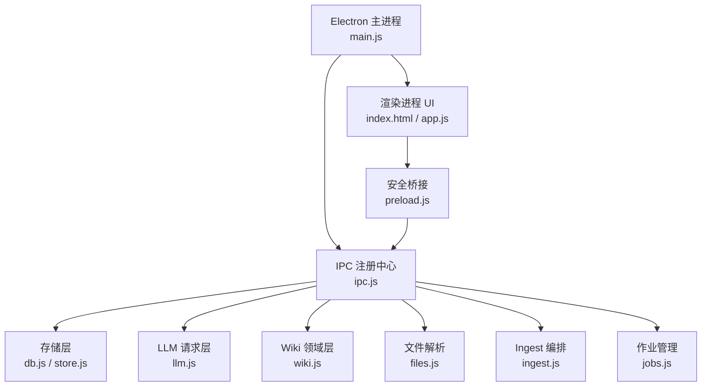
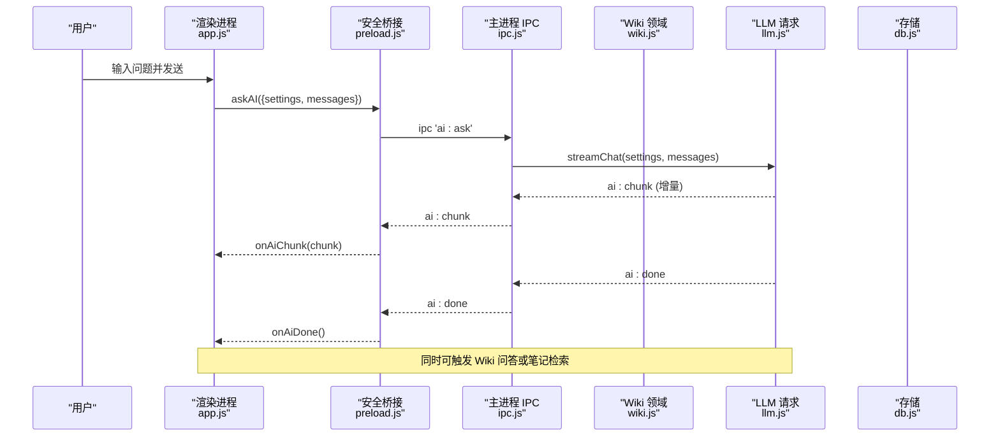
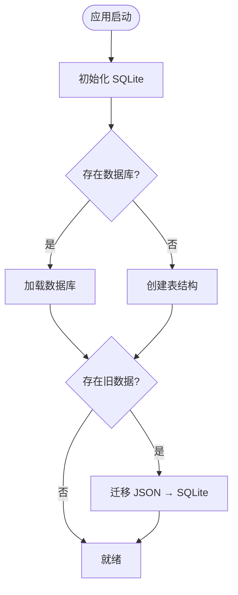
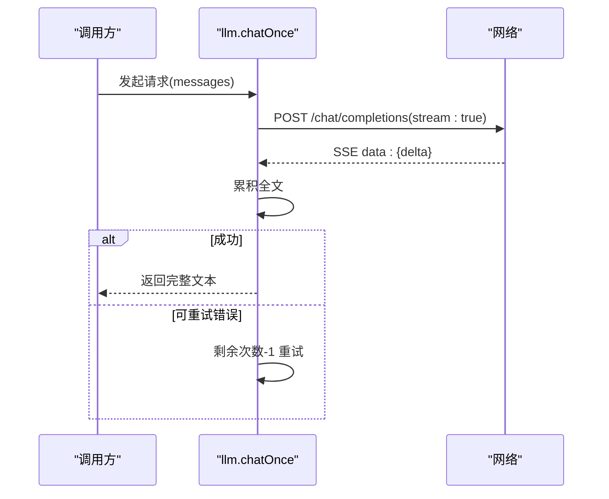
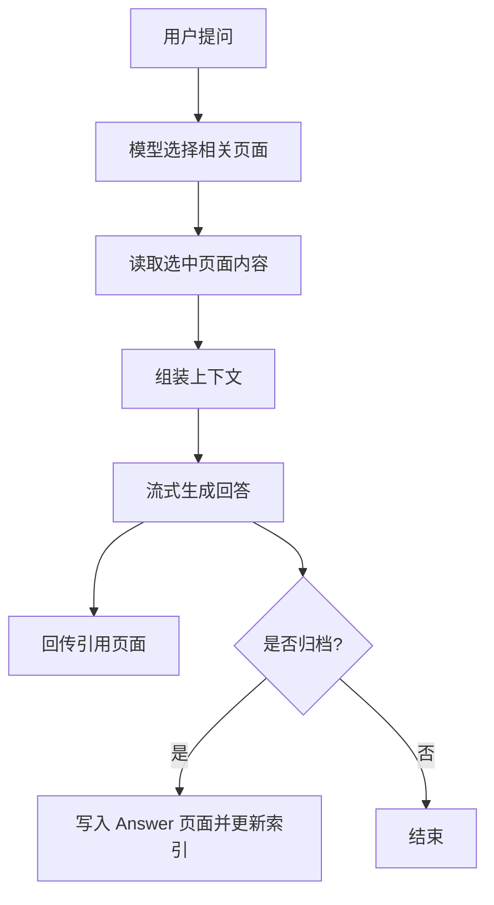
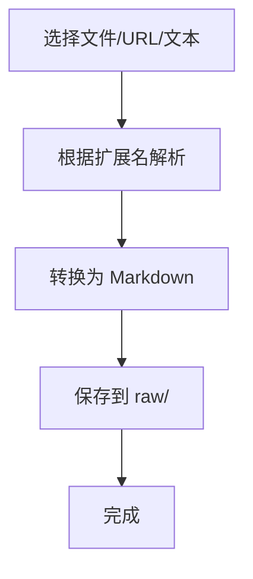
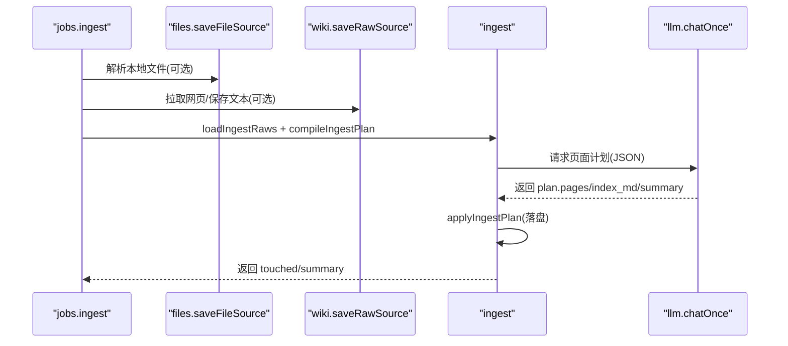
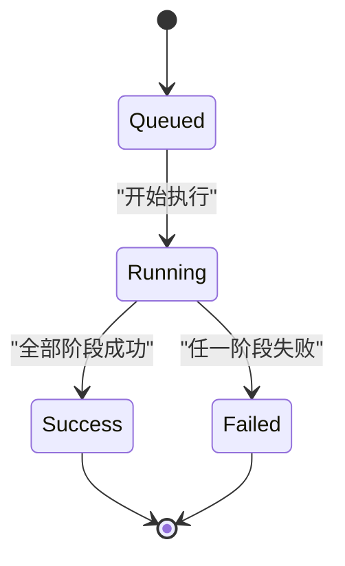
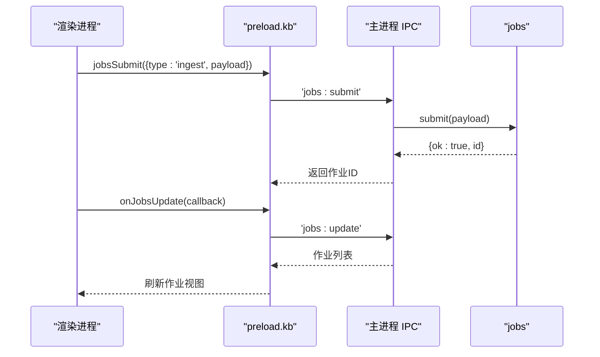
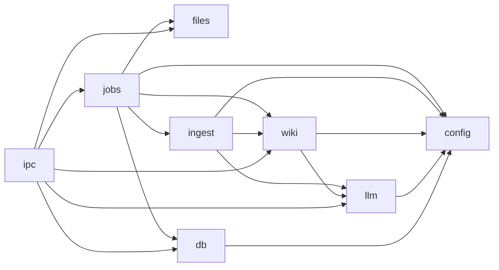

# 项目概述

<cite>
**本文引用的文件**
- [package.json](file://package.json)
- [main.js](file://main.js)
- [preload.js](file://preload.js)
- [src/index.html](file://src/index.html)
- [src/app.js](file://src/app.js)
- [src/main/db.js](file://src/main/db.js)
- [src/main/store.js](file://src/main/store.js)
- [src/main/llm.js](file://src/main/llm.js)
- [src/main/wiki.js](file://src/main/wiki.js)
- [src/main/files.js](file://src/main/files.js)
- [src/main/ingest.js](file://src/main/ingest.js)
- [src/main/jobs.js](file://src/main/jobs.js)
- [src/main/ipc.js](file://src/main/ipc.js)
- [src/main/config.js](file://src/main/config.js)
</cite>

## 目录
1. [简介](#简介)
2. [项目结构](#项目结构)
3. [核心组件](#核心组件)
4. [架构总览](#架构总览)
5. [详细组件分析](#详细组件分析)
6. [依赖关系分析](#依赖关系分析)
7. [性能与可靠性](#性能与可靠性)
8. [故障排查指南](#故障排查指南)
9. [快速开始](#快速开始)
10. [结论](#结论)

## 简介
Synapse 是一款本地优先的个人知识库助手，围绕“Markdown 笔记 + LLM Wiki + AI 智能问答 + 文件导入处理”构建。它通过 Electron 提供桌面端体验，使用 SQLite（WASM）持久化数据，支持将网页、文本与多种本地文档（PDF、DOCX、XLSX、PPTX、MD/TXT/CSV 等）吸收为结构化 Wiki 页面，并基于 OpenAI 兼容接口进行流式 AI 问答与自动知识整理。

核心价值：
- 个人知识管理：以 Markdown 为中心，支持目录、标签、搜索、置顶、分屏编辑与预览。
- LLM Wiki 系统：遵循 OKF v0.2 frontmatter，自动维护概念、来源、主题、实体与索引。
- AI 智能问答：对笔记与 Wiki 双模式检索，流式输出答案并支持引用溯源。
- 自动化知识吸收：一键吸收网页/文本/本地文件，AI 生成页面计划并落盘更新索引。

典型场景：
- 个人知识管理：收集、组织、检索碎片化信息，形成可演进的知识体系。
- 智能问答：在已有笔记与 Wiki 基础上，获得上下文相关的回答与参考链接。
- 自动化知识吸收：批量导入资料，自动生成摘要与关联页面，减少人工整理成本。

**章节来源**
- [package.json:1-45](file://package.json#L1-L45)
- [src/index.html:1-291](file://src/index.html#L1-L291)

## 项目结构
项目采用主进程与渲染进程分离的 Electron 架构，业务按职责拆分到 src/main 下的领域模块：
- 入口与窗口：main.js
- IPC 注册中心：src/main/ipc.js
- 存储层：src/main/db.js、src/main/store.js
- LLM 请求层：src/main/llm.js
- Wiki 领域层：src/main/wiki.js
- 文件解析：src/main/files.js
- Ingest 编排：src/main/ingest.js
- 作业管理：src/main/jobs.js
- 配置工具：src/main/config.js
- 前端界面与交互：src/index.html、src/app.js
- 安全桥接：preload.js

**图表来源**
- [main.js:1-56](file://main.js#L1-L56)
- [src/main/ipc.js:1-109](file://src/main/ipc.js#L1-L109)
- [src/main/db.js:1-358](file://src/main/db.js#L1-L358)
- [src/main/store.js:1-17](file://src/main/store.js#L1-L17)
- [src/main/llm.js:1-123](file://src/main/llm.js#L1-L123)
- [src/main/wiki.js:1-313](file://src/main/wiki.js#L1-L313)
- [src/main/files.js:1-102](file://src/main/files.js#L1-L102)
- [src/main/ingest.js:1-85](file://src/main/ingest.js#L1-L85)
- [src/main/jobs.js:1-260](file://src/main/jobs.js#L1-L260)
- [preload.js:1-56](file://preload.js#L1-L56)

**章节来源**
- [main.js:1-56](file://main.js#L1-L56)
- [src/main/ipc.js:1-109](file://src/main/ipc.js#L1-L109)
- [preload.js:1-56](file://preload.js#L1-L56)

## 核心组件
- 数据存储（SQLite）：负责笔记、目录、设置与作业历史的持久化；支持数据库文件路径迁移与指针文件管理；启动时自动迁移旧 JSON 数据。
- LLM 请求层：OpenAI 兼容接口，统一以流式 SSE 发送与接收；内置重试策略与错误分类；提供流式对话与非流式调用。
- Wiki 领域层：定位 Wiki 根目录、读取/描述页面、打包上下文、保存原始来源、Wiki 问答两步检索、体检报告生成、问答回填归档。
- 文件解析：将 PDF、DOCX、XLSX/XLS、PPTX、纯文本/CSV/JSON/LOG 等转换为 Markdown 并保存到 raw/ 目录。
- Ingest 编排：读取来源 → 调用模型生成页面计划 → 落盘写入页面与索引，记录日志。
- 作业管理：串行队列执行，阶段状态机，历史持久化，失败重试与中断恢复。
- IPC 注册中心：集中暴露所有主进程能力给渲染进程，屏蔽底层实现细节。
- 前端应用：侧边栏导航、笔记列表、编辑器（编辑/分屏/预览）、AI 面板、Wiki 阅读器、作业管理页、设置页。

**章节来源**
- [src/main/db.js:1-358](file://src/main/db.js#L1-L358)
- [src/main/llm.js:1-123](file://src/main/llm.js#L1-L123)
- [src/main/wiki.js:1-313](file://src/main/wiki.js#L1-L313)
- [src/main/files.js:1-102](file://src/main/files.js#L1-L102)
- [src/main/ingest.js:1-85](file://src/main/ingest.js#L1-L85)
- [src/main/jobs.js:1-260](file://src/main/jobs.js#L1-L260)
- [src/main/ipc.js:1-109](file://src/main/ipc.js#L1-L109)
- [src/app.js:1-800](file://src/app.js#L1-L800)

## 架构总览
Synapse 采用分层模块化设计：
- 渲染层（UI）：负责用户交互、状态管理与视图渲染，通过 preload 暴露的安全 API 与主进程通信。
- IPC 层：统一路由事件到具体业务模块，返回结果或推送流式消息。
- 领域层：Wiki、Ingest、Jobs、Files 等模块各司其职，组合完成复杂流程。
- 基础设施层：db（SQLite）、llm（网络请求）、config（配置解析）。

**图表来源**
- [src/app.js:478-549](file://src/app.js#L478-L549)
- [preload.js:9-25](file://preload.js#L9-L25)
- [src/main/ipc.js:45-46](file://src/main/ipc.js#L45-L46)
- [src/main/llm.js:40-77](file://src/main/llm.js#L40-L77)

**章节来源**
- [src/app.js:478-549](file://src/app.js#L478-L549)
- [src/main/llm.js:40-77](file://src/main/llm.js#L40-L77)
- [src/main/ipc.js:45-46](file://src/main/ipc.js#L45-L46)

## 详细组件分析

### 数据存储（SQLite）
- 初始化与迁移：加载 sql.js WASM，检测并创建表结构；自动迁移旧 JSON 数据至 SQLite。
- 数据模型：folders、notes、kv、jobs 四张表；tags 以 JSON 字符串存储。
- 持久化策略：整体导出后原子写盘（临时文件 rename），避免损坏。
- 数据库迁移：支持切换数据库文件路径，保留旧文件备份，指针文件独立管理。

**图表来源**
- [src/main/db.js:92-109](file://src/main/db.js#L92-L109)
- [src/main/db.js:151-177](file://src/main/db.js#L151-L177)

**章节来源**
- [src/main/db.js:1-358](file://src/main/db.js#L1-L358)
- [src/main/store.js:1-17](file://src/main/store.js#L1-L17)

### LLM 请求层
- 流式 SSE 解析：逐行解析 data: 增量，回调 delta 供渲染层实时展示。
- 重试策略：仅对网络异常、5xx、空返回等瞬时错误重试；4xx 客户端错误直接抛出。
- 统一接口：chatOnce 非流式用于内部编排；streamChat 用于前端流式输出。
- JSON 提取：容忍代码块包裹与前后杂质，提取 JSON 供后续步骤使用。

**图表来源**
- [src/main/llm.js:79-110](file://src/main/llm.js#L79-L110)
- [src/main/llm.js:10-37](file://src/main/llm.js#L10-L37)

**章节来源**
- [src/main/llm.js:1-123](file://src/main/llm.js#L1-L123)

### Wiki 领域层
- 根目录探测：优先应用内 llmwiki，其次文档目录；要求存在 AGENTS.md。
- 页面读取与安全：safeJoin 防止路径逃逸；支持 raw/ 与 wiki/bundle 两种路径。
- 上下文打包：聚合 schema、index.md、页面清单与全文，供 LLM 使用。
- 问答流程：先让模型选择相关页面，再基于选中页面流式回答；支持引用回传。
- 体检报告：全库扫描，检查矛盾、陈旧论断、孤儿页、frontmatter 合规性等。
- 问答归档：将问答结果归档为 Answer 类型页面，并更新 index.md 与日志。

**图表来源**
- [src/main/wiki.js:193-233](file://src/main/wiki.js#L193-L233)
- [src/main/wiki.js:235-270](file://src/main/wiki.js#L235-L270)

**章节来源**
- [src/main/wiki.js:1-313](file://src/main/wiki.js#L1-L313)

### 文件解析与导入
- 支持格式：PDF、DOCX、XLSX/XLS、PPTX、MD/Markdown、TXT、CSV、JSON、LOG。
- 转换策略：PDF 文本提取；DOCX HTML→Markdown；Excel 转为 CSV 代码块；PPTX 提取幻灯片文本。
- 保存位置：raw/ 目录下按日期+slugify 文件名保存，确保不可变来源。

**图表来源**
- [src/main/files.js:22-74](file://src/main/files.js#L22-L74)
- [src/main/files.js:76-99](file://src/main/files.js#L76-L99)

**章节来源**
- [src/main/files.js:1-102](file://src/main/files.js#L1-L102)

### Ingest 编排
- 三阶段：保存来源 → AI 编译页面计划 → 落盘写入。
- 提示词工程：注入 AGENTS.md、index.md、现有页面全文与新来源，要求输出合法 JSON。
- 落盘规则：跳过 index.md/log.md 与非法路径；更新索引与日志。

**图表来源**
- [src/main/jobs.js:136-175](file://src/main/jobs.js#L136-L175)
- [src/main/ingest.js:22-82](file://src/main/ingest.js#L22-L82)
- [src/main/files.js:76-99](file://src/main/files.js#L76-L99)
- [src/main/wiki.js:153-191](file://src/main/wiki.js#L153-L191)

**章节来源**
- [src/main/ingest.js:1-85](file://src/main/ingest.js#L1-L85)
- [src/main/jobs.js:136-175](file://src/main/jobs.js#L136-L175)

### 作业管理
- 串行队列：避免并发写冲突；阶段状态机（pending/running/success/failed）。
- 历史持久化：限制条数，剥离 payload 后入库；重启时将未完成作业标记失败。
- 重试机制：lint 重新提交；ingest 复用已保存 raw/ 来源跳过解析阶段。

**图表来源**
- [src/main/jobs.js:71-98](file://src/main/jobs.js#L71-L98)
- [src/main/jobs.js:195-257](file://src/main/jobs.js#L195-L257)

**章节来源**
- [src/main/jobs.js:1-260](file://src/main/jobs.js#L1-L260)

### 前端交互（笔记与 AI）
- 笔记管理：创建、编辑、删除、置顶、标签、目录、搜索、分屏预览。
- AI 问答：笔记模式基于本地检索 Top N；Wiki 模式基于两步检索；流式输出与引用显示。
- Wiki 阅读：树形导航、Frontmatter 展示、源码/渲染切换、相对链接解析。
- 作业管理：筛选、统计、新建体检、清空历史、重试失败作业。

**图表来源**
- [src/app.js:750-772](file://src/app.js#L750-L772)
- [preload.js:40-50](file://preload.js#L40-L50)
- [src/main/ipc.js:84-105](file://src/main/ipc.js#L84-L105)
- [src/main/jobs.js:195-213](file://src/main/jobs.js#L195-L213)

**章节来源**
- [src/app.js:1-800](file://src/app.js#L1-L800)
- [src/index.html:1-291](file://src/index.html#L1-L291)

## 依赖关系分析
- 外部依赖：
  - Electron：桌面应用框架
  - sql.js：SQLite WASM 实现
  - marked：Markdown 渲染
  - pdf-parse、mammoth、xlsx、jszip、turndown：多格式文件解析与转换
- 模块耦合：
  - jobs 依赖 files、wiki、ingest、db、config
  - ingest 依赖 wiki、llm、config
  - wiki 依赖 llm、config、fs/path
  - llm 依赖 config
  - db 依赖 fs/path/sql.js
  - ipc 聚合各模块并暴露 API

**图表来源**
- [src/main/jobs.js:1-8](file://src/main/jobs.js#L1-L8)
- [src/main/ingest.js:1-7](file://src/main/ingest.js#L1-L7)
- [src/main/wiki.js:1-8](file://src/main/wiki.js#L1-L8)
- [src/main/llm.js:1-5](file://src/main/llm.js#L1-L5)
- [src/main/db.js:1-7](file://src/main/db.js#L1-L7)
- [src/main/ipc.js:1-10](file://src/main/ipc.js#L1-L10)

**章节来源**
- [package.json:1-45](file://package.json#L1-L45)
- [src/main/jobs.js:1-8](file://src/main/jobs.js#L1-L8)
- [src/main/ingest.js:1-7](file://src/main/ingest.js#L1-L7)
- [src/main/wiki.js:1-8](file://src/main/wiki.js#L1-L8)
- [src/main/llm.js:1-5](file://src/main/llm.js#L1-L5)
- [src/main/db.js:1-7](file://src/main/db.js#L1-L7)
- [src/main/ipc.js:1-10](file://src/main/ipc.js#L1-L10)

## 性能与可靠性
- 流式响应：LLM 请求统一以流式 SSE 传输，降低首字节延迟，提升用户体验。
- 重试策略：仅对可重试错误进行有限次重试，避免无限循环；4xx 直接报错。
- 原子写盘：SQLite 整体导出后临时文件 rename，保证数据一致性。
- 作业串行：避免并发写冲突，提高稳定性。
- 来源截断：Ingest 阶段对超长来源进行阈值截断，防止提示词爆炸。
- 超时控制：网页拉取支持超时配置，避免长时间无响应阻塞流程。

[本节为通用指导，不直接分析具体文件]

## 故障排查指南
- 未配置 API Key：AI 问答会提示请先填写 API Key；请在设置中配置 Base URL、API Key 与模型名称。
- 接口错误：
  - 4xx：通常为鉴权或参数错误，需检查 Key、Base URL、Model 名称。
  - 5xx/网络异常：会自动重试；若仍失败，检查网络与网关状态。
- 无法打开 Wiki 页面：确认 Wiki 根目录存在且包含 AGENTS.md；检查相对路径是否越界。
- 作业失败：查看作业详情中的阶段状态与错误信息；必要时点击“重试”，ingest 会复用已保存的来源。
- 数据库迁移失败：检查磁盘权限与路径合法性；默认位置位于应用数据目录。

**章节来源**
- [src/main/llm.js:40-77](file://src/main/llm.js#L40-L77)
- [src/main/llm.js:81-110](file://src/main/llm.js#L81-L110)
- [src/main/wiki.js:21-33](file://src/main/wiki.js#L21-L33)
- [src/main/jobs.js:236-257](file://src/main/jobs.js#L236-L257)
- [src/main/db.js:34-81](file://src/main/db.js#L34-L81)

## 快速开始
- 安装依赖：在项目根目录执行 npm install。
- 启动应用：运行 npm start 启动 Electron 应用。
- 首次设置：
  - 打开“设置”页，配置 AI 服务（Base URL、API Key、模型）。
  - 如需使用 Wiki，指定 Wiki 根目录或保持默认；确保存在 AGENTS.md。
  - 可选择 SQLite 数据文件路径，支持迁移与恢复默认。
- 基本使用：
  - 新建笔记：左侧“＋ 新建”，支持标题、内容、标签、目录、置顶。
  - 搜索与过滤：支持标题、内容、标签搜索；可按目录或标签筛选。
  - AI 问答：点击“AI 问答”，选择“笔记问答”或“Wiki 问答”，输入问题获取流式回答。
  - 吸收来源：点击“吸收新来源”，支持网页 URL、粘贴文本、本地文件；完成后在“作业”页查看进度。
  - 作业管理：查看作业历史、筛选状态、新建体检、清空历史、重试失败作业。

**章节来源**
- [package.json:7-10](file://package.json#L7-L10)
- [src/index.html:95-158](file://src/index.html#L95-L158)
- [src/app.js:750-790](file://src/app.js#L750-L790)

## 结论
Synapse 将 Markdown 笔记与 LLM Wiki 有机结合，通过流式 AI 问答与自动化知识吸收，帮助个人高效管理知识资产。其模块化架构清晰、数据持久化可靠、作业流程可控，适合个人知识管理、智能问答与自动化知识吸收等场景。建议结合 AGENTS.md 规范持续完善 Wiki 结构，以获得更高质量的检索与回答效果。

[本节为总结性内容，不直接分析具体文件]