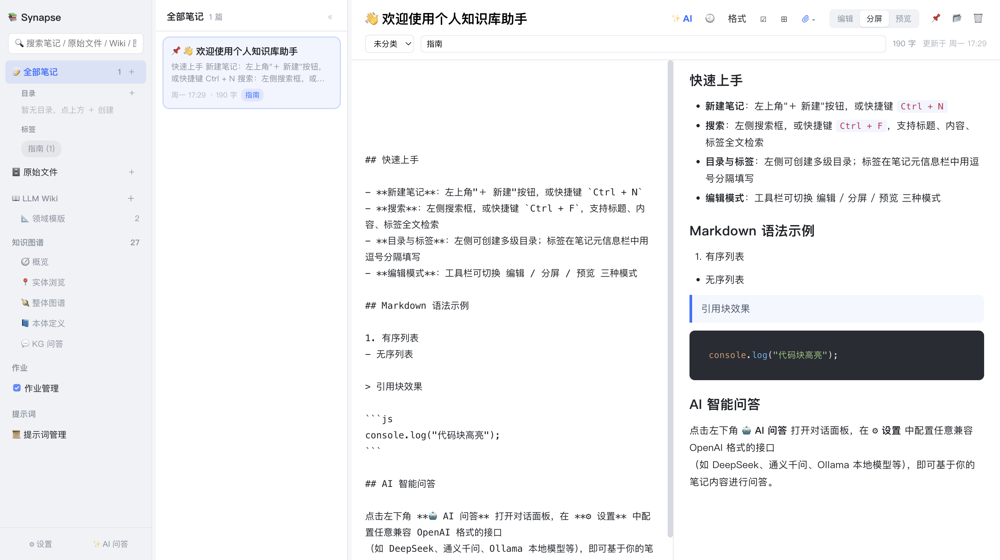

# 2. 笔记管理

[← 返回目录](README.md)

笔记是 Synapse 中你亲手书写的内容。每条笔记都以独立的 Markdown 文件保存在 `<数据根目录>/note/` 下，可以用任意编辑器直接打开，也便于用 git 管理。

## 2.1 新建与删除

| 操作 | 方式 |
|---|---|
| 新建笔记 | 点「📝 笔记」右侧的 `＋`，或快捷键 `Ctrl + N` |
| 在指定目录下新建 | 鼠标移到目录上，点目录行内的 `＋` |
| 删除笔记 | 编辑器右上角 🗑 按钮（移入垃圾桶，可还原） |
| 还原笔记 | 进入「🗑 垃圾桶」，右键笔记选「♻️ 还原到原来的位置」 |

## 2.2 编辑器

编辑器顶部工具栏（从左到右）：

| 按钮 | 功能 |
|---|---|
| **✨ AI** | AI 辅助改写/润色当前笔记正文 |
| 🕘 | 历史版本列表 |
| **格式** | Markdown 格式化插入菜单 |
| ☑ | 插入核对清单 |
| ⊞ | 插入表格 |
| 📎 | 附加图片/文件/扫描文稿 |
| **编辑 / 分屏 / 预览** | 三种视图模式切换 |
| 📌 | 置顶该笔记 |
| ☆ | 收藏该笔记（加入「我的收藏」筛选） |
| 📂 | 在系统文件管理器中打开笔记所在文件夹 |
| 🗑 | 删除笔记 |

标题下方一行是**元信息栏**：右侧仅显示字数与更新时间（归属目录徽标与标签输入框已按需求移除；修改归属目录：右键笔记卡片选「移动到目录…」）。

### 视图模式

- **编辑** — 纯 Markdown 源码
- **分屏** — 左侧源码 + 右侧实时预览（上图即为分屏模式）
- **预览** — 仅渲染结果

默认模式可在「设置 → 编辑器 → 默认编辑器模式」中修改。

### 支持的 Markdown

标题、粗体/斜体、有序/无序列表、任务清单、引用块、表格、链接、图片、行内代码与围栏代码块（带语法高亮，采用 atom-one-dark 深色主题）。

## 2.3 目录与标签

- **笔记列表**：点「📝 笔记」后，中间列表为**目录浏览**模式：根目录展示「子目录 + 直属笔记（未分类）」，目录行带递归计数、可点击逐层进入（进入后列表展示该目录含子目录的全部笔记），像文件管理器一样逐级浏览。目录 / 标签视图则保持平铺卡片，子目录笔记标出相对路径。
- **目录**：侧边栏「目录」区点 `＋` 新建，支持多级嵌套。目录行内可 `＋`（新建笔记）、`✏`（重命名）、`✕`（删除）。删除目录会连同全部子目录一起移除，其下所有笔记移到「🗑 垃圾桶」（磁盘 `<数据根>/note/trash/` 目录，确认框会提示子目录与笔记数量）。垃圾桶可展开 / 点击查看里面的笔记；右键垃圾桶可「清空垃圾桶」（永久删除，不可恢复）。磁盘上整棵子树没有任何笔记文件的空目录不会被识别为目录（启动时自动清理）。
- **还原**：删除（含删除目录）移入垃圾桶的笔记会记住原目录位置；在垃圾桶内右键笔记（或侧边栏垃圾桶下的笔记叶节点）选「♻️ 还原到原来的位置」即可放回原目录，原目录已被删除时还原到根目录。垃圾桶内再按 🗑 删除则为永久删除。
- **标签**：侧边栏「标签」区会自动汇总为标签云，显示每个标签的笔记数，点击即筛选（元信息栏的标签输入框已按需求移除，历史标签仍保留并可筛选）。

> 磁盘目录结构与应用内目录树保持一致：如果你在文件系统里手动新建了目录并放入 `.md` 文件，Synapse 启动时会自动识别并补充到目录树中。

### 置顶与收藏

- **📌 置顶**：点编辑器工具栏 📌 按钮，笔记会排在列表最上方。再点一次取消置顶。
- **☆ 收藏**：点编辑器工具栏 ☆ 按钮，把笔记加入「我的收藏」。收藏后：
  - 按钮变为金色实底 + 「已收藏」标签，再点一次取消收藏
  - 笔记卡片标题前显示 ⭐ 图标
  - 点笔记列表头部的 ⭐ 筛选按钮，只显示收藏的笔记
  - 右键笔记卡片也可「⭐ 收藏 / 取消收藏」

## 2.4 搜索

侧边栏顶部搜索框支持对**标题、正文、标签**做全文检索，快捷键 `Ctrl + F`。搜索结果中的命中词会高亮显示。搜索范围同时覆盖笔记、原始文件与知识图谱，按分类分组展示。

## 2.5 附件与图片

点工具栏 📎 可附加图片或文件：

- **图片**：单张限制 4MB。插入策略可选——
  - *保存为本地文件并引用*（默认）：图片存到该笔记的同名目录 `<note根>/<目录>/<笔记标题>/` 下，正文用 `kb-asset://` 协议引用
  - *base64 内嵌到笔记*：直接嵌入正文
- **非图片文件**：以链接形式引用本机路径

> 推荐使用「保存为本地文件」方式：笔记正文保持简洁，附件与笔记同目录存放，便于整体备份与迁移。

### 扫描文稿（OCR）

若所配置的模型具备视觉能力，可把图片交给模型识别文字与表格，直接输出 Markdown 正文。

## 2.6 历史版本

点工具栏 🕘 查看历史版本。版本号精确到秒（如 `2026-08-22 14:16:05`），同一秒内多次保存会追加 `-2`、`-3` 后缀。

- **查看 / 恢复**：每行有「查看」（抽屉内只读预览）与「恢复」按钮；恢复前会自动备份当前内容一版，因此可放心回退。
- **版本对比**：勾选任意两个版本（最多保留最近勾选的 2 个），底部出现「对比所选」按钮，点击后在抽屉内以行级 diff 展示两个版本的差异——删除行（−）、新增行（+）与相同行三色区分，并给出增删行数统计；两版完全一致时会明确提示。

AI 改动前后会各自动保存一条版本，恢复某个版本之前也会自动备份当前内容，因此 AI 改写可以放心回退。删除笔记时其历史版本一并清理。

## 2.7 AI 辅助改写

点工具栏 **✨ AI** 对当前正文做润色：修正错别字与语病、优化表达、统一术语，保持原意与 Markdown 结构不变。

默认提示词可在「设置 → 编辑器 → AI 辅助提示词」或「提示词管理 → AI 辅助 · 润色」中自定义（留空则使用内置默认）。

## 2.8 把笔记加工成知识

在**笔记卡片**或**目录**上**右键**，可将笔记送入知识加工流水线：

| 菜单项 | 作用 |
|---|---|
| 🕸 提取知识图谱 | 从笔记中抽取实体与关系加入图谱 |

在目录上右键时，菜单为「🕸 提取知识图谱（N 篇笔记）」，对该目录及其所有子目录下的笔记批量处理；右键侧边栏「📝 笔记」入口可一键「🕸 全部笔记提取知识图谱」。空内容的笔记会被自动跳过。

## 2.9 导出与备份

笔记本身就是 `<数据根目录>/note/` 下的标准 Markdown 文件，可直接复制、用其他编辑器打开或纳入 git 管理，无需专门导出。工具栏 📂 可一键在系统文件管理器中打开当前笔记所在文件夹。

---

上一章：[← 1. 快速开始](01-快速开始.md) ｜ 下一章：[3. AI 问答 →](03-AI问答.md)
