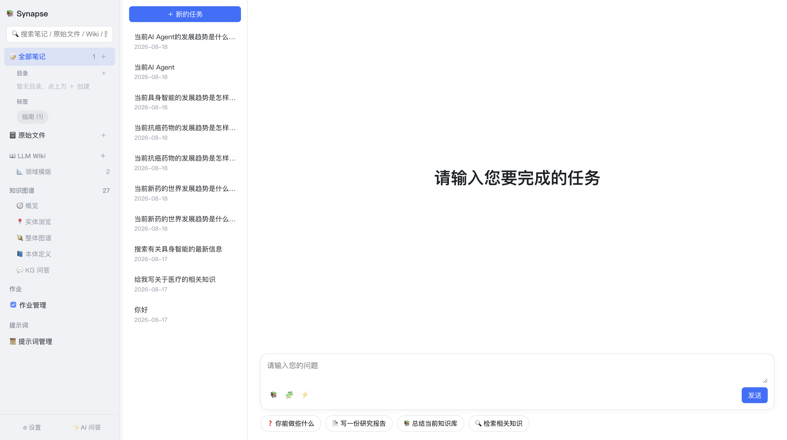
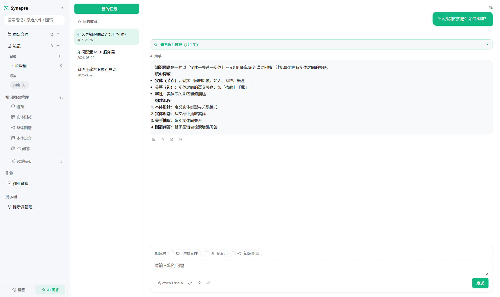

# 3. AI 问答

[← 返回目录](README.md)

AI 问答是 Synapse 的统一对话入口。它不只是普通聊天——回答会结合你的**笔记、原始文件、知识图谱**，还可以调用**联网搜索（MCP）**与**技能（Skills）**生成真实的办公文件。

点击左下角 **✨ AI 问答** 进入。

## 3.1 界面说明

| 区域 | 说明 |
|---|---|
| 中间列 | **＋ 新的任务** 按钮 + **⭐ 我的收藏** 入口 + 历史会话列表（按日期排列），点击任一会话可继续对话；回答中的会话带「回答中」标识，回答过程中切走再点回该会话，进行中的步骤与已生成内容原位恢复可见 |
| 右侧主区 | 对话内容区；新会话显示「请输入您要完成的任务」，并附**基础配置引导清单**（模型 / MinerU / 首份原始文档三项，初始未勾选，点「开始配置」跳转对应页面，配好后复选框显示绿色勾）与**配置 MCP / 技能引导卡**（添加并启用 MCP 服务器、启用技能后显示绿色勾，点「开始配置」跳转设置·MCP / 技能页签）；引导卡下方另有 **📖 使用手册** 按钮，可在应用内直接翻阅本文档 |
| 输入框上方知识源条 | 🗄 原始文件 / 📝 笔记 / 🕸 知识图谱 三个知识源平铺展示，点一下即勾选/取消；**默认都不勾选**，未选择时模型用自身知识回答；勾选「知识图谱」后右侧追加**体系范围子选择**（默认「全部」，可指定某个本体体系，只召回该体系下抽取的节点） |
| 输入框底栏 | 左侧：模型选择按钮（按 provider → 具体模型两级切换）、🧩 MCP 服务器、⚡ 技能、📎 附件（仅本次提问使用，最多 5 个文件）；右侧 **发送**（或回车）提交，回答中该按钮变为 **■ 停止** |

## 3.2 知识源选择

输入框**上方**平铺着三个知识源开关，点一下即勾选/取消，**默认都不勾选**：

| 知识源 | 作用 |
|---|---|
| 🗄 **原始文件** | 对已引入的原始文件做关键字（grep 式）检索，命中片段连同文件名注入上下文 |
| 📝 **笔记** | 按问题检索相关笔记，把正文注入上下文 |
| 🕸 **知识图谱** | 按问题召回相关实体及其关系，作为事实依据注入 |

三者可任意组合；一个都不选时输入区会提示「未选择数据源，模型将用自身知识回答」。回答下方会展示**引用来源**，便于溯源核对。

**知识图谱的体系范围**：勾选「知识图谱」后，知识源条会追加一个体系子选择按钮（默认「全部 ▾」）。点开可选：

- **全部知识图谱** — 不区分体系，多体系节点一起召回；
- **指定体系**（如 BFO-Lite / BFO 2020 / ISO 15926 / 已导入的 OWL 体系）— 只召回该体系下抽取的节点，适合多体系图谱共存时按体系隔离问答。

选择会持久化保存；若所选体系后来被删除（如移除 OWL 导入），自动回退「全部」。

## 3.3 会话管理

- **＋ 新的任务** — 开启一个全新会话
- 会话历史保存在本地数据库，跨应用重启保留
- 点击历史会话即可回看或继续追问
- 对话具备上下文记忆，可以直接追问「再详细讲讲第二点」

### 停止回答

回答进行中，**发送**按钮会切换为 **■ 停止**，点一下立即中断本次回答：已生成的部分会保留在气泡里并追加「⚠ 已停止。」标记，随后可直接输入新问题。回答中再点发送也等同于停止。

### 编辑已发送的问题

鼠标悬停在自己发出的问题上会出现 **✎** 按钮，点击后气泡变为输入框，可**更改内容再次发送**。重新发送会截断该问题及其之后的全部对话（相当于从这条问题重来），请留意已有回答会被移除。

## 3.4 收藏回答

PC 场景下更常用「收藏」沉淀好答案：每条回答下方有 ⭐ 按钮，点一下即收藏（再点取消），收藏状态随会话持久化，重启不丢。

- **⭐ 我的收藏** — 位于左侧「＋ 新的任务」下方，按钮上带收藏计数；点击后左列表切换为收藏清单（回答摘要 + 所属会话），再点切回会话列表
- 点击收藏条目跳回原会话，目标回答滚动居中并短暂高亮，便于回溯上下文
- 暂无收藏时列表显示引导文案

## 3.5 思考过程展示

若使用推理型模型（如带 thinking 的模型），模型的思考过程会以**可折叠区块**实时显示在回答上方，默认收起，点击展开。这样既能看到推理链路，又不会干扰阅读最终答案。

同时，AI 调用工具的步骤（工具名、参数、返回结果摘要）也会以步骤块的形式展示，整个过程透明可见。

## 3.6 澄清问题机制

当任务明显开放且缺少关键约束（例如「写一份研究报告」没说方向、格式、受众），AI 不会盲目开工，而是先返回一组**选择卡片**向你确认：

- 整个任务最多问一次
- 最多 3 个问题，每题 2–5 个选项
- 支持单选与多选

你选择后，AI 才基于确认过的约束正式作答。普通提问或信息已充分时不会触发此机制。

## 3.7 联网搜索（🧩 MCP）

点 🧩 图标可查看已配置的 MCP 服务器。**已启用的服务器默认全部参与**本次问答，模型自行决定调用哪个工具、调几轮；不需要某个服务器时在菜单里点一下即可**去除**（再点恢复）。Synapse 内置了阿里云百炼 **WebSearch** 服务（首次启动自动植入，API Key 复用模型配置，无需重复填写）。

行为说明：

- 系统提示词明确要求：问题涉及实时/最新/事实性信息，或知识库不足以回答时，模型**必须先调用工具**再作答，不得仅因「知识库没有」就拒答
- 若模型只口头说「让我搜索」却不实际调用工具，系统会检测到并**催促一次**真实工具调用（最多催一次，避免循环）
- 若工具装载失败，会下发告警步骤，便于定位是哪个服务器的问题
- 搜索的查询词与结果摘要都会在步骤块中展示

MCP 服务器的配置方式见 [10. 设置](10-设置.md#107-mcp)。

## 3.8 技能（⚡ Skills）

技能是一组遵循 `SKILL.md` 规范的能力包（与主流 Agent 生态的技能格式兼容）。点 ⚡ 图标查看已启用技能——与 MCP 一样，**已启用技能默认全部参与**，可在菜单内逐个去除/恢复。当问题里直接提到某技能名或其格式别名（如「word / ppt / 幻灯片 / excel / 电子表格」）时，对应技能会被标注为「与请求格式直接匹配」，AI 必须按该技能指令完成，不得声称无法执行。

**可执行技能**：当启用了名称含 `docx` / `pptx` / `xlsx` 的技能时，AI 会获得一个脚本执行工具，能够编写并运行 Node.js 脚本，生成**真实的办公文件**：

| 文件类型 | 使用的库 |
|---|---|
| `.docx` | `docx` |
| `.pptx` | `pptxgenjs` |
| `.xlsx` | `exceljs` |

生成的文件保存到 `<数据根目录>/artifacts/`，并在对话中以 **📄 产物卡片**呈现，点卡片上的按钮即可用系统默认程序打开。

执行环境的安全边界：仅允许 node 解释器、限定输出目录、超时自动 kill（默认 60 秒，上限 180 秒）、结束后清理进程树。

技能的添加与管理见 [10. 设置](10-设置.md#108-技能)。

## 3.9 其他问答入口

除主框架 AI 问答页外，还有一个专门入口：

| 入口 | 位置 | 特点 |
|---|---|---|
| **KG 问答** | 知识图谱管理 → 💬 KG 问答 | 基于图谱做多跳推理，沿实体回溯原文材料，见 [7. 知识图谱](07-知识图谱.md#75-kg-问答) |

## 3.10 回答回填

较长的回答下方会出现 **📄 回填卡片**，点击 **↩ 回填** 即把「问题 + 回答」存为一篇新笔记（自动加 `#AI问答` 标签、标题去重）。成功后卡片变为可点击状态，直接跳转到该笔记继续编辑。

## 3.11 使用建议

- **问事实性/最新信息** → 确保 🧩 MCP 服务器参与（已启用默认全部参与，可在输入框 🧩 菜单中去除/恢复）
- **问自己积累的知识** → 勾选笔记 + 原始文件
- **问概念之间的关系** → 勾选知识图谱
- **要生成文档/报告文件** → 启用对应的 docx/pptx/xlsx 技能
- 若回答质量不理想，可在「提示词管理」中定制该场景的系统提示词

---

上一章：[← 2. 笔记管理](02-笔记管理.md) ｜ 下一章：[4. 原始文件管理 →](04-原始文件管理.md)
