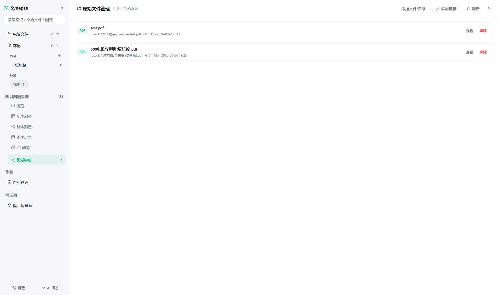

# 4. 原始文件管理

[← 返回目录](README.md)

「原始文件」是资料管理入口：先把待处理的资料收集到这里，再从这里直接「提取笔记」或发起「提取知识图谱」。

点击侧边栏 **🗄 原始文件** 进入。



*上图为一个名为「双十一」的目录引用（共 160 个来源，可逐级展开，行内提供 查看/解除）；顶部工具栏为 ＋ 添加文件/目录、🔗 添加链接、🔄 刷新 三个按钮。*

## 4.1 核心设计：引用式管理

Synapse 对本机文件采用**引用式**管理——**不复制副本**，只记录本机路径。

这样做的好处：

- 不重复占用磁盘空间
- 源文件更新后，Synapse 侧自动感知（列表实时反映文件的大小与修改时间）
- 「解除引用」不会删除你的本机文件

对于**目录引用**，Synapse 会在每次打开列表时**实时遍历**源目录，因此你在源目录里新增或删除文件，列表会同步变化，无需重新导入。

## 4.2 添加来源

顶部工具栏 3 个按钮：

| 按钮 | 说明 |
|---|---|
| **＋ 添加文件/目录** | 打开本机浏览弹窗：可勾选单个/多个文件（引用式，不复制），也可把整个目录作为引用导入（保留多级结构，实时遍历） |
| **🔗 添加链接** | 登记一个网页链接（只保存链接信息并读取一次网页标题作展示名，不下载正文）。需登录的站点（如语雀/飞书）可填用户名/密码：弹出应用内登录窗自动填充，登录态（Cookie）持久化保留，之后问答/提取读取该链接正文时自动带上；取不到标题时可手动补填展示名，之后也可行内「改名」 |
| **🔄 刷新** | 重新扫描列表 |

### 支持的文件格式

| 类别 | 扩展名 |
|---|---|
| 文档 | `pdf`、`docx` |
| 表格 | `xlsx`、`xls`、`csv` |
| 演示 | `pptx` |
| 文本/标记 | `md`、`markdown`、`txt`、`html`、`htm` |
| 图片（MinerU） | `png`、`jpg`、`jpeg`、`jp2`、`webp`、`gif`、`bmp`、`tiff` |

文本类格式的提取方式：PDF 抽取文本层；DOCX 转 HTML 再转 Markdown；Excel 按工作表转 CSV；PPTX 按幻灯片抽取文本；HTML 转 Markdown。

**MinerU 优先**：配置了本地 MinerU 转换命令（设置 → 文档解析）后，`pdf`/`docx`/`pptx`/`xlsx` 与图片等二进制格式会**优先走 MinerU**（扫描件 PDF、图片等内置解析拿不到文本的场景尤其有用），失败自动回退内置解析。**图片格式只有 MinerU 能解析**——未配置转换命令时读取会提示不支持并引导去设置。

> 提取是**按需**进行的：文件原样保留，只有在真正要提取笔记或抽取图谱时才提取文本。因此添加过程很快。

### 目录引用的排除规则

遍历目录时自动跳过以下依赖/构建/隐藏目录，避免噪音：

`.venv`、`node_modules`、`.git`、`.idea`、`.vscode`、`.qoder`、`__pycache__`、`.DS_Store`、`dist`、`build`、`target`

## 4.3 列表信息

每行显示：文件名、扩展名、大小和修改时间。

### 处理状态

| 状态 | 含义 |
|---|---|
| 无标记 | 尚未提取 |
| 已处理 | 该来源已完成知识加工 |

提取笔记后，生成的 Markdown 文件会出现在「📝 笔记」中；知识图谱任务则进入后台作业队列。

> 使用 MinerU 解析时，提取出的笔记与「设置 → MinerU 测试」的产物一致：正文为转换出的 Markdown，文件名中的 URL 编码会被解码为可读标题，且 MinerU 产出的图片会自动拷贝到笔记同名附件目录并在正文中以可访问的引用呈现。

## 4.4 发起知识加工

在文件行或目录行上**右键**：

| 菜单项 | 作用 |
|---|---|
| 📝 提取笔记 | 把该来源解析为 Markdown 笔记 |
| 🕸 提取知识图谱 | 从该来源抽取实体与关系加入图谱（提交前可选领域与本体体系） |

在**目录行**右键时会对该目录下所有文件批量处理。提交后进入 [作业管理](08-作业管理.md) 查看进度。

> 「提取笔记」每次都会**重新解析来源并原地更新**同名笔记（不做结果缓存），保证笔记始终反映文件的最新内容。

## 4.5 查看与移除

- **查看** — 点击行内查看按钮，用本机默认软件打开原始文件（网页模式不支持）
- **移除** — 行为取决于来源类型：

| 来源类型 | 移除行为 |
|---|---|
| 单文件引用（`local:`） | 从引用清单移除，**不删除本机文件** |
| 目录引用下的文件 | 加入排除集，**不删除本机文件** |
| 目录引用整体（「解除」按钮） | 移除目录引用及其下的单文件引用与排除项，**不删除任何本机文件** |
| 链接引用（`url:`） | 从链接清单移除，**不删除网页** |
| `raw/_auto/` 下的自动生成文件 | 真正删除该文件 |

> 目录行上有醒目的「解除」按钮，用于一次性解除整个目录的引用关系。

## 4.6 提取笔记的落盘组织

```
<数据根目录>/note/
├── （按原始目录结构创建的子目录）
└── xxx.md                 # 提取生成的 Markdown 笔记
```

原始文件仍采用引用式管理；「提取笔记」会把解析后的内容写入 `note/`，不会修改原始文件。

> 笔记落盘目录跟随来源：目录引用按「根目录名 + 子目录」建目录；**单文件引用**用文件所在**父目录名**作笔记目录（如 `/Users/qiang/Documents/知识图谱.pdf` → `note/Documents/知识图谱.md`），避免落入未分类（垃圾桶）。同源重复提取会原地更新；若旧笔记此前因缺目录信息落在垃圾桶，重新提取时会自动移出到目标目录。

---

上一章：[← 3. AI 问答](03-AI问答.md) ｜ 下一章：[6. 领域模版 →](06-领域模版.md)
