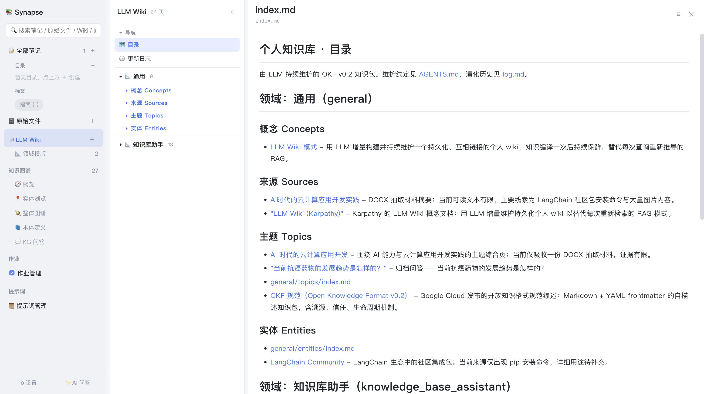
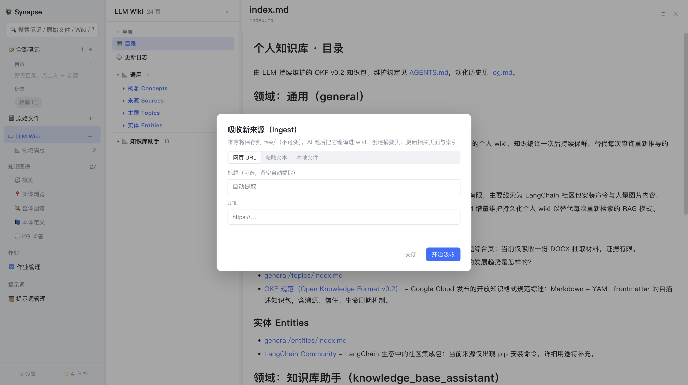

# 5. LLM Wiki

[← 返回目录](README.md)

LLM Wiki 是 Synapse 的核心产出物：AI 把零散的原始资料**编译**成一套结构化、互相链接、可持续维护的知识页面。

这个思路来自 Karpathy 的 llm-wiki 理念——与「每次提问都重新检索」的 RAG 不同，知识**编译一次后持续保鲜**，形成真正沉淀下来的个人 wiki。页面遵循 Google 的 **OKF v0.2**（Open Knowledge Format）规范：Markdown + YAML frontmatter 的自描述知识包。



## 5.1 目录结构

```
<数据根目录>/llmwiki/
├── AGENTS.md                        # 维护约定（AI 必须遵守的规则）
├── index.md                         # 目录（应用确定性重建，勿手改）
├── log.md                           # 变更日志（应用追加）
├── raw/                             # 不可变原始源层，AI 只读不写
└── <领域>/                          # 如 general、knowledge_base_assistant
    ├── sources/<slug>.md            # 来源摘要页（每个来源至少一个）
    ├── concepts/<slug>.md           # 概念与方法论
    ├── entities/<slug>.md           # 人物 / 组织 / 工具
    └── topics/<slug>.md             # 主题综合页与归档问答
```

四种 OKF 页面类型：

| 类型 | 用途 |
|---|---|
| **sources** | 来源摘要页，每次吸收必须为每个来源至少创建一个 |
| **concepts** | 概念、方法论、术语 |
| **entities** | 人物、组织、产品、工具等具体个体 |
| **topics** | 主题综合页，以及归档的问答（type: Answer） |

每个页面都带 YAML frontmatter：`type`、`title`、`description`、`tags`、`status`、`generated`、`domain`。正文中文书写、术语保留英文，文件名用 kebab-case 英文 slug。

## 5.2 吸收新来源（Ingest）

点侧边栏 **📖 LLM Wiki** 右侧的 `＋` 打开吸收弹窗：



三个来源标签页：

| 标签 | 说明 |
|---|---|
| **网页 URL** | 填入网址，自动抓取正文并转 Markdown（标题可留空自动提取） |
| **粘贴文本** | 直接粘贴文章内容 |
| **本地文件** | 选择本机文件 |

填好后点 **开始吸收**，作业进入后台队列执行。

> 也可以从其他位置发起吸收（推荐）：在**原始文件**行、**笔记卡片**、**目录**上右键 → 「提取 Wiki」。

### 吸收流水线

吸收作业分 3 个阶段：

```
① 解析保存来源          ② AI 编译              ③ 落盘
提取文本 → 存入 raw/  →  匹配领域模版         →  写入页面文件
                          生成页面计划(JSON)     重建 index.md
                                                 追加 log.md
```

**领域模版预检查**：提交前系统会先判断来源属于哪个领域——

- **命中**特定领域 → 直接使用该模版的抽取规则
- **未命中** → 询问你，确定后自动打开「新建领域模版」弹窗，AI 归纳领域名称并生成各字段，审阅后点「创建」即继续吸收；取消则使用通用模版

详见 [6. 领域模版](06-领域模版.md)。

**逐来源独立编译**：当来源数与任务数对齐时，每个来源作为一个独立子任务分别编译（轻量上下文，速度更快），在作业页可看到每个子任务的实时输出。

## 5.3 浏览 Wiki

点击侧边栏 **📖 LLM Wiki** 标题，中间列显示页面索引：

- 顶部 **导航** 组：📕 目录（index.md）、🕐 更新日志（log.md）
- 下方按**领域**分组（如「通用 9」「知识库助手 13」），每组内再按 OKF 类型细分：概念 Concepts / 来源 Sources / 主题 Topics / 实体 Entities
- 分组**默认折叠**，点击标题（▸ / ▾）逐级展开

点击任一页面即在右侧渲染阅读。页面内的 `[标题](路径.md)` 链接可直接跳转，形成互相链接的知识网络。

`index.md` 由应用**确定性重建**（按领域 → 类型分组自动生成），每次吸收、迁移、回填后自动刷新，因此不要手动编辑它。

## 5.4 Wiki 问答

在 Wiki 视图内提问，采用**两步检索**：

1. 把 `index.md` 与页面清单交给模型，让它选出回答问题最需要阅读的页面（默认最多 5 个，可在设置中调整）
2. 读取这些页面的完整内容，作为上下文流式生成回答

回答中引用页面时会用 `[页面标题](/路径.md)` 形式标注出处，界面上会展示本次引用的页面清单。若勾选了知识图谱，还会一并注入图谱事实。

### 问答归档

可以把一次有价值的问答**回填**为 Wiki 页面，存为 `<领域>/topics/answer-<时间戳>.md`（`type: Answer`），并自动重建索引、追加变更日志。这样一问一答也成为知识库的一部分。

## 5.5 Wiki 体检（Lint）

体检会让 AI 通读**全部页面**，从以下维度输出一份 Markdown 健康报告：

- 页面间矛盾之处
- 陈旧论断
- 孤儿页（无入链）
- 被频繁提及却没有独立页面的概念
- 缺失的交叉引用
- frontmatter 不合规项（对照 OKF v0.2）
- 值得补充的来源或值得提出的新问题

发起方式：在「作业管理」页点 **＋ 新建体检**。完成后点该作业行的 **📄 报告** 按钮查看。

由于要通读全库，体检耗时较长（通常 1–3 分钟），属于典型的后台作业。

## 5.6 变更日志

`log.md` 按日期分组记录每次操作：

```markdown
## 2026-08-22
* **Ingest**: 吸收 [xxx.pdf](../raw/xxx.pdf)：<摘要>；触及页面：general/sources/xxx.md、…
* **Query**: 问答回填 [问题标题](general/topics/answer-20260822-141605123.md)
```

这让知识库的演化过程完全可追溯。

## 5.7 Wiki 根目录

默认为 `<数据根目录>/llmwiki/`，可在「设置 → 存储 → Wiki 根目录」中自定义。

由于 Wiki 全部是 Markdown 文件，它天然 **git 友好**——你可以把 `llmwiki/` 目录单独用 git 管理，获得完整的版本历史，也可以用任何 Markdown 工具查看。

---

上一章：[← 4. 原始文件管理](04-原始文件管理.md) ｜ 下一章：[6. 领域模版 →](06-领域模版.md)
