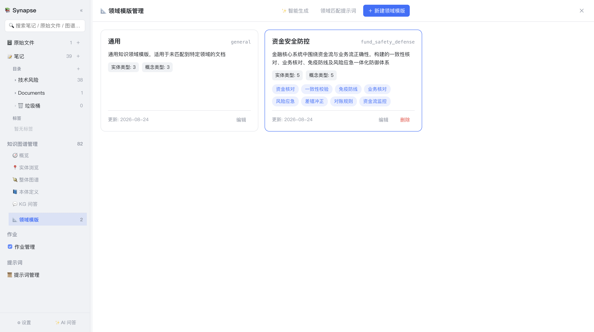

# 6. 领域模版

[← 返回目录](README.md)

领域模版解决一个关键问题：**不同领域的知识，该抽取的东西完全不同**。

医学论文要抽「药物、靶点、临床试验」；产品文档要抽「功能入口、配置项、使用场景」。领域模版就是告诉 AI「在这个领域里该关注什么、忽略什么、页面怎么组织」的规则集。

点击侧边栏 **知识图谱管理 → 📐 领域模版** 进入（领域模版只在抽取知识图谱时用到，故收在知识图谱管理子菜单里）。



*上图为真实的模版列表：内置的「通用」模版，以及一个「资金安全防控」领域模版（含 5 个实体类型、5 个概念类型与 8 个关键词，如资金核对、一致性校验、免疫防线等）。*

## 6.1 模版结构

每个模版包含以下字段：

| 字段 | 说明 |
|---|---|
| **模版 ID** | 英文标识符（字母开头，仅字母/数字/下划线），用于知识图谱抽取规则标识；**无需手动填写**——创建时留空由系统自动生成，AI 生成时按领域语义回填 |
| **名称** | 中文显示名，如「知识库助手」 |
| **描述** | 领域简述，参与领域匹配判定 |
| **关键词** | 5–8 个，逗号分隔。用于关键词兜底匹配 |
| **实体类型** | 该领域应识别的具体个体类型（如人物、组织、产品） |
| **概念类型** | 该领域应识别的抽象概念类型（如方法、术语、原则） |
| **必须提取** | 3–6 条，不得遗漏的信息点 |
| **忽略内容** | 2–4 条，不应写入页面的内容（如广告、导航文本） |
| **质量标准** | 一段话，描述页面内容的质量要求 |
| **核心页面骨架** | 3–5 个页面标题与职责，指导 topics 综合页的章节组织 |

这些字段会被组装成「领域约束块」注入 AI 提示词。当前版本中，**实体类型与概念类型**会作为类型提示注入知识图谱抽取，约束 AI 识别哪些对象；其余字段（必须提取、忽略内容、质量标准、页面骨架）服务于吸收管线——吸收在当前界面已无发起入口，这些字段主要为历史兼容保留。

新建/编辑页按规则用途分成三组，便于对照检查：

- **① 领域定位**（名称 / 描述 / 关键词）——让 AI 认得这个领域，图谱抽取时据此判定「属于哪个领域」；模版 ID 放在「✨ AI 自动生成模版」按钮下方，无需填写（创建时留空自动生成）；
- **② 抽取规则**（关注的实体/概念类型、必须提取、忽略内容）——关注什么、忽略什么；
- **③ 产物组织**（核心页面骨架、质量标准）——产物怎么组织。

## 6.2 内置通用模版

`general`（通用）是内置模版，**不可删除**，在未匹配到任何特定领域时兜底：

- 实体类型：人物、组织、产品/工具
- 概念类型：方法、术语、原则
- 必须提取：核心概念定义、关键事实与数据、结论与要点
- 忽略内容：广告与推广内容、页面导航等无关文本

## 6.3 新建模版

顶部工具栏 **＋ 新建模版**，在弹窗中填写各字段。带 `*` 的为必填项；**模版 ID 不需要填写**（位于 AI 自动生成按钮下方，创建时留空会自动生成，编辑时可查看但不可改）。

### AI 自动生成（推荐）

**名称**和**描述**都填写后，点击 AI 生成按钮，模型会自动补全 ID、关键词、实体/概念类型、提取规则、质量标准与页面骨架。生成过程会**流式打印**在弹窗中，你可以看到模型的思考与输出。

生成结果可以直接编辑修改后再保存。

> ID 生成规则：模型会产出与领域语义对应的英文标识（如「樱桃种植」→ `cherry_planting`）。若模型返回了泛化占位值（如 `example`、`domain`、`test`），系统会自动回退为带时间戳的 ID，你可以手动改成更合适的名称。

### 智能生成（批量）

顶部 **✨ 智能生成** 会分析你**全部笔记 + 已管理的原始文件**，归纳出 1–3 个候选领域模版供你选择保存。适合知识库已有一定积累后，一次性建立领域体系。

## 6.4 图谱抽取时的领域匹配

右键「🕸 提取知识图谱」提交前会先弹出「选择领域」对话框，提供四种方式：

| 方式 | 说明 |
|---|---|
| 🤖 **自动（推荐）** | 先按内容匹配已有领域；没有合适的就在作业内自动归纳并新建一个 |
| 📚 **指定已有领域** | 不调模型，直接用所选领域的实体/概念类型约束（提交最快） |
| ✨ **自动创建新领域** | 跳过匹配，直接按来源内容归纳并新建领域（在作业内执行） |
| ✍️ **手动新建领域** | 现在打开「新建领域模版」，用 AI 生成后审阅创建 |

选择 🤖 自动时，系统按以下顺序做领域预匹配：

```
① LLM 判定：阅读来源摘录，从模版清单中选出最匹配的一个
        ↓ 失败、超时或结果非法
② 关键词兜底：按各模版关键词在来源中的命中次数打分，取最高
        ↓ 全部未命中或判定为 general
③ 未命中特定领域 → 交由作业内按来源内容归纳并新建领域
```

> 图谱的领域预匹配只用于附加类型约束，且有 10 秒限时——模型太慢时宁可放弃约束也要尽快把作业排上队列。

顶部 **领域匹配提示词** 按钮可查看当前用于领域判定的完整提示词，便于理解与调优判定逻辑。

## 6.5 自动建模：让领域结构自然生长

这是一个体验上的关键设计——当你为一份全新领域的资料抽取图谱时：

- **✍️ 手动新建领域**：系统打开「新建领域模版」弹窗，AI 先从来源内容**归纳领域名称与简述**并自动填入，随即自动生成其余全部字段；你审阅（可修改）后点「创建」，即以新模版继续抽取。
- **🤖 自动 / ✨ 自动创建新领域**：未命中特定领域时，作业会按来源内容**归纳领域名称**——若已有同名模版则直接复用，否则自动生成该模版的实体/概念类型并保存。

整个过程无需你预先规划领域体系，知识库的领域结构会随着资料的积累自然生长。

## 6.6 编辑与删除

- 每个模版卡片底部有 **编辑** 按钮，可修改全部字段
- 非内置模版有 **删除** 按钮；内置「通用」模版不可删除
- 卡片上显示实体类型/概念类型数量、关键词标签与最近更新日期

> 模版 ID 会写入知识图谱作业的领域信息，建议投入使用后保持稳定。

## 6.7 与知识图谱的配合

领域模版的实体类型与概念类型也会作为**类型提示**注入图谱抽取提示词：抽取时 AI 会围绕该领域模版的类别组织节点——`entity` 节点对应模版的实体类型，`concept` 节点对应概念类型。

这让图谱抽取在同一套领域语义下保持一致。

---

上一章：[← 4. 原始文件管理](04-原始文件管理.md) ｜ 下一章：[7. 知识图谱 →](07-知识图谱.md)
