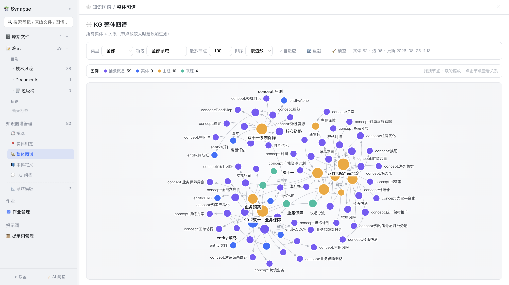
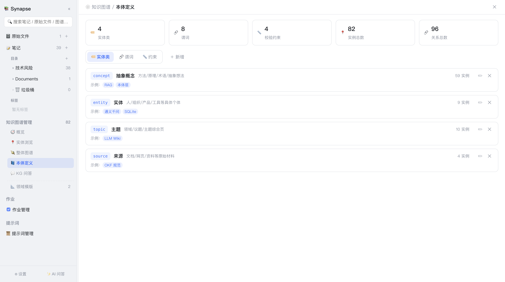
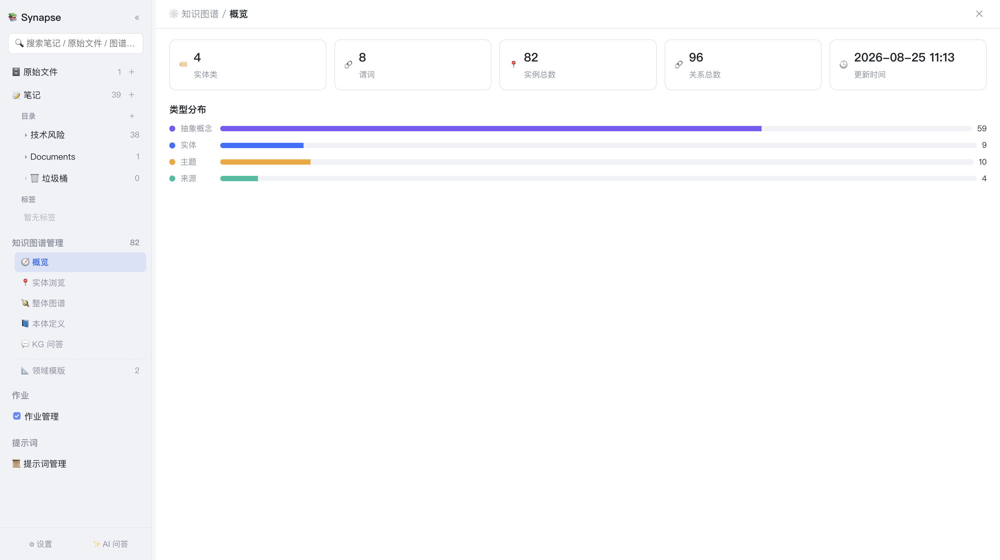
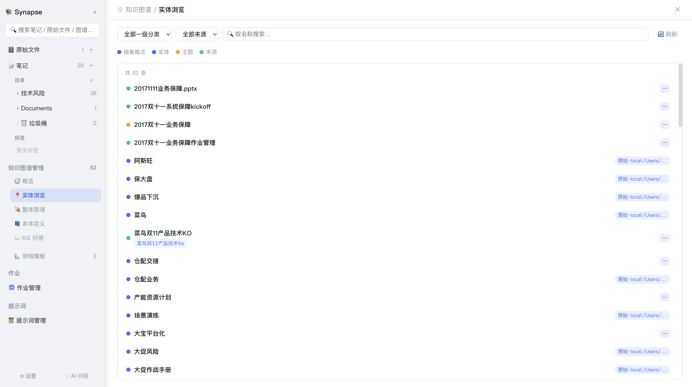
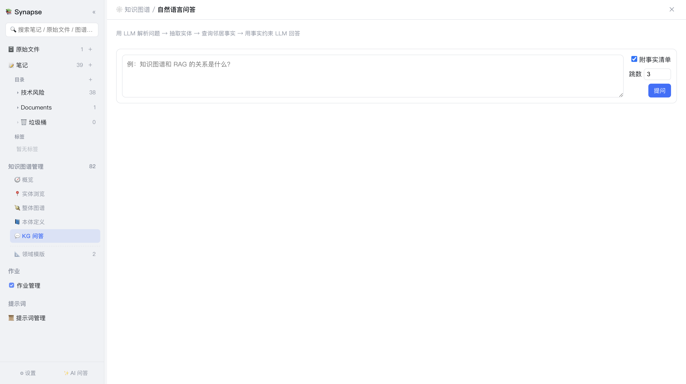

# 7. 知识图谱

[← 返回目录](README.md)

知识图谱让**知识之间的连接可见**。AI 从你的笔记与原始文件中抽取实体、概念及它们之间的关系，形成一张可视化、可查询、可推理的网络。

侧边栏「知识图谱管理」区块下有 5 个子视图：🧭 概览、📍 实体浏览、🪐 整体图谱、📘 本体定义、💬 KG 问答（📐 领域模版也归属该分区）。



*上图为真实图谱：15 个实体、19 条边，节点按类型着色，边上标注关系谓词（包含、应用于、相关、依赖等）。*

## 7.1 本体层：图谱的"schema"

图谱不是随意连线，而是建立在一套**受控词表**（本体层）之上。这保证了抽取结果的一致性与可查询性。



顶部 5 个统计卡：实体类、谓词、校验约束、实例总数、关系总数。下方三个标签页可增删改查：

### 实体类（默认 5 类）

| key | 名称 | 说明 | 示例 |
|---|---|---|---|
| `concept` | 抽象概念 | 方法/原理/术语/抽象想法 | RAG、本体层 |
| `entity` | 实体 | 人/组织/产品/工具等具体个体 | 通义千问、SQLite |
| `topic` | 主题 | 领域/议题/主题综合页 | LLM Wiki |
| `source` | 来源 | 文档/网页/资料等原始材料 | OKF 规范 |
| `note` | 笔记 | 用户手工记录的 Markdown 条目 | 快速上手 |

每行右侧显示该类当前的**实例数**，可直观看出图谱的类型分布。

### 谓词（默认 8 个）

`属于`、`包含`、`依赖`、`相关`、`引用`、`应用于`、`衍生自`、`矛盾于`

### 校验约束（默认 4 条）

- 节点类型须从实体类中选取，其余回退为 `concept`
- 关系谓词须从受控词表选取，其余回退为「相关」
- 禁止自环边（from == to）
- 节点按规范化名称去重；边按 (from, to, rel) 去重

> 本体定义可自由增删改。修改后的词表会立即作用于后续的抽取任务。删除时有保护：回退实体类不可删除，谓词至少保留一个。

## 7.2 抽取图谱

图谱抽取通过**右键菜单**发起：

| 右键位置 | 抽取范围 |
|---|---|
| 笔记卡片 | 单篇笔记 |
| 目录 | 该目录及子目录下所有笔记 |
| 原始文件行/目录行 | 指定的原始来源 |
| 领域模版卡片 | 「🕸 生成图谱（从该领域 Wiki 页面）」，按该领域约束从 Wiki 页面抽取 |

### 抽取流程

作业分 3 个阶段：**收集语料 → AI 本体抽取 → 合并存图**。

- 每个来源作为一个**独立子任务**分别送入模型（便于逐任务查看进度与输出）
- 抽取时会把**已抽取的节点清单**带给模型，便于建立跨来源的关系、避免重复创建
- 单个来源解析失败会跳过，不中断整体抽取
- 单批最多 30 个节点、50 条边；单来源截断 1500 字符
- 节点按规范化名称去重，边按三元组去重；来源标签会挂到被提及的节点上（最多 5 个），并继承来源的领域归属

## 7.3 整体图谱视图

顶部工具栏：

| 控件 | 作用 |
|---|---|
| **领域** | 按领域筛选（全部领域 / 指定领域） |
| **类型** | 按实体类筛选 |
| **最多节点** | 限制渲染节点数（默认 100） |
| **排序** | 节点取舍依据，如「按边数」优先展示枢纽节点 |
| **⤢ 自适应** | 自动缩放至合适视野 |
| **🔄 重载** | 重新读取图谱数据并重排布局 |
| **🧹 清空** | 清空整个图谱（谨慎操作） |

右上角显示实体数、边数与最近更新时间。

交互方式（右下角有提示）：**拖拽节点** 调整布局 · **滚轮缩放** · **点击节点查看关系**。底部图例标明各类型的节点配色。

## 7.4 概览与实体浏览

### 🧭 概览

图谱的统计总览：规模、类型分布、枢纽节点等，适合快速了解图谱的整体状况。



### 📍 实体浏览

以列表方式浏览全部实体，可查看每个实体的描述、类型、来源出处及其关系；适合在不看图的情况下系统性检视图谱内容。



## 7.5 KG 问答

💬 KG 问答是基于图谱结构的**多跳推理**问答，与普通 AI 问答的机制不同：



```
① LLM 从问题中抽取实体名
② 匹配本体节点（三层兜底：LLM抽取 → 问题直接含节点名 → 分词评分召回）
③ BFS 收集 N 跳内的事实三元组（默认 3 跳，可调 1–5）
④ 沿节点的 sources 标签回溯笔记 / 原始文件
⑤ 事实 + 原文材料一并注入，流式生成回答
```

界面会分阶段展示进度（解析问题并抽取实体 → 沿本体层回溯原文 → 生成回答），并下发：

- **匹配到的实体**
- **事实清单**（可选显示的三元组列表）
- **引用材料**（笔记 / 原始文件，含路径）

这种方式的优势是：回答既有**结构化事实**支撑（实体间的确定关系），又有**原文材料**兜底（避免图谱过度抽象导致细节丢失）。

> 输入框留空直接提问时，会使用示例问题作为默认查询，便于快速体验。

## 7.6 存储与维护

整个图谱以 JSON 形式存储在数据库的 kv 表中（key = `graph`）。个人知识库的图谱规模较小，整体读写开销可忽略。

维护建议：

- 新增资料后**增量抽取**即可，系统会自动与已有节点合并去重
- 若图谱变得杂乱，可调整**本体定义**（收紧实体类与谓词）后重新抽取
- 抽取质量不理想时，可在「提示词管理」中定制「图谱 · 本体抽取」提示词
- 「清空」会删除全部节点与边，属不可逆操作，请谨慎

---

上一章：[← 6. 领域模版](06-领域模版.md) ｜ 下一章：[8. 作业管理 →](08-作业管理.md)
