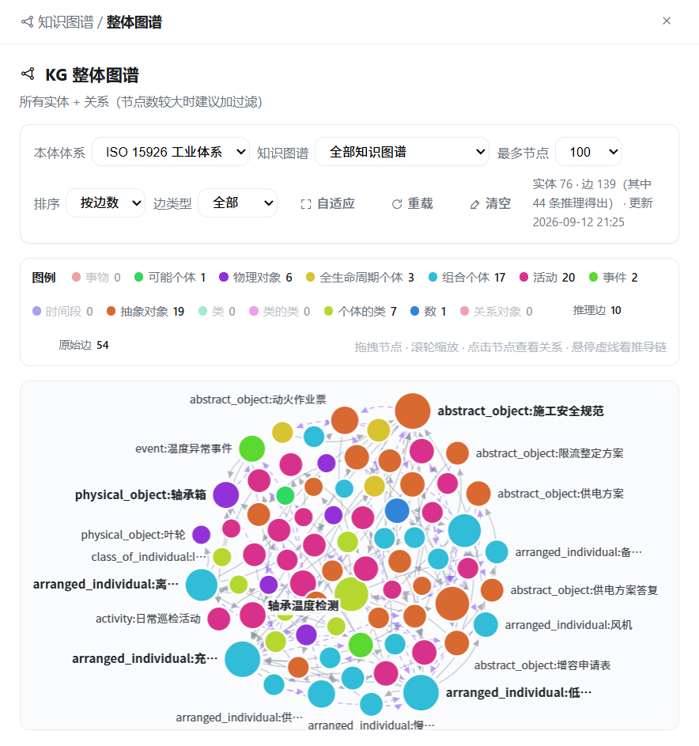
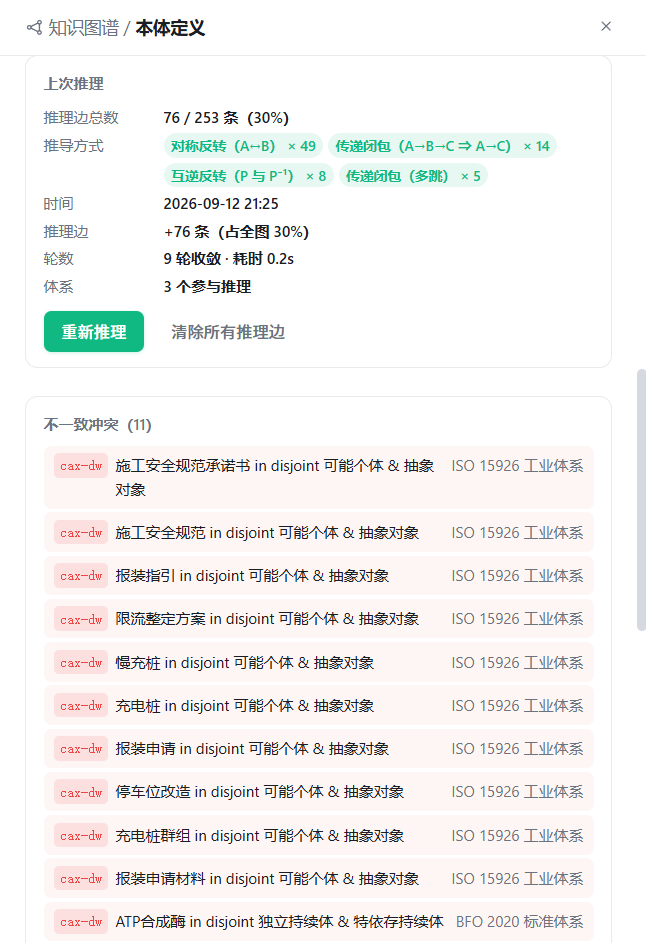

# 7. 知识图谱

[← 返回目录](README.md)

知识图谱让**知识之间的连接可见**。AI 从你的笔记与原始文件中抽取实体、概念及它们之间的关系，形成一张可视化、可查询、可推理的网络。

侧边栏「知识图谱管理」区块下有 3 个子视图：🪐 整体图谱、📘 本体定义、💬 KG 问答（📐 领域模版也归属该分区）。


*上图为真实图谱：15 个实体、19 条边，节点按类型着色，边上标注关系谓词（包含、应用于、相关、依赖等）。*

## 7.1 本体层：图谱的"schema"

图谱不是随意连线，而是建立在一套**受控词表**（本体层）之上。这保证了抽取结果的一致性与可查询性。

本体层由「**顶层本体体系（Profile）+ 用户扩展层**」合成：顶层体系是跨领域通用的概念基座，用户扩展层是在其类树/谓词表上叠加的自定义条目。


### 7.1.1 多本体体系（浏览 / 编辑）

「本体定义」页顶部是**体系浏览/编辑栏**，可在一套内置基座与自定义导入体系间切换查看与维护：

| 体系 | 类 / 谓词 / 约束 | 定位 |
|---|---|---|
| **BFO-Lite 轻量体系**（默认） | 11 类 · 8 谓 · 10 约 | 面向个人知识库的轻量顶层本体，延续中文谓词，单阶段提取 |
| **BFO 2020 标准体系** | 21 类 · 15 谓 · 12 约 | 标准 BFO 顶层本体（持续体/发生体等），两阶段提取 |
| **ISO 15926 工业体系** | 14 类 · 14 谓 · 12 约 | 工业对象建模（物理对象/活动/时间段），适合设备/工程类文档 |
| **OGMS 医学体系** | 35 类 · 13 谓 · 12 约 | 通用医学科学本体（疾病/障碍/病程/诊断/体征症状/医疗过程），中英对照，适合医疗/临床/病历文档 |
| **法律体系（LKIF）** | 43 类 · 16 谓 · 13 约 | LKIF Core 法律本体精选（规范/法律渊源/表述/行为/主体/角色六大分支），中英对照，适合法律法规/合同/判例/合规文档 |
| **汽车制造体系（IOF）** | 50 类 · 18 谓 · 13 约 | IOF Core 工业本体精选 + 汽车领域扩展（整车/车身/动力总成/底盘/发动机/动力电池/零部件、四大工艺冲压/焊装/涂装/总装、装备/物料/质量），中英对照，适合汽车制造/工艺/产线/供应链文档 |
| **OWL 自定义体系** | 取决于导入文件 | 通过「导入 OWL」接入任意 OWL 2 本体（.owl/.rdf/.ttl） |

- 点击体系 Tab 仅切换**当前浏览/编辑**的体系（类树/结构图/谓词表/约束列表随之重绘），**不影响抽取与问答**：抽取与问答时由 AI 按内容自动选择合适体系（领域模版绑定优先），无需手动切换
- 同一份文档可按不同体系重提并共存（节点带 `profile` 字段按体系分组），所用体系由 AI 匹配/模版绑定决定
- 体系 Tab 上带**类/谓词/约束计数**徽标，OWL 导入体系带「OWL」标记；导入 OWL 后同样无需手动切换，AI 会在抽取时自动选用
- 体系描述行显示当前体系的提取模式：**单阶段提取** / **两阶段提取**（两阶段会先归类再细抽，适合类树较深的体系）

### 7.1.2 导入 OWL 2 本体

顶部 **导入 OWL** 按钮支持把外部 OWL 2 本体文件（`.owl` / `.rdf` / `.ttl`）导入为一套新的顶层体系：

- 导入后自动解析出类层级（subClassOf）与谓词（ObjectProperty），生成 `owl:*` 体系并自动切换过去
- 超大本体会自动截断；孤儿类（无父类挂载）会在导入结果中提示数量
- 选中 OWL 体系时顶部出现 **删除体系** 按钮，可整体移除该体系（可选是否同时清除该体系下的图谱节点）

> 单个 OWL 文件常常只声明了「类层级」，谓词（ObjectProperty）与 domain/range 护栏反而写在它依赖的上游本体里（如 OGMS 的关系谓词来自 RO、父类来自 BFO）。直接「导入 OWL」只会得到**有类无谓词**的半成品体系——这种场景请改用下面的**体系化导入**。

### 7.1.3 体系化导入（主本体 + 依赖一键合并）

顶部 **体系化导入** 按钮把「OGMS 那样一整套体系的导入流程」通用化为一个可复用模块，方便后续接入任意领域的本体体系（医学、工业、金融……）。选一个**主本体文件**即可，模块会自动完成推断依赖 → 获取依赖 → 合并成单一体系的全过程：

1. **解析主本体**：读出主本体的类/谓词/公理。主本体也可以是「聚合入口」（如 LKIF 的 `lkif-core.owl`：自身 0 类、仅用 `owl:imports` 汇总各模块）——这种文件单独解析不出内容，但只要它带 `owl:imports`，就会被当作空主本体，由依赖模块提供全部内容
2. **推断依赖**（两条互补通路）：
   - **OBO 内联引用**：扫描主本体正文实际引用的 OBO 共享 IRI（`purl.obolibrary.org/obo/<前缀>_`），按前缀聚合出它真正用到的上游本体（如 OGMS → BFO、RO），自动排除自身前缀与纯注解词汇
   - **`owl:imports` 传递闭包**：从主本体出发逐层展开它声明的 `owl:imports`（模块化本体如 LKIF：`lkif-core → norm/legal-role → action/role/process…`），按 IRI 末段文件名在 `data/ontology/` 本地解析、递归到底，自动去重防环
3. **获取依赖**：优先复用 `data/ontology/` 下已有的本地文件；缺失的依赖自动从 `purl.obolibrary.org` 下载（仅白名单主机、跟随重定向、有大小上限；离线或下载失败时回退本地已有文件，并在预览里标注「缺失/下载失败」）
4. **合并为单一体系**：主本体优先合并各依赖的类/谓词/公理/约束（同键去重），并做**跨文件完整性回校**——保留 RO 谓词指向 BFO 类的 domain/range、把依赖独有的父类补齐，避免「谓词护栏被误清空」。最终产出**一套**「有类有谓词 + 中英对照」的完整体系（而非各自独立导入）

> 例：选中已下载到 `data/ontology/` 的 `lkif-core.owl` 作主本体，体系化导入会沿 `owl:imports` 自动合并全部 11 个 LKIF 模块，一次得到 156 类 / 85 谓词 / 331 公理的完整法律体系（含 `allows`、`qualifies`、`disallows` 等法律关系谓词）。

导入前会弹出**预览向导**，逐项列出：主本体、每个依赖的获取状态徽标（本地 / 已下载 / 缺失 / 下载失败）与来源（`owl:imports` 或 `引用×N`）、合并后的类/谓词/公理统计、样本类与谓词（键名 + 中英 label）、以及未获取依赖等警告。确认后才落库为 `owl:*` 体系（同名覆盖），并把主本体源文件复制到 `data/ontology/` 留档。

- **中英对照**取自源文件已有的多语注解：有中文 label 则显示中文，否则英文；RO/BFO 的关系谓词会挂钩内置谓词别名，不臆造翻译
- 与「导入 OWL」一样，导入后自动切换过去，抽取/问答时由 AI 按需选用，无需手动切换

### 7.1.4 本体浏览：结构树 / 列表

描述行右侧可切换两种浏览方式：

- **结构树**：把体系的类层级（is_a / subClassOf）渲染成分层树形图。支持**滚轮缩放、拖拽平移**；悬停节点高亮其祖先链与子树；点击节点跳转到列表视图并高亮对应类卡片
- **列表**：按「实体类 / 谓词 / 约束」三个标签页管理条目（见下）

顶部 5 个统计卡：实体类、谓词、校验约束（前 3 项属于当前体系）、实例总数、关系总数（后 2 项为跨体系全局累计）。

### 实体类

实体类按体系的**类层级**以树形展示（含缩进层级线），每行显示标识键、中文名、说明、示例与该类当前的**实例数**。

- **内置条目只读**（带「内置」徽标），不可编辑删除
- **用户自定义条目**（带「自定义」徽标）可自由增删改：通过右上角 **＋ 新增** 或行内编辑按钮维护

### 谓词

体系自带谓词集（如 BFO-Lite 的 8 个中文谓词、ISO 15926 的 Part 7 模板谓词），用户可叠加自定义谓词。未知谓词在抽取时降级为回退谓词。

### 校验约束

默认约束：节点类型须从实体类中选取（否则回退为体系 fallback 类）、谓词须从受控词表选取、禁止自环边、节点按规范化名称去重、边按 (from, to, rel) 去重。

> 本体扩展可自由增删改，修改后的词表会立即作用于后续的抽取任务。删除时有保护：内置基座条目不可删，谓词至少保留一个。

### 7.1.5 整体图谱的两级筛选

「整体图谱」顶部提供两级筛选：

1. **本体体系**：列出系统中的全部体系（BFO-Lite、BFO 2020、ISO 15926 以及已导入的 OWL 体系），不提供“全部本体体系”汇总项；首次打开默认展示 **BFO-Lite**。
2. **知识图谱**：只列出当前本体体系下已有的图谱/领域分组，并显示节点数量；切换本体体系后自动联动刷新。

类型图例和类型筛选也按当前选中的本体体系显示。不同体系的节点可以共存，但整体图谱默认按当前体系隔离查看。

## 7.2 抽取图谱

图谱抽取通过**右键菜单**发起：

| 右键位置 | 抽取范围 |
|---|---|
| 笔记卡片 | 单篇笔记 |
| 目录 | 该目录及子目录下所有笔记 |
| 原始文件行/目录行 | 指定的原始来源 |
| 领域模版卡片 | 「🕸 生成图谱（从该领域 Wiki 页面）」，按该领域约束从 Wiki 页面抽取 |

### 抽取流程

提交前会先弹出「选择领域」对话框（见 [6.4 图谱抽取时的领域匹配](06-领域模版.md)），其中可**单独选择本体体系**（默认跟随所选领域模版绑定的体系，或全局默认体系）——即「用哪套领域规则」与「用哪套顶层本体归类」是两个独立维度。

> 当所选来源**混合多个互不相关的领域**且选择「🤖 自动」时，会先经**多领域自动拆分**（识别全部内聚领域 → 逐文件归类 → 清单确认），随后为每个勾选领域各提交一个只跑其文件子集的提取作业（见 [6.4.1](06-领域模版.md)）。

作业分 3 个阶段：**收集语料 → AI 本体抽取 → 合并存图**。

- 每个来源作为一个**独立子任务**分别送入模型（便于逐任务查看进度与输出）
- 抽取时会把**已抽取的节点清单**带给模型，便于建立跨来源的关系、避免重复创建
- 抽取 prompt 中的类表/谓词表来自所选**体系 + 领域模版的领域类/谓词**，LLM 只能在本体划定范围内归类与连线
- 节点带 `profile` 字段记录所属体系，不同体系提取的图谱按体系分组共存；作业完成摘要与详情会注明所用体系名
- 单个来源解析失败会跳过，不中断整体抽取
- 单批最多 30 个节点、50 条边；单来源截断 1500 字符
- 节点按规范化名称去重，边按三元组去重；来源标签会挂到被提及的节点上（最多 5 个），并继承来源的领域归属
- **写侧护栏**：每条边写入前校验谓词的 domain/range 与两端节点类型；此外还做**互斥类型预检**——即便 domain/range 校验通过，若谓词的定义域/值域会把端点强制归入与其声明类型**互斥**的类（推理时必报 `cax-dw`），同样降级为回退谓词（如 `relatedTo`），把冲突消灭在写库前。被拦截的边记入护栏日志，在推理 Tab 的「护栏拦截日志」区块按原因（含「互斥类型强制」）分组展示

## 7.3 整体图谱视图

顶部工具栏：

| 控件 | 作用 |
|---|---|
| **本体体系** | 按体系筛选（BFO-Lite / BFO 2020 / ISO 15926 / OWL 导入体系），切换后自动联动刷新图谱与类型图例 |
| **知识图谱** | 只列出当前体系下已有的图谱/领域分组，并显示节点数量；支持多选组合 |
| **类型** | 按实体类筛选 |
| **最多节点** | 限制渲染节点数（默认 100） |
| **排序** | 节点取舍依据，如「按边数」优先展示枢纽节点 |
| **⤢ 自适应** | 自动缩放至合适视野 |
| **🔄 重载** | 重新读取图谱数据并重排布局 |
| **☑ 校验** | 用当前所选本体体系的约束与公理对整张图谱做只读体检（详见 [7.5.7](#757-整体图谱校验按钮)） |
| **🧹 清空** | 清空整个图谱（谨慎操作） |

右上角显示实体数、边数与最近更新时间。

交互方式（右下角有提示）：**拖拽节点** 调整布局 · **滚轮缩放** · **点击节点查看关系**。底部图例标明各类型的节点配色。

## 7.4 KG 问答

💬 KG 问答是基于图谱结构的**多跳推理**问答，与普通 AI 问答的机制不同：


```
① LLM 从问题中抽取实体名
② 匹配本体节点（三层兜底：LLM抽取 → 问题直接含节点名 → 分词评分召回）
③ BFS 收集 N 跳内的事实三元组（默认 3 跳，可调 1–5）
④ 沿节点的 sources 标签回溯笔记 / 原始文件
⑤ 事实 + 原文材料一并注入，流式生成回答
```

界面会分阶段展示进度（解析问题并抽取实体 → 沿本体层回溯原文 → 生成回答），并下发：

- **匹配到的实体**
- **事实清单**（可选显示的三元组列表）
- **引用材料**（笔记 / 原始文件，含路径）

这种方式的优势是：回答既有**结构化事实**支撑（实体间的确定关系），又有**原文材料**兜底（避免图谱过度抽象导致细节丢失）。

> 输入框留空直接提问时，会使用示例问题作为默认查询，便于快速体验。

## 7.5 OWL 2 RL 推理

推理让图谱**自动长出隐含的关系**。开启后，系统在抽取完成时（或手动触发时）对当前图谱运行一轮 OWL 2 RL 前向链推理，按谓词特性（传递、对称、逆、值约束等）推导出新的边，并把结果与原图合并。

推理是**增强项**：推理失败不会丢失已抽取的原始图谱，已生成的推理边保留但不再更新。

### 7.5.1 推理边与图例

推理生成的边在整体图谱中以**紫色虚线**渲染，与原始边（实线）区分。底部图例会单独标注「推理边」与「原始边」的数量。



*上图：ISO 15926 体系下，145 实体 · 253 边（其中 76 条推理边）。紫色虚线为推理生成的隐含关系，如实线「connectedTo」的对称反向、传递闭包等。*

工具栏的**边类型**下拉可筛选显示：全部 / 仅原始 / 仅推理。

### 7.5.2 悬停推导链

鼠标悬停在任意推理边上，会弹出 tooltip 显示该边的**推导链**——即它是由哪些原始边经过什么规则推导出来的。例如：

```
connectedTo(充电桩, 供电回路)  ← 对称(connectedTo) ← connectedTo(供电回路, 充电桩)
```

这让你能追溯每条推理边的来源，判断其可信度。

### 7.5.3 推理 Tab

「本体定义」页的**推理** Tab 提供推理的全局控制与统计：



*上图：推理统计——推理边 76/253（30%）、4 种推导方式、9 轮收敛、0.2s、3 个体系参与；下方列出 11 条不一致冲突（ISO 15926 cax-dw  disjoint 违反）。*

- **统计区**：推理边总数/占比、推导方式分布（对称/传递/逆/传递+）、最近推理时间、收敛轮数与耗时
- **不一致冲突**：推理发现的矛盾（如 disjoint 类同时被实例化）。每条冲突标注**归属**（体系「…」· 图谱「…」，图谱即该节点所属的领域知识图谱）与**中文原因**（说明违反了哪条本体公理、为何矛盾、如何修复），规则代码（如 `cax-dw`）保留为徽标供排查
- **操作**：**🔄 重新推理**（手动触发一轮）、**🧹 清除推理边**（移除全部推理产物，保留原始图）、**🔧 一键修复**（对全部冲突规划修复动作，见 [7.5.8](#758-冲突自动修复一键修复--撤销)）、**撤销上次修复**（仅在有撤销点时可用）

### 7.5.4 谓词特性一览

推理 Tab 的**谓词特性**区块展示当前全部体系的谓词及其 RL 特性：


*上图：护栏覆盖 14%（2/14 谓词有值约束）；传递谓词 6 个（classifiedBy、hasSuperclass、temporalPartOf、spatialPartOf、composedOf、startsBefore、endsBefore、containedIn）；对称谓词 2 个（connectedTo、relatedTo）。每个谓词卡片显示 domain · range 及特性标签。*

- **护栏**：有值约束（someValuesFrom / allValuesFrom）的谓词比例，越高推理越精确
- **传递**：沿该谓词可推导传递闭包（A→B→C ⇒ A→C）
- **对称**：该谓词双向自动成立（A→B ⇒ B→A）

### 7.5.5 提取时自动推理

在「原始文件」页右键「🕸 提取知识图谱」时，提取对话框底部有**提取完成后自动推理**勾选框（默认开启）。勾选后，该次提取作业会在合并存图后自动追加一轮推理。

### 7.5.6 作业中的推理摘要

图谱抽取作业完成后，作业详情底部会显示**推理摘要行**：新增推理边数、推导方式分布、收敛轮数、耗时。若推理被跳过（未启用或超时），会注明原因。详见 [8. 作业管理](08-作业管理.md)。

### 7.5.7 整体图谱「校验」按钮

整体图谱工具栏的**☑ 校验**（绿色主按钮）对**整张已落库图谱**做一次只读体检，检查依据是**当前「本体体系」下拉所选体系**的约束与公理：

- **谓词白名单**：边的关系是否为体系声明的谓词
- **domain / range**：边的两端节点类型是否满足谓词的定义域/值域
- **不相交公理**：节点声明类型与边强制类型是否存在不相交交叠（cax-dw）

点击后先跑一轮 OWL 2 RL 物化（**推理边同样受检**），再执行体检；结果以工具栏下方的摘要条持久展示：受检边数、越界边/不相交冲突计数、公理覆盖率（声明 domain/range 的谓词占比）。点「查看明细 →」跳转本体定义·推理 Tab 并就地展开完整报告。计数为**全量口径**：越界边超过 50 条时明细只列前 50 条，摘要条与报告头部会注明「明细各最多列 50/N 条」「列出前 50 条」，计数本身不受截断影响。

**问题汇总表**：越界边与不相交归属两类问题合并为一张表，每行 7 列：

| 列 | 说明 |
|---|---|
| **#** | 行号（按全量顺序编号，筛选后不变，便于对照报告头部计数） |
| **问题类型** | 未知谓词 / 定义域越界 / 值域越界 / 未知类型 / 不相交归属 |
| **违规边 / 节点** | 越界边显示「起点 —谓词→ 终点」；不相交归属显示节点名 |
| **违反的约束或公理** | 具体哪条白名单/domain/range/cax-dw 被违反，附详情子行 |
| **所属体系** | 该行归因到的本体体系（如「BFO-Lite 轻量体系」） |
| **知识图谱** | 该行来自哪个图谱/领域范围（如「充电桩扩容」） |
| **操作** | **修复**按钮：只对这一行规划修复动作（见 [7.5.8](#758-冲突自动修复一键修复--撤销)） |

表头下方有两个筛选下拉：**按知识图谱**（只看某个领域范围的问题）与**按问题类型**（只看越界边或只看不相交归属），筛选即时生效、可叠加。

体检本身**只读**：不改写任何边、不删除数据；行级「修复」也要经预览确认、以作业形式执行（见下节）。覆盖率 0% 的体系（未声明 domain/range）越界检查恒通过，属预期。

### 7.5.8 冲突自动修复（一键修复 / 撤销）

推理发现的冲突不必逐条手工改图。推理 Tab 的冲突区提供三个入口：

| 入口 | 位置 | 行为 |
|---|---|---|
| **🔧 一键修复** | 冲突区工具栏 | 先重跑一轮推理取最新冲突，再对**全部**冲突规划修复动作 |
| **修复** | 每条冲突右侧 | 只对**该条**冲突规划（不重推理） |
| **修复**（问题表行级） | 校验报告·问题汇总表每行「操作」列 | 只对**该行问题**规划修复动作（未知谓词/域值域越界 → 降级或删边；未知类型 → 改节点类型到约束要求的类；不相交归属 → 同冲突区「修复」），同样走预览 → 作业四步流程 |
| **撤销上次修复** | 冲突区工具栏 | 恢复到上一次「修复作业」施加前的整图快照（一步撤销，只保留最近一次） |

**流程是「规划 → 预览 → 确认 → 作为作业执行」四步，规划阶段绝不改图**：

1. **规划（dry-run）**：按规则把每条冲突翻译成具体动作，弹出**修复预览**窗，标题写明「N 处冲突 → M 个动作」
2. **预览**：逐条列出动作（可勾选子集），每条都是人话，如「把〈施工安全规范承诺书〉—classifiedBy→〈施工安全规范〉的关系降级为〈relatedTo〉（原谓词的定义域与节点声明类型互斥）」；无安全自动方案的条目标「需人工」且不可勾选
3. **确认**：底部实时显示「已选 N 个自动动作」，全部取消勾选后「提交修复作业」自动置灰；若本次规划**一个可自动执行的动作都没有**（剩余冲突全属「需人工」），弹窗顶部会显示红色说明条解释原因，按钮保持置灰——置灰即「没有可自动修的东西」，不是按钮坏了
4. **作为作业执行**：点「提交修复作业」后在**作业管理**生成一条「图谱冲突修复」作业（每个动作一条子任务），并自动跳转到作业页跟踪；作业分三个阶段——复核修复规划 → 施加修复动作 → 重推理验证。施加前自动存撤销快照，**逐动作施加并落库**（中途停止也能保持一致状态），完成后自动刷新图谱与推理页并提示结果

**作业里的任务状态**：

- **✓ 已应用**：动作成功落库，任务输出写明「已应用：…」
- **✓ 已跳过**：动作目标（边/节点）在规划后已不存在（如被其他动作连带删除），不改图、不算失败，任务输出写明跳过原因
- **✗ 失败**：施加时抛错（极少见）；作业整体标「警告」，可在作业卡片对该任务单独**重跑**，其余任务产物保留

作业还支持**停止**（中断后续动作，已应用的保留、可用「撤销上次修复」整体回退）、失败后**重试**（动作清单随作业持久化，重启应用后仍可重试，不会静默重新规划）。

**最小破坏原则**——动作优先级从高到低：

| 动作 | 适用 | 破坏性 |
|---|---|---|
| **降级谓词**（change-rel） | 边的谓词把端点强制归入互斥类（**含逆谓词的强制**：谓词自身无约束、但其逆谓词的定义域/值域经逆边物化强制端点类型，动作说明会注明「其逆谓词 X 的定义域/值域…」），且体系的兜底谓词（如 `relatedTo`）无 domain/range 约束 | 最低：保留「两者相关」这一事实，只放弃精确谓词 |
| **删除边**（delete-edge） | 兜底谓词也受约束、或冲突来自自环/非对称谓词的反向边/否定属性断言 | 中：丢失一条关系 |
| **改节点类型**（retype-node） | ① 开启 LLM 语义仲裁、且模型判定节点类型确实归错时；② **问题表行级修复**中「未知类型」问题——端点类型不在体系类表，改为该谓词 domain/range 要求的类（无约束侧则用体系兜底类型） | 高：改变实体归类 |
| **需人工**（manual） | 等价类/不同个体断言冲突、数据类型不匹配、体系无法解析、冲突明细缺定位信息 | 不改图 |

**为什么修复后冲突数可能不为 0**：部分冲突（如 `prp-npa2` 否定属性、`eq-diff*` 个体等价/不同）没有安全的自动方案，会保留为「需人工」；另外修复会触发重推理，可能暴露出原先被掩盖的新冲突。

**LLM 语义仲裁**（设置 → 图谱 → **修复时允许 LLM 语义仲裁**，默认关闭）：

「降级边」和「改节点类型」常常都能消除同一个冲突——前者保守（怀疑是关系连错了），后者激进（怀疑是类型归错了）。开启该开关后，规划阶段会把这类多解冲突交给模型判断节点语义上更应属于哪个类；若模型选了候选互斥类，动作就从「降级谓词」变成「改节点类型」并标 **LLM** 徽标。模型调用失败时**静默退回**确定性方案，不会让修复中断。默认关闭是为了保证修复结果可预期、可复现。

> **升级提示**：若冲突明细是旧版本推理留下的（缺少修复定位所需的节点信息），直接规划会得到「有冲突但 0 个动作」，此时会提示先重新推理。「一键修复」已默认自带重推理，不受影响。

## 7.6 存储与维护

整个图谱以 JSON 形式存储在数据库的 kv 表中（key = `graph`）。个人知识库的图谱规模较小，整体读写开销可忽略。

维护建议：

- 新增资料后**增量抽取**即可，系统会自动与已有节点合并去重
- 若图谱变得杂乱，可调整**本体定义**（收紧实体类与谓词）后重新抽取
- 想换一种抽象层级看同批资料时，可按另一体系重新提取（抽取所用体系由 AI 按内容/模版绑定自动选择，也可在领域模版中绑定指定体系），两版图谱按体系共存对比；不满意的体系产物可通过删除该 OWL 体系并勾选清除节点来清理
- 抽取质量不理想时，可在「提示词管理」中定制「图谱 · 本体抽取」提示词
- 「清空」会删除全部节点与边，属不可逆操作，请谨慎

---

上一章：[← 6. 领域模版](06-领域模版.md) ｜ 下一章：[8. 作业管理 →](08-作业管理.md)
