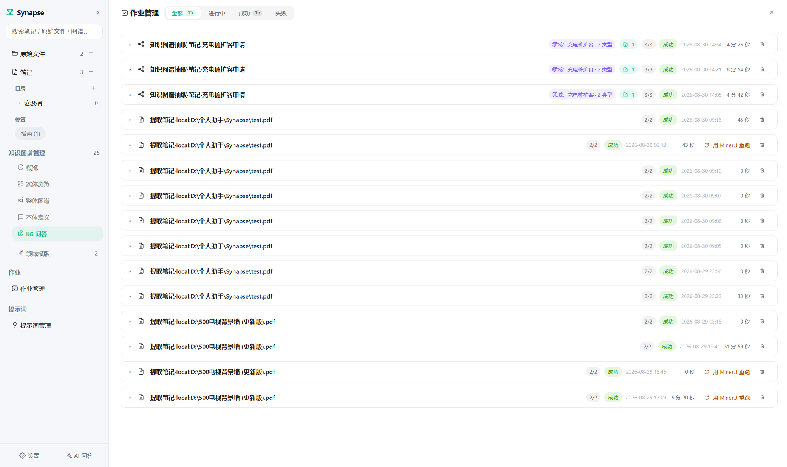

# 8. 作业管理

[← 返回目录](README.md)

所有耗时的 AI 任务（提取笔记、图谱抽取等）都以**后台作业**方式执行，不阻塞界面。作业管理页是它们的统一控制台。

点击侧边栏 **作业管理** 进入。



*上图为真实作业历史：1 个知识图谱抽取作业，显示来源数量徽标、阶段进度（3/3）、状态标签（成功）、完成时间与耗时；顶部筛选标签各带数量统计。*

## 8.1 作业类型

| 类型 | 阶段 |
|---|---|
| **提取笔记（Extract-note）** | 解析来源 → 写入笔记 |
| **知识图谱抽取（Graph）** | 收集语料 → AI 本体抽取 → 合并存图 |
| **Wiki 体检（Lint）** | 收集全库 → AI 体检 → 报告完成（内部管线，当前 UI 无发起入口，历史作业仍会显示） |
| **吸收（Ingest）** | 解析保存来源 → AI 编译 → 落盘（内部管线，当前 UI 无发起入口，历史作业仍会显示） |

## 8.2 界面说明

顶部筛选标签：**全部** / **进行中** / **成功** / **失败**（各带数量）。

右上角仅有 **✕ 关闭** 按钮。作业均由各业务入口发起：提取笔记来自原始文件右键「📝 提取笔记」；图谱抽取来自笔记、原始文件、领域模版等的右键「🕸 提取知识图谱」。

每行作业显示：

| 元素 | 说明 |
|---|---|
| ▸ 展开箭头 | 点击展开阶段详情与子任务 |
| 类型图标 | 区分提取笔记 / 图谱 / 体检 / 吸收 |
| 标题 | 如「知识图谱抽取·笔记·👋 欢迎使用…」「提取笔记·xxx.pdf」 |
| 来源徽标 | 集合类作业显示来源数量 |
| **阶段进度** | 如 `3/3`、`1/3` |
| **状态标签** | 排队中 / 进行中 / 成功 / 失败 |
| 时间与耗时 | 完成时间、总耗时 |
| 行内按钮 | **🔄 重试**（失败作业）、**↻ 用 MinerU 重跑**（出现 MinerU 回退时）、**🗑 删除** |

## 8.3 状态机

```
排队中(queued) → 进行中(running) → 成功(success)
                              ↘ 失败(failed) → 可重试
```

每个阶段独立标记 `pending / running / success / failed`，实时持久化并推送到界面。任一阶段抛错会把该阶段标为失败、整个作业标为失败，错误原因写入作业记录。

**中断恢复**：应用重启时，上次会话中处于「进行中」或「排队中」的作业会被标记为失败，错误信息为「应用重启导致作业中断」，随后可重试。

## 8.4 子任务与实时输出

展开作业行可看到**子任务列表**——每个来源对应一个独立编号的子任务（`任务 1/N`），带自己的状态（待处理 / 进行中 / 已完成）。

对于 AI 阶段，模型的**思考与输出**会以尾部预览的方式实时更新到对应子任务下（节流 600ms 推送，避免事件风暴），因此你可以实时看到 AI 正在生成什么。

- 任务输出区可**折叠/展开**
- 提供**复制**按钮，一键复制该任务的完整输出文本

这对排查「AI 为什么生成了这样的结果」非常有用。

## 8.5 重试

失败的作业行会出现 **🔄 重试** 按钮。重试的语义是**在原作业上重跑**，不会新建一条作业记录：

- 重置状态、阶段、结果与错误信息，重新入队
- **提取笔记作业**：复用原来源列表重新解析写入（同源笔记原地更新，不新增重复笔记）
- **图谱作业**：按原来源范围重跑抽取
- **吸收作业**（历史）：复用已保存的 `raw/` 来源，**跳过解析保存阶段**，直接从 AI 编译开始；若来源尚未保存成功会提示无法重试

只有状态为「失败」的作业可以重试。

## 8.6 并发控制

作业采用队列 + 并发池执行，默认同时运行 **3** 个作业，可在「设置 → 作业 → 总并发任务数量」中调整（范围 1–8）。

单个作业内部的子任务（图谱抽取 / 提取笔记的来源解析与写入）同样按并发池执行，并发数取「设置 → 作业 → 单作业内并发抽取数」（默认 3，范围 1–8）。

「提取笔记」作业的「解析来源」阶段会实时注明采用的解析方式：**内置解析** 或 **MinerU 解析**（取决于「设置 → 文档解析」的解析方式开关与转换命令）；MinerU 转换失败自动回退内置时，该来源会标注「内置解析（MinerU 失败回退）」，每个子任务的输出里也带各自实际使用的解析方式与回退原因。使用 MinerU 且模型为本机 Ollama 时，转换前会**自动拉起 Ollama 服务**，无需手动启动。

「知识图谱抽取」作业的标题与完成摘要会注明所用的**本体体系**（如「BFO-Lite 轻量体系」），产物节点带体系标识，便于多体系共存时分辨来源。

**MinerU 回退警示与强制重跑**：若有来源因 MinerU 失败回退内置，作业详情顶部会出现橙色警示框，逐条列出回退来源与失败原因（同时写入 `<数据根>/mineru-fallback.log`）。回退产物的质量低于 MinerU 解析（与「设置 → MinerU 测试」的结果不一致），此时作业行会出现 **↻ 用 MinerU 重跑** 按钮：对回退来源提交新的强制 MinerU 解析作业，失败直接报错、不再回退内置，成功后原地更新已有笔记。

「写入笔记」阶段与每个子任务的输出会注明笔记落盘的具体位置：单篇显示完整文件路径，多篇显示笔记根目录 + 各笔记相对路径（超过 5 篇截断为「等 N 篇」）。

调整建议：

- 模型服务有严格速率限制 → 降低并发（如 1–2）
- 本地模型（Ollama）且机器性能有限 → 降低并发
- 云端模型且配额充足 → 可提高到 4–8 加快批量处理

## 8.7 历史管理

- 作业历史持久化在数据库，跨重启保留
- 默认保留最近 **50** 条，可在「设置 → 作业 → 作业历史保留条数」调整（1–500）
- **🗑 删除**：删除单条终态作业；进行中/排队中的作业不可删除
- 历史条数超出上限时自动淘汰最旧记录

## 8.8 失败排查

| 错误现象 | 可能原因与处理 |
|---|---|
| 尚未配置 API Key | 到「设置 → 模型配置」填写 |
| 接口错误 (401/403) | API Key 无效或无权限 |
| 接口错误 (429) | 触发速率限制，降低并发后重试 |
| 网络请求失败 | 检查网络/代理；瞬时故障会自动重试 |
| 模型返回无法解析 | 模型未按要求输出 JSON，重试或更换更强的模型 |
| 模型返回为空 | 属可重试错误，会自动重试 |
| 原始来源不存在或无法提取文本 | 源文件被移动/删除，或该格式无文本层（如纯图片 PDF） |
| 应用重启导致作业中断 | 直接点重试 |

**自动重试机制**：网络异常、5xx、空返回等瞬时故障会自动重试，次数由「设置 → 作业 → 失败重试次数」控制（默认 2，范围 0–5）。4xx 客户端错误（鉴权、参数问题）不会重试，因为重试无意义。

---

上一章：[← 7. 知识图谱](07-知识图谱.md) ｜ 下一章：[9. 提示词管理 →](09-提示词管理.md)
