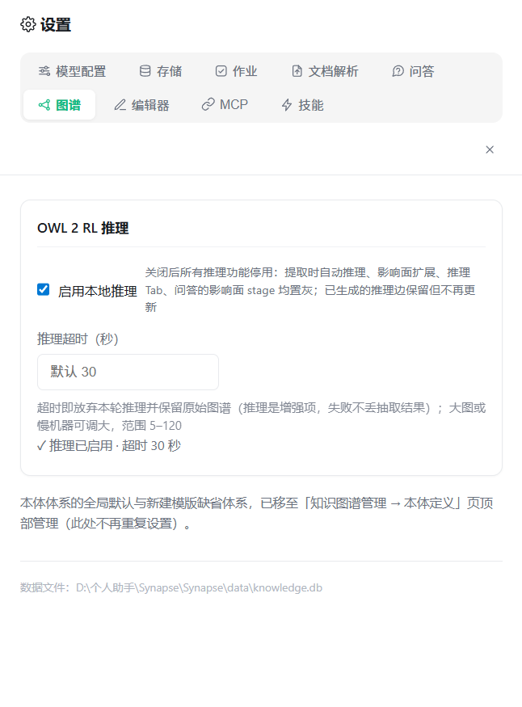

# 10. 设置

[← 返回目录](README.md)

点击左下角 **⚙ 设置** 打开设置页。设置页独占主框架，按 10 个 Tab 分类：**模型配置 / 存储 / 作业 / 文档解析 / 语料流水线 / 问答 / 图谱 / 编辑器 / MCP / 技能**。


> 除数据根目录与数据文件位置（需点各自「应用」按钮触发迁移）外，其余设置项修改后（失焦/提交时）**自动保存**并立即生效，无需重启。

## 10.1 模型配置

支持**同时配置多个模型**，每个模型一张卡片，默认收起，点标题行展开单独配置：

- **第一张为默认模型**（带「默认」徽标）；其他卡片可 **设为默认**（与当前默认互换，原默认保留为普通卡）或 **删除**（删除默认模型时由下一个模型接任，至少保留一个）
- 卡片标题行显示：provider 徽标、模型名、**已配 Key / 无 Key / 无需 Key** 徽标、Base URL
- 展开后的字段：**服务商 Provider**（选择后自动带出 Base URL 与模型名）、**接口地址 (Base URL)**、**API Key**（存于本地数据库，界面遮蔽显示）、**模型名称**（点「获取模型」拉取可用模型，输入框右侧 ▾ 下拉选择）、**开启思考（thinking）** 勾选框（**每个模型独立**：默认勾选；取消后该模型的问答/抽取不再输出推理过程，Ollama 走原生 `/api/chat` 下发 `think:false`、百炼下发 `enable_thinking:false`，可显著提速；关闭的模型卡头显示「无思考」徽标）
- 每张卡片展开后底部有「**保存修改**」按钮，卡头行内也有「**保存**」：修改配置后点击即写入并立即生效（字段失焦时也会自动保存，二者互为兜底）
- 右上「＋ 添加模型」新增卡片；AI问答输入区的模型选择按钮可在已配置模型间按 provider 两级切换

内置服务商预设（仅支持这两类）：

| 预设 | Base URL | API Key |
|---|---|---|
| 阿里云百炼（DashScope）、**默认** | `https://dashscope.aliyuncs.com/compatible-mode/v1` | 必填 |
| Ollama（本地） | `http://localhost:11434/v1` | 无需 |

**生成参数**（采样温度 temperature 0–2、核采样 top_p 0–1、最大 tokens max_tokens）位于模型卡片下方，对**所有模型**生效（不属于单个模型）；留空时**不会**透传给接口，完全走服务端默认值，只有填写了才会作为参数发送。

## 10.2 存储

| 字段 | 说明 |
|---|---|
| **数据根目录** | 数据库/附件/原始文件的统一存储位置。修改后**需重启**生效 |
| **数据文件位置（SQLite）** | 知识库数据库文件路径（`knowledge.db`）。修改会触发**知识库整库迁移**；应用配置数据库（`app.db`）与其分离，跟随数据根目录存储 |

行为说明：

- **数据根目录**：只写配置指针，重启后生效。目标目录必须可写
- **数据文件位置**：立即执行整库导出迁移到新路径。必须是绝对路径；目标文件已存在时会拒绝覆盖以防误伤；留空则恢复默认位置，原默认位置的残留文件会被改名为 `.bak` 留底

底部显示当前知识库数据库文件的完整路径。模型 API Key、MCP 与 Skills 配置保存在同一数据根目录下独立的 `app.db` 中，不与知识库数据混存。

## 10.3 作业

| 字段 | 范围 | 默认 | 说明 |
|---|---|---|---|
| 作业历史保留条数 | 1–500 | 50 | 超出后自动淘汰最旧记录 |
| 失败重试次数 | 0–5 | 2 | 仅对网络/5xx/空返回等瞬时错误生效 |
| **总并发任务数量** | 1–8 | 3 | 同时运行的作业数 |
| 单作业内并发抽取数 | 1–8 | 3 | 图谱 / 提取笔记作业内同时处理的来源数 |
| 网页拉取超时（秒） | 1–600 | 30 | 「添加链接」抓取网页的超时 |
| 来源内容截断阈值（字符） | 1000–1000000 | 60000 | 防止单个超长来源导致提示词过长 |
| 单目录文件数上限 | 10–100000 | 500 | 「＋ 添加目录」递归计数；超限目录拒绝添加，已存在的超限引用仅列出前 N 个并在列表顶部告警 |

## 10.4 文档解析

| 字段 | 范围 | 默认 | 说明 |
|---|---|---|---|
| 文档解析方式 | 内置解析 / MinerU 解析 | 内置解析 | 内置解析快速覆盖文本型文档与常规 PDF/Office，可用技能扩展；MinerU 解析仅支持 PDF（扫描件等内置解析拿不到文本的场景质量更高），更慢，失败自动回退内置解析 |
| 技能解析 | 开 / 关 | 开 | 内置解析的技能扩展：已启用技能（`SKILL.md` 指令）+ 模型直读文档产出 Markdown。可解析图片等内置解析不支持的格式，并按技能指令重组内容；模型调用失败自动回退内置解析。需同时满足：有已启用技能、模型可用（本地端点免 Key，远端需已填 API Key） |

> 笔记导入类型固定为默认文档名单（pdf/docx/xlsx/xls/pptx/md/markdown/txt/csv/html/htm）：只有名单内类型会被提取为笔记，其余跳过（不计失败），不在界面配置。
| 文档转换命令（MinerU CLI） | 命令模板 | 留空不启用 | 占位符 `{input}`=源文件、`{output}`=输出目录，不写占位符则按「命令 源文件 输出目录」追加；没有 MinerU 环境可点「⚡ 一键自动安装」（自动创建 `plugin/mineru` 虚拟环境并回填命令）；可「上传 PDF」用自己的文件，「测试配置」实跑一次转换：中间解析日志与已耗时秒数实时展示，产物（源文件 + 输出 Markdown/JSON 等）保存在 `<数据根>/test/<日期-时间>/` 下；测试结果以卡片分块展示——结论行（耗时/产出字符数）、产物路径行（含「📂 打开目录」按钮，一键用系统文件管理器打开产物目录）、样本内容块（转换出的 Markdown 前几行预览）；**转换超时默认 3600 秒，可在界面配置（10–21600 秒）** |

**MinerU 视觉模型（VLM）配置**：当本机 Ollama 可用时，可在「设置 → 文档解析」中选择 MinerU 使用的视觉模型（默认 `qwen3.8:27b`），并可通过「应用到 MinerU」按钮将当前模型配置写入 MinerU 包装脚本（不动 venv 环境）。此配置保存在 `mineruVlmModel` / `mineruOllamaUrl` 设置项中。

## 10.5 问答

| 字段 | 范围 | 默认 | 说明 |
|---|---|---|---|
| 工具调用最大轮数 | 1–12 | 6 | 自动选工具的智能体循环轮数上限；多步任务（如搜索后再生成文件）需要更多轮数 |
| 日志展示行数 | 1–500 | 30 | `log.md` 尾部展示行数 |

> 已启用的 MCP 服务器默认全部参与问答，由模型自行选择工具并可多步调用；在问答输入区 🧩 菜单中可逐服务器去除/恢复参与。

## 10.6 编辑器

| 字段 | 说明 |
|---|---|
| **默认编辑器模式** | `编辑` / `分屏` / `预览`，默认 `分屏` |
| **AI 辅助提示词** | 编辑器 ✨ AI 按钮使用的提示词，留空使用默认润色提示词 |

此外，图片插入策略（保存为本地文件 / base64 内嵌）在**插入图片时弹窗选择**（不在设置页），详见 [2. 笔记管理](02-笔记管理.md#25-附件与图片)。

## 10.7 图谱



| 字段 | 范围 | 默认 | 说明 |
|---|---|---|---|
| **启用本地推理** | 开 / 关 | 开 | 关闭后所有推理功能停用：提取时自动推理、影响面扩展、推理 Tab、问答的影响面 stage 均置灰；已生成的推理边保留但不再更新。推理关闭时「一键修复」也会拒绝规划（修复依赖推理产出的冲突明细） |
| **推理超时（秒）** | 5–120 | 30 | 超时即放弃本轮推理并保留原始图谱（推理是增强项，失败不丢抽取结果）；大图或慢机器可调大 |
| **修复时允许 LLM 语义仲裁** | 开 / 关 | **关** | 冲突修复默认只用确定性规则（降级谓词 / 删边）。开启后，对「降级边 vs 改节点类型」这类多解冲突会征询模型选出更贴切的类，动作变为「改节点类型」并标 **LLM** 徽标；模型调用失败时静默退回确定性方案。默认关闭以保证修复结果可预期、可复现。详见 [7.5.8 冲突自动修复](07-知识图谱.md#758-冲突自动修复一键修复--撤销) |

页面底部显示当前推理状态（✓ 推理已启用 · 超时 30 秒）。

> 本体体系的全局默认与新建模版缺省体系，已移至「知识图谱管理 → 本体定义」页顶部管理（此处不再重复设置）。

## 10.8 MCP

MCP（Model Context Protocol）服务器为 AI 提供外部工具能力，如联网搜索。

本页以**只读 JSON**（Cline 风格）展示当前配置，编辑统一通过 **Configure MCP Servers** 弹窗进行——直接粘贴 JSON 保存，与主流 MCP 客户端的配置可互相复制。

配置格式示例：

```json
{
  "mcpServers": {
    "WebSearch": {
      "type": "http",
      "url": "https://dashscope.aliyuncs.com/api/v1/mcps/WebSearch/mcp",
      "useModelKey": true,
      "enabled": true
    },
    "my-local-tool": {
      "type": "stdio",
      "command": "npx",
      "args": ["-y", "some-mcp-server"],
      "env": {},
      "enabled": true
    }
  }
}
```

字段说明：

| 字段 | 说明 |
|---|---|
| `type` | `stdio`（本地进程）/ `http`（Streamable HTTP）/ `sse`（旧版 SSE） |
| `url` | 远程服务地址（也兼容写作 `baseUrl` / `baseURL`） |
| `command` / `args` / `env` | stdio 类型的启动命令、参数与环境变量 |
| `useModelKey` | `true` 表示复用模型配置里的 API Key，无需重复填写密钥 |
| `enabled` | 是否启用（也兼容 `isActive` / `disabled`） |
| `headers.Authorization` | 固定鉴权头；支持 `${VAR}` 占位符（如 `Bearer ${API_KEY}`），解析顺序为「进程环境变量 → 模型 API Key」，解析不出则不发送该头（避免把占位符原文发给服务端导致 401） |

内置服务：首次启动会自动植入阿里云百炼 **WebSearch**（`useModelKey: true`，复用模型 Key）。

**传输兼容性**：远程连接会自动探测传输方式——优先 Streamable HTTP，若服务端返回 405/404/406 则自动回退到旧版 SSE（并会尝试 `/mcp` → `/sse` 地址）。探测结果会缓存，避免每次调用重复往返。

**连通性测试**：设置页的服务器卡片上可对单个服务器做测试——建立连接、列出工具，还可选填一个查询词真实调用一次工具，返回结果与耗时。若工具调通但返回 0 条结果，会提示确认该 MCP 服务是否已开通、Key 是否有权限与额度。

**「工具」下拉**：控制测试时实际调用该服务器的哪个工具。

- **自动选择**（默认）：填了测试内容时，自动挑一个搜索类工具（名称含 search/web/query，否则取第一个）并把测试内容作为其文本参数；不填测试内容则只测连接与列工具，不调用任何工具。
- **显式指定**：首次测试后下拉会列出该服务器的全部工具，可手动选定。多工具服务建议显式指定，避免自动猜错工具或参数。选中后会显示该工具的必填/全部参数，并在「参数 JSON」为空时预填必填项骨架。
- **参数 JSON**：显式指定入参对象，优先于由测试内容自动猜参；工具参数无法自动推断时（如需要 `image_url` 等非文本参数），必须在此填写。

## 10.9 技能

技能以**目录引用**方式配置：每个技能是一个包含 `SKILL.md` 的目录（支持一层嵌套，如 `x/x/SKILL.md`）。

`SKILL.md` 采用 YAML frontmatter + 正文：

```markdown
---
name: docx
description: 生成 Word 文档时使用
---

（正文即技能指令，告诉 AI 如何完成任务）
```

界面为**技能广场式卡片网格**：

| 操作 | 方式 |
|---|---|
| 添加 | **＋ 创建技能** → 选择含 `SKILL.md` 的目录 |
| 在线安装 | **⬇ 安装** → 粘贴来源后自动下载安装到 `数据根/skills/` 并登记 |
| 启用/停用 | 点卡片或卡片上的开关 |
| 编辑 | 卡片 **编辑** 按钮，可改名称、描述、指令正文（覆盖 `SKILL.md` 主体） |
| 删除 | 卡片 **删除** 按钮（仅移除引用，不删除本机目录） |
| 搜索 | 顶部搜索框按名称/描述过滤 |

**在线安装**兼容 [skills.sh](https://www.skills.sh/) 生态的 `npx skills add` 方式（无需本机安装 npm/git，应用直接下载 GitHub 源码包解压），支持三种粘贴形态：

- `npx skills add https://github.com/anthropics/skills --skill docx`（可多个 `--skill`）
- `https://www.skills.sh/anthropics/skills/docx`（或 `/owner/repo` 仓库页）
- `https://github.com/owner/repo` 整库安装全部技能；也支持简写 `owner/repo`

安装输入框默认预填示例命令，允许直接修改；修改后的内容会自动记住，下次打开时预填。

卡片显示技能名、描述、关联目录名，并按名称生成稳定的柔和配色便于区分。

> 名称含 `docx` / `pptx` / `xlsx` 的技能被启用时，AI 会获得脚本执行能力，可生成真实的办公文件，详见 [3. AI 问答](03-AI问答.md#38-技能-skills)。

> 技能还参与**文档解析**：设置 → 文档解析 的「技能解析」开关（默认开启）启用后，已启用技能的指令会注入解析流程，由模型把文档直读为 Markdown（图片等内置解析不支持的格式由此获得解析能力），失败自动回退内置解析。技能指令为空（在线安装未带正文）时会自动回读目录内 `SKILL.md`。

> 技能新增一类 **`kind: extract` 抽取技能**（专职「文件 → Markdown 语料」）：技能页可按「全部 / 指令 / 抽取」三态筛选，抽取技能编辑弹窗多了 6 个字段（类型/适用扩展名/模式/脚本入口/优先级/超时），并可上传样本文件**试跑**预览产出的 Markdown。详见 [12. 语料库](12-语料库.md)。

## 10.10 语料流水线

控制「文件 → 语料 → 图谱」这条可组合流水线的行为。开关修改后自动保存、下次作业生效；页面底部实时展示「当前解析链」逐层的启用/跳过情况。

| 字段 | 范围 | 默认 | 说明 |
|---|---|---|---|
| **启用语料流水线** | 开 / 关 | **关** | 勾选后「提取知识图谱」改走可组合的装饰器流水线；未勾选时走原有实现（两者产物逐字段等价）。这是总闸，默认保持关以保证行为与历史一致 |
| **抽取时同时落盘语料** | 开 / 关 | 开 | 解析产物除送入图谱外，同时按原文档名（去扩展名）建目录，写为 `<数据根>/corpus/<原文档名>/<原文档名>.md`（带出处 frontmatter，无独立索引）。关闭则语料只在内存中流转、不留语料库 |
| **复用未过期语料** | 开 / 关 | 关 | 来源已有未过期语料时直接读回、跳过全部解析（零 LLM 成本）。**默认关**：因为「改了抽取技能指令后希望重新抽取」是更常见的预期 |
| 抽取技能注入数 TopN | 1–5 | 1 | 同一扩展名命中多个抽取技能时注入几个（按优先级降序取前 N） |
| 脚本抽取超时（秒） | 5–600 | 120 | `mode: script` 抽取技能子进程的超时上限；OCR 大文件可调大 |
| 分块大小（字符） | 1000–40000 | 6000 | 送入 LLM 抽取前的切块粒度；调大可降低 LLM 调用数（代价是单块上下文变长） |
| 语料库文件数上限 | 100–20000 | 2000 | 超出时按生成时间淘汰最旧语料（语料可重生成，不随备份迁移） |

> 语料库的查看/审阅/提升为笔记、抽取技能的创建与试跑，均在 **原始文件页的「语料库」子页签** 与 **技能页** 完成，详见 [12. 语料库](12-语料库.md)。

---

上一章：[← 9. 提示词管理](09-提示词管理.md) ｜ 下一章：[11. 常见问题 →](11-常见问题.md)
