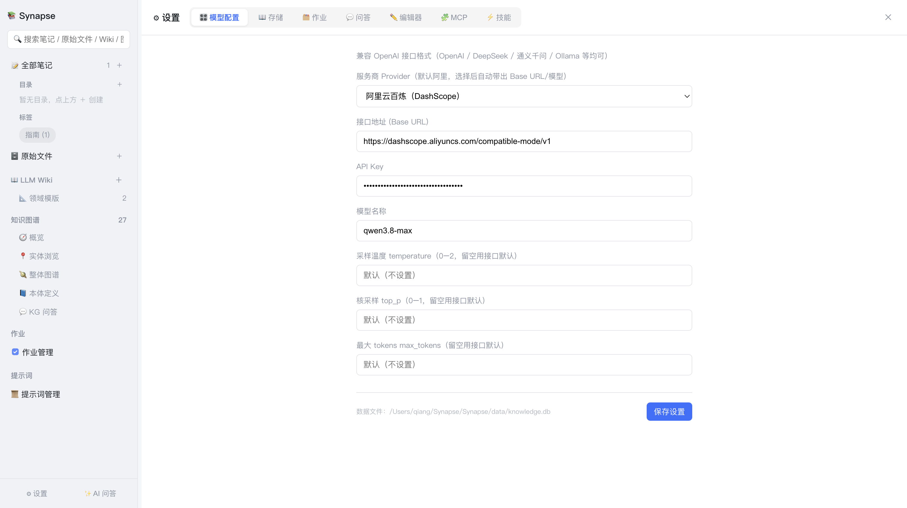

# 10. 设置

[← 返回目录](README.md)

点击左下角 **⚙ 设置** 打开设置页。设置页独占主框架，按 7 个 Tab 分类：**模型配置 / 存储 / 作业 / 问答 / 编辑器 / MCP / 技能**。



> 除数据根目录与数据文件位置外，所有设置点右下角 **保存设置** 后立即生效，无需重启。

## 10.1 模型配置

| 字段 | 说明 | 默认 |
|---|---|---|
| **服务商 Provider** | 选择预设后自动带出 Base URL 与模型名 | 阿里云百炼（DashScope） |
| **接口地址 (Base URL)** | 兼容 OpenAI 格式的接口地址 | DashScope 兼容模式地址 |
| **API Key** | 密钥，存于本地数据库，界面遮蔽显示 | 空 |
| **模型名称** | 模型标识 | `qwen3.8-max` |
| 采样温度 temperature | 0–2，控制随机性 | 留空（用接口默认） |
| 核采样 top_p | 0–1 | 留空（用接口默认） |
| 最大 tokens max_tokens | 单次回复长度上限 | 留空（用接口默认） |

内置服务商预设（仅支持这两类）：

| 预设 | Base URL | API Key |
|---|---|---|
| 阿里云百炼（DashScope）、**默认** | `https://dashscope.aliyuncs.com/compatible-mode/v1` | 必填 |
| Ollama（本地） | `http://localhost:11434/v1` | 无需 |

> 三个模型参数留空时**不会**透传给接口，完全走服务端默认值。只有填写了才会作为参数发送。

## 10.2 存储

| 字段 | 说明 |
|---|---|
| **数据根目录** | 数据库/附件/Wiki 的统一存储位置。修改后**需重启**生效 |
| **Wiki 根目录** | LLM Wiki 位置。留空则自动探测（默认 `<数据根目录>/llmwiki`） |
| **数据文件位置（SQLite）** | 数据库文件路径。修改会触发**整库迁移** |

行为说明：

- **数据根目录**：只写配置指针，重启后生效。目标目录必须可写
- **数据文件位置**：立即执行整库导出迁移到新路径。必须是绝对路径；目标文件已存在时会拒绝覆盖以防误伤；留空则恢复默认位置，原默认位置的残留文件会被改名为 `.bak` 留底

底部显示当前数据文件的完整路径。

## 10.3 作业

| 字段 | 范围 | 默认 | 说明 |
|---|---|---|---|
| 作业历史保留条数 | 1–500 | 50 | 超出后自动淘汰最旧记录 |
| 失败重试次数 | 0–5 | 2 | 仅对网络/5xx/空返回等瞬时错误生效 |
| **总并发任务数量** | 1–8 | 3 | 同时运行的作业数 |
| 网页拉取超时（秒） | 1–600 | 30 | 「添加链接」抓取网页的超时 |
| 来源内容截断阈值（字符） | 1000–1000000 | 60000 | 防止单个超长来源导致提示词过长 |

## 10.4 问答

| 字段 | 范围 | 默认 | 说明 |
|---|---|---|---|
| Wiki 问答最大引用页数 | 1–20 | 5 | 两步检索时最多读取的页面数 |
| 日志展示行数 | 1–500 | 30 | `log.md` 尾部展示行数 |

> 引用页数越多上下文越丰富，但 token 消耗与耗时也越高。5–8 通常是较好的平衡点。

## 10.5 编辑器

| 字段 | 说明 |
|---|---|
| **默认编辑器模式** | `编辑` / `分屏` / `预览`，默认 `分屏` |
| **AI 辅助提示词** | 编辑器 ✨ AI 按钮使用的提示词，留空使用默认润色提示词 |

此外，图片插入策略（保存为本地文件 / base64 内嵌）也在编辑相关设置中选择，详见 [2. 笔记管理](02-笔记管理.md#25-附件与图片)。

## 10.6 MCP

MCP（Model Context Protocol）服务器为 AI 提供外部工具能力，如联网搜索。

本页以**只读 JSON**（Cline 风格）展示当前配置，编辑统一通过 **Configure MCP Servers** 弹窗进行——直接粘贴 JSON 保存，与主流 MCP 客户端的配置可互相复制。

配置格式示例：

```json
{
  "mcpServers": {
    "WebSearch": {
      "type": "http",
      "url": "https://dashscope.aliyuncs.com/api/v1/mcps/WebSearch/mcp",
      "useModelKey": true,
      "enabled": true
    },
    "my-local-tool": {
      "type": "stdio",
      "command": "npx",
      "args": ["-y", "some-mcp-server"],
      "env": {},
      "enabled": true
    }
  }
}
```

字段说明：

| 字段 | 说明 |
|---|---|
| `type` | `stdio`（本地进程）/ `http`（Streamable HTTP）/ `sse`（旧版 SSE） |
| `url` | 远程服务地址（也兼容写作 `baseUrl` / `baseURL`） |
| `command` / `args` / `env` | stdio 类型的启动命令、参数与环境变量 |
| `useModelKey` | `true` 表示复用模型配置里的 API Key，无需重复填写密钥 |
| `enabled` | 是否启用（也兼容 `isActive` / `disabled`） |
| `headers.Authorization` | 固定鉴权头；若值中含 `${...}` 占位符则自动视为 `useModelKey: true` |

内置服务：首次启动会自动植入阿里云百炼 **WebSearch**（`useModelKey: true`，复用模型 Key）。

**传输兼容性**：远程连接会自动探测传输方式——优先 Streamable HTTP，若服务端返回 405/404/406 则自动回退到旧版 SSE（并会尝试 `/mcp` → `/sse` 地址）。探测结果会缓存，避免每次调用重复往返。

**连通性测试**：配置弹窗中可对单个服务器做测试——建立连接、列出工具，还可选填一个查询词真实调用一次搜索类工具，返回结果与耗时。若工具调通但返回 0 条结果，会提示确认该 MCP 服务是否已开通、Key 是否有权限与额度。

## 10.7 技能

技能以**目录引用**方式配置：每个技能是一个包含 `SKILL.md` 的目录（支持一层嵌套，如 `x/x/SKILL.md`）。

`SKILL.md` 采用 YAML frontmatter + 正文：

```markdown
---
name: docx
description: 生成 Word 文档时使用
---

（正文即技能指令，告诉 AI 如何完成任务）
```

界面为**技能广场式卡片网格**：

| 操作 | 方式 |
|---|---|
| 添加 | **＋ 创建技能** → 选择含 `SKILL.md` 的目录 |
| 启用/停用 | 点卡片或卡片上的开关 |
| 编辑 | 卡片 **编辑** 按钮，可改名称、描述、指令正文（覆盖 `SKILL.md` 主体） |
| 删除 | 卡片 **删除** 按钮（仅移除引用，不删除本机目录） |
| 搜索 | 顶部搜索框按名称/描述过滤 |

卡片显示技能名、描述、关联目录名，并按名称生成稳定的柔和配色便于区分。

> 名称含 `docx` / `pptx` / `xlsx` 的技能被启用时，AI 会获得脚本执行能力，可生成真实的办公文件，详见 [3. AI 问答](03-AI问答.md#37-技能-skills)。

---

上一章：[← 9. 提示词管理](09-提示词管理.md) ｜ 下一章：[11. 常见问题 →](11-常见问题.md)
