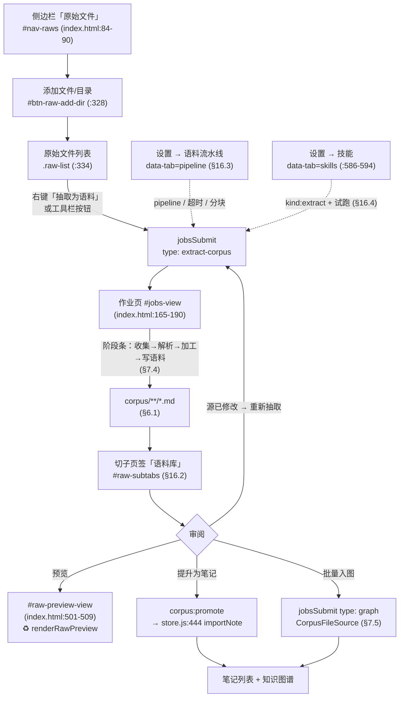

# 语料流水线与抽取技能设计

> 分支：`protege` ｜ 状态：**已实现（一期～五期全部落地，见 §14.2 实施结果回写）** ｜ 设计定稿 2026-09-15，实现完成 2026-09-16
>
> 需求（原话）：「写一个 Synapse 的设计，需要设计一种类型 skill 负责从文件中抽取资料并存为 markdown 文件，供 Synapse 的知识图谱抽取流程使用。这个抽取流程有点类似 java 的 File、bufferedStream 可以使用装饰模式互相装饰调用，需要有统一的接口。比如收集语料、AI 本体抽取、合并存图这些都需要有统一的接口。请先完成设计。」
>
> 拆解为三件事：
> 1. **新增一类技能（抽取技能）**：从文件抽取资料 → 存为 Markdown 文件 → 供知识图谱抽取流程使用（§5、§6）；
> 2. **装饰模式流水线**：像 `new BufferedInputStream(new FileInputStream(f))` 那样，各阶段可互相嵌套装饰（§3、§4）；
> 3. **统一接口**：收集语料 / AI 本体抽取 / 合并存图 共用同一份接口契约（§3.1、§7）。
>
> 阅读顺序建议：先看 §1（为什么现状不够）→ §3（统一接口，全文地基）→ §4（内置层清单）→ §5（抽取技能规范）→ §7（三阶段接口化）→ **§16（前端设计，「整体运行起来」的那一半）** → §14（实现状态矩阵）。
>
> **本文所有 `文件:行号` 锚点均由脚本核实**（核实脚本与输出见 §17 附录 B），核实基线为 commit `6c94da9`（2026-09-14）。

---

## 0. 术语约定

| 术语 | 含义 |
|---|---|
| **语料（Corpus）** | 从原始资料抽取出的、**结构统一的 Markdown 文本单元**。是本设计里流水线上流动的唯一数据类型 |
| **语料项（CorpusItem）** | 一条语料的运行时载体（对象），字段见 §3.2 |
| **语料文件** | 语料项落盘后的 `.md` 文件，存于 `<数据根>/corpus/`，带出处 frontmatter（§6） |
| **阶段（Stage）** | 流水线上的一层。分三种角色：**Source（源）**、**Decorator（装饰器）**、**Sink（汇）**——但三者实现**同一个接口**（§3.1） |
| **抽取技能（Extract Skill）** | 本设计新增的技能类型：`kind: extract`，专职「文件 → Markdown 语料」（§5） |
| **指令技能（Instruction Skill）** | 现状已有的技能类型：SKILL.md 指令包，供 AI 问答注入上下文。本设计**完全兼容、不改动其行为** |
| **泵（drive）** | 反复调用 `next()` 直到流结束、再调用 `close()` 的驱动器（§3.5） |

---

## 1. 背景与现状对照

### 1.1 现状：已经存在三条「手写的链」，但都不是装饰模式

Synapse 今天已经有相当完整的「文件 → 文本 → 图谱」能力，问题是**三条链各自硬编码、彼此不复用、无法插拔**：

| # | 链 | 现状实现 | 编排方式 | 问题 |
|---|---|---|---|---|
| **链 A** | 文件 → 文本 | `files.js:591 extractFileContentRaw` | `if/else` 顺序硬编码：MinerU（`files.js:603-637`，仅 PDF）→ 技能解析（`files.js:639-679`）→ 内置解析（`files.js:699 parseBuiltin`） | 想插入一层（如「表格专用抽取」「OCR 兜底」）必须改这个 600 行函数的内部；回退逻辑与解析逻辑纠缠 |
| **链 B** | 文本 → 图谱 | `graph.js:261 extractGraph`（**单函数约 470 行**，`graph.js:261-756`） | 收集（`:264-291`）→ 领域/体系解析（`:293-336`）→ 分批（`:338`）→ LLM 抽取（`:405-465`）→ 护栏（`:506-556`）→ 合并（`:600-650`）→ 落库+推理（`:650-720`）全在一个函数里 | 用户点名的三件事（收集语料 / AI 本体抽取 / 合并存图）**全在这一个函数内部**，无法单独复用、单独测试、单独替换 |
| **链 C** | 文本 → 笔记 | `jobs.js:330-490`（`extract-note` runner） | 逐文件 `extractFileContent`（`jobs.js:399`）→ `importNote`（`jobs.js:423`）→ `attachMineruImages`（`jobs.js:426`） | 与链 B 的「读文件」部分**完全重复**（都调 `extractFileContent`），但作业阶段、日志、子任务各写一套 |

### 1.2 现状：「收集语料」只认笔记，原始文件走的是另一条路

`graph.js:248 collectSources()` 是今天唯一名为「收集语料」的函数，但它**只遍历笔记**：

```js
// graph.js:248-256（现状，节选）
function collectSources() {
  const sources = [];
  for (const n of notesStore.getNotes()) {
    const text = `# ${n.title}\n${n.content || ''}`.slice(0, SOURCE_CHARS);   // SOURCE_CHARS = 1500（graph.js:128）
    if (text.trim()) sources.push({ label: '笔记·' + (n.title || n.id), text });
  }
  return sources;
}
```

原始文件走的是 `extractGraph` 内部的另一分支（`graph.js:279-291`），且**每条来源被硬截断到 1500 字**（`graph.js:283`）——这意味着：一份 40 页的 PDF 经 MinerU 转出 3 万字 Markdown，进入图谱抽取时只剩前 1500 字。**「先把资料抽成 Markdown 存下来、再分块喂图谱」这一步今天在架构上是缺失的**，正是本设计要补的洞。

### 1.3 现状：技能只有「指令包」一种类型，且解析技能是全局的

| 事实 | 锚点 | 影响 |
|---|---|---|
| 技能注册项形态为 `{name, dir, desc, description, instructions, enabled}`，**无类型字段** | `renderer/common.js:1381`（`addSkillByDir` 的 push） | 无法区分「这个技能是给问答用的指令」还是「这个技能负责把 PDF 抽成 Markdown」 |
| 技能解析把**所有已启用技能**的指令一股脑塞进同一个系统提示词 | `parse.js:64-88 buildSystemPrompt`（单技能截断 6000 字、总量上限 16000 字，`parse.js:26-27`） | 不能按文件类型选技能；启用了 5 个技能时，解析一张发票的提示词里混着「写周报」的指令 |
| 技能解析只在 `extractFileContentRaw` 内部被调用，**没有独立入口** | `files.js:646`、`files.js:666` | 无法「只跑抽取、不入图、不写笔记」，也就无法产出可人工审阅的 Markdown 中间产物 |
| 可执行技能（工具名 `skill__run_script`，定义在 `runner.js:74`）只授予名字匹配 `/docx\|pptx\|xlsx/i` 的技能 | `ipc.js:153`（`ai:ask` 分支内 `skillNames.some((n) => /docx\|pptx\|xlsx/i.test(n)) ? runner.execToolDef() : null`） | 脚本化抽取器（如调 `pdftotext`、`pandoc`）今天无法作为解析链的一环 |
| 技能种子目录是一个陈旧的 macOS 绝对路径 | `constants.js:334 DEFAULT_SKILLS_DIR = '/Users/qiang/sample_center-release/backend/resource/skills'` | Windows 上 `seedSampleSkills` 恒不生效；本设计需顺带修正（§10.3） |

### 1.4 现状：去重基础设施已建好但**未接线**（本设计要复用）

`提取去重判断方案.md`（状态：**待您评审拍板**）已查明：`raws.js:28 markIngested` 与 `raws.js:59 isIngestedFresh` **定义并导出了，但全仓无任何调用点**；只有 `raws.js:67 ingestInfo`（列表徽章用，`raws.js:96/106/129/141` 四处内部调用）与 `jobs.js:130 raws.backfillIngested` 在用。

> **本次复核（2026-09-15，commit `6c94da9`）**：`grep markIngested|isIngestedFresh` 在 `src/**` 下仍只有 `raws.js:28/59`（定义）与 `raws.js:526`（导出）三处命中，**零调用点**——该方案文档的结论至今成立，未被后续提交接线。

本设计的 `FilterDecorator`（§4.3）将**首次把这两个函数接进流水线**，但**默认关闭**，等 `提取去重判断方案.md` 的 ❓A/❓B 两个决策拍板后再打开（§15 开放问题 3）。

### 1.5 关键判断

| 判断 | 依据 |
|---|---|
| **不新写解析器，只重排编排层** | MinerU / 内置解析 / 技能解析三种能力都已可用且经过测试（`test/mineru-route.test.js`、`test/skill-parse.test.js`）。本设计把它们**包成装饰器**，不重写一行解析逻辑 |
| **统一接口选「拉取式流」而非「推式管道」** | 拉取式（`next()`）天然支持：① 一条变多条（分块）；② 惰性求值（不一次性把 500 个文件读进内存）；③ 装饰器只需转发一个方法。推式（`push()`）在「分块」和「提前终止」上都更别扭 |
| **合并存图也做成装饰器（而非独立 Sink 类）** | 这样它才能与「收集语料」「AI 本体抽取」**字面上共用同一个接口**，满足需求的第 3 点；它逐条累加、`close()` 时落库，透传 item 给下游（§3.4） |
| **语料落盘为独立 `corpus/` 目录，不写进 `note/`** | 笔记是人工资产（`store.js:444 importNote` 会按 `source` 字段 upsert 覆盖正文），机器产物混进去会污染用户手写内容。语料可重生成、可审阅、可一键「提升为笔记」（§6.4） |
| **现有 `extractGraph` 的 10 字段返回契约不能动** | 它是测试硬契约（`graph-reason-integration.test.js:453` 逐字比对 10 个键名；上游文档 `Synapse×protege-js融合设计.md` §12.5 记为 `:449`，**已偏移 4 行**）。改造后必须逐字段等价（§12.1） |
| **`GRAPH_STAGES` 的 5 个键不能动** | 同为测试硬契约（`jobs-tasks.test.js:126` 断言 5 键 `collect,extract,guard,reason,save`）。流水线各层必须**映射**到这 5 个阶段，而不是新增阶段（§7.4） |

---

## 2. 设计目标

### 2.1 目标

| # | 目标 | 验收方式 |
|---|---|---|
| **G1** | 定义**一份**统一接口 `CorpusStream`，使「收集语料」「AI 本体抽取」「合并存图」三者都是它的实现，可任意互相嵌套装饰 | 三层各有一个类 `implements CorpusStream`；`new GraphMergeDecorator(new ExtractDecorator(new RawFileSource(...)))` 能跑通 |
| **G2** | 新增**抽取技能**类型（`kind: extract`），负责「文件 → Markdown」，支持 `llm`（AI 直读）与 `script`（可执行脚本）两种执行模式 | 一个 `kind: extract` 的技能目录被识别、按扩展名选中、产出 `.md` 语料文件 |
| **G3** | 抽取产物**落盘为 Markdown 文件**（带出处 frontmatter），可人工审阅、可重跑、可作为图谱抽取的输入 | `<数据根>/corpus/` 下出现 `.md`；`CorpusFileSource` 能把它读回流水线 |
| **G4** | 现有三种解析能力（MinerU / 技能 / 内置）**全部包成装饰器**，回退链由装饰器组合表达，不再硬编码在 600 行函数里 | `FallbackDecorator([Mineru, Skill, Builtin])` 的行为与 `extractFileContentRaw` 逐分支等价 |
| **G5** | 解决 §1.2 的「1500 字硬截断」：语料先完整落盘，再按 `BATCH_CHARS`（6000，`graph.js:126`）**分块**入图 | 一份 3 万字 PDF 的图谱抽取任务数 > 1（今天是恒等于 1） |
| **G6** | 作业阶段、子任务、日志、取消（AbortSignal）、并发全部沿用现有基础设施，**不新造一套** | `GRAPH_STAGES` 5 键不变；`jobs.js:158 jobLog`、`jobs.js:174 setStage`、`jobs.js:193 jobCancel` 被流水线复用 |
| **G7** | 全链路可降级：任一层不可用（无模型 / 无 MinerU / 推理层缺失）时静默跳过并记 warning，不中断作业 | 关闭模型后跑图谱抽取，行为与今天一致（走内置解析） |
| **G8** | **零行为变更开关**：`settings.pipeline === false` 时完全走老代码路径 | 老测试套件（22 套）全绿 |
| **G9** | 每层可独立单测（不需要 LLM、不需要 Electron） | 新增 `test/corpus-stream.test.js` 用 `ArraySource` + 假装饰器验证接口契约 |

### 2.2 非目标（明确不做）

| 不做 | 理由 |
|---|---|
| ❌ 不引入 RxJS / Node Stream / 任何第三方流库 | 项目零运行时依赖倾向（`package.json` 仅 sql.js / mammoth / xlsx / jszip / turndown / pdf-parse 等解析库）；装饰模式手写 30 行足够 |
| ❌ 不做向量检索 / 语义分块 | 与 `knowledge.js:46 retrieve` 的 KG-first 路线正交，属另一设计 |
| ❌ 不改本体层、不改推理层、不改护栏规则 | `reason/*` 8 个模块已由 `Synapse×protege-js融合设计.md` v1.2.2 定稿并实现，本设计只**调用**它们 |
| ❌ 不改图谱数据结构（nodes/edges 形态、`nodeKey`、边键 `${from}\|${to}\|${rel}`） | 不变量 I1（同上文档 §12.4），改了会连带级联清理与推导链 tooltip 全错 |
| ❌ 不做实体去重 / 术语归一（aliases） | `多领域自动拆分提取设计.md` §2.2 已裁定「实体去重归图谱写入层」；aliases 在 `多本体体系选择总体设计.md` §7 列为范围外 |
| ❌ 不做流水线可视化拖拽编辑器 | 一期用**声明式配方（recipe）**即可（§8.2），拖拽 UI 属远期 |
| ❌ 不动 `extract-note` / `graph` / `graph-repair` 三种既有作业类型的对外语义 | 只在内部换实现（§7.5） |

---

## 3. 统一接口设计（全文地基）

### 3.1 Java IO 类比表

| Java IO | 本设计 | 说明 |
|---|---|---|
| `InputStream`（抽象类，`read()`） | **`CorpusStream`**（基类，`next()`） | 唯一接口。所有阶段都实现它 |
| `FileInputStream` / `ByteArrayInputStream` | **`Source`** 族（`RawFileSource` / `NoteSource` / `CorpusFileSource` / `ArraySource`…） | 流的起点，真正产生数据 |
| `FilterInputStream`（持有 `in` 字段并转发） | **`CorpusDecorator`**（持有 `this.inner` 并转发） | 所有装饰器的基类 |
| `BufferedInputStream`（加缓冲，不改语义） | `CacheDecorator` / `ChunkDecorator` / `LogDecorator` | 增强性能或可观测性 |
| `DataInputStream`（改语义：字节 → 结构化数据） | `BuiltinParseDecorator` / **`SkillMarkdownDecorator`** / `ExtractDecorator` | 增强数据形态 |
| `PushbackInputStream`（可回退） | `FallbackDecorator`（内层失败 → 换一条路重试同一条目） | 表达 MinerU→技能→内置的回退链 |
| `markSupported()` / `available()` | **`caps`**（能力声明，§3.3） | 外层据此判断内层能否满足自己 |
| `OutputStream`（终点） | **`Sink`**（`NullSink` / 或直接用 `close()` 收尾的终端装饰器） | 拉取式模型下终点是「泵 + 最后一层的 close」 |
| `try-with-resources` | `drive()` 的 `try/finally`（§3.5） | 保证 `close()` 必被调用 |

**一句话**：`new GraphMergeDecorator(new ExtractDecorator(new ChunkDecorator(new SkillMarkdownDecorator(new RawFileSource(paths)))))`
等价于 `new DataOutputStream(new BufferedOutputStream(new FileOutputStream(f)))`——**同一个接口，层层装饰**。

### 3.2 数据单元：`CorpusItem`

流水线上流动的**唯一**数据类型。所有装饰器只做两件事：**读它、改它（或换成几条新的它）**。

```js
// src/main/corpus/item.js
/**
 * @typedef {Object} CorpusItem
 * @property {string}  id        稳定身份键 = 语料指纹（§3.6）。去重、缓存、子任务编号都用它
 * @property {string}  label     显示名，与现状口径一致：'原始·供电容量说明.pdf' / '笔记·xxx' / '内联'
 * @property {string}  kind      'raw' | 'note' | 'url' | 'inline' | 'corpus' | 'chunk'
 * @property {string}  [text]    Markdown 正文。解析类装饰器负责填充；未解析时为 undefined
 * @property {Buffer}  [bytes]   原始字节。仅当 caps.bytes 为真时存在（供技能解析/MinerU 用）
 * @property {Object}  origin    出处（不可变，任何装饰器都不得修改）
 * @property {Object}  meta      加工痕迹（每层只增不改，见下）
 * @property {Object}  [graph]   AI 本体抽取产物 { nodes:[], edges:[], guardLog:[] }
 * @property {Object}  [chunks]  分块产物（ChunkDecorator 也可选择「一条变多条」，二选一，见 §4.3）
 */

// origin：出处，只读
{
  type: 'local' | 'url' | 'note' | 'inline',
  path: 'local:D:/docs/a.pdf' | 'url:https://…' | 'raw/子目录/a.pdf',
  rel:  'raw/子目录/a.pdf',        // 相对 rawsRoot 的路径（type='local' 时有）
  name: 'a.pdf',
  ext:  '.pdf',
  size: 1048576,
  mtime: 1757800000000,
}

// meta：加工痕迹，每层追加
{
  parseMethod: 'mineru' | 'skill' | 'builtin' | 'fallback' | 'corpus',  // 与 files.js:859 现状同口径
  skill:       { name, kind, mode, version },   // 由哪个抽取技能产出
  truncated:   false,                            // 是否被截断（TruncateDecorator）
  chunk:       { index: 0, total: 5 },           // 分块信息（ChunkDecorator）
  domain:      { id, label, confidence },        // 领域归属（EnrichDecorator）
  profileId:   'iso15926',                       // 本体体系
  corpusFile:  'corpus/供电容量说明/供电容量说明.md', // 语料文件相对路径（CorpusWriteDecorator）
  fromCache:   false,                            // 是否命中缓存（CacheDecorator）
  fallbacks:   [{ from: 'mineru', error: '…' }], // 回退记录（FallbackDecorator）
  provenance:  [ … ],                            // 完整加工链，见 §3.6
  warnings:    [ … ],
}
```

**设计约束**：
- `text` 是**唯一必需的内容字段**。任何下游层（抽取、写笔记、落盘）只依赖 `text`，不依赖 `bytes`——这让「从已存语料文件重新入图」（`CorpusFileSource`）与「从 PDF 现场解析入图」走完全相同的下游代码。
- `origin` **不可变**。它是身份与出处的唯一真相源，任何层修改它都会破坏去重与缓存键。
- `meta.provenance` 是**追加式**的加工链日志（§3.6），落盘为语料文件的 frontmatter，实现「这条语料是谁、用什么、什么时候产出的」可追溯。

### 3.3 接口契约：`CorpusStream`

```js
// src/main/corpus/stream.js
/**
 * 统一接口。Source / Decorator / Sink 全部继承它。
 * 语义与 java.io.InputStream 对齐：open 一次、next 多次、close 一次。
 */
class CorpusStream {
  /** 能力声明：外层据此判断内层能否满足自己（类比 markSupported()）。构造期即固定，不随 next 变化 */
  get caps() {
    return {
      bytes: false,     // 能提供 item.bytes（原始字节）
      text: false,      // 能提供 item.text（Markdown 正文）
      graph: false,     // 能提供 item.graph（抽取产物）
      countable: false, // estimate() 能给出准确条数（用于作业子任务列表）
      replayable: false,// 可重复 open→next→close（FallbackDecorator 需要内层具备此能力）
    };
  }

  /** 建立资源。约定：先 await inner.open(ctx)，再初始化自己（自内向外）。幂等：重复调用无副作用 */
  async open(ctx) {}

  /**
   * 取下一条语料；返回 null 表示流已结束（此后再次调用仍返回 null）。
   * 这是唯一的数据通道——装饰器通过调用 inner.next() 实现「互相装饰调用」。
   * @returns {Promise<CorpusItem|null>}
   */
  async next(ctx) { return null; }

  /**
   * 释放资源并返回本层结果。约定：先做自己的收尾，再 await inner.close(ctx)，最后 mergeResults 合并。
   * 必须在 finally 中调用（drive() 保证）。重复调用返回同一结果。
   * @returns {Promise<StageResult>}
   */
  async close(ctx) { return { ok: true, count: 0, stats: {}, warnings: [] }; }

  /** 预估条数（作业子任务列表用）。countable 为假时返回 { total: -1 } */
  estimate(ctx) { return { total: -1, labels: [] }; }
}
```

**StageResult（每层 close 的返回体，字段数 = 5，是测试硬契约）**：

```js
{
  ok: true,             // 本层是否成功（部分失败仍可为 true，失败明细在 warnings）
  count: 12,            // 本层实际产出/消费的条数
  stats: { … },         // 本层统计（各层自定义键，合并时不覆盖内层同名键 → 见 mergeResults）
  warnings: [ … ],      // 降级/跳过记录，字符串数组，最终进作业卡片
  error: '',            // ok=false 时的原因
}
```

```js
// 结果合并：外层统计优先，内层统计保留（键冲突时外层加前缀）
function mergeResults(outer, inner) {
  const stats = { ...inner.stats };
  for (const [k, v] of Object.entries(outer.stats || {})) {
    stats[k in stats ? `${outer.layer}.${k}` : k] = v;
  }
  return {
    ok: outer.ok !== false && inner.ok !== false,
    count: outer.count ?? inner.count ?? 0,
    stats,
    warnings: [...(inner.warnings || []), ...(outer.warnings || [])],
    error: outer.error || inner.error || '',
  };
}
```

### 3.4 装饰器基类

```js
// src/main/corpus/decorator.js
class CorpusDecorator extends CorpusStream {
  /** @param {CorpusStream} inner 被装饰的流（= Java 的 FilterInputStream.in） */
  constructor(inner) {
    super();
    if (!inner || typeof inner.next !== 'function') throw new TypeError('装饰器需要一个 CorpusStream 作为内层');
    this.inner = inner;
    this._closed = false;
    this._result = null;
  }

  /** 层名，用于日志与 stats 键前缀。默认取类名 */
  get layer() { return this.constructor.name; }

  /** 能力声明默认透传内层；需要增强/降级的子类覆写（如 SkillMarkdownDecorator 把 bytes → text） */
  get caps() { return this.inner.caps; }

  async open(ctx) { await this.inner.open(ctx); }

  async next(ctx) { return this.inner.next(ctx); }

  async close(ctx) {
    if (this._closed) return this._result;
    this._closed = true;
    const own = (await this.finish(ctx)) || { ok: true, count: 0, stats: {}, warnings: [] };
    const innerRes = await this.inner.close(ctx);
    this._result = mergeResults({ ...own, layer: this.layer }, innerRes);
    return this._result;
  }

  /** 子类实现自己的收尾（如 GraphMergeDecorator 在此 saveGraph）。默认无操作 */
  async finish(ctx) { return null; }

  estimate(ctx) { return this.inner.estimate(ctx); }
}
```

**三个必须遵守的约定**（违反即出 bug，写进 §12.2 不变量表）：

| # | 约定 | 违反后果 |
|---|---|---|
| **C1** | `next()` 返回 `null` 后，后续调用**必须仍返回 `null`**（不得复活） | `drive()` 死循环；`FallbackDecorator` 重放时误判流未结束 |
| **C2** | `close()` **幂等**（重复调用返回同一 `StageResult`） | `drive()` 的 `finally` 与外层装饰器的 `close()` 会各调一次 → 重复 `saveGraph`，图谱边数翻倍 |
| **C3** | 装饰器**不得修改 `item.origin`**；`meta` 只增不改（已有键要改时写 `meta.<layer>.xxx` 子对象） | 缓存键漂移 → 同一文件被反复重新解析；出处追溯断链 |

### 3.5 驱动器（泵）

```js
// src/main/corpus/drive.js
/**
 * 抽干一条流水线。这是唯一驱动数据流动的地方——装饰器之间只通过 inner.next() 互相调用。
 * @returns {Promise<StageResult>} 最外层 close() 的合并结果
 */
async function drive(stream, ctx) {
  await stream.open(ctx);
  try {
    let item, n = 0;
    while ((item = await stream.next(ctx)) !== null) {
      n++;
      if (ctx.signal && ctx.signal.aborted) throw mkAbortErr();
      if (ctx.onItem) await ctx.onItem(item, n);       // 作业子任务进度回调
      if (ctx.maxItems > 0 && n >= ctx.maxItems) break; // LimitDecorator 的兜底
    }
    ctx.itemCount = n;
  } finally {
    ctx.result = await stream.close(ctx);              // try-with-resources 等价物
  }
  return ctx.result;
}
```

**为什么合并存图不需要独立的 Sink 类**：`GraphMergeDecorator` 在 `next()` 里把每条 item 的 `graph` 累加进自己的缓冲区、然后**把 item 原样透传**（`return item`），在 `finish()` 里 `saveGraph`。终端只需一个 `NullSink`（`next()` 恒返回 `null`、什么都不做）或者直接以 `GraphMergeDecorator` 为最外层——`drive()` 抽干它即完成落库。需要「一分二」（同时写语料文件 + 入图）时用 `TeeDecorator`（§4.3）。

### 3.6 上下文与身份键

```js
// PipelineContext：一次流水线运行的全部共享状态（由 jobs.js 构造）
{
  settings,                       // 全局设置（现状同口径）
  signal,                         // AbortController.signal（jobs.js:193 jobCancel）
  jobId, stageKey,                // 作业与阶段标识
  // ---- 本体 / 领域（由 EnrichDecorator 或调用方预填）----
  profileId, onto, typeHints, domainId, domainLabel,
  // ---- 回调（桥接现有作业基础设施）----
  onLog(line, replace),           // → jobs.js:158 jobLog
  onStage(key, status, detail),   // → jobs.js:174 setStage
  onItem(item, n),                // → task tracker（jobs/tasks.js:11 makeTaskTracker）
  onProgress(p),
  // ---- 共享区 ----
  stats: {},                      // 跨层计数器（如 llmCalls、guardBlocked）
  shared: {},                     // 跨层对象（如 tasks 数组、guardLog）
  errors: [],
}
```

**身份键（语料指纹）**：

```js
// corpusId(origin, skill) = sha1(type|path|size|mtime|skillName@version).slice(0, 16)
```

与现状 `files.js:769 extractCacheKey`（`sha1(absPath).slice(0,16) + size + mtime`）**同构但多一个维度**：加入技能名与版本，因为同一份 PDF 被不同抽取技能处理会产出不同语料。分块项的 id 为 `${parentId}#${index}`。

---

## 4. 内置层清单

### 4.1 Source（源）— 6 个（+1 可选）

| 类 | 产出 | 复用的现有代码 | `caps` |
|---|---|---|---|
| `RawFileSource` | 原始文件引用 → `kind:'raw'`，带 `bytes` | `raws.js:75 listRaws`（记录形态见 `raws.js:106`：`{path:'local:'+…, name, ext, size, mtime, root, rel, ingested}`）、`fs.readFileSync` | `bytes:true, countable:true` |
| `NoteSource` | 笔记 → `kind:'note'`，带 `text` | `notesStore.getNotes()`（等价 `graph.js:248 collectSources`） | `text:true, countable:true` |
| `UrlSource` | 网页 → `kind:'url'`，带 `text` | `files.js:882 fetchUrlMarkdown` | `text:true, countable:true` |
| `CorpusFileSource` | 已落盘语料 `.md` → `kind:'corpus'`，带 `text` | 新增（读 `<数据根>/corpus/`，§6） | `text:true, countable:true` |
| `InlineSource` | 渲染层直传的 `{label,text}` | 现 `graph.js:274-278` 的 inlineSources 分支 | `text:true, countable:true` |
| `ArraySource` | 程序化注入（**测试专用**，也是 `CapsDecorator` 的宿主） | 新增 | 由入参决定 |
| `GroupSource`（**可选**，默认不在配方中） | 多领域拆分后的**一组**来源 → 逐条产出，并把 `meta.domain` 预填为该组领域 | `多领域自动拆分提取设计.md` §4.1 的 `groups[]`、`renderer/raws.js:264` 的按组提交 | `bytes:true, countable:true` |

> `GroupSource` 存在的意义：现状「多领域自动拆分」是渲染层按组**分别提交 N 个 `graph` 作业**（每组一个作业）。有了它，N 组可以在**一个作业内**串成一条流，作业卡片只显示一张——但子任务归属与失败重跑的语义会变复杂，故一期不做（§14.1 五期）。

`RawFileSource.next()` 骨架（说明「Source 只负责产生，不负责加工」）：

```js
class RawFileSource extends CorpusStream {
  constructor(rawPaths, opts = {}) { super(); this.paths = rawPaths || []; this.opts = opts; this.i = 0; }
  get caps() { return { bytes: true, text: false, graph: false, countable: true, replayable: true }; }
  async open(ctx) {
    // 复用 listRaws 的记录形态（含 root/rel/mtime），但只保留本次选中的路径
    this.records = this.opts.records || (await resolveRecords(ctx.settings, this.paths));
    this.i = 0;
  }
  async next(ctx) {
    while (this.i < this.records.length) {
      const r = this.records[this.i++];
      if (ctx.signal && ctx.signal.aborted) throw mkAbortErr();
      try {
        const bytes = fs.readFileSync(absOf(r));
        return makeItem({ kind: 'raw', label: '原始·' + r.name, origin: originOf(r), bytes });
      } catch (err) {
        ctx.errors.push({ label: r.name, error: err.message });   // 单条失败不中断整条流
        ctx.onLog && ctx.onLog(`跳过 ${r.name}：${err.message}`);
      }
    }
    return null;
  }
  estimate() { return { total: this.records ? this.records.length : this.paths.length, labels: (this.records || []).map(r => r.name) }; }
}
```

### 4.2 解析类装饰器 — 4 个（+1 可选）（把 `bytes` 变成 `text`）

| 类 | 作用 | 复用 | 生效条件 |
|---|---|---|---|
| `CorpusReuseDecorator`（**可选**，默认不在配方中） | 若该来源已有**未过期**语料文件，直接读回 `text`，跳过全部解析（零 LLM 成本） | `corpus/store.js`（§6.3）、`raws.js:59 isIngestedFresh` 的 mtime 判据口径 | `settings.corpusReuse === true` 且命中语料且源文件 mtime 未变 |
| `MineruDecorator` | PDF → 高质量 Markdown（含图片暂存目录） | `files.js:272 convertWithMineru` | `files.js:48 isMineruRoutable(ext)` 为真（仅 `.pdf`）**且** `settings.mineruMode !== 'builtin'` **且** 配了 `mineruConvertCmd` |
| **`SkillMarkdownDecorator`** | **抽取技能：SKILL.md 指令 + 模型直读 → Markdown**（本设计核心，§5） | `parse.js:102 parseWithSkills` | 有匹配当前 ext 的已启用 `kind:extract` 技能 **且** `parse.js:45 skillParseReady(settings)` |
| `BuiltinParseDecorator` | 按扩展名内置解析（md/txt/csv/json/log/html/pdf/docx/xlsx/pptx） | `files.js:699 parseBuiltin` | 扩展名在 `parseBuiltin` 的 switch 覆盖内 |
| `FallbackDecorator` | 依次尝试子解析器；前者不适用/失败则透传给后者，记 `meta.fallbacks[]` 与 `meta.parseMethod` | 等价 `files.js:591-697 extractFileContentRaw` 的编排 | 恒生效 |

**`FallbackDecorator` 是 G4 的关键**——它把今天硬编码在 `extractFileContentRaw` 里的 `if/else` 回退链变成**可组合的装饰器数组**：

```js
// 现状（files.js:591-697，硬编码顺序）：
//   if (preferExternal) { try MinerU } catch { if (forceMineru) throw; else 落到下面 }
//   if (MINERU_IMAGE_EXTS.has(ext)) { 只能走技能解析，失败即抛长提示 }
//   else { builtin = parseBuiltin(); try 技能解析; catch → 用 builtin }

// 新表达（行为等价，但可插拔）：
const parseChain = new FallbackDecorator([
  new MineruDecorator(null),            // 不适用时 next() 透传内层（此处内层为空 → 交给下一个候选）
  new SkillMarkdownDecorator(null),
  new BuiltinParseDecorator(null),
], { forceFirst: opts.forceMineru });   // forceMineru=true 时首个候选失败即抛（等价 files.js:627）
```

`FallbackDecorator` 的实现要点：它**不包装一条流**，而是包装**一组「变换器」**（每个变换器是 `apply(item, ctx) → item | null | throw`，`null` = 我不适用）。这是装饰模式在「同一条目多路重试」场景下的必要变形——因为 `next()` 的拉取语义无法回退，回退必须发生在**条目级**。为此定义第二个（也是唯一一个）辅助接口：

```js
// src/main/corpus/transform.js
/** 条目级变换器。解析类装饰器同时实现它，从而既能独立包流、也能被 FallbackDecorator 编排 */
class CorpusTransform {
  get layer() { return this.constructor.name; }
  /** 我是否适用于这一条（不实际执行）。默认 true */
  accepts(item, ctx) { return true; }
  /** 加工一条。返回 null = 我处理不了（触发回退）；抛异常 = 我失败了（触发回退并记 warning） */
  async apply(item, ctx) { return item; }
}
```

> **接口数量说明**：全文只有 **2 个接口**——`CorpusStream`（流级，G1 要求的那个统一接口）与 `CorpusTransform`（条目级，仅解析回退链需要）。`MineruDecorator` / `SkillMarkdownDecorator` / `BuiltinParseDecorator` **同时实现两者**：单独用时是流装饰器（`next()` 内部调 `apply()`），被 `FallbackDecorator` 编排时是变换器。其余所有层只实现 `CorpusStream`。

### 4.3 加工类装饰器 — 11 个（+1 可选）

| 类 | 作用 | 复用 | 位置约定 |
|---|---|---|---|
| `CacheDecorator` | 读写 `extract-cache`（命中即跳过内层解析） | `files.js:769/776/813`（key/read/write）、`files.js:762 CACHE_MAX_BYTES=5MB`、`files.js:767 FALLBACK_CACHE_TTL_MS=10min`、`files.js:819-830`（>60MB 时按 mtime 保留最新 200 条） | 解析链**外层**（包住 Fallback） |
| `DedupDecorator`（**可选**，默认关闭） | 按语料指纹跳过「已入库且源文件未变更」的条目 | `raws.js:28 markIngested` / `raws.js:59 isIngestedFresh`（**至今零调用点**，§1.4） | `FilterDecorator` 之后。**默认关**，等 `提取去重判断方案.md` 拍板（§15 问题 3） |
| **`CorpusWriteDecorator`** | **把 Markdown 语料落盘为 `.md` 文件**（G3 核心），写 frontmatter，透传 item 并填 `meta.corpusFile` | 新增（§6） | 解析链之后、分块之前 |
| `ChunkDecorator` | 长文按 `BATCH_CHARS`（6000，`graph.js:126`）切块，**一条变多条**（`kind:'chunk'`） | 新增（切块算法参考 `graph.js` 现有分批） | 落盘之后、抽取之前 |
| `TruncateDecorator` | 按 `SOURCE_CHARS`（1500，`graph.js:128`）或 `settings.sourceMaxChars`（默认 60000，`parse.js:139`）截断，置 `meta.truncated` | 新增（替代 `graph.js:283` 的硬截断） | 需要兼容老行为时插在 Chunk 位置 |
| `FilterDecorator` | 跳过不该处理的条目：扩展名白名单（`files.js:41 canImportAsNote`）、已入库且未变更（`raws.js:59 isIngestedFresh`，**默认关闭**，§1.4）、自定义谓词 | `raws.js:59`、`files.js:41` | Source 之后第一层 |
| `EnrichDecorator` | 领域/体系归属：`suggestDomains` → `assignDomains` → `suggestOntologyProfile`，填 `meta.domain` / `meta.profileId` | `templates.js:415/472/371` | 解析之后、抽取之前 |
| **`ExtractDecorator`** | **AI 本体抽取**：`item.text` → `item.graph{nodes,edges}`（含两阶段体系的第二次 LLM 调用） | `graph.js:405-505`（runBatch 逻辑整体搬迁） | Enrich 之后 |
| `GuardDecorator` | 写入护栏：谓词越界/定义域/值域/类型越界 + 互斥预检，命中则降级为回退谓词并记 `guardLog` | `graph.js:506-524`（`R.guard.checkEdge`）、`graph.js:525-556`（`forcingProbes`/`checkDisjoint`，reason `disjoint-type-forcing`） | Extract 之后 |
| **`GraphMergeDecorator`** | **合并存图**：逐条累加 nodes/edges（按 `nodeKey`/边键去重、合并 `sources[]`）→ `finish()` 时 `saveGraph` + 推理物化 | `graph.js:600-650`（合并）、`graph.js:227 saveGraph`、`graph.js:664-678`（`materializeGraph`/`mergeInferredEdges`）、`graph.js:699/719 setGraphMeta` | 最外层（终端） |
| `NoteImportDecorator` | 写笔记 + 图片归位（`extract-note` 作业的终点） | `store.js:444 importNote`、`files.js:244 attachMineruImages`、`files.js:230 titleFromFileName` | 最外层（终端） |
| `LogDecorator` | 桥接 `jobLog` / `setStage` / task tracker；统计每层耗时 | `jobs.js:158/174`、`jobs/tasks.js:11` | 任意位置（透明） |

辅助层（**不计入**上表 11 个，属工具性质）：`TeeDecorator`（一分二）、`LimitDecorator`（条数上限）、`NullSink`（终端占位）、`CapsDecorator`（强制覆写能力声明，测试用）。

**计数口径说明**（避免与 §4.4 全景图的层数混淆）：Source 6 + 可选 1 = 7；解析装饰器 4 + 可选 1 = 5；加工装饰器 11 + 可选 1 = 12；辅助层 4。§4.4 全景图与 §8.1 的 `GRAPH_RECIPE` 画的是**默认配方**，只含非可选层，共 **11 层**（1 个 Source + 10 个装饰器，`FallbackDecorator` 的 3 个候选算它内部、不单独计层）。

### 4.4 装饰链全景（图谱抽取作业）

```
┌─ drive(pipeline, ctx) ─────────────────────────────────────────────────────────┐
│                                                                                │
│  GraphMergeDecorator            ← 合并存图（GRAPH_STAGES 'save'+'reason'）      │
│   └ GuardDecorator              ← 写入护栏（'guard'）                           │
│      └ ExtractDecorator         ← AI 本体抽取（'extract'）                       │
│         └ ChunkDecorator        ← 6000 字分块（解决 §1.2 的 1500 字硬截断）      │
│            └ EnrichDecorator    ← 领域/体系归属（'collect' 的尾段）               │
│               └ CorpusWriteDecorator ← 落盘 .md 语料（G3）                       │
│                  └ CacheDecorator     ← extract-cache 读写                      │
│                     └ FallbackDecorator                                        │
│                        ├ MineruDecorator          （仅 PDF）                    │
│                        ├ SkillMarkdownDecorator   ← 抽取技能（§5）               │
│                        └ BuiltinParseDecorator                                 │
│                           └ FilterDecorator       ← 白名单/去重（默认关）         │
│                              └ LogDecorator                                    │
│                                 └ RawFileSource   ← 收集语料（'collect'）         │
│                                                                                │
└────────────────────────────────────────────────────────────────────────────────┘
   数据流向：next() 自内向外拉取 ────────────────────────────────►
   open()  自内向外；close()/finish() 自外向内
```

**层序不是任意的**，三条硬约束：

| # | 约束 | 理由 |
|---|---|---|
| **O1** | `CacheDecorator` 必须在 `FallbackDecorator` **外层** | 缓存的是「最终解析产物」，不是某一路的产物。放内层会导致每路各存一份、命中率暴跌 |
| **O2** | `CorpusWriteDecorator` 必须在 `ChunkDecorator` **内层**（即先落盘完整语料，再分块） | 落盘的是**完整** Markdown（人工审阅价值在此）；分块只是喂 LLM 的临时形态，不该产生 N 个碎片文件 |
| **O3** | `GuardDecorator` 必须在 `ExtractDecorator` 外、`GraphMergeDecorator` 内 | 护栏要在「抽取已产出、尚未合并」的时机逐条检查——与现状 `graph.js:506-556` 的位置语义一致 |
| **O4** | `CorpusReuseDecorator`（若启用）必须在 `CacheDecorator` **内层**、`FallbackDecorator` 外层 | 语料复用比解析缓存更「上游」：命中语料就不该再去查解析缓存；但解析缓存命中时也不必读语料文件 |
| **O5** | `DedupDecorator`（若启用）必须在 `FilterDecorator` 之后、任何**有 LLM 成本的层**之前 | 去重的全部价值在于「省掉后面的 LLM 调用」，放晚了等于没放 |

---

## 5. 抽取技能规范（新技能类型）

### 5.1 定位

| | 指令技能（现状） | **抽取技能（本设计新增）** |
|---|---|---|
| `kind` | `instructions`（默认，缺省即此） | **`extract`** |
| 职责 | 给 AI 问答注入领域指令 | **把文件抽成 Markdown 语料** |
| 触发时机 | 用户在问答页勾选技能（`renderer/common.js` 的 `refreshAllExtMenus`） | 流水线解析阶段按**扩展名自动匹配** |
| 注入方式 | 全部已启用技能的指令拼进系统提示词（`parse.js:64-88`） | **只注入匹配当前文件类型的那一个**（§5.4） |
| 产物 | 无（影响回答文本） | `.md` 语料文件 + `CorpusItem.text` |
| 执行位置 | 主进程 LLM 调用 | `mode: llm` → 主进程 LLM；`mode: script` → 子进程沙盒（`runner.js:runNodeScript`） |

**向后兼容（G8 的一部分）**：`kind` 字段缺省时视为 `instructions`，`parse.js:30 enabledSkills` 的过滤条件、`buildSystemPrompt` 的拼装逻辑**完全不变**——现有技能一个都不用改。

### 5.2 SKILL.md frontmatter 扩展

现状 `skills.js:6 readSkill` 只解析 `name` 与 `description` 两个字段（正则 `^---\n([\s\S]*?)\n---\n?([\s\S]*)$` 切分 frontmatter 与正文）。本设计**在同一个 frontmatter 里**新增 7 个可选字段：

> ⚠️ **实现期发现并修正的存量缺陷**：上面那条正则**没有 `\r?`**，而本机所有 `SKILL.md`（含 `hive-data-analysis`）都是 CRLF 行尾 ⇒ 正则永远匹配不上，frontmatter 整块被当成 `instructions` 注入系统提示词，`name` 退化为目录名、`description` 为空。已改为 `^---\r?\n([\s\S]*?)\r?\n---\r?\n?([\s\S]*)$`（`skillSeed.js` 的兜底分支同改）。同一处还修了 `toInt('')` 返回 `0` 而非缺省值的缺陷（`Number('') === 0`），否则 `priority` 缺省会变成 0 而不是 50，§5.4 的规则②失效。

```yaml
---
name: pdf-table-extract
description: 从扫描版 PDF 与表格截图中抽取结构化 Markdown（保留表格与页眉页脚语义）
kind: extract                 # 新增①：技能类型。缺省 = instructions（现状行为）
accepts: [pdf, png, jpg, jpeg] # 新增②：接受的扩展名（不带点，小写）。缺省 = 任意
mode: llm                     # 新增③：llm（AI 直读）| script（可执行脚本）。缺省 = llm
entry: scripts/extract.js     # 新增④：mode=script 时的入口（相对技能目录）。缺省 = scripts/main.js
priority: 60                  # 新增⑤：同扩展名多技能命中时的优先级，大者胜。缺省 = 50
version: 1.2.0                # 新增⑥：参与语料指纹（§3.6），版本变了缓存自动失效。缺省 = 0.0.0
enabled: false                # 新增⑦：植入后默认是否启用。缺省 = true（示例技能用它表达「不默认启用」）
---

（正文 = 抽取指令，mode: llm 时作为系统提示词注入；mode: script 时作为 README 供人阅读）
```

**新增⑦ `enabled` 的来由**：§5.5 要求 `extract-ocr`「示例，不默认启用」。若靠 `skillSeed.js` 里写死一份跳过名单，用户自己装的技能（例如需要额外安装 tesseract / PaddleOCR 的脚本技能）就无法复用同一机制。故把它做成 frontmatter 字段：`seedSampleSkills` 读 `readSkill().enabled`，缺省 `true`（现状行为不变）。

**注册项形态扩展**（`settings.skills[]` 的每个元素，现状 6 字段 → 13 字段）：

```js
{
  // ---- 现状 6 字段（renderer/common.js:1381）----
  name, dir, desc, description, instructions, enabled,
  // ---- 本设计新增 7 字段（全部可选，缺省即现状行为）----
  kind: 'extract',            // 'instructions' | 'extract'
  accepts: ['pdf', 'png'],    // 小写、不带点
  mode: 'llm',                // 'llm' | 'script'
  entry: 'scripts/extract.js',
  priority: 60,
  version: '1.2.0',
  enabled: true,              // 与现状同名字段合流：frontmatter 缺省时即 true
}
```

> `enabled` 不新增第 13 个键——它**就是**现状那个 `enabled`，只是取值来源从「植入时写死 `true`」变成「读 frontmatter」。故 `readSkill` 的返回体由 5 字段增至 **12** 字段（`ok, dir, name, description, instructions` + 7 个新字段）。

### 5.3 两种执行模式

#### `mode: llm`（AI 直读，复用现状 `parse.js`）

与现状 `parse.js:102 parseWithSkills` 的差别只有**一处**：注入的技能从「全部已启用」收窄为「匹配当前扩展名的抽取技能」。

| 现状 | 本设计 |
|---|---|
| `parse.js:104 enabledSkills(settings)` → 全部 | `selectExtractSkills(settings, ext)` → 按 `accepts` 过滤 + `priority` 降序 + 取前 N（默认 1，可配 `settings.extractSkillTopN`） |
| `parse.js:26-27` 单技能 6000 字 / 总量 16000 字 | 同口径保留（常量搬到 `constants.js`，§10.2） |
| `parse.js:24 MAX_IMAGE_BYTES = 8MB` | 同口径保留 |
| `parse.js:139` 截断到 `sourceMaxChars`（默认 60000） | **改为交给 `TruncateDecorator`**，技能层不再自己截断（职责分离） |
| `parse.js:91 cleanOutput` 去围栏 | 同口径保留 |
| 输出：纯 Markdown 文本 | 输出：纯 Markdown 文本（**契约不变**） |

`parse.js:78-86` 的 4 条输出要求（不要围栏 / 忠实原文 / 保留结构表格 / 图片转写或不猜截断内容）**原样保留**，它们是语料质量的底线。

#### `mode: script`（可执行脚本，复用现状 `runner.js`）

> ⚠️ **不能用 stdout 回传 Markdown**。`runner.js:51` 对累积 stdout 做了 `.slice(-4000)`、`runner.js:59` 返回时再 `.slice(-1500)`——一份 3 万字的语料经 stdout 回传会被**截成末尾 1500 字**。因此脚本契约改为**文件交接**：脚本把 Markdown 写进 `outputDir`，主进程读文件。stdout 只用于回传一个极小的 JSON 元信息。

```js
// SkillMarkdownDecorator 内部（mode === 'script' 分支）
const res = JSON.parse(await runner.runNodeScript({
  code: `
    const fs = require('fs'), path = require('path');
    const { run } = require(${JSON.stringify(path.join(skill.dir, skill.entry))});
    const outDir = process.env.AGENT_OUTPUT_DIR;
    (async () => {
      const out = await run({
        inputPath:   ${JSON.stringify(absPath)},      // 只读
        ext:         ${JSON.stringify(ext)},
        instructions: ${JSON.stringify(skill.instructions || '')},
        outputDir:   outDir,                          // Markdown 与图片副产物都写这里
      });
      // 关键：正文走文件，不走 stdout（stdout 被 runner.js:51/59 截到 1500 字）
      const mdRel = 'corpus-out.md';
      fs.writeFileSync(path.join(outDir, mdRel), String(out.markdown || ''), 'utf8');
      process.stdout.write(JSON.stringify({ ok: true, mdRel, assets: out.assets || [] }));
    })().catch((e) => { process.stdout.write(JSON.stringify({ ok: false, error: String(e && e.message || e) })); process.exit(1); });
  `,
  // 设置项以「秒」为单位（与 mineruTimeout/reasonTimeout/urlFetchTimeout 口径一致），主进程 ×1000
  timeoutMs: num(settings, 'extractSkillTimeoutSec', 120, 5, 600) * 1000,
  allowLongTimeout: true,                             // 见下方「超时上限（已拍板）」
}));
if (!res.ok) throw new Error(res.error || res.stderr || 'script-extract-failed');
const markdown = fs.readFileSync(path.join(res.outputDir, res.mdRel), 'utf8');   // res.outputDir 由 runner.js:64 返回
// res.files（runner.js:57-58 的 outputDir 前后差集）即图片副产物，交给 CorpusWriteDecorator 归位到 .assets/
```

沿用 `runner.js` 已有的全部沙盒机制（均已核实行号）：

| 机制 | 锚点 |
|---|---|
| `ELECTRON_RUN_AS_NODE=1`（否则 Electron 把脚本当应用路径启动） | `runner.js:31`（说明注释在 `:29-30`） |
| `cwd = artifactsDir()`（`<数据根>/artifacts`） | `runner.js:7-12`、`:18`、`:24` |
| `NODE_PATH = <repo>/node_modules`（脚本可 `require` 项目依赖） | `runner.js:33` |
| `AGENT_OUTPUT_DIR` 环境变量 | `runner.js:32` |
| 超时 `Math.min(timeoutMs \|\| 60000, 180000)` + `killTree`（**`allowLongTimeout: true` 时上限改为 `extractSkillTimeoutSec × 1000`**，见上方拍板说明） | `runner.js:20`、`:40`、`:43-48`（非 win32 杀进程组，win32 直接 SIGKILL） |
| 产物收集：`outputDir` 前后 `readdirSync` 差集 → `files[]` | `runner.js:19`、`:55-58` |
| 返回体：`{ok, exitCode, stdout, stderr, files, outputDir}`（**JSON 字符串**，需 `JSON.parse`） | `runner.js:56-65` |

**脚本契约**（写进技能作者文档）：

```js
// scripts/extract.js 必须导出 run(opts) → Promise<{ markdown: string, assets?: string[] }>
module.exports.run = async function ({ inputPath, ext, instructions, outputDir }) {
  // 只读 inputPath；图片等副产物写 outputDir；返回 Markdown 字符串（由调用方落盘，脚本不必自己写）
  return { markdown: '# …', assets: ['img-1.png'] };
};
```

> **超时上限（✅ 已拍板 2026-09-15，§15 问题 1 = A +「页面可配」）**：`runner.js:20` 现在把超时硬夹到 **180s**，而大 PDF 的脚本化抽取（OCR）常需 10 分钟以上。定案：给 `runNodeScript` 增一个 `allowLongTimeout` 参数（`runner.js` 改动约 8 行），抽取技能路径传 `true` 时上限放宽到 **`settings.extractSkillTimeoutSec`**（**秒**，5–600，默认 120），并且**该上限在「设置 → 语料流水线」页面上可改**（§16.3 的 `set-extracttimeout` 输入框，须同时登记进 `constants.js:9-24 NUM_SETTING_FIELDS`，否则「设置里能填但保存时被丢弃」）。
>
> **为什么单位是秒不是毫秒**：全仓 4 个既有超时项在 UI 上一律以秒呈现（`set-minerutimeout` 10–21600 秒、`set-reason-timeout` 5–120 秒、`set-urltimeout` 1–600 秒、`set-llmreqtimeout` 60–86400 秒）。若这里用 `…TimeoutMs`，用户按习惯填 `120` 会变成 0.12 秒——**同一页面两种单位是必然踩的坑**，故统一为秒，主进程侧 `×1000`。
>
> **`artifacts/` 目录污染**：脚本产物落在共享的 `<数据根>/artifacts`，多次抽取会累积 `corpus-out.md`。约定 `SkillMarkdownDecorator` 在读取后**立即删除**自己写入的 `corpus-out.md`（图片副产物则移动到语料的 `.assets/` 目录，§6.1），避免与 `skill__run_script`（`runner.js:74`，生成 office 文件用）的产物混淆。

### 5.4 技能选择算法

```js
// src/main/skills/select.js
/**
 * 按扩展名选出应当参与本次抽取的技能。
 * @returns {Array} 按 priority 降序、已启用、kind='extract'、accepts 命中（或 accepts 缺省=通配）
 */
function selectExtractSkills(settings, ext) {
  const e = String(ext || '').toLowerCase().replace(/^\./, '');
  return ((settings && settings.skills) || [])
    .filter((k) => k && k.name && k.enabled)
    .filter((k) => (k.kind || 'instructions') === 'extract')          // 只取抽取技能
    .filter((k) => !Array.isArray(k.accepts) || !k.accepts.length      // 缺省 = 通配
                || k.accepts.map((x) => String(x).toLowerCase().replace(/^\./, '')).includes(e))
    .sort((a, b) => (num(b, 'priority', 50) - num(a, 'priority', 50)) || String(a.name).localeCompare(String(b.name)))
    .slice(0, num(settings, 'extractSkillTopN', 1, 1, 5));
}
```

**三条规则**：
1. **只选 `kind: extract`**——指令技能永不参与解析（修正 §1.3 的「指令混入」问题）。
2. **`accepts` 缺省 = 通配**，但 `priority` 缺省 50 低于专用技能，因此专用技能天然胜出。
3. **默认只取 1 个**（`extractSkillTopN` 默认 1）。多个抽取技能同时注入会互相干扰（与现状「全部技能拼一起」是同一个病），需要多技能时由用户显式调高。

### 5.5 内置示例技能（随应用分发）

| 技能 | `accepts` | `mode` | 用途 |
|---|---|---|---|
| `extract-markdown` | 缺省（通配） | `llm` | 通用文档 → 结构化 Markdown。指令正文 = 现 `parse.js:78-86` 的 4 条输出要求 + 标题层级规范 |
| `extract-table` | `xlsx, xls, csv` | `llm` | 表格类：保留表头语义、把宽表转置为「记录式」小节，便于图谱抽取 |
| `extract-slide` | `pptx` | `llm` | 幻灯片：按页组织、保留演讲者备注 |
| `extract-ocr`（示例，不默认启用） | `png, jpg, jpeg, tiff` | `script` | 演示 `mode: script` 写法（调本地 OCR），作为技能作者模板 |

分发位置：`skills/`（仓库根，与现有 `skills/hive-data-analysis/` 同级）；首次启动由 `skillSeed.js:20 seedSampleSkills` 植入 `settings.skills`。**需同时修正 `constants.js:334 DEFAULT_SKILLS_DIR` 的 macOS 绝对路径**（§10.3）。

---

## 6. 语料库（Corpus Store）

### 6.1 目录布局

```
<数据根>/
├── note/                     ← 现状：人工笔记资产（store.js:9 notesRoot）
├── extract-cache/            ← 现状：解析缓存（files.js:761 EXTRACT_CACHE_DIR），5MB/条上限（files.js:762），
│                                >60MB 时按 mtime 裁到最新 200 条（files.js:819-830）
├── artifacts/                ← 现状：技能脚本产物（runner.js:7）
└── corpus/                   ← 语料库，不维护独立索引
    ├── 供电容量说明/           ← 原文档名（去扩展名）
    │   ├── 供电容量说明.md
    │   └── 供电容量说明.assets/     ← 该语料的图片副产物（与 note 的附件目录同构）
    │       └── img-1.png
    ├── 施工安全规范/
    │   └── 施工安全规范.md
    └── 未归类文档/
        └── 未归类文档.md
```

**2026-09-16 用户裁定**：按被抽取的原文档名建目录，正文和图片均存于该目录；领域只记录在 frontmatter，不决定路径。不同来源或技能产生同名语料时，正文文件名加指纹后缀避免覆盖。同指纹重写沿用已有路径；旧版领域目录继续可读，不自动搬迁，以保留作业与笔记引用。

**为什么单独一个目录，不复用 `note/`**：

| 维度 | `note/`（笔记） | `corpus/`（语料） |
|---|---|---|
| 归属 | 人工资产 | 机器产物 |
| 可重生成 | ❌ 不可（用户手写） | ✅ 可（重跑流水线即覆盖） |
| 覆盖语义 | `store.js:444 importNote` 按 `source` 字段 upsert，**会覆盖用户编辑** | 按语料指纹 upsert，覆盖是预期行为 |
| 是否进笔记列表/搜索 | ✅ | ❌（✅ §15 问题 6 拍板：**不进全局搜索**，也**不注册**为问答知识源，`knowledge.js:28 register` 不新增 corpus 源；语料只在「语料库」子页签内按自己的 `q` 过滤，§16.2） |
| 是否随备份/迁移 | ✅（`paths.js:85 ensureUnifiedRoot` 迁移范围含 `note/`） | ❌（✅ §15 问题 7 拍板：**不随备份迁移**，迁移清单不含 `corpus/`；「设置 → 存储」与语料库页头都需写明「语料库可重生成，不含在备份内」，§16.3） |
| frontmatter | **7 固定键** `id/title/tags/pinned/favorited/createdAt/updatedAt` + **2 条件键** `[/trashFrom][/source]`（`store.js:25 serializeNote`，`:27-35` 固定、`:36-38` 条件） | 见 §6.2（出处导向） |
| 提升为笔记 | — | ✅ 一键操作（§6.4） |

### 6.2 语料文件 frontmatter（出处契约）

```markdown
---
corpusId: 3f9a1c7b2e4d8a01
version: 1
generatedAt: 2026-09-15T10:23:41.000Z
generator: Synapse-Corpus/1.0
source:
  type: local
  path: "local:D:/docs/供电容量说明.pdf"
  name: 供电容量说明.pdf
  ext: .pdf
  size: 1048576
  mtime: 1757800000000
parse:
  method: skill            # mineru | skill | builtin | fallback | corpus
  skill: { name: extract-markdown, mode: llm, version: 1.0.0 }
  fallbacks: []
  truncated: false
  chars: 29413
domain: { id: ev_charging, label: 充电桩扩容, confidence: 0.95 }
profileId: iso15926
graph:
  extractedAt: 2026-09-15T10:25:02.000Z
  jobId: 42
  nodes: 37
  edges: 51
provenance:
  - { layer: RawFileSource,        at: ..., ms: 12 }
  - { layer: SkillMarkdownDecorator, at: ..., ms: 8421, skill: extract-markdown@1.0.0 }
  - { layer: CorpusWriteDecorator, at: ..., ms: 34 }
  - { layer: ChunkDecorator,       at: ..., ms: 2, chunks: 5 }
  - { layer: ExtractDecorator,     at: ..., ms: 15230, llmCalls: 5 }
  - { layer: GraphMergeDecorator,  at: ..., ms: 88, nodes: 37, edges: 51 }
---

# 供电容量说明

（抽取出的 Markdown 正文……）
```

`provenance` 由 `LogDecorator` 逐层累积（每层在 `finish()` 里往 `ctx.shared.provenance` 追加一条），是「这条语料怎么来的」的完整审计链。

### 6.3 目录扫描与读写 API

```js
// src/main/corpus/store.js
module.exports = {
  corpusRoot(),                       // path.join(dataRoot(), 'corpus')
  listCorpus(settings, { domain, q }),// → [{ corpusId, name, rel, domain, parseMethod, chars, generatedAt, stale }]
  readCorpus(rel),                    // → { ok, text, frontmatter, rel }
  writeCorpus(item, ctx),             // → { ok, rel, corpusId, created }（CorpusWriteDecorator 调用）
  removeCorpus(rel),
  promoteToNote(rel, { folderRel }),  // 语料 → 笔记（§6.4）
  scanCorpusFiles(),                 // 每次扫描目录内 Markdown 文件，不保存索引或列表缓存
  staleOf(rec),                       // 源文件 mtime 变了 → stale:true（复用 raws.js:59 isIngestedFresh 的判据口径）
};
```

`scanCorpusFiles()` 返回的单条形态（**11 字段**，保持既有接口兼容）：

```js
{ corpusId, rel, name, domain, domainLabel, profileId, parseMethod, skill, chars, generatedAt, sourceMtime }
```

> **不维护独立索引**（§15 问题 2 已拍板）：Markdown 正文及 frontmatter 是唯一数据源，不读写 `index.json`，也不新建 SQLite 索引。列表、复用查找与淘汰均扫描目录；隐藏文件、图片附件目录和符号链接不作为语料。进入语料页签或刷新时重新加载列表，外部新增、修改、改名、删除和应用重启均无需重建索引。旧 `index.json` 即使存在也忽略，不自动删除。

### 6.4 「提升为笔记」

语料是机器产物，但用户常想把它变成可编辑的笔记。`promoteToNote(rel, { folderRel })` 内部直接复用 `store.js:444 importNote(title, content, folderRel, source)`，其中 `source` 传语料的 `rel`——这样**重复提升会 upsert 同一篇笔记**（`store.js:444` 已实现按 `source` 去重、保留 id/tags/pinned/位置），不会产生副本。

---

## 7. 三大阶段的接口化改造

### 7.1 阶段 ↔ 层 ↔ 作业 stage 的三方映射

| 用户点名的阶段 | 现状实现 | 新接口表达 | `GRAPH_STAGES` 键（`jobs.js:304-310`，**5 键不可增删**） |
|---|---|---|---|
| **收集语料** | `graph.js:248 collectSources`（只认笔记）+ `graph.js:264-291`（三分支）+ `jobs.js:499 setStage('collect', …)` | `RawFileSource` / `NoteSource` / `UrlSource` / `InlineSource` / `CorpusFileSource` + `FilterDecorator` + 解析链 + `CorpusWriteDecorator` + `EnrichDecorator` | `collect` |
| **AI 本体抽取** | `graph.js:405-505`（runBatch，含两阶段体系的第二次 LLM 调用 `graph.js:467`） | `ChunkDecorator` + `ExtractDecorator` | `extract` |
| （护栏） | `graph.js:506-556` | `GuardDecorator` | `guard` |
| （推理） | `graph.js:664-678` | `GraphMergeDecorator.finish()` 内部 | `reason` |
| **合并存图** | `graph.js:600-650`（合并）+ `graph.js:650 saveGraph` + `graph.js:699/719 setGraphMeta` | `GraphMergeDecorator`（`next()` 累加 + `finish()` 落库） | `save` |

### 7.2 `ExtractDecorator` 骨架（AI 本体抽取）

```js
class ExtractDecorator extends CorpusDecorator {
  get caps() { return { ...this.inner.caps, graph: true }; }

  async open(ctx) {
    await this.inner.open(ctx);
    // 体系解析：沿用 graph.js:293-336 的五级优先级链（显式 → 模版绑定 → settings → bfo-lite）
    this.onto = ctx.onto || resolveOntology(ctx.profileId);        // graph.js:44
    this.twoStage = this.onto.promptMode === 'two-stage';          // graph.js:324
    this.sysPrompt = getPromptForProfile(ctx.settings, 'graphExtractPrompt', ctx.profileId);  // graph.js:430
    this.nodes = []; this.edges = [];
  }

  async next(ctx) {
    const item = await this.inner.next(ctx);
    if (!item) return null;
    if (!String(item.text || '').trim()) { ctx.stats.emptyItems = (ctx.stats.emptyItems || 0) + 1; return item; }
    const t0 = Date.now();
    try {
      // 搬迁 graph.js:405-505 的 runBatch：LLM 调用 → JSON 解析 → 节点/边规范化（名称 ≤40、desc ≤120、类型校验降级 fallbackType）
      item.graph = await this.runBatch(item, ctx);
      // 两阶段体系：对每个顶层类再发一次 LLM 细化到叶子类（graph.js:467-505）
      if (this.twoStage && item.graph.coarse && item.graph.coarse.length) {
        item.graph = await this.refineTwoStage(item, ctx);
      }
      ctx.stats.llmCalls = (ctx.stats.llmCalls || 0) + (this.twoStage ? 2 : 1);
    } catch (err) {
      if (isAbort(err)) throw err;                                  // 中止必须上抛（jobs.js 的 mkAbortErr 语义）
      item.graph = { nodes: [], edges: [], error: err.message };
      ctx.errors.push({ label: item.label, error: err.message });    // 单条失败不中断（等价现状 failedTasks）
    }
    this.provenance(ctx, 'ExtractDecorator', t0, { nodes: item.graph.nodes.length, edges: item.graph.edges.length });
    return item;                                                      // 透传（装饰模式：不吞条目）
  }
}
```

### 7.3 `GraphMergeDecorator` 骨架（合并存图）

```js
class GraphMergeDecorator extends CorpusDecorator {
  async open(ctx) {
    await this.inner.open(ctx);
    const g = getGraph();                                            // graph.js:216
    this.acc = { nodes: g.nodes.slice(), edges: g.edges.filter((e) => !e.inferred) };  // 不变量 I3：旧推理边不参与合并
    this.seenNodes = new Map(this.acc.nodes.map((n) => [n.id, n]));
    this.seenEdges = new Set(this.acc.edges.map((e) => `${e.from}|${e.to}|${e.rel}`));  // 不变量 I1
  }

  async next(ctx) {
    const item = await this.inner.next(ctx);
    if (!item || !item.graph) return item;
    for (const n of item.graph.nodes) this.putNode(n, item);          // 搬迁 graph.js:600-640：合并 sources（≤8，graph.js:634）/desc/domain
    for (const e of item.graph.edges) this.putEdge(e);                // 搬迁 graph.js:640-650：按边键去重
    return item;                                                      // 透传 → 下游（TeeDecorator / NullSink）还能继续消费
  }

  async finish(ctx) {
    // ① 原始图先落库（不变量 I2：推理失败也不能丢抽取结果）—— graph.js:650
    saveGraph(nodeListOf(this.seenNodes), this.acc.edges);
    // ② 推理物化（graph.js:664-678），reasonEnabled 为假时整段跳过（不变量 I5）
    let rr = { skipped: true, skipReason: 'reason-disabled' };
    if (reasonEnabled(ctx.settings) && ctx.autoReason !== false) {    // graph.js:182
      const mat = await R.infer.materializeGraph({ nodes: …, edges: … }, profile, { signal: ctx.signal, timeoutMs: … });
      if (!mat.skipped) {
        const merged = R.infer.mergeInferredEdges(this.acc.edges, mat.inferredEdges);   // graph.js:677
        saveGraph(nodeListOf(this.seenNodes), merged.edges);                          // graph.js:678
        rr = mat;
      }
    }
    // ③ 元信息（graph.js:699/719）
    setGraphMeta({ lastInferredAt: …, inferredStale: false, lastStats: …, lastGuard: … });
    // ④ 返回与现状 extractGraph 完全同构的 10 字段（§12.1）
    this.result10 = { nodeCount, edgeCount, rawEdgeCount, sourceCount, sourceLabels, profileId, profileName, failedTasks, guard, reason };
    return { ok: true, count: ctx.itemCount, stats: { …this.result10 }, warnings: this.warnings };
  }
}
```

### 7.4 作业阶段文案的映射

`jobs.js` 今天在每个阶段边界调 `setStage(job, key, status, detail)`（`jobs.js:174`）。流水线下，**由 `LogDecorator` 统一代发**，规则：

| `GRAPH_STAGES` 键 | 触发时机 | detail 文案（沿用现状口径） |
|---|---|---|
| `collect` | `RawFileSource.open()` 完成 | `共 N 个来源，领域「X」（相似度 0.95），体系「ISO 15926」（两阶段），开始分批抽取…`（对照 `graph.js:334`） |
| `extract` | 每条 item 进 `ExtractDecorator.next()` | `抽取 供电容量说明.pdf（3/12，并发 3）`（对照 `jobs.js:394`） |
| `guard` | `GuardDecorator.finish()` | `护栏拦截 N 条越界连线（谓词越界 ×2、定义域越界 ×1），已降级为回退谓词`（对照 `jobs.js:553`，文案表 `jobs.js:323 GUARD_REASON_TEXT`） |
| `reason` | `GraphMergeDecorator.finish()` 的推理段 | `推理完成：新增 N 条推理边（M 轮 / X ms）`（对照 `jobs.js:565`） |
| `save` | `GraphMergeDecorator.finish()` 落库后 | `图谱已持久化到 SQLite（共 N 条边，其中 M 条为推理边）`（对照 `jobs.js:567`） |

**子任务列表（✅ §15 问题 5 已拍板 = A「以来源为单位」）**：现状 `graph.js:338` 是 `batches = sources.map((s) => [s])`——**一来源一批次一子任务**，`graph.js:342 buildTasks(sources.map(s => s.label))`。引入 `ChunkDecorator` 后子任务粒度**不变**：约定 **子任务仍以「来源」为单位**，分块在子任务内部串行/并发执行，`task.output` 累积各块预览（对照 `graph.js:419`）。即 `estimate()` 由 `ChunkDecorator` **内层**的 Source 提供，`ChunkDecorator` 覆写 `estimate()` 直接转发内层而不乘块数。

拍板理由（用户原话「以来源为单位（保住 `jobs.js:526-540` 单任务重跑语义）」）：若以「块」为单位，`jobs.js:526-540` 的 `taskFilter` 按 `no` 索引重跑就变成「重跑第 7 块」——用户既无法理解也无法预期结果；且 12 万字会产生 20+ 子任务行，作业卡片过长。**这条约定是硬约束**：任何后续实现若让 `job.source.items.length` 随分块变化，即视为破坏 P 级不变量（§12.2）。

### 7.5 三种既有作业的新表达

| 作业类型 | 现状 runner | 流水线表达 |
|---|---|---|
| `extract-note`（`jobs.js:330-490`） | 逐文件 `extractFileContent` → `importNote` → `attachMineruImages` | `NoteImportDecorator(CorpusWriteDecorator(CacheDecorator(FallbackDecorator[Mineru, Skill, Builtin](FilterDecorator(LogDecorator(RawFileSource(paths)))))))` |
| `graph`（`jobs.js:492-570`） | `graph.extractGraph(settings, {...}, onStage, onProgress, onTasks)` | §4.4 全景链 |
| `graph-repair`（`jobs.js:575-655`） | `graph.applyRepairsStepwise(actions, {snapshot, onTask, onProgress})` | **不改**（它不是语料流水线，输入是动作清单不是文件） |

新增第四种作业类型：

| 作业类型 | stages | 用途 |
|---|---|---|
| **`extract-corpus`** | `[{key:'scan',name:'扫描来源'}, {key:'parse',name:'抽取为 Markdown'}, {key:'write',name:'写入语料库'}]` | **只抽取、不入图、不写笔记**。产出 `<数据根>/corpus/**/*.md`，供人工审阅后再单独提交 `graph` 作业（此时 Source 用 `CorpusFileSource`，跳过全部解析层，零 LLM 解析开销） |

这正是需求里「**负责从文件中抽取资料并存为 markdown 文件，供 Synapse 的知识图谱抽取流程使用**」的直接落地：抽取与入图**解耦为两个作业**，中间产物是磁盘上可审阅的 Markdown。

---

## 8. 配方与构建器

### 8.1 为什么要配方（recipe）

装饰器链手写嵌套 11 层（§4.4 全景图）既难读也难按设置动态增减。因此提供**声明式配方**：一个纯数据数组描述「用哪些层、什么顺序、什么参数」，由 `buildPipeline` 从内向外折叠成装饰器链。

```js
// src/main/corpus/recipes.js
const GRAPH_RECIPE = [
  { layer: 'source',   kind: 'raw' },                    // 由 payload 决定 Source 类型
  { layer: 'log' },
  { layer: 'filter',   extWhitelist: true, dedup: false },// dedup 默认关（§1.4）
  { layer: 'fallback', candidates: ['mineru', 'skill', 'builtin'], forceFirst: 'forceMineru' },
  { layer: 'cache' },
  { layer: 'corpusWrite', enabled: 'settings.corpusPersist' },
  { layer: 'enrich',   enabled: 'payload.autoDomain !== false' },
  { layer: 'chunk',    size: 'BATCH_CHARS' },
  { layer: 'extract' },
  { layer: 'guard',    enabled: 'reasonEnabled(settings)' },
  { layer: 'mergeGraph', autoReason: 'payload.autoReason' },
];

const CORPUS_RECIPE = [   // extract-corpus 作业：只到落盘为止
  { layer: 'source', kind: 'raw' }, { layer: 'log' }, { layer: 'filter', extWhitelist: true },
  { layer: 'fallback', candidates: ['mineru', 'skill', 'builtin'] }, { layer: 'cache' },
  { layer: 'corpusWrite', terminal: true },
];

const NOTE_RECIPE = [     // extract-note 作业
  { layer: 'source', kind: 'raw' }, { layer: 'log' }, { layer: 'filter', canImportAsNote: true },
  { layer: 'fallback', candidates: ['mineru', 'skill', 'builtin'] }, { layer: 'cache' },
  { layer: 'noteImport', terminal: true },
];
```

### 8.2 构建器

```js
// src/main/corpus/build.js
// 18 个注册键：15 个默认层 + 3 个可选层（group / corpusReuse / dedup）
const LAYERS = { source: …, log: LogDecorator, filter: FilterDecorator, fallback: FallbackDecorator,
                 cache: CacheDecorator, corpusWrite: CorpusWriteDecorator, enrich: EnrichDecorator,
                 chunk: ChunkDecorator, truncate: TruncateDecorator, extract: ExtractDecorator,
                 guard: GuardDecorator, mergeGraph: GraphMergeDecorator, noteImport: NoteImportDecorator,
                 tee: TeeDecorator, limit: LimitDecorator,
                 /* 可选层（五期，§4.1–§4.3）*/
                 group: GroupSource, corpusReuse: CorpusReuseDecorator, dedup: DedupDecorator };

/**
 * 从内向外折叠配方 → 一条装饰器链。
 * @param {Array} recipe  配方（§8.1）
 * @param {Object} ctx    PipelineContext（§3.6）
 * @returns {CorpusStream} 最外层流，交给 drive()
 */
function buildPipeline(recipe, ctx) {
  let stream = null;
  for (const step of recipe) {                       // 配方按「自内向外」书写
    const Ctor = LAYERS[step.layer];
    if (!Ctor) throw new Error('未知流水线层：' + step.layer);
    if (resolveEnabled(step, ctx) === false) continue;   // 条件层：不满足则整层跳过（G7 降级）
    stream = step.layer === 'source' ? makeSource(step, ctx) : new Ctor(stream, resolveOpts(step, ctx));
  }
  if (!stream) throw new Error('流水线为空：至少需要一个 source 层');
  validateCaps(stream, ctx);                          // 层序约束 O1–O5 的静态检查（§4.4）
  return stream;
}
```

`validateCaps` 在 `open()` 之前用 `caps` 做**静态层序校验**（这正是 §3.3 `caps` 的用途，类比 Java 里 `markSupported()` 的运行时协商，但提前到构建期）：

| 检查 | 失败处理 |
|---|---|
| `ExtractDecorator` 的内层 `caps.text` 必须为真 | 抛错「抽取层之前必须有解析层」（配方写错，属开发期 bug） |
| `ChunkDecorator` 必须在 `CorpusWriteDecorator` 外层（O2） | 抛错并提示正确层序 |
| `CacheDecorator` 必须在 `FallbackDecorator` 外层（O1） | 同上 |
| `CorpusReuseDecorator`（若启用）必须在 `CacheDecorator` 内层、`FallbackDecorator` 外层（O4） | 同上 |
| `DedupDecorator`（若启用）必须在 `FilterDecorator` 之后、任何有 LLM 成本的层之前（O5） | 同上 |
| `GuardDecorator` 内层 `caps.graph` 为假 | **降级**：跳过护栏并记 warning（不抛错，因为推理层可能缺失，不变量 I5） |

### 8.3 用户自定义配方（远期，一期不做）

一期配方是**代码内常量**（3 条，§8.1）。远期可在「设置 → 文档解析」里暴露一个只读的「当前流水线」视图（§9.3），让用户看到本次提取实际走了哪些层——但**不开放拖拽编辑**（§2.2 非目标）。

---

## 9. 模块清单与目录结构

### 9.1 新增文件（22 个）

```
src/main/corpus/                     ← 【新增目录】
├── stream.js          (~90)   CorpusStream 基类 + StageResult + mergeResults
├── decorator.js       (~70)   CorpusDecorator 基类（C1–C3 约定的实现）
├── transform.js       (~40)   CorpusTransform 基类（条目级，仅解析回退链用）
├── item.js            (~80)   makeItem / corpusId / originOf / frontmatter 序列化与解析
├── drive.js           (~50)   drive() 泵 + mkAbortErr 复用
├── build.js           (~110)  buildPipeline + LAYERS 注册表 + validateCaps
├── recipes.js         (~60)   GRAPH_RECIPE / CORPUS_RECIPE / NOTE_RECIPE
├── store.js           (~180)  语料库读写（corpusRoot/listCorpus/readCorpus/writeCorpus/promoteToNote/index）
├── sources.js         (~160)  RawFileSource / NoteSource / UrlSource / CorpusFileSource / InlineSource / ArraySource
└── decorators/
    ├── parse.js       (~150)  FallbackDecorator / MineruDecorator / SkillMarkdownDecorator / BuiltinParseDecorator
    ├── cache.js       (~70)   CacheDecorator
    ├── filter.js      (~80)   FilterDecorator
    ├── chunk.js       (~90)   ChunkDecorator / TruncateDecorator / LimitDecorator
    ├── enrich.js      (~110)  EnrichDecorator
    ├── extract.js     (~260)  ExtractDecorator（搬迁 graph.js:405-505）
    ├── guard.js       (~90)   GuardDecorator（搬迁 graph.js:506-556）
    ├── mergeGraph.js  (~180)  GraphMergeDecorator（搬迁 graph.js:600-720）
    ├── noteImport.js  (~80)   NoteImportDecorator
    ├── log.js         (~90)   LogDecorator / TeeDecorator / NullSink
    └── index.js       (~20)   汇总导出

src/main/skills/select.js  (~50)   selectExtractSkills（§5.4）+ readSkill 的 frontmatter 扩展解析

src/renderer/corpus.js     (~420)  语料库子页签：列表/筛选/预览/提升为笔记/重新抽取/删除/批量入图（§16.2）
```

文件数：`corpus/` 根下 9 个 + `corpus/decorators/` 下 11 个 + `skills/select.js` 1 个 + `renderer/corpus.js` 1 个 = **22 个**（不含 §5.5 的 4 个内置技能目录，那些是资产不是代码；也不含 `test/` 新增的 3 套）。

估算新增 **约 2530 行**（含注释；上树每个文件的 `(~N)` 之和，已脚本核对）。

> 上树**未列出三个可选层**（`GroupSource` / `CorpusReuseDecorator` / `DedupDecorator`，§4.1–§4.3），因为它们分别寄宿在已列出的 `sources.js` / `decorators/parse.js` / `decorators/filter.js` 内，**不新增文件**（五期，§14.1）。

### 9.2 改动文件（主进程 10 个 + 前端 8 个 = 18 个）

> 计数口径：本节只统计**改动既有文件**。`src/renderer/corpus.js` 是**新文件**，已计入 §9.1 的 22 个，**此处不重复计数**（下表末尾以「另」行给出交叉引用）。

**主进程（10 个）**

| 文件 | 改动 | 行数估算 |
|---|---|---|
| `src/main/skills/skills.js`（28 行） | `readSkill` 增解析 `kind/accepts/mode/entry/priority/version/enabled` 7 个 frontmatter 字段（缺省即现状）；顺带修正 CRLF 正则与 `toInt('')` 两个存量缺陷（§5.2 警告框） | +30 |
| `src/main/skills/parse.js`（168 行） | 抽出 `buildUserContent`（图片 base64 / 文本兜底）供 `SkillMarkdownDecorator` 复用；`enabledSkills` 保持不变（指令技能路径不受影响） | +25 |
| `src/main/skills/runner.js`（96 行） | `runNodeScript` 增 `allowLongTimeout`（✅ §15 问题 1 已拍板 = A，上限取 `extractSkillTimeoutSec × 1000`） | +8 |
| `src/main/skills/skillSeed.js`（51 行） | 种子目录改为仓库内 `skills/`；植入 4 个内置抽取技能（§5.5） | +40 |
| `src/main/common/constants.js`（379 行） | 修正 `:334 DEFAULT_SKILLS_DIR`；新增 `CORPUS_DIR`、`PER_SKILL_CHARS`、`TOTAL_SKILL_CHARS`、`MAX_IMAGE_BYTES`、`DEFAULT_EXTRACT_SKILL_TOPN` | +15 |
| `src/main/common/paths.js`（124 行） | 新增 `corpusRoot()`（与 `:107 assetsDir` 同构） | +8 |
| `src/main/jobs/jobs.js`（951 行） | 三个 runner 内部改为 `buildPipeline + drive`（**对外语义不变**，§7.5）；新增 `extract-corpus` runner 与 stages；`submit`/`retry`/`retryTask` 增该类型分支 | +180 / −220 |
| `src/main/graph/graph.js`（2061 行） | `extractGraph` 改为**薄适配层**：`settings.pipeline` 为真时构建流水线并 `drive`，把 `GraphMergeDecorator.finish()` 的 10 字段结果原样返回；为假时走现有实现（G8） | +60 / −0（老代码保留） |
| `src/main/ipc.js`（904 行） | 新增语料库通道（§11） | +45 |
| `src/main/raws/preview.js`（74 行） | `isAllowedAsset`（`:63`）增 `corpusRoot()` 分支，使语料里的图片能在应用内预览与 Web 模式 `/api/asset` 下加载（§16.2）。**或**改为导出 `allowDir`（`:21`，现仅 `:58` 一个调用点、未导出）——二选一，前者改动更小 | +6 |

**前端（8 个改动 + 1 个新文件，详见 §16）**

| 文件 | 改动 | 行数估算 |
|---|---|---|
| `src/index.html`（1048 行） | ① `#settings-tabs`（`:516-525`）增 `<button data-tab="pipeline">`；② 新增 `.settings-pane[data-pane="pipeline"]`（含 7 个设置控件 + 解析链预览行）；③ `#raw-view`（`:323-335`）内插入分段控件 `#raw-subtabs` 与 `#corpus-pane`；④ `#skill-edit-modal`（`:902-921`）增 6 字段 + 试跑区；⑤ 技能页（`:586-594`）增三态筛选；⑥ `<script>` 列表（`:1030-1045`）在 `raws.js`（`:1038`）之后、`app.js`（`:1045`）之前插入 `renderer/corpus.js?v=…`（逐项拆分见 §16.11） | +130 |
| `src/renderer/common.js`（2527 行） | ① `renderSkillGrid`（`:1310`）增类型徽标/芯片/三态筛选；② `openSkillEdit`（`:1352`）/`saveSkillEdit`（`:1360`）增 6 字段读写 + `runSkillExtractTest`；③ 设置载入（`:1797`/`:1806` 附近）与保存（`:2211-2223` 附近）登记 7 个新项；④ `state`（`:5-30`）增 `corpus`/`corpusTab`/`skillKindFilter` 三键 | +180 |
| `src/renderer/jobs.js`（533 行） | ① `:165`/`:170`/`:279` 三处类型白名单加 `'extract-corpus'`（§9.3 勘误）；② `:236` `.job-artifact` 增语料变体 + LLM 调用数提示（§13 红线） | +30 |
| `src/renderer/constants.js`（115 行） | ① `NUM_SETTING_FIELDS`（`:9-24`）增 4 行；② `JOB_TYPE_ICONS`（`:103-109`）增 `'extract-corpus': 'parse'` | +6 |
| `src/renderer/app.js`（380 行） | 新增约 12 个 `addEventListener('click', …)` 绑定（语料库分段控件、批量操作、试跑、解析链刷新）；`#settings-tabs` 的委派（`:224-227`）**无需改动** | +40 |
| `src/renderer/raws.js`（1862 行） | `showRawView`（`:1172`）/`hideRawView`（`:1181`）兼顾子页签状态；`bindRawEvents`（`:1823`）增分段控件委派 | +20 |
| `src/styles.css`（2995 行） | 新增 `.corpus-*` 一族（列表行/徽章/分段控件/解析链预览/试跑日志）。**分段控件直接复用 `.jobs-filter`（`:2365-2380`）与 `.btn-ghost.active`（`:184`）**，不新写一套 | +120 |
| `preload.js`（232 行）+ `web/kb-shim.js`（260 行） | 各增 7 个绑定（§11.3）；`kb-shim.js` 的 `subs`（`:5-22`）**无需改动**（7 个新通道全是 invoke 类，不走 SSE） | +28 / +22 |
| 另：`src/renderer/corpus.js`（**新文件**） | **不计入本节**——见 §9.1（22 个新文件之一）与 §16.2 | (+420) |

**行数核算（脚本逐项求和，非估算）**：

| 分组 | 新增 | 删除 | 净增 |
|---|---|---|---|
| 主进程 10 个 | +417 | −220 | **+197** |
| 前端 8 个（不含 `corpus.js`） | +576 | −0 | **+576** |
| **§9.2 小计（18 个改动文件）** | **+993** | **−220** | **+773** |
| §9.1 新文件 22 个 | +2530 | −0 | **+2530** |
| **全文合计** | **+3523** | **−220** | **≈ +3300** |

> `jobs.js` 的 −220 来自把 `extract-note` / `graph` 两个 runner 的内联逻辑搬迁到装饰器（§7.5），是**移动而非删除**，故净增远小于新增。

### 9.3 渲染层（5 处，详见 §16）

> 本节只给**改动位置索引**；控件结构、事件绑定、CSS 复用、Web 模式降级与验收清单全部在 **§16 前端设计**。

| # | 位置 | 改动摘要 | 详见 |
|---|---|---|---|
| ① | 「设置 → 技能」（`index.html:586-594`，`renderer/common.js:1310 renderSkillGrid`） | 技能卡片增**类型徽标**（`指令` / `抽取`）；`kind:extract` 卡片额外显示 `accepts` 扩展名芯片与 `mode`；筛选栏增「全部 / 指令 / 抽取」三态 | §16.4 |
| ② | 技能编辑弹窗（`index.html:902-921`，`renderer/common.js:1352 openSkillEdit` / `:1360 saveSkillEdit`） | 增 6 个字段控件：类型、accepts 芯片、mode、entry、priority、version + **「试跑」按钮**（`skill:extractTest`）。**留空即写回缺省值**（不污染 settings） | §16.4 |
| ③ | **新增设置页 Tab「语料流水线」**（`index.html:516-525` 的 `#settings-tabs` + 新 `.settings-pane[data-pane="pipeline"]`） | 承载 §10.1 的 7 个设置项 + 只读「当前解析链」预览（`corpus:pipelinePreview`）。**`switchSettingsTab`（`common.js:1845`）已是泛型实现，新增 Tab 零 JS 改动** | §16.3 |
| ④ | **新增「语料库」子页签**（`#raw-view` 内，`index.html:323-335`） | 与「原始文件」并列的分段控件；列表 / 预览 / 提升为笔记 / 重新抽取 / 删除 / 批量入图 | §16.2 |
| ⑤ | **作业页**（`renderer/jobs.js`、`renderer/constants.js:103-109`） | `JOB_TYPE_ICONS` 增 `'extract-corpus': 'parse'`；**三处按类型枚举的分支必须加新类型**（见下方勘误）；`.job-artifact` 增语料变体与 LLM 调用数提示 | §16.5 |

> ⚠️ **勘误（本文早期版本写错）**：曾断言「作业卡片（`jobs.js:112 buildJobCard` / `:193 buildJobDetail`）**无需改动**，只需 `jobTypeIcon` 增图标」。**该断言不成立**——`jobs.js` 里有 **3 处按 `job.type` 白名单枚举的分支**，新类型不加进去就会「作业失败了但没有重试按钮」：
>
> | 锚点 | 现状条件 | 不加 `extract-corpus` 的后果 |
> |---|---|---|
> | `jobs.js:165` | `job.status === 'failed' && (type === 'lint' \|\| 'graph' \|\| 'graph-repair' \|\| 'extract-note' \|\| hasRaw)` | 失败作业**没有「重试」按钮** |
> | `jobs.js:170` | `job.status === 'warning' && failedTaskNos.length && (type === 'graph' \|\| type === 'graph-repair')` | 部分失败的语料作业**没有「重跑失败任务」** |
> | `jobs.js:279` | `t.status === 'failed' && (type === 'graph' \|\| type === 'graph-repair') && …` | 子任务行**没有单任务重跑入口**（`retryTask`，`jobs.js:441`） |
> | `jobs.js:236` | `hasArtifact` 时输出「产物：N 节点 / M 关系，已持久化到 SQLite」 | 语料作业的产物是 **Markdown 文件数**，套图谱文案会显示 `undefined 节点` |
>
> 另需 `renderer/constants.js:103-109 JOB_TYPE_ICONS` 增一行 `'extract-corpus': 'parse'`——图标 `#i-parse` **已存在**（`index.html:28`），无需新增 SVG symbol。

---

## 10. 设置项与常量

### 10.1 新增设置项（7 个）

| 键 | 类型 | 默认 | 范围 | 说明 |
|---|---|---|---|---|
| `pipeline` | bool | `false` | — | **总开关**（G8）。为假时完全走老代码路径；一期灰度用，稳定后改默认为 `true` |
| `corpusPersist` | bool | `true` | — | 抽取时是否同时把 Markdown 落盘到 `corpus/` |
| `extractSkillTopN` | int | `1` | 1–5 | 同一扩展名命中多个抽取技能时注入几个（§5.4） |
| `extractSkillTimeoutSec` | int | `120` | 5–600 | `mode: script` 抽取技能的子进程超时（**秒**）。✅ §15 问题 1 拍板：`runner.js:20` 的 180s 硬夹改为「`allowLongTimeout` 时取本项 ×1000」，且**页面上可配**（§16.3 `set-extracttimeout`） |
| `corpusChunkChars` | int | `6000` | 1000–40000 | 分块大小。缺省与 `graph.js:126 BATCH_CHARS` 一致 |
| `corpusReuse` | bool | `false` | — | 是否启用 `CorpusReuseDecorator`（§4.2）：已有未过期语料时直接复用、跳过解析。**默认关**，因为「用户改了技能指令后希望重新抽取」是更常见的预期 |
| `corpusMaxFiles` | int | `2000` | 100–20000 | 语料库文件数上限，超出时按 `generatedAt` 淘汰最旧（与 `files.js:819-830` 的「>60MB 裁到最新 200 条」同思路：低频清理、只在写入时触发、按时间排序后 `slice` 掉尾部） |

全部经 `common/config.js` 的 `num()` / 布尔口径读取（与 `parse.js:139`、`jobs.js:349` 现状一致）。

**前端登记三处（缺一不可，否则「设置里能填但主进程静默钳回」）**：

| 登记点 | 锚点 | 要做什么 |
|---|---|---|
| 数值项白名单 | `renderer/constants.js:9-24 NUM_SETTING_FIELDS` | 新增 **4** 行：`extractSkillTopN: ['set-extracttopn', 1, 5]`、`extractSkillTimeoutSec: ['set-extracttimeout', 5, 600]`、`corpusChunkChars: ['set-corpuschunk', 1000, 40000]`、`corpusMaxFiles: ['set-corpumaxfiles', 100, 20000]`。登记后载入（`common.js:1797`）与保存（`common.js:2211-2214`）**自动生效**，无需再写代码 |
| 布尔项载入 | `renderer/common.js:1806` 附近（`set-skillparse` 同位置） | `pipeline` / `corpusPersist` / `corpusReuse` 三个开关的 `checked` 回填 |
| 布尔项保存 | `renderer/common.js:2223` 附近 | 按仓内两种口径分别处理：`corpusPersist`（默认开）→ `checked ? delete : = false`；`pipeline` / `corpusReuse`（默认关）→ `checked ? = true : delete` |

> `extractSkillTopN` 与 `corpusChunkChars` 的 UI 控件放在新设置页「语料流水线」（§16.3），**不是**「文档解析」页——因为它们是流水线级参数而非解析器参数；「文档解析」页只保留既有的解析方式开关（`index.html:629-641`）不动。

### 10.2 常量迁移

`parse.js:24/26/27` 的三个常量（`MAX_IMAGE_BYTES = 8MB`、`PER_SKILL_CHARS = 6000`、`TOTAL_SKILL_CHARS = 16000`）搬到 `constants.js` 统一导出——因为 `SkillMarkdownDecorator` 与 `parse.js` 都要用，避免两处漂移。**数值不变**。

### 10.3 必须顺带修正的既有缺陷

| 缺陷 | 锚点 | 修正 |
|---|---|---|
| `DEFAULT_SKILLS_DIR` 是 macOS 绝对路径，Windows 上种子技能恒不生效 | `constants.js:334` | 改为 `path.join(<repoRoot>, 'skills')`，并保留「目录不存在则跳过」的现有防御 |
| `markIngested` / `isIngestedFresh` 定义并导出但零调用点 | `raws.js:28` / `raws.js:59` / 导出在 `raws.js:526` | `FilterDecorator` 首次接线，但 `dedup` 默认 `false`（等 `提取去重判断方案.md` 拍板，§15 问题 3） |
| 图谱抽取的来源被硬截断到 1500 字 | `graph.js:283`（`.slice(0, SOURCE_CHARS)`，常量在 `graph.js:128`） | `ChunkDecorator` 取代硬截断（G5）。**兼容模式**：`settings.pipeline === false` 时保留 1500 字行为不变 |

---

## 11. IPC 与 preload

### 11.1 新增通道（7 个）

| 通道 | 入参 | 返回 | 说明 |
|---|---|---|---|
| `corpus:list` | `{ settings, domain?, q? }` | `{ ok, items[], total, staleCount }` | 语料库列表（§6.3） |
| `corpus:read` | `{ rel }` | `{ ok, text, frontmatter, rel }` | 预览单条语料 |
| `corpus:remove` | `{ rel }` 或 `{ rels[] }` | `{ ok, removed }` | 删除（同时删 `.assets/` 目录） |
| `corpus:promote` | `{ rel, folderRel? }` | `{ ok, noteId, path, updated }` | 提升为笔记（内部走 `store.js:444 importNote`） |
| `corpus:openDir` | `{ rel }` | `{ ok }` | 在系统文件管理器中打开（复用现有 `shell.openPath` 口径：`ipc.js:451`（`skill:run` 内打开技能目录）与 `ipc.js:526`（打开 `local:`/`url:` 来源，说明注释在 `:515`）） |
| `corpus:pipelinePreview` | `{ settings, recipe? }` | `{ ok, layers:[{name, enabled, reason}] }` | 只读的「当前解析链」预览（§9.3 设置页用），不执行任何解析 |
| `skill:extractTest` | `{ settings, skillName, samplePath }` | `{ ok, markdown, elapsedMs, error? }` | **单技能试跑**：在技能编辑弹窗里点「测试」，对一个样本文件跑一次抽取，直接看产物。不落盘、不入缓存 |

### 11.2 复用既有通道（不改）

| 通道 | 锚点 | 复用方式 |
|---|---|---|
| `jobs:submit` | `ipc.js:636` | 新作业类型 `extract-corpus` 走同一通道，`payload = { settings, rawPaths, recipe? }` |
| `jobs:list` / `jobs:logs` / `jobs:cancel` / `jobs:retry` / `jobs:retryTask` | `ipc.js:631/634/665/648/657` | 全部沿用；`retryTask` 对 `extract-corpus` 同样按 `taskNo` 重跑单文件 |
| `skill:read` | `ipc.js:491` | 返回值增 6 个 frontmatter 字段（§5.2），老字段不变 |
| `skill:install` | `ipc.js:494` | 在线安装的抽取技能自动带上 `kind`（若其 SKILL.md 声明了） |
| `skill:run` | `ipc.js:448` | `mode: script` 抽取技能的底层执行器（经 `runner.js:runNodeScript`） |
| `tpl:suggestDomains` / `tpl:assignDomains` / `tpl:suggestProfile` | `ipc.js:277/291/309` | `EnrichDecorator` 内部直接 `require('../graph/templates')` 调函数，**不走 IPC**（同进程） |

### 11.3 preload 与 web shim

`preload.js` 新增 7 个绑定（对照 `:126-128` 的 skill 绑定块与 `:155-171` 的 jobs 绑定块风格）：

```js
corpusList:          (p) => ipcRenderer.invoke('corpus:list', p),
corpusRead:          (p) => ipcRenderer.invoke('corpus:read', p),
corpusRemove:        (p) => ipcRenderer.invoke('corpus:remove', p),
corpusPromote:       (p) => ipcRenderer.invoke('corpus:promote', p),
corpusOpenDir:       (p) => ipcRenderer.invoke('corpus:openDir', p),
corpusPipelinePreview: (p) => ipcRenderer.invoke('corpus:pipelinePreview', p),
skillExtractTest:    (p) => ipcRenderer.invoke('skill:extractTest', p),
```

`web/kb-shim.js` 必须**同步新增同名 7 个绑定**（Web 模式下走 HTTP 而非 IPC）——这是本仓的既有约定：`Synapse×protege-js融合设计.md` §12.6 明确核实过「preload 与 shim 绑定块一致」，漏一边会导致 Web 模式静默 `undefined is not a function`。

---

## 12. 兼容、降级与不变量

### 12.1 返回契约（改字段即测试红）

| 返回体 | 字段数 | 断言位置 | 本设计的义务 |
|---|---|---|---|
| `extractGraph()` | **10**（`nodeCount, edgeCount, rawEdgeCount, sourceCount, sourceLabels, profileId, profileName, failedTasks, guard, reason`） | `graph-reason-integration.test.js:453`（逐字比对键名串） | `GraphMergeDecorator.finish()` 产出的 `result10` 必须**逐字段等价**；`graph.js:extractGraph` 适配层原样返回 |
| `GRAPH_STAGES` | **5**（`collect, extract, guard, reason, save`） | `jobs-tasks.test.js:126`（断言形为 `stages.map(s => s.key).join(',') === 'collect,extract,guard,reason,save'`，**不引用 `GRAPH_STAGES` 标识符**） | 流水线各层**映射**到这 5 键（§7.4），不得新增 |
| `extract-note` 作业阶段 | **2**（`extract, save`） | `jobs-tasks.test.js:75` | `NOTE_RECIPE`（§8.1）必须仍只发这 2 个阶段 |
| `runInference()` | **12** | `graph-reason-integration.test.js:121` | 不改（`GraphMergeDecorator` 只调 `R.infer.materializeGraph`，不调 `runInference`） |
| `getGraphMeta()` | **4**（`lastInferredAt, inferredStale, lastStats, lastGuard`） | `graph-reason-integration.test.js:100`（另 `:105/:107/:108` 断言「合并而非替换」语义） | 不改；`setGraphMeta` 调用点从 `graph.js:699/719` 搬到 `mergeGraph.js`，**键集与合并语义均不变** |
| 阶段文案正则 | 4 条 | `jobs-tasks.test.js:134`（`/抽取完成：2 节点 \/ 1 关系/`）、`:135`（`/护栏/`）、`:136`（`/推理/`）、`:137`（`/已持久化/`） | §7.4 的文案表**必须包含这些子串**，否则测试红 |
| `StageResult`（**本设计新增**） | **5**（`ok, count, stats, warnings, error`） | 新增 `test/corpus-stream.test.js` | 新契约，本文档即定义处 |
| `CorpusItem.origin` | **7**（`type, path, rel, name, ext, size, mtime`；其中 `rel` 仅 `type='local'` 时存在，故实际键数为 6 或 7） | 同上 | 新契约 |
| `scanCorpusFiles()` 单条 | **11** | `corpus-store.test.js` | 目录扫描条目契约（§6.3）；不落盘独立索引 |

### 12.2 不变量（改动前必读）

| # | 不变量 | 违反后果 |
|---|---|---|
| **P1** | `next()` 返回 `null` 后不得复活（约定 C1） | `drive()` 死循环 |
| **P2** | `close()` / `finish()` 幂等（约定 C2） | 重复 `saveGraph` → 边数翻倍、`inferredFrom` 下标错位 |
| **P3** | `item.origin` 不可变，`meta` 只增不改（约定 C3） | 缓存键漂移、出处断链 |
| **P4** | **边身份键统一为 `${from}\|${to}\|${rel}`**（继承 `Synapse×protege-js融合设计.md` §12.4 I1） | 级联清理删错边 |
| **P5** | **原始图先落库，推理后追加**（继承 I2；`graph.js:650` 在 `:678` 之前） | 推理超时 → 用户丢掉整批抽取结果 |
| **P6** | **旧推理边不参与新一轮合并**（继承 I3；`GraphMergeDecorator.open()` 的 `!e.inferred` 过滤） | 自我循环论证、边数虚增 |
| **P7** | **`saveGraph` 是图谱唯一写入口**（继承 I4） | `inferredStale` 与图内容不一致 |
| **P8** | **推理层缺失时全链路静默降级**（继承 I5）：`reasonReady()` 假 → `GuardDecorator` 跳过 + `GraphMergeDecorator` 不做物化，抽取照常 | 打包漏带 protege-js 时整个图谱功能不可用 |
| **P9** | **层序约束 O1–O5**（§4.4）由 `validateCaps` 在构建期强制 | 缓存失效 / 语料碎片化 / 护栏时机错位 / 去重放晚了等于没放 |
| **P10** | **单条失败不中断整条流**：Source 读文件失败、Extract 的 LLM 失败都只记 `ctx.errors` 并透传（等价现状 `failedTasks`） | 一个坏文件让整批 500 个文件的作业全废 |
| **P11** | **AbortError 必须一路上抛**，不得被任何装饰器的 `try/catch` 吞掉（对照 `jobs.js` 现有 `mkAbortErr` 语义与 `graph.js` 的 `isAbort` 判定） | 取消按钮失效，作业变僵尸 |
| **P12** | **`mode: script` 的正文产物一律经 `outputDir` 文件回传，禁止走 stdout**（`runner.js:51` 累积时 `.slice(-4000)`、`:59` 返回时 `.slice(-1500)`；stdout 只承载 `{ok, mdRel, assets}` 这类极小 JSON） | **静默数据损坏**：3 万字语料被截成末尾 1500 字，且不报错——图谱照抽、语料照存，用户无从察觉 |
| **P13** | **子任务粒度恒等于「来源」，不随分块变化**：`job.source.items.length` == 来源数，`ChunkDecorator.estimate()` 只转发内层（✅ §15 问题 5 拍板） | `jobs.js:526-540` 的单任务重跑语义退化为「重跑第 N 块」，用户无法理解；12 万字产生 20+ 子任务行，作业卡片溢出 |
| **P14** | **`corpus/` 不进全局搜索、不注册为问答知识源、不参与备份迁移**（✅ §15 问题 6/7 拍板）：`knowledge.js:28 register` 不新增 corpus 源，`paths.js:85 ensureUnifiedRoot` 迁移清单不含 `corpus/` | 搜索结果与笔记内容翻倍；换机迁移时间被可重生成的机器产物拖长 |

### 12.3 降级矩阵（G7）

| 缺失条件 | 检测点 | 降级行为 | 用户可见提示 |
|---|---|---|---|
| 无模型（未填 Key 且非本地端点） | `parse.js:35 hasModel` | `SkillMarkdownDecorator` 跳过 → `FallbackDecorator` 转内置解析 | 作业 warning：`技能解析未就绪（无可用模型），已用内置解析` |
| 无启用的 `kind:extract` 技能 | `selectExtractSkills` 返回空 | 同上 | `无匹配的抽取技能（.pdf），已用内置解析` |
| MinerU 未配置 / 转换失败 | `files.js:603-637` 同口径 | 转下一候选；`forceMineru` 时抛错（等价 `files.js:627`） | `MinerU 转换失败（…），已回退` |
| 推理层缺失（protege-js 未打包） | `graph.js:156 reasonReady()`（被 `graph.js:183` 的 `reasonEnabled` 调用；`graph.js:182 reasonEnabled` 是总开关） | `GuardDecorator` 整层跳过、`GraphMergeDecorator` 不物化（等价 `graph.js:1380` 的 `skipReason:'reasoner-unavailable'`） | `guard` stage：`护栏未启用（推理层不可用）`；`reason` stage 沿用 `jobs.js:560` 文案 |
| 语料库写入失败（磁盘满/权限） | `CorpusWriteDecorator.finish()` | 记 warning，**item 照常透传**（落盘是副产物，不是主链路） | `语料落盘失败：…（不影响图谱抽取）` |
| 旧版 `corpus/index.json` 为空、损坏或过期 | `store.js:scanCorpusFiles` | 忽略旧索引，直接扫描 Markdown 文件 | 无（列表以实际文件为准） |
| `settings.pipeline === false` | `graph.js:extractGraph` 入口 | 走现有实现，本设计全部代码不执行 | 无（G8） |

---

## 13. 性能预算

以「12 个文件（含 3 个 40 页 PDF）、总量约 12 万字」为基准场景：

| 环节 | 现状 | 本设计 | 差异说明 |
|---|---|---|---|
| 文件读取 | 12 次 `readFileSync` | 同 | 无变化 |
| 解析 LLM 调用 | 12 次（技能解析，每次 ≤60000 字入参） | **0–12 次** | 命中 `extract-cache` 或 `corpus/` 已有语料时为 0；这是**主要收益** |
| 图谱抽取 LLM 调用 | **12 次**（`graph.js:338` 一来源一批次；每批只喂前 1500 字） | **约 25 次**（12 万字 ÷ 6000 字/块 ≈ 20 块 + 两阶段体系的细化调用） | 调用数上升，但**覆盖的原文从 1.8 万字升到 12 万字**（8×）。这是 G5 的代价与收益 |
| 并发 | `graphConcurrency` 1–8，默认 3（`jobs.js:349`） | 同（沿用同一设置项） | 无变化 |
| 单作业耗时（估算） | 12 次 × 约 8s ÷ 3 并发 ≈ 32s | 25 次 × 约 8s ÷ 3 并发 ≈ 67s | **约 2×**。可通过 `corpusChunkChars` 调大（如 12000）折半 |
| 内存峰值 | 12 × 1500 字 ≈ 18KB（截断后） | 单条完整语料 ≤5MB（`files.js:762 CACHE_MAX_BYTES` 上限）+ 分块窗口 | **上升**，但 `drive()` 是拉取式：同一时刻只有 1 条 item 在链上流动，不累积 |
| 磁盘 | `extract-cache/` ≤60MB（超出裁到最新 200 条，`files.js:819-830`） | 另加 `corpus/` ≤ `corpusMaxFiles`（默认 2000 条） | 需新增淘汰逻辑（§10.1） |
| 重跑成本（同一批文件二次提取） | 全量重跑解析 + 抽取 | **解析 0 次**（语料已在盘上），只重跑抽取 | 二次提取耗时降至约 60% |

**预算红线（✅ §15 问题 4 已拍板 = A「不设硬上限、>100 时提示」）**：单作业 LLM 调用数 > 100 时，`LogDecorator` 在作业卡片上给出提示「本次抽取调用较多（N 次），建议调大分块阈值或缩小来源范围」。**不设硬上限、不阻断提交**（避免重演 `多领域自动拆分提取设计.md` 里「文档写 ≤5、代码写不限」的口径分歧）。

> **上表是「软预算」而非承诺**：既然调用数不设上限，本表所有耗时估算只在「来源数 ≈ 12、`corpusChunkChars` = 6000、`graphConcurrency` = 3」这一组前提下成立。来源数或分块阈值一变，调用数按 `⌈总字数 ÷ corpusChunkChars⌉` 线性增长——**UI 侧的兜底是 §16.5 的调用计数提示与 §16.3 的 `corpusChunkChars` 输入框**，让用户能自己把预算拉回来，而不是由代码替他拒绝。

---

## 14. 实现状态矩阵

> **实施状态更新（2026-09-16）**：本设计一至五期已全部落地，**落地明细见 §14.2**；下方矩阵为设计定稿（2026-09-15，commit `6c94da9`）时的基线快照，`❌` 表示「当时未实现」，其真实状态以 §14.2 为准。
>
> 判断能力是否落地请读 §14.2 + 实际代码；§3–§9 的代码骨架是**目标态**描述，与最终实现可能有细节出入（以 `src/main/corpus/**` 源码为准）。

| 能力 | 状态 | 目标代码锚点 | 现状锚点（被复用/被搬迁的部分） |
|---|---|---|---|
| `CorpusStream` 统一接口 + `StageResult` + `mergeResults` | ❌ 未实现 | `corpus/stream.js` | — |
| `CorpusDecorator` 基类（C1–C3） | ❌ | `corpus/decorator.js` | — |
| `CorpusTransform` 条目级接口 | ❌ | `corpus/transform.js` | — |
| `CorpusItem` / `corpusId` / frontmatter 序列化 | ❌ | `corpus/item.js` | `files.js:769 extractCacheKey`（同构参考） |
| `drive()` 泵 | ❌ | `corpus/drive.js` | `jobs.js:193 jobCancel` / `mkAbortErr`（复用） |
| `buildPipeline` + `validateCaps`（含 O1–O5 顺序校验）+ 3 条配方 | ❌ | `corpus/build.js`、`corpus/recipes.js` | — |
| 6 个 Source | ❌ | `corpus/sources.js` | `graph.js:248 collectSources`、`raws.js:75 listRaws`（记录形态 `raws.js:92-95/106/129`）、`files.js:882 fetchUrlMarkdown` |
| `GroupSource`（**可选**，O4 无关） | ❌（**五期**） | `corpus/sources.js` | `renderer/raws.js:264`（现按组分别提交 N 个 `graph` 作业）、`多领域自动拆分提取设计.md` §4.1 |
| `CorpusReuseDecorator`（**可选**，O4） | ❌（**五期**） | `corpus/decorators/parse.js` | `raws.js:59 isIngestedFresh` 的 mtime 判据口径（**零调用点**） |
| `DedupDecorator`（**可选**，O5） | ❌（**五期**，等 §15 问题 3） | `corpus/decorators/filter.js` | `raws.js:28 markIngested` / `:59 isIngestedFresh`（**零调用点**，§1.4） |
| `FallbackDecorator` + 3 个解析候选 | ❌ | `corpus/decorators/parse.js` | `files.js:591-697 extractFileContentRaw`（编排搬迁）、`files.js:272`、`files.js:699`、`parse.js:102` |
| `CacheDecorator` | ❌ | `corpus/decorators/cache.js` | `files.js:769/776/813/840`（整体搬迁） |
| **`CorpusWriteDecorator` + 语料库 store** | ❌ | `corpus/decorators/…`、`corpus/store.js` | `store.js:444 importNote`（frontmatter 与 upsert 语义参考） |
| `ChunkDecorator` / `TruncateDecorator` | ❌ | `corpus/decorators/chunk.js` | `graph.js:126 BATCH_CHARS`、`graph.js:128 SOURCE_CHARS`、`graph.js:283`（被取代的硬截断） |
| `FilterDecorator`（含首次接线 `isIngestedFresh`） | ❌ | `corpus/decorators/filter.js` | `raws.js:59`（**零调用点**，§1.4）、`files.js:41 canImportAsNote` |
| `EnrichDecorator` | ❌ | `corpus/decorators/enrich.js` | `templates.js:415/472/371`、`jobs.js:660 resolveAutoDomain` |
| **`ExtractDecorator`（AI 本体抽取）** | ❌ | `corpus/decorators/extract.js` | `graph.js:405-505`（搬迁）、`graph.js:324 twoStage`、`graph.js:467` |
| `GuardDecorator` | ❌ | `corpus/decorators/guard.js` | `graph.js:506-524`、`graph.js:525-556`（搬迁） |
| **`GraphMergeDecorator`（合并存图）** | ❌ | `corpus/decorators/mergeGraph.js` | `graph.js:600-650`、`:650 saveGraph`、`:664-678`、`:699/719 setGraphMeta`（搬迁） |
| `NoteImportDecorator` | ❌ | `corpus/decorators/noteImport.js` | `jobs.js:399/423/426`（搬迁） |
| `LogDecorator` / `TeeDecorator` / `NullSink` | ❌ | `corpus/decorators/log.js` | `jobs.js:158 jobLog`、`:174 setStage`、`jobs/tasks.js:11` |
| **抽取技能类型（`kind: extract`）+ frontmatter 7 字段** | ❌ | `skills/skills.js` 扩展、`skills/select.js` | `skills.js:6 readSkill`（现仅解析 `name`/`description`） |
| `mode: script` 抽取技能（**文件交接**，非 stdout） | ❌ | `SkillMarkdownDecorator` + `runner.js`（需增 `allowLongTimeout`，✅ §15 问题 1/1b **已拍板**） | `runner.js:16 runNodeScript`、`:19/55-58` 产物差集、`:31 ELECTRON_RUN_AS_NODE`、`:32 AGENT_OUTPUT_DIR`、`:33 NODE_PATH`、`:20` 180s 硬夹、`:43-48 killTree`、`:51/59` stdout 截断、`ipc.js:448 skill:run` |
| 4 个内置示例技能 | ❌ | `skills/extract-*/SKILL.md` | `skills/hive-data-analysis/SKILL.md`（格式参考，仓库根 `skills/`） |
| `extract-corpus` 作业类型（3 stages） | ❌ | `jobs.js` | `jobs.js:304-322`（现有 3 组 stages 定义处） |
| 7 个新 IPC 通道 + preload + web shim | ❌ | `ipc.js`、`preload.js`、`web/kb-shim.js` | `ipc.js:491/494/636`（风格参考）；**反向核实**：`corpus:` 在 `ipc.js` 与 `preload.js` 中零命中 |
| 7 个新设置项 | ❌ | `constants.js`、`renderer/common.js:1806/2223` | `renderer/common.js:1805-1806`（载入）/`:2223`（保存）的 `skillParse` 开关读写口径 |
| **前端① 语料库子页签**（`#raw-view` 内分段控件 + `#corpus-pane`） | ❌ | 🆕 `renderer/corpus.js`（§16.2）、`index.html:323-335` | `raws.js:1172/1187/1217/1243/1259-1261`（行结构/徽标/空态模板）、`raws.js:1390 openCtxMenu`、`raws.js:1465/1489/1457`（预览链）、`styles.css:2365-2380`（`.jobs-filter`）、`:1351-1410`（`.raw-*`） |
| **前端② 设置页新 Tab「语料流水线」**（4 张卡 + 7 控件 + 解析链预览） | ❌ | `index.html:520` 之后、新 `.settings-pane[data-pane="pipeline"]`（§16.3） | `common.js:1845 switchSettingsTab`（**已泛型，零 JS**）、`app.js:224-227`（事件委派）、`common.js:1797/2211-2214`（数值项自动接线）、`index.html:629-641`（parse 面板结构参考） |
| **前端③ `markSettingsSaved` 单例修正** | ❌ | `common.js:2253-2262`（改为按活动面板查 `.settings-autosave` 类名） | `index.html:633` 是全文件**唯一**一个 `#settings-autosave`（在新面板里会找不到 → 提示不显示） |
| **前端④ 技能页：类型徽标 + 三态筛选 + 编辑弹窗 6 字段 + 试跑区** | ❌ | `common.js:1310-1338/1352/1360`、`index.html:586-594/902-921`（§16.4） | `styles.css:2149-2173`（`.skill-*` 全家族）、`:1002-1010`（`.mineru-test-log` / `.mineru-result*` 三层结果卡）、`index.html:635-636`（`.radio-row` 二选一）、`kb-shim.js:226 rawPickFiles`（网页模式选样本可用） |
| **前端⑤ 作业页 4 处闸门 + 图标 + 调用数提示** | ❌ | `jobs.js:165/170/279/236`、`renderer/constants.js:103-109`（§16.5） | `jobs.js:41 jobTypeIcon`、`:193 buildJobDetail`（阶段条通用渲染，**零改动**）、`:441 retryTask`、`index.html:28 #i-parse`（图标已存在）、`styles.css:2412 .job-artifact` |
| **前端⑥ 图片白名单放行 `corpus/`（一处改、两端通）** | ❌ | `src/main/raws/preview.js:63 isAllowedAsset` 增 `corpusRoot()` 分支（§16.1） | **`main.js:100 protocol.handle('kb-asset')` → `:118`** 与 **`web/server.js:174 GET /api/asset` → `:181`** 是**逐字相同**的 `allowed` 表达式，两者都以 `rawPreview.isAllowedAsset(p)` 收尾（导出在 `preview.js:73`）→ 改一处同时生效。⚠️ 必须保持 `test/raw-preview.test.js:76-104`（20+ 条断言，含 LRU-16 上限 `:93-104`）全绿 |
| `DEFAULT_SKILLS_DIR` 路径修正 | ❌ | `constants.js:334` | 现状为 macOS 绝对路径（§10.3） |
| 测试套件 `corpus-stream` / `corpus-store` / `extract-skill` | ❌ | `test/*.test.js`（新增 3 套，现 22 套 → 25 套） | `test/helpers/harness.js`（**253** 行：`:115 bootEnv(opts)`、`:130 mkCheck(label)`、`:152 startFakeLlm(handler)`、`:225 makeTurtle(n, opts)`、`:242 module.exports`）、`test/run-all.js`、`package.json` 的 `scripts.test = node test/run-all.js` |

### 14.1 实施分期建议

| 期 | 范围 | 交付判据 |
|---|---|---|
| **一期（地基）** | `stream.js` / `decorator.js` / `item.js` / `drive.js` / `sources.js`（`ArraySource` + `RawFileSource`）/ `LogDecorator` / `NullSink` + `test/corpus-stream.test.js` | 不接 LLM、不接业务：用 `ArraySource` + 3 个假装饰器验证接口契约（C1–C3、`StageResult` 5 字段、`drive` 的 abort 与 finally） |
| **二期（解析链）** | `transform.js` / `FallbackDecorator` / 3 个解析候选 / `CacheDecorator` / `FilterDecorator` + `extract-corpus` 作业 + 语料库 store + `CorpusWriteDecorator` | 跑通「12 个文件 → `corpus/**/*.md`」，产物与现状 `extractFileContent` 逐字节等价（同一批样本对拍） |
| **三期（抽取与存图）** | `ChunkDecorator` / `EnrichDecorator` / `ExtractDecorator` / `GuardDecorator` / `GraphMergeDecorator`；`graph.js:extractGraph` 加 `settings.pipeline` 分支 | `extractGraph()` 10 字段契约不破；老测试 22 套全绿；新链与老链在同一批样本上产出的 nodes/edges 集合一致（允许因分块而**更多**，不允许更少） |
| **四期（技能类型与 UI）** | `skills/select.js` / frontmatter 6 字段 / `mode: script`（**文件交接**，P12）/ 4 个内置技能 / **渲染层 6 处（§16.2–§16.6，含 `preview.js` 图片白名单）** / **7 个设置项**（§10.1）/ 7 个 IPC 通道 | 用户能在「设置 → 技能」里创建一个 `kind:extract` 技能、点「试跑」看到 Markdown 产物、在语料库子页签里提升为笔记——即 §16.8 的**最短闭环 3 步**跑通，且 §16.12 的 10 项验收全过 |
| **五期（收尾与可选层）** | `DEFAULT_SKILLS_DIR` 修正（§10.3）、**三个可选层**：`GroupSource`（O4 无关，单作业内多领域）、`CorpusReuseDecorator`（O4，需 `corpusReuse` 开关）、`DedupDecorator`（O5，依赖 §15 问题 3 拍板）、`settings.pipeline` 默认改 `true`、老代码路径删除评估 | `npm test` 全绿；文档同步：`docs/README.md` 的 **5 张表**（`:13-24` 章节表现 **10** 行（01/02/03/04/06/07/08/09/10/11，无 05）、**`:32-39` 核心概念表现 6 行→加「语料（Corpus）」**、**`:57-63` 数据存放位置表现 5 行→加 `corpus/`**、`:78-93` 界面截图表现 14 行、`:109-121` 测试套件表现 11 行）、`docs/10-设置.md`、新增 `docs/12-语料库.md` |

### 14.2 实施结果回写（2026-09-16）

> 下表记录一至五期的实施情况，不等同于逐项验收通过。此前新增四套专项测试通过，但全量运行仍有 `owl-import`、`raws-utils` 失败及 `charge-pile-ontology` 基线夹具问题，不能表述为 `npm test` 全绿。目录存储已按本次用户要求调整为无独立索引（§6.1、§6.3）；本次验证范围是存储、流水线及相关回归，不替代完整 UI 验收。

| 项 | 设计预期 | 实施结论 |
|---|---|---|
| **一至四期全部能力** | 见 §14 矩阵 | ✅ 已实现，锚点与矩阵一致（`src/main/corpus/**`、`skills/{skills,select,skillSeed}.js`、`graph.js:343` 的 `settings.pipeline` 薄适配层、`jobs.js` 的 `extract-corpus`、`ipc.js` 7 个 `corpus:`/`skill:extractTest` 通道、`preload.js`+`web/kb-shim.js` 各 7 绑定、`renderer/corpus.js` 语料库子页签、设置页「语料流水线」Tab、技能编辑弹窗 6 字段 + 试跑、作业页 4 处闸门、`preview.js` 图片白名单放行 `corpus/`） |
| `DEFAULT_SKILLS_DIR` 修正（§10.3） | 指向应用目录上一级 | ✅ `constants.js` 取 `path.join(__dirname,'../../../../skills')`（4 级 `..`，即工作区级 `skills/`），4 个内置 `extract-*` 技能随仓置于该目录 |
| **`GroupSource`（可选层）** | 五期 | ✅ 已在 `sources.js` 实现并注册 `LAYERS.group`；`makeSource` 按 `kind:'group'` 构造 |
| **`CorpusReuseDecorator`（可选层 O4）** | 五期，需 `corpusReuse` 开关 | ✅ 已在 `parse.js` 实现、注册 `LAYERS.corpusReuse`、四个含解析链的配方在 `fallback` 与 `cache` 之间插入 `{ layer:'corpusReuse', enabled:'settings.corpusReuse === true' }`。经 `store.findReusableCorpus()` 按来源路径命中未过期语料，用 **preParse 钩子链式组合**实现「先复用语料、未命中再查缓存、都未命中才解析」（O4）；`validateCaps` 增 O4 构建期校验。默认关，`corpus-pipeline.test.js` 有端到端复用回归 |
| **`DedupDecorator`（可选层 O5）** | 五期，**依赖 §15 问题 3 拍板** | ⏸ **接线点已预留、默认关**：`FilterDecorator.opts.dedup` 已接 `raws.isIngestedFresh`，但四个配方的 `dedup` 均写死 `false`。§15 问题 3 依赖外部文档 `提取去重判断方案.md`（仍 ❓ 未决），**不擅自打开** |
| `settings.pipeline` 默认值 | 五期一行写「默认改 `true`」 | ⚠️ **保持 `false`（默认关）**。§10.1 / G8 的定稿口径即「默认关、老路径逐字节等价」；翻转为默认开会使「老代码路径」立即成为死代码、丧失回退保险，属需产品拍板的独立决策，**不在本次实施范围**（评估见下） |
| 老代码路径删除评估 | 五期 | 结论：**暂缓删除**。`graph.js:343` 之后的老 `extractGraph` 与 `files.js:591 extractFileContentRaw` 仍是 `settings.pipeline=false` 默认路径的现役实现，且是 §14.1 三期「新旧产物逐字节对拍」的基准；应待流水线以默认开姿态经过一个发布周期验证后再评估下线 |
| §15 问题 3（去重默认行为） | 等外部文档 | ❓ 仍未决——维持「先不接线」 |
| §15 问题 2（语料存储） | 原建议 JSON 索引 | ✅ 用户明确要求不设独立索引。已移除索引读写与列表缓存，改为按原文档名建目录并直接扫描文件；兼容旧布局 |

**前端验证边界**：此前 `scripts/check-html.js` 检查通过（`div` 301/301、U+FFFD=0、缓存戳 `?v=20260916a`），但静态检查不能证明 §16.12 最短闭环交互全部通过，完整 UI 验收仍需另行执行。

**用户文档同步**：`docs/README.md` 五张表（章节表加 `12-语料库`、核心概念表加「语料（Corpus）」、数据存放位置表加 `corpus/`、测试套件表补四套）、`docs/10-设置.md`（语料流水线 Tab）、新增 `docs/12-语料库.md`。

---

## 15. 开放问题（7 项已拍板 / 1 项待定）

> **拍板记录**：2026-09-15 用户裁定问题 **1 / 1b / 4 / 5 / 6 / 7**；2026-09-16 补充裁定问题 **2**：不设独立索引，按原文档名建目录。结论已回写 §6.1、§6.3；仅问题 **3** 仍开放（依赖外部文档 `提取去重判断方案.md`）。

| # | 问题 | 选项 | 结论 |
|---|---|---|---|
| **1** | `mode: script` 抽取技能的超时上限。`runner.js:20` 现在硬夹 180s（`Math.min(timeoutMs \|\| 60000, 180000)`），OCR 大 PDF 常需 10 分钟+ | A. 增 `allowLongTimeout` 参数，抽取路径放宽到可配置上限<br>B. 保持 180s，超时即回退内置解析<br>C. 抽取技能不走 `runner.js`，另写一个无上限的子进程执行器 | ✅ **已拍板：A +「上限可在页面上配置」**。用户原话「脚本超时上限（`runner.js:20` 硬夹 180s），可在页面上配置」。<br>落地：`runNodeScript` 增 `allowLongTimeout`，抽取路径传 `true`；上限取新设置项 **`extractSkillTimeoutSec`**（**秒**，5–600，默认 120），在「设置 → 语料流水线」页可改（§16.3）。<br>**单位由 ms 改为秒**：全仓 4 个超时项（`set-minerutimeout` / `set-reason-timeout` / `set-urltimeout` / `set-llmreqtimeout`，`constants.js:9-24`）UI 一律以秒呈现，混入 ms 会造成「填 120 却只等 0.12 秒」。主进程侧 `×1000` 后传给 `runner.js`。见 §5.3 / §10.1 |
| **1b** | 脚本产物回传通道。`runner.js:51/59` 把 stdout 截到 1500 字，**无法回传长 Markdown** | A. 文件交接（§5.3 已采用）：脚本写 `outputDir/corpus-out.md`，主进程读文件后删除<br>B. 改 `runner.js` 放宽 stdout 上限<br>C. 新增一个专用的 `runExtractScript`（不复用 `runNodeScript`） | ✅ **已拍板：A（markdown 文件交接）**。用户原话「脚本产物回传通道，markdown文件交接」。<br>落地：脚本把结果写到 `AGENT_OUTPUT_DIR`（`runner.js:32`）下的 `corpus-out.md`，主进程按 `runner.js:55-58` 的产物差集发现它、读入后删除；stdout 只回传一行摘要。不变量 **P12**（§12.2）由此固化 |
| **2** | 语料目录布局与是否维护独立索引 | 原备选：JSON 文件 / SQLite 索引；用户补充：不设独立索引 | ✅ **已拍板：不设独立索引**。用户要求按被抽取文档名在 `corpus/` 下建目录。新语料落盘为 `corpus/<原文档名去扩展名>/<原文档名去扩展名>.md`，图片位于该目录内同名 `.assets/`；列表直接扫描文件，不读写旧 `index.json` |
| **3** | `FilterDecorator` 的去重默认行为——**依赖 `提取去重判断方案.md` 的 ❓A/❓B 两个未决问题** | A1. 已入库且 mtime 未变 → 跳过 + toast（该文档推荐项）<br>A2. 照常重跑 | ❓ **仍开放**（等外部文档）。**先不接线**（`dedup: false`）。本设计只保证「接线点已预留且是装饰器一行的事」 |
| **4** | 单作业 LLM 调用数是否设硬上限 | A. 不设上限，仅在 > 100 时提示（§13）<br>B. 设上限（如 60 次），超出拒绝提交 | ✅ **已拍板：A（不设上限、>100 时提示）**。用户原话「不设上限、>100 时提示（避免重演「文档写 ≤5、代码写不限」）」。<br>落地：`LogDecorator` 在计数越过 100 时向作业卡片写一条 `.job-artifact` 提示（§16.5），**不阻断提交**。§13 的预算表据此改为「软预算 + 提示」，不再假设 N ≤ 6 |
| **5** | 分块后子任务粒度：以「来源」还是「块」为单位 | A. 以来源为单位，块在子任务内部串行（§7.4 采用）<br>B. 以块为单位，子任务数 = 块数 | ✅ **已拍板：A（以来源为单位）**。用户原话「以来源为单位（保住 `jobs.js:526-540` 单任务重跑语义）」。<br>落地：`ChunkDecorator` 只在流内部切块，**不改变 `job.source.items` 的长度**；子任务号 = 来源序号，`retryTask(job, no)`（`jobs.js:441`）与单任务重跑（`jobs.js:526-540`）语义完全不变。见 §7.4 |
| **6** | `corpus/` 是否进全局搜索与问答知识源 | A. 不进（默认）<br>B. 作为独立知识源注册进 `knowledge.js:28 register` | ✅ **已拍板：A（不进全局搜索）**。用户原话「`corpus/` 不进全局搜索」。<br>落地：① `knowledge.js:28 register` **不新增** corpus 源；② 全局搜索（`raw:search` / 笔记搜索）扫描范围不含 `corpusRoot()`；③ 语料只在「语料库」子页签内按自己的 `q` 过滤（§16.2）。语料库视图因此是**唯一入口**，需在空态里写清「语料不参与全局搜索与 AI 问答」 |
| **7** | 语料文件是否随 `note/` 一起参与备份/迁移 | A. 参与（`paths.js:85 ensureUnifiedRoot` 的迁移范围含 `corpus/`）<br>B. 不参与（可重生成） | ✅ **已拍板：B（不随备份迁移）**。用户原话「语料不随备份迁移」。<br>落地：① `paths.js:85 ensureUnifiedRoot` 的迁移清单**不含** `corpus/`；② 「设置 → 存储」的目录说明文案必须显式写出「语料库可重生成，不含在备份内」（§16.3 给出文案）；③ 语料库子页签头部常驻一行同义提示，避免用户误以为换机后语料会跟着走 |

---

## 16. 前端设计（渲染层落地）

> **本章定位**：§3–§13 讲的是主进程的流水线与接口；本章讲**用户怎么看见、怎么操作它**。目标是「整体运行起来」——即一个不懂代码的用户，能在界面上完成 **导入来源 → 抽取为语料 → 审阅语料 → 提升为笔记 / 批量入图** 的闭环，并能自己配好超时、分块、是否落盘。
>
> **阅读约定**：本章所有 `文件:行号` 锚点均由脚本核实（核实脚本见 §17 附录 B）。凡标 ✅ 的决策均来自 §15 的用户拍板；凡标 🆕 的是本设计新增；凡标 ♻️ 的是复用既有实现（附出处）。**本章不引入任何前端框架**——渲染层现状是无框架的全局脚本（§16.1），本设计遵循同一风格。

### 16.1 现状与约束（前端地基）

| 事实 | 锚点（实测） | 对本设计的约束 |
|---|---|---|
| **渲染层 = 11 个全局 `<script>`，无打包、无框架** | `index.html:1030-1045`：3 个 lib（`marked.min.js:1030` / `purify.min.js:1032` / `highlight.min.js:1033`）+ 8 个模块（`constants.js:1035` → `common.js:1036` → `notes.js:1037` → `raws.js:1038` → `chat.js:1039` → `jobs.js:1040` → `ontologyTree.js:1041` → `ontologyViz.js:1042` → `classHierarchy.js:1043` → `graph.js:1044` → **`app.js:1045` 最后**） | 🆕 `renderer/corpus.js` 插在 **`raws.js:1038` 之后、`app.js:1045` 之前**（它要用 `raws.js` 的 `openCtxMenu` / `renderRawPreview`，又要在 `app.js` 绑定之前定义好函数）。带 `?v=` 缓存戳 |
| **无构建链**：静态资源 `Cache-Control: no-store` | `web/server.js:236`；桌面端靠 `?v=20260914a` 这类手写版本号 | 改完前端**必须重启 Electron**（`Stop-Process electron`）；Web 模式改完刷新即可 |
| **全局状态对象 `state`（24 键）** | `common.js:5-30`，含 `folders/notes/settings/view/selectedNoteId/editorMode/settingsTab/currentDbPath/aiBusy/aiBusySessionId/jobs/jobsFilter/jobsExpanded/graph/noteListHidden/aiSources/aiGraphProfile/kg/reasonAvailable/reasonStatus/templates/raws/folderCollapsed/trashedFolders` | 🆕 增 **3 键**：`corpus`（列表）、`corpusTab`（`'raw'` \| `'corpus'`，默认 `'raw'`）、`skillKindFilter`（`'all'` \| `'instruct'` \| `'extract'`，默认 `'all'`） |
| **两个视图协调咽喉点** | `hideMainViews`（`common.js:2437-2439`，数组 **11** 个 id）与 `syncNoteListVisibility`（`common.js:2442-2448`，`mainOpen` 数组 **10** 个 id） | ♻️ **零改动**：语料库做成 `#raw-view` 的**子页签**而非新主视图（§16.2 的核心理由） |
| **设置页 Tab 切换是全通用的** | `switchSettingsTab`（`common.js:1845`）按 `data-tab`/`data-pane` 匹配；`app.js:224-227` 是 `#settings-tabs` 上的**事件委托** | 🆕 新增设置 Tab **零 JS**：只写 HTML（一个 `<button data-tab="pipeline">` + 一个 `<div class="settings-pane" data-pane="pipeline">`） |
| **数值设置项自动接线** | `constants.js:9-24 NUM_SETTING_FIELDS`（现 12 项）；载入 `common.js:1797`、保存 `common.js:2211-2214`（`readNumInput` 在 `:1857`） | 🆕 4 个新数值项只需在表里加 4 行（§10.1），**不用写过程代码** |
| **布尔设置项有两套相反口径** | 默认开：`common.js:2223`（`skillParse`）/ `:2225-2226`（`reasonEnabled`）→ `checked ? delete : = false`；默认关：`:2227-2228`（`graphRepairLlm`）→ `checked ? = true : delete` | 🆕 `corpusPersist` 走「默认开」口径；`pipeline` / `corpusReuse` 走「默认关」口径（§10.1） |
| **「✓ 已自动保存」是单例** | `markSettingsSaved`（`common.js:2253-2262`）硬编码 `$('settings-autosave')`；该 id 全文件**仅 1 处**，在 `index.html:633`（「文档解析」面板内）；函数在「活动元素所在 `.settings-pane` 被隐藏」时直接 return | 🆕 新面板需要**自己的**提示元素，且 **id 必须不同**（重复 id 非法）→ 用 `#settings-autosave-pipeline`，并把 `markSettingsSaved` 改为「按当前活动面板查 `.settings-autosave`」（§16.3） |
| **卡片全量 `innerHTML` 重建** | `renderSkillGrid`（`common.js:1310-1338`）每次 `box.innerHTML = ''` 后重建 | ⚠️ **技能卡片内禁止放原生 `<select>`**——重建会销毁下拉（仓内已有「下拉点不动」的前科）。筛选一律用 `.jobs-filter` 式分段按钮（§16.4） |
| **表单弹窗只支持文本/密码** | `askForm`（`common.js:240`）、`askInput`（`common.js:196`） | 🆕「提升为笔记」的目录选择不能用 `askForm` 的下拉 → 用 `askInput` 收目录名，或复用 `.pickdir-*` 选择器（`styles.css:1267-1320`） |
| **现成的右键菜单工厂** | `openCtxMenu(x, y, items)`（`raws.js:1390-1421`）：支持 `{sep:true}`、`{label, danger, action}`，自动做视口夹取，一次性绑定 document click / contextmenu / Escape / resize（`ctxBound` 守卫） | ♻️ 语料行右键菜单**逐字复用**，不新写 |
| **现成的 Markdown 预览视图** | `#raw-preview-view`（`index.html:501-509`）+ `openRawPreview`（`raws.js:1465-1479`）+ `renderRawPreview`（`raws.js:1489+`）+ `rawAssetUrl`（`raws.js:1457-1463`） | ♻️ 语料预览**复用同一视图**（§16.2），只需让 `corpus:read` 返回同形状 |
| **图片放行是「一处改、两端通」** | 桌面 `main.js:100 protocol.handle('kb-asset')` → **`:118`** 的 `allowed` 表达式；网页 `web/server.js:174 GET /api/asset` → **`:181`** 的**逐字相同**表达式；两者都以 `rawPreview.isAllowedAsset(p)` 收尾（`preview.js:63`，导出在 `:73`） | 🆕 在 `preview.js:63 isAllowedAsset` 里加一个 `corpusRoot()` 分支，**桌面与网页同时生效**，`main.js` / `server.js` 都不用动。⚠️ 必须保持 `test/raw-preview.test.js:76-104`（20+ 条断言，含 LRU-16 上限 `:93-104`）全绿 |
| **Web 模式能上传文件** | `kb-shim.js:226 rawPickFiles` → `<input type=file multiple>` → 逐文件 `POST /api/upload?name=`（`server.js:204`）→ 返回**服务端**路径 | ♻️ 技能试跑的「选样本」在网页模式**可用**（§16.4）；但 `rawPickDir`（`kb-shim.js:115`）/ `browseDir`（`:124`）是 stub |
| **Qoder 设计令牌** | `styles.css` 顶部：`--bg #fafbfc` / `--sidebar-bg #f5f7fa` / `--border #e8eaed` / `--text #1a1d21` / `--text-sub #6b7280` / `--primary #10b981` / `--primary-hover #059669` / `--primary-light rgba(16,185,129,.08)` / `--danger #ef4444`；`--radius-sm 6px` / `--radius 10px` / `--radius-lg 14px`；`--transition all .2s cubic-bezier(.4,0,.2,1)` | 🆕 新样式**只用令牌**，不写死色值。⚠️ 例外：`.domain-card` 家族（`styles.css:1078-1090`）用的是遗留绿 `var(--primary,#1a7f4b)` + `rgba(26,127,75,…)`——**不要去「顺手修好」**，那是另一件事 |

### 16.2 语料库子页签（🆕 `renderer/corpus.js`，约 420 行）

**落点决策：做成 `#raw-view` 的子页签，不做新主视图。**

| 方案 | 代价 |
|---|---|
| A. 新主视图 `#corpus-view` | 要改 `hideMainViews`（`common.js:2438`，11 → 12 个 id）、`syncNoteListVisibility`（`:2443`，10 → 11）、侧边栏导航（`index.html:82-95`）、`app.js` 的显示/关闭绑定 —— **4 处协调点，每处都是「漏改就白屏」的高危点** |
| **B. `#raw-view` 内子页签（✅ 采用）** | 只在 `index.html:323-335` 的 `.raw-toolbar` 里插一个分段控件，在 `.raw-list:334` 旁边插一个 `#corpus-pane`。**两个咽喉点数组零改动**，侧边栏零改动 |

**HTML 增量（`index.html:323-335` 区间内，约 +18 行）**：

```html
<!-- :325 .raw-view-title 之后、:326 #raw-stats 之前插入 -->
<div class="jobs-filter" id="raw-subtabs" role="tablist" aria-label="原始文件 / 语料库">
  <button data-subtab="raw" class="active" role="tab" aria-selected="true">原始文件<i class="jf-count" id="count-raws-tab"></i></button>
  <button data-subtab="corpus" role="tab" aria-selected="false">语料库<i class="jf-count" id="count-corpus-tab"></i></button>
</div>
<!-- :334 .raw-list 之后插入（同级） -->
<div class="raw-list" id="corpus-pane" hidden></div>
```

**CSS：♻️ 零新增类**。分段控件直接套 `.jobs-filter`（`styles.css:2365`）+ `.jobs-filter button`（`:2366`）+ `.jobs-filter button.active`（`:2367`，白底 + `--primary` + 阴影）+ `.jf-count`（`:2369-2378`）+ `.jobs-filter button.active .jf-count`（`:2379`）。列表容器直接套 `.raw-list`（`:1351-1358`，`flex:1; overflow-y:auto; padding:16px 20px; gap:8px`）。

**`corpus.js` 函数清单（9 个）**：

| 函数 | 职责 | 复用的既有实现 |
|---|---|---|
| `showCorpusPane()` / `showRawPane()` | 切子页签：改 `state.corpusTab`、切两个按钮的 `.active` 与 `aria-selected`、切 `#raw-list` / `#corpus-pane` 的 `hidden`、切工具栏按钮组（原始文件态显示 `#btn-raw-add-dir`/`#btn-raw-add-url`，语料态显示 `#btn-corpus-graph`/`#btn-corpus-refresh`）、切 `#raw-stats` 文案 | ♻️ 结构照抄 `showRawView`（`raws.js:1172-1179`） |
| `loadCorpus()` | `window.kb.corpusList({ settings: state.settings, domain, q })` → `state.corpus`；写 `#count-corpus-tab` 与 `#raw-stats`（`共 N 篇语料 · M 篇待更新`）；调 `renderCorpusList()` | ♻️ 照抄 `loadRaws`（`raws.js:1187-1198`，含 `{list,truncated}` 双形状兼容） |
| `renderCorpusList()` | 逐条渲染 `.raw-row` 行；空态用 `.raw-empty`（`styles.css:1359`） | ♻️ 行结构照抄 `renderRawList` 的 `makeRow`（`raws.js:1243`） |
| `corpusBadge(c)` | 三态徽标：`已入图`（`.raw-badge.ok`）/ `源已修改`（`.raw-badge.stale`）/ `待处理`（无徽标） | ♻️ 徽标模板逐字取自 `raws.js:1259-1261`；配色 `styles.css:1408-1410` |
| `openCorpusPreview(rel)` | `window.kb.corpusRead({ rel })` → 复用 `#raw-preview-view` 显示 | ♻️ 直接调 `renderRawPreview(text, dir)`（`raws.js:1489`）+ `rawAssetUrl`（`:1457`）；`hideRawPreview`（`:1483-1486`）需按 `state.corpusTab` 决定回到哪个子页签 |
| `promoteCorpusToNote(rel)` | `askInput` 收目标目录 → `window.kb.corpusPromote({ rel, folderRel })` → toast + 刷新笔记列表 | ♻️ `askInput`（`common.js:196`）；成功后调 `loadNotes()` / `renderSidebar()`（`common.js:484`） |
| `reExtractCorpus(rel)` | 提交 `{ type:'extract-corpus', payload:{ settings, rawPaths:[c.sourcePath], force:true } }` | ♻️ 提交与跳转逐字照抄 `extractRawNote`（`raws.js:1540-1545`） |
| `removeCorpus(rels)` | `confirm` → `window.kb.corpusRemove({ rels })` → 刷新 | ♻️ 照抄 `deleteRaw`（`raws.js:1564`） |
| `graphFromCorpus(rels)` | 提交 `{ type:'graph', payload:{ settings, corpusRels: rels } }`（走 §7.5 的 `CorpusFileSource`） | ♻️ 照抄 `graphRaw`（`raws.js:1557`） |
| `bindCorpusEvents()` | 绑定 `#raw-subtabs` 委托、`#btn-corpus-*`、行内按钮、行 `contextmenu` | ♻️ 委托写法照抄 `bindRawEvents`（`raws.js:1823`，四个工具栏绑定在 `:1840-1843`）；右键菜单调 `openCtxMenu`（`raws.js:1390`） |

**行内操作（每行 4 个 + 右键菜单 7 项）**：

- 行内按钮（`.raw-actions`，`styles.css:1403`）：`预览` / `提升为笔记`（`.btn-primary`）/ `重新抽取` / `删除`（`.btn.danger`，配色 `styles.css:1405-1406`）
- 右键菜单（`openCtxMenu` items）：`预览` · `提升为笔记` · `重新抽取` · `入图（仅本篇）` · `{sep:true}` · `在文件管理器中打开`（`corpus:openDir`） · `删除`（`danger:true`）

**空态文案（必须写清 §15 问题 6/7 的两条拍板）**：

> 暂无语料。到「原始文件」子页签选中文件后点「抽取为语料」，流水线会把它们解析成 Markdown 语料存到 `corpus/`。
> · 语料**不参与全局搜索与 AI 问答**，只能在本页查看（§15 问题 6）
> · 语料库**可重生成，不含在备份内**，换机后需重新抽取（§15 问题 7）

**常驻提示行**：语料态下 `#raw-stats` 右侧固定一句 `语料可重生成 · 不入备份 · 不参与搜索`（`.jobs-stats` 样式，`styles.css:2381`），避免用户误以为语料会跟着 `note/` 走。

### 16.3 设置页新 Tab「语料流水线」（🆕 `data-tab="pipeline"`）

**HTML 增量（约 +55 行）**：

1. `index.html:520`（`data-tab="parse"` 文档解析）**之后**插入一个 Tab 按钮：`<button data-tab="pipeline"><svg class="ico"><use href="#i-parse"/></svg>语料流水线</button>`。
   - ♻️ 图标复用 `#i-parse`（`index.html:28`，40 个 symbol 之一），**不新增 SVG**。
   - ♻️ 切换逻辑零 JS：`app.js:224-227` 的委托 + `switchSettingsTab`（`common.js:1845`）已全通用。
2. 在 `.settings-pane[data-pane="parse"]`（`index.html:629`）**之后**插入 `<div class="settings-pane" data-pane="pipeline" hidden>`，内含 **3 张 `.config-card`**（`styles.css:963` / `:1027`）：

| 卡片 | 控件（id） | 类型 | 口径 |
|---|---|---|---|
| **① 流水线总开关** | `#set-pipeline` | `label.checkbox-row > input[type=checkbox]`（♻️ 结构照抄 `index.html:639`；CSS `styles.css:941/950`） | 默认关（`checked ? s.pipeline = true : delete`）。提示文案：「开启后，解析与图谱抽取改走可组合的语料流水线（§8.1 配方）。**关闭时行为与当前版本完全一致**（P1，§12.2）」 |
| | `#set-corpuspersist` | 同上 | 默认开（`checked ? delete : s.corpusPersist = false`）。文案：「把解析产物落盘为 `corpus/**/*.md`（关闭则只在内存中流转，不留语料库）」 |
| | `#set-corpusreuse` | 同上 | 默认关。文案：「已有未过期语料时直接复用、跳过解析（改了技能指令后想重抽，请保持关闭）」 |
| **② 抽取技能** | `#set-extracttopn` | `.setting-row > input[type=number]`（CSS `styles.css:966-968` / `:1058`） | 1–5，默认 3。**登记进 `NUM_SETTING_FIELDS`（`constants.js:9-24`）即自动接线** |
| | `#set-extracttimeout` | 同上 | **5–600（秒）**，默认 120。✅ §15 问题 1 拍板「页面上可配」。行内 `i.radio-hint`（`styles.css:1065`）写：「`mode: script` 抽取技能的子进程超时上限。OCR 大 PDF 建议 300–600 秒。**单位是秒**，与本页其他超时项口径一致」 |
| **③ 语料库容量** | `#set-corpuschunk` | 同上 | 1000–40000，默认 6000。hint：「分块大小（字符）。缺省与图谱抽取的 `BATCH_CHARS` 一致」 |
| | `#set-corpumaxfiles` | 同上 | 100–20000，默认 2000。hint：「语料文件数上限，超出时按生成时间淘汰最旧」 |
| **④ 当前解析链（只读）** | `#pipeline-preview` | 一个 `.config-tip`（`styles.css:1051`）容器，由 `corpus:pipelinePreview` 填充 | 逐层渲染 `层名 · ✅启用 / ⛔跳过（原因）`，形如：`RawFileSource → FallbackDecorator(mineru→builtin) → CacheDecorator ✅ → FilterDecorator ⛔（dedup 未拍板） → ChunkDecorator ✅ → SkillMarkdownDecorator(2 技能) → CorpusWriteDecorator ✅`。**这是用户唯一能「看见装饰器链」的地方**，也是 §3 接口设计的可观测出口 |

**`#settings-autosave` 单例问题的处理（🆕 必改）**：

- 现状：`markSettingsSaved`（`common.js:2253-2262`）硬编码 `$('settings-autosave')`，而该 id 只在 `index.html:633`（parse 面板内）出现一次。用户在新面板改数值 → 函数去找那个**被隐藏的**元素 → `:2256` 的「活动元素所在面板被隐藏则 return」守卫会让提示**根本不显示**。
- 方案：新面板放自己的 `<span class="settings-autosave" id="settings-autosave-pipeline" aria-live="polite"></span>`（CSS `styles.css:961`），并把 `markSettingsSaved` 改为**按类名在当前活动面板内查找**：`document.querySelector('.settings-pane:not([hidden]) .settings-autosave')`，找不到再回退 `$('settings-autosave')`。这样 9 个既有面板 + 1 个新面板共用一份逻辑，且**不改任何既有面板的 HTML**。

**「设置 → 存储」面板的文案增量（✅ §15 问题 7）**：在数据存放位置说明里加一行——

> `corpus/` 语料库：**可重生成的机器产物，不含在备份/迁移范围内**。换机或换数据根后，需从「原始文件」重新抽取。

### 16.4 技能页：类型徽标、三态筛选、编辑弹窗 6 字段与试跑

**① 技能卡片增徽标（改 `renderSkillGrid`，`common.js:1310-1338`）**

在 `.skill-card-head`（`:1320` 附近）的技能名后插入一个类型徽标，并在 `.skill-card-foot`（`:1329`）的目录标签前插入 `accepts` chips：

```
┌──────────────────────────────────────┐
│ ◆ pdf-ocr-extract  [抽取]      (开关) │   ← [抽取] = .skill-card-tag，底色 --primary-light
│ 把扫描版 PDF 转成带标题层级的 Markdown │   ← .skill-card-desc（:2165）
│ ────────────────────────────────────  │
│ pdf · 脚本 · ≤120s   📁 skills/pdf-ocr │   ← accepts chips + mode + 超时；📁 = .skill-card-tag（:2167）
│                        [编辑] [删除]  │   ← .skill-card-actions（:2169）+ .skill-act（:2170-2173）
└──────────────────────────────────────┘
```

- ♻️ 徽标与 chips **全部复用 `.skill-card-tag`（`styles.css:2167`）**，只加一个修饰类 `.skill-card-tag.kind-extract { background: var(--primary-light); color: var(--primary); }`（+3 行 CSS）。
- `kind` 缺省（老技能）→ 显示 `[指令]`，用 `.skill-card-tag-empty` 的虚线样式（`styles.css:2168`）以示「未声明」。
- ⚠️ **卡片内不放 `<select>`**（`renderSkillGrid` 每次全量 `innerHTML` 重建，会销毁原生下拉）。

**② 三态筛选（`index.html:594 #skill-grid` 之前，+6 行 HTML）**

```html
<div class="jobs-filter" id="skill-kind-filter" role="tablist" aria-label="技能类型筛选">
  <button data-kind="all" class="active">全部</button>
  <button data-kind="instruct">指令</button>
  <button data-kind="extract">抽取</button>
</div>
```

♻️ CSS 零新增（`.jobs-filter` 家族，`styles.css:2365-2380`）。JS：在 `.skill-mgr-head`（`index.html:587-591`）下方，`renderSkillGrid` 的过滤条件（现只按 `#skill-search` 匹配 `k.name` / `k.desc||k.description`）追加一条 `kind` 匹配；`state.skillKindFilter` 存状态；绑定放在 `app.js:215-222` 那组技能按钮旁边（事件委托，一次绑定）。

**③ 编辑弹窗增 6 字段（`index.html:902-921`，+38 行）**

现有 4 个控件：`#skill-edit-name`（`:904`）/ `#skill-edit-dir`（`:909`，readonly）+ `#btn-skill-edit-opendir`（`:910`）/ `#skill-edit-desc`（`:912`）/ `#skill-edit-instr`（`:915`，textarea rows=8）。新增：

| 字段 | 控件 | 备注 |
|---|---|---|
| `kind` | **两个 `.radio-row` 单选**（♻️ 结构照抄 `index.html:635-636` 的 MinerU 模式二选一；CSS `styles.css:986`）：`指令技能` / `抽取技能` | 选「抽取技能」时，下面 5 个字段与「指令正文」textarea **联动显示/隐藏**（`hidden` 属性，不用 `display:none`） |
| `accepts` | 一组 **chip 复选**（`.pdf` `.docx` `.pptx` `.xlsx` `.html` `.md` `.txt` `*`） | ⚠️ 同样**不用 `<select multiple>`**（弹窗虽不重建，但 chip 与卡片视觉一致）。chip 用 `.skill-card-tag` + `.active` 态 |
| `mode` | 两个 `.radio-row`：`指令（走 LLM）` / `脚本（走 node 子进程）` | 选「脚本」时显示超时行 |
| `timeoutSec` | `.setting-row > input[type=number]`，5–600 | 留空 = 用全局 `extractSkillTimeoutSec`（§16.3） |
| `output` | `.setting-row > input[type=text]`，默认 `corpus-out.md` | ✅ §15 问题 1b 拍板的**文件交接**约定：脚本把 Markdown 写到 `AGENT_OUTPUT_DIR`（`runner.js:32`）下的这个文件名 |
| `priority` | `.setting-row > input[type=number]`，0–100 | 供 `selectExtractSkills`（§5.4）排序 |

**④ 试跑区（弹窗底部，+22 行 HTML）**

♻️ **三层结果卡逐字复用 MinerU 的现成样式**：

| 层 | 复用的类 | 锚点 |
|---|---|---|
| 深色终端日志 | `.mineru-test-log`（`max-height:220px; background:#0f1115; color:#c9d1d9; font:11.5px/1.6 ui-monospace…`）+ `.mineru-progress`（`color:#7ee787`） | `styles.css:1002-1003` |
| 结果行容器 | `.mineru-result` / `.mineru-result-line` / `.mineru-result-row` / `[hidden]` | `styles.css:1005-1008` |
| 产物路径行 | `.mineru-result-path`（`::before { content: "产物已存" }`） | `styles.css:1009-1010` |

交互：`[选择样本文件]`（♻️ 调 `window.kb.rawPickFiles()`——`preload.js:119`；**网页模式也可用**，`kb-shim.js:226` 走 `POST /api/upload`）→ `[试跑]` → `window.kb.skillExtractTest({ settings, skillName, samplePath })`（§11.1）→ 日志区流式显示 → 结果区显示 `markdown` 前 2000 字 + `elapsedMs`。**不落盘、不入缓存**（§11.1 已约定）。

- 超时提示：若技能未声明 `timeoutSec` 且全局值 < 120，试跑按钮旁显示 `i.radio-hint`「当前超时 N 秒，OCR 大文件可能不够（§16.3 可调）」。
- 失败态：`.mineru-result-line` 用 `--danger` 色显示 `error`，并保留 `stderr` 尾部（`runner.js:56-65` 已截到 1500 字）。

### 16.5 作业页：`extract-corpus` 卡片与 4 处闸门

**① 图标（`constants.js:103-109 JOB_TYPE_ICONS`，+1 行）**

```js
'extract-corpus': 'parse',   // ♻️ #i-parse 已存在（index.html:28），无需新增 SVG symbol
```

现有 5 项：`'extract-note':'notes'` / `'ingest':'download'` / `'graph':'kg'` / `'graph-repair':'clean'` / `'lint':'checklist'`。`jobTypeIcon`（`jobs.js:41`）自动生效。

**② 4 处闸门（这是 §9.3 勘误的落地清单）**

| 锚点 | 现状 | 需要的改动 |
|---|---|---|
| `jobs.js:165` | 「重试」按钮的显示条件按作业类型白名单判定 | 加入 `'extract-corpus'` |
| `jobs.js:170` | 「重跑失败任务」同上 | 加入 `'extract-corpus'` |
| `jobs.js:279` | **单任务重跑**（`retryTask(job, t.no)`，`:286`）的类型闸门 | 加入 `'extract-corpus'`。✅ §15 问题 5 拍板「以来源为单位」正是为了保住这条语义（P13，§12.2）——**子任务号 == 来源序号，与分块数无关** |
| `jobs.js:236` | `.job-artifact` 产物行文案硬编码「N 节点 / M 关系，已持久化到 SQLite」（CSS `styles.css:2412`） | 按类型分支：`extract-corpus` → 「产物：**N 篇 Markdown 语料**，已写入 `corpus/`」；`graph` 保持原文案 |

**③ 阶段文案（♻️ 复用 `.job-task` 家族，`styles.css:2415-2418`）**

`extract-corpus` 的阶段条按 §7.4 的映射显示：`收集 → 解析 → 加工 → 写语料`。阶段定义在主进程 `jobs.js:304-322`（`GRAPH_STAGES` / `EXTRACT_NOTE_STAGES` / `GRAPH_REPAIR_STAGES` 三组之后新增一组），渲染层 `buildJobDetail`（`jobs.js:193`）**无需改动**——它按 `job.stages` 数组通用渲染。

**④ >100 次 LLM 调用提示（✅ §15 问题 4 拍板）**

`LogDecorator` 在计数越过 100 时写一条作业日志；渲染层在 `.job-artifact`（`jobs.js:236` 同位置）追加一行**警告态**产物：

> ⚠ 本次作业已发起 **N** 次 LLM 调用（未设硬上限，§15 问题 4）。如需降低，请在「设置 → 语料流水线」调大分块大小（`corpusChunkChars`）。

♻️ 样式：`.job-artifact` 加一个 `.warn` 修饰类，色值取 `--danger`（+3 行 CSS）。**不阻断提交、不弹模态**——拍板明确要求「不设上限、仅提示」。

**⑤ 筛选器（零改动）**

`#jobs-filter`（`index.html:171-176`，5 个按钮 all/running/success/warning/failed）+ `jobs.js:92-94` 的 `.jf-count` 徽标更新逻辑**按状态而非类型**分组，新作业类型自动纳入。`app.js:250` 的委托也无需改。

### 16.6 原始文件页入口：「抽取为语料」

| 入口 | 锚点 | 增量 |
|---|---|---|
| **工具栏按钮** | `index.html:328-330`（`#btn-raw-add-dir` / `#btn-raw-add-url` / `#btn-raw-refresh`） | 🆕 在 `:330` 之后插 `#btn-raw-extract-corpus`（`.btn.btn-ghost`，`styles.css:177-181`）：`<svg class="ico"><use href="#i-parse"/></svg>抽取为语料`。**仅在 `pipeline` 开启时可见**（关闭时 `hidden`，避免给用户一个点了没反应的按钮） |
| **右键菜单项** | `openCtxMenu`（`raws.js:1390`）的 items 数组（在 `renderRawList` 的 `makeRow`，`:1243` 内构造） | 🆕 在「提取笔记」之后插 `{ label: '抽取为语料', action: () => extractRawCorpus(r.path) }` |
| **提交函数** | ♻️ 逐字照抄 `extractRawNote`（`raws.js:1540-1545`） | 🆕 `extractRawCorpus(relPath)`：`window.kb.jobsSubmit({ type:'extract-corpus', payload:{ settings: state.settings, rawPaths:[relPath] } })` → 失败 `toast('提交语料抽取作业失败：' + (res.error||'未知错误'), 4000)`（`toast` 在 `common.js:104`）→ 成功 `toast('语料抽取作业已提交')` + `showJobsView()`（`jobs.js:23`） |
| **批量** | ♻️ 照抄 `extractRawNotes`（`raws.js:1547-1554`） | 🆕 `extractRawCorpusBatch(paths)`，一次提交多来源（子任务数 == 来源数，P13） |
| **绑定** | `bindRawEvents`（`raws.js:1823`，四个工具栏绑定在 `:1840-1843`） | 🆕 加一行 `$('btn-raw-extract-corpus').addEventListener('click', …)`。⚠️ **不要加到 `app.js`**——`app.js` 对 `btn-raw-*` **零命中**，原始文件页的绑定全在 `raws.js`；语料页的绑定同理全放 `corpus.js` |

### 16.7 侧边栏与导航（决策：不新增导航项）

| 候选 | 结论 |
|---|---|
| 新增 `#nav-corpus` 侧边栏项（仿 `index.html:84-90 #nav-raws`） | ❌ **不采用**。理由：① 语料是原始文件的**衍生产物**，不是独立知识入口；② `#search-input`（`index.html:80`）的 placeholder 是「搜索笔记 / 原始文件 / 图谱…」，✅ §15 问题 6 拍板语料**不进全局搜索**，给它一个顶级导航项会让用户误以为能搜到；③ 侧边栏已有 7 项，再加会挤压 |
| **语料库作为 `#nav-raws` 下的子页签** | ✅ **采用**（§16.2）。用户心智路径：「我导入的资料 → 它被加工成的语料」，两者同属一个入口 |

- `#count-raws`（`index.html:87`，`.nav-count`，CSS `styles.css:296`）**语义不变**：仍是原始文件数，**不含**语料数。
- 🆕 子页签自己的计数放在分段控件的 `.jf-count` 里（`#count-raws-tab` / `#count-corpus-tab`，§16.2），与侧边栏计数解耦。
- `renderSidebar`（`common.js:484`）**零改动**。

### 16.8 端到端用户流程



**最短闭环（3 步，用于验收）**：① 设置 → 语料流水线 → 勾「流水线总开关」；② 原始文件 → 选一个 PDF → 右键「抽取为语料」；③ 语料库子页签 → 预览 → 「提升为笔记」。

### 16.9 Web 模式降级矩阵

Web 模式（`node scripts/start-web.js`，端口 **8787**，`server.js:11`）通过 `web/kb-shim.js` 把 `window.kb.*` 映射到 `POST /api/call/:channel`（`server.js:159-160`）。

| 新增绑定 | 桌面 | Web | 说明 |
|---|---|---|---|
| `corpusList` / `corpusRead` / `corpusRemove` / `corpusPromote` / `corpusPipelinePreview` / `skillExtractTest` | ✅ | ✅ | 纯 invoke，`kb-shim.js` 的 `call(channel, body)`（`:41-50`）自动转发，**逐个加一行绑定即可**（现 98 个绑定） |
| `corpusOpenDir` | ✅ `shell.openPath` | ⚠️ **会在服务器上打开文件管理器** | `server.js:47-84` 的 electronShim 把 `shell.openPath` 实现为在**服务端机器**上 spawn `open\|explorer\|xdg-open`。→ 🆕 Web 模式下该菜单项应**隐藏**（判 `window.__KB_WEB__`，`kb-shim.js:4`），或改成 stub 返回 `{ok:false, error:'网页模式不支持打开本地目录，请在桌面端使用'}`（♻️ 文案照抄 `kb-shim.js:117 rawOpen` / `:124 browseDir`） |
| 语料内嵌图片 | ✅ `kb-asset://` | ✅ `/api/asset?path=` | 两端都靠 `isAllowedAsset`（§16.1）→ **一处改两端通** |
| 试跑选样本 | ✅ `rawPickFiles`（`preload.js:119`） | ✅ | `kb-shim.js:226` 已实现真实上传桥（`POST /api/upload`，`server.js:204`），返回服务端路径 |
| `renderer/corpus.js` 本身 | ✅ | ✅ **零改动** | `server.js:214-237` 的静态服务按 `path.join(SRC, rel)` 直接读盘（`:222`，含 `:223` 穿越防护），新文件自动可服务；`:236` 已设 `no-store` |
| SSE 订阅表 | — | ⚠️ **潜在坑** | `kb-shim.js:5-22` 的 `subs` 对象**预声明了 16 个频道**，`:25-30` 的 `es.onmessage` 对**未列出的频道静默丢弃**。本设计的 7 个新通道**全是 invoke-only**（无推送）→ **无需改 `subs`**。但要在实现时留一句注释：若将来给流水线加进度推送，必须同步登记到 `subs`（现存遗漏：`onTplSuggestDomainsChunk` / `onTplAssignDomainsChunk` 已不在表内） |
| `index.html` 的 shim 注入 | — | ✅ | `server.js:232` 用正则 `/<script src="renderer\/common\.js[^"]*"><\/script>/` 在 `common.js` 前插 `<script src="kb-shim.js">`。🆕 `corpus.js` 的 `<script>` 标签**必须保持 `src="renderer/corpus.js?v=…"` 这个形状**（相对路径 + `?v=`），否则不影响注入但会破坏一致性 |

### 16.10 三态、可访问性与交互细节

| 项 | 约定 | 依据 |
|---|---|---|
| **加载态** | 列表容器先渲染 `.raw-empty`（`styles.css:1359`）文案「加载中…」，请求返回后替换 | ♻️ `loadRaws`（`raws.js:1187-1198`）同法 |
| **空态** | 必须写清「不参与搜索/问答」与「不含在备份内」两条拍板（§16.2） | ✅ §15 问题 6/7 |
| **错误态** | 一律 `toast(msg, 4000)`（`common.js:104`，默认 2200ms，错误用 4000ms）；**不用 `alert`** | ♻️ 全仓口径（如 `raws.js:1542`） |
| **隐藏方式** | 用 `[hidden]` 属性，**不用 `display:none` 内联** | ♻️ `hideMainViews`（`common.js:2437-2439`）与 9 个 `.settings-pane` 全用 `[hidden]`；CSS 侧 `index.html:513/168/323/501` 均有 `#xxx-view[hidden]` 兜底 |
| **`aria-live`** | 两个自动保存提示 span 都带 `aria-live="polite"` | ♻️ `index.html:633` |
| **`role`/`aria-selected`** | 两个分段控件（`#raw-subtabs` / `#skill-kind-filter`）标 `role="tablist"`，按钮标 `role="tab"` + `aria-selected` | 🆕（既有 `.jobs-filter` 未标，新增的按规范补；**不回头改既有的**，避免无关 diff） |
| **`title` 提示** | 每个徽标（`已入图` / `源已修改`）带 `title` 说明时间与原因 | ♻️ `raws.js:1259-1261` 的徽标就带 `title="已于 … 吸收"` |
| **键盘** | 右键菜单支持 `Escape` 关闭、窗口 `resize` 自动关闭 | ♻️ `openCtxMenu`（`raws.js:1396` 附近）已内置，复用即得 |
| **按钮被遮挡** | Web 模式下 Playwright 点击可能超时 → 自动化验收用 `dispatchEvent('click')` | 仓内既有经验 |
| **改完必须重启** | 渲染层改动在 Electron 下**不热更新**；残留实例用 `Stop-Process electron` 清理 | 仓内既有经验 |

### 16.11 前端文件清单与工作量（§9.2 前端表的展开）

| # | 文件 | 性质 | 行数 | 内容 |
|---|---|---|---|---|
| 1 | `src/index.html` | 改 | **+130** | 逐项拆分：子页签分段控件 + `#corpus-pane` 容器（§16.2）+8；设置 Tab 按钮（§16.3）+1；`.settings-pane[data-pane="pipeline"]` 四卡（§16.3）+55；技能三态筛选条（§16.4②）+6；编辑弹窗 6 字段（§16.4③）+38；试跑区（§16.4④）+22；`#btn-raw-extract-corpus`（§16.6）+1；`<script src="renderer/corpus.js?v=…">`（§16.1）+1 —— 合计 132，取 **+130** |
| 2 | `src/renderer/corpus.js` | 🆕 **新文件** | **+420** | §16.2 的 9 个函数 + 事件绑定。**已计入 §9.1 的 22 个新文件，此处不重复计数** |
| 3 | `src/renderer/common.js` | 改 | **+180** | `state` 3 键（`:5-30`）；`renderSkillGrid` 徽标 + chips + kind 过滤（`:1310-1338`）；`openSkillEdit` / `saveSkillEdit` 6 字段读写（`:1352` / `:1360`）；试跑逻辑；3 个布尔项载入（`:1806` 附近）与保存（`:2223` 附近）；`markSettingsSaved` 改为按活动面板查类名（`:2253-2262`）；`pipelinePreview` 渲染 |
| 4 | `src/renderer/jobs.js` | 改 | **+30** | 4 处闸门（`:165` / `:170` / `:279` / `:236`）+ `>100 次调用` 警告行（§16.5） |
| 5 | `src/renderer/constants.js` | 改 | **+6** | `NUM_SETTING_FIELDS` 4 行（`:9-24`）+ `JOB_TYPE_ICONS` 1 行（`:103-109`）+ 1 行注释 |
| 6 | `src/renderer/app.js` | 改 | **+40** | `#btn-raw-extract-corpus`、`#raw-subtabs` 委托、`#skill-kind-filter` 委托、编辑弹窗新控件的联动显隐（`:215-227` 那组旁边） |
| 7 | `src/renderer/raws.js` | 改 | **+20** | 右键菜单项（`makeRow`，`:1243` 内）；`extractRawCorpus` / `extractRawCorpusBatch`（仿 `:1540-1554`）；`hideRawPreview`（`:1483-1486`）按 `state.corpusTab` 决定回哪个子页签；`bindRawEvents`（`:1840-1843`）加一行 |
| 8 | `src/styles.css` | 改 | **+120** | `.skill-card-tag.kind-extract`（+3）；`.job-artifact.warn`（+3）；`#corpus-pane` 的行内布局微调；chip 复选态；试跑区容器。**其余全部复用既有类**（§16.2/§16.3/§16.4 已逐项标注锚点） |
| 9 | `preload.js` + `web/kb-shim.js` | 改 | **+28 / +22** | 7 个新绑定（`preload.js` 现 232 行，绑定插在 `:151 browseDir` 之后）；shim 侧同名 7 个（现 98 个绑定）+ `corpusOpenDir` 的 Web stub |

**前端 8 个改动文件净增 576 行**（130 + 180 + 30 + 6 + 40 + 20 + 120 + 50，脚本求和）；`corpus.js` 的 420 行**不在此列**，它计入 §9.1 的「约 2530 行」。全文合计见 §9.2 的行数核算表（≈ +3300）。

### 16.12 前端验收清单

| # | 验收项 | 手法 |
|---|---|---|
| 1 | HTML 结构完好 | `node scripts/check-html.js`（**12 行**）：统计 U+FFFD 数（须 0）、`<div` vs `</div>` 配平、打印 `length`、`has i-logo symbol`、`editor-empty` 片段、**所有 `?v=` 缓存版本**（新 `corpus.js` 的版本号须出现在列表里） |
| 2 | 无重复 id | `node -e` 扫 `index.html` 的 `id="…"`，断言 `settings-autosave` 与 `settings-autosave-pipeline` 各自唯一（§16.3 的单例陷阱） |
| 3 | 设置项双端同步 | `NUM_SETTING_FIELDS` 的 4 个新 id 必须在 `index.html` 里都存在——否则「设置里能填但主进程静默钳回」（`constants.js:21-22` 的原注释警告） |
| 4 | 桌面端跑通 | 重启 Electron（先 `Stop-Process electron`）→ 走 §16.8 的**最短闭环 3 步** |
| 5 | Web 模式跑通 | `node scripts/start-web.js --no-open`；若 `EADDRINUSE` → `Get-NetTCPConnection -LocalPort 8787` 找占用；浏览器里重复最短闭环；**额外验证**：语料内嵌图片能显示（`/api/asset` 放行）、试跑能选样本（上传桥）、「在文件管理器中打开」被隐藏或给出友好 stub |
| 6 | 图片放行不回归 | `node test/run-all.js`，重点看 `test/raw-preview.test.js:76-104`（`isAllowedAsset` 20+ 条断言，含 LRU-16 上限 `:93-104`）**全绿** |
| 7 | 降级不回归 | 关闭 `pipeline` 开关后，「抽取为语料」按钮隐藏、既有 `extract-note` / `graph` 作业行为逐字不变（P1，§12.2） |
| 8 | 作业卡片 4 闸门 | 造一个失败的 `extract-corpus` 作业 → 确认「重试」「重跑失败任务」「单任务重跑」三个按钮都出现且可用；确认产物行文案是「N 篇 Markdown 语料」而非「N 节点 / M 关系」 |
| 9 | 下拉不被销毁 | 技能卡片与筛选条**不含任何 `<select>`**（`grep -c '<select' index.html` 的新增数须为 0）——`renderSkillGrid` 全量重建会销毁原生下拉 |
| 10 | 计数提示 | 造一个 >100 次 LLM 调用的作业 → 确认出现 ⚠ 提示行且**作业未被阻断**（✅ §15 问题 4） |

---

## 17. 附录

### 附录 A：与既有设计文档的关系

| 文档 | 状态 | 与本设计的关系 |
|---|---|---|
| `多本体体系选择总体设计.md` | v3 校订（2026-08-31） | **上游**。本设计的 `EnrichDecorator` 沿用其体系五级优先级链（`graph.js:293-336`）；不触碰其 §7 范围外项（五元组数值约束 / aliases / status 六态机） |
| `Synapse×protege-js融合设计.md` | v1.2.2（2026-09-14） | **上游 + 约束来源**。本设计继承其 §12.4 的不变量 I1–I5（→ 本文 P4–P8）与 §12.5 的返回字段契约；`GuardDecorator` / `GraphMergeDecorator` 只是把 `graph.js:506-556` / `:600-720` 搬家，**不改推理层任何逻辑**。其附录 B 已为「互补 skill 路线」留出位置——本设计的抽取技能正是那类补充（非持久化推理场景之外，这里是**持久化语料**场景） |
| `多领域自动拆分提取设计.md` | v1.2（已实现并合入，2026-09-05） | **平行**。其 §2.2 裁定「实体去重归图谱写入层」→ 本设计不在流水线层做实体去重（§2.2 非目标）；其 `suggestDomains`/`assignDomains` 两步被 `EnrichDecorator` 直接复用；其「文档写 ≤5、代码写不限」的口径分歧 → 本文 §15 问题 4 引以为戒 |
| `提取去重判断方案.md` | **待您评审拍板** | **下游依赖**。本设计 §1.4 复核了其结论（`markIngested`/`isIngestedFresh` 至今零调用点），并把接线点预留在 `FilterDecorator`，但默认关闭，等其 ❓A/❓B 拍板（§15 问题 3） |

### 附录 B：核实依据（文件 → 事实，均带行号）

> 核实方式：**14 个临时脚本 + 1 次内联 CSS 探针**（`node` 执行，**用完即删，不入库**）。前 4 个对应 §0–§15 的主进程/测试锚点，后 10 个是补写 §16 前端设计时新增的。下表「输出行数」为脚本产物 `_out.txt` 的实测行数（`split('\n').length`）。
>
> **第一批（§0–§15，已在前几轮删除，行数为当时记录）**
> - `_verify_anchors.js` → `_verify_anchors_out.txt`（313 行）：§0–§7 的源码锚点
> - `_verify_anchors2.js` → `_verify_anchors_out2.txt`（324 行）：渲染层 / preload / index.html / 测试套件锚点
> - `_verify_anchors3.js` → `_verify_anchors_out3.txt`（149 行）：§8–§17 的 14 组锚点（含 `runner.js` 沙箱内部、`paths.js` 导出集、`package.json` 依赖、`test/` 22 套清单）
> - `_verify_doc.js` → `_verify_doc_out.txt`（203 行）：**文档自身质量**——58 个代码 fence（偶数、零个带 `\` 前缀）、零 U+FFFD、零 `APPEND-HERE` 残留、零悬空 `§N.M` 前向引用；并按标题区间统计表格行数，与正文每一处计数声明逐一比对（包括 §9.1 文件树的 `.js` 条目数与 `(~N)` 行数之和）
>
> **第二批（§16 前端设计，本轮）**
> - `_fe_anchors.js` → `_fe_anchors_out.txt`（**326** 行）：`preview.js` 的 14 个顶层声明、`index.html` 的 14 个 `<script>` 与 **40 个 `<symbol id=`**、`switchSettingsTab:1845-1890`、`server.js:198-248`、`askForm:240-260`、`setAiPanelVisible:2479-2500`、`jobs.js` 全部函数、`styles.css` 的 `.raw-*`/`.list-empty`/`.pickdir-*`、`index.html` 的 16 处 `settings-tab|settings-pane|data-pane=`
> - `_fe_anchors2.js` → `_fe_anchors2_out.txt`（**145** 行）：`preview.js` 的 `allowDir|isAllowedAsset`（4 命中）、`app.js` 的 `settings-tabs|dataset.tab`（2 命中）与 `:222-232`、上传链路（`kb-shim.js` 1 命中 / `raws.js` 4 命中 / `common.js` 与 `chat.js` 的 `__KB_WEB__`）、`index.html:511-533` 与 `:322-337`
> - `_fe_anchors3.js` → `_fe_anchors3_out.txt`（**229** 行）：`styles.css` 的 `.raw-badge|jobs-filter|jf-count|skill-card|skill-grid` 全家族、`kb-shim.js:236-260`、`raws.js:1740-1760`、`common.js:118-132`（DOMPurify）、**`kb-shim.js` 的 98 个绑定逐个列出**
> - `_fe_anchors4.js` → `_fe_anchors4_out.txt`（**178** 行）：`renderer/common.js` 的 `state` 全量 24 键与 30 个函数行号（修正了之前误记的 `collectExt:2170` → 实测 `:1770`、`showSettingsView:~2179` → `:1779`、`markSettingsSaved:2255` → `:2253`）
> - `_fe_anchors5.js` → `_fe_anchors5_out.txt`（**293** 行）：`web/server.js`（248 行）与 `web/kb-shim.js`（260 行）逐段核实，含 `subs` 的 16 个 SSE 频道清单与 `:181` 的 `allowed` 表达式
> - `_fe_anchors6.js` → `_fe_anchors6_out.txt`（**277** 行）：`src/index.html` 拓扑（1048 行）——9 个设置面板、**40 个 SVG symbol**、`#settings-tabs` 的 9 个按钮、`<script>` 加载顺序
> - `_fe_anchors7.js` → `_fe_anchors7_out.txt`（**202** 行）：`src/styles.css`（2995 行）可复用选择器逐个定位（`.jobs-filter` / `.raw-badge` / `.mineru-result*` / `.skill-card-*` / `.settings-autosave`）
> - `_fe_anchors8.js` → `_fe_anchors8_out.txt`（**171** 行）：`src/renderer/raws.js`（1862 行）与 `jobs.js`（533 行）的函数行号 + 4 处作业闸门 + `src/main/raws/preview.js`（74 行）的 4 个导出
> - `_fe_anchors9.js` → `_fe_anchors9_out.txt`（**103** 行）：**文档自身**（§16 刚写完、§9.2/§14 尚未修订时的快照）——1693 行/117589 字、68 个 fence（偶数、零异常）、零 U+FFFD、零悬空 `§N.M`（`§12.4/§12.5/§12.6` 三处经人工复核为**引用上游文档** `Synapse×protege-js融合设计.md` 的小节，非本文悬空）、§9.1 的 22 个 `(~N)` 之和 = 2530、§9.2 两表的 `+N/−N` 逐项求和（**该轮查出前端表把「另：corpus.js」交叉引用行也计入了，故 9 行 +961 → 已修正为 8 行 +576**）
> - `_fe_anchors10.js` → `_fe_anchors10_out.txt`（**88** 行）：**终检**——1742 行/138435 字、68 个 fence（偶数、零 `\` 前缀、1 个 mermaid、配平）、零 U+FFFD、零 `SPLIT-16` 残留、§16 恰好 **12** 个子节、§17 附录 A/B/C 齐备、§9.1 = 22 项/2530 行、§9.2 主进程 10 行 +417/−220 与前端 8 行 +576 **逐项 MATCH**、小计 +993/−220/+773 MATCH、悬空 §引用 **0**、附录 B **45** 个数据行
> - 内联 CSS 探针 → `_css_out.txt`（**18** 行）：`.setting-row` / `.checkbox-row` / `.config-card-title` / `.ctx-menu` / `.skill-mgr-head` / `.doc-img-zoom` 的**带作用域**规则定位（**推翻了「`.setting-row` 无独立规则」的旧判断**：实为 `.settings-pane .setting-row, .modal .setting-row:966`）
>
> ⚠️ **两条脚本写法经验**：① PowerShell 的 `>` 重定向会写出 UTF-16，后续 `read_file` 会 mojibake——上述脚本一律在 Node 内部自写 UTF-8（`process.on('exit', () => fs.writeFileSync(out, BUF.join('\n'), 'utf8'))`），结果零乱码；② **求和脚本必须只认「权威列」**——§16.11 的「内容」列里写着逐项拆分（`+8/+1/+55/…`），naive 正则 `\+\s*(\d+)` 会把它们一起加进去（首轮算出 1265 而非 576）；改为只匹配加粗的 `**+N**` 后与 §9.2 完全对齐。
>
> ⚠️ **行数口径**：本文一律采用 **`node` 的 `split('\n').length`**（即「末行有换行符时比 `Get-Content .Count` 多 1」）。例如 `src/index.html` = **1048**（PowerShell 数出 1047）、`src/styles.css` = **2995**（数出 2994）、`scripts/check-html.js` = **12**（数出 11）。早期章节里出现的 `1047/2995` 双写已统一为单值。
>
> 基线 commit `6c94da9`（2026-09-14），分支 `protege`，核实日期 2026-09-15。下表行号均为**实测**，与上游文档不一致处以本表为准。

| 文件（核实时行数） | 核实到的事实 |
|---|---|
| `src/main/graph/graph.js`（**2061** 行） | `:44 resolveOntology`、`:121 GRAPH_KEY`、`:124 GRAPH_META_KEY`、`:126 BATCH_CHARS=6000`、`:128 SOURCE_CHARS=1500`、**`:156 reasonReady()`**、**`:182 reasonEnabled(settings)`（`:183 if(!reasonReady()) return false`、`:184 const v = settings && settings.reasonEnabled`）**、`:193 getGraphMeta`、`:208 setGraphMeta`、`:216 getGraph`、`:227 saveGraph`、`:242 nodeKey`、`:248 collectSources`（`:251-252` 证实只遍历 `notesStore.getNotes()` 且 `.slice(0, SOURCE_CHARS)`）、**`:261 extractGraph`（`:261-756`，约 470 行；完整签名 `async function extractGraph(settings, { rawPaths, readRaw, inlineSources, typeHints, domainLabel, domainId, resolveDomain, ontologyProfile, signal, taskFilter, … })`；`:279` `else if (Array.isArray(rawPaths) && rawPaths.length && readRaw)`、`:282 for (const rel of rawPaths)`）**、`:276/283-284` 三分支来源与 1500 字硬截断、`:293-336` 体系五级优先级链、`:324 twoStage`、`:334` collect 阶段文案、`:338 batches = sources.map(s => [s])`、`:342-343 buildTasks/onTasks`、`:369 const guardOn = reasonEnabled(settings)`、`:370 guardLog`、`:386/568` sources ≤5、`:405-505` runBatch 与两阶段细化（`:419 curTask.output=preview`、`:427 promptHead`、`:430 getPromptForProfile(settings,'graphExtractPrompt',profileId)`、`:467`）、`:506-524` `R.guard.checkEdge`（`:510 verdict`、`:513 guardLog.push`）、`:525-556` `forcingProbes`（`:535`）/`checkDisjoint`（`:541`）/`disjoint-type-forcing`（`:549`）、`:600-650` 合并（`:634` sources ≤8）、`:650 saveGraph`、`:653-654 guardSummary`/`summarizeGuardLog`、`:664-678 materializeGraph`/`mergeInferredEdges`/二次 `saveGraph`、`:699/719 setGraphMeta`（`:719` 条目 `slice(0,50)`）、`:935 kgAsk`（`:945 inferredStale && reasonEnabled`、`:1047 const RR = reasonEnabled(settings) ? reason() : null`、`:1069 list.slice(0,5)` 种子）、**`:1340 const ready = reasonReady()`**、`:1378 runInference`（**`:1380 if(!reasonReady()) return {ok:false, skipped:true, skipReason:'reasoner-unavailable', error:reasonUnavailableReason()}`**）、`:1783 planRepairs`、`:1859 planRepairsForIssues`、`:1941 applyRepairsStepwise`、`:2053 module.exports`（**`:2060` 含 `getGraphMeta, setGraphMeta, reasonReady, reasonEnabled, reasonUnavailableReason, SKIP_REASON_TEXT`**）。**反向核实**：`'local:'` 在 `graph.js` 中**零命中**（该前缀来自 `raws.js:106/:129`） |
| `src/main/raws/files.js`（**1280** 行） | `:18 appendMineruFallbackLog`、`:41 canImportAsNote`、`:48 isMineruRoutable`（仅 `.pdf`）、`:60 childUtf8Env`、`:69 createChildStreamDecoder`、`:112 mineruCmdParts`、`:230 titleFromFileName`、`:244 attachMineruImages`、`:272 convertWithMineru`、`:366 runMineruTest`、`:591 extractFileContentRaw`（`:595-596` 静态字段与 `setInfo`、`:603 preferExternal`、`:605-627 forceMineru` 抛错分支、`:639-679` 图片/技能/内置三分支、`:676 skillError`、`:682` 兜底）、`:699 parseBuiltin`、`:761 EXTRACT_CACHE_DIR`、`:762 CACHE_MAX_BYTES=5MB`、`:764 TEXTUAL_EXTS`、`:767 FALLBACK_CACHE_TTL_MS=10min`、`:769 extractCacheKey`、`:776 readExtractCache`、`:813 writeExtractCache(absPath, text, method, reason)`（`:815 if(!key \|\| text.length > CACHE_MAX_BYTES) return`）、**`:819-830` 低频淘汰（`:819` 注释「缓存目录超 60MB 时按修改时间保留最新 200 条」、`:828 if (total > 60*1024*1024)`、`:830 for (const e of entries.slice(200)) fs.unlinkSync(…)`）**、`:840 extractFileContent`（`:841` `noCache`/`forceMineru` 判定、`:844-850` 缓存命中时的 info、`:859` method 解析、`:863/866/868/869` 四个 `writeExtractCache` 分支）、`:875 markExtractInfo`、`:882 fetchUrlMarkdown`、`:1237 readRawText`、`:1253 readRawTextForScan`、`:1279 module.exports`。**⚠️ 淘汰逻辑在 `:819-830` 而非 `:813`**（`:813` 只是 `writeExtractCache` 的函数头）——本文 §6.1/§10.1/§13 均按此修正 |
| `src/main/jobs/jobs.js`（**951** 行） | `:17 jobs`、`:20 runningIds`、`:21 jobQueue`、`:31 maxHistory`、`:36 loadJobsFromDb`、`:70 saveJobsToDb`、`:130 raws.backfillIngested`、`:136 persistJobs`、`:146 emitJobs`、`:158 jobLog`、`:174 setStage`、`:193 jobCancel`、`:195 cancel`、`:217 pumpJobQueue`、`:236 runJob`、`:260 requeueJob`、`:276 submitJob`、`:304 GRAPH_STAGES`、`:311 EXTRACT_NOTE_STAGES`、`:316 GRAPH_REPAIR_STAGES`、`:323 GUARD_REASON_TEXT`、`:330 JOB_RUNNERS`、`:348-349 graphConcurrency 默认 3（1–8）`、`:394/399/414/423/426` extract-note 主循环、`:477/483` 阶段汇总文案、`:499` collect 阶段文案、`:501-515` `taskFilter`/`extractGraph` 调用与 `readRaw`/`resolveDomain`/`autoReason`、`:521-548` extract 阶段与单任务重跑、`:553/555/560/562/565/567` guard/reason/save 文案、`:584-611` graph-repair、`:660 resolveAutoDomain`、`:768 submit`、`:845 retry`、`:885 retryTask`、`:946 getJobLogs`、`:950 module.exports` |
| `src/main/skills/parse.js`（**168** 行，全文核实） | `:13 IMAGE_MIME`（8 项）、`:24 MAX_IMAGE_BYTES=8MB`、`:26 PER_SKILL_CHARS=6000`、`:27 TOTAL_SKILL_CHARS=16000`、`:30 enabledSkills`（**只过滤 `name && enabled`，无类型区分**）、`:35 hasModel`、`:45 skillParseReady`、`:52 skillInstructions`、`:64-88 buildSystemPrompt`（`:71` 单技能截断、`:73` 总量 break、`:78-86` 4 条输出要求）、`:91 cleanOutput`、`:102 parseWithSkills`（`:112-118` 图片 base64、`:122-138` 文本兜底与 NUL 判定、`:139 sourceMaxChars` 默认 60000、`:151` 延迟 require llm、`:158 chatOnce`）、`:167 module.exports`（3 导出） |
| `src/main/skills/runner.js`（**96** 行，`:1-70` 全文核实） | `:1-2` 安全边界注释（仅 node 解释器 / 限定输出目录 / 超时 kill / 进程树清理）、`:3 spawn`、`:7 artifactsDir()` → `<数据根>/artifacts`（`mkdirSync recursive`）、`:16 runNodeScript({code, timeoutMs})`、`:18 outDir`、`:19 before = new Set(readdirSync(outDir))`、**`:20 ms = Math.min(Number(timeoutMs) \|\| 60000, 180000)`（180s 硬夹）**、`:24 spawn(process.execPath, ['-e', code], {cwd: outDir, …})`、`:29-30` 为何必须 `ELECTRON_RUN_AS_NODE`、**`:31 ELECTRON_RUN_AS_NODE:'1'`、`:32 AGENT_OUTPUT_DIR: outDir`、`:33 NODE_PATH: path.join(__dirname, '../../../node_modules')`**、`:35 detached: platform !== 'win32'`、`:40 setTimeout(killTree)`、`:43-48 killTree`（非 win32 杀进程组 `process.kill(-pid,'SIGKILL')`，win32 直接 `c.kill('SIGKILL')`）、**`:49-51` stdout/stderr 累积时 `.slice(-4000)`**、**`:55-58 after = readdirSync(outDir)` 与 `before` 差集 → `files[]`**、**`:56-65` resolve `JSON.stringify({ok, exitCode, stdout: stdout.slice(-1500), stderr: stderr.slice(-1500), files, outputDir})`**、`:70 execToolDef`、**`:74 name: 'skill__run_script'`**、`:90 execToolIfActive`、`:95 module.exports`（4 导出：`runNodeScript, execToolDef, execToolIfActive, artifactsDir`）。**→ §5.3 的「文件交接」设计与 §15 问题 1/1b 均直接源于 `:20` 与 `:51/59` 两处截断** |
| `src/main/skills/skills.js`（**28** 行） | `:6 readSkill`、`:27 module.exports`（3 导出：`seedSampleSkills, findSkillFile, readSkill`） |
| `src/main/skills/skillSeed.js`（**51** 行） | `:8 findSkillFile`、`:20 seedSampleSkills(settingsMod, dir = DEFAULT_SKILLS_DIR)`、`:50 module.exports` |
| `src/main/skills/skillInstall.js`（**276** 行） | `:20 parseSkillSource`、`:64 parseRepoUrl`、`:137 downloadWithFallback`、`:156 extractZip`、`:181 discoverSkillDirs`、`:222 installSkill`、`:275 module.exports`（2 导出） |
| `src/main/notes/store.js`（**587** 行） | `:9 notesRoot`、`:13 safeName`、`:25 serializeNote`（**`:27-35` 固定 7 键** `id/title/tags/pinned/favorited/createdAt/updatedAt`；**`:36-38` 两个条件键** `trashFrom`（`:36` 注释写明「仅垃圾桶内笔记携带，供『还原到原来的位置』」、`:37` `if (n.trashFrom != null) fm.push(…)`）与 `source`（`:38 if (n.source) fm.push(…)`，正则去换行）——§6.1 frontmatter 对比表的「7 固定 + 2 条件」口径据此）、`:43 parseNoteFile`、`:444 importNote(title, content, folderRel, source)`（按 `source` upsert）、`:586 module.exports` |
| `src/main/jobs/tasks.js`（**32** 行） | `:6 buildTasks`、`:11 makeTaskTracker`、`:31 module.exports` |
| `src/main/ai/prompts.js`（**75** 行） | `:3 PROMPT_DEFS`、`:40 PROFILE_PROMPTS`、`:56 getPrompt`、`:62 getPromptForProfile`、`:74 module.exports`（4 导出） |
| `src/main/ai/llm.js`（**688** 行） | `:229 requiresApiKey`、`:235 streamChat`、`:294 chatOnce`、`:472 agenticChat`、`:600 extractJson`、`:687 module.exports` |
| `src/main/raws/raws.js`（**527** 行） | `:28 markIngested`、`:42 backfillIngested`、`:59 isIngestedFresh`、`:67 ingestInfo`、`:75 listRaws`、**`:92-95` 记录字段（`name` / `ext: path.extname(name).replace(/^\./,'').toLowerCase()` / `size: st.size` / `mtime: st.mtimeMs`）**、**`:106 list.push({ path: 'local:' + r.path, name, ext, size, mtime, root: r.root\|\|'', rel: r.rel\|\|'', ingested: ingestInfo… })`**、**`:129 list.push({ path: 'local:' + p, … root: dr.dir … })`**（两处即 `local:` 前缀的唯一来源）、`:96/141` 另两处 `ingestInfo` 内部调用、`:526 module.exports`（含 `markIngested, isIngestedFresh, backfillIngested`）。**反向核实**（2026-09-15 复核）：`grep markIngested\|isIngestedFresh` 在 `src/**` 下仅命中 `raws.js:28/59/526` 三处 → **零外部调用点**，`提取去重判断方案.md` 的结论至今成立 |
| `src/main/graph/templates.js`（**548** 行） | `:196 matchTemplate`、`:230 preMatchTemplate`、`:255 generateTemplate`、`:343 suggestTemplateName`、`:371 suggestOntologyProfile`、`:415 suggestDomains`、`:472 assignDomains`、`:547 module.exports` |
| `src/main/knowledge/knowledge.js`（**213** 行） | `:28 register`、`:37 listSources`、`:46 retrieve`、`:74 buildContextText`、`:212 module.exports`（5 导出） |
| `src/main/common/paths.js`（**124** 行） | `:45 defaultDataRoot`、`:59 dataRoot`、`:73 setDataRoot`、`:85 ensureUnifiedRoot`、`:107 assetsDir`、`:117 kbAssetUrlFor`、`:123 module.exports = { dataRoot, setDataRoot, ensureUnifiedRoot, consumeAssetsRewrite, assetsDir, legacyUserData, kbAssetUrlFor }`（**7 导出，无 `corpusRoot`** → 反向核实：`corpus/` 目录是本设计全新增量，需在 `:123` 补一个导出） |
| `src/main/common/constants.js`（**379** 行） | `:15 MINERU_SUPPORTED_EXTS=['pdf']`、`:18 MINERU_IMAGE_EXTS`（8 项）、`:24 DEFAULT_NOTE_IMPORT_EXTS`（11 项）、`:44 const PLUGINS_DIR = 'plugins'`、`:61 ONTOLOGY_KEY`、`:66 ONTOLOGY_PROFILES`、**`:334 const DEFAULT_SKILLS_DIR = '/Users/qiang/sample_center-release/backend/resource/skills'`（macOS 绝对路径，Windows 上失效）**、`:340 module.exports` 起始（`:356 PLUGINS_DIR,`、`:376 DEFAULT_SKILLS_DIR,`） |
| `package.json` / 仓库布局 | **dependencies 10 项**：`@skaterqiang/protege-js ^0.1.0`、`docx ^9.7.1`、`exceljs ^4.4.0`、`jszip ^3.10.1`、`mammoth ^1.12.0`、`pdf-parse ^2.4.5`、`pptxgenjs ^4.0.1`、`sql.js ^1.14.1`、`turndown ^7.2.4`、`xlsx ^0.18.5`；**devDependencies 6 项**：`@highlightjs/cdn-assets ^11.12.0`、`dompurify ^3.4.14`、`electron ^44.2.0`、`electron-builder ^26.15.3`、`marked ^18.0.11`、`pdfkit ^0.20.1`；`scripts.test = node test/run-all.js`。**仓库根 `skills/` 仅含 `hive-data-analysis` 一个技能；`Synapse/skills` 目录不存在** → §10.3 的 `DEFAULT_SKILLS_DIR` 修正必须指向**应用目录的上一级**（从 `src/main/common/constants.js` 算起是 `path.join(__dirname, '../../../../skills')`；对比 `runner.js:33` 从 `src/main/skills` 用 `'../../../node_modules'` 抵达 `Synapse/Synapse/node_modules`） |
| `test/`（**22** 套 `.test.js`） | ask-chain、charge-pile-ontology、common-core、db-transaction、graph-ontology、graph-reason-integration、graph-reason、graph-repair、graph-validate、jobs-tasks、knowledge-sources、mcp-client、mineru-route、notes-store、owl-import、prompts-llm、raw-preview、raws-utils、skill-install、skill-parse、skills-runner、templates-domains；`test/helpers/` 仅 `harness.js`（**253** 行） |
| `test/jobs-tasks.test.js`（**354** 行） | **`:75`** `extract-note` 阶段 = `'extract,save'`、**`:126`** 图谱阶段 = `'collect,extract,guard,reason,save'`（断言形为 `stages.map(s => s.key).join(',')`，**不引用 `GRAPH_STAGES` 标识符**，故按标识符 grep 会零命中）、`:134` `/抽取完成：2 节点 \/ 1 关系/`、`:135` `/护栏/`、`:136` `/推理/`、`:137` `/已持久化/`、`:192` `/⚠ 1 个来源失败/`、`:254` 重试后阶段全回 `pending` |
| `test/graph-reason-integration.test.js`（**756** 行） | **`:100`** `getGraphMeta()` 恰好 4 字段（逐字比对 `'["lastInferredAt","inferredStale","lastStats","lastGuard"]'`）、`:105/107/108` `setGraphMeta` 的「合并而非替换」语义、**`:121`** `runInference()` 恰好 12 字段、`:116` 空图 → `skipReason:'empty-graph'`、`:430` `section('§5.2 extractGraph…')`、`:452` 实调 `extractGraph`、**`:453`** `extractGraph` 返回恰好 10 字段、`:582` preview 18 字段、`:590` report 16 字段。**→ 上游文档 §12.5 记的 `:449/:98/:119` 均已偏移，本文采用实测值** |
| `src/main/ipc.js`（**904** 行） | **`:153` 可执行技能闸门**：`? (skillNames.some((n) => /docx\|pptx\|xlsx/i.test(String(n\|\|''))) ? runner.execToolDef() : null)`（在 `ai:ask` 分支内）、`:187-311` 11 个 `tpl:*` 通道（`:232 buildMatchRaws`、`:249 matchFor`、`:264 suggestName`、`:277 suggestDomains`、`:291 assignDomains`、`:309 suggestProfile`）、`:448 skill:run`、**`:451 shell.openPath(p)`**、`:484 dialog:pickDir`、`:491 skill:read`、`:494 skill:install`、`:515` 关于 `local:`/`url:` 打开的注释、**`:526 shell.openPath(abs)`**、`:631-665` **8 个** `jobs:*` 通道（`:631 list`、`:634 logs`、`:636 submit`、`:644 remove`、`:646 clear`、`:648 retry`、`:657 retryTask`、`:665 cancel`）、`:668-882` **24 个** `graph:*` 通道。**反向核实**：`corpus:` 在 `ipc.js` 中**零命中** → §11.1 的 7 个通道均为全新增量 |
| `preload.js` | `:126 skillRead`、`:127 skillInstall`、`:128 onSkillInstallLog`、`:141 skillRun`、`:155 jobsSubmit`、`:161 onJobsUpdate`、`:167 onJobsLog`（**无任何 `corpus*` 绑定** → 反向核实本设计为全新增量） |
| `src/index.html` | `:525` 设置页「技能」页签、`:586-594` 技能管理面板（`skill-grid` / `btn-skill-install` / `btn-skill-add`）、`:629-641` 「文档解析」面板（`:639 set-skillparse` 开关）、`:902-921` 技能编辑弹窗（6 个控件：name/dir/desc/instr + 打开/保存）、`:924-938` 在线安装弹窗 |
| `src/renderer/common.js`（**2527** 行） | `:1305 skillHue`、`:1310 renderSkillGrid`、`:1352 openSkillEdit`、`:1360 saveSkillEdit`、`:1372 addSkillByDir`（`:1381` 附近的 `settings.skills.push({name, dir, desc, description, instructions, enabled})` → **6 字段，无 kind**）、`:1805-1806` `set-skillparse` 载入、`:2223` 保存 |
| `src/renderer/common.js` — **`state` 对象与 30 个函数行号（§16 地基）** | **`:5-30 state`（24 键）**：`folders/notes/settings/view{type,id,query}/selectedNoteId/editorMode:'preview'/settingsTab:'ai'/currentDbPath/aiBusy/aiBusySessionId/jobs/jobsFilter:'all'/jobsExpanded/graph/noteListHidden/aiSources/aiGraphProfile/kg{tab,onto,ontoTab,entitySel,focus}/reasonAvailable/reasonStatus/templates/raws/folderCollapsed/trashedFolders`；`:32 saveTimer`、`:34 $`、`:36-38 uid`。函数：`escapeHtml:40`、`icoSvg:49`、`formatDate:54`、`toast:104`、`renderMarkdown:112`（`:116-124` DOMPurify 白名单与网页模式 `kb-asset` 改写）、`askInput:196`、**`askForm:240`（仅 text/password）**、`persist:302`、`renderSidebar:484`、`skillHue:1305`、**`renderSkillGrid:1310-1338`（全量 `innerHTML` 重建，卡内无 `<select>`）**、`editingSkill:1340`、`openSkillEditDir:1342`、`openSkillEdit:1352`、`saveSkillEdit:1360`、`addSkillByDir:1372`、**`collectExt:1770`**、**`showSettingsView:1779-1800`（先 `switchSettingsTab` 再 `hideMainViews`）**、**`switchSettingsTab:1845`（按 `data-tab`/`data-pane` 全泛型）**、`readNumInput:1857`、`:1797` 数值项载入循环、`:2211-2214` 数值项保存循环、`saveSettingsFields:2188`、`:2223 skillParse`（默认开口径）、`:2225-2226 reasonEnabled`（默认开）、`:2227-2228 graphRepairLlm`（**默认关口径**）、**`markSettingsSaved:2253-2262`（硬编码 `$('settings-autosave')`，`:2256` 有「面板隐藏则 return」守卫）**、`reasonAvailable:2268`、`showPromptsView:2366`、`renderAll:2429`、**`hideMainViews:2437-2439`（数组 11 个 id）**、**`syncNoteListVisibility:2442-2448`（`mainOpen` 数组 10 个 id）**、`setAiPanelVisible:2479`、`initResizers:2486`；`:709` 注释「EDITOR_MODES / NUM_SETTING_FIELDS / PROVIDER_PRESETS / DEFAULT_PROVIDER 统一定义于 renderer/constants.js」 |
| `src/renderer/constants.js`（**115** 行） | `EDITOR_MODES:6`、**`NUM_SETTING_FIELDS:9-24`（12 项）**：`maxJobsHistory:['set-maxhistory',1,500]`、`chatRetries:['set-retries',0,5]`、`maxConcurrentJobs:['set-maxconcurrent',1,8]`、`graphConcurrency:['set-graphconc',1,8]`、`urlFetchTimeout:['set-urltimeout',1,600]`、`llmRequestTimeout:['set-llmreqtimeout',60,86400]`、`sourceMaxChars:['set-sourcechars',1000,1000000]`、`rawDirMaxFiles:['set-rawdirmax',10,100000]`、`maxToolRounds:['set-toolrounds',1,12]`、`logTailLines:['set-loglines',1,500]`、`mineruTimeout:['set-minerutimeout',10,21600]`、`reasonTimeout:['set-reason-timeout',5,120]`；**`:21-22` 警告注释「两边不同步会导致「设置里能填但主进程静默钳回」」**（→ §16.12 验收项 3 的依据）；`PROVIDER_PRESETS:29`、`DEFAULT_PROVIDER:35`、`DEFAULT_SKILL_INSTALL_CMD:39`、`MAX_ATTACH:43`、`AI_SRC_ICON_MAP:45`、`DOCS_INDEX:49`、`DOC_ASSET_IMG_RE:51`、`GRAPH_PALETTE:55`、`GRAPH_COLORS:56`、`GRAPH_TYPE_NAMES:57`、`graphGenColor:59`、`KG_TAB_NAMES:64`、`INFERRED_EDGE:69`、`RAW_EDGE:76`、`INFERRED_VIA_NAMES:85`、`inferredViaName:94`、**`JOB_TYPE_ICONS:103-109`（5 项：`'extract-note':'notes'` / `'ingest':'download'` / `'graph':'kg'` / `'graph-repair':'clean'` / `'lint':'checklist'`）**、`GRAPH_MATCH_TIMEOUT:114`。**→ §16.3 的「单位一律是秒」结论根据：表中 4 个超时项（`urlFetchTimeout`/`llmRequestTimeout`/`mineruTimeout`/`reasonTimeout`）均为秒** |
| `src/index.html`（**1048** 行）— 拓扑 | **`:1030-1045` 脚本加载顺序**：3 个 lib（`marked:1030`/`purify:1032`/`highlight:1033`）+ `:1034` 注释「渲染进程按模块分文件加载：常量 → 公共 → 笔记/原始文件/模版 → 问答 → 作业 → 图谱 → 入口」+ `constants.js?v=20260914a:1035`、`common.js?v=20260906b:1036`、`notes.js:1037`、**`raws.js?v=20260906a:1038`**、`chat.js:1039`、`jobs.js?v=20260914a:1040`、`ontologyTree.js:1041`、`ontologyViz.js:1042`、`classHierarchy.js:1043`、`graph.js?v=20260914b:1044`、**`app.js?v=20260906a:1045`（最后）**。**SVG sprite = 40 个 symbol，`:15-54`**（`i-notes:15` … **`i-parse:28`** … `i-link:54`）。**9 个设置面板**：`ai:533`、`mcp:579`、**`skills:586`**、`storage:596`、`jobs:610`、**`parse:629`**、`ask:683`、`graph:690`、`editor:704`。**`:511-535` 设置页头**：`:513 #settings-view[hidden]`、`:516 #settings-tabs` 内 **9 个按钮**（`:517 ai.active`/`:518 storage`/`:519 jobs`/**`:520 parse`**/`:521 ask`/`:522 graph`/`:523 editor`/`:524 mcp`/`:525 skills`）、`:528 #btn-settings-close`。**`:165-190` 作业页**（分段控件模板）：`:171 .jobs-filter#jobs-filter`、`:172-176` 5 个 `data-filter` 按钮（all/running/success/warning/failed，含 `.jf-count`）、`:182 .jobs-page-list`。**`:322-335` 原始文件页**：`:323 #raw-view[hidden]`、`:324 .raw-toolbar`、`:325 .raw-view-title`、`:326 #raw-stats`、`:328 #btn-raw-add-dir`、`:329 #btn-raw-add-url`、`:330 #btn-raw-refresh`、`:331 #btn-raw-close`、**`:334 <div class="raw-list" id="raw-list">`**（**现无任何子页签机制**）。**`:80-95` 侧边栏**：`:80 #search-input` placeholder「搜索笔记 / 原始文件 / 图谱…」、`:83` 注释「原始文件是知识入口（先导入资料再提取），因此排在全部笔记之前」、**`:84-90 #nav-raws`**（`:87 .nav-count#count-raws`、`:88 #btn-raws-add`）、`:92-95 #nav-all-notes`。**`:586-595` 技能面板**：`:587 .skill-mgr-head`、`:589 #skill-search`、`:590 #btn-skill-install`、`:591 #btn-skill-add`、**`:594 .skill-grid#skill-grid`**。**`:629-642` 文档解析面板**：`:632 .config-card-title`、**`:633 span.settings-autosave#settings-autosave[aria-live=polite]`（全文件唯一一处）**、`:635-636` 两个 `.radio-row` 单选（MinerU 模式二选一）、**`:639 label.checkbox-row > input#set-skillparse[checked]`**。**`:902-922` 技能编辑弹窗**：`.modal-mask#skill-edit-modal[hidden]` > `.modal`（width:560px）> `:904 #skill-edit-name`、`:908 .setting-row`、`:909 #skill-edit-dir[readonly]`、`:910 #btn-skill-edit-opendir`、`:912 #skill-edit-desc`、**`:915 textarea#skill-edit-instr[rows=8]`**、`:917 #btn-skill-edit-cancel`、`:918 #btn-skill-edit-save`。**`:501-509` 原始文件预览视图**：`:501 .docs-view#raw-preview-view[hidden]`、`:503 #raw-preview-title`、`:505 #btn-raw-preview-native`、`:506 #btn-raw-preview-close`、`:509 .docs-body.markdown-body#raw-preview-body`。`.setting-row` 出现于 `:553/598/604/647/654/663/695/908`；`.checkbox-row` 于 `:310/639/693/700`。KG 面板：`overview:193`、`entities:198`、`graph:215`、`ontology:241`、`reason:301`、`ask:305`；`#domain-modal:879`、`#skill-install-modal:924-940` |
| `src/renderer/app.js`（**380** 行，64 个 click 绑定） | `:119 btn-raw-preview-close`、`:120 btn-raw-preview-native`、`:155 btn-settings`、`:157` document click、`:171-174` notelist/sidebar、`:176 sidebar-rail`、`:182 btn-settings-close`、`:191-192` dataroot/dbpath、`:196-201` mineru、`:203 btn-fetch-models`、`:205 btn-save-primary-model`、`:212-214` mcp、**`:215 btn-skill-add`、`:216 btn-skill-install`、`:217 btn-skill-install-go`、`:218 btn-skill-install-cancel`、`:220 btn-skill-edit-save`、`:221 btn-skill-edit-cancel`、`:222 btn-skill-edit-opendir`**、**`:224-227 $('settings-tabs').addEventListener('click', …)` 事件委派（→ 新增设置 Tab 零 JS）**、`:230-234` ai-assist、`:241 nav-jobs`、`:242 btn-jobs-close`、`:244 nav-prompts`、`:245 btn-prompts-close`、`:247-249` prompt editor、**`:250 jobs-filter` 委派**。**反向核实**：`btn-raw-close\|nav-raws` 在 `app.js` 中**零命中** → 原始文件页的绑定全在 `raws.js`（§16.6 据此把语料绑定放 `corpus.js`） |
| `src/renderer/raws.js`（**1862** 行） | `:141 domainCardState`、`:152 autoDomainAndExtract`、`:573 graphDomainExtras`、`:264` 与 `:1541/1550` 三处 `jobsSubmit`；**`showRawView:1172-1179`**、`hideRawView:1181-1185`、**`loadRaws:1187-1198`（兼容数组与 `{list,truncated,maxDirFiles}` 双形状）**、`fmtBytes:1200`、**`renderRawList:1217-1375`（`:1243 makeRow(r, indent)`；**`:1259-1261` 徽标模板** `r.ingested.stale ? '<span class="raw-badge stale" title="已于 … 吸收，之后文件被修改过">已修改</span>' : '<span class="raw-badge ok" …>已吸收</span>'`；空态文案「暂无原始来源。点右上「添加文件/目录」导入本地数据…」）**、`closeCtxMenu:1386`、**`openCtxMenu(x,y,items):1390-1421`（支持 `{sep:true}` 与 `{label,danger,action}`，视口夹取，一次性绑定 document click/contextmenu/Escape/resize）**、`graphRawPaths:1424`、**`rawAssetUrl(dir,rel):1457-1463`（`:1451-1456` 注释解释为何用 `kb-asset://file/<abs>` 而非 `kbAssetUrlFor` 的 `kb-asset://fileD:/…`——后者盘符会被并入 host 而丢失）**、**`openRawPreview(relPath):1465-1479`**、`hideRawPreview:1483-1486`（调 `showRawView()`）、**`renderRawPreview(text,dir):1489+`**、**`extractRawNote:1540-1545`**（`jobsSubmit({type:'extract-note', payload:{settings, rawPaths:[relPath]}})` → 失败 `toast(…, 4000)` → 成功 `toast` + `showJobsView()`）、`extractRawNotes:1547-1554`、`graphRaw:1557`、`deleteRaw:1564`、`addRawFiles:1585`、`openPickDir:1604`、`addRawLocal:1743`、`addRawDir:1748`、**`bindRawEvents:1823`（`:1840-1843` 四个工具栏绑定）** |
| `src/renderer/jobs.js`（**533** 行） | `copyTaskOutput:9`、`showJobsView:23`、`hideJobsView:31`、`jobStatusMeta:36`、**`:41 jobTypeIcon`**、`fmtDuration:45`、`renderJobs:54`、`filteredJobs:64`、`hydrateJobLogs:72`、**`renderJobsView:86`（`:92-94` 按状态更新 `.jf-count`，与作业类型无关 → 新类型自动纳入）**、**`buildJobCard:112`（`:165` 重试闸门、`:170` 重跑失败任务闸门、`:175-176` MinerU 闸门）**、**`buildJobDetail:193`（`:208` 兜底警告、`:220-224` srcItems/isGraph、**`:236` `.job-artifact` 硬编码「产物：N 节点 / M 关系，已持久化到 SQLite」**、`:252` 未命中模版的 `.job-artifact`、**`:279` 单任务重跑闸门**）**、`:286 retryTask(job,t.no)`、`:370` ingest 汇总、`:377` graph reason、`jobActionBtn:413`、`bindJobsLog:423`、`retryJob:434`、**`retryTask:441`**、`retryFailedTasks:448`、`stopJob:461`、`rerunWithMineru:468`（`:473` `extract-note` + `forceMineru:true`）、`removeJob:478`、`clearJobsHistory:484`、`handleJobsUpdate:493` |
| `src/styles.css`（**2995** 行）— 可复用选择器 | 令牌：`:63-70` ico、`.btn:131`、`.btn-primary:160`、`.btn.btn-stop:170`、**`.btn-ghost:177-181`**、`:182 :hover`、**`.btn-ghost.active:184`（`:183` 注释「当前页对应的幽灵按钮选中态」）**、`.icon-btn:186-192`、`.nav-count:296`、`.list-empty:503/510`、`.toolbar-actions:558`、`.modal-mask:846`、`.modal:856/864/870/871/872/881`、**`.settings-tabs:898`（`display:flex; gap:4px; background:rgba(0,0,0,0.04); border-radius:var(--radius); padding:3px; flex-wrap:wrap; width:fit-content`）**、`:899 button`、`:910 .active`、**`.settings-pane label.checkbox-row:941`**、`:950 input{width:auto}`、**`.settings-autosave:961`（`font-size:12.5px; color:#2ea121; white-space:nowrap`）**、**`.settings-pane .setting-row, .modal .setting-row:966`（`display:flex; gap:8px; align-items:center`）**、`:967 input{flex:1}`、`:968 .btn{flex-shrink:0}`、`.config-card:963/1027`、`.radio-row:986`、`.mineru-mode-row:997`、`.setting-row.mineru-active:1000`、**`.mineru-test-log:1002`（`max-height:220px; background:#0f1115; color:#c9d1d9; font:11.5px/1.6 ui-monospace…`）**、**`.mineru-progress:1003`（`color:#7ee787`）**、**`.mineru-result:1005`、`.mineru-result-line:1006`、`.mineru-result-row:1007`、`:1008 [hidden]`、`.mineru-result-path:1009`（`:1010 ::before{content:"产物已存"}`）**、`.config-card-title:1035`、`.config-card .config-label:1043/1050`、`.config-tip:1051`、`:1058-1061` 卡内 input、`.config-card .setting-row:1058`、`.radio-hint:1065`（`flex:1; min-width:0; font-size:11.5px; font-style:normal; color:var(--text-sub); line-height:1.5`）、`.domain-progress:1069/1140`、`.modal-actions:1258/1330`、`.modal-data-path:1331`、`.pickdir-*:1267-1320`（`.pickdir-empty:1318`）、**`.raw-view:1341`、`.raw-toolbar:1342-1348`、`:1349 .toolbar-actions{margin-left:auto}`、`.raw-view-title:1350`、`.raw-list:1351-1358`、`.raw-empty:1359`、`.raw-warn:1361-1377`、`.raw-row:1378`、`.raw-ext:1388/1399`、`.raw-main:1400`、`.raw-name:1401`、`.raw-meta:1402`、`.raw-actions:1403/1405-1406`、**`.raw-badge:1408`、`.raw-badge.ok:1409`（`color:#16a34a; background:rgba(22,163,74,.1)`）、`.raw-badge.stale:1410`（`color:#d97706; background:rgba(217,119,6,.12)`）**（`:1407` 注释「吸收状态徽标：已吸收（绿）/ 吸收后文件已修改（黄）」）**、`.ctx-menu:1413`、`.tpl-toolbar:1442`、`.model-form .setting-row:2064-2065`、`.skill-act.save:2074`、**`.skill-mgr-head:2145-2148`**、**`.skill-grid:2149`（`grid-template-columns:repeat(auto-fill,minmax(250px,1fr))`）**、`.skill-card:2150-2153`、`:2154-2156 head/ico/name`、`.skill-switch:2158-2164`、`.skill-card-desc:2165`、`.skill-card-foot:2166`、**`.skill-card-tag:2167`**、**`.skill-card-tag-empty:2168`（`background:transparent; border:1px dashed var(--border)`）**、`.skill-card-actions:2169`、`.skill-act:2170-2173`、`.modal-tip:2270`（重复定义）、`.jobs-icon:2363`、`:2364 .jobs-toolbar .toolbar-actions`、**`.jobs-filter:2365`、`.jobs-filter button:2366`、`.jobs-filter button.active:2367`（`background:#fff; color:var(--primary); font-weight:600; box-shadow:0 1px 3px rgba(0,0,0,.08)`）、`.jf-count:2369-2378`、`:2379 .active .jf-count`、`:2380 [data-filter="failed"] .jf-count`**、`.jobs-stats:2381`、`.jobs-page-list:2382`、`.job-row-card:2383/2384`、`.job-source:2407-2411`、**`.job-artifact:2412`（`margin-top:7px; padding-top:6px; border-top:1px dashed var(--border); font-size:12px; color:var(--primary)`）**、`.job-task-list:2415`、`.job-task-wrap:2416`、`.job-task:2418`、`#docs-body img.doc-img-zoom, #raw-preview-body img.doc-img-zoom:2638`。**反向核实**：`.setting-row` 与 `.checkbox-row` **无独立顶级规则**（仅 `.setting-row.mineru-active:1000` 与 `.settings-pane .setting-row:966`）→ 它们是布局无关的包裹层，新面板可自由使用。⚠️ `.domain-card` 家族（`:1078-1090`）用遗留绿 `var(--primary,#1a7f4b)` + `rgba(26,127,75,…)`，与 Qoder `#10b981` 不一致——**不要「顺手修好」** |
| **`main.js`（图片白名单的桌面端）** | **`:95` 注释「本地图片资源协议：Markdown 以 kb-asset://file<绝对路径> 引用附件图片，仅限笔记目录与旧 assets 目录」**、**`:100 protocol.handle('kb-asset', (request) => {…})`**、`:102-103` 新旧 URL 格式注释、`:111-112` 旧格式兜底 `request.url.replace(/^kb-asset:\/\/file/i, '')`、**`:118 const allowed = p.startsWith(assetsRoot + path.sep) \|\| p.startsWith(legacyAssets + path.sep) \|\| p.startsWith(noteRoot + path.sep) \|\| rawPreview.isAllowedAsset(p);`**、`:126 protocol.handle('kb-doc', …)`。**→ `:118` 与 `web/server.js:181` 是逐字相同的表达式，两者都以 `rawPreview.isAllowedAsset` 收尾 ⇒ §16.1 的「一处改、两端通」结论据此** |
| `src/main/raws/preview.js`（**74** 行） | `:3` 注释「为图片白名单根，供 kb-asset 协议（桌面）/ /api/asset 路由（网页）放行同级相对图片」、`:5-7` requires、`:9 MD_EXT_RE`、`:11 IMG_EXT_RE=/\.(png\|jpe?g\|gif\|svg\|webp\|bmp\|avif\|ico)$/i`、**`:13 MAX_ALLOWED_DIRS=16`**、`:16 dirKey`、`:19 allowedDirs=new Set()`、**`:21 allowDir(dir)`（`:27 while (allowedDirs.size > MAX_ALLOWED_DIRS)` 淘汰最旧）**、`:35 isPreviewable`、`:44 resolveRawPath`、`:53 readMarkdown(settings,relPath)`、**`:58 allowDir(dir)` = 全文件唯一一个调用点**、`:62` 注释、**`:63 isAllowedAsset(absPath)`**、**`:73 module.exports = { isPreviewable, resolveRawPath, readMarkdown, isAllowedAsset }`（4 导出，`allowDir` 未导出）** |
| `web/server.js`（**248** 行） | `ROOT/SRC:9-10`、**`PORT:11`（8787）**、`:17-26` appDataDir/userDataDir/uploadsDir、`:30-36` SSE broadcast、`:39-45` shimWindow/fakeEvent、**`:47-84` electronShim（`shell.openPath` 在**服务端机器**上 spawn `open\|explorer\|xdg-open`）**、`:86-90` `Module._load` override、`:93-100` 模块拼装、`:102-116 start()`、`:119-143` MIME/sendJson/readBody、**`:146 GET /api/events`**、**`:159-160 POST /api/call/:channel`**、**`:174 GET /api/asset`**（`:176 assetsRoot`、`:178 noteRoot`、**`:181` 与 `main.js:118` 逐字相同的 `allowed` 表达式，`corpus/` 缺席**）、`:190-200 GET /docs/*`、**`:204 POST /api/upload?name=`**、`:212` 非 GET→405、**`:214-237` 静态服务**（`:216-221` kb-shim.js 特例、`:222 filePath=path.join(SRC,rel)`、`:223` 穿越防护、**`:232` index.html 注入正则 `/<script src="renderer\/common\.js[^"]*"><\/script>/` → 前置 `<script src="kb-shim.js"></script>`**、**`:236 Cache-Control: no-store`**）、`:238-241` catch→500、`:244-247 start().catch`。**→ 新增 `src/renderer/corpus.js` 自动可服务，服务端零改动** |
| `web/kb-shim.js`（**260** 行，98 个绑定） | `:1-2` 头注释、`:3 (function () {`、**`:4 window.__KB_WEB__ = true;`**、**`:5-22 const subs = {…}` 预声明恰好 16 个 SSE 频道**（`ai:chunk`/`ai:step`/`ai:done`/`ai:error`/`tpl:gen-chunk`/`jobs:update`/`jobs:log`/`kg:facts`/`kg:stage`/`mineru:test-log`/`mineru:install-log`/`skill:install-log`/`ai:refs`/`ai:assist-chunk`/`tpl:match-chunk`/`tpl:suggest-profile-chunk`）——**未列出的频道被静默丢弃**（现存遗漏：`onTplSuggestDomainsChunk`/`onTplAssignDomainsChunk`）、`:24 const es = new EventSource('/api/events')`、`:25-30 es.onmessage`、`:32-39 function on(channel)`、**`:41-50 async function call(channel, body)`**、`:52 window.kb = {`、`:54 isElectron: false`。stub：**`:115 rawPickDir → {ok:false,canceled:false}`**、**`:117 rawOpen → {ok:false,error:'网页模式不支持打开本地文件，请在桌面端使用'}`**、**`:124 browseDir → {ok:false,error:'网页模式不支持浏览本地目录'}`**、`:200 noteOpenFolder`。**`:226-257 rawPickFiles`（真实上传桥）**：`<input type=file multiple>`、`:237` 500ms 焦点兜底 `finish({ok:true,paths:[]})`、`:238-255 onchange` 逐文件 `arrayBuffer()` → `POST /api/upload?name=` → `json.path` → `finish({ok:true,paths})`、`:256 input.click()` |
| `preload.js`（**232** 行） | `:101 rawList`、**`:119 rawPickFiles: () => ipcRenderer.invoke('raw:pickFiles')`**、`:126 skillRead`、`:127 skillInstall`、`:128 onSkillInstallLog`、**`:138 rawPickDir: () => ipcRenderer.invoke('dialog:pickDir')`**、`:141 skillRun`、`:142 openPath`、`:143 revealPath`、`:145 rawOpen`、`:146 rawPreview`、**`:151 browseDir: () => ipcRenderer.invoke('raw:browse', payload)`**、`:155 jobsSubmit`、`:161 onJobsUpdate`、`:167 onJobsLog`（**无任何 `corpus*` 绑定** → 反向核实本设计为全新增量） |
| `scripts/check-html.js`（**12** 行） | 读 `src/index.html`；统计 U+FFFD 个数、`<div` vs `</div>` 配平；打印 `length`、`has i-logo symbol`、一段 `editor-empty` 片段、以及**所有不同的 `?v=` 缓存版本号**。**→ §16.12 验收项 1 的前端体检脚本** |
| `docs/README.md`（**124** 行）— 五期需同步的 5 张表 | **`:13-24` 章节表（10 行：01/02/03/04/06/07/08/09/10/11，注意无 05）**、**`:32-39` 核心概念表（6 行：笔记/原始文件/领域模版/多领域自动拆分/知识图谱/作业 → 应加「语料（Corpus）」）**、**`:57-63` 数据存放位置表（5 行：knowledge.db / app.db / `note/` / `artifacts/` / `skills/` → 应加 `corpus/`）**、**`:78-93` 界面截图表（14 行）**、**`:109-121` 测试套件表（11 行）** |
| `test/raw-preview.test.js` | **`:59`** `local:` 预览登记的是文件所在目录、**`:76-104` `isAllowedAsset` 专章（20+ 条断言）**：`:77-78` 已登记目录内放行、`:79` 9 种图片扩展名、`:80` 大小写不敏感、**`:81` 非图片扩展名一律拒绝（「不开任意文件读取口子」）**、`:82-84` 未登记/父目录/同前缀兄弟目录拒绝、`:86-87` `../` 逃逸拒绝、`:88-89` 空值与相对路径拒绝、`:90-91` 新预览目录被登记且不影响兄弟、**`:93-104` 白名单有界（LRU 上限 16）**。**→ §16.1/§16.12 要求新增 `corpusRoot()` 分支后这 20+ 条必须全绿** |
| `docs/design/提取去重判断方案.md` | 状态行「**待您评审拍板**」；❓A（默认跳过 vs 重跑，推荐 A1）与 ❓B（KG 去重粒度）两个未决问题 |
| `docs/design/Synapse×protege-js融合设计.md` | §12.4 不变量 I1–I7、§12.5 实现状态矩阵与测试硬契约表（`extractGraph()` 10 字段 / `GRAPH_STAGES` 5 键 / `runInference()` 12 / `getGraphMeta()` 4）、附录 B「与纯 skill 路线的对照」。**⚠️ 其 §12.5 的测试行号已偏移**：本文实测 `extractGraph` 10 字段在 `:453`（该文档记 `:449`）、`getGraphMeta` 4 字段在 `:100`（记 `:98`）、`runInference` 12 字段在 `:121`（记 `:119`）——字段数本身全部核实无误，仅行号漂移（该文档定稿于 v1.2.2 / 2026-09-14，之后测试文件有增行）。本文一律采用实测行号 |
| `docs/design/多领域自动拆分提取设计.md` | 状态 v1.2（已实现并合入）；§2.2「实体去重归图谱写入层」；§3.1 IPC 表与 §3.2 preload 名 |
| `git log -3` / `git branch --show-current` | 基线 commit `6c94da9`（2026-09-14）；当前分支 **`protege`**（非 `Top_Level_Ontology`——本文档头部据此填写） |

### 附录 C：一句话总览

```
统一接口 CorpusStream（open / next / close / estimate + caps）
   ├─ Source：RawFile / Note / Url / CorpusFile / Inline / Array      ← 收集语料
   ├─ Decorator：Fallback[Mineru | SkillMarkdown | Builtin] → Cache
   │             → CorpusWrite → Enrich → Chunk → Extract → Guard     ← AI 本体抽取
   └─ 终端：GraphMerge（合并存图）| NoteImport | NullSink
新技能类型 kind:extract（accepts / mode:llm|script / entry / priority / version）
   → 产出 <数据根>/corpus/**/*.md（带出处 frontmatter + provenance 加工链）
   → 可人工审阅、可提升为笔记、可作为 CorpusFileSource 零解析成本重新入图

前端（§16）＝ 1 个新文件 renderer/corpus.js（+420）＋ 8 处既有文件改动（净增 576 行）
   ├─ 语料库子页签：塞进 #raw-view 内（分段控件复用 .jobs-filter），
   │   故 hideMainViews / syncNoteListVisibility / renderSidebar / 侧边栏 全部零改动
   ├─ 设置页新 Tab「语料流水线」：switchSettingsTab 已泛型 → 零 JS；
   │   4 个数值项只加 constants.js 表行 → 载入/保存自动接线
   ├─ 技能页：kind 徽标 + 三态筛选 + 编辑弹窗 6 字段 + 试跑区（复用 .mineru-result* 三层结果卡）
   ├─ 作业页：4 处闸门 + JOB_TYPE_ICONS 加 1 行 + >100 次调用的行内提示
   └─ 图片白名单：只改 preview.js:63 加一个 corpusRoot() 分支
       → main.js:118 与 web/server.js:181 逐字相同且都以它收尾 ⇒ 一处改、两端通
   ⚠️ 不引入任何前端框架；新 CSS 一律用 Qoder 令牌；卡内不放原生 <select>
```

